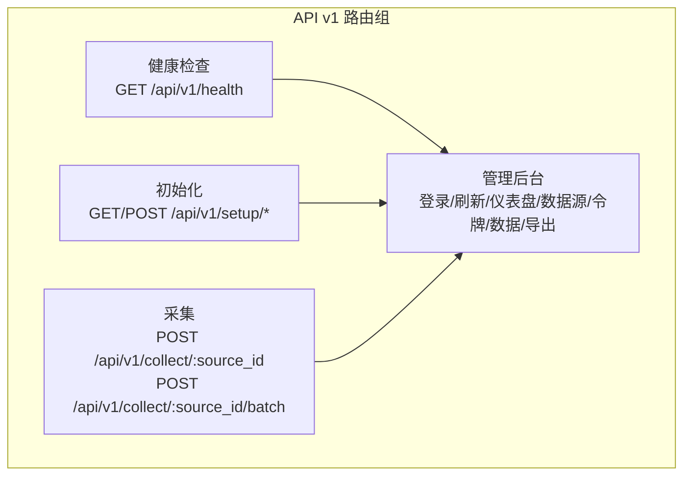
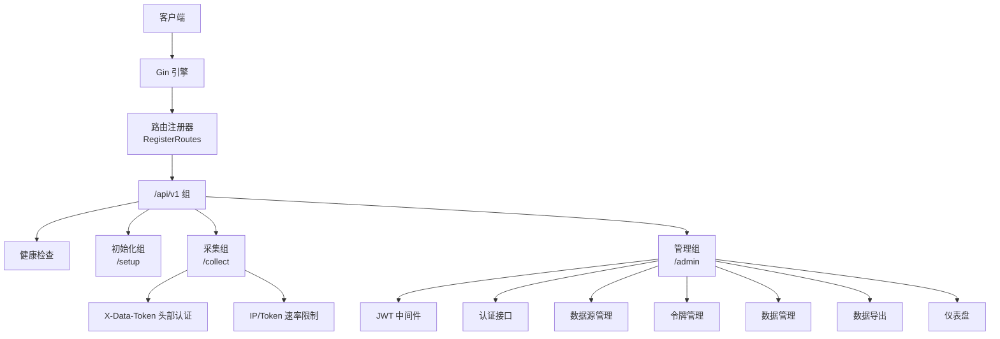
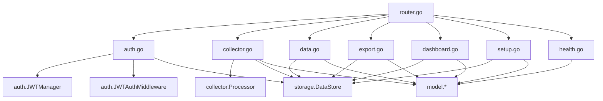

# API接口文档

<cite>
**本文档引用的文件**
- [router.go](file://internal/api/router.go)
- [auth.go](file://internal/api/auth.go)
- [collector.go](file://internal/api/collector.go)
- [data.go](file://internal/api/data.go)
- [export.go](file://internal/api/export.go)
- [dashboard.go](file://internal/api/dashboard.go)
- [setup.go](file://internal/api/setup.go)
- [health.go](file://internal/api/health.go)
- [jwt.go](file://internal/auth/jwt.go)
- [middleware.go](file://internal/auth/middleware.go)
- [errors.go](file://internal/model/errors.go)
- [response.go](file://internal/model/response.go)
- [record.go](file://internal/model/record.go)
- [source.go](file://internal/model/source.go)
- [token.go](file://internal/model/token.go)
</cite>

## 目录
1. [简介](#简介)
2. [项目结构](#项目结构)
3. [核心组件](#核心组件)
4. [架构总览](#架构总览)
5. [详细组件分析](#详细组件分析)
6. [依赖关系分析](#依赖关系分析)
7. [性能考虑](#性能考虑)
8. [故障排查指南](#故障排查指南)
9. [结论](#结论)
10. [附录](#附录)

## 简介
本文件为 DataCollector 的 API 接口文档，覆盖所有 RESTful 端点的 HTTP 方法、URL 模式、请求参数、响应格式，并对认证机制（X-Data-Token 头部认证、JWT 认证）、错误码体系、状态码含义、错误处理策略、API 版本控制与向后兼容性进行详细说明。同时提供各接口的请求与响应示例路径，帮助开发者快速集成。

## 项目结构
API 路由集中在统一入口注册，按功能划分为多个处理器模块：
- 路由注册：/api/v1 下的所有端点
- 认证与会话：登录、刷新 Token
- 系统初始化：状态检查、数据库连通性测试、初始化、重新初始化
- 数据采集：单条与批量数据提交
- 数据管理：分页查询、删除、批量删除
- 数据导出：CSV/JSON 导出
- 仪表盘：统计与趋势
- 健康检查：服务可用性检测

图表来源
- [router.go:33-114](file://internal/api/router.go#L33-L114)

章节来源
- [router.go:12-116](file://internal/api/router.go#L12-L116)

## 核心组件
- 路由注册器：集中注册所有 API v1 路由，按需挂载限流与认证中间件
- 处理器集合：认证、采集、数据管理、导出、仪表盘、初始化、健康检查
- 统一响应模型：统一的响应结构与错误码体系
- 认证中间件：基于 JWT 的鉴权与角色校验

章节来源
- [router.go:14-31](file://internal/api/router.go#L14-L31)
- [response.go:9-72](file://internal/model/response.go#L9-L72)
- [errors.go:3-84](file://internal/model/errors.go#L3-L84)

## 架构总览
API v1 采用分组路由，采集端点使用头部认证，管理端点使用 JWT 认证；采集端点还叠加了 IP 与 Token 的速率限制。

图表来源
- [router.go:33-114](file://internal/api/router.go#L33-L114)

## 详细组件分析

### 认证接口
- 登录
  - 方法与路径：POST /api/v1/admin/login
  - 请求体字段：username（必填）、password（必填）
  - 成功响应字段：token、expires_in
  - 失败场景：用户名不存在、密码错误、账户被禁用、生成 Token 失败
  - 示例路径：[登录请求示例:26-30](file://internal/api/auth.go#L26-L30)，[登录响应示例:73-76](file://internal/api/auth.go#L73-L76)

- 刷新 Token
  - 方法与路径：POST /api/v1/admin/refresh-token
  - 请求头：Authorization: Bearer <token>
  - 成功响应字段：token、expires_in
  - 失败场景：缺少或格式错误的 Authorization 头、Token 已过期、刷新条件不满足、刷新失败
  - 示例路径：[刷新请求解析:87-107](file://internal/api/auth.go#L87-L107)，[刷新响应示例:122-125](file://internal/api/auth.go#L122-L125)

章节来源
- [auth.go:38-126](file://internal/api/auth.go#L38-L126)
- [jwt.go](file://internal/auth/jwt.go)
- [middleware.go](file://internal/auth/middleware.go)

### 系统初始化接口
- 检查初始化状态
  - 方法与路径：GET /api/v1/setup/status
  - 响应字段：initialized（布尔）
  - 示例路径：[状态检查:40-49](file://internal/api/setup.go#L40-L49)

- 测试数据库连接
  - 方法与路径：POST /api/v1/setup/test-db
  - 请求体字段：driver（必填，支持 sqlite/postgres）、host、port、user、password、dbname
  - 成功响应：连接成功提示
  - 失败场景：SQLite 不需要测试、不支持的驱动、连接失败
  - 示例路径：[数据库测试:62-104](file://internal/api/setup.go#L62-L104)

- 初始化系统
  - 方法与路径：POST /api/v1/setup/init
  - 请求体字段：database.driver（必填）、database.sqlite 或 database.postgres、server.port（必填）、admin.username（必填）、admin.password（必填，最小长度6）
  - 成功响应：初始化成功提示
  - 失败场景：已初始化、密码加密失败、创建管理员失败、写入配置失败
  - 示例路径：[初始化请求体:107-131](file://internal/api/setup.go#L107-L131)，[初始化流程:132-195](file://internal/api/setup.go#L132-L195)

- 重新初始化系统
  - 方法与路径：POST /api/v1/setup/reinit（需 JWT + admin 角色）
  - 请求体字段：confirm（必须为 "REINITIALIZE"）
  - 成功响应：重置完成提示
  - 失败场景：权限不足、确认字符串无效、重置配置失败
  - 示例路径：[重新初始化:203-235](file://internal/api/setup.go#L203-L235)

章节来源
- [setup.go:40-235](file://internal/api/setup.go#L40-L235)

### 数据采集接口
- 单条数据采集
  - 方法与路径：POST /api/v1/collect/:source_id
  - 请求头：X-Data-Token（必填）
  - 请求体：任意 JSON 对象（受数据源 schema_config 限制）
  - 成功响应字段：record_id
  - 失败场景：缺少 X-Data-Token、Token 无效/禁用/过期、source_id 不匹配、请求体无效、验证失败、保存失败
  - 示例路径：[单条采集流程:29-140](file://internal/api/collector.go#L29-L140)

- 批量数据采集
  - 方法与路径：POST /api/v1/collect/:source_id/batch
  - 请求头：X-Data-Token（必填）
  - 请求体字段：records（必填，非空数组），每项为任意 JSON 对象
  - 成功响应字段：total、succeeded、failed、record_ids（过滤后的有效 ID 列表）
  - 失败场景：缺少 X-Data-Token、Token 无效/禁用/过期、source_id 不匹配、请求体无效、验证失败、批量处理全部失败
  - 示例路径：[批量采集流程:142-278](file://internal/api/collector.go#L142-L278)

- 速率限制
  - IP 速率限制与 Token 速率限制在 /api/v1/collect 组上启用
  - 示例路径：[路由组与中间件挂载:49-55](file://internal/api/router.go#L49-L55)

章节来源
- [collector.go:29-278](file://internal/api/collector.go#L29-L278)
- [router.go:49-55](file://internal/api/router.go#L49-L55)

### 数据管理接口
- 查询数据记录
  - 方法与路径：GET /api/v1/admin/data
  - 查询参数：source_id、start_date、end_date、page（默认1）、size（默认20，最大100）
  - 成功响应：分页结果（total、list）
  - 失败场景：查询参数错误、内部错误
  - 示例路径：[查询接口:29-53](file://internal/api/data.go#L29-L53)

- 删除单条记录
  - 方法与路径：DELETE /api/v1/admin/data/:id
  - 成功响应：删除成功消息
  - 失败场景：参数无效、内部错误
  - 示例路径：[删除单条:55-69](file://internal/api/data.go#L55-L69)

- 批量删除记录
  - 方法与路径：POST /api/v1/admin/data/batch-delete
  - 请求体字段：ids（必填，非空数组）
  - 成功响应：删除成功消息与数量
  - 失败场景：参数缺失、ids 为空、内部错误
  - 示例路径：[批量删除:72-96](file://internal/api/data.go#L72-L96)

章节来源
- [data.go:29-96](file://internal/api/data.go#L29-L96)

### 数据导出接口
- 导出数据
  - 方法与路径：GET /api/v1/admin/data/export
  - 查询参数：format（可选，默认 csv，支持 csv/json）、source_id、start_date、end_date、page、size
  - 成功响应：根据 format 返回 CSV 或 JSON 文件下载（Content-Disposition）
  - 失败场景：format 参数错误、内部错误
  - 示例路径：[导出主流程:28-61](file://internal/api/export.go#L28-L61)，[CSV 导出:63-97](file://internal/api/export.go#L63-L97)，[JSON 导出:99-110](file://internal/api/export.go#L99-L110)

章节来源
- [export.go:28-110](file://internal/api/export.go#L28-L110)

### 仪表盘接口
- 仪表盘概览
  - 方法与路径：GET /api/v1/admin/dashboard
  - 响应字段：today_count、week_count、month_count、total_sources、recent_records
  - 示例路径：[仪表盘概览:34-94](file://internal/api/dashboard.go#L34-L94)

- 仪表盘趋势
  - 方法与路径：GET /api/v1/admin/dashboard/trend
  - 查询参数：start_date（必填）、end_date（必填）、source_id（可选）、token_id（可选）
  - 响应字段：趋势点数组（按日期聚合）
  - 失败场景：参数缺失或无效、内部错误
  - 示例路径：[趋势查询:97-137](file://internal/api/dashboard.go#L97-L137)

章节来源
- [dashboard.go:34-137](file://internal/api/dashboard.go#L34-L137)

### 健康检查接口
- 健康检查
  - 方法与路径：GET /api/v1/health
  - 响应字段：status（healthy/unhealthy）、version、uptime、database（connected/disconnected）
  - 失败场景：数据库连接失败（返回 503）
  - 示例路径：[健康检查:36-63](file://internal/api/health.go#L36-L63)

章节来源
- [health.go:36-63](file://internal/api/health.go#L36-L63)

### 数据源与令牌管理接口
- 数据源管理
  - 列表：GET /api/v1/admin/sources（page、size）
  - 创建：POST /api/v1/admin/sources（name、description、schema_config）
  - 更新：PUT /api/v1/admin/sources/:id（name、description、schema_config）
  - 删除：DELETE /api/v1/admin/sources/:id（软删除）
  - 示例路径：[数据源 CRUD:39-168](file://internal/api/source.go#L39-L168)

- 令牌管理
  - 在数据源下创建：POST /api/v1/admin/sources/:id/tokens（name、expires_at）
  - 列表：GET /api/v1/admin/sources/:id/tokens（仅返回元信息，不包含明文或哈希）
  - 独立更新状态：PUT /api/v1/admin/tokens/:id/status（status: 0/1）
  - 独立删除：DELETE /api/v1/admin/tokens/:id
  - 示例路径：[令牌管理:64-179](file://internal/api/token.go#L64-L179)

章节来源
- [source.go:39-168](file://internal/api/source.go#L39-L168)
- [token.go:64-179](file://internal/api/token.go#L64-L179)

## 依赖关系分析
- 路由注册依赖 Gin 引擎与各处理器实例
- 采集端点依赖存储层的 Token/Source 查询与 Processor 的数据处理
- 管理端点依赖 JWT 中间件与存储层的 CRUD 操作
- 统一响应与错误码由 model 层提供

图表来源
- [router.go:14-31](file://internal/api/router.go#L14-L31)
- [auth.go:12-24](file://internal/api/auth.go#L12-L24)
- [collector.go:15-27](file://internal/api/collector.go#L15-L27)

章节来源
- [router.go:14-31](file://internal/api/router.go#L14-L31)

## 性能考虑
- 采集端点在 /api/v1/collect 组上启用了 IP 速率限制与 Token 速率限制中间件，建议根据业务流量合理配置阈值
- 批量采集支持一次性处理多条记录，建议控制单次批量大小以平衡吞吐与资源占用
- 导出接口按查询参数获取全量数据，建议配合分页参数与时间范围限制，避免大范围导出导致内存压力

## 故障排查指南
- 常见错误码与含义
  - 1000：无效的Token（采集端点）
  - 1001：Token已禁用（采集端点）
  - 1002：数据验证失败（采集端点）
  - 1003：请求频率超限（采集端点）
  - 2000：登录失败（认证）
  - 2001：Token已过期（认证）
  - 2002：权限不足（认证/管理）
  - 2003：无效的JWT（认证）
  - 3000：数据源不存在（管理）
  - 3001：创建数据源失败（管理）
  - 3002：更新数据源失败（管理）
  - 3003：删除数据源失败（管理）
  - 4000：查询参数错误（查询/导出）
  - 4001：导出失败（导出）
  - 5000：系统状态异常（健康检查）
  - 5001：系统初始化失败（初始化）
  - 5002：系统已初始化（初始化）
  - 9000：缺少必要参数（通用）
  - 9001：内部错误（通用）
  - 9002：未知错误（通用）

- 典型问题定位
  - 采集失败：检查 X-Data-Token 是否正确、是否过期、source_id 是否匹配、请求体是否符合 schema_config
  - 认证失败：确认 Authorization 头格式为 Bearer <token>，检查 JWT 是否过期或角色权限
  - 导出异常：确认 format 参数为 csv 或 json，检查查询参数与数据量
  - 初始化失败：检查数据库驱动与连接参数，确认未重复初始化

章节来源
- [errors.go:3-84](file://internal/model/errors.go#L3-L84)
- [response.go:35-71](file://internal/model/response.go#L35-L71)

## 结论
本 API 文档覆盖了 DataCollector 的核心接口与认证机制，明确了各端点的请求/响应规范、错误码与处理策略。建议在生产环境中结合速率限制与访问控制策略，确保系统的稳定性与安全性。

## 附录

### 统一响应结构
- 成功响应：code=0，message 为默认成功消息，data 为具体数据
- 错误响应：code 为错误码，message 为默认或自定义消息，errors（可选）为详细错误信息
- 示例路径：[统一响应模型:9-71](file://internal/model/response.go#L9-L71)

### 数据模型要点
- 数据记录：包含 source_id、token_id、data（JSON）、ip_address、user_agent、created_at
- 数据源：包含 name、description、schema_config（JSON）、status、created_by、created_at、updated_at、token_count
- 令牌：包含 name、status、expires_at、last_used_at、created_by、created_at
- 查询过滤：支持 source_id、start_date、end_date、page、size

章节来源
- [record.go:8-32](file://internal/model/record.go#L8-L32)
- [source.go:8-34](file://internal/model/source.go#L8-L34)
- [token.go:5-16](file://internal/model/token.go#L5-L16)