# 仪表板监控接口

<cite>
**本文档引用的文件**
- [internal/api/dashboard.go](file://internal/api/dashboard.go)
- [internal/api/router.go](file://internal/api/router.go)
- [internal/monitor/websocket.go](file://internal/monitor/websocket.go)
- [internal/monitor/aggregator.go](file://internal/monitor/aggregator.go)
- [internal/collector/processor.go](file://internal/collector/processor.go)
- [internal/model/statistics.go](file://internal/model/statistics.go)
- [internal/storage/postgres/statistics.go](file://internal/storage/postgres/statistics.go)
- [web/src/types/dashboard.ts](file://web/src/types/dashboard.ts)
- [web/src/api/dashboard.ts](file://web/src/api/dashboard.ts)
- [web/src/composables/useWebSocket.ts](file://web/src/composables/useWebSocket.ts)
- [configs/config.yaml](file://configs/config.yaml)
</cite>

## 目录
1. [简介](#简介)
2. [项目结构](#项目结构)
3. [核心组件](#核心组件)
4. [架构概览](#架构概览)
5. [详细组件分析](#详细组件分析)
6. [依赖关系分析](#依赖关系分析)
7. [性能考虑](#性能考虑)
8. [故障排除指南](#故障排除指南)
9. [结论](#结论)

## 简介

DataCollector 是一个数据收集和监控系统，提供了完整的仪表板监控接口。本文档详细介绍了以下三个核心接口：

- **仪表板数据接口**：获取实时统计数据（GET /api/v1/admin/dashboard）
- **趋势数据接口**：获取历史趋势数据（GET /api/v1/admin/dashboard/trend）
- **WebSocket 实时监控接口**：建立实时数据推送连接（GET /api/v1/admin/ws/monitor）

这些接口支持管理员用户进行数据监控和分析，提供从静态数据到实时推送的完整监控解决方案。

## 项目结构

DataCollector 采用分层架构设计，主要分为以下几个层次：

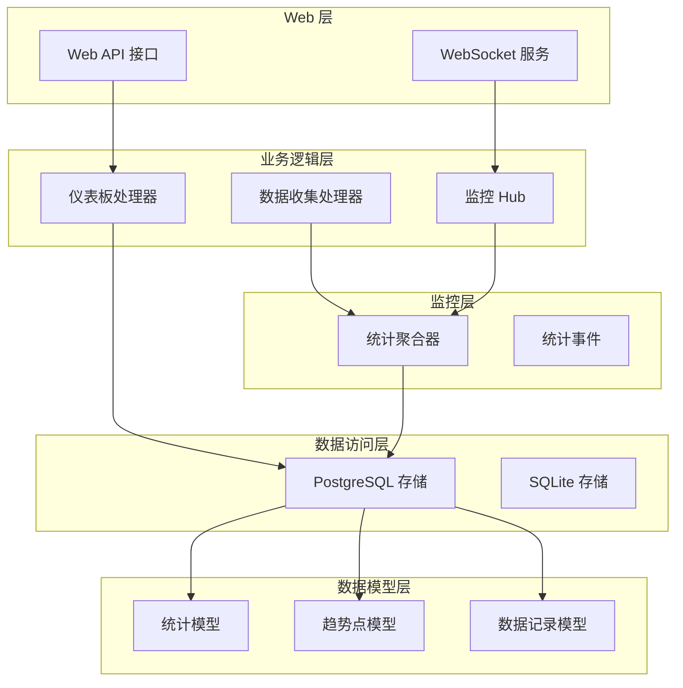

**图表来源**
- [internal/api/dashboard.go:1-139](file://internal/api/dashboard.go#L1-L139)
- [internal/monitor/websocket.go:1-216](file://internal/monitor/websocket.go#L1-L216)
- [internal/monitor/aggregator.go:1-197](file://internal/monitor/aggregator.go#L1-L197)

**章节来源**
- [internal/api/dashboard.go:1-139](file://internal/api/dashboard.go#L1-L139)
- [internal/api/router.go:1-116](file://internal/api/router.go#L1-L116)

## 核心组件

### 仪表板处理器 (DashboardHandler)

仪表板处理器负责处理仪表板相关的 API 请求，包括获取实时统计数据和趋势数据。

**主要功能**：
- 计算今日、本周、本月的数据量统计
- 获取数据源总数
- 查询最近的数据记录
- 提供趋势数据查询接口

**数据结构**：
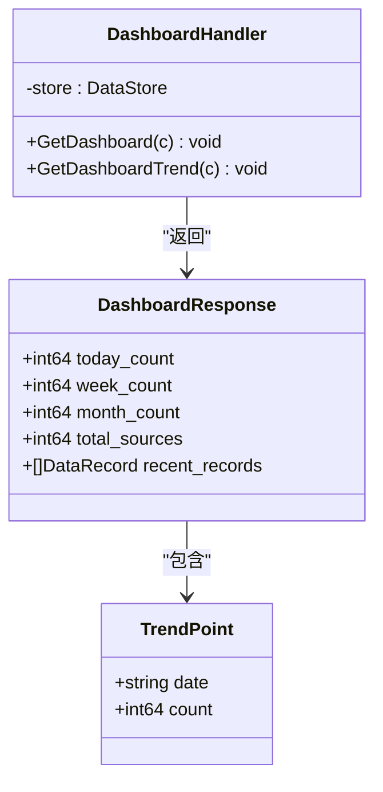

**图表来源**
- [internal/api/dashboard.go:13-32](file://internal/api/dashboard.go#L13-L32)
- [internal/model/statistics.go:15-20](file://internal/model/statistics.go#L15-L20)

**章节来源**
- [internal/api/dashboard.go:13-95](file://internal/api/dashboard.go#L13-L95)
- [internal/model/statistics.go:15-20](file://internal/model/statistics.go#L15-L20)

### WebSocket 监控系统

WebSocket 监控系统提供了实时数据推送功能，通过 Hub 模式管理所有客户端连接。

**核心组件**：
- **WebSocketHub**：管理所有 WebSocket 连接的中心节点
- **Client**：代表单个 WebSocket 客户端连接
- **WSMessage**：WebSocket 消息格式定义

**消息类型**：
- `stats_update`：统计更新通知，触发客户端重新获取数据

**章节来源**
- [internal/monitor/websocket.go:14-216](file://internal/monitor/websocket.go#L14-L216)

### 统计聚合器 (Aggregator)

统计聚合器负责处理数据收集过程中的统计事件，并将增量数据持久化到数据库。

**核心特性**：
- 增量计数：内存中维护每个数据源的计数器
- 定时刷新：每 60 秒将内存中的计数器持久化到数据库
- 事件驱动：接收来自数据处理器的统计事件

**章节来源**
- [internal/monitor/aggregator.go:17-197](file://internal/monitor/aggregator.go#L17-L197)

## 架构概览

DataCollector 的监控架构采用了事件驱动的设计模式，实现了从数据收集到实时推送的完整链路：

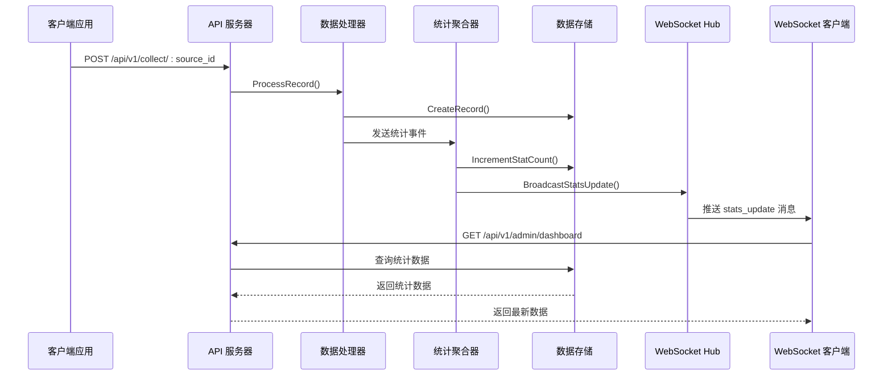

**图表来源**
- [internal/collector/processor.go:30-52](file://internal/collector/processor.go#L30-L52)
- [internal/monitor/aggregator.go:89-133](file://internal/monitor/aggregator.go#L89-L133)
- [internal/monitor/websocket.go:108-127](file://internal/monitor/websocket.go#L108-L127)

## 详细组件分析

### 仪表板数据接口 (GET /api/v1/admin/dashboard)

#### 接口规范
- **HTTP 方法**：GET
- **路径**：/api/v1/admin/dashboard
- **认证**：需要 JWT 令牌
- **响应类型**：JSON

#### 响应数据结构

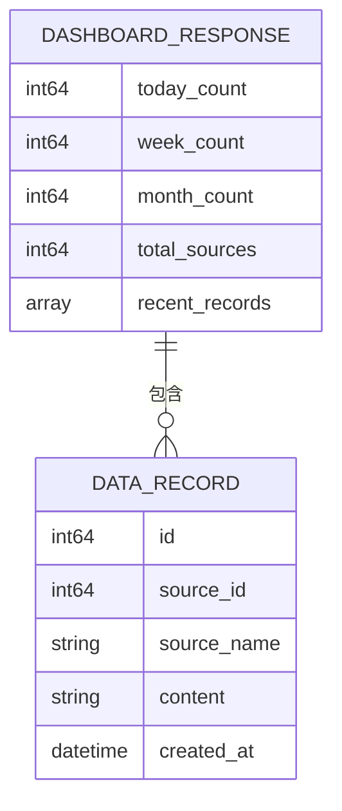

**图表来源**
- [internal/api/dashboard.go:25-32](file://internal/api/dashboard.go#L25-L32)
- [internal/model/statistics.go:5-13](file://internal/model/statistics.go#L5-L13)

#### 数据计算逻辑

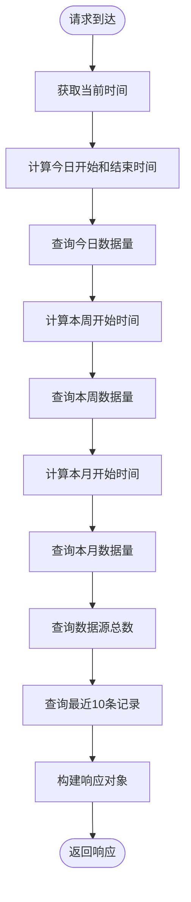

**图表来源**
- [internal/api/dashboard.go:34-95](file://internal/api/dashboard.go#L34-L95)

**章节来源**
- [internal/api/dashboard.go:34-95](file://internal/api/dashboard.go#L34-L95)

### 趋势数据接口 (GET /api/v1/admin/dashboard/trend)

#### 接口规范
- **HTTP 方法**：GET
- **路径**：/api/v1/admin/dashboard/trend
- **认证**：需要 JWT 令牌
- **查询参数**：
  - `start_date` (必需)：开始日期，格式 YYYY-MM-DD
  - `end_date` (必需)：结束日期，格式 YYYY-MM-DD
  - `source_id` (可选)：数据源 ID
  - `token_id` (可选)：Token ID

#### 响应数据结构

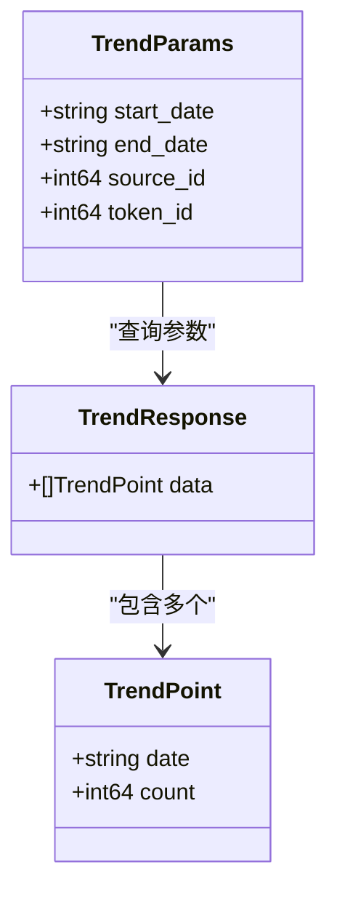

**图表来源**
- [internal/model/statistics.go:15-20](file://internal/model/statistics.go#L15-L20)
- [web/src/types/dashboard.ts:11-22](file://web/src/types/dashboard.ts#L11-L22)

#### 查询逻辑

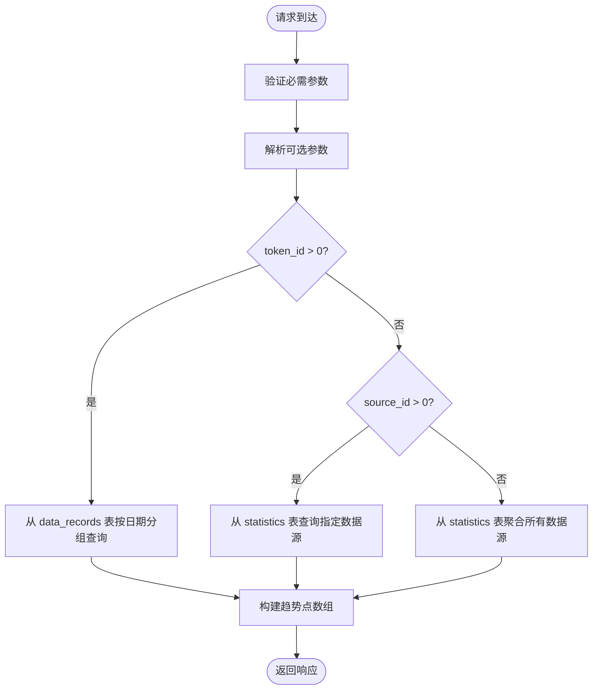

**图表来源**
- [internal/api/dashboard.go:97-139](file://internal/api/dashboard.go#L97-L139)
- [internal/storage/postgres/statistics.go:86-142](file://internal/storage/postgres/statistics.go#L86-L142)

**章节来源**
- [internal/api/dashboard.go:97-139](file://internal/api/dashboard.go#L97-L139)
- [internal/storage/postgres/statistics.go:86-142](file://internal/storage/postgres/statistics.go#L86-L142)

### WebSocket 实时监控接口 (GET /api/v1/admin/ws/monitor)

#### 连接建立流程

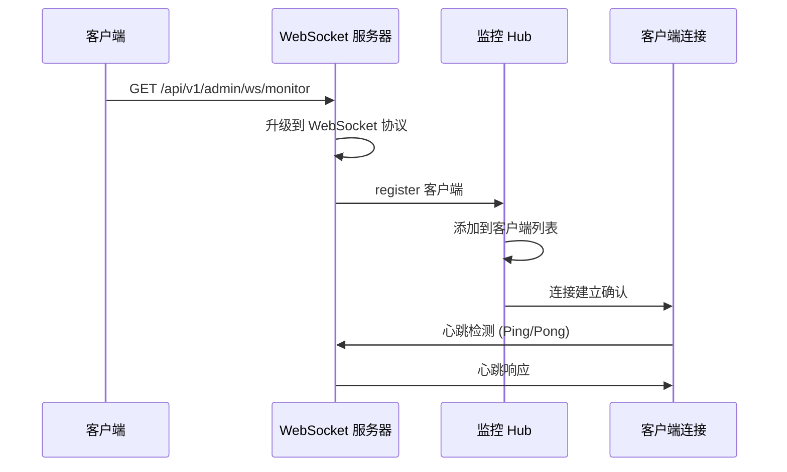

**图表来源**
- [internal/monitor/websocket.go:129-147](file://internal/monitor/websocket.go#L129-L147)

#### 消息格式

**消息结构**：
```json
{
  "type": "stats_update",
  "data": {
    "action": "refresh"
  }
}
```

**消息类型**：
- `stats_update`：统计更新通知，指示客户端重新获取最新数据

#### 连接管理

**客户端生命周期**：
1. **连接建立**：客户端发起 WebSocket 连接
2. **心跳维持**：每 30 秒发送 Ping 消息，超时时间为 10 秒
3. **自动重连**：连接断开后 5 秒自动重连
4. **资源清理**：组件卸载时自动关闭连接

**章节来源**
- [internal/monitor/websocket.go:129-216](file://internal/monitor/websocket.go#L129-L216)
- [web/src/composables/useWebSocket.ts:1-66](file://web/src/composables/useWebSocket.ts#L1-L66)

### 统计聚合算法

#### 数据收集流程

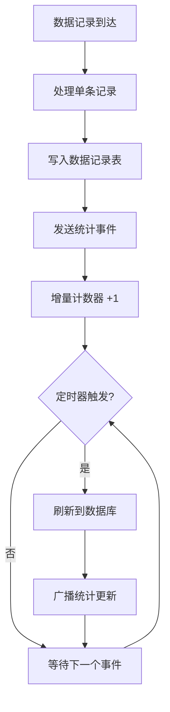

**图表来源**
- [internal/collector/processor.go:30-52](file://internal/collector/processor.go#L30-L52)
- [internal/monitor/aggregator.go:52-74](file://internal/monitor/aggregator.go#L52-L74)

#### 聚合策略

**更新频率**：
- **内存计数**：实时更新，无延迟
- **数据库持久化**：每 60 秒刷新一次
- **WebSocket 推送**：数据库更新完成后立即推送

**数据一致性**：
- 内存中的增量数据保证实时性
- 定时刷新确保数据持久化
- WebSocket 推送触发客户端重新拉取最新数据

**章节来源**
- [internal/monitor/aggregator.go:47-133](file://internal/monitor/aggregator.go#L47-L133)

## 依赖关系分析

### 组件依赖图

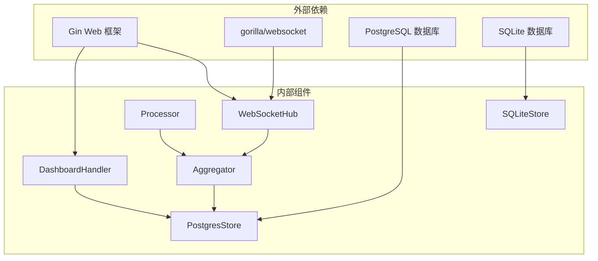

**图表来源**
- [internal/api/dashboard.go:3-11](file://internal/api/dashboard.go#L3-L11)
- [internal/monitor/websocket.go:3-12](file://internal/monitor/websocket.go#L3-L12)
- [internal/monitor/aggregator.go:3-12](file://internal/monitor/aggregator.go#L3-L12)

### 数据流依赖

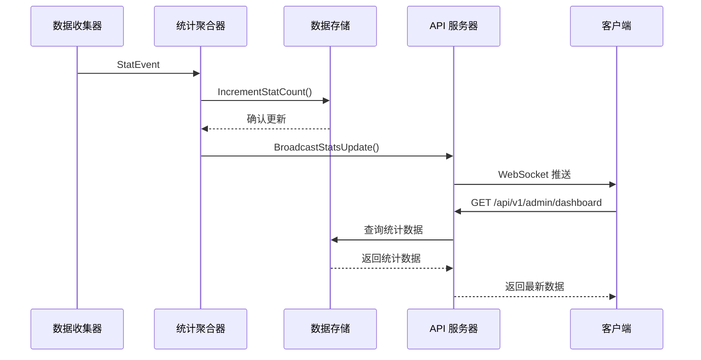

**图表来源**
- [internal/collector/processor.go:42-49](file://internal/collector/processor.go#L42-L49)
- [internal/monitor/aggregator.go:130-132](file://internal/monitor/aggregator.go#L130-L132)
- [internal/api/dashboard.go:88-94](file://internal/api/dashboard.go#L88-L94)

**章节来源**
- [internal/api/dashboard.go:1-139](file://internal/api/dashboard.go#L1-L139)
- [internal/monitor/aggregator.go:1-197](file://internal/monitor/aggregator.go#L1-L197)

## 性能考虑

### 数据库优化

**索引策略**：
- `statistics` 表：`(source_id, stat_date)` 复合索引
- `data_records` 表：`token_id` 和 `created_at` 索引
- `sources` 表：`id` 主键索引

**查询优化**：
- 使用 UPSERT 操作减少查询次数
- 分页查询最近记录，限制结果数量
- 合理使用 WHERE 条件和 ORDER BY

### 内存管理

**计数器管理**：
- 内存中的计数器使用互斥锁保护
- 定时刷新避免内存泄漏
- 支持强制刷新用于测试场景

**WebSocket 连接管理**：
- 连接池大小限制
- 发送缓冲区大小控制
- 自动清理超时连接

### 缓存策略

**客户端缓存**：
- WebSocket 推送触发客户端重新拉取
- API 响应包含适当的缓存头
- 支持条件请求减少网络流量

## 故障排除指南

### 常见问题及解决方案

**WebSocket 连接问题**：
1. **连接失败**：检查服务器是否正确升级到 WebSocket 协议
2. **连接断开**：确认客户端的心跳机制正常工作
3. **消息丢失**：检查发送缓冲区是否溢出

**API 接口问题**：
1. **认证失败**：验证 JWT 令牌的有效性和权限
2. **参数错误**：检查查询参数的格式和有效性
3. **数据库连接**：确认数据库连接池配置正确

**性能问题**：
1. **响应缓慢**：检查数据库查询是否使用了适当索引
2. **内存泄漏**：监控计数器的内存使用情况
3. **连接过多**：调整连接池大小和超时设置

### 日志监控

**关键日志点**：
- WebSocket 连接建立和断开
- 统计事件处理和持久化
- 数据库操作的错误信息
- API 请求的处理时间和状态码

**章节来源**
- [internal/monitor/websocket.go:64-106](file://internal/monitor/websocket.go#L64-L106)
- [internal/monitor/aggregator.go:115-125](file://internal/monitor/aggregator.go#L115-L125)

## 结论

DataCollector 的仪表板监控接口提供了完整的数据监控解决方案，具有以下特点：

**实时性**：通过 WebSocket 实时推送统计更新，确保用户获得最新的数据状态。

**准确性**：采用增量计数和定时刷新的双重机制，保证数据的准确性和一致性。

**可扩展性**：模块化的架构设计支持水平扩展和功能扩展。

**易用性**：清晰的 API 设计和完善的错误处理机制，便于集成和使用。

该监控系统适用于需要实时数据监控和分析的应用场景，能够满足从简单到复杂的各种监控需求。