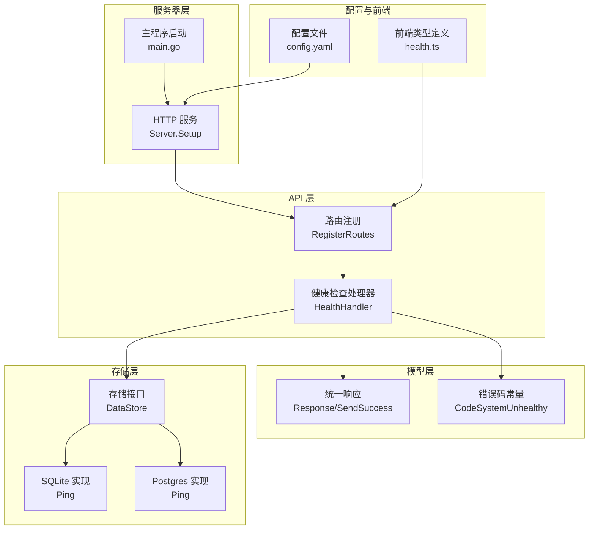
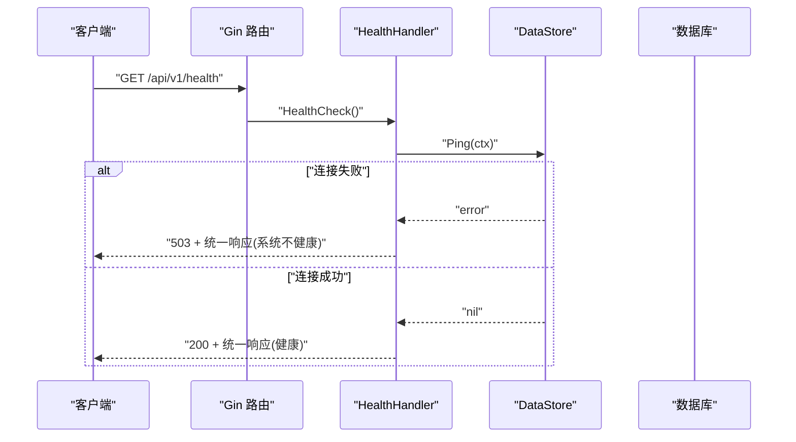
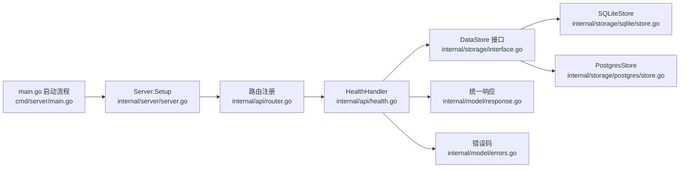

# 健康检查接口

<cite>
**本文引用的文件**
- [internal/api/health.go](file://internal/api/health.go)
- [internal/api/router.go](file://internal/api/router.go)
- [internal/model/response.go](file://internal/model/response.go)
- [internal/model/errors.go](file://internal/model/errors.go)
- [internal/storage/interface.go](file://internal/storage/interface.go)
- [internal/storage/sqlite/store.go](file://internal/storage/sqlite/store.go)
- [internal/storage/postgres/store.go](file://internal/storage/postgres/store.go)
- [internal/server/server.go](file://internal/server/server.go)
- [configs/config.yaml](file://configs/config.yaml)
- [web/src/api/health.ts](file://web/src/api/health.ts)
- [cmd/server/main.go](file://cmd/server/main.go)
- [Dockerfile](file://Dockerfile)
- [docker-compose.yml](file://docker-compose.yml)
</cite>

## 目录
1. [简介](#简介)
2. [项目结构](#项目结构)
3. [核心组件](#核心组件)
4. [架构总览](#架构总览)
5. [详细组件分析](#详细组件分析)
6. [依赖分析](#依赖分析)
7. [性能考虑](#性能考虑)
8. [故障排查指南](#故障排查指南)
9. [结论](#结论)
10. [附录](#附录)

## 简介
本文件为 DataCollector 的健康检查接口提供权威且可操作的 API 文档。目标读者包括运维工程师、平台开发者与 SRE 团队。内容涵盖：
- 接口定义与访问方式
- 响应格式与状态码含义
- 健康检查的维度与实现原理
- 配置参数与扩展点
- 结果解读与故障诊断
- 在容器编排与负载均衡中的应用
- 最佳实践与监控告警建议

## 项目结构
与健康检查直接相关的代码分布在以下模块：
- API 层：路由注册与处理器
- 存储层：数据库连接抽象与具体实现
- 模型层：统一响应与错误码
- 服务器层：启动流程与中间件
- 配置层：数据库驱动与运行参数
- 前端：健康检查调用示例类型定义

**图表来源**
- [internal/api/router.go:14-37](file://internal/api/router.go#L14-L37)
- [internal/api/health.go:12-64](file://internal/api/health.go#L12-L64)
- [internal/model/response.go:9-72](file://internal/model/response.go#L9-L72)
- [internal/model/errors.go:4-38](file://internal/model/errors.go#L4-L38)
- [internal/storage/interface.go:9-56](file://internal/storage/interface.go#L9-L56)
- [internal/storage/sqlite/store.go:82-85](file://internal/storage/sqlite/store.go#L82-L85)
- [internal/storage/postgres/store.go:57-60](file://internal/storage/postgres/store.go#L57-L60)
- [internal/server/server.go:54-87](file://internal/server/server.go#L54-L87)
- [cmd/server/main.go:25-129](file://cmd/server/main.go#L25-L129)
- [configs/config.yaml:11-22](file://configs/config.yaml#L11-L22)
- [web/src/api/health.ts:10-12](file://web/src/api/health.ts#L10-L12)

**章节来源**
- [internal/api/router.go:14-37](file://internal/api/router.go#L14-L37)
- [internal/api/health.go:12-64](file://internal/api/health.go#L12-L64)
- [internal/server/server.go:54-87](file://internal/server/server.go#L54-L87)
- [cmd/server/main.go:25-129](file://cmd/server/main.go#L25-L129)

## 核心组件
- 健康检查处理器：负责执行数据库连通性检查与构造响应。
- 存储接口与实现：通过 Ping 方法抽象不同数据库驱动的连通性检测。
- 统一响应与错误码：封装标准响应结构与错误码映射。
- 路由注册：将 /api/v1/health 暴露为无需认证的公开接口。

关键职责与交互：
- 处理器在请求到达时调用存储层 Ping，若失败则返回系统不健康状态；成功则返回健康状态并附带版本、运行时长与数据库连接状态。
- 统一响应工具保证响应体结构一致，便于客户端与监控系统解析。

**章节来源**
- [internal/api/health.go:12-64](file://internal/api/health.go#L12-L64)
- [internal/storage/interface.go:9-14](file://internal/storage/interface.go#L9-L14)
- [internal/model/response.go:9-72](file://internal/model/response.go#L9-L72)
- [internal/model/errors.go:4-38](file://internal/model/errors.go#L4-L38)

## 架构总览
健康检查在系统中的位置与调用链如下：

**图表来源**
- [internal/api/router.go:34-37](file://internal/api/router.go#L34-L37)
- [internal/api/health.go:36-63](file://internal/api/health.go#L36-L63)
- [internal/storage/interface.go:14](file://internal/storage/interface.go#L14)
- [internal/model/response.go:58-61](file://internal/model/response.go#L58-L61)
- [internal/model/errors.go:29-32](file://internal/model/errors.go#L29-L32)

## 详细组件分析

### 接口定义与访问方式
- 方法：GET
- 路径：/api/v1/health
- 认证：无需认证
- 路由注册位置：v1 路由组内公开暴露

**章节来源**
- [internal/api/router.go:34-37](file://internal/api/router.go#L34-L37)

### 响应格式
健康检查返回统一响应结构，包含业务字段与系统字段：
- 业务字段
  - status：字符串，"healthy" 或 "unhealthy"
  - version：字符串，服务版本号
  - uptime：字符串，服务运行时长（Go 时间字符串）
  - database：字符串，"connected" 或 "disconnected"
- 统一响应字段
  - code：整数，业务错误码
  - message：字符串，错误消息
  - data：对象，包含上述业务字段

前端类型定义参考：
- [web/src/api/health.ts:3-8](file://web/src/api/health.ts#L3-L8)

**章节来源**
- [internal/api/health.go:28-34](file://internal/api/health.go#L28-L34)
- [internal/model/response.go:9-15](file://internal/model/response.go#L9-L15)
- [web/src/api/health.ts:10-12](file://web/src/api/health.ts#L10-L12)

### 状态码与含义
- 200 OK
  - 表示数据库连通正常，服务处于健康状态
  - 返回字段 status 为 "healthy"，database 为 "connected"
- 503 Service Unavailable
  - 表示数据库连通性检查失败，服务处于不健康状态
  - 返回统一响应，其中 code 对应系统不健康错误码，message 为对应错误消息，data.status 为 "unhealthy"，data.database 为 "disconnected"

错误码定义参考：
- [internal/model/errors.go:29-32](file://internal/model/errors.go#L29-L32)

**章节来源**
- [internal/api/health.go:42-53](file://internal/api/health.go#L42-L53)
- [internal/model/errors.go:29-32](file://internal/model/errors.go#L29-L32)

### 健康检查维度
- 数据库连接状态
  - 通过存储接口的 Ping 方法进行连通性测试
  - SQLite 实现：[internal/storage/sqlite/store.go:82-85](file://internal/storage/sqlite/store.go#L82-L85)
  - Postgres 实现：[internal/storage/postgres/store.go:57-60](file://internal/storage/postgres/store.go#L57-L60)
- 服务可用性
  - 仅依赖 HTTP 路由可达与处理器逻辑执行，不涉及业务数据读写
- 系统资源使用情况
  - 当前实现未包含 CPU、内存、磁盘等指标；如需扩展，可在处理器中增加相应检查并返回到 data 字段

**章节来源**
- [internal/api/health.go:36-63](file://internal/api/health.go#L36-L63)
- [internal/storage/sqlite/store.go:82-85](file://internal/storage/sqlite/store.go#L82-L85)
- [internal/storage/postgres/store.go:57-60](file://internal/storage/postgres/store.go#L57-L60)

### 配置参数与自定义检查项
- 数据库驱动与连接参数
  - 驱动类型：sqlite 或 postgres
  - SQLite：本地文件路径
  - Postgres：主机、端口、用户、密码、库名、SSL 模式
  - 参考配置：[configs/config.yaml:11-22](file://configs/config.yaml#L11-L22)
- 版本号
  - 处理器构造时注入的版本号，当前固定为 "1.0.0"
  - 参考注册：[internal/api/router.go:29](file://internal/api/router.go#L29)
- 自定义扩展点
  - 可在 HealthHandler 中新增检查项（如资源监控），并将结果放入 data 字段，保持与现有结构兼容

**章节来源**
- [configs/config.yaml:11-22](file://configs/config.yaml#L11-L22)
- [internal/api/router.go:29](file://internal/api/router.go#L29)

### 结果解读方法
- status 为 "healthy" 且 database 为 "connected"：服务与数据库均健康
- status 为 "unhealthy" 且 database 为 "disconnected"：数据库连接失败
- code 与 message：结合错误码映射定位具体问题（如系统不健康）

**章节来源**
- [internal/api/health.go:58-63](file://internal/api/health.go#L58-L63)
- [internal/model/errors.go:67](file://internal/model/errors.go#L67)

### 故障诊断指南
- 数据库不可达
  - 检查数据库驱动配置与连接参数
  - 查看存储层 Ping 的实现差异（SQLite 与 Postgres）
  - 参考：
    - [internal/storage/sqlite/store.go:24-55](file://internal/storage/sqlite/store.go#L24-L55)
    - [internal/storage/postgres/store.go:20-33](file://internal/storage/postgres/store.go#L20-L33)
- 服务无法启动或路由未生效
  - 确认路由注册与服务器初始化流程
  - 参考：
    - [internal/api/router.go:14-37](file://internal/api/router.go#L14-L37)
    - [internal/server/server.go:54-87](file://internal/server/server.go#L54-L87)
- 日志与环境
  - 主程序启动时会进行数据库自检并记录日志
  - 参考：[cmd/server/main.go:59-64](file://cmd/server/main.go#L59-L64)

**章节来源**
- [internal/storage/sqlite/store.go:24-55](file://internal/storage/sqlite/store.go#L24-L55)
- [internal/storage/postgres/store.go:20-33](file://internal/storage/postgres/store.go#L20-L33)
- [internal/api/router.go:14-37](file://internal/api/router.go#L14-L37)
- [internal/server/server.go:54-87](file://internal/server/server.go#L54-L87)
- [cmd/server/main.go:59-64](file://cmd/server/main.go#L59-L64)

### 在容器编排与负载均衡中的应用
- 容器健康探针
  - 使用 HTTP GET /api/v1/health 作为 liveness/readiness 探针
  - Dockerfile 暴露 8080 端口，便于容器化部署
  - 参考：[Dockerfile:43](file://Dockerfile#L43)
- Compose 示例
  - 默认使用 SQLite 模式；可切换至 Postgres 并配置健康检查
  - 参考：[docker-compose.yml:4-36](file://docker-compose.yml#L4-L36)
- 负载均衡
  - 仅依赖健康探针判断节点存活，不参与业务流量分发
  - 建议将健康检查与业务路由分离，避免健康探针影响业务性能

**章节来源**
- [Dockerfile:43](file://Dockerfile#L43)
- [docker-compose.yml:4-36](file://docker-compose.yml#L4-L36)

### 最佳实践与监控告警建议
- 健康检查最佳实践
  - 保持探针幂等、快速返回，避免对数据库造成额外压力
  - 将健康检查与业务路由分离，确保探针不受业务限流影响
- 监控与告警
  - 监控指标：2xx/5xx 比例、P95 延迟、数据库 Ping 成功率
  - 告警规则：连续 N 次 503 或延迟超过阈值触发告警
- 扩展建议
  - 在 data 字段中加入资源指标（CPU、内存、磁盘、连接池状态），便于更全面的健康评估

**章节来源**
- [internal/api/health.go:36-63](file://internal/api/health.go#L36-L63)

## 依赖分析
健康检查的依赖关系如下：

**图表来源**
- [internal/api/health.go:12-26](file://internal/api/health.go#L12-L26)
- [internal/storage/interface.go:9-56](file://internal/storage/interface.go#L9-L56)
- [internal/storage/sqlite/store.go:17-21](file://internal/storage/sqlite/store.go#L17-L21)
- [internal/storage/postgres/store.go:14-17](file://internal/storage/postgres/store.go#L14-L17)
- [internal/model/response.go:9-15](file://internal/model/response.go#L9-L15)
- [internal/model/errors.go:29-32](file://internal/model/errors.go#L29-L32)
- [internal/api/router.go:29](file://internal/api/router.go#L29)
- [internal/server/server.go:54-87](file://internal/server/server.go#L54-L87)
- [cmd/server/main.go:25-129](file://cmd/server/main.go#L25-L129)

**章节来源**
- [internal/api/health.go:12-26](file://internal/api/health.go#L12-L26)
- [internal/storage/interface.go:9-56](file://internal/storage/interface.go#L9-L56)
- [internal/storage/sqlite/store.go:17-21](file://internal/storage/sqlite/store.go#L17-L21)
- [internal/storage/postgres/store.go:14-17](file://internal/storage/postgres/store.go#L14-L17)
- [internal/model/response.go:9-15](file://internal/model/response.go#L9-L15)
- [internal/model/errors.go:29-32](file://internal/model/errors.go#L29-L32)
- [internal/api/router.go:29](file://internal/api/router.go#L29)
- [internal/server/server.go:54-87](file://internal/server/server.go#L54-L87)
- [cmd/server/main.go:25-129](file://cmd/server/main.go#L25-L129)

## 性能考虑
- 健康检查为轻量级操作，仅执行数据库 Ping，通常毫秒级完成
- 若未来扩展资源监控，建议采用异步采样与缓存策略，避免频繁系统调用
- 在高并发场景下，建议将健康检查与业务流量隔离，防止相互影响

## 故障排查指南
- 快速定位
  - 使用 curl 或浏览器访问 /api/v1/health，观察 status 与 database 字段
  - 若返回 503，优先检查数据库连接参数与网络连通性
- 常见问题
  - SQLite 文件路径不存在或权限不足：确认路径与权限
  - Postgres 凭据错误或网络不通：核对主机、端口、用户、密码、SSL 模式
- 日志辅助
  - 主程序启动阶段会打印数据库自检日志，有助于定位初始化阶段的问题

**章节来源**
- [cmd/server/main.go:59-64](file://cmd/server/main.go#L59-L64)
- [configs/config.yaml:11-22](file://configs/config.yaml#L11-L22)

## 结论
DataCollector 的健康检查接口以最小成本实现了“数据库连通性+服务可用性”的核心健康评估。通过统一响应与明确的状态码，便于自动化系统与人类运维快速识别问题。建议在现有基础上按需扩展资源监控与更细粒度的子系统检查，以满足生产级可观测性需求。

## 附录
- 前端调用示例类型定义参考：[web/src/api/health.ts:10-12](file://web/src/api/health.ts#L10-L12)
- 配置文件参考：[configs/config.yaml:11-22](file://configs/config.yaml#L11-L22)
- 容器与编排参考：
  - [Dockerfile:43](file://Dockerfile#L43)
  - [docker-compose.yml:4-36](file://docker-compose.yml#L4-L36)