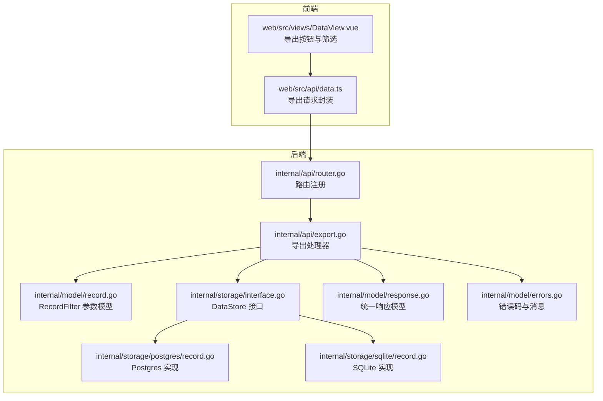
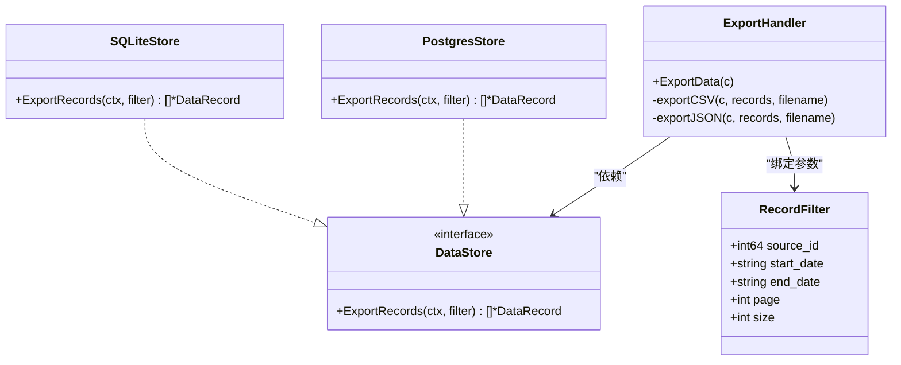

# 数据导出接口

<cite>
**本文引用的文件**
- [export.go](file://internal/api/export.go)
- [router.go](file://internal/api/router.go)
- [record.go](file://internal/model/record.go)
- [response.go](file://internal/model/response.go)
- [errors.go](file://internal/model/errors.go)
- [interface.go](file://internal/storage/interface.go)
- [record.go](file://internal/storage/postgres/record.go)
- [record.go](file://internal/storage/sqlite/record.go)
- [data.ts](file://web/src/api/data.ts)
- [DataView.vue](file://web/src/views/DataView.vue)
- [config.yaml](file://configs/config.yaml)
- [config.go](file://internal/config/config.go)
</cite>

## 目录
1. [简介](#简介)
2. [项目结构](#项目结构)
3. [核心组件](#核心组件)
4. [架构总览](#架构总览)
5. [详细组件分析](#详细组件分析)
6. [依赖分析](#依赖分析)
7. [性能考虑](#性能考虑)
8. [故障排查指南](#故障排查指南)
9. [结论](#结论)
10. [附录](#附录)

## 简介
本文件为 DataCollector 的数据导出接口（GET /api/v1/admin/data/export）提供完整的 API 文档与技术说明。内容涵盖：
- 接口功能与参数配置
- 筛选条件与时间范围设置
- 导出文件格式规范与字段说明
- 编码方式与下载行为
- 大文件导出的性能优化与分批导出策略
- 异步处理机制与进度跟踪现状
- 错误处理与重试机制
- 数据验证与质量保证措施

## 项目结构
该导出功能位于后端 Go 服务的 API 层，通过 Gin 框架暴露 REST 接口，并由存储层实现具体的数据查询与导出逻辑。前端 Vue 项目提供导出触发与下载交互。



**图表来源**
- [router.go:102-104](file://internal/api/router.go#L102-L104)
- [export.go:28-61](file://internal/api/export.go#L28-L61)
- [record.go:19-26](file://internal/model/record.go#L19-L26)
- [interface.go:43](file://internal/storage/interface.go#L43)
- [record.go:184-248](file://internal/storage/postgres/record.go#L184-L248)
- [record.go:185-245](file://internal/storage/sqlite/record.go#L185-L245)
- [response.go:58-71](file://internal/model/response.go#L58-L71)
- [errors.go:25-64](file://internal/model/errors.go#L25-L64)

**章节来源**
- [router.go:102-104](file://internal/api/router.go#L102-L104)
- [export.go:28-61](file://internal/api/export.go#L28-L61)
- [record.go:19-26](file://internal/model/record.go#L19-L26)
- [interface.go:43](file://internal/storage/interface.go#L43)

## 核心组件
- 导出路由与处理器：负责接收查询参数、校验格式、调用存储层导出、输出 CSV/JSON 文件并设置下载响应头。
- 存储层接口与实现：提供 ExportRecords 方法，按筛选条件查询所有记录（不分页）。
- 请求参数模型：RecordFilter 定义 source_id、start_date、end_date、page、size 等查询参数。
- 统一响应与错误码：提供标准错误码与消息映射，便于前端展示与日志追踪。

**章节来源**
- [export.go:16-26](file://internal/api/export.go#L16-L26)
- [interface.go:43](file://internal/storage/interface.go#L43)
- [record.go:19-26](file://internal/model/record.go#L19-L26)
- [response.go:58-71](file://internal/model/response.go#L58-L71)
- [errors.go:25-64](file://internal/model/errors.go#L25-L64)

## 架构总览
导出流程从前端发起 GET 请求到 /api/v1/admin/data/export，后端解析参数后调用存储层导出方法，再根据 format 输出 CSV 或 JSON 文件并触发浏览器下载。

```mermaid
sequenceDiagram
participant FE as "前端 Vue"
participant API as "Gin 路由"
participant EH as "ExportHandler"
participant DS as "DataStore"
participant DB as "数据库"
FE->>API : GET /api/v1/admin/data/export?format=csv&source_id=1&start_date=2024-01-01&end_date=2024-12-31
API->>EH : 调用 ExportData(c)
EH->>EH : ShouldBindQuery(RecordFilter)
EH->>EH : 校验 format(csv/json)
EH->>DS : ExportRecords(ctx, filter)
DS->>DB : SELECT ... ORDER BY created_at DESC
DB-->>DS : 记录集
DS-->>EH : 记录切片
alt format=csv
EH-->>FE : Content-Type : text/csv<br/>Content-Disposition : attachment; filename="export_YYYYMMDD.csv"
else format=json
EH-->>FE : Content-Type : application/json<br/>Content-Disposition : attachment; filename="export_YYYYMMDD.json"
end
```

**图表来源**
- [router.go:102-104](file://internal/api/router.go#L102-L104)
- [export.go:30-61](file://internal/api/export.go#L30-L61)
- [record.go:184-248](file://internal/storage/postgres/record.go#L184-L248)
- [record.go:185-245](file://internal/storage/sqlite/record.go#L185-L245)

## 详细组件分析

### 导出接口定义与参数
- 接口路径：GET /api/v1/admin/data/export
- 支持格式：csv、json（默认 csv）
- 查询参数：
  - format：导出格式（csv/json）
  - source_id：数据源 ID（可选）
  - start_date：起始日期（YYYY-MM-DD，可选）
  - end_date：结束日期（YYYY-MM-DD，可选）
  - page：分页页码（仅查询接口使用，导出接口不参与分页）
  - size：分页大小（仅查询接口使用，导出接口不参与分页）

参数绑定与校验：
- 使用 ShouldBindQuery 绑定查询参数
- 校验 format 必须为 csv 或 json
- 导出接口不进行分页，直接查询满足条件的所有记录

**章节来源**
- [export.go:28-61](file://internal/api/export.go#L28-L61)
- [record.go:19-26](file://internal/model/record.go#L19-L26)

### 存储层导出实现
- 接口方法：ExportRecords(ctx, filter) []DataRecord
- 查询逻辑：
  - 可选条件：source_id、start_date、end_date
  - 时间范围：按 created_at 日期比较（使用 DATE(created_at)）
  - 排序：按 created_at 降序
  - 不分页：一次性返回所有匹配记录
- 数据库实现：
  - PostgresStore.ExportRecords
  - SQLiteStore.ExportRecords

注意：当前实现为一次性查询所有匹配记录，未采用分页或游标分批导出策略。

**章节来源**
- [interface.go:43](file://internal/storage/interface.go#L43)
- [record.go:184-248](file://internal/storage/postgres/record.go#L184-L248)
- [record.go:185-245](file://internal/storage/sqlite/record.go#L185-L245)

### 响应与下载行为
- 成功响应：
  - 设置 Content-Type：text/csv 或 application/json
  - 设置 Content-Disposition：attachment; filename="export_YYYYMMDD.(csv|json)"
  - 直接向客户端流式写出 CSV 行或 JSON 数组
- 失败响应：
  - 参数错误：400，错误码 4000
  - 导出失败：500，错误码 4001
- 统一响应模型与错误码映射见 model/response.go 与 model/errors.go

前端下载：
- web/src/api/data.ts 使用 responseType: 'blob' 接收二进制响应
- 从 Content-Disposition 解析文件名，调用 downloadBlob 下载

**章节来源**
- [export.go:64-110](file://internal/api/export.go#L64-L110)
- [response.go:58-71](file://internal/model/response.go#L58-L71)
- [errors.go:25-64](file://internal/model/errors.go#L25-L64)
- [data.ts:17-34](file://web/src/api/data.ts#L17-L34)

### CSV 格式规范与字段说明
- 表头字段（顺序固定）：
  - id：整数，记录 ID
  - source_id：整数，数据源 ID
  - data：文本，原始 JSON 数据（以字符串形式输出）
  - ip_address：字符串，来源 IP
  - user_agent：字符串，用户代理
  - created_at：字符串，ISO8601 时间戳
- 编码方式：CSV 默认编码为 UTF-8（Go csv.Writer 默认），浏览器通常按 UTF-8 解码
- 行分隔符：CRLF（Windows）或 LF（Unix），取决于运行平台

字段来源与类型：
- 数据模型 DataRecord 定义了各字段类型与 JSON 标签
- 导出时将 json.RawMessage 转为字符串输出

**章节来源**
- [export.go:71-96](file://internal/api/export.go#L71-L96)
- [record.go:8-17](file://internal/model/record.go#L8-L17)

### JSON 格式规范
- 输出结构：数组，元素为 DataRecord 对象
- 编码：UTF-8
- 缩进：Pretty Print（每级缩进两个空格）

**章节来源**
- [export.go:99-110](file://internal/api/export.go#L99-L110)
- [record.go:8-17](file://internal/model/record.go#L8-L17)

### 前端集成与交互
- DataView.vue 提供导出按钮（CSV/JSON），支持筛选 source_id、start_date、end_date
- 调用 exportData 接口，自动下载文件并提示成功/失败

**章节来源**
- [DataView.vue:222-238](file://web/src/views/DataView.vue#L222-L238)
- [data.ts:17-34](file://web/src/api/data.ts#L17-L34)

## 依赖分析
- 路由注册：/api/v1/admin/data/export 由 router.go 注册
- 处理器依赖：ExportHandler 依赖 storage.DataStore 接口
- 存储实现：PostgresStore 与 SQLiteStore 实现 ExportRecords
- 参数模型：RecordFilter 定义查询参数
- 响应模型：统一响应与错误码



**图表来源**
- [export.go:16-26](file://internal/api/export.go#L16-L26)
- [interface.go:43](file://internal/storage/interface.go#L43)
- [record.go:184-248](file://internal/storage/postgres/record.go#L184-L248)
- [record.go:185-245](file://internal/storage/sqlite/record.go#L185-L245)
- [record.go:19-26](file://internal/model/record.go#L19-L26)

**章节来源**
- [router.go:102-104](file://internal/api/router.go#L102-L104)
- [export.go:16-26](file://internal/api/export.go#L16-L26)
- [interface.go:43](file://internal/storage/interface.go#L43)

## 性能考虑
当前实现为一次性查询所有匹配记录并直接输出，适用于中小规模数据导出。对于大规模数据，建议采用以下优化策略（概念性建议，非现有实现）：

- 分批导出（游标/分页）：
  - 使用 created_at 作为游标，分批读取并输出，避免一次性加载大量内存
  - 前端可配合进度条显示导出进度
- 流式写入：
  - CSV/JSON 编码器逐条写入，减少内存占用
- 并发控制：
  - 限制同时导出的任务数量，防止数据库压力过大
- 数据库优化：
  - 在 created_at 上建立索引，提升排序与范围查询性能
  - 合理使用 LIMIT/OFFSET 或基于游标的分页
- 压缩传输：
  - 对大文件启用 gzip 压缩（需前端支持解压）
- 异步导出：
  - 将导出任务放入队列，完成后通知用户下载链接

[本节为通用性能建议，不直接对应现有代码实现]

## 故障排查指南
常见问题与处理：
- 参数错误（400）：
  - format 非 csv/json
  - 查询参数绑定失败
  - 处理：检查前端传参与格式
- 导出失败（500）：
  - 数据库查询异常
  - 编码/写出异常
  - 处理：查看后端日志，确认数据库连接与 SQL 条件
- 文件下载异常：
  - Content-Disposition 解析失败
  - 前端 responseType 配置不当
  - 处理：确认后端响应头与前端下载逻辑
- 大文件导出卡顿：
  - 当前实现一次性加载所有记录
  - 建议采用分批导出或异步导出方案

错误码参考：
- 查询参数错误：4000
- 导出失败：4001

**章节来源**
- [export.go:30-61](file://internal/api/export.go#L30-L61)
- [errors.go:25-64](file://internal/model/errors.go#L25-L64)
- [data.ts:17-34](file://web/src/api/data.ts#L17-L34)

## 结论
- 当前导出接口支持 CSV 与 JSON 两种格式，参数简单易用，适合中小规模数据导出。
- 导出流程清晰：参数绑定 -> 校验 -> 查询 -> 输出 -> 下载。
- 对于大规模数据，建议引入分批导出、异步任务与进度跟踪机制，以提升稳定性与用户体验。
- 前端已具备基础导出交互能力，后续可扩展为异步导出并提供进度反馈。

[本节为总结性内容，不直接分析具体文件]

## 附录

### API 定义与示例
- 路径：GET /api/v1/admin/data/export
- 查询参数：
  - format: csv | json（默认 csv）
  - source_id: number（可选）
  - start_date: YYYY-MM-DD（可选）
  - end_date: YYYY-MM-DD（可选）
- 成功响应：
  - Content-Type: text/csv 或 application/json
  - Content-Disposition: attachment; filename="export_YYYYMMDD.(csv|json)"
  - 数据：CSV 行或 JSON 数组
- 错误响应：
  - 400：参数错误（错误码 4000）
  - 500：导出失败（错误码 4001）

**章节来源**
- [export.go:28-61](file://internal/api/export.go#L28-L61)
- [export.go:64-110](file://internal/api/export.go#L64-L110)
- [errors.go:25-64](file://internal/model/errors.go#L25-L64)

### 数据模型与字段说明
- DataRecord 字段：
  - id: 整数
  - source_id: 整数
  - token_id: 整数
  - data: JSON 原始数据
  - ip_address: 字符串
  - user_agent: 字符串
  - created_at: 时间戳
- RecordFilter 字段：
  - source_id: 整数
  - start_date: 字符串（YYYY-MM-DD）
  - end_date: 字符串（YYYY-MM-DD）
  - page: 整数（导出接口不使用）
  - size: 整数（导出接口不使用）

**章节来源**
- [record.go:8-17](file://internal/model/record.go#L8-L17)
- [record.go:19-26](file://internal/model/record.go#L19-L26)

### 配置与部署要点
- 数据库驱动：sqlite 或 postgres（默认 sqlite）
- JWT 与认证：导出接口位于 /api/v1/admin 下，需 JWT 认证
- 日志级别：可配置 info/warn/error 等

**章节来源**
- [config.yaml:11-22](file://configs/config.yaml#L11-L22)
- [config.go:101-146](file://internal/config/config.go#L101-L146)
- [router.go:57-105](file://internal/api/router.go#L57-L105)