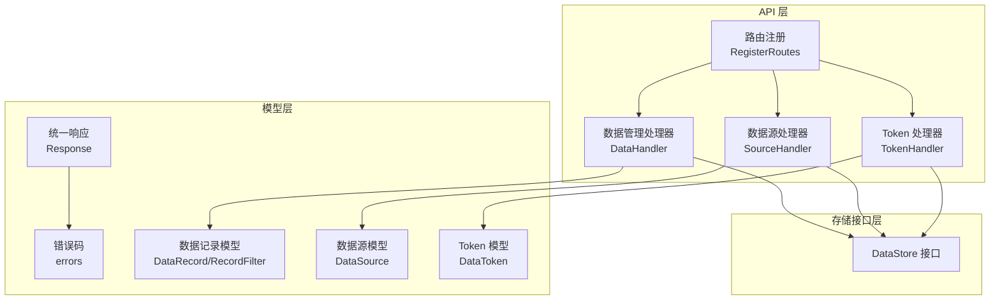
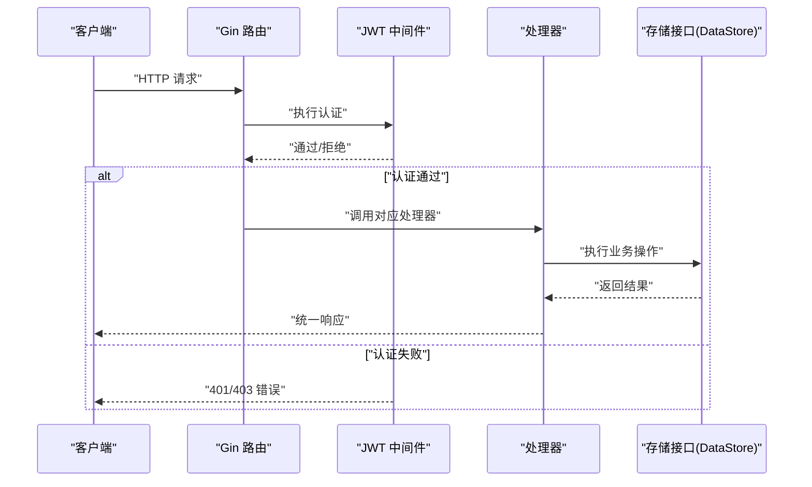
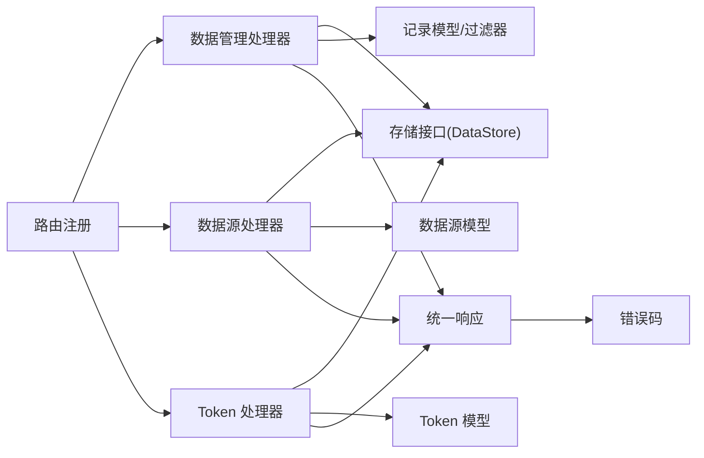

# 数据管理接口

<cite>
**本文引用的文件**
- [internal/api/router.go](file://internal/api/router.go)
- [internal/api/data.go](file://internal/api/data.go)
- [internal/api/source.go](file://internal/api/source.go)
- [internal/api/token.go](file://internal/api/token.go)
- [internal/model/record.go](file://internal/model/record.go)
- [internal/model/source.go](file://internal/model/source.go)
- [internal/model/token.go](file://internal/model/token.go)
- [internal/model/response.go](file://internal/model/response.go)
- [internal/model/errors.go](file://internal/model/errors.go)
- [internal/storage/interface.go](file://internal/storage/interface.go)
- [internal/auth/middleware.go](file://internal/auth/middleware.go)
- [configs/config.yaml](file://configs/config.yaml)
- [web/src/types/record.ts](file://web/src/types/record.ts)
- [web/src/types/source.ts](file://web/src/types/source.ts)
- [web/src/types/token.ts](file://web/src/types/token.ts)
</cite>

## 目录
1. [简介](#简介)
2. [项目结构](#项目结构)
3. [核心组件](#核心组件)
4. [架构总览](#架构总览)
5. [详细组件分析](#详细组件分析)
6. [依赖分析](#依赖分析)
7. [性能考量](#性能考量)
8. [故障排查指南](#故障排查指南)
9. [结论](#结论)
10. [附录](#附录)

## 简介
本文件为 DataCollector 后端“数据管理接口”的权威技术文档，覆盖以下内容：
- 数据查询接口（GET /api/v1/admin/data）：分页查询、条件过滤、排序选项
- 数据删除接口（DELETE /api/v1/admin/data/:id）
- 批量删除接口（POST /api/v1/admin/data/batch-delete）
- 数据源管理接口（CRUD）与 Token 管理接口（CRUD）
- 请求参数、响应格式、分页参数说明
- 最佳实践与性能优化建议
- 权限控制与安全注意事项

## 项目结构
围绕数据管理相关的核心模块如下：
- 路由注册：集中于路由文件，定义各 API 的访问路径与鉴权策略
- 控制器层：数据管理、数据源管理、Token 管理的处理器
- 模型层：统一响应结构、错误码、数据记录/数据源/Token 模型
- 存储接口：抽象数据访问层，屏蔽具体数据库实现
- 鉴权中间件：JWT 认证与角色校验

图表来源
- [internal/api/router.go:14-115](file://internal/api/router.go#L14-L115)
- [internal/api/data.go:12-22](file://internal/api/data.go#L12-L22)
- [internal/api/source.go:13-23](file://internal/api/source.go#L13-L23)
- [internal/api/token.go:16-26](file://internal/api/token.go#L16-L26)
- [internal/model/response.go:9-15](file://internal/model/response.go#L9-L15)
- [internal/model/errors.go:3-38](file://internal/model/errors.go#L3-L38)
- [internal/model/record.go:8-32](file://internal/model/record.go#L8-L32)
- [internal/model/source.go:8-19](file://internal/model/source.go#L8-L19)
- [internal/model/token.go:5-16](file://internal/model/token.go#L5-L16)
- [internal/storage/interface.go:9-56](file://internal/storage/interface.go#L9-L56)

章节来源
- [internal/api/router.go:14-115](file://internal/api/router.go#L14-L115)

## 核心组件
- 数据管理处理器：负责数据查询、单条删除、批量删除
- 数据源处理器：负责数据源的增删改查及 Token 列表
- Token 处理器：负责 Token 的创建、列表、状态更新、删除
- 统一响应与错误码：标准化返回结构与错误语义
- 存储接口：定义 CRUD 与统计等能力

章节来源
- [internal/api/data.go:12-22](file://internal/api/data.go#L12-L22)
- [internal/api/source.go:13-23](file://internal/api/source.go#L13-L23)
- [internal/api/token.go:16-26](file://internal/api/token.go#L16-L26)
- [internal/model/response.go:9-15](file://internal/model/response.go#L9-L15)
- [internal/model/errors.go:3-38](file://internal/model/errors.go#L3-L38)
- [internal/storage/interface.go:9-56](file://internal/storage/interface.go#L9-L56)

## 架构总览
管理后台路由采用分组与中间件组合方式：
- /api/v1/admin 下的接口均需 JWT 认证
- 数据管理、数据源管理、Token 管理分别挂载在不同子路径
- 收集接口（/api/v1/collect）使用独立的速率限制中间件

图表来源
- [internal/api/router.go:57-105](file://internal/api/router.go#L57-L105)
- [internal/auth/middleware.go:19-62](file://internal/auth/middleware.go#L19-L62)

章节来源
- [internal/api/router.go:57-105](file://internal/api/router.go#L57-L105)
- [internal/auth/middleware.go:19-62](file://internal/auth/middleware.go#L19-L62)

## 详细组件分析

### 数据查询接口
- 路径：GET /api/v1/admin/data
- 功能：分页查询数据记录，支持按数据源 ID 与时间范围过滤
- 认证：需要 JWT
- 参数绑定：通过查询字符串绑定 RecordFilter
- 默认值：page 默认 1；size 默认 20，最大 100
- 响应：PageResult，包含 total 与 list

请求参数
- source_id：可选，整数，用于按数据源过滤
- start_date：可选，字符串，日期格式 YYYY-MM-DD
- end_date：可选，字符串，日期格式 YYYY-MM-DD
- page：可选，整数，默认 1
- size：可选，整数，默认 20，最大 100

响应结构
- code：整数，错误码
- message：字符串，消息
- data：对象，包含 total 与 list
  - total：整数，总数
  - list：数组，元素为 DataRecord

错误码
- 参数错误：4000
- 内部错误：9001

最佳实践与性能建议
- 限定查询时间范围，避免全表扫描
- 合理设置 page/size，避免过大 size 导致内存压力
- 如需高频查询，建议在 source_id 与 created_at 上建立索引（由存储层实现）

章节来源
- [internal/api/data.go:29-53](file://internal/api/data.go#L29-L53)
- [internal/model/record.go:19-32](file://internal/model/record.go#L19-L32)
- [internal/model/response.go:58-66](file://internal/model/response.go#L58-L66)
- [internal/model/errors.go:25-38](file://internal/model/errors.go#L25-L38)

### 单条数据删除接口
- 路径：DELETE /api/v1/admin/data/:id
- 功能：删除指定 ID 的数据记录
- 认证：需要 JWT
- 参数：路径参数 id（整数）
- 响应：成功消息

错误码
- 参数缺失：9000
- 内部错误：9001

章节来源
- [internal/api/data.go:55-70](file://internal/api/data.go#L55-L70)
- [internal/model/errors.go:35-38](file://internal/model/errors.go#L35-L38)

### 批量删除接口
- 路径：POST /api/v1/admin/data/batch-delete
- 功能：根据 ID 列表批量删除
- 认证：需要 JWT
- 请求体：JSON 对象，包含 ids 数组（至少一个）
- 响应：包含 message 与 count（删除数量）

错误码
- 参数缺失：9000
- 内部错误：9001

章节来源
- [internal/api/data.go:72-96](file://internal/api/data.go#L72-L96)
- [internal/model/errors.go:35-38](file://internal/model/errors.go#L35-L38)

### 数据源管理接口（CRUD）
- 路径与方法
  - GET /api/v1/admin/sources：列出数据源（分页）
  - POST /api/v1/admin/sources：创建数据源
  - PUT /api/v1/admin/sources/:id：更新数据源
  - DELETE /api/v1/admin/sources/:id：删除数据源（软删除）
- 认证：需要 JWT
- 请求体字段（创建/更新）
  - name：必填，字符串
  - description：可选，字符串
  - schema_config：可选，JSON 对象，字段定义见 SchemaConfig
- 响应：成功返回对应模型对象；失败返回错误码

分页参数
- page：默认 1，最小 1
- size：默认 10，最小 1，最大 100

错误码
- 数据源不存在：3000
- 创建失败：3001
- 更新失败：3002
- 删除失败：3003
- 参数缺失：9000
- 内部错误：9001

章节来源
- [internal/api/source.go:39-168](file://internal/api/source.go#L39-L168)
- [internal/model/source.go:8-34](file://internal/model/source.go#L8-L34)
- [internal/model/errors.go:19-38](file://internal/model/errors.go#L19-L38)

### Token 管理接口（CRUD）
- 路径与方法
  - POST /api/v1/admin/sources/:id/tokens：为指定数据源创建 Token（返回明文一次）
  - GET /api/v1/admin/sources/:id/tokens：列出该数据源下的 Token（不返回明文）
  - PUT /api/v1/admin/tokens/:id/status：更新 Token 状态（启用/禁用）
  - DELETE /api/v1/admin/tokens/:id：删除 Token
- 认证：需要 JWT
- 请求体字段
  - 创建：name（必填）、expires_at（可选）
  - 更新状态：status（必填，0 或 1）
- 响应：创建成功返回包含明文 Token 的对象；其他操作返回消息或列表

安全要点
- Token 明文仅在创建时返回一次，客户端需妥善保存
- 存储层仅保存 Token 的哈希值，不存储明文

错误码
- 参数缺失：9000
- 内部错误：9001

章节来源
- [internal/api/token.go:64-179](file://internal/api/token.go#L64-L179)
- [internal/model/token.go:5-16](file://internal/model/token.go#L5-L16)
- [internal/model/errors.go:35-38](file://internal/model/errors.go#L35-L38)

## 依赖分析
- 路由层依赖处理器层，处理器层依赖存储接口与模型层
- 统一响应与错误码被各处理器复用
- 鉴权中间件在管理后台路由组内强制执行

图表来源
- [internal/api/router.go:22-31](file://internal/api/router.go#L22-L31)
- [internal/api/data.go:12-22](file://internal/api/data.go#L12-L22)
- [internal/api/source.go:13-23](file://internal/api/source.go#L13-L23)
- [internal/api/token.go:16-26](file://internal/api/token.go#L16-L26)
- [internal/storage/interface.go:9-56](file://internal/storage/interface.go#L9-L56)
- [internal/model/response.go:9-15](file://internal/model/response.go#L9-L15)
- [internal/model/errors.go:3-38](file://internal/model/errors.go#L3-L38)

章节来源
- [internal/api/router.go:22-31](file://internal/api/router.go#L22-L31)
- [internal/storage/interface.go:9-56](file://internal/storage/interface.go#L9-L56)

## 性能考量
- 查询性能
  - 限制查询范围：尽量提供 start_date/end_date 与 source_id
  - 控制分页大小：避免 size 超过 100
  - 建议在存储层针对常用查询字段建立索引（如 source_id、created_at）
- 删除性能
  - 批量删除优于多次单条删除
  - 注意事务与回滚成本，合理拆分批次
- 缓存与导出
  - 导出接口可结合缓存与分页拉取，避免一次性加载过多数据
- 速率限制
  - 管理端接口未内置速率限制，建议在网关或反向代理层统一配置

## 故障排查指南
常见错误与定位
- 401 未授权
  - 检查 Authorization 头或 URL 查询参数 token 是否正确传递
  - 检查 JWT 是否过期
- 403 权限不足
  - 确认用户角色是否满足要求
- 400 参数错误
  - 核对查询参数与请求体格式
  - 特别注意日期格式与数值范围
- 500 内部错误
  - 查看服务日志，确认存储层连接与 SQL 执行情况

章节来源
- [internal/auth/middleware.go:19-62](file://internal/auth/middleware.go#L19-L62)
- [internal/model/errors.go:3-38](file://internal/model/errors.go#L3-L38)

## 结论
本文档梳理了数据管理相关接口的请求参数、响应格式、分页参数与错误码，并提供了最佳实践与安全注意事项。实际部署时请结合存储层索引策略与网关层速率限制，确保查询与删除操作的稳定性与安全性。

## 附录

### 统一响应结构
- 成功响应
  - code：0
  - message：成功消息
  - data：具体数据
- 错误响应
  - code：错误码
  - message：错误消息
  - errors：可选，详细错误信息

章节来源
- [internal/model/response.go:9-71](file://internal/model/response.go#L9-L71)

### 错误码一览（节选）
- 数据采集：1000-1099
- 用户认证：2000-2099
- 数据源管理：3000-3099
- 数据查询：4000-4099
- 系统运维：5000-5099
- 通用错误：9000-9099

章节来源
- [internal/model/errors.go:3-84](file://internal/model/errors.go#L3-L84)

### 配置参考
- 服务器与数据库、JWT、收集器速率限制、日志级别等
- 采集器默认每 IP 每分钟 200 次，每 Token 每分钟 100 次

章节来源
- [configs/config.yaml:1-41](file://configs/config.yaml#L1-L41)