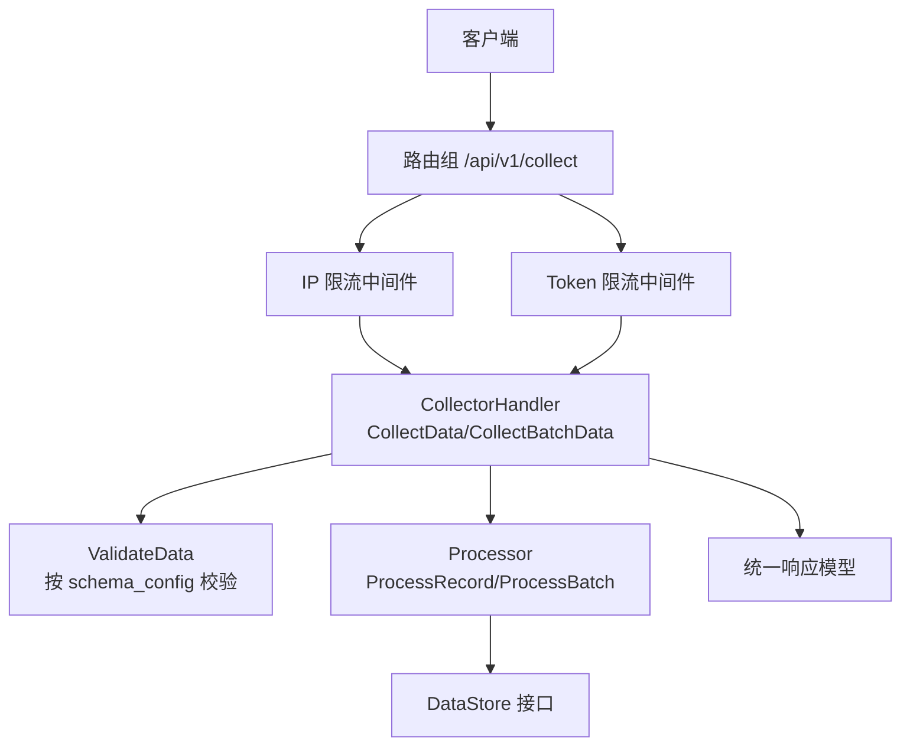
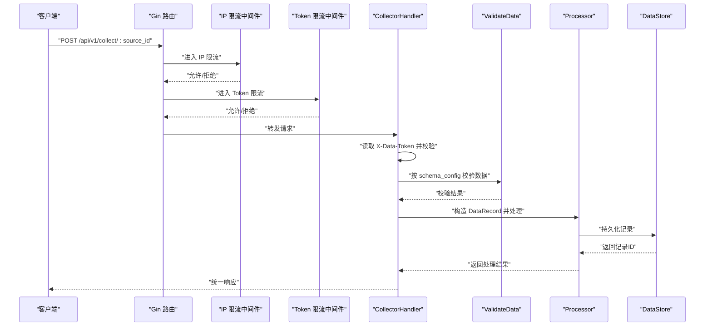
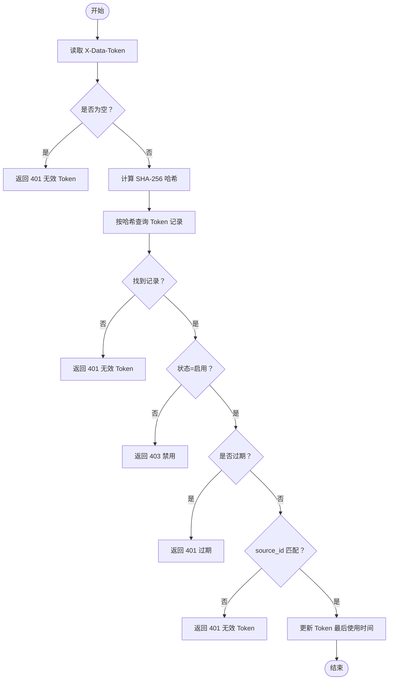
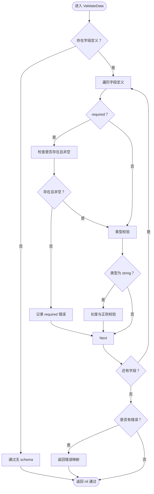
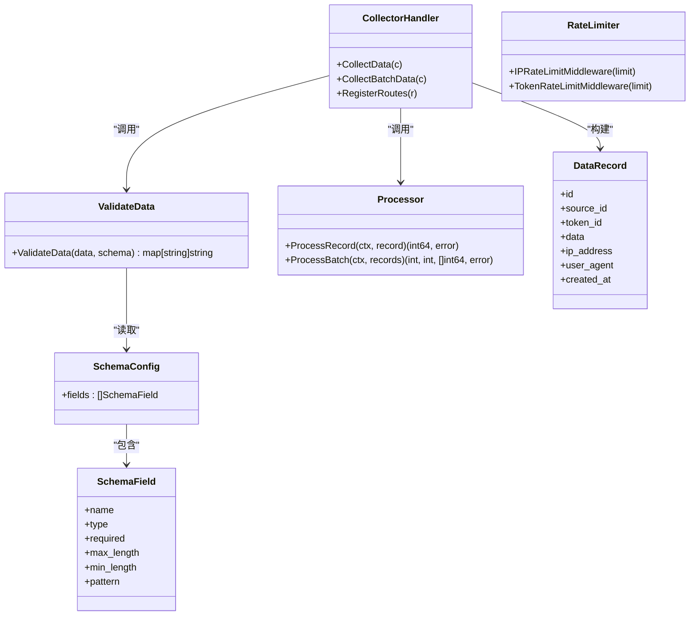

# 数据采集接口

<cite>
**本文引用的文件**
- [collector.go](file://internal/api/collector.go)
- [ratelimit.go](file://internal/middleware/ratelimit.go)
- [validator.go](file://internal/collector/validator.go)
- [router.go](file://internal/api/router.go)
- [response.go](file://internal/model/response.go)
- [errors.go](file://internal/model/errors.go)
- [source.go](file://internal/model/source.go)
- [record.go](file://internal/model/record.go)
- [token.go](file://internal/model/token.go)
- [processor.go](file://internal/collector/processor.go)
- [config.yaml](file://configs/config.yaml)
- [bodysize.go](file://internal/middleware/bodysize.go)
- [cors.go](file://internal/middleware/cors.go)
- [api.md](file://web/src/docs/api.md)
</cite>

## 目录
1. [简介](#简介)
2. [项目结构](#项目结构)
3. [核心组件](#核心组件)
4. [架构总览](#架构总览)
5. [详细组件分析](#详细组件分析)
6. [依赖关系分析](#依赖关系分析)
7. [性能考虑](#性能考虑)
8. [故障排查指南](#故障排查指南)
9. [结论](#结论)
10. [附录](#附录)

## 简介
本文件为 DataCollector 的数据采集接口提供全面的 API 文档，覆盖单条数据采集接口（POST /api/v1/collect/:source_id）与批量数据采集接口（POST /api/v1/collect/:source_id/batch）。内容包括：
- 认证方式（X-Data-Token 头部）
- 请求体格式与数据验证规则
- 限流机制（IP 限流、Token 限流）与配置参数
- 示例请求与响应格式
- 数据验证流程、错误处理策略与性能优化建议
- 常见数据类型与最佳实践

## 项目结构
围绕数据采集接口的相关模块分布如下：
- 路由与控制器：负责注册路由、接收请求、鉴权与转发至处理器
- 限流中间件：基于滑动窗口实现 IP 与 Token 的每分钟限流
- 数据验证器：根据数据源的 schema_config 对提交数据进行字段级校验
- 数据处理器：将合法数据持久化并触发统计事件
- 统一响应与错误码：标准化返回结构与错误语义
- 配置中心：提供限流阈值、请求体大小限制等运行时参数

图表来源
- [router.go:47-55](file://internal/api/router.go#L47-L55)
- [collector.go:29-140](file://internal/api/collector.go#L29-L140)
- [ratelimit.go:100-136](file://internal/middleware/ratelimit.go#L100-L136)
- [validator.go:19-84](file://internal/collector/validator.go#L19-L84)
- [processor.go:30-83](file://internal/collector/processor.go#L30-L83)
- [response.go:9-72](file://internal/model/response.go#L9-L72)

章节来源
- [router.go:12-116](file://internal/api/router.go#L12-L116)
- [config.yaml:27-32](file://configs/config.yaml#L27-L32)

## 核心组件
- CollectorHandler：封装单条与批量采集的业务逻辑，负责鉴权、校验、构建记录与调用处理器
- RateLimiter：滑动窗口限流器，支持按 IP 与 Token 两种维度
- ValidateData：依据数据源 schema_config 对字段进行类型、长度、正则、必填等校验
- Processor：将记录写入存储并上报统计事件
- 统一响应与错误码：标准化返回结构与错误语义，便于前端与客户端消费

章节来源
- [collector.go:15-289](file://internal/api/collector.go#L15-L289)
- [ratelimit.go:12-137](file://internal/middleware/ratelimit.go#L12-L137)
- [validator.go:1-222](file://internal/collector/validator.go#L1-L222)
- [processor.go:16-84](file://internal/collector/processor.go#L16-L84)
- [response.go:9-72](file://internal/model/response.go#L9-L72)
- [errors.go:3-84](file://internal/model/errors.go#L3-L84)

## 架构总览
数据采集接口的调用链路如下：

图表来源
- [router.go:47-55](file://internal/api/router.go#L47-L55)
- [collector.go:29-140](file://internal/api/collector.go#L29-L140)
- [validator.go:19-84](file://internal/collector/validator.go#L19-L84)
- [processor.go:30-52](file://internal/collector/processor.go#L30-L52)

## 详细组件分析

### 单条数据采集接口
- 路径：POST /api/v1/collect/:source_id
- 认证：X-Data-Token 头部，服务端对明文 Token 计算 SHA-256 哈希后查询存储
- 请求体：任意 JSON 对象，将按数据源 schema_config 进行字段级校验
- 响应：成功返回记录 ID；失败返回统一错误结构

请求与响应要点
- 认证失败：401（无效 Token）、403（Token 已禁用）、401（Token 过期）
- 参数错误：400（source_id 非法）、400（请求体非法）
- 校验失败：400（CodeValidationFailed），errors 字段包含字段级错误
- 成功：200，data 包含 record_id

章节来源
- [collector.go:29-140](file://internal/api/collector.go#L29-L140)
- [response.go:58-71](file://internal/model/response.go#L58-L71)
- [errors.go:7-38](file://internal/model/errors.go#L7-L38)

### 批量数据采集接口
- 路径：POST /api/v1/collect/:source_id/batch
- 认证：同上
- 请求体：包含 records 数组，数组元素为任意 JSON 对象
- 响应：返回 total、succeeded、failed、record_ids；支持部分成功

请求与响应要点
- 参数错误：400（records 缺失或为空）
- 校验失败：400，errors 为映射，键为数组索引，值为字段级错误
- 成功：200，data 包含统计与有效记录 ID 列表

章节来源
- [collector.go:142-279](file://internal/api/collector.go#L142-L279)
- [response.go:58-71](file://internal/model/response.go#L58-L71)
- [errors.go:7-38](file://internal/model/errors.go#L7-L38)

### 认证与鉴权流程
- 读取 X-Data-Token 头部
- 计算 SHA-256 哈希并查询 Token 记录
- 校验状态（启用/禁用）、过期时间、source_id 与 URL 参数一致
- 更新 Token 最后使用时间（异步，不影响主流程）

图表来源
- [collector.go:34-81](file://internal/api/collector.go#L34-L81)

章节来源
- [collector.go:34-81](file://internal/api/collector.go#L34-L81)

### 数据验证流程
- 若数据源未配置 schema_config 或字段列表为空，则跳过验证
- 对每个字段执行：必填校验、类型校验、字符串长度与正则校验
- 支持类型：string、number、email、url、boolean、date、datetime、integer、float、array、object
- 错误以 map[field]message 形式返回，字段名与错误信息一一对应

图表来源
- [validator.go:19-84](file://internal/collector/validator.go#L19-L84)

章节来源
- [validator.go:19-84](file://internal/collector/validator.go#L19-L84)
- [source.go:21-34](file://internal/model/source.go#L21-L34)

### 限流机制与配置
- 限流算法：滑动窗口（每分钟）
- 限流维度：
  - IP 限流：按客户端真实 IP 限流
  - Token 限流：按 X-Data-Token 明文限流
- 配置项（来自配置文件）：
  - collector.rate_limit_per_ip：每分钟最大请求数（默认 200）
  - collector.rate_limit_per_token：每分钟最大请求数（默认 100）
- 触发条件：超过阈值立即返回 429（CodeRateLimitExceeded）

章节来源
- [ratelimit.go:12-98](file://internal/middleware/ratelimit.go#L12-L98)
- [router.go:49-51](file://internal/api/router.go#L49-L51)
- [config.yaml:29-30](file://configs/config.yaml#L29-L30)
- [errors.go:11](file://internal/model/errors.go#L11)

### 统一响应与错误码
- 成功：code=0，message 为“成功”，data 为具体数据
- 失败：code 为错误码，message 为默认提示，错误详情可选
- 数据采集相关错误码：
  - 1000：无效 Token
  - 1001：Token 已禁用
  - 1002：数据验证失败
  - 1003：请求频率超限

章节来源
- [response.go:9-72](file://internal/model/response.go#L9-L72)
- [errors.go:7-38](file://internal/model/errors.go#L7-L38)

### 数据模型与持久化
- DataRecord：包含 source_id、token_id、原始 JSON 数据、客户端 IP、User-Agent、创建时间
- Processor：单条写入返回记录 ID；批量处理统计成功/失败数并返回 ID 列表
- 存储层：通过 DataStore 接口抽象，支持 SQLite/Postgres

章节来源
- [record.go:8-17](file://internal/model/record.go#L8-L17)
- [processor.go:30-83](file://internal/collector/processor.go#L30-L83)

## 依赖关系分析

图表来源
- [collector.go:15-289](file://internal/api/collector.go#L15-L289)
- [validator.go:19-84](file://internal/collector/validator.go#L19-L84)
- [processor.go:16-84](file://internal/collector/processor.go#L16-L84)
- [record.go:8-17](file://internal/model/record.go#L8-L17)
- [source.go:21-34](file://internal/model/source.go#L21-L34)

## 性能考虑
- 限流策略：滑动窗口算法，定期清理过期记录，避免内存无限增长
- 批量处理：逐条写入并统计结果，支持部分成功，提升吞吐
- 请求体大小限制：通过中间件限制最大字节数，防止恶意或异常请求占用资源
- CORS 支持：允许指定来源或全部来源，减少跨域问题
- 日志与监控：统一响应便于埋点与告警；统计事件通道避免阻塞主流程

章节来源
- [ratelimit.go:34-66](file://internal/middleware/ratelimit.go#L34-L66)
- [processor.go:42-49](file://internal/collector/processor.go#L42-L49)
- [bodysize.go:10-39](file://internal/middleware/bodysize.go#L10-L39)
- [cors.go:9-51](file://internal/middleware/cors.go#L9-L51)

## 故障排查指南
- 401 无效 Token
  - 检查是否正确设置 X-Data-Token 头部
  - 确认 Token 未过期且状态为启用
  - 确认 source_id 与 Token 绑定的数据源一致
- 403 Token 已禁用
  - 在管理后台将 Token 状态改为启用
- 400 数据验证失败
  - 根据 errors 字段定位具体字段与错误原因
  - 检查字段类型、长度、正则表达式与必填要求
- 429 请求频率超限
  - 降低请求频率或提升配置中的限流阈值
  - 区分 IP 限流与 Token 限流，分别优化
- 500 内部错误
  - 检查存储连接、磁盘空间与日志输出
  - 关注批量处理时部分失败的情况

章节来源
- [collector.go:34-140](file://internal/api/collector.go#L34-L140)
- [collector.go:142-279](file://internal/api/collector.go#L142-L279)
- [errors.go:7-38](file://internal/model/errors.go#L7-L38)
- [ratelimit.go:100-136](file://internal/middleware/ratelimit.go#L100-L136)

## 结论
数据采集接口通过严格的认证、灵活的 schema 校验与高效的批量处理，提供了稳定可靠的数据接入能力。结合 IP 与 Token 双维度限流，可在保证安全的同时兼顾高并发场景下的稳定性。建议在生产环境中合理配置限流阈值，并充分利用 schema_config 来约束数据质量。

## 附录

### API 规范摘要
- 单条采集
  - 方法：POST
  - 路径：/api/v1/collect/:source_id
  - 认证：X-Data-Token
  - 请求体：任意 JSON 对象
  - 响应：包含 record_id
- 批量采集
  - 方法：POST
  - 路径：/api/v1/collect/:source_id/batch
  - 认证：X-Data-Token
  - 请求体：{"records": [ {...}, ... ]}
  - 响应：包含 total/succeeded/failed/record_ids

章节来源
- [collector.go:29-140](file://internal/api/collector.go#L29-L140)
- [collector.go:142-279](file://internal/api/collector.go#L142-L279)

### 限流配置
- collector.rate_limit_per_ip：每分钟最大请求数（默认 200）
- collector.rate_limit_per_token：每分钟最大请求数（默认 100）

章节来源
- [config.yaml:29-30](file://configs/config.yaml#L29-L30)

### 数据类型与示例
- 支持类型：string、number、email、url、boolean、date、datetime、integer、float、array、object
- 示例请求与响应参考：[api.md](file://web/src/docs/api.md)

章节来源
- [validator.go:102-221](file://internal/collector/validator.go#L102-L221)
- [api.md:363-442](file://web/src/docs/api.md#L363-L442)