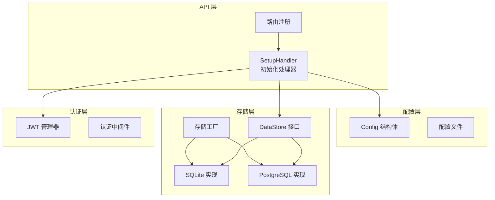
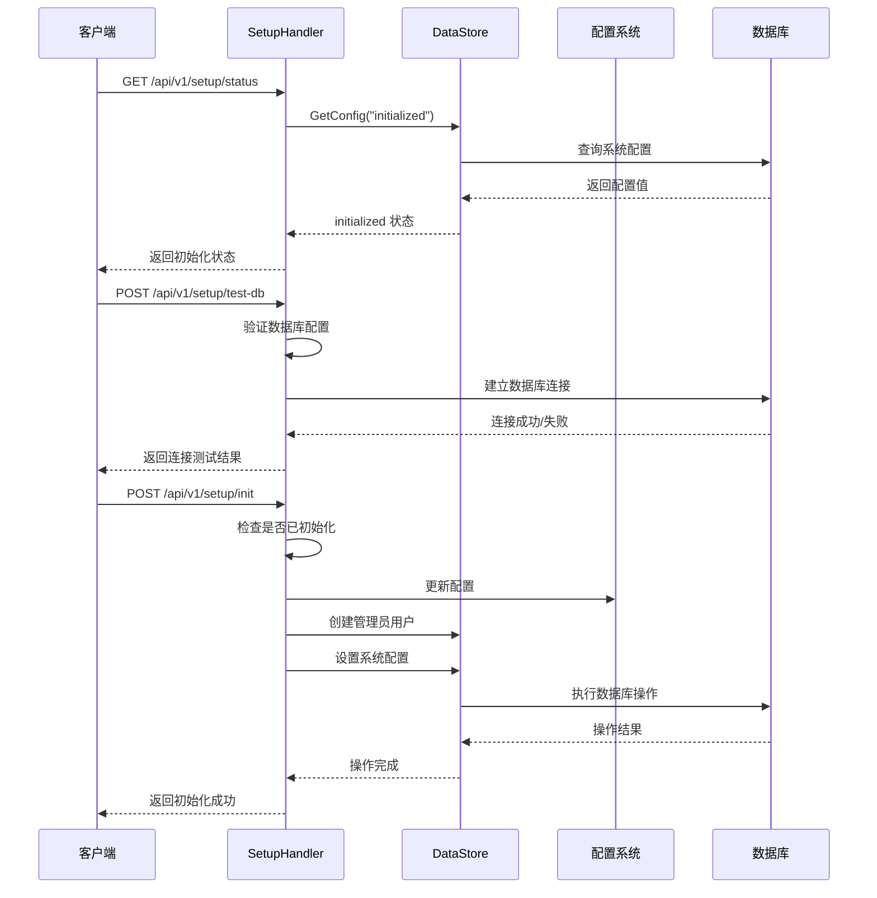
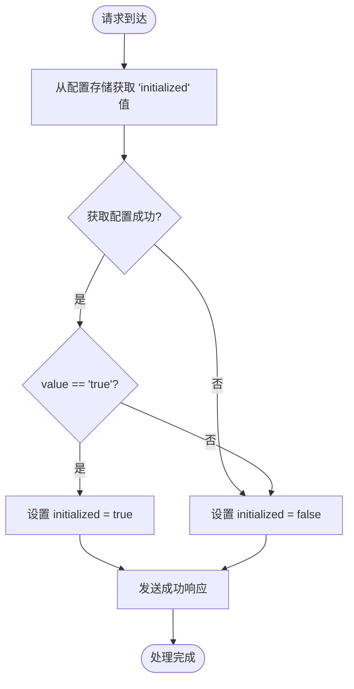
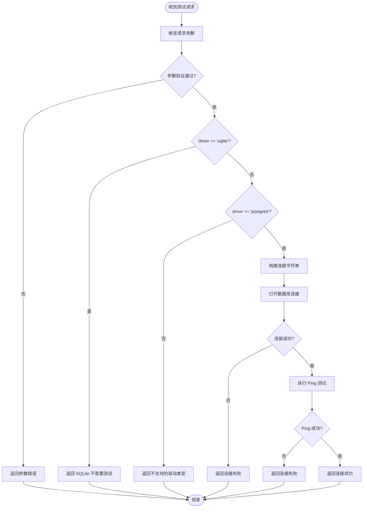
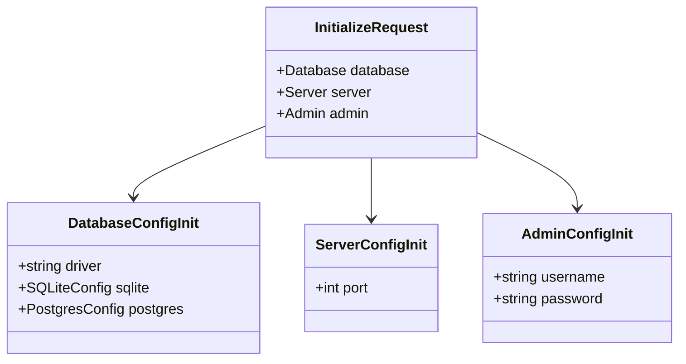
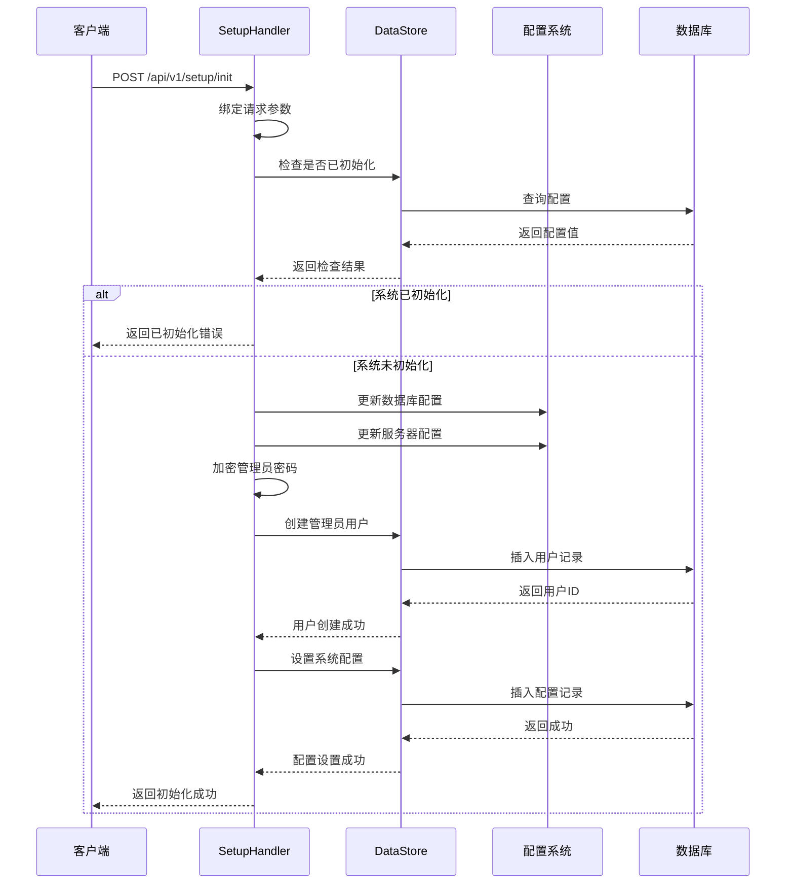
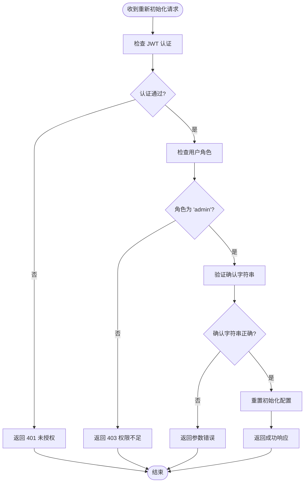
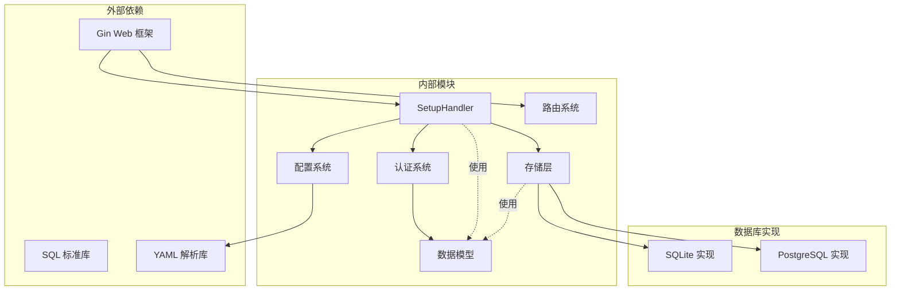
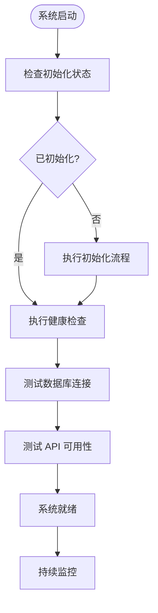

# 系统初始化接口

<cite>
**本文档引用的文件**
- [internal/api/setup.go](file://internal/api/setup.go)
- [internal/api/router.go](file://internal/api/router.go)
- [configs/config.yaml](file://configs/config.yaml)
- [internal/config/config.go](file://internal/config/config.go)
- [internal/storage/interface.go](file://internal/storage/interface.go)
- [internal/storage/factory.go](file://internal/storage/factory.go)
- [internal/storage/sqlite/store.go](file://internal/storage/sqlite/store.go)
- [internal/storage/postgres/store.go](file://internal/storage/postgres/store.go)
- [internal/storage/migrations/001_init_sqlite.sql](file://internal/storage/migrations/001_init_sqlite.sql)
- [internal/storage/migrations/001_init_postgres.sql](file://internal/storage/migrations/001_init_postgres.sql)
- [internal/auth/middleware.go](file://internal/auth/middleware.go)
- [internal/model/errors.go](file://internal/model/errors.go)
- [web/src/views/SetupView.vue](file://web/src/views/SetupView.vue)
- [web/src/api/setup.ts](file://web/src/api/setup.ts)
- [cmd/server/main.go](file://cmd/server/main.go)
</cite>

## 目录
1. [简介](#简介)
2. [项目结构](#项目结构)
3. [核心组件](#核心组件)
4. [架构概览](#架构概览)
5. [详细组件分析](#详细组件分析)
6. [依赖关系分析](#依赖关系分析)
7. [性能考虑](#性能考虑)
8. [故障排除指南](#故障排除指南)
9. [结论](#结论)
10. [附录](#附录)

## 简介

DataCollector 是一个数据采集和管理系统，系统初始化接口是整个应用启动的关键入口。本文档详细介绍了系统初始化相关的三个核心接口：系统状态检查接口（GET /api/v1/setup/status）、数据库测试接口（POST /api/v1/setup/test-db）和系统初始化接口（POST /api/v1/setup/init），以及重新初始化接口（POST /api/v1/setup/reinit）的权限要求和安全考虑。

这些接口构成了 DataCollector 的完整初始化流程，确保系统能够在首次启动时正确配置数据库、创建管理员用户，并建立完整的系统配置。通过这些接口，用户可以完成从数据库配置到管理员创建的完整初始化过程。

## 项目结构

DataCollector 采用分层架构设计，初始化相关的代码主要分布在以下几个模块：



**图表来源**
- [internal/api/setup.go:19-33](file://internal/api/setup.go#L19-L33)
- [internal/config/config.go:12-20](file://internal/config/config.go#L12-L20)
- [internal/storage/interface.go:9-14](file://internal/storage/interface.go#L9-L14)
- [internal/storage/factory.go:11-21](file://internal/storage/factory.go#L11-L21)

**章节来源**
- [internal/api/setup.go:1-253](file://internal/api/setup.go#L1-L253)
- [internal/api/router.go:12-116](file://internal/api/router.go#L12-L116)
- [internal/config/config.go:1-215](file://internal/config/config.go#L1-L215)

## 核心组件

### SetupHandler 初始化处理器

SetupHandler 是系统初始化的核心处理器，负责处理所有初始化相关的 API 请求。它包含了以下关键功能：

- **系统状态检查**：检查系统是否已完成初始化
- **数据库连接测试**：验证数据库连接配置的有效性
- **系统初始化**：完成完整的系统初始化流程
- **重新初始化**：重置系统配置（需要管理员权限）

该处理器通过依赖注入的方式接收 DataStore、Config 和 JWTManager 实例，确保了良好的可测试性和可维护性。

**章节来源**
- [internal/api/setup.go:19-33](file://internal/api/setup.go#L19-L33)
- [internal/api/setup.go:40-50](file://internal/api/setup.go#L40-L50)
- [internal/api/setup.go:132-196](file://internal/api/setup.go#L132-L196)
- [internal/api/setup.go:203-236](file://internal/api/setup.go#L203-L236)

### 数据存储接口

DataStore 接口定义了系统所需的所有数据操作方法，包括：

- **初始化和迁移**：Init() 和 Ping() 方法
- **用户管理**：CreateUser()、GetUserByUsername() 等
- **数据源管理**：CreateSource()、ListSources() 等
- **系统配置**：GetConfig() 和 SetConfig() 方法

这个接口的设计确保了不同数据库实现的一致性，支持 SQLite 和 PostgreSQL 两种存储后端。

**章节来源**
- [internal/storage/interface.go:9-56](file://internal/storage/interface.go#L9-L56)

### 配置管理系统

配置系统采用 YAML 文件配置与环境变量覆盖相结合的方式：

- **默认配置**：提供完整的默认值
- **文件配置**：支持从 config.yaml 文件加载配置
- **环境变量覆盖**：允许通过环境变量动态调整配置
- **DSN 生成**：根据配置自动生成数据库连接字符串

**章节来源**
- [internal/config/config.go:82-98](file://internal/config/config.go#L82-L98)
- [internal/config/config.go:148-195](file://internal/config/config.go#L148-L195)
- [internal/config/config.go:197-215](file://internal/config/config.go#L197-L215)

## 架构概览

系统初始化架构采用分层设计，确保了清晰的关注点分离：



**图表来源**
- [internal/api/setup.go:40-50](file://internal/api/setup.go#L40-L50)
- [internal/api/setup.go:62-105](file://internal/api/setup.go#L62-L105)
- [internal/api/setup.go:132-196](file://internal/api/setup.go#L132-L196)

**章节来源**
- [internal/api/setup.go:1-253](file://internal/api/setup.go#L1-L253)
- [internal/api/router.go:12-116](file://internal/api/router.go#L12-L116)

## 详细组件分析

### 系统状态检查接口

#### 接口定义
- **URL**: GET /api/v1/setup/status
- **功能**: 检查系统是否已完成初始化
- **认证**: 无需认证
- **响应**: JSON 格式的状态信息

#### 处理流程



**图表来源**
- [internal/api/setup.go:40-50](file://internal/api/setup.go#L40-L50)

#### 响应格式
- **成功**: 返回包含 initialized 字段的 JSON 对象
- **错误**: 返回标准错误格式

**章节来源**
- [internal/api/setup.go:40-50](file://internal/api/setup.go#L40-L50)
- [internal/model/errors.go:29-38](file://internal/model/errors.go#L29-L38)

### 数据库测试接口

#### 接口定义
- **URL**: POST /api/v1/setup/test-db
- **功能**: 测试数据库连接配置的有效性
- **认证**: 无需认证
- **请求体**: JSON 格式的数据库配置信息

#### 支持的数据库类型

目前系统支持两种数据库类型：

1. **SQLite**: 本地文件数据库，无需网络连接
2. **PostgreSQL**: 网络数据库，需要完整的连接信息

#### 请求参数

| 参数名 | 必需 | 类型 | 描述 |
|--------|------|------|------|
| driver | 是 | string | 数据库驱动类型（sqlite 或 postgres） |
| host | 否 | string | PostgreSQL 主机地址 |
| port | 否 | number | PostgreSQL 端口号 |
| user | 否 | string | 数据库用户名 |
| password | 否 | string | 数据库密码 |
| dbname | 否 | string | 数据库名称 |

#### 处理逻辑



**图表来源**
- [internal/api/setup.go:62-105](file://internal/api/setup.go#L62-L105)

#### 特殊处理

- **SQLite**: 不进行连接测试，直接返回提示信息
- **PostgreSQL**: 验证驱动类型后进行完整的连接测试
- **超时控制**: 使用 5 秒超时限制连接测试

**章节来源**
- [internal/api/setup.go:52-105](file://internal/api/setup.go#L52-L105)

### 系统初始化接口

#### 接口定义
- **URL**: POST /api/v1/setup/init
- **功能**: 完成系统的完整初始化
- **认证**: 无需认证
- **请求体**: JSON 格式的完整初始化配置

#### 初始化配置结构



**图表来源**
- [internal/api/setup.go:107-131](file://internal/api/setup.go#L107-L131)

#### 初始化流程



**图表来源**
- [internal/api/setup.go:132-196](file://internal/api/setup.go#L132-L196)

#### 详细步骤说明

1. **参数验证**: 验证请求体中的所有必需字段
2. **状态检查**: 确保系统尚未完成初始化
3. **配置更新**: 根据驱动类型更新相应的数据库配置
4. **管理员创建**: 加密密码并创建管理员用户
5. **系统配置**: 设置初始化标志和相关配置项

#### 错误处理

- **参数缺失**: 返回 400 状态码和参数缺失错误
- **重复初始化**: 返回 400 状态码和已初始化错误
- **数据库错误**: 返回 500 状态码和初始化失败错误
- **密码加密失败**: 返回 500 状态码和初始化失败错误

**章节来源**
- [internal/api/setup.go:107-196](file://internal/api/setup.go#L107-L196)
- [internal/model/errors.go:29-38](file://internal/model/errors.go#L29-L38)

### 重新初始化接口

#### 接口定义
- **URL**: POST /api/v1/setup/reinit
- **功能**: 重置系统配置，允许重新初始化
- **认证**: 需要 JWT 认证 + 管理员权限
- **请求体**: JSON 格式的确认字符串

#### 权限要求

重新初始化接口具有严格的安全要求：

1. **JWT 认证**: 必须提供有效的访问令牌
2. **管理员权限**: 用户角色必须为 "admin"
3. **确认字符串**: 必须提供精确的确认字符串 "REINITIALIZE"

#### 安全考虑



**图表来源**
- [internal/api/setup.go:203-236](file://internal/api/setup.go#L203-L236)
- [internal/auth/middleware.go:11-95](file://internal/auth/middleware.go#L11-L95)

#### 处理逻辑

重新初始化接口当前只执行配置层面的操作，实际的数据清理需要调用者自行处理：

1. **认证检查**: 验证 JWT 令牌的有效性
2. **权限验证**: 确保用户具有管理员角色
3. **确认验证**: 验证确认字符串的正确性
4. **配置重置**: 将初始化标志设置为 false

**章节来源**
- [internal/api/setup.go:198-236](file://internal/api/setup.go#L198-L236)
- [internal/auth/middleware.go:65-95](file://internal/auth/middleware.go#L65-L95)

## 依赖关系分析

系统初始化接口的依赖关系体现了清晰的分层架构：



**图表来源**
- [internal/api/setup.go:3-17](file://internal/api/setup.go#L3-L17)
- [internal/api/router.go:3-10](file://internal/api/router.go#L3-L10)
- [internal/storage/factory.go:3-9](file://internal/storage/factory.go#L3-L9)

### 关键依赖链

1. **API 层依赖**: SetupHandler 依赖于存储层、配置层和认证层
2. **存储层抽象**: DataStore 接口提供了数据库无关的抽象
3. **配置系统**: 支持文件配置和环境变量覆盖
4. **认证集成**: 重新初始化需要完整的认证链路

**章节来源**
- [internal/api/setup.go:1-253](file://internal/api/setup.go#L1-L253)
- [internal/storage/interface.go:1-57](file://internal/storage/interface.go#L1-L57)

## 性能考虑

### 数据库连接优化

系统在初始化过程中采用了多种性能优化策略：

1. **连接池配置**：
   - SQLite: 单连接模式，避免并发写入问题
   - PostgreSQL: 最大连接数 25，空闲连接 5

2. **连接超时控制**：数据库测试使用 5 秒超时限制

3. **WAL 模式**：SQLite 启用 WAL 模式提高并发性能

### 内存使用优化

- **批量操作**：数据库迁移使用一次性执行所有 SQL 语句
- **连接复用**：存储实例在整个应用生命周期内复用
- **延迟初始化**：配置和存储在需要时才进行初始化

### 网络性能

- **快速失败**：数据库测试采用超时机制避免长时间阻塞
- **最小化依赖**：初始化过程只依赖必要的外部服务

## 故障排除指南

### 常见初始化错误

| 错误代码 | 错误描述 | 可能原因 | 解决方案 |
|----------|----------|----------|----------|
| 5001 | 系统初始化失败 | 数据库连接错误、配置文件损坏 | 检查数据库配置、验证连接字符串 |
| 5002 | 系统已初始化 | 重复调用初始化接口 | 使用重新初始化接口或检查系统状态 |
| 9000 | 缺少必要参数 | 请求体格式错误 | 验证请求参数完整性 |
| 5000 | 系统状态异常 | 数据库不可用、权限不足 | 检查数据库服务状态和权限设置 |

### 数据库连接问题

#### PostgreSQL 连接失败

1. **检查网络连通性**
   - 验证主机和端口可达
   - 检查防火墙设置

2. **验证认证信息**
   - 确认用户名和密码正确
   - 检查数据库用户权限

3. **SSL 配置**
   - 根据实际需求调整 SSL 模式
   - 验证证书配置

#### SQLite 文件权限问题

1. **检查文件路径**
   - 确认数据库文件路径存在
   - 验证目录权限足够

2. **并发访问**
   - 确保没有其他进程占用数据库文件
   - 检查文件锁定状态

### 权限和认证问题

#### 重新初始化权限错误

1. **JWT 令牌问题**
   - 验证令牌格式正确
   - 检查令牌是否过期
   - 确认令牌签名有效

2. **管理员权限**
   - 确认用户角色为 "admin"
   - 验证用户状态正常

3. **确认字符串**
   - 确保提供精确的 "REINITIALIZE" 字符串
   - 检查大小写和空格

### 监控和诊断

#### 健康检查最佳实践



**图表来源**
- [internal/api/setup.go:40-50](file://internal/api/setup.go#L40-L50)
- [internal/storage/sqlite/store.go:82-85](file://internal/storage/sqlite/store.go#L82-L85)
- [internal/storage/postgres/store.go:57-60](file://internal/storage/postgres/store.go#L57-L60)

#### 建议的监控指标

1. **系统状态指标**
   - 初始化完成时间
   - 数据库连接成功率
   - API 响应时间

2. **错误率监控**
   - 初始化失败次数
   - 数据库连接错误率
   - 认证失败次数

3. **资源使用监控**
   - 数据库连接数
   - 内存使用情况
   - CPU 使用率

**章节来源**
- [internal/model/errors.go:1-84](file://internal/model/errors.go#L1-L84)
- [internal/storage/sqlite/store.go:82-85](file://internal/storage/sqlite/store.go#L82-L85)
- [internal/storage/postgres/store.go:57-60](file://internal/storage/postgres/store.go#L57-L60)

## 结论

DataCollector 的系统初始化接口设计体现了现代 Web 应用的最佳实践：

1. **清晰的分层架构**：API 层、存储层、配置层职责明确
2. **完整的错误处理**：覆盖了初始化过程中的各种异常情况
3. **安全的权限控制**：重新初始化接口具有严格的权限要求
4. **灵活的配置管理**：支持文件配置和环境变量覆盖
5. **完善的监控支持**：提供了详细的健康检查和故障排除指南

通过这些接口，用户可以轻松完成系统的首次配置，同时确保了系统的安全性和可靠性。建议在生产环境中遵循本文档的安全建议和最佳实践，确保系统的稳定运行。

## 附录

### 部署流程建议

#### 环境准备

1. **基础环境**
   - Go 1.21+ 运行时
   - 数据库服务（SQLite 或 PostgreSQL）
   - 必要的系统权限

2. **配置准备**
   - 准备 config.yaml 文件
   - 设置必要的环境变量
   - 验证数据库连接信息

#### 初始化步骤

1. **启动应用**
   ```bash
   go run cmd/server/main.go
   ```

2. **检查初始化状态**
   ```bash
   curl http://localhost:8080/api/v1/setup/status
   ```

3. **测试数据库连接**
   ```bash
   curl -X POST http://localhost:8080/api/v1/setup/test-db \
     -H "Content-Type: application/json" \
     -d '{"driver":"sqlite","path":"./data/datacollector.db"}'
   ```

4. **执行系统初始化**
   ```bash
   curl -X POST http://localhost:8080/api/v1/setup/init \
     -H "Content-Type: application/json" \
     -d '{"database":{"driver":"sqlite","sqlite":{"path":"./data/datacollector.db"}},"server":{"port":8080},"admin":{"username":"admin","password":"your_secure_password"}}'
   ```

#### 生产环境配置

1. **安全配置**
   - 修改默认 JWT 密钥
   - 启用 HTTPS（如适用）
   - 配置适当的日志级别

2. **性能优化**
   - 调整数据库连接池大小
   - 配置适当的超时参数
   - 设置合理的资源限制

3. **监控设置**
   - 配置健康检查端点
   - 设置告警规则
   - 定期备份数据库

### 配置参考

#### 默认配置示例

| 配置项 | 默认值 | 说明 |
|--------|--------|------|
| server.host | 0.0.0.0 | 监听地址 |
| server.port | 8080 | 监听端口 |
| database.driver | sqlite | 数据库驱动 |
| jwt.secret | change-me-to-a-secure-random-string | JWT 密钥 |
| log.level | info | 日志级别 |

#### 环境变量映射

| 环境变量 | 配置项 | 说明 |
|----------|--------|------|
| DB_DRIVER | database.driver | 数据库驱动类型 |
| DB_SQLITE_PATH | database.sqlite.path | SQLite 文件路径 |
| DB_HOST | database.postgres.host | PostgreSQL 主机 |
| DB_PORT | database.postgres.port | PostgreSQL 端口 |
| SERVER_PORT | server.port | 服务器端口 |
| JWT_SECRET | jwt.secret | JWT 密钥 |

**章节来源**
- [configs/config.yaml:1-41](file://configs/config.yaml#L1-L41)
- [internal/config/config.go:100-146](file://internal/config/config.go#L100-L146)
- [internal/config/config.go:148-195](file://internal/config/config.go#L148-L195)