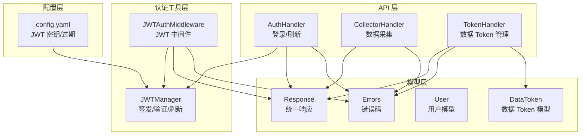
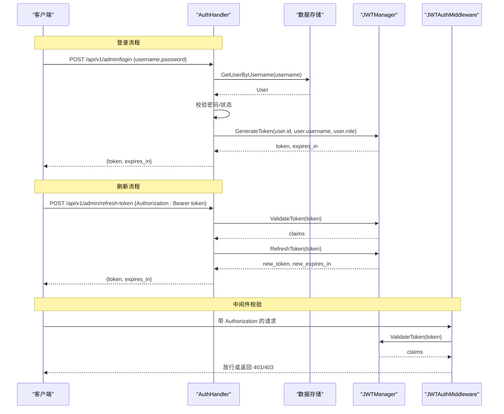
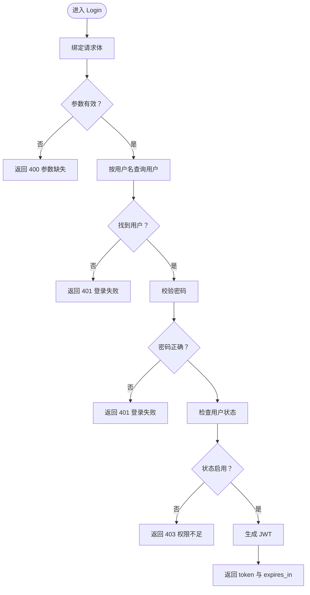
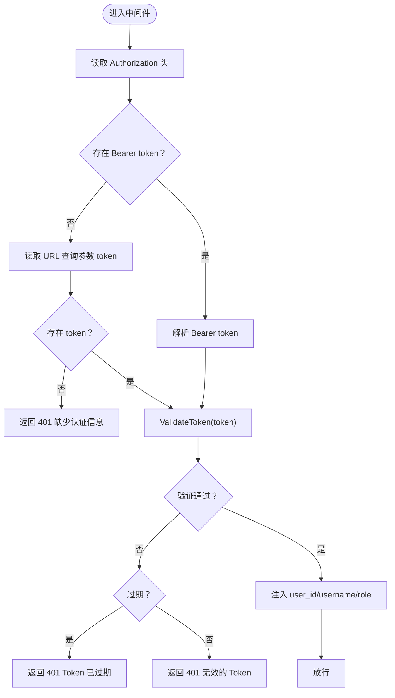
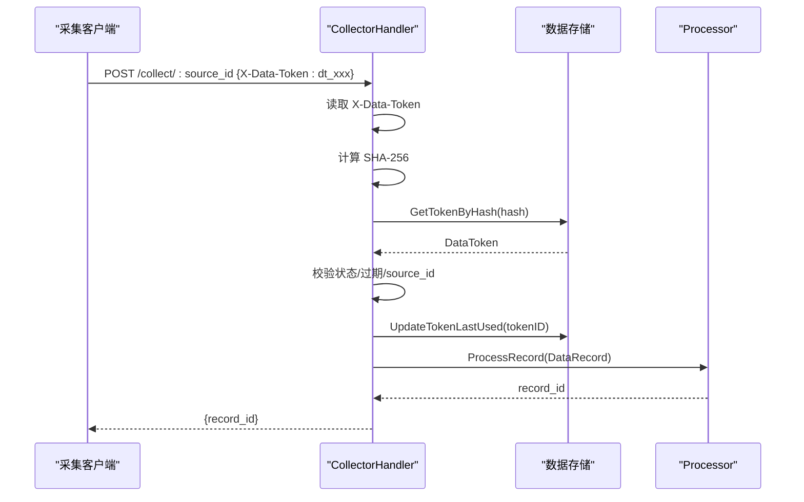
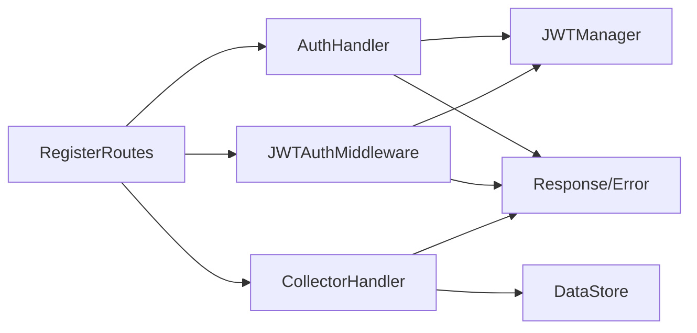

# 认证接口

<cite>
**本文引用的文件**
- [internal/api/auth.go](file://internal/api/auth.go)
- [internal/auth/jwt.go](file://internal/auth/jwt.go)
- [internal/auth/middleware.go](file://internal/auth/middleware.go)
- [internal/api/router.go](file://internal/api/router.go)
- [internal/model/response.go](file://internal/model/response.go)
- [internal/model/errors.go](file://internal/model/errors.go)
- [internal/model/user.go](file://internal/model/user.go)
- [internal/model/token.go](file://internal/model/token.go)
- [internal/api/collector.go](file://internal/api/collector.go)
- [internal/api/token.go](file://internal/api/token.go)
- [configs/config.yaml](file://configs/config.yaml)
- [web/src/api/auth.ts](file://web/src/api/auth.ts)
</cite>

## 目录
1. [简介](#简介)
2. [项目结构](#项目结构)
3. [核心组件](#核心组件)
4. [架构总览](#架构总览)
5. [详细组件分析](#详细组件分析)
6. [依赖关系分析](#依赖关系分析)
7. [性能考量](#性能考量)
8. [故障排查指南](#故障排查指南)
9. [结论](#结论)

## 简介
本文件面向 DataCollector 的认证接口，重点覆盖以下内容：
- 管理端登录接口（POST /api/v1/admin/login）的请求参数、响应格式与 JWT 令牌生成机制
- JWT 认证中间件的工作原理（令牌解析、验证、过期处理、权限检查）
- 令牌刷新接口（POST /api/v1/admin/refresh-token）的使用方法与安全考虑
- 数据采集场景中的 X-Data-Token 头部认证机制
- 常见认证错误码与解决方案

## 项目结构
认证相关的核心代码分布在如下模块：
- API 层：登录、刷新、路由注册
- 认证工具层：JWT 管理器、中间件
- 模型层：统一响应、错误码、用户与数据 Token 模型
- 收集器层：数据采集接口对 X-Data-Token 的校验
- 配置层：JWT 密钥与过期时间配置

图表来源
- [internal/api/auth.go:1-147](file://internal/api/auth.go#L1-L147)
- [internal/auth/jwt.go:1-114](file://internal/auth/jwt.go#L1-L114)
- [internal/auth/middleware.go:1-148](file://internal/auth/middleware.go#L1-L148)
- [internal/model/response.go:1-72](file://internal/model/response.go#L1-L72)
- [internal/model/errors.go:1-84](file://internal/model/errors.go#L1-L84)
- [internal/model/user.go:1-15](file://internal/model/user.go#L1-L15)
- [internal/model/token.go:1-17](file://internal/model/token.go#L1-L17)
- [configs/config.yaml:23-25](file://configs/config.yaml#L23-L25)

章节来源
- [internal/api/router.go:12-116](file://internal/api/router.go#L12-L116)
- [configs/config.yaml:1-41](file://configs/config.yaml#L1-L41)

## 核心组件
- 登录接口（POST /api/v1/admin/login）
  - 请求体：用户名、密码
  - 响应体：token、expires_in（秒）
  - 生成 JWT：使用配置的密钥与过期时间
- 令牌刷新接口（POST /api/v1/admin/refresh-token）
  - 从 Authorization 头提取 Bearer token
  - 仅在剩余有效期小于 2 小时内允许刷新
  - 返回新 token 与新的 expires_in
- JWT 认证中间件
  - 从 Authorization: Bearer <token> 或 URL 查询参数 token 提取
  - 验证签名、过期时间
  - 将用户信息注入上下文，供后续处理器使用
- X-Data-Token 头部认证
  - 数据采集接口从 X-Data-Token 头读取明文 token
  - 服务端计算 SHA-256 哈希并在数据库中查找对应记录
  - 校验状态、过期时间、source_id 一致性

章节来源
- [internal/api/auth.go:38-126](file://internal/api/auth.go#L38-L126)
- [internal/auth/jwt.go:33-101](file://internal/auth/jwt.go#L33-L101)
- [internal/auth/middleware.go:19-63](file://internal/auth/middleware.go#L19-L63)
- [internal/api/collector.go:34-140](file://internal/api/collector.go#L34-L140)

## 架构总览
下图展示登录、刷新与中间件的整体交互流程。

图表来源
- [internal/api/auth.go:38-126](file://internal/api/auth.go#L38-L126)
- [internal/auth/jwt.go:61-101](file://internal/auth/jwt.go#L61-L101)
- [internal/auth/middleware.go:19-63](file://internal/auth/middleware.go#L19-L63)

## 详细组件分析

### 登录接口（POST /api/v1/admin/login）
- 请求参数
  - username：字符串，必填
  - password：字符串，必填
- 响应数据
  - token：JWT 字符串
  - expires_in：整数，秒
- 处理流程
  - 绑定并校验请求体
  - 通过用户名查询用户
  - 校验密码与用户状态
  - 生成 JWT（包含用户标识与角色）
  - 返回 token 与过期时间
- 错误码
  - 参数缺失：400，CodeParamMissing
  - 登录失败：401，CodeLoginFailed
  - 权限不足：403，CodePermissionDenied
  - 内部错误：500，CodeInternalError

图表来源
- [internal/api/auth.go:38-77](file://internal/api/auth.go#L38-L77)
- [internal/auth/jwt.go:33-58](file://internal/auth/jwt.go#L33-L58)

章节来源
- [internal/api/auth.go:26-77](file://internal/api/auth.go#L26-L77)
- [internal/model/response.go:58-66](file://internal/model/response.go#L58-L66)
- [internal/model/errors.go:13-38](file://internal/model/errors.go#L13-L38)
- [internal/model/user.go:5-14](file://internal/model/user.go#L5-L14)

### JWT 令牌生成机制
- Claims 结构
  - user_id、username、role
  - 注册声明：exp、iat、nbf
- 生成流程
  - 设置过期时间为当前时间 + 配置的过期时长
  - 使用 HS256 签名与配置的密钥
  - 返回 token 字符串与 expires_in 秒数
- 配置项
  - secret：JWT 密钥
  - expiration：过期时长（如 24h）

章节来源
- [internal/auth/jwt.go:11-17](file://internal/auth/jwt.go#L11-L17)
- [internal/auth/jwt.go:33-58](file://internal/auth/jwt.go#L33-L58)
- [configs/config.yaml:23-25](file://configs/config.yaml#L23-L25)

### JWT 认证中间件（Authorization/Bearer）
- 提取顺序
  - 优先从 Authorization: Bearer <token> 头提取
  - 若为空，尝试从 URL 查询参数 token（支持 WebSocket）
- 验证逻辑
  - 使用 HS256 算法与密钥验证签名
  - 检查过期时间
  - 成功后将 user_id、username、role 注入上下文
- 返回错误
  - 缺少认证信息：401，CodeInvalidJWT
  - Token 过期：401，CodeTokenExpired
  - 无效 Token：401，CodeInvalidJWT

图表来源
- [internal/auth/middleware.go:19-63](file://internal/auth/middleware.go#L19-L63)
- [internal/auth/jwt.go:61-82](file://internal/auth/jwt.go#L61-L82)

章节来源
- [internal/auth/middleware.go:11-63](file://internal/auth/middleware.go#L11-L63)
- [internal/model/errors.go:13-38](file://internal/model/errors.go#L13-L38)

### 令牌刷新接口（POST /api/v1/admin/refresh-token）
- 请求方式与路径
  - POST /api/v1/admin/refresh-token
  - Authorization: Bearer <token> 必填
- 刷新策略
  - 仅当剩余有效期小于 2 小时时允许刷新
  - 使用原 claims 重新签发新 token
- 响应
  - token、expires_in
- 错误码
  - 缺少 Authorization 头：401，CodeInvalidJWT
  - 无效 Authorization 格式：401，CodeInvalidJWT
  - Token 已过期：401，CodeTokenExpired
  - 未到可刷新窗口：400，CodeInvalidJWT
  - 其他无效 Token：401，CodeInvalidJWT

章节来源
- [internal/api/auth.go:85-126](file://internal/api/auth.go#L85-L126)
- [internal/auth/jwt.go:84-101](file://internal/auth/jwt.go#L84-L101)
- [internal/model/errors.go:13-38](file://internal/model/errors.go#L13-L38)

### X-Data-Token 头部认证（数据采集）
- 接口路径
  - POST /api/v1/collect/:source_id
  - POST /api/v1/collect/:source_id/batch
- 认证步骤
  - 从请求头 X-Data-Token 读取明文 token
  - 计算 SHA-256 哈希
  - 在存储中按哈希查找 token 记录
  - 校验状态、过期时间、source_id 一致性
  - 更新 token 最后使用时间
- 响应
  - 单条：返回 record_id
  - 批量：返回 total/succeeded/failed/record_ids

图表来源
- [internal/api/collector.go:34-140](file://internal/api/collector.go#L34-L140)
- [internal/model/token.go:5-16](file://internal/model/token.go#L5-L16)

章节来源
- [internal/api/collector.go:29-140](file://internal/api/collector.go#L29-L140)
- [internal/model/token.go:5-16](file://internal/model/token.go#L5-L16)

### 数据 Token 管理（与 X-Data-Token 关联）
- 创建 Data Token
  - 生成随机明文 token（dt_ 前缀 + 32 位十六进制）
  - 存储 SHA-256 哈希，不保存明文
  - 返回 token 仅一次可见
- 列表与状态管理
  - 列表接口不返回明文或哈希
  - 支持更新状态（启用/禁用）与删除

章节来源
- [internal/api/token.go:49-120](file://internal/api/token.go#L49-L120)
- [internal/model/token.go:5-16](file://internal/model/token.go#L5-L16)

## 依赖关系分析
- 认证接口依赖 JWT 管理器进行签发与验证
- 中间件依赖 JWT 管理器进行令牌校验
- 登录与刷新接口依赖统一响应与错误码
- 数据采集接口依赖存储层的 token 查找与更新
- 路由注册集中管理认证相关接口与中间件

图表来源
- [internal/api/auth.go:12-24](file://internal/api/auth.go#L12-L24)
- [internal/auth/middleware.go:19-63](file://internal/auth/middleware.go#L19-L63)
- [internal/api/router.go:14-31](file://internal/api/router.go#L14-L31)

章节来源
- [internal/api/router.go:12-116](file://internal/api/router.go#L12-L116)

## 性能考量
- JWT 验证为内存计算，开销极低
- 刷新策略限制在剩余时间小于 2 小时才允许，避免频繁刷新
- 数据采集接口对每个请求进行 token 校验与哈希查找，建议配合数据库索引优化
- 对于高并发场景，建议：
  - 使用高性能存储与连接池
  - 合理设置 JWT 过期时间，平衡安全性与刷新频率
  - 对采集接口启用速率限制（IP 与 Token 级别）

## 故障排查指南
- 常见错误码与含义
  - CodeLoginFailed（2000）：用户名或密码错误
  - CodeTokenExpired（2001）：JWT 已过期
  - CodePermissionDenied（2002）：权限不足（用户被禁用）
  - CodeInvalidJWT（2003）：无效的 JWT（格式错误、签名失败、过期）
  - CodeInvalidToken（1000）：数据采集场景无效的 Data Token
  - CodeTokenDisabled（1001）：Data Token 已禁用
  - CodeParamMissing（9000）：缺少必要参数
  - CodeInternalError（9001）：内部错误
- 常见问题与解决
  - 登录失败
    - 检查用户名与密码是否正确
    - 确认用户状态为启用
  - Token 过期
    - 使用刷新接口获取新 token
    - 确保在剩余时间小于 2 小时内执行刷新
  - 无效的 JWT
    - 确认 Authorization 头格式为 Bearer <token>
    - 检查密钥与过期时间配置是否一致
  - 数据采集失败
    - 确认 X-Data-Token 头存在且未过期
    - 检查 token 对应的数据源 ID 与请求路径一致
    - 确认 token 处于启用状态

章节来源
- [internal/model/errors.go:13-38](file://internal/model/errors.go#L13-L38)
- [internal/api/auth.go:47-76](file://internal/api/auth.go#L47-L76)
- [internal/auth/jwt.go:61-82](file://internal/auth/jwt.go#L61-L82)
- [internal/api/collector.go:51-75](file://internal/api/collector.go#L51-L75)

## 结论
本认证体系采用标准 JWT 与自定义 Data Token 双通道：
- 管理端使用 JWT，支持登录、刷新与基于角色的权限控制
- 数据采集使用 X-Data-Token，通过哈希存储保障安全性
- 中间件与统一响应/错误码确保了清晰的边界与一致的错误反馈
- 建议在生产环境妥善保管 JWT 密钥，合理设置过期时间，并对采集接口实施必要的速率限制与监控