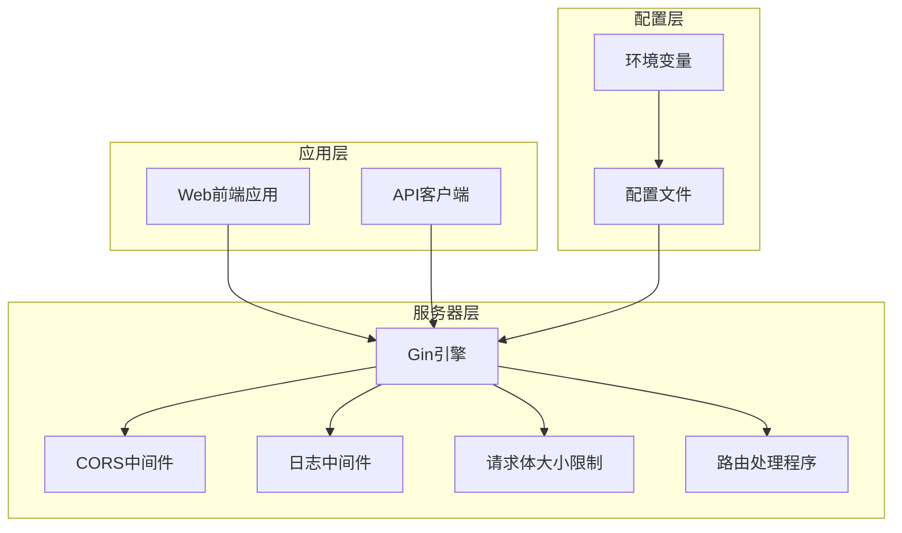
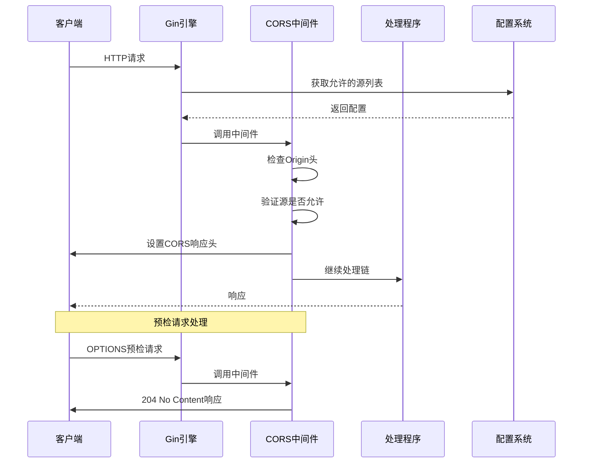
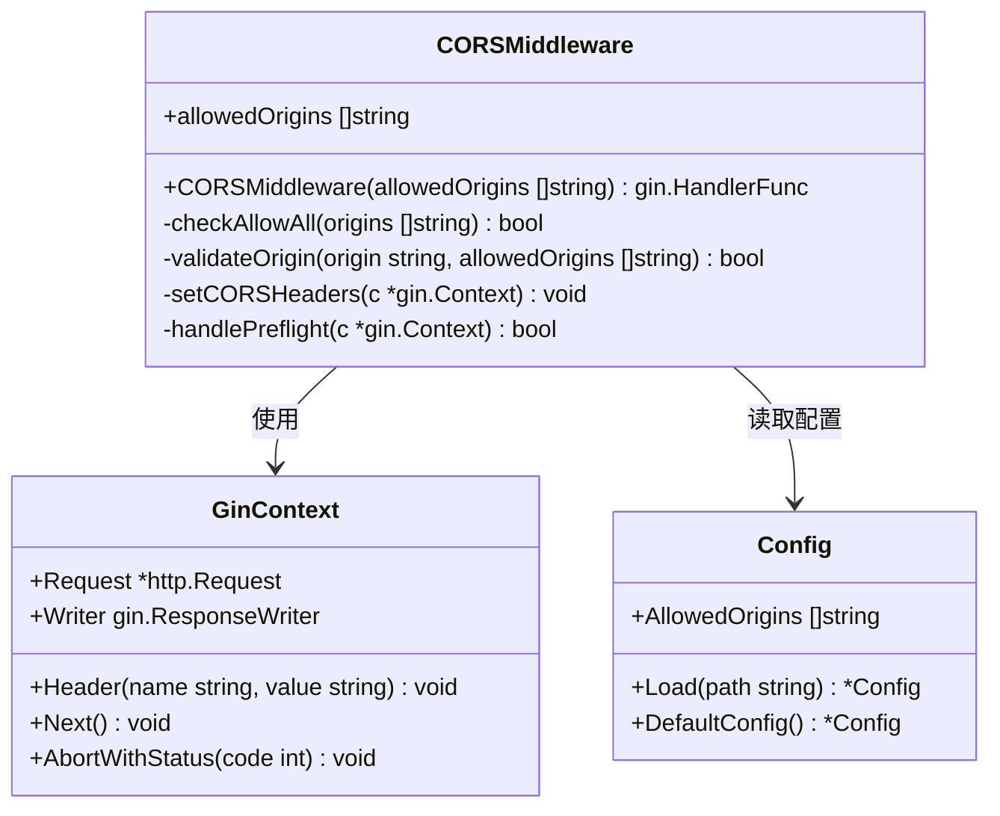
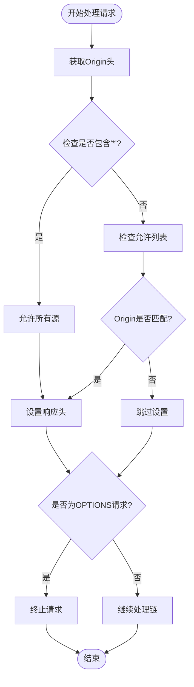
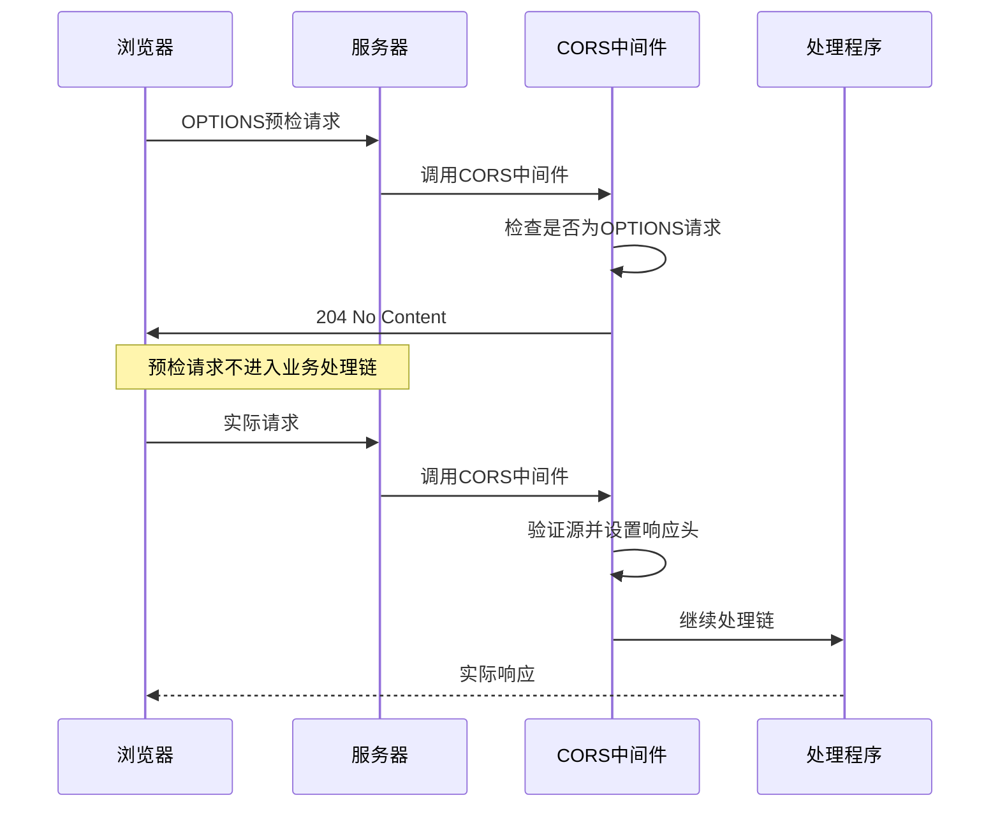
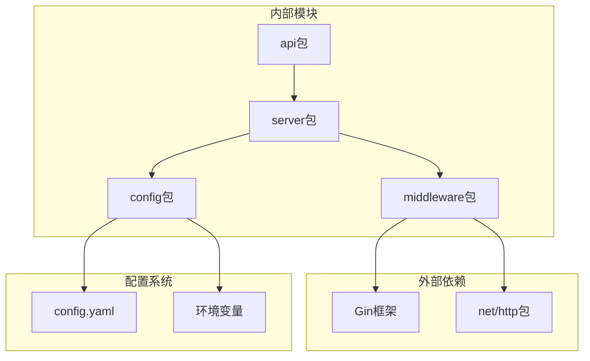
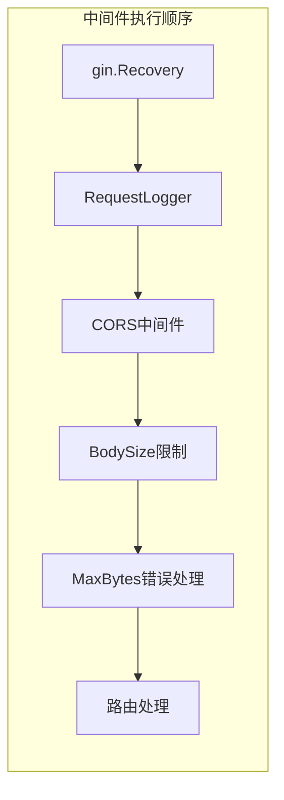

# CORS跨域中间件

<cite>
**本文档引用的文件**
- [cors.go](file://internal/middleware/cors.go)
- [server.go](file://internal/server/server.go)
- [config.go](file://internal/config/config.go)
- [config.yaml](file://configs/config.yaml)
- [router.go](file://internal/api/router.go)
- [main.go](file://cmd/server/main.go)
</cite>

## 目录
1. [简介](#简介)
2. [项目结构](#项目结构)
3. [核心组件](#核心组件)
4. [架构概览](#架构概览)
5. [详细组件分析](#详细组件分析)
6. [依赖分析](#依赖分析)
7. [性能考虑](#性能考虑)
8. [故障排除指南](#故障排除指南)
9. [结论](#结论)

## 简介

CORS（跨域资源共享）跨域中间件是本项目中的一个关键安全组件，负责处理浏览器的跨域请求。该中间件实现了标准的CORS协议，通过设置适当的响应头来控制哪些来源可以访问服务器资源，同时处理预检请求（OPTIONS）以支持复杂请求。

本中间件基于Gin框架构建，提供了灵活的配置选项，支持通配符配置和精确域名匹配，确保了Web应用与后端API之间的安全通信。

## 项目结构

CORS中间件在整个项目架构中的位置如下：

**图表来源**
- [server.go:54-87](file://internal/server/server.go#L54-L87)
- [cors.go:1-51](file://internal/middleware/cors.go#L1-L51)

**章节来源**
- [server.go:54-87](file://internal/server/server.go#L54-L87)
- [config.go:12-215](file://internal/config/config.go#L12-L215)

## 核心组件

### CORS中间件实现

CORS中间件的核心功能包括：

1. **源验证**：检查请求的Origin头是否在允许列表中
2. **响应头设置**：设置标准的CORS响应头
3. **预检请求处理**：正确处理OPTIONS预检请求
4. **安全策略**：实施最小权限原则的跨域访问控制

### 配置系统

中间件通过配置系统接收允许的源列表，支持以下配置方式：

- **通配符配置**：使用"*"允许所有来源
- **精确域名匹配**：指定具体的域名列表
- **环境变量覆盖**：支持运行时配置调整

**章节来源**
- [cors.go:9-50](file://internal/middleware/cors.go#L9-L50)
- [config.go:64-70](file://internal/config/config.go#L64-L70)
- [config.yaml:31-33](file://configs/config.yaml#L31-L33)

## 架构概览

CORS中间件在整个请求处理流程中的位置：

**图表来源**
- [server.go:62-68](file://internal/server/server.go#L62-L68)
- [cors.go:42-46](file://internal/middleware/cors.go#L42-L46)

## 详细组件分析

### CORS中间件类图

**图表来源**
- [cors.go:11-50](file://internal/middleware/cors.go#L11-L50)
- [config.go:64-70](file://internal/config/config.go#L64-L70)

### 源验证算法

CORS中间件采用双重验证机制：

**图表来源**
- [cors.go:15-46](file://internal/middleware/cors.go#L15-L46)

### 配置选项详解

#### allowedOrigins参数配置

allowedOrigins参数支持多种配置方式：

**通配符配置**
- 配置值：`["*"]`
- 效果：允许任何来源访问API
- 使用场景：开发环境或测试环境

**精确域名匹配**
- 配置值：`["https://example.com", "https://admin.example.com"]`
- 效果：仅允许指定域名访问
- 使用场景：生产环境的标准配置

**混合配置**
- 配置值：`["*", "https://trusted.example.com"]`
- 效果：除特定信任域名外，允许所有来源
- 使用场景：需要特殊权限的子域名

**章节来源**
- [cors.go:10-35](file://internal/middleware/cors.go#L10-L35)
- [config.yaml:31-33](file://configs/config.yaml#L31-L33)

### 预检请求处理机制

CORS中间件对预检请求（OPTIONS）的处理流程：

**图表来源**
- [cors.go:42-46](file://internal/middleware/cors.go#L42-L46)

### Access-Control-Allow-Headers配置

中间件默认设置的允许头包括：
- `Content-Type`: 支持JSON和表单数据
- `Authorization`: 支持JWT认证
- `X-Data-Token`: 支持数据采集令牌认证

这些头部的设置确保了常见的API交互需求得到满足。

**章节来源**
- [cors.go:38-40](file://internal/middleware/cors.go#L38-L40)

## 依赖分析

### 组件耦合关系

**图表来源**
- [server.go:3-20](file://internal/server/server.go#L3-L20)
- [cors.go:3-7](file://internal/middleware/cors.go#L3-L7)

### 执行顺序分析

CORS中间件在中间件链中的执行顺序：

**图表来源**
- [server.go:62-68](file://internal/server/server.go#L62-L68)

**章节来源**
- [server.go:62-68](file://internal/server/server.go#L62-L68)
- [router.go:14-31](file://internal/api/router.go#L14-L31)

## 性能考虑

### 内存使用优化

CORS中间件的内存使用特点：
- **零分配设计**：主要进行字符串比较操作
- **常量响应头**：避免动态生成响应头
- **早期退出**：在预检请求时快速返回

### 时间复杂度分析

- **源验证**：O(n)时间复杂度，n为允许源数量
- **预检请求处理**：O(1)时间复杂度
- **内存占用**：O(n)空间复杂度用于存储允许源列表

### 缓存策略

由于CORS配置通常在启动时确定，中间件不需要额外的缓存机制，这简化了实现并减少了潜在的竞态条件。

## 故障排除指南

### 常见配置问题

**问题1：CORS失败但配置正确**
- 检查是否正确设置了`Access-Control-Allow-Origin`头
- 确认请求的Origin头是否在允许列表中
- 验证预检请求是否正确处理

**问题2：通配符配置不生效**
- 确认配置文件中的`allowed_origins`数组格式正确
- 检查环境变量是否覆盖了配置
- 验证Gin模式设置（debug/release）

**问题3：预检请求被拒绝**
- 确认中间件在路由注册之前正确设置
- 检查是否正确处理OPTIONS方法
- 验证`Access-Control-Allow-Methods`头设置

### 调试技巧

1. **启用详细日志**：在开发环境中使用debug模式
2. **检查网络面板**：使用浏览器开发者工具查看CORS响应头
3. **验证配置加载**：确认配置文件正确解析

**章节来源**
- [server.go:56-58](file://internal/server/server.go#L56-L58)
- [config.go:82-98](file://internal/config/config.go#L82-L98)

## 结论

CORS跨域中间件为本项目提供了完整且高效的跨域解决方案。其设计特点包括：

1. **安全性优先**：默认采用严格的源验证机制
2. **配置灵活**：支持通配符和精确域名配置
3. **性能优化**：采用零分配设计和早期退出策略
4. **易于集成**：与Gin框架无缝集成，支持标准CORS协议

通过合理的配置和最佳实践，该中间件能够有效保护API免受跨域攻击，同时确保Web应用的正常功能需求得到满足。建议在生产环境中使用精确的域名白名单而非通配符配置，以最大化安全性。