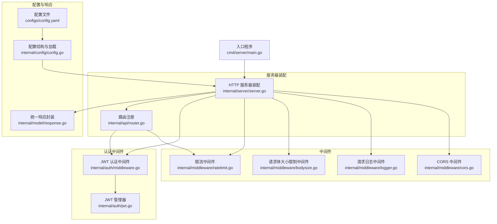
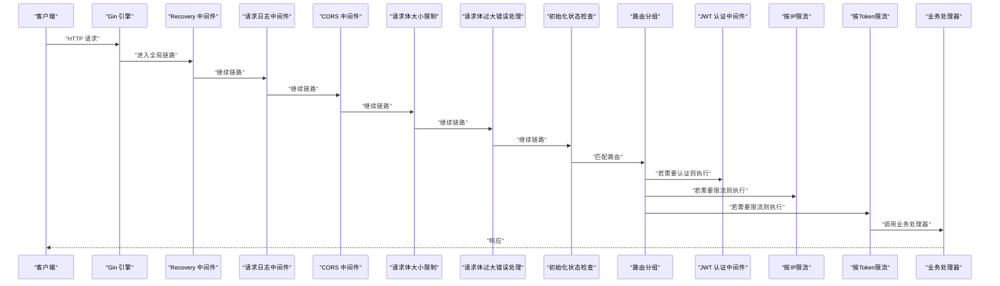
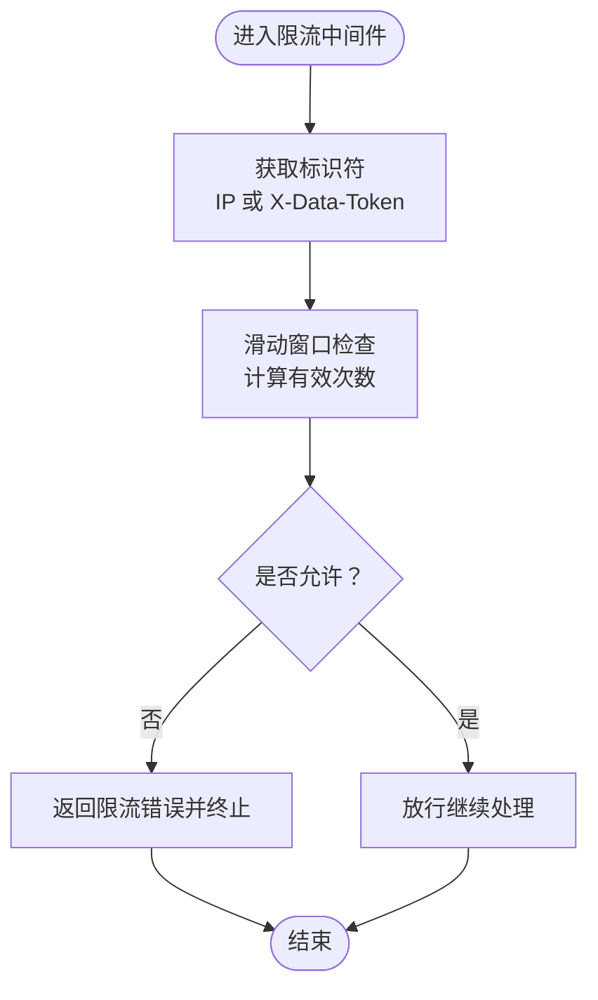
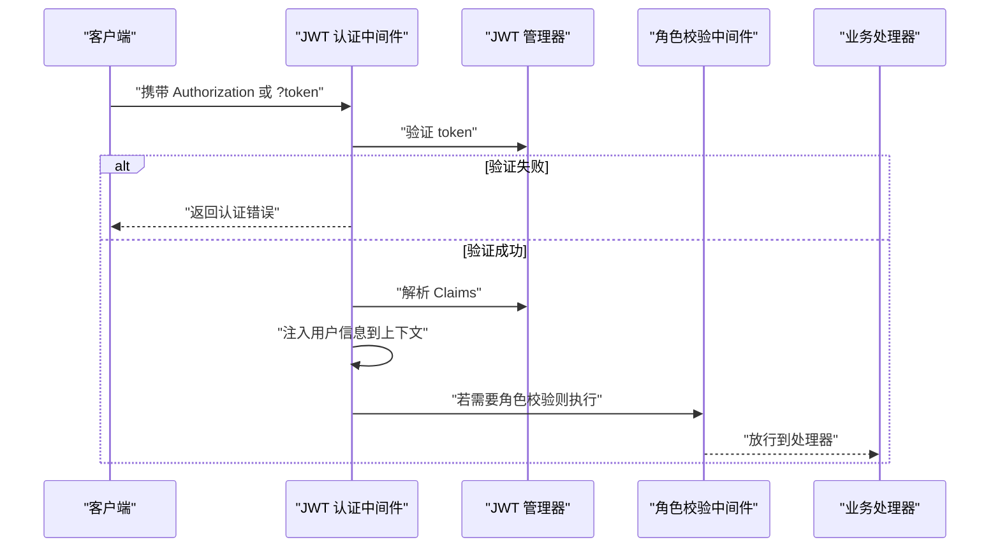
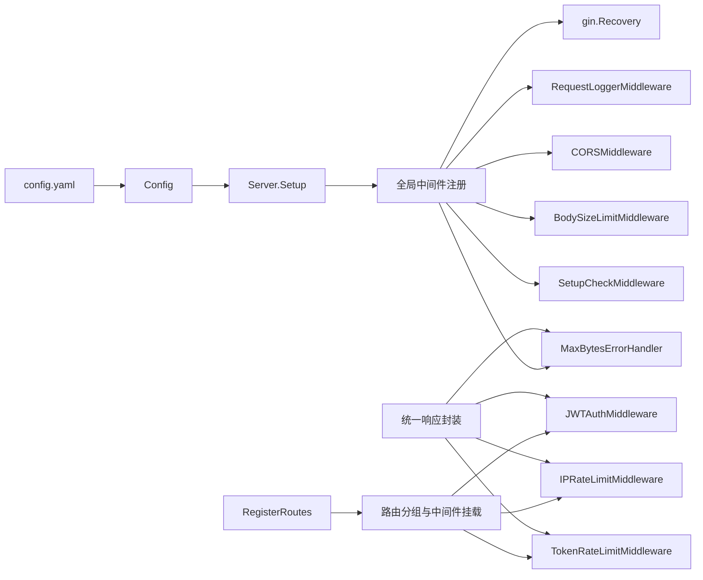

# 中间件和拦截器

<cite>
**本文引用的文件**
- [internal/middleware/cors.go](file://internal/middleware/cors.go)
- [internal/middleware/logger.go](file://internal/middleware/logger.go)
- [internal/middleware/bodysize.go](file://internal/middleware/bodysize.go)
- [internal/middleware/ratelimit.go](file://internal/middleware/ratelimit.go)
- [internal/auth/middleware.go](file://internal/auth/middleware.go)
- [internal/auth/jwt.go](file://internal/auth/jwt.go)
- [internal/server/server.go](file://internal/server/server.go)
- [internal/api/router.go](file://internal/api/router.go)
- [internal/config/config.go](file://internal/config/config.go)
- [configs/config.yaml](file://configs/config.yaml)
- [internal/model/response.go](file://internal/model/response.go)
- [cmd/server/main.go](file://cmd/server/main.go)
</cite>

## 目录
1. [简介](#简介)
2. [项目结构](#项目结构)
3. [核心组件](#核心组件)
4. [架构总览](#架构总览)
5. [详细组件分析](#详细组件分析)
6. [依赖分析](#依赖分析)
7. [性能考虑](#性能考虑)
8. [故障排除指南](#故障排除指南)
9. [结论](#结论)
10. [附录](#附录)

## 简介
本章节面向DataCollector的中间件与拦截器系统，围绕Gin框架中间件的使用与自定义实现展开，覆盖CORS配置、请求体大小限制、日志记录、限流控制等通用中间件，以及JWT认证中间件的实现原理与使用方法。文档同时给出中间件的执行顺序与优先级、自定义中间件开发指南与最佳实践、性能影响与优化策略，以及常见配置示例与故障排除方法，帮助开发者快速理解并正确使用中间件体系。

## 项目结构
中间件与拦截器相关代码主要分布在以下模块：
- 通用中间件：CORS、请求日志、请求体大小限制、限流
- 认证中间件：JWT认证、角色校验、初始化状态检查
- 服务器装配：全局中间件注册、路由分组与中间件挂载
- 配置：配置项与默认值、环境变量覆盖
- 统一响应：错误码与响应封装

图表来源
- [internal/server/server.go:54-87](file://internal/server/server.go#L54-L87)
- [internal/api/router.go:14-115](file://internal/api/router.go#L14-L115)
- [internal/middleware/cors.go:9-51](file://internal/middleware/cors.go#L9-L51)
- [internal/middleware/logger.go:11-67](file://internal/middleware/logger.go#L11-L67)
- [internal/middleware/bodysize.go:10-40](file://internal/middleware/bodysize.go#L10-L40)
- [internal/middleware/ratelimit.go:12-137](file://internal/middleware/ratelimit.go#L12-L137)
- [internal/auth/middleware.go:11-148](file://internal/auth/middleware.go#L11-L148)
- [internal/auth/jwt.go:19-114](file://internal/auth/jwt.go#L19-L114)
- [internal/config/config.go:12-215](file://internal/config/config.go#L12-L215)
- [configs/config.yaml:1-41](file://configs/config.yaml#L1-41)
- [internal/model/response.go:9-72](file://internal/model/response.go#L9-L72)
- [cmd/server/main.go:25-129](file://cmd/server/main.go#L25-L129)

章节来源
- [internal/server/server.go:54-87](file://internal/server/server.go#L54-L87)
- [internal/api/router.go:14-115](file://internal/api/router.go#L14-L115)
- [internal/config/config.go:12-215](file://internal/config/config.go#L12-L215)
- [configs/config.yaml:1-41](file://configs/config.yaml#L1-41)

## 核心组件
- CORS中间件：基于白名单或通配符控制跨域来源，设置常用CORS头，处理预检请求。
- 请求日志中间件：为每次请求生成唯一trace_id，记录方法、路径、状态码、耗时、客户端IP、UA等，并按状态码选择日志级别。
- 请求体大小限制中间件：通过MaxBytesReader限制请求体大小，并提供错误处理回调。
- 限流中间件：基于滑动窗口实现，支持按IP与按Data Token两种维度限流，内置定期清理过期记录。
- JWT认证中间件：从Authorization头或URL查询参数解析Bearer token，验证后将用户信息注入上下文；支持角色校验与初始化状态检查。
- 服务器装配：集中注册全局中间件与路由，按需在路由组上挂载认证与限流中间件。
- 配置系统：提供默认配置、YAML加载与环境变量覆盖，确保运行时可调整行为。

章节来源
- [internal/middleware/cors.go:9-51](file://internal/middleware/cors.go#L9-L51)
- [internal/middleware/logger.go:11-67](file://internal/middleware/logger.go#L11-L67)
- [internal/middleware/bodysize.go:10-40](file://internal/middleware/bodysize.go#L10-L40)
- [internal/middleware/ratelimit.go:12-137](file://internal/middleware/ratelimit.go#L12-L137)
- [internal/auth/middleware.go:11-148](file://internal/auth/middleware.go#L11-L148)
- [internal/server/server.go:54-87](file://internal/server/server.go#L54-L87)
- [internal/config/config.go:12-215](file://internal/config/config.go#L12-L215)

## 架构总览
下图展示中间件在请求生命周期中的执行顺序与作用范围，以及与路由分组的关系。

图表来源
- [internal/server/server.go:62-77](file://internal/server/server.go#L62-L77)
- [internal/api/router.go:47-55](file://internal/api/router.go#L47-L55)
- [internal/auth/middleware.go:19-63](file://internal/auth/middleware.go#L19-L63)
- [internal/middleware/ratelimit.go:100-136](file://internal/middleware/ratelimit.go#L100-L136)

## 详细组件分析

### CORS中间件
- 功能要点
  - 支持通配符“*”或显式白名单控制来源。
  - 设置常用CORS头：允许方法、允许头、预检缓存时间。
  - 对OPTIONS预检请求直接返回，不进入后续处理。
- 关键实现位置
  - 中间件函数与逻辑：[internal/middleware/cors.go:9-51](file://internal/middleware/cors.go#L9-L51)
  - 全局注册位置：[internal/server/server.go:65](file://internal/server/server.go#L65)
  - 配置来源：[configs/config.yaml:31-32](file://configs/config.yaml#L31-L32)

章节来源
- [internal/middleware/cors.go:9-51](file://internal/middleware/cors.go#L9-L51)
- [internal/server/server.go:65](file://internal/server/server.go#L65)
- [configs/config.yaml:31-32](file://configs/config.yaml#L31-L32)

### 请求日志中间件
- 功能要点
  - 生成唯一trace_id并写入上下文，便于跨组件追踪。
  - 记录方法、路径、状态码、耗时、客户端IP、UA。
  - 根据状态码选择日志级别（错误/警告/信息）。
  - 汇总并记录请求过程中的错误。
- 关键实现位置
  - 中间件函数与日志结构：[internal/middleware/logger.go:11-67](file://internal/middleware/logger.go#L11-L67)
  - 全局注册位置：[internal/server/server.go:64](file://internal/server/server.go#L64)

章节来源
- [internal/middleware/logger.go:11-67](file://internal/middleware/logger.go#L11-L67)
- [internal/server/server.go:64](file://internal/server/server.go#L64)

### 请求体大小限制中间件
- 功能要点
  - 使用MaxBytesReader限制请求体大小，避免过大请求导致内存压力。
  - 提供错误处理回调，识别“请求体过大”错误并返回标准错误响应。
- 关键实现位置
  - 限流中间件与错误处理：[internal/middleware/bodysize.go:10-40](file://internal/middleware/bodysize.go#L10-L40)
  - 全局注册位置：[internal/server/server.go:66-67](file://internal/server/server.go#L66-L67)
  - 配置来源：[configs/config.yaml:28](file://configs/config.yaml#L28)

章节来源
- [internal/middleware/bodysize.go:10-40](file://internal/middleware/bodysize.go#L10-L40)
- [internal/server/server.go:66-67](file://internal/server/server.go#L66-L67)
- [configs/config.yaml:28](file://configs/config.yaml#L28)

### 限流中间件
- 功能要点
  - 滑动窗口算法：维护每个标识符（IP或Token）的时间戳列表，窗口外的记录自动清理。
  - 支持按IP限流与按Data Token限流，分别在不同路由组上挂载。
  - 定时清理过期记录，避免内存无限增长。
- 关键实现位置
  - 限流器结构与算法：[internal/middleware/ratelimit.go:12-98](file://internal/middleware/ratelimit.go#L12-L98)
  - IP限流中间件：[internal/middleware/ratelimit.go:100-114](file://internal/middleware/ratelimit.go#L100-L114)
  - Token限流中间件：[internal/middleware/ratelimit.go:116-136](file://internal/middleware/ratelimit.go#L116-L136)
  - 路由组挂载示例：[internal/api/router.go:47-55](file://internal/api/router.go#L47-L55)
  - 配置来源：[configs/config.yaml:29-30](file://configs/config.yaml#L29-L30)

图表来源
- [internal/middleware/ratelimit.go:68-98](file://internal/middleware/ratelimit.go#L68-L98)
- [internal/middleware/ratelimit.go:100-136](file://internal/middleware/ratelimit.go#L100-L136)

章节来源
- [internal/middleware/ratelimit.go:12-137](file://internal/middleware/ratelimit.go#L12-L137)
- [internal/api/router.go:47-55](file://internal/api/router.go#L47-L55)
- [configs/config.yaml:29-30](file://configs/config.yaml#L29-L30)

### JWT认证中间件与RBAC
- 功能要点
  - 从Authorization头解析Bearer token，若不存在则尝试URL查询参数token（兼容WebSocket）。
  - 验证失败返回相应错误码；成功则将用户信息注入上下文（user_id、username、role）。
  - 提供RequireRole中间件进行角色校验。
  - 提供SetupCheckMiddleware检查系统初始化状态，未初始化时对管理页面与API做差异化处理。
- 关键实现位置
  - JWT认证中间件：[internal/auth/middleware.go:19-63](file://internal/auth/middleware.go#L19-L63)
  - 角色校验中间件：[internal/auth/middleware.go:68-95](file://internal/auth/middleware.go#L68-L95)
  - 初始化状态检查中间件：[internal/auth/middleware.go:103-147](file://internal/auth/middleware.go#L103-L147)
  - JWT管理器（签发/验证/刷新）：[internal/auth/jwt.go:19-114](file://internal/auth/jwt.go#L19-L114)
  - 路由组挂载示例：[internal/api/router.go:64-114](file://internal/api/router.go#L64-L114)

图表来源
- [internal/auth/middleware.go:19-63](file://internal/auth/middleware.go#L19-L63)
- [internal/auth/jwt.go:60-82](file://internal/auth/jwt.go#L60-L82)
- [internal/auth/middleware.go:68-95](file://internal/auth/middleware.go#L68-L95)

章节来源
- [internal/auth/middleware.go:19-147](file://internal/auth/middleware.go#L19-L147)
- [internal/auth/jwt.go:19-114](file://internal/auth/jwt.go#L19-L114)
- [internal/api/router.go:64-114](file://internal/api/router.go#L64-L114)

### 服务器装配与中间件注册
- 全局中间件注册顺序
  - Recovery -> 请求日志 -> CORS -> 请求体大小限制 -> 请求体过大错误处理 -> 初始化状态检查
- 路由分组与中间件挂载
  - 数据采集路由组：挂载按IP限流与按Token限流中间件
  - 管理后台路由组：挂载JWT认证中间件
  - 重新初始化路由组：挂载JWT认证与RequireRole中间件
- 关键实现位置
  - 全局中间件注册与路由注册：[internal/server/server.go:62-87](file://internal/server/server.go#L62-L87)
  - 路由分组与中间件挂载：[internal/api/router.go:34-114](file://internal/api/router.go#L34-L114)

章节来源
- [internal/server/server.go:62-87](file://internal/server/server.go#L62-L87)
- [internal/api/router.go:34-114](file://internal/api/router.go#L34-L114)

## 依赖分析
- 中间件与服务器装配
  - 服务器装配负责集中注册全局中间件与路由，路由分组在API层注册时按需挂载认证与限流中间件。
- 中间件与配置
  - CORS允许来源、请求体大小限制、限流阈值均来自配置文件与默认配置，支持环境变量覆盖。
- 中间件与统一响应
  - 中间件在错误场景下通过统一响应封装发送标准错误码与消息。

图表来源
- [internal/server/server.go:62-87](file://internal/server/server.go#L62-L87)
- [internal/api/router.go:14-115](file://internal/api/router.go#L14-L115)
- [internal/config/config.go:12-215](file://internal/config/config.go#L12-L215)
- [configs/config.yaml:1-41](file://configs/config.yaml#L1-41)
- [internal/model/response.go:9-72](file://internal/model/response.go#L9-L72)

章节来源
- [internal/server/server.go:62-87](file://internal/server/server.go#L62-L87)
- [internal/api/router.go:14-115](file://internal/api/router.go#L14-L115)
- [internal/config/config.go:12-215](file://internal/config/config.go#L12-L215)
- [configs/config.yaml:1-41](file://configs/config.yaml#L1-41)
- [internal/model/response.go:9-72](file://internal/model/response.go#L9-L72)

## 性能考虑
- 中间件顺序与开销
  - Recovery与日志中间件通常开销较小，建议置于链路前端，尽早捕获异常与记录信息。
  - CORS与请求体大小限制属于轻量I/O操作，对吞吐影响有限。
  - 限流中间件涉及内存与锁操作，应合理设置限流阈值与窗口大小，避免过度限制。
- 限流算法优化
  - 滑动窗口算法在高并发下会增加锁竞争，可通过更细粒度的键空间划分（如按来源+路径）降低热点。
  - 定期清理任务按分钟触发，建议结合业务峰值时段评估清理频率。
- 日志性能
  - 结构化日志与trace_id生成成本较低，但大量错误日志会带来IO压力，建议按状态码分级输出。
- 请求体限制
  - MaxBytesReader在读取时触发错误，建议与错误处理中间件配合，避免阻塞后续处理。
- 配置与环境变量
  - 通过环境变量覆盖配置可减少重启成本，建议在生产环境谨慎调整限流与日志级别。

[本节为通用性能讨论，无需具体文件引用]

## 故障排除指南
- CORS相关问题
  - 症状：浏览器报跨域错误或预检失败。
  - 排查：确认配置中的允许来源是否包含目标域名；检查预检请求是否被提前终止。
  - 参考位置：[internal/middleware/cors.go:9-51](file://internal/middleware/cors.go#L9-L51)，[configs/config.yaml:31-32](file://configs/config.yaml#L31-L32)
- 请求体过大
  - 症状：返回“请求体过大”错误。
  - 排查：确认配置中的最大请求体大小；检查是否正确挂载了请求体限制与错误处理中间件。
  - 参考位置：[internal/middleware/bodysize.go:10-40](file://internal/middleware/bodysize.go#L10-L40)，[configs/config.yaml:28](file://configs/config.yaml#L28)
- 限流触发
  - 症状：频繁收到“请求频率超限”错误。
  - 排查：检查IP或Token限流阈值；确认限流中间件是否正确挂载到对应路由组。
  - 参考位置：[internal/middleware/ratelimit.go:100-136](file://internal/middleware/ratelimit.go#L100-L136)，[internal/api/router.go:47-55](file://internal/api/router.go#L47-L55)
- 认证失败
  - 症状：返回“缺少认证信息/无效的Token/Token已过期”等错误。
  - 排查：确认Authorization头格式或URL查询参数token；检查JWT密钥与过期时间配置。
  - 参考位置：[internal/auth/middleware.go:19-63](file://internal/auth/middleware.go#L19-L63)，[internal/auth/jwt.go:60-82](file://internal/auth/jwt.go#L60-L82)
- 权限不足
  - 症状：返回“权限不足”错误。
  - 排查：确认用户角色与RequireRole中间件允许的角色列表。
  - 参考位置：[internal/auth/middleware.go:68-95](file://internal/auth/middleware.go#L68-L95)
- 初始化状态检查
  - 症状：管理页面被重定向至初始化页面，API返回“系统未初始化”。
  - 排查：确认系统初始化状态配置；检查初始化状态检查中间件对路径的判断逻辑。
  - 参考位置：[internal/auth/middleware.go:103-147](file://internal/auth/middleware.go#L103-L147)

章节来源
- [internal/middleware/cors.go:9-51](file://internal/middleware/cors.go#L9-L51)
- [internal/middleware/bodysize.go:10-40](file://internal/middleware/bodysize.go#L10-L40)
- [internal/middleware/ratelimit.go:100-136](file://internal/middleware/ratelimit.go#L100-L136)
- [internal/auth/middleware.go:19-147](file://internal/auth/middleware.go#L19-L147)
- [internal/auth/jwt.go:60-82](file://internal/auth/jwt.go#L60-L82)
- [configs/config.yaml:28-32](file://configs/config.yaml#L28-L32)

## 结论
DataCollector的中间件与拦截器体系以Gin为核心，围绕CORS、日志、请求体限制、限流与JWT认证构建了完整的安全与可观测性基础。通过全局中间件与路由分组的组合，实现了灵活的执行顺序与优先级控制。配合配置系统与统一响应封装，既保证了易用性，也兼顾了性能与可维护性。建议在生产环境中根据业务流量与安全需求，合理设置限流阈值、日志级别与CORS策略，并持续监控中间件对系统性能的影响。

[本节为总结性内容，无需具体文件引用]

## 附录

### 中间件执行顺序与优先级说明
- 全局中间件顺序（从上到下依次执行）：
  1) Recovery
  2) 请求日志
  3) CORS
  4) 请求体大小限制
  5) 请求体过大错误处理
  6) 初始化状态检查
- 路由分组中间件：
  - 数据采集路由组：按IP限流 -> 按Token限流
  - 管理后台路由组：JWT认证
  - 重新初始化路由组：JWT认证 -> 角色校验

章节来源
- [internal/server/server.go:62-87](file://internal/server/server.go#L62-L87)
- [internal/api/router.go:47-114](file://internal/api/router.go#L47-L114)

### 自定义中间件开发指南与最佳实践
- 开发步骤
  - 明确职责：单一职责，避免在中间件中处理业务逻辑。
  - 正确使用c.Next()：在处理前调用以进入下游，在处理后记录结果。
  - 上下文传递：通过c.Set/c.Get在中间件间传递必要信息。
  - 错误处理：遵循统一响应封装，返回标准错误码与消息。
  - 性能考量：避免在中间件中进行昂贵操作；必要时使用异步或缓存。
- 最佳实践
  - 将中间件注册在合适的层级（全局或路由组），避免重复执行。
  - 对关键中间件（如限流、认证）进行参数化配置，支持环境变量覆盖。
  - 在开发模式下开启更详细的日志，生产模式下调低日志级别。

[本节为通用指导，无需具体文件引用]

### 常见中间件配置示例
- CORS配置
  - 允许来源：支持通配符“*”或指定域名列表
  - 参考位置：[configs/config.yaml:31-32](file://configs/config.yaml#L31-L32)
- 请求体大小限制
  - 默认1MB，可根据业务调整
  - 参考位置：[configs/config.yaml:28](file://configs/config.yaml#L28)
- 限流配置
  - 按IP每分钟请求数、按Token每分钟请求数
  - 参考位置：[configs/config.yaml:29-30](file://configs/config.yaml#L29-L30)
- JWT配置
  - 密钥与过期时间
  - 参考位置：[configs/config.yaml:23-25](file://configs/config.yaml#L23-L25)

章节来源
- [configs/config.yaml:23-32](file://configs/config.yaml#L23-L32)