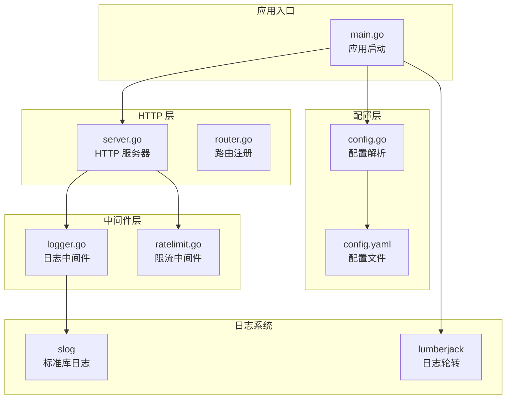
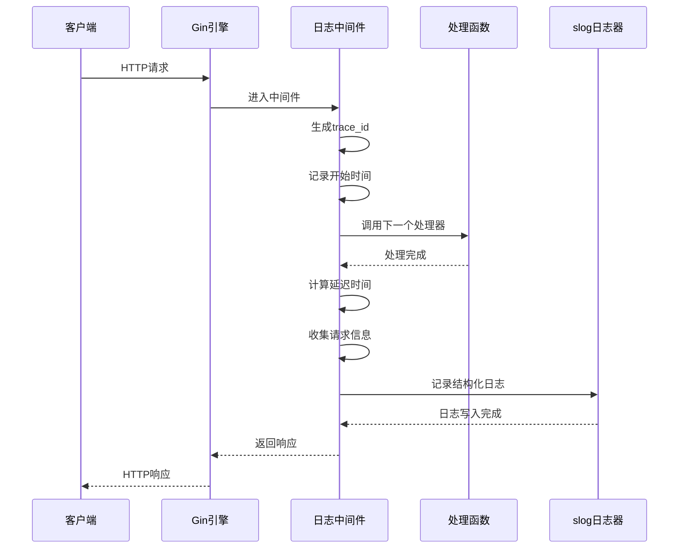
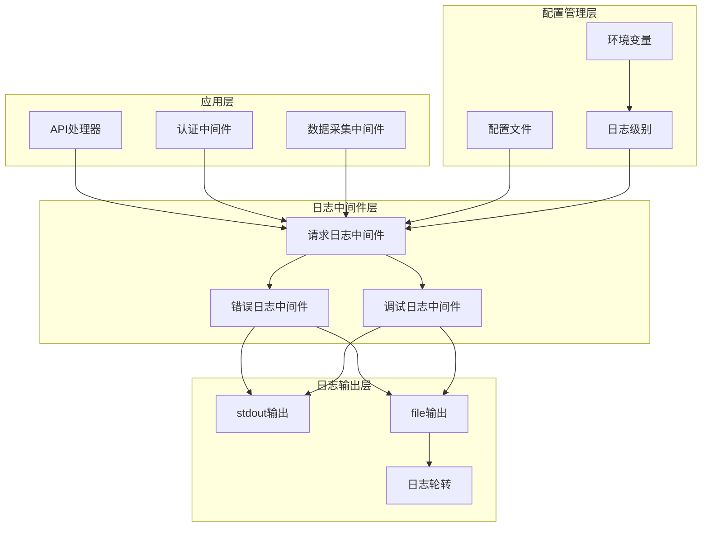
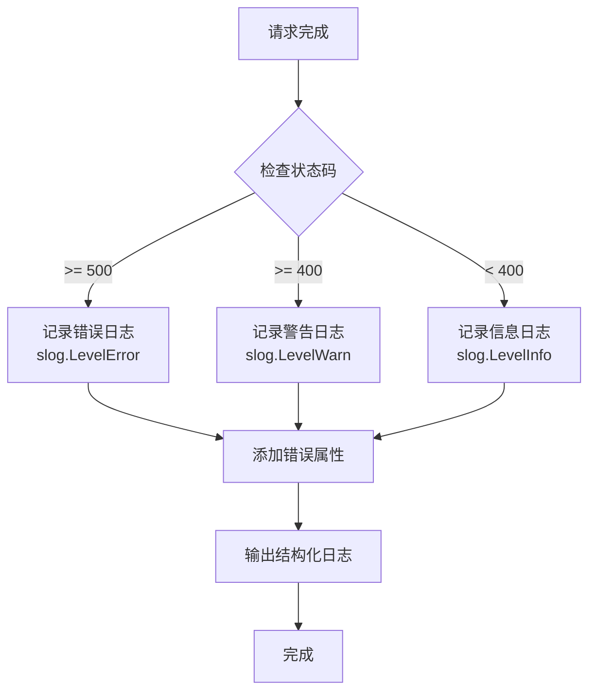
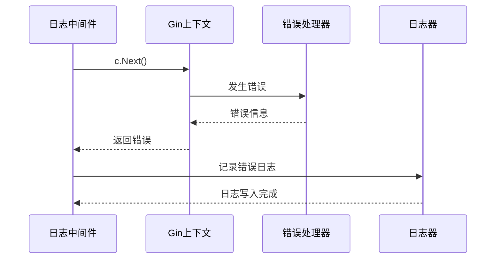
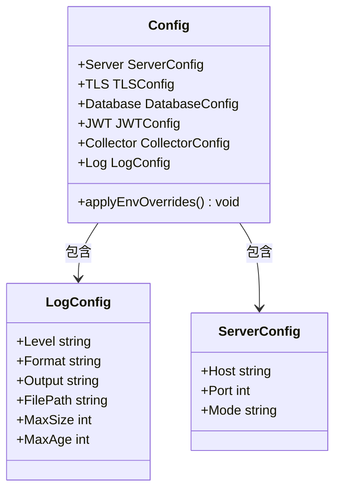
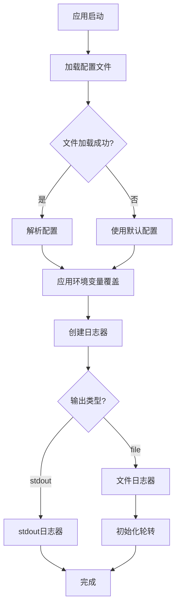
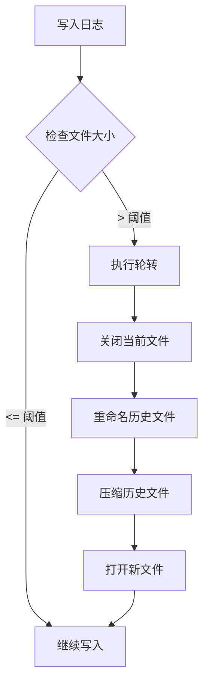
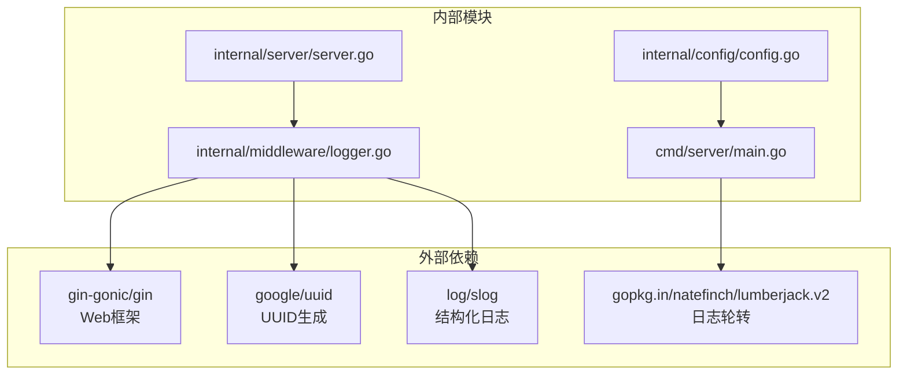
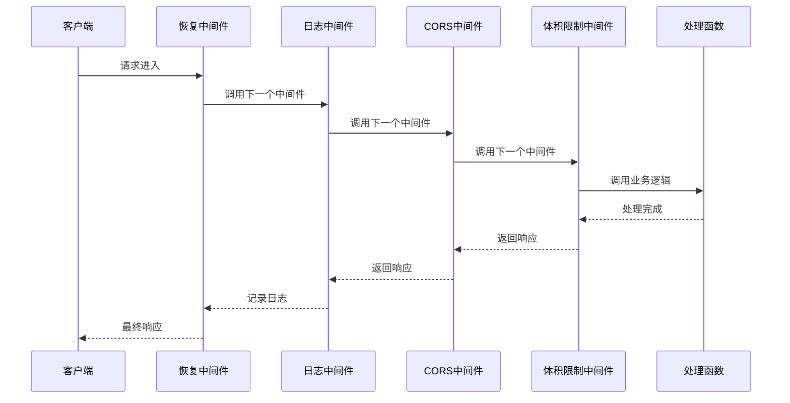

# 日志记录中间件

<cite>
**本文档引用的文件**
- [logger.go](file://internal/middleware/logger.go)
- [main.go](file://cmd/server/main.go)
- [config.go](file://internal/config/config.go)
- [config.yaml](file://configs/config.yaml)
- [server.go](file://internal/server/server.go)
- [router.go](file://internal/api/router.go)
- [ratelimit.go](file://internal/middleware/ratelimit.go)
- [errors.go](file://internal/model/errors.go)
</cite>

## 目录
1. [简介](#简介)
2. [项目结构](#项目结构)
3. [核心组件](#核心组件)
4. [架构概览](#架构概览)
5. [详细组件分析](#详细组件分析)
6. [依赖分析](#依赖分析)
7. [性能考虑](#性能考虑)
8. [故障排除指南](#故障排除指南)
9. [结论](#结论)
10. [附录](#附录)

## 简介

本项目采用 Go 标准库 `log/slog` 作为日志记录框架，实现了高性能、结构化的日志中间件。该中间件提供了完整的访问日志、错误日志和调试日志分类体系，支持多种输出格式和轮转策略，能够满足生产环境的日志需求。

日志中间件的核心特性包括：
- 结构化 JSON 格式日志输出
- 自动 trace_id 追踪机制
- 按状态码自动分级的日志记录
- 支持 stdout 和文件两种输出方式
- 基于 lumberjack 的日志轮转功能
- 可配置的日志级别过滤机制

## 项目结构

日志记录中间件在整个项目中的位置和作用如下：



**图表来源**
- [main.go:25-136](file://cmd/server/main.go#L25-L136)
- [config.go:12-80](file://internal/config/config.go#L12-L80)
- [server.go:54-87](file://internal/server/server.go#L54-L87)
- [logger.go:11-66](file://internal/middleware/logger.go#L11-L66)

**章节来源**
- [main.go:25-136](file://cmd/server/main.go#L25-L136)
- [config.go:12-80](file://internal/config/config.go#L12-L80)
- [server.go:54-87](file://internal/server/server.go#L54-L87)

## 核心组件

### 日志中间件架构

日志中间件采用 Gin 框架的中间件模式，通过链式调用实现请求生命周期的完整日志记录：



**图表来源**
- [logger.go:13-65](file://internal/middleware/logger.go#L13-L65)
- [server.go:62-67](file://internal/server/server.go#L62-L67)

### 日志格式设计

日志中间件采用结构化 JSON 格式，确保日志的可读性和可分析性：

| 字段名 | 类型 | 描述 | 示例 |
|--------|------|------|------|
| trace_id | string | 唯一请求追踪标识 | "550e8400-e29b-41d4-a716-446655440000" |
| method | string | HTTP 方法 | "GET", "POST" |
| path | string | 请求路径 | "/api/v1/data" |
| status | integer | HTTP 状态码 | 200, 404, 500 |
| latency | duration | 请求处理耗时 | "125ms", "2.3s" |
| client_ip | string | 客户端 IP 地址 | "192.168.1.100" |
| user_agent | string | 用户代理字符串 | "Mozilla/5.0..." |
| errors | array(string) | 错误信息数组 | ["invalid input"] |

**章节来源**
- [logger.go:38-55](file://internal/middleware/logger.go#L38-L55)

## 架构概览

### 日志系统整体架构



**图表来源**
- [main.go:138-153](file://cmd/server/main.go#L138-L153)
- [config.go:72-80](file://internal/config/config.go#L72-L80)
- [config.yaml:34-41](file://configs/config.yaml#L34-L41)

### 日志级别分类

系统采用基于 HTTP 状态码的智能日志级别分类机制：



**图表来源**
- [logger.go:57-64](file://internal/middleware/logger.go#L57-L64)

**章节来源**
- [logger.go:57-64](file://internal/middleware/logger.go#L57-L64)

## 详细组件分析

### 请求日志中间件

#### 核心实现原理

请求日志中间件通过 Gin 的 `gin.HandlerFunc` 接口实现，采用前置处理和后置处理的模式：

```mermaid
classDiagram
class RequestLoggerMiddleware {
+logger *slog.Logger
+func(c *gin.Context) void
-generateTraceID() string
-collectRequestInfo() map[string]interface{}
-logRequest(attrs []slog.Attr) void
}
class slogLogger {
+LogAttrs(ctx context.Context, level slog.Level, msg string, attrs ...slog.Attr) void
}
class GinContext {
+Request *http.Request
+Writer *ResponseWriter
+ClientIP() string
+Next() void
+Errors gin.Errors
}
RequestLoggerMiddleware --> slogLogger : 使用
RequestLoggerMiddleware --> GinContext : 操作
```

**图表来源**
- [logger.go:13-65](file://internal/middleware/logger.go#L13-L65)

#### 请求处理流程

1. **请求开始阶段**：生成唯一 trace_id，记录开始时间
2. **请求处理阶段**：调用下一个处理器
3. **请求结束阶段**：计算延迟，收集请求信息，记录日志

#### 错误处理机制

当请求过程中出现错误时，中间件会自动捕获并记录：



**图表来源**
- [logger.go:48-55](file://internal/middleware/logger.go#L48-L55)

**章节来源**
- [logger.go:13-65](file://internal/middleware/logger.go#L13-L65)

### 配置管理系统

#### 配置结构设计

日志配置采用分层结构，支持文件配置和环境变量覆盖：



**图表来源**
- [config.go:72-80](file://internal/config/config.go#L72-L80)
- [config.go:12-27](file://internal/config/config.go#L12-L27)

#### 配置加载流程



**图表来源**
- [main.go:155-169](file://cmd/server/main.go#L155-L169)
- [main.go:138-153](file://cmd/server/main.go#L138-L153)

**章节来源**
- [config.go:72-80](file://internal/config/config.go#L72-L80)
- [main.go:155-169](file://cmd/server/main.go#L155-L169)

### 日志轮转机制

#### 轮转策略设计

系统采用 lumberjack 库实现高效的日志轮转：

| 参数 | 默认值 | 说明 |
|------|--------|------|
| Filename | ./logs/datacollector.log | 日志文件路径 |
| MaxSize | 100 MB | 单文件最大大小 |
| MaxAge | 30 天 | 保留最长时间 |
| MaxBackups | 3 个 | 保留的历史文件数量 |
| Compress | true | 是否压缩历史文件 |

#### 轮转触发条件



**图表来源**
- [main.go:139-146](file://cmd/server/main.go#L139-L146)

**章节来源**
- [main.go:139-146](file://cmd/server/main.go#L139-L146)

## 依赖分析

### 组件依赖关系



**图表来源**
- [logger.go:3-9](file://internal/middleware/logger.go#L3-L9)
- [main.go:13](file://cmd/server/main.go#L13)
- [server.go:10](file://internal/server/server.go#L10)

### 中间件集成分析

日志中间件在 Gin 中间件栈中的位置：



**图表来源**
- [server.go:62-74](file://internal/server/server.go#L62-L74)

**章节来源**
- [server.go:62-74](file://internal/server/server.go#L62-L74)

## 性能考虑

### 性能影响分析

日志中间件对系统性能的影响主要体现在以下几个方面：

#### 1. 异步日志记录

系统采用同步日志记录方式，确保日志的完整性和一致性。虽然会增加少量的处理时间，但保证了日志的可靠性。

#### 2. 结构化日志开销

JSON 格式的结构化日志相比文本格式会增加一定的 CPU 开销，但提供了更好的可读性和可分析性。

#### 3. 文件 I/O 性能

文件日志输出采用缓冲写入，减少了频繁的磁盘操作。日志轮转机制避免了单个文件过大导致的性能问题。

### 优化建议

#### 1. 日志级别优化
- 在生产环境中使用 `info` 级别，避免 `debug` 级别的详细日志
- 对高频请求可以考虑降低日志频率

#### 2. 输出策略优化
- 使用 stdout 输出便于容器化部署
- 生产环境推荐使用文件输出配合轮转

#### 3. 内存使用优化
- 合理设置日志轮转参数，避免过多的历史文件占用磁盘空间

## 故障排除指南

### 常见问题诊断

#### 1. 日志不输出问题

**症状**：应用运行正常但没有日志输出

**可能原因**：
- 日志级别设置过高
- 输出目标配置错误
- 权限问题导致无法写入文件

**解决方案**：
```bash
# 检查日志配置
cat configs/config.yaml | grep -A 10 log:

# 验证目录权限
ls -la logs/

# 测试日志输出
echo '{"level":"info","msg":"test"}' | tee -a logs/test.log
```

#### 2. 日志轮转失败

**症状**：日志文件没有按预期轮转

**可能原因**：
- 文件权限不足
- 磁盘空间不足
- 路径配置错误

**解决方案**：
```bash
# 检查磁盘空间
df -h logs/

# 验证轮转配置
cat configs/config.yaml | grep -A 5 max_size

# 手动测试轮转
touch logs/datacollector.log
# 然后触发轮转条件
```

#### 3. 性能问题

**症状**：应用响应变慢，怀疑日志影响性能

**诊断步骤**：
```bash
# 监控日志文件大小
watch -n 1 'du -h logs/'

# 检查日志级别
grep level configs/config.yaml

# 分析日志内容
tail -n 100 logs/datacollector.log | jq '.'
```

**章节来源**
- [config.yaml:34-41](file://configs/config.yaml#L34-L41)
- [main.go:171-184](file://cmd/server/main.go#L171-L184)

### 日志分析最佳实践

#### 1. 结构化日志分析

```bash
# 基础统计
jq -r '.method,.path,.status' logs/datacollector.log | sort | uniq -c

# 性能分析
jq -r '.path,.latency' logs/datacollector.log | sort -k2 -n

# 错误分析
jq -r '.status as $s | select($s >= 400) | "\(.path): \(.status)"' logs/datacollector.log
```

#### 2. 实时监控

```bash
# 实时查看日志
tail -f logs/datacollector.log | jq -r '.timestamp + " " + .level + " " + .msg'

# 监控错误率
tail -f logs/datacollector.log | jq -r '.status' | awk '{++S[$1]} END {for(i in S) print i, S[i]/NR}'
```

## 结论

本日志记录中间件通过以下特点实现了高效、可靠的日志管理：

1. **结构化设计**：采用 JSON 格式确保日志的可读性和可分析性
2. **智能分类**：基于 HTTP 状态码的自动日志级别分类
3. **灵活配置**：支持多种输出方式和轮转策略
4. **性能优化**：合理的内存使用和 I/O 操作
5. **易于扩展**：清晰的架构便于功能扩展

该中间件为数据采集系统的可观测性提供了坚实的基础，能够有效支持系统的监控、调试和故障排查工作。

## 附录

### 配置参考表

| 配置项 | 类型 | 默认值 | 说明 |
|--------|------|--------|------|
| log.level | string | "info" | 日志级别：debug, info, warn, error |
| log.format | string | "json" | 输出格式：json |
| log.output | string | "stdout" | 输出目标：stdout, file |
| log.file_path | string | "./logs/datacollector.log" | 文件路径 |
| log.max_size | int | 100 | 最大文件大小(MB) |
| log.max_age | int | 30 | 保留天数 |

### 环境变量覆盖

| 环境变量 | 说明 | 示例 |
|----------|------|------|
| LOG_LEVEL | 日志级别 | LOG_LEVEL=warn |
| DB_DRIVER | 数据库驱动 | DB_DRIVER=postgres |
| DB_SQLITE_PATH | SQLite路径 | DB_SQLITE_PATH=/var/lib/datacollector.db |

### 自定义开发指南

#### 1. 扩展日志字段

要在现有日志中添加自定义字段，修改日志中间件的属性构建部分：

```go
// 在 attrs 构建处添加自定义字段
attrs = append(attrs, 
    slog.String("custom_field", customValue),
    slog.Int("custom_number", customNumber),
)
```

#### 2. 自定义日志格式

要实现自定义日志格式，需要修改日志器的创建方式：

```go
// 修改日志处理器
logger = slog.New(slog.NewTextHandler(writer, &slog.HandlerOptions{
    Level: level,
}))
```

#### 3. 新增日志级别

要添加新的日志级别，需要在配置解析和中间件逻辑中相应调整：

```go
// 在配置解析中添加新级别
case "trace":
    return slog.LevelDebug - 4

// 在中间件中使用新级别
if status >= 500 {
    logger.LogAttrs(ctx, slog.LevelError, msg, attrs...)
} else if status >= 400 {
    logger.LogAttrs(ctx, slog.LevelWarn, msg, attrs...)
} else if status >= 300 {
    logger.LogAttrs(ctx, slog.LevelInfo, msg, attrs...)
} else {
    logger.LogAttrs(ctx, slog.LevelDebug, msg, attrs...) // 新增级别
}
```