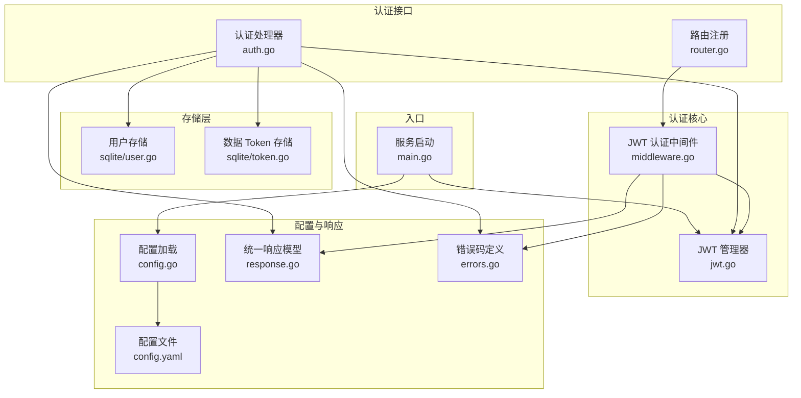
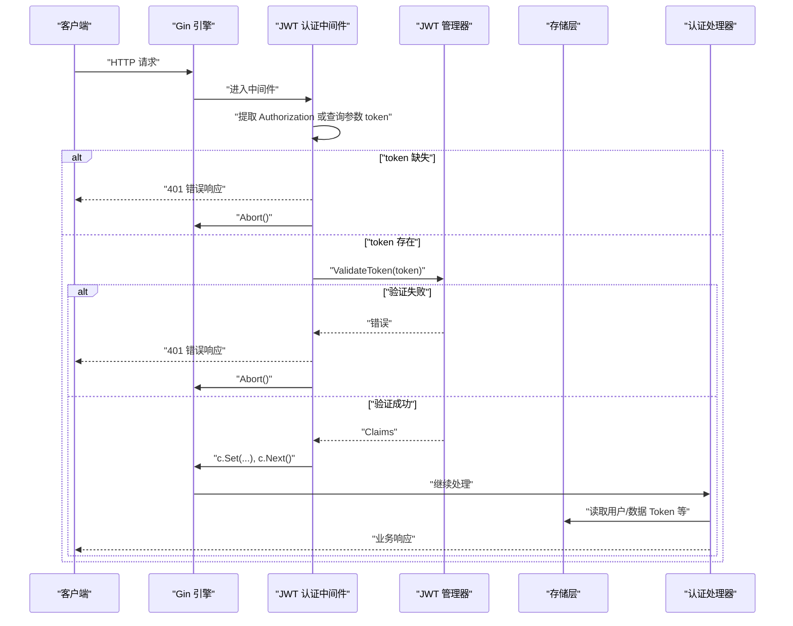
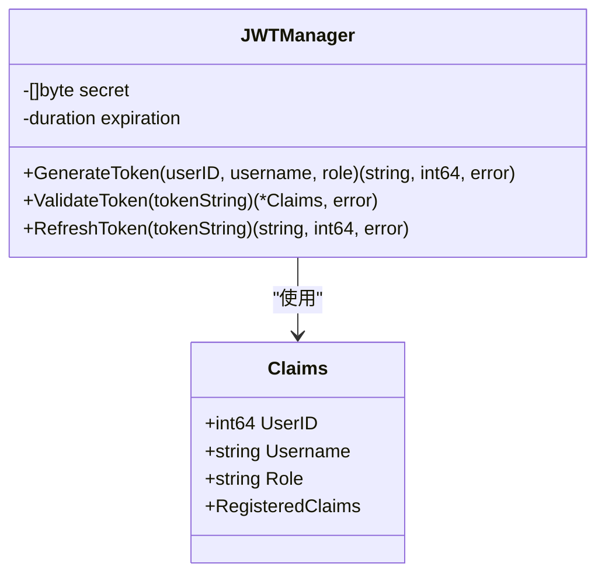
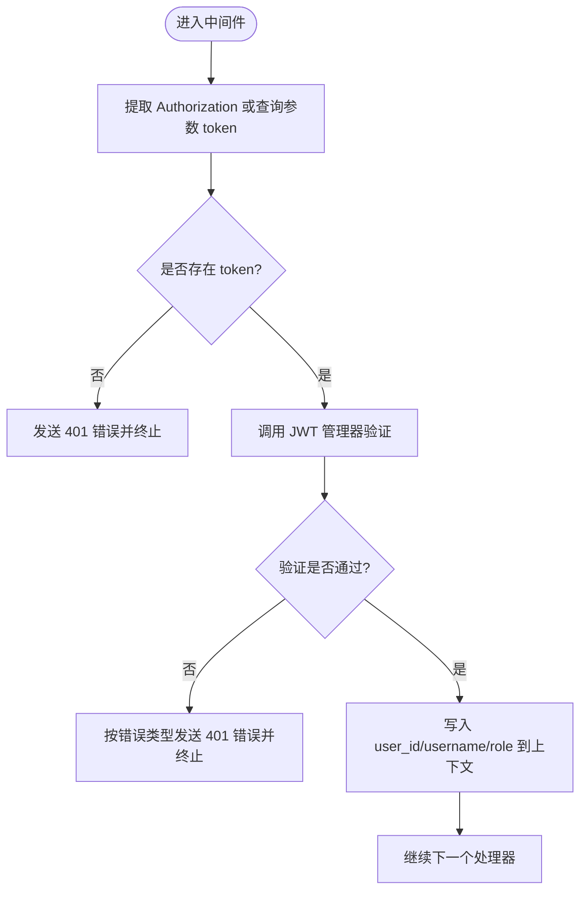
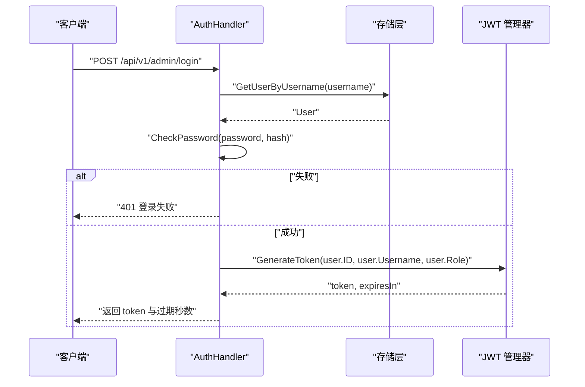
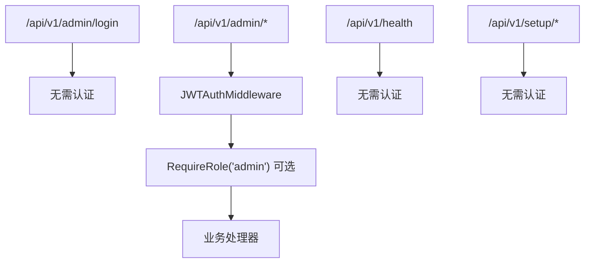
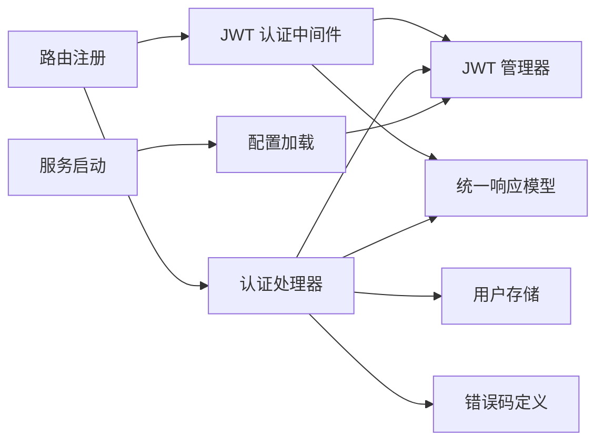

# 认证中间件

<cite>
**本文档引用的文件**
- [jwt.go](file://internal/auth/jwt.go)
- [middleware.go](file://internal/auth/middleware.go)
- [auth.go](file://internal/api/auth.go)
- [router.go](file://internal/api/router.go)
- [config.go](file://internal/config/config.go)
- [config.yaml](file://configs/config.yaml)
- [response.go](file://internal/model/response.go)
- [errors.go](file://internal/model/errors.go)
- [user.go](file://internal/model/user.go)
- [sqlite/user.go](file://internal/storage/sqlite/user.go)
- [sqlite/token.go](file://internal/storage/sqlite/token.go)
- [main.go](file://cmd/server/main.go)
</cite>

## 目录
1. [简介](#简介)
2. [项目结构](#项目结构)
3. [核心组件](#核心组件)
4. [架构总览](#架构总览)
5. [详细组件分析](#详细组件分析)
6. [依赖分析](#依赖分析)
7. [性能考虑](#性能考虑)
8. [故障排查指南](#故障排查指南)
9. [结论](#结论)
10. [附录](#附录)

## 简介
本文件面向认证中间件，系统性阐述基于 JWT 的认证中间件实现原理与验证流程，涵盖 Token 提取、解码与验证的完整过程；说明认证失败时的错误处理与响应机制；提供配置选项与自定义验证逻辑建议；解释与用户权限系统的集成方法；明确中间件在请求处理链中的位置与执行顺序；并给出安全最佳实践与常见攻击防护措施。

## 项目结构
认证相关代码主要分布在以下模块：
- 认证核心：JWT 管理器与 Gin 中间件
- 认证接口：登录、Token 刷新等 API
- 路由注册：将中间件挂载到相应路由组
- 配置：JWT 密钥与过期时间配置
- 响应模型：统一错误码与响应格式
- 存储层：用户与数据 Token 的持久化

**图表来源**
- [jwt.go:1-114](file://internal/auth/jwt.go#L1-L114)
- [middleware.go:1-148](file://internal/auth/middleware.go#L1-L148)
- [auth.go:1-147](file://internal/api/auth.go#L1-L147)
- [router.go:1-116](file://internal/api/router.go#L1-L116)
- [config.go:1-215](file://internal/config/config.go#L1-L215)
- [config.yaml:1-41](file://configs/config.yaml#L1-L41)
- [response.go:1-72](file://internal/model/response.go#L1-L72)
- [errors.go:1-84](file://internal/model/errors.go#L1-L84)
- [sqlite/user.go:1-114](file://internal/storage/sqlite/user.go#L1-L114)
- [sqlite/token.go:1-137](file://internal/storage/sqlite/token.go#L1-L137)
- [main.go:1-201](file://cmd/server/main.go#L1-L201)

**章节来源**
- [jwt.go:1-114](file://internal/auth/jwt.go#L1-L114)
- [middleware.go:1-148](file://internal/auth/middleware.go#L1-L148)
- [auth.go:1-147](file://internal/api/auth.go#L1-L147)
- [router.go:1-116](file://internal/api/router.go#L1-L116)
- [config.go:1-215](file://internal/config/config.go#L1-L215)
- [config.yaml:1-41](file://configs/config.yaml#L1-L41)
- [response.go:1-72](file://internal/model/response.go#L1-L72)
- [errors.go:1-84](file://internal/model/errors.go#L1-L84)
- [sqlite/user.go:1-114](file://internal/storage/sqlite/user.go#L1-L114)
- [sqlite/token.go:1-137](file://internal/storage/sqlite/token.go#L1-L137)
- [main.go:1-201](file://cmd/server/main.go#L1-L201)

## 核心组件
- JWT 管理器：负责生成、验证与刷新 JWT，封装 Claims 结构，使用 HS256 签名与 HMAC 密钥。
- JWT 认证中间件：从请求头或查询参数提取 Token，调用 JWT 管理器验证，通过后将用户信息注入上下文。
- 认证处理器：提供登录与刷新 Token 接口，结合存储层进行用户校验与 Token 生成。
- 路由注册：将认证中间件挂载到需要鉴权的路由组，形成清晰的访问控制链路。
- 配置系统：从 YAML 文件与环境变量加载 JWT 密钥与过期时间，并在启动时初始化 JWT 管理器。
- 统一响应与错误码：规范错误返回，便于前端与客户端统一处理。

**章节来源**
- [jwt.go:11-114](file://internal/auth/jwt.go#L11-L114)
- [middleware.go:11-148](file://internal/auth/middleware.go#L11-L148)
- [auth.go:12-147](file://internal/api/auth.go#L12-L147)
- [router.go:14-116](file://internal/api/router.go#L14-L116)
- [config.go:58-146](file://internal/config/config.go#L58-L146)
- [config.yaml:23-25](file://configs/config.yaml#L23-L25)
- [response.go:9-72](file://internal/model/response.go#L9-L72)
- [errors.go:3-84](file://internal/model/errors.go#L3-L84)

## 架构总览
JWT 认证在请求处理链中的位置如下：
- 服务启动阶段加载配置并初始化 JWT 管理器。
- 路由注册阶段将 JWT 认证中间件挂载到需要鉴权的路由组。
- 请求到达时，中间件优先从 Authorization 头提取 Bearer Token，若为空则尝试从查询参数 token 获取（兼容 WebSocket）。
- 验证通过后，将用户标识写入上下文，继续后续处理器；失败则返回标准化错误并终止请求。

**图表来源**
- [middleware.go:19-63](file://internal/auth/middleware.go#L19-L63)
- [jwt.go:60-82](file://internal/auth/jwt.go#L60-L82)
- [auth.go:38-77](file://internal/api/auth.go#L38-L77)
- [router.go:57-105](file://internal/api/router.go#L57-L105)

**章节来源**
- [main.go:66-68](file://cmd/server/main.go#L66-L68)
- [router.go:57-105](file://internal/api/router.go#L57-L105)
- [middleware.go:19-63](file://internal/auth/middleware.go#L19-L63)
- [jwt.go:60-82](file://internal/auth/jwt.go#L60-L82)

## 详细组件分析

### JWT 管理器（JWTManager）
- Claims 结构：包含用户标识、用户名、角色以及标准声明（过期、签发、生效时间）。
- 生成 Token：设置过期时间与签发时间，使用 HS256 签名，返回 token 字符串与过期秒数。
- 验证 Token：解析并校验签名算法、过期时间与有效性，返回 Claims 或错误。
- 刷新 Token：在剩余有效期小于阈值时允许刷新，否则拒绝刷新请求。

**图表来源**
- [jwt.go:11-114](file://internal/auth/jwt.go#L11-L114)

**章节来源**
- [jwt.go:11-114](file://internal/auth/jwt.go#L11-L114)

### JWT 认证中间件（JWTAuthMiddleware）
- Token 提取策略：
  - 优先从 Authorization 头解析 Bearer Token。
  - 若缺失，尝试从查询参数 token 获取（用于 WebSocket 场景）。
- 验证与错误处理：
  - 未携带 token：返回 401，错误码对应“缺少认证信息”。
  - 验证失败：区分“过期”与“无效”，返回相应错误码并终止请求。
- 上下文注入：
  - 验证成功后将 user_id、username、role 写入 gin.Context，供后续处理器使用。

**图表来源**
- [middleware.go:19-63](file://internal/auth/middleware.go#L19-L63)

**章节来源**
- [middleware.go:11-63](file://internal/auth/middleware.go#L11-L63)
- [response.go:58-71](file://internal/model/response.go#L58-L71)
- [errors.go:13-17](file://internal/model/errors.go#L13-L17)

### 认证处理器（AuthHandler）
- 登录流程：
  - 校验请求参数，按用户名查询用户，验证密码与状态，生成 JWT 并返回 token 与过期秒数。
- 刷新 Token 流程：
  - 从 Authorization 头解析 Bearer Token，调用 JWT 管理器刷新，按剩余有效期阈值决定是否允许刷新。

**图表来源**
- [auth.go:38-77](file://internal/api/auth.go#L38-L77)
- [sqlite/user.go:36-63](file://internal/storage/sqlite/user.go#L36-L63)
- [jwt.go:33-58](file://internal/auth/jwt.go#L33-L58)

**章节来源**
- [auth.go:12-147](file://internal/api/auth.go#L12-L147)
- [sqlite/user.go:36-63](file://internal/storage/sqlite/user.go#L36-L63)
- [jwt.go:33-58](file://internal/auth/jwt.go#L33-L58)

### 路由与中间件挂载
- 路由分组：
  - /api/v1/admin 下的路由默认需要 JWT 认证。
  - /api/v1/admin/login 无需认证。
  - /api/v1/setup 与健康检查无需认证。
- 中间件执行顺序：
  - 先执行 JWT 认证中间件，再执行具体业务处理器。
  - 对于需要管理员角色的路由，还需配合 RequireRole 中间件。

**图表来源**
- [router.go:34-116](file://internal/api/router.go#L34-L116)

**章节来源**
- [router.go:14-116](file://internal/api/router.go#L14-L116)

### 配置与初始化
- 配置项：
  - jwt.secret：JWT 签名密钥。
  - jwt.expiration：Token 过期时间。
- 初始化流程：
  - 服务启动时加载配置，创建 JWT 管理器并注入到路由注册与认证处理器。

**章节来源**
- [config.yaml:23-25](file://configs/config.yaml#L23-L25)
- [config.go:58-146](file://internal/config/config.go#L58-L146)
- [main.go:66-68](file://cmd/server/main.go#L66-L68)

### 权限系统集成
- RBAC 角色中间件（RequireRole）：
  - 从上下文中读取 role，判断是否在允许列表内，不在则返回 403。
- 用户模型：
  - 包含角色字段，用于中间件判断。
- 集成方式：
  - 在路由组上挂载 RequireRole 中间件，限制特定操作仅管理员可执行。

**章节来源**
- [middleware.go:65-95](file://internal/auth/middleware.go#L65-L95)
- [user.go:5-14](file://internal/model/user.go#L5-L14)
- [router.go:107-114](file://internal/api/router.go#L107-L114)

## 依赖分析
- 认证中间件依赖 JWT 管理器与统一响应模型。
- 认证处理器依赖存储层（用户与数据 Token）、JWT 管理器与响应模型。
- 路由注册依赖认证中间件、处理器与配置。
- 配置系统贯穿启动流程，为 JWT 管理器提供密钥与过期时间。

**图表来源**
- [middleware.go:1-148](file://internal/auth/middleware.go#L1-L148)
- [jwt.go:1-114](file://internal/auth/jwt.go#L1-L114)
- [auth.go:1-147](file://internal/api/auth.go#L1-L147)
- [router.go:1-116](file://internal/api/router.go#L1-L116)
- [config.go:1-215](file://internal/config/config.go#L1-L215)
- [main.go:1-201](file://cmd/server/main.go#L1-L201)

**章节来源**
- [middleware.go:1-148](file://internal/auth/middleware.go#L1-L148)
- [jwt.go:1-114](file://internal/auth/jwt.go#L1-L114)
- [auth.go:1-147](file://internal/api/auth.go#L1-L147)
- [router.go:1-116](file://internal/api/router.go#L1-L116)
- [config.go:1-215](file://internal/config/config.go#L1-L215)
- [main.go:1-201](file://cmd/server/main.go#L1-L201)

## 性能考虑
- Token 验证为 O(1) 操作，开销极低。
- 建议：
  - 合理设置过期时间，平衡安全性与用户体验。
  - 对频繁刷新场景，可在应用层缓存少量短期刷新窗口内的用户会话信息以减少重复计算。
  - 使用高效存储与索引，确保登录与刷新时用户查询性能稳定。

## 故障排查指南
- 常见错误与定位：
  - 401 缺少认证信息：确认请求头 Authorization 或查询参数 token 是否正确传递。
  - 401 Token 已过期：提示用户重新登录或刷新 Token。
  - 401 无效的 JWT：检查签名密钥一致性与 Token 完整性。
  - 403 权限不足：确认用户角色与路由所需角色匹配。
- 建议排查步骤：
  - 检查配置文件与环境变量中的 jwt.secret 与 jwt.expiration。
  - 确认中间件挂载位置与路由分组是否正确。
  - 查看统一响应模型中的错误码与消息，辅助定位问题。

**章节来源**
- [middleware.go:38-54](file://internal/auth/middleware.go#L38-L54)
- [auth.go:88-126](file://internal/api/auth.go#L88-L126)
- [errors.go:13-17](file://internal/model/errors.go#L13-L17)
- [response.go:58-71](file://internal/model/response.go#L58-L71)

## 结论
该认证中间件以 JWT 为核心，结合 Gin 中间件机制实现了简洁高效的鉴权流程。通过统一的错误码与响应模型，提升了前后端交互的一致性与可观测性。配合 RBAC 角色中间件与路由分组，可灵活构建细粒度的权限控制体系。建议在生产环境中严格管理密钥、合理设置过期时间，并持续监控与审计认证相关日志。

## 附录

### 配置选项与自定义验证逻辑
- 配置项
  - jwt.secret：JWT 签名密钥（建议使用强随机字符串）。
  - jwt.expiration：Token 过期时间（建议根据业务场景调整）。
- 自定义验证逻辑建议
  - 支持多算法：扩展 ParseWithClaims 的解析回调，增加对 RS256 等非对称算法的支持。
  - 黑名单与撤销：在验证阶段引入 Token 撤销列表或签发时间检查。
  - 动态角色：从外部系统动态拉取用户角色，避免硬编码。

**章节来源**
- [config.yaml:23-25](file://configs/config.yaml#L23-L25)
- [config.go:58-146](file://internal/config/config.go#L58-L146)
- [jwt.go:60-82](file://internal/auth/jwt.go#L60-L82)

### 认证中间件在请求处理链中的位置与执行顺序
- 位置：在路由注册阶段挂载到需要鉴权的路由组。
- 执行顺序：JWT 认证中间件 → 业务处理器；管理员路由可叠加 RequireRole 中间件。

**章节来源**
- [router.go:57-105](file://internal/api/router.go#L57-L105)
- [middleware.go:19-63](file://internal/auth/middleware.go#L19-L63)

### 安全最佳实践与常见攻击防护
- 密钥管理
  - 使用强随机字符串作为 jwt.secret，定期轮换。
  - 通过环境变量注入密钥，避免硬编码。
- 传输安全
  - 强制使用 HTTPS，防止中间人攻击与 Token 泄露。
- Token 策略
  - 设置合理的过期时间，启用刷新阈值控制。
  - 对敏感操作启用二次验证或更严格的权限校验。
- 输入与解析
  - 严格校验 Authorization 头格式，避免空格与多余字符干扰。
  - 对查询参数 token 仅在必要场景（如 WebSocket）使用，并限制其生命周期。

**章节来源**
- [config.go:186-195](file://internal/config/config.go#L186-L195)
- [middleware.go:23-36](file://internal/auth/middleware.go#L23-L36)
- [jwt.go:84-101](file://internal/auth/jwt.go#L84-L101)