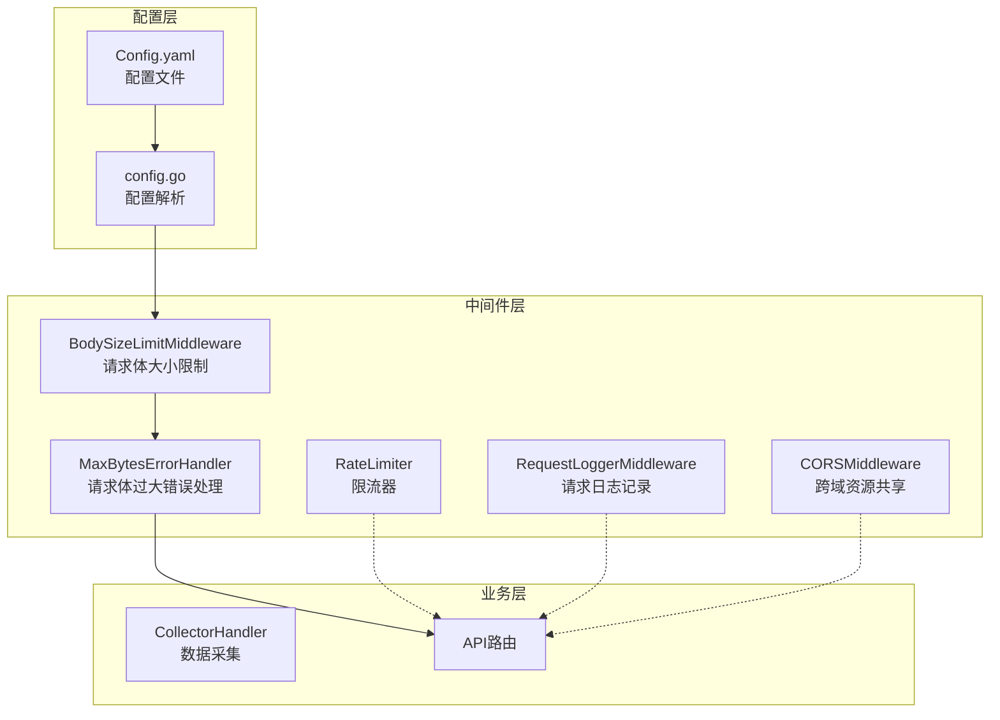
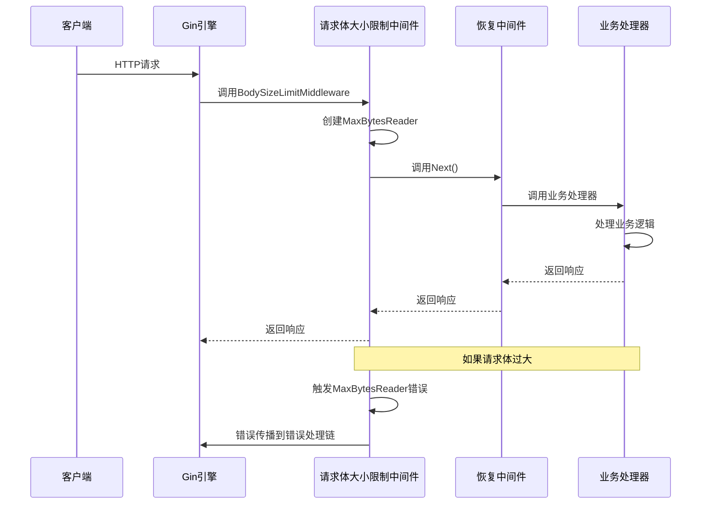
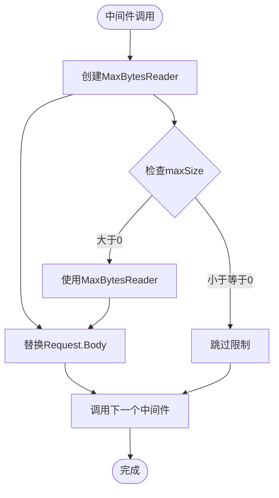
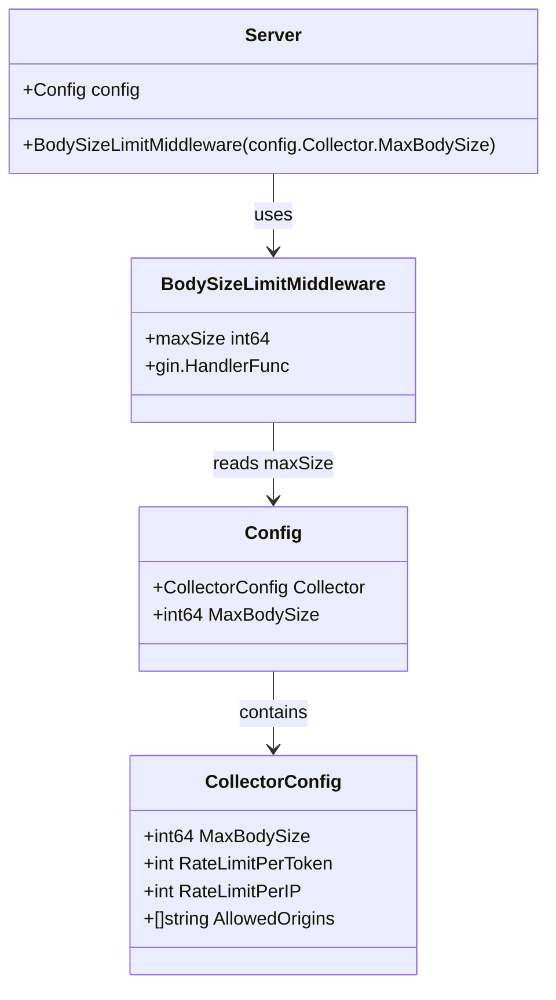
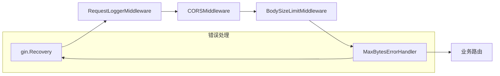
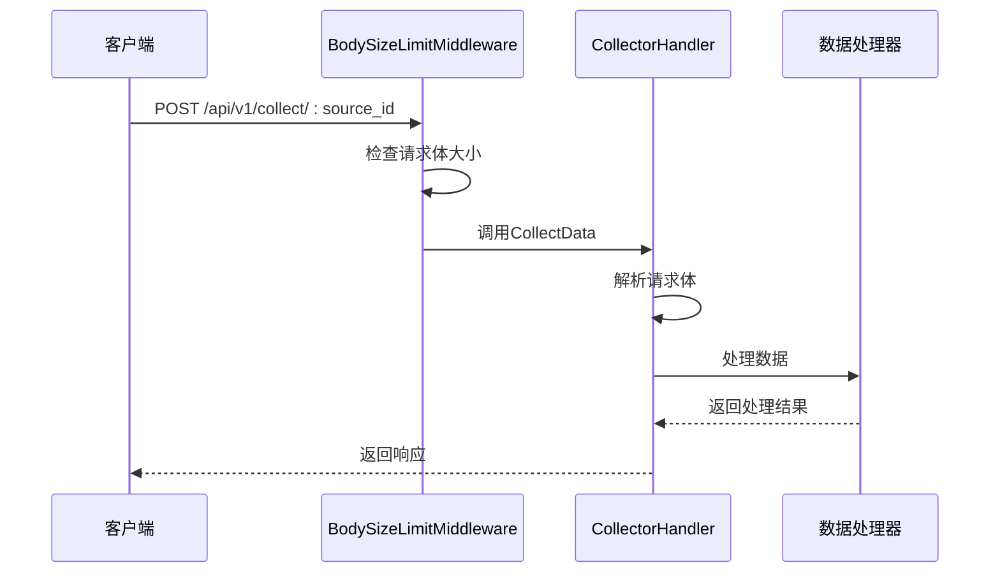

# 请求体大小限制中间件

<cite>
**本文档引用的文件**
- [bodysize.go](file://internal/middleware/bodysize.go)
- [server.go](file://internal/server/server.go)
- [router.go](file://internal/api/router.go)
- [config.yaml](file://configs/config.yaml)
- [config.go](file://internal/config/config.go)
- [response.go](file://internal/model/response.go)
- [errors.go](file://internal/model/errors.go)
- [collector.go](file://internal/api/collector.go)
- [logger.go](file://internal/middleware/logger.go)
- [cors.go](file://internal/middleware/cors.go)
- [ratelimit.go](file://internal/middleware/ratelimit.go)
</cite>

## 目录
1. [简介](#简介)
2. [项目结构](#项目结构)
3. [核心组件](#核心组件)
4. [架构概览](#架构概览)
5. [详细组件分析](#详细组件分析)
6. [依赖关系分析](#依赖关系分析)
7. [性能考虑](#性能考虑)
8. [故障排除指南](#故障排除指南)
9. [结论](#结论)

## 简介

请求体大小限制中间件是 DataCollector 系统中的重要安全组件，用于防止恶意或意外的大体积请求导致服务器资源耗尽。该中间件基于 Go 标准库的 `http.MaxBytesReader` 实现，能够在请求到达业务逻辑之前就限制请求体的大小，从而有效保护服务器免受内存溢出攻击。

该中间件采用全局配置的方式，通过配置文件中的 `max_body_size` 参数控制最大请求体大小，默认值为 1MB（1048576 字节）。中间件在 Gin 框架的中间件链中执行，确保所有进入系统的 HTTP 请求都受到相同的大小限制。

## 项目结构

请求体大小限制中间件位于项目的中间件层，与其它安全中间件共同构成完整的安全防护体系：



**图表来源**
- [bodysize.go:1-40](file://internal/middleware/bodysize.go#L1-L40)
- [server.go:54-87](file://internal/server/server.go#L54-L87)
- [config.go:64-70](file://internal/config/config.go#L64-L70)

**章节来源**
- [bodysize.go:1-40](file://internal/middleware/bodysize.go#L1-L40)
- [server.go:54-87](file://internal/server/server.go#L54-L87)
- [config.go:64-70](file://internal/config/config.go#L64-L70)

## 核心组件

### 主要功能模块

请求体大小限制中间件包含两个核心组件：

1. **BodySizeLimitMiddleware**: 主要的请求体大小限制逻辑
2. **MaxBytesErrorHandler**: 请求体过大时的错误处理机制

### 配置参数

中间件通过配置文件进行参数化配置：

| 配置项 | 类型 | 默认值 | 单位 | 描述 |
|--------|------|--------|------|------|
| max_body_size | int64 | 1048576 | 字节 | 最大请求体大小限制 |
| server.mode | string | "debug" | - | 服务器运行模式 |

**章节来源**
- [config.yaml:27-28](file://configs/config.yaml#L27-L28)
- [config.go:65-66](file://internal/config/config.go#L65-L66)
- [server.go:56-67](file://internal/server/server.go#L56-L67)

## 架构概览

请求体大小限制中间件在整个系统架构中的位置和作用：



**图表来源**
- [bodysize.go:12-18](file://internal/middleware/bodysize.go#L12-L18)
- [bodysize.go:22-39](file://internal/middleware/bodysize.go#L22-L39)
- [server.go:63-67](file://internal/server/server.go#L63-L67)

## 详细组件分析

### BodySizeLimitMiddleware 实现

该中间件的核心实现基于 Go 标准库的 `http.MaxBytesReader` 函数，它能够限制从请求体读取的数据量：



**图表来源**
- [bodysize.go:12-18](file://internal/middleware/bodysize.go#L12-L18)

#### 关键特性

1. **即时限制**: 在请求进入业务逻辑之前立即生效
2. **内存保护**: 防止恶意请求消耗过多内存
3. **透明处理**: 对正常请求无感知影响
4. **可配置性**: 支持通过配置文件动态调整限制值

**章节来源**
- [bodysize.go:10-18](file://internal/middleware/bodysize.go#L10-L18)

### MaxBytesErrorHandler 实现

错误处理器负责捕获并处理请求体过大错误：

```mermaid
flowchart TD
Start([中间件调用]) --> CallNext[调用Next()]
CallNext --> CheckErrors{检查c.Errors}
CheckErrors --> |有错误| IterateErrors[遍历错误列表]
CheckErrors --> |无错误| End([结束])
IterateErrors --> CheckErrType{检查错误类型}
CheckErrType --> |http: request body too large| SendError[发送错误响应]
CheckErrType --> |其他错误| Continue[继续处理]
SendError --> End
Continue --> CheckMore{还有更多错误?}
CheckMore --> |是| IterateErrors
CheckMore --> |否| End
```

**图表来源**
- [bodysize.go:22-39](file://internal/middleware/bodysize.go#L22-L39)

#### 错误处理机制

当请求体超过限制时，Go 标准库会抛出特定的错误消息："http: request body too large"。中间件通过精确匹配这个错误消息来识别并处理请求体过大情况。

**章节来源**
- [bodysize.go:20-39](file://internal/middleware/bodysize.go#L20-L39)

### 配置集成

中间件通过配置系统实现参数化：



**图表来源**
- [config.go:64-70](file://internal/config/config.go#L64-L70)
- [server.go:66](file://internal/server/server.go#L66)

**章节来源**
- [config.yaml:27-28](file://configs/config.yaml#L27-L28)
- [config.go:65-66](file://internal/config/config.go#L65-L66)
- [server.go:66](file://internal/server/server.go#L66)

## 依赖关系分析

### 中间件链依赖

请求体大小限制中间件在中间件链中的位置决定了其与其他中间件的交互关系：



**图表来源**
- [server.go:63-67](file://internal/server/server.go#L63-L67)

### 与业务逻辑的交互

中间件主要影响数据采集相关的业务逻辑：



**图表来源**
- [collector.go:31-138](file://internal/api/collector.go#L31-L138)

**章节来源**
- [server.go:63-67](file://internal/server/server.go#L63-L67)
- [collector.go:31-138](file://internal/api/collector.go#L31-L138)

## 性能考虑

### 内存使用分析

请求体大小限制中间件对内存使用的影响相对较小：

1. **零拷贝设计**: 使用 `MaxBytesReader` 实现，避免额外的内存分配
2. **流式处理**: 请求体按需读取，不会一次性加载到内存
3. **早期拒绝**: 在超出限制时立即停止读取，节省资源

### 性能优化建议

1. **合理设置限制值**: 根据业务需求调整 `max_body_size` 参数
2. **监控内存使用**: 结合日志中间件监控请求体大小分布
3. **分层防护**: 结合限流中间件形成多层防护体系

### 并发安全性

中间件在并发环境下的表现：
- 线程安全：`MaxBytesReader` 是线程安全的
- 无状态：中间件本身不维护状态信息
- 快速失败：超出限制时立即返回错误

## 故障排除指南

### 常见问题及解决方案

#### 1. 请求被错误地拒绝

**症状**: 正常的请求也被拒绝，返回 "请求体过大"

**可能原因**:
- `max_body_size` 设置过小
- 请求体编码方式导致大小计算错误

**解决方法**:
- 检查配置文件中的 `max_body_size` 值
- 验证客户端发送的数据格式

#### 2. 错误响应格式不符合预期

**症状**: 错误响应不是标准的 JSON 格式

**解决方法**:
- 确保 `MaxBytesErrorHandler` 在中间件链中的正确位置
- 检查 `model.SendError` 的实现

#### 3. 与其他中间件冲突

**症状**: 请求体大小限制与其他中间件产生冲突

**解决方法**:
- 确保 `BodySizeLimitMiddleware` 在 `gin.Recovery` 之后
- 检查中间件的执行顺序

**章节来源**
- [bodysize.go:22-39](file://internal/middleware/bodysize.go#L22-L39)
- [response.go:63-71](file://internal/model/response.go#L63-L71)

### 错误码说明

| 错误码 | HTTP状态码 | 描述 | 用途 |
|--------|------------|------|------|
| CodeValidationFailed | 400 | 数据验证失败 | 请求体过大错误 |
| CodeRateLimitExceeded | 429 | 请求频率超限 | 限流相关错误 |

**章节来源**
- [errors.go:10-11](file://internal/model/errors.go#L10-L11)

## 结论

请求体大小限制中间件是 DataCollector 系统安全防护体系的重要组成部分。通过合理的配置和部署，该中间件能够有效防止恶意请求和意外的大体积请求对服务器造成影响。

### 主要优势

1. **简单高效**: 基于标准库实现，代码简洁，性能优异
2. **易于配置**: 通过配置文件即可调整限制参数
3. **全面保护**: 在请求进入业务逻辑之前提供保护
4. **错误友好**: 提供清晰的错误响应格式

### 最佳实践建议

1. **合理设置阈值**: 根据业务特点设置合适的请求体大小限制
2. **监控告警**: 建立监控机制，及时发现异常的请求模式
3. **分层防护**: 结合限流、CORS 等其他安全中间件形成完整防护
4. **定期评估**: 根据业务发展定期评估和调整安全策略

该中间件为整个系统的稳定运行提供了重要的安全保障，是构建健壮 Web 应用不可或缺的一环。