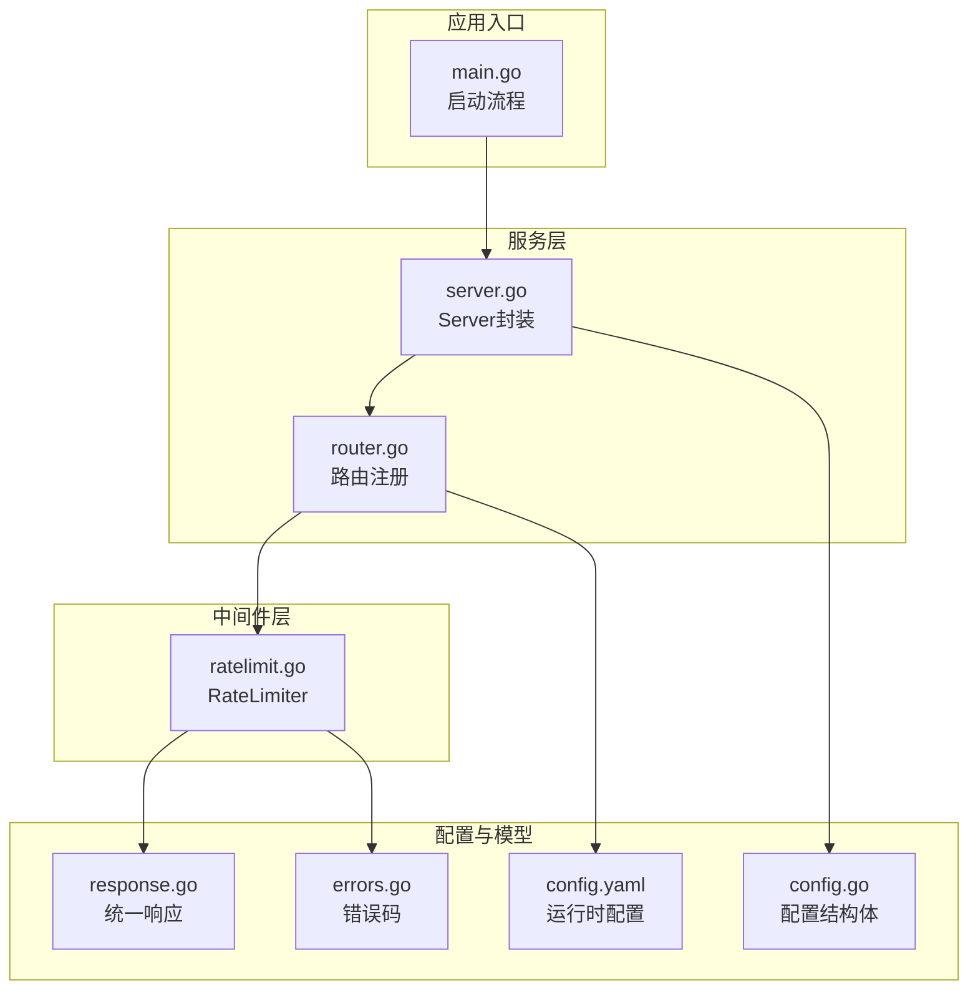
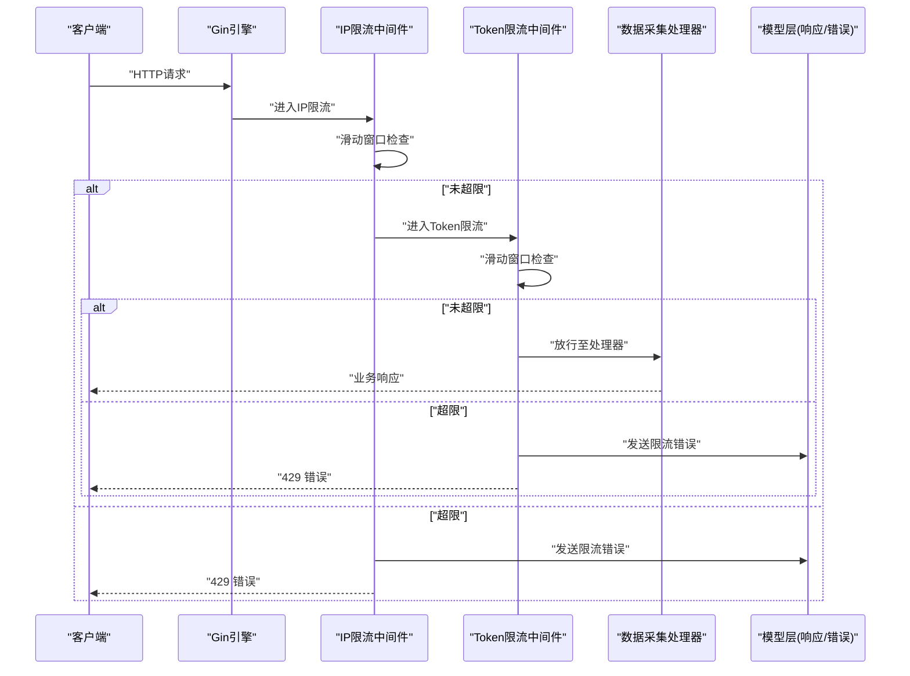
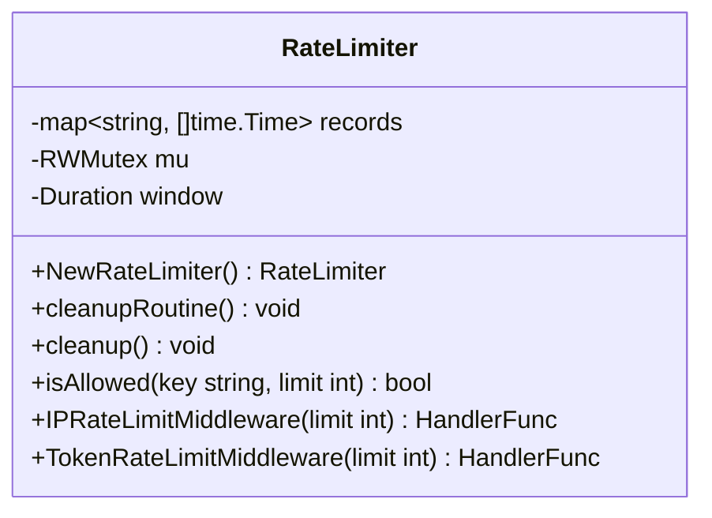
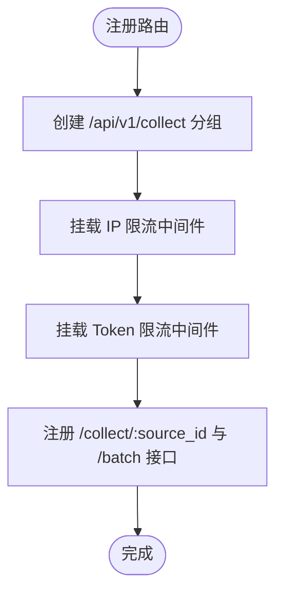
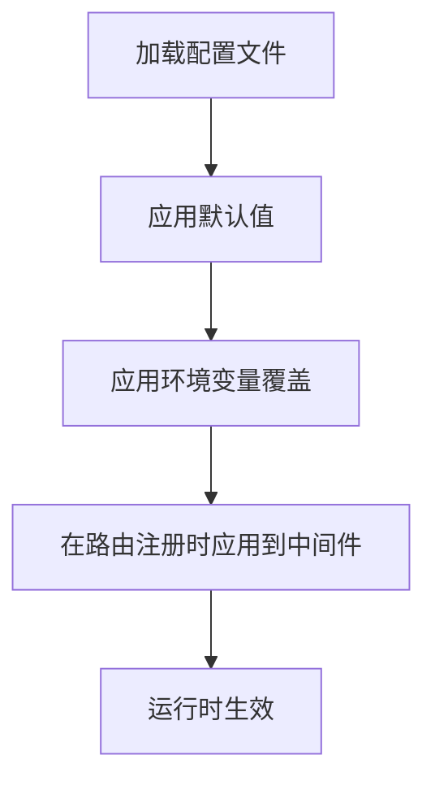
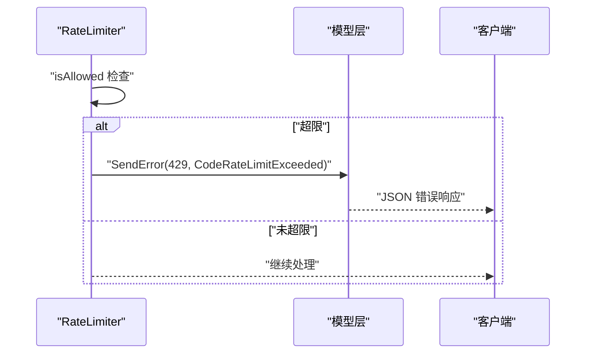
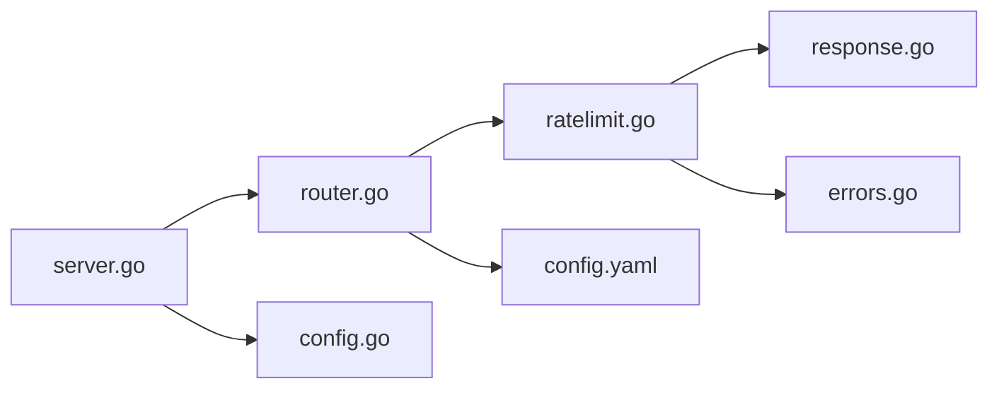

# 限流控制中间件

<cite>
**本文档引用的文件**
- [ratelimit.go](file://internal/middleware/ratelimit.go)
- [router.go](file://internal/api/router.go)
- [server.go](file://internal/server/server.go)
- [config.yaml](file://configs/config.yaml)
- [config.go](file://internal/config/config.go)
- [response.go](file://internal/model/response.go)
- [errors.go](file://internal/model/errors.go)
- [middleware.go](file://internal/auth/middleware.go)
- [main.go](file://cmd/server/main.go)
</cite>

## 目录
1. [简介](#简介)
2. [项目结构](#项目结构)
3. [核心组件](#核心组件)
4. [架构总览](#架构总览)
5. [详细组件分析](#详细组件分析)
6. [依赖关系分析](#依赖关系分析)
7. [性能考量](#性能考量)
8. [故障排查指南](#故障排查指南)
9. [结论](#结论)
10. [附录](#附录)

## 简介
本文件针对限流控制中间件进行系统化技术文档编写，重点涵盖：
- 限流算法实现原理与配置策略
- IP限流、Token限流与全局限流的实现机制
- 限流规则配置方法与动态调整策略
- Redis缓存集成与分布式限流的实现方案
- 限流触发时的错误处理与响应策略
- 限流中间件与认证系统的协作关系
- 性能监控与调优最佳实践

## 项目结构
限流中间件位于中间件层，通过 Gin 中间件链路接入 API 路由组，结合配置中心与统一响应模型实现限流控制与错误处理。

图表来源
- [main.go:25-87](file://cmd/server/main.go#L25-L87)
- [server.go:34-87](file://internal/server/server.go#L34-L87)
- [router.go:14-55](file://internal/api/router.go#L14-L55)
- [ratelimit.go:12-136](file://internal/middleware/ratelimit.go#L12-L136)
- [config.yaml:1-41](file://configs/config.yaml#L1-L41)
- [config.go:12-80](file://internal/config/config.go#L12-L80)
- [response.go:9-72](file://internal/model/response.go#L9-L72)
- [errors.go:3-84](file://internal/model/errors.go#L3-L84)

章节来源
- [main.go:25-87](file://cmd/server/main.go#L25-L87)
- [server.go:34-87](file://internal/server/server.go#L34-L87)
- [router.go:14-55](file://internal/api/router.go#L14-L55)
- [ratelimit.go:12-136](file://internal/middleware/ratelimit.go#L12-L136)
- [config.yaml:1-41](file://configs/config.yaml#L1-L41)
- [config.go:12-80](file://internal/config/config.go#L12-L80)
- [response.go:9-72](file://internal/model/response.go#L9-L72)
- [errors.go:3-84](file://internal/model/errors.go#L3-L84)

## 核心组件
- RateLimiter：基于滑动窗口的内存级限流器，维护每个键（IP或Token）的时间戳列表，并周期性清理过期记录。
- Gin中间件：提供按IP限流与按Data Token限流的中间件函数，分别作用于数据采集路由组。
- 配置系统：从配置文件读取限流阈值与窗口大小，支持环境变量覆盖。
- 统一响应与错误码：限流触发时返回标准化错误响应，便于客户端识别与处理。

章节来源
- [ratelimit.go:12-136](file://internal/middleware/ratelimit.go#L12-L136)
- [router.go:47-55](file://internal/api/router.go#L47-L55)
- [config.yaml:27-30](file://configs/config.yaml#L27-L30)
- [config.go:64-70](file://internal/config/config.go#L64-L70)
- [response.go:9-72](file://internal/model/response.go#L9-L72)
- [errors.go:3-84](file://internal/model/errors.go#L3-L84)

## 架构总览
限流中间件在 Gin 引擎中以中间件形式串联，对特定路由组生效。数据采集路由组同时应用IP限流与Token限流，确保多维度防护。

图表来源
- [router.go:47-55](file://internal/api/router.go#L47-L55)
- [ratelimit.go:100-136](file://internal/middleware/ratelimit.go#L100-L136)
- [response.go:63-66](file://internal/model/response.go#L63-L66)
- [errors.go:8-11](file://internal/model/errors.go#L8-L11)

## 详细组件分析

### RateLimiter 类与滑动窗口算法
- 数据结构：以键（IP或Token）映射到时间戳切片，配合互斥锁保证并发安全。
- 窗口与清理：默认窗口为1分钟；每分钟定时清理过期记录，避免内存无限增长。
- 核心逻辑：每次请求先过滤过期时间戳，若当前窗口内数量已达上限则拒绝；否则加入当前时间戳并放行。
- 中间件封装：提供按IP限流与按Token限流两个中间件函数，分别从客户端IP与请求头提取键值。

图表来源
- [ratelimit.go:12-136](file://internal/middleware/ratelimit.go#L12-L136)

章节来源
- [ratelimit.go:12-136](file://internal/middleware/ratelimit.go#L12-L136)

### Gin中间件链路与路由绑定
- 在路由注册阶段，将限流中间件挂载到数据采集路由组，确保该组内的所有接口均受控。
- 顺序执行：先执行IP限流，再执行Token限流，形成双重保护。

图表来源
- [router.go:47-55](file://internal/api/router.go#L47-L55)

章节来源
- [router.go:47-55](file://internal/api/router.go#L47-L55)

### 配置与动态调整策略
- 配置项：限流阈值（每分钟）与最大请求体大小等在配置文件中定义。
- 默认值：未显式设置时采用默认配置。
- 动态调整：可通过环境变量覆盖配置项，实现无需重启的服务热调整。

图表来源
- [config.yaml:27-30](file://configs/config.yaml#L27-L30)
- [config.go:100-146](file://internal/config/config.go#L100-L146)
- [config.go:148-195](file://internal/config/config.go#L148-L195)
- [router.go:47-55](file://internal/api/router.go#L47-L55)

章节来源
- [config.yaml:27-30](file://configs/config.yaml#L27-L30)
- [config.go:100-146](file://internal/config/config.go#L100-L146)
- [config.go:148-195](file://internal/config/config.go#L148-L195)
- [router.go:47-55](file://internal/api/router.go#L47-L55)

### 错误处理与响应策略
- 错误码：限流触发时使用统一错误码，便于客户端识别。
- 响应格式：统一响应结构，包含状态码、消息与可选数据/错误详情。
- 触发条件：IP限流与Token限流分别在不同场景下触发，均返回429状态码。

图表来源
- [ratelimit.go:100-136](file://internal/middleware/ratelimit.go#L100-L136)
- [response.go:63-66](file://internal/model/response.go#L63-L66)
- [errors.go:8-11](file://internal/model/errors.go#L8-L11)

章节来源
- [ratelimit.go:100-136](file://internal/middleware/ratelimit.go#L100-L136)
- [response.go:63-66](file://internal/model/response.go#L63-L66)
- [errors.go:8-11](file://internal/model/errors.go#L8-L11)

### 与认证系统的协作关系
- 认证中间件：JWT认证中间件负责从请求头或查询参数解析并校验令牌，成功后将用户信息注入上下文。
- 限流与认证的关系：限流中间件不依赖认证结果，但通常在需要鉴权的路由组上叠加使用；数据采集接口既需要认证（由其他中间件保障），又需要限流保护。
- 协作要点：认证中间件在限流之后执行，确保只有合法用户才会被纳入限流计数。

章节来源
- [middleware.go:11-63](file://internal/auth/middleware.go#L11-L63)
- [router.go:47-55](file://internal/api/router.go#L47-L55)

### Redis缓存集成与分布式限流（扩展建议）
当前实现为单机内存滑动窗口，适用于单实例部署。若需分布式限流，建议采用以下方案：
- 使用Redis存储每个键的时间戳集合，利用有序集合（zset）存储时间戳，支持原子性的窗口清理与计数判断。
- 限流判定流程：
  - 计算窗口起始时间，删除早于窗口的条目；
  - 检查剩余条目数量是否超过阈值；
  - 若未超限，插入当前时间戳并返回允许。
- 优点：跨实例共享状态，实现真正的分布式限流；缺点：引入外部依赖与网络开销。
- 注意：该部分为架构扩展建议，非现有实现内容。

## 依赖关系分析
- 组件耦合：
  - 路由注册依赖配置与限流器实例；
  - 限流器依赖统一响应与错误码；
  - 服务层负责创建限流器并注入路由。
- 外部依赖：
  - Gin框架中间件机制；
  - 配置文件与环境变量；
  - 日志系统（slog）。

图表来源
- [router.go:14-55](file://internal/api/router.go#L14-L55)
- [server.go:34-52](file://internal/server/server.go#L34-L52)
- [ratelimit.go:12-136](file://internal/middleware/ratelimit.go#L12-L136)
- [config.go:12-80](file://internal/config/config.go#L12-L80)
- [config.yaml:1-41](file://configs/config.yaml#L1-L41)
- [response.go:9-72](file://internal/model/response.go#L9-L72)
- [errors.go:3-84](file://internal/model/errors.go#L3-L84)

章节来源
- [router.go:14-55](file://internal/api/router.go#L14-L55)
- [server.go:34-52](file://internal/server/server.go#L34-L52)
- [ratelimit.go:12-136](file://internal/middleware/ratelimit.go#L12-L136)
- [config.go:12-80](file://internal/config/config.go#L12-L80)
- [config.yaml:1-41](file://configs/config.yaml#L1-L41)
- [response.go:9-72](file://internal/model/response.go#L9-L72)
- [errors.go:3-84](file://internal/model/errors.go#L3-L84)

## 性能考量
- 时间复杂度：每次请求的检查与更新操作涉及过滤与追加，整体为线性时间，取决于窗口内有效请求数量。
- 内存占用：每个键维护一个时间戳切片，长期运行可能累积较多条目；通过定期清理降低内存压力。
- 并发安全：使用读写锁保护共享状态，读多写少场景下读锁提升并发性能。
- 窗口粒度：当前窗口为1分钟，可根据业务流量特征调整窗口长度与阈值，平衡准确性与资源消耗。
- 建议：
  - 对高并发场景考虑引入Redis实现分布式限流；
  - 结合指标监控（如QPS、命中率、延迟）持续优化阈值；
  - 在限流触发时记录关键上下文（如IP、Token、来源接口）以便审计与分析。

## 故障排查指南
- 常见问题与定位：
  - 限流频繁触发：检查配置阈值是否过低，或是否存在异常批量请求；确认清理任务是否正常运行。
  - Token限流报错“缺少请求头”：确认客户端是否正确传递Data Token请求头。
  - 429错误响应：查看统一响应结构中的错误码与消息，结合日志定位具体触发点。
- 排查步骤：
  - 查看服务日志（slog）确认限流触发位置；
  - 检查配置文件与环境变量覆盖情况；
  - 验证路由组挂载顺序与中间件链路；
  - 如需分布式限流，检查Redis连接与键空间命名规范。

章节来源
- [ratelimit.go:100-136](file://internal/middleware/ratelimit.go#L100-L136)
- [response.go:63-66](file://internal/model/response.go#L63-L66)
- [errors.go:8-11](file://internal/model/errors.go#L8-L11)
- [main.go:131-169](file://cmd/server/main.go#L131-L169)

## 结论
本限流中间件采用滑动窗口算法，结合Gin中间件链路实现了对数据采集接口的双维度限流保护。通过配置中心与环境变量实现灵活的动态调整，并以统一响应与错误码提供一致的错误处理体验。对于生产环境的高可用与高并发需求，建议引入Redis实现分布式限流，并配套完善的监控与告警体系，持续优化阈值与窗口参数，确保系统稳定与用户体验。

## 附录
- 配置项参考
  - 限流阈值（每分钟）：用于IP限流与Token限流
  - 最大请求体大小：用于请求体大小限制中间件
  - 允许的来源域名：用于CORS中间件
- 错误码参考
  - CodeRateLimitExceeded：请求频率超限

章节来源
- [config.yaml:27-32](file://configs/config.yaml#L27-L32)
- [errors.go:8-11](file://internal/model/errors.go#L8-L11)