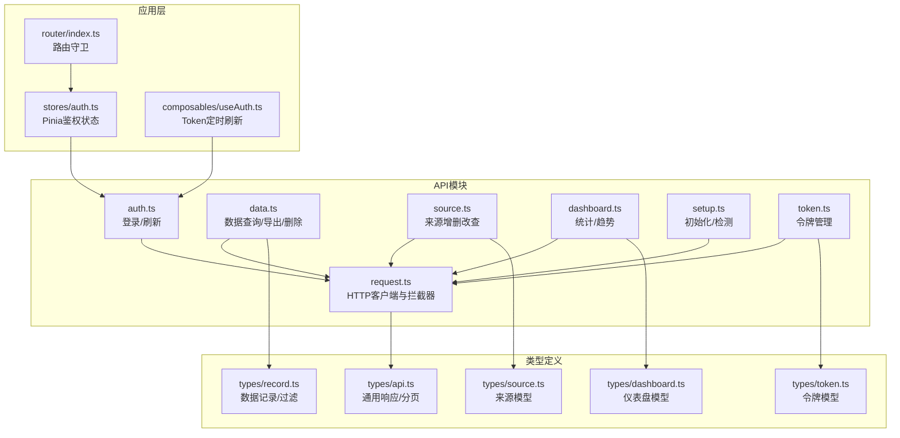
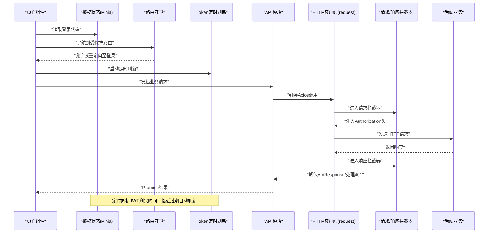
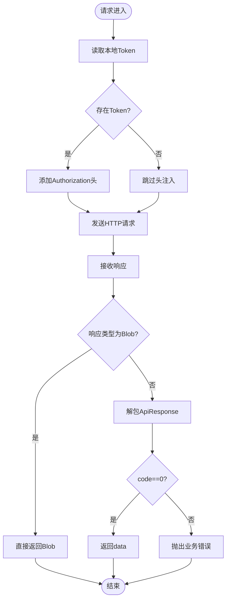
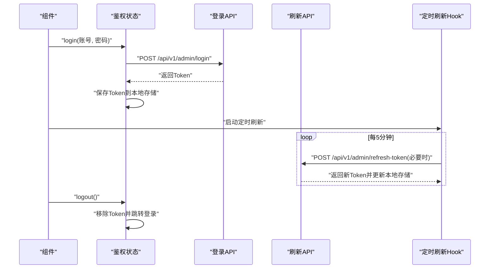
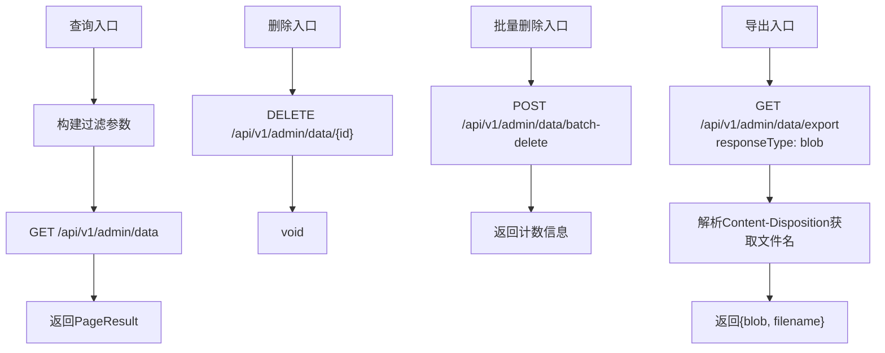
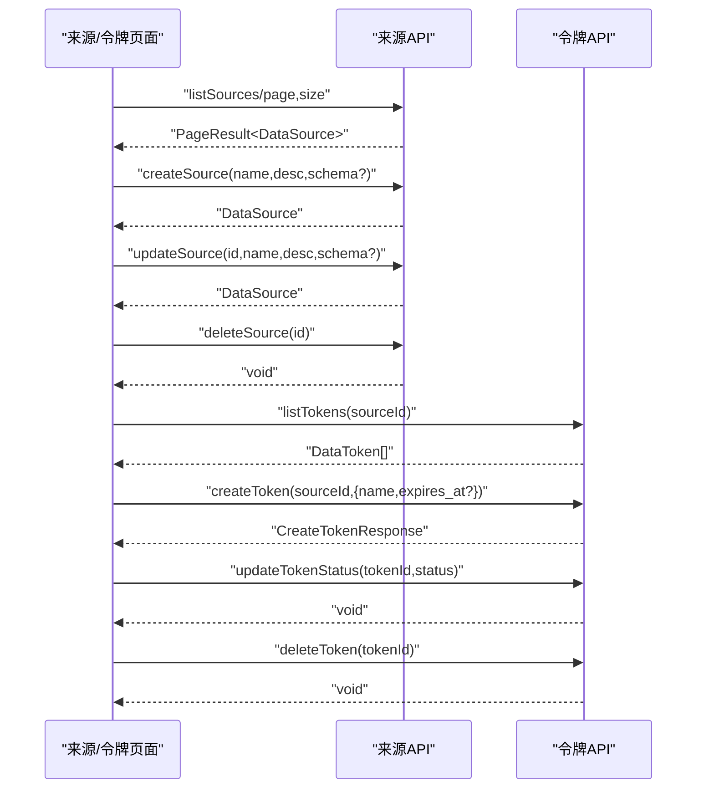
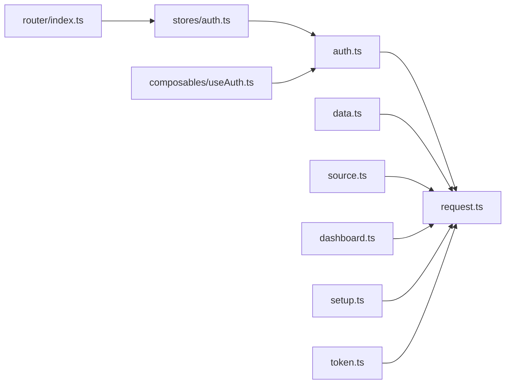

# API客户端

<cite>
**本文引用的文件**
- [web/src/api/request.ts](file://web/src/api/request.ts)
- [web/src/api/auth.ts](file://web/src/api/auth.ts)
- [web/src/api/data.ts](file://web/src/api/data.ts)
- [web/src/api/source.ts](file://web/src/api/source.ts)
- [web/src/api/dashboard.ts](file://web/src/api/dashboard.ts)
- [web/src/api/setup.ts](file://web/src/api/setup.ts)
- [web/src/api/token.ts](file://web/src/api/token.ts)
- [web/src/types/api.ts](file://web/src/types/api.ts)
- [web/src/types/record.ts](file://web/src/types/record.ts)
- [web/src/types/source.ts](file://web/src/types/source.ts)
- [web/src/types/dashboard.ts](file://web/src/types/dashboard.ts)
- [web/src/types/token.ts](file://web/src/types/token.ts)
- [web/src/composables/useAuth.ts](file://web/src/composables/useAuth.ts)
- [web/src/stores/auth.ts](file://web/src/stores/auth.ts)
- [web/src/router/index.ts](file://web/src/router/index.ts)
</cite>

## 目录
1. [简介](#简介)
2. [项目结构](#项目结构)
3. [核心组件](#核心组件)
4. [架构总览](#架构总览)
5. [详细组件分析](#详细组件分析)
6. [依赖关系分析](#依赖关系分析)
7. [性能考量](#性能考量)
8. [故障排查指南](#故障排查指南)
9. [结论](#结论)
10. [附录](#附录)

## 简介
本文件面向前端API客户端，系统性阐述DataCollector的RESTful API封装与HTTP客户端实现，包括：
- 统一请求与响应处理、错误与异常状态管理
- 认证Token的自动注入与刷新机制
- 请求拦截器与路由守卫的协同
- TypeScript类型定义与接口设计
- 最佳实践、性能优化、缓存与预取策略
- 测试策略与模拟数据配置建议

## 项目结构
前端API客户端位于 web/src/api 目录，采用按功能模块划分的组织方式，每个模块对应一个领域API（如认证、数据、来源、仪表盘、初始化等）。公共HTTP客户端在 request.ts 中集中配置，所有具体API通过该客户端发起请求。

图表来源
- [web/src/api/request.ts:1-47](file://web/src/api/request.ts#L1-L47)
- [web/src/api/auth.ts:1-20](file://web/src/api/auth.ts#L1-L20)
- [web/src/api/data.ts:1-35](file://web/src/api/data.ts#L1-L35)
- [web/src/api/source.ts:1-20](file://web/src/api/source.ts#L1-L20)
- [web/src/api/dashboard.ts:1-11](file://web/src/api/dashboard.ts#L1-L11)
- [web/src/api/setup.ts:1-51](file://web/src/api/setup.ts#L1-L51)
- [web/src/api/token.ts:1-19](file://web/src/api/token.ts#L1-L19)
- [web/src/types/api.ts:1-12](file://web/src/types/api.ts#L1-L12)
- [web/src/types/record.ts:1-18](file://web/src/types/record.ts#L1-L18)
- [web/src/types/source.ts:1-37](file://web/src/types/source.ts#L1-L37)
- [web/src/types/dashboard.ts:1-22](file://web/src/types/dashboard.ts#L1-L22)
- [web/src/types/token.ts:1-25](file://web/src/types/token.ts#L1-L25)
- [web/src/stores/auth.ts:1-26](file://web/src/stores/auth.ts#L1-L26)
- [web/src/composables/useAuth.ts:1-37](file://web/src/composables/useAuth.ts#L1-L37)
- [web/src/router/index.ts:1-78](file://web/src/router/index.ts#L1-L78)

章节来源
- [web/src/api/request.ts:1-47](file://web/src/api/request.ts#L1-L47)
- [web/src/router/index.ts:1-78](file://web/src/router/index.ts#L1-L78)

## 核心组件
- HTTP客户端与拦截器
  - 基础配置：基础URL、超时、默认Content-Type
  - 请求拦截器：从本地存储读取JWT并注入到Authorization头
  - 响应拦截器：统一解包ApiResponse；非blob导出场景仅返回data；业务错误抛出；401时清理本地Token并跳转登录
- 领域API模块
  - 认证：登录、刷新Token
  - 数据：分页查询、批量删除、导出（Blob）
  - 来源：列表、创建、更新、删除
  - 仪表盘：总览统计、趋势
  - 初始化：状态检查、数据库连通性测试、初始化、二次初始化
  - 令牌：列出、创建、更新状态、删除
- 类型系统
  - ApiResponse：code/message/data/errors
  - PageResult：total/list
  - 各领域实体与请求参数类型
- 应用层集成
  - Pinia鉴权状态：登录成功写入Token，登出清理
  - 路由守卫：未登录访问受保护路由重定向至登录
  - Composable：定时解析JWT剩余有效期，临近过期自动刷新

章节来源
- [web/src/api/request.ts:1-47](file://web/src/api/request.ts#L1-L47)
- [web/src/api/auth.ts:1-20](file://web/src/api/auth.ts#L1-L20)
- [web/src/api/data.ts:1-35](file://web/src/api/data.ts#L1-L35)
- [web/src/api/source.ts:1-20](file://web/src/api/source.ts#L1-L20)
- [web/src/api/dashboard.ts:1-11](file://web/src/api/dashboard.ts#L1-L11)
- [web/src/api/setup.ts:1-51](file://web/src/api/setup.ts#L1-L51)
- [web/src/api/token.ts:1-19](file://web/src/api/token.ts#L1-L19)
- [web/src/types/api.ts:1-12](file://web/src/types/api.ts#L1-L12)
- [web/src/types/record.ts:1-18](file://web/src/types/record.ts#L1-L18)
- [web/src/types/source.ts:1-37](file://web/src/types/source.ts#L1-L37)
- [web/src/types/dashboard.ts:1-22](file://web/src/types/dashboard.ts#L1-L22)
- [web/src/types/token.ts:1-25](file://web/src/types/token.ts#L1-L25)
- [web/src/stores/auth.ts:1-26](file://web/src/stores/auth.ts#L1-L26)
- [web/src/composables/useAuth.ts:1-37](file://web/src/composables/useAuth.ts#L1-L37)
- [web/src/router/index.ts:1-78](file://web/src/router/index.ts#L1-L78)

## 架构总览
下图展示从页面到后端的整体调用链路，以及拦截器与鉴权状态的协作。

图表来源
- [web/src/api/request.ts:13-44](file://web/src/api/request.ts#L13-L44)
- [web/src/stores/auth.ts:12-22](file://web/src/stores/auth.ts#L12-L22)
- [web/src/composables/useAuth.ts:7-24](file://web/src/composables/useAuth.ts#L7-L24)
- [web/src/router/index.ts:65-75](file://web/src/router/index.ts#L65-L75)

## 详细组件分析

### HTTP客户端与拦截器
- 统一配置
  - 基础URL来自环境变量，便于多环境切换
  - 默认JSON内容类型与超时设置
- 请求拦截器
  - 自动从本地存储读取JWT并在每次请求前附加到Authorization头
- 响应拦截器
  - 导出类接口（Blob）直接透传
  - 其他接口统一解包ApiResponse，仅返回data
  - 当code不为0时抛出业务错误
  - 对401错误清理本地Token并跳转登录页

图表来源
- [web/src/api/request.ts:13-44](file://web/src/api/request.ts#L13-L44)

章节来源
- [web/src/api/request.ts:1-47](file://web/src/api/request.ts#L1-L47)

### 认证模块
- 登录：提交用户名/密码，成功后返回Token并持久化
- 刷新：基于当前Token计算剩余时间，临近过期自动刷新
- 登出：清除Token并跳转登录

图表来源
- [web/src/api/auth.ts:13-19](file://web/src/api/auth.ts#L13-L19)
- [web/src/stores/auth.ts:12-22](file://web/src/stores/auth.ts#L12-L22)
- [web/src/composables/useAuth.ts:7-24](file://web/src/composables/useAuth.ts#L7-L24)

章节来源
- [web/src/api/auth.ts:1-20](file://web/src/api/auth.ts#L1-L20)
- [web/src/stores/auth.ts:1-26](file://web/src/stores/auth.ts#L1-L26)
- [web/src/composables/useAuth.ts:1-37](file://web/src/composables/useAuth.ts#L1-L37)

### 数据模块
- 查询：支持按来源、日期范围、分页参数筛选
- 删除：单条删除
- 批量删除：传入ID数组
- 导出：根据格式返回Blob，并解析响应头中的文件名

图表来源
- [web/src/api/data.ts:5-34](file://web/src/api/data.ts#L5-L34)
- [web/src/types/record.ts:11-17](file://web/src/types/record.ts#L11-L17)
- [web/src/types/api.ts:8-11](file://web/src/types/api.ts#L8-L11)

章节来源
- [web/src/api/data.ts:1-35](file://web/src/api/data.ts#L1-L35)
- [web/src/types/record.ts:1-18](file://web/src/types/record.ts#L1-L18)
- [web/src/types/api.ts:1-12](file://web/src/types/api.ts#L1-L12)

### 来源与令牌模块
- 来源：分页列表、创建、更新、删除
- 令牌：按来源列出、创建、更新状态、删除

图表来源
- [web/src/api/source.ts:5-19](file://web/src/api/source.ts#L5-L19)
- [web/src/api/token.ts:4-18](file://web/src/api/token.ts#L4-L18)
- [web/src/types/source.ts:14-36](file://web/src/types/source.ts#L14-L36)
- [web/src/types/token.ts:1-25](file://web/src/types/token.ts#L1-L25)

章节来源
- [web/src/api/source.ts:1-20](file://web/src/api/source.ts#L1-L20)
- [web/src/api/token.ts:1-19](file://web/src/api/token.ts#L1-L19)
- [web/src/types/source.ts:1-37](file://web/src/types/source.ts#L1-L37)
- [web/src/types/token.ts:1-25](file://web/src/types/token.ts#L1-L25)

### 仪表盘与初始化模块
- 仪表盘：总览统计、趋势折线
- 初始化：检查状态、测试数据库连通性、执行初始化、二次初始化

章节来源
- [web/src/api/dashboard.ts:1-11](file://web/src/api/dashboard.ts#L1-L11)
- [web/src/api/setup.ts:1-51](file://web/src/api/setup.ts#L1-L51)
- [web/src/types/dashboard.ts:1-22](file://web/src/types/dashboard.ts#L1-L22)

### 类型系统与接口设计
- 通用响应与分页
  - ApiResponse：code/message/data/errors
  - PageResult：total/list
- 数据记录与过滤
  - DataRecord：字段覆盖来源、令牌、IP、UA、时间戳
  - RecordFilter：来源、日期范围、分页
- 来源模型
  - DataSource：标识、描述、模式配置、状态、时间
  - Create/Update：名称、描述、可选模式配置
- 令牌模型
  - DataToken：名称、状态、过期/最近使用时间
  - 创建请求/响应：含生成的明文Token（一次性可见）
- 仪表盘模型
  - DashboardStats：当日/周/月计数、来源总数、最近记录
  - TrendPoint：日期-数量
  - TrendParams：起止日期与可选来源/令牌过滤

章节来源
- [web/src/types/api.ts:1-12](file://web/src/types/api.ts#L1-L12)
- [web/src/types/record.ts:1-18](file://web/src/types/record.ts#L1-L18)
- [web/src/types/source.ts:1-37](file://web/src/types/source.ts#L1-L37)
- [web/src/types/token.ts:1-25](file://web/src/types/token.ts#L1-L25)
- [web/src/types/dashboard.ts:1-22](file://web/src/types/dashboard.ts#L1-L22)

## 依赖关系分析
- 模块耦合
  - 所有API模块依赖公共HTTP客户端，保持一致的拦截器行为
  - 鉴权状态与路由守卫共同保证受保护路由的安全访问
  - 定时刷新Composable与鉴权状态配合，确保Token生命周期管理
- 外部依赖
  - Axios作为HTTP客户端
  - Vue Router用于路由守卫
  - Pinia用于状态管理
- 可能的循环依赖
  - 当前结构清晰，API模块仅依赖HTTP客户端，无循环依赖迹象

图表来源
- [web/src/api/request.ts:1-47](file://web/src/api/request.ts#L1-L47)
- [web/src/api/auth.ts:1-20](file://web/src/api/auth.ts#L1-L20)
- [web/src/api/data.ts:1-35](file://web/src/api/data.ts#L1-L35)
- [web/src/api/source.ts:1-20](file://web/src/api/source.ts#L1-L20)
- [web/src/api/dashboard.ts:1-11](file://web/src/api/dashboard.ts#L1-L11)
- [web/src/api/setup.ts:1-51](file://web/src/api/setup.ts#L1-L51)
- [web/src/api/token.ts:1-19](file://web/src/api/token.ts#L1-L19)
- [web/src/stores/auth.ts:1-26](file://web/src/stores/auth.ts#L1-L26)
- [web/src/composables/useAuth.ts:1-37](file://web/src/composables/useAuth.ts#L1-L37)
- [web/src/router/index.ts:1-78](file://web/src/router/index.ts#L1-L78)

章节来源
- [web/src/api/request.ts:1-47](file://web/src/api/request.ts#L1-L47)
- [web/src/stores/auth.ts:1-26](file://web/src/stores/auth.ts#L1-L26)
- [web/src/composables/useAuth.ts:1-37](file://web/src/composables/useAuth.ts#L1-L37)
- [web/src/router/index.ts:1-78](file://web/src/router/index.ts#L1-L78)

## 性能考量
- 连接复用与超时
  - 使用Axios实例避免重复配置；合理设置超时以平衡体验与资源占用
- Token生命周期
  - 定时刷新减少频繁鉴权失败带来的重试开销
- 导出与大体积响应
  - Blob响应绕过统一解包，避免不必要的序列化与内存拷贝
- 分页与过滤
  - 后端分页与精确过滤可显著降低前端渲染压力
- 缓存与预取
  - 建议：对只读列表与趋势数据实施短期缓存；对高频查询进行预取与去抖
  - 注意：缓存需结合ETag/Last-Modified或版本字段，避免脏读
- 并发控制
  - 对高并发请求引入节流/队列，防止瞬时风暴
- 错误快速失败
  - 业务错误尽早抛出，避免无效重试与UI阻塞

## 故障排查指南
- 401未授权
  - 现象：出现未授权提示并跳转登录
  - 排查：确认本地Token是否过期或被清理；检查拦截器是否正确注入Authorization头
- 业务错误
  - 现象：Promise拒绝并携带错误消息
  - 排查：查看响应中的code/message/errors字段；定位具体参数与后端校验规则
- 网络错误
  - 现象：网络异常或超时
  - 排查：检查基础URL、代理、防火墙；确认服务端可达性
- 导出失败
  - 现象：下载为空或文件名异常
  - 排查：确认后端是否正确设置Content-Disposition；检查Blob响应与文件名解析逻辑
- 路由跳转异常
  - 现象：受保护路由无法访问或反复重定向
  - 排查：检查路由守卫逻辑与本地Token状态一致性

章节来源
- [web/src/api/request.ts:36-44](file://web/src/api/request.ts#L36-L44)
- [web/src/router/index.ts:65-75](file://web/src/router/index.ts#L65-L75)

## 结论
本API客户端通过统一的HTTP客户端与拦截器，实现了认证Token的自动注入与刷新、响应的标准化处理、以及与路由与状态管理的紧密协作。类型系统为各领域API提供了强约束，有助于提升开发效率与运行时稳定性。建议在生产环境中进一步完善缓存与预取策略、并发控制与错误恢复机制，以获得更优的用户体验与系统性能。

## 附录
- 最佳实践
  - 将基础URL与敏感配置置于环境变量中
  - 对所有请求明确超时与重试策略
  - 在导出与大文件场景优先使用Blob与分片下载
  - 对高频只读数据实施短期缓存与失效策略
- 测试策略
  - 单元测试：针对API函数与拦截器行为编写Mock测试
  - 集成测试：使用Mock服务端验证鉴权、错误与导出流程
  - 端到端测试：覆盖路由守卫、登录/登出、Token刷新全流程
- 模拟数据配置
  - 使用Mock拦截器模拟不同code/message与401场景
  - 提供典型分页与导出数据样本，便于UI联调