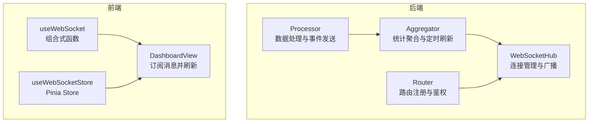
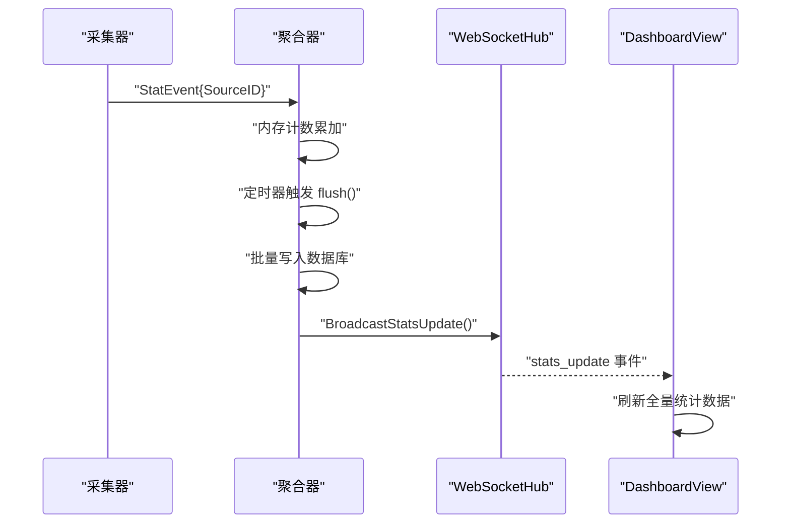
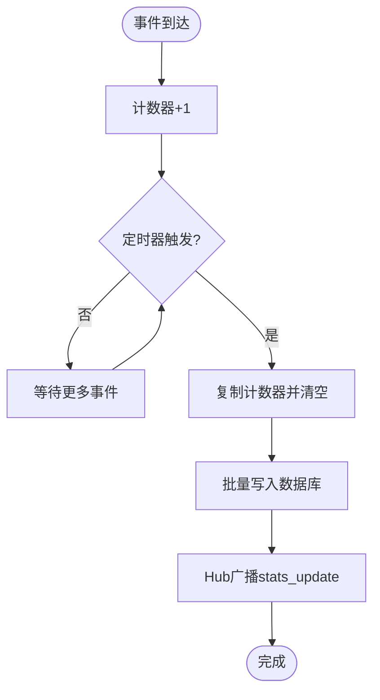
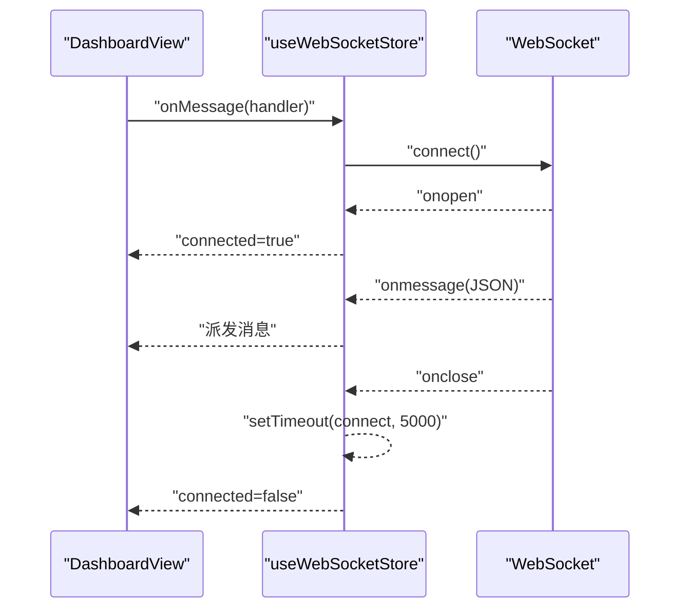
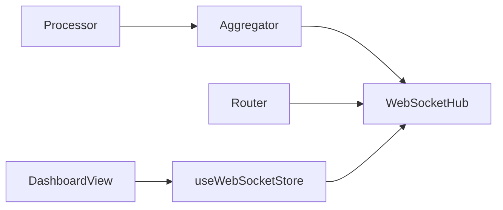

# WebSocket集成

<cite>
**本文档引用的文件**
- [websocket.go](file://internal/monitor/websocket.go)
- [aggregator.go](file://internal/monitor/aggregator.go)
- [processor.go](file://internal/collector/processor.go)
- [router.go](file://internal/api/router.go)
- [useWebSocket.ts](file://web/src/composables/useWebSocket.ts)
- [websocket.ts](file://web/src/stores/websocket.ts)
- [DashboardView.vue](file://web/src/views/DashboardView.vue)
- [statistics.go](file://internal/model/statistics.go)
- [response.go](file://internal/model/response.go)
- [errors.go](file://internal/model/errors.go)
</cite>

## 目录
1. [简介](#简介)
2. [项目结构](#项目结构)
3. [核心组件](#核心组件)
4. [架构总览](#架构总览)
5. [详细组件分析](#详细组件分析)
6. [依赖关系分析](#依赖关系分析)
7. [性能考虑](#性能考虑)
8. [故障排查指南](#故障排查指南)
9. [结论](#结论)
10. [附录](#附录)

## 简介
本文件面向DataCollector项目的WebSocket集成，系统性阐述WebSocket客户端实现、服务端连接管理、实时数据同步机制、消息处理流程、连接状态与重连策略、错误处理、消息格式与事件类型、前端组件集成模式、性能优化与资源管理，以及与后端监控系统的数据推送机制与调试监控方法。

## 项目结构
WebSocket相关代码分布在后端监控模块与前端组合式函数/状态管理中：
- 后端：监控模块负责WebSocket升级、连接管理、广播推送；采集处理器产生统计事件；聚合器负责周期性刷新与触发广播。
- 前端：提供可复用的WebSocket组合式函数与Pinia Store，Dashboard视图通过Store订阅消息并触发全量刷新。



**图表来源**
- [websocket.go:14-147](file://internal/monitor/websocket.go#L14-L147)
- [aggregator.go:17-133](file://internal/monitor/aggregator.go#L17-L133)
- [processor.go:16-52](file://internal/collector/processor.go#L16-L52)
- [router.go:14-115](file://internal/api/router.go#L14-L115)
- [useWebSocket.ts:3-65](file://web/src/composables/useWebSocket.ts#L3-L65)
- [websocket.ts:4-83](file://web/src/stores/websocket.ts#L4-L83)
- [DashboardView.vue:143-166](file://web/src/views/DashboardView.vue#L143-L166)

**章节来源**
- [websocket.go:1-216](file://internal/monitor/websocket.go#L1-L216)
- [aggregator.go:1-197](file://internal/monitor/aggregator.go#L1-L197)
- [processor.go:1-84](file://internal/collector/processor.go#L1-L84)
- [router.go:1-116](file://internal/api/router.go#L1-L116)
- [useWebSocket.ts:1-66](file://web/src/composables/useWebSocket.ts#L1-L66)
- [websocket.ts:1-84](file://web/src/stores/websocket.ts#L1-L84)
- [DashboardView.vue:1-416](file://web/src/views/DashboardView.vue#L1-L416)

## 核心组件
- WebSocketHub：服务端连接管理与广播中心，维护客户端集合、注册/注销通道、广播通道，内置心跳与背压处理。
- Aggregator：统计聚合器，接收采集事件，周期性刷新数据库，并在刷新完成后触发广播。
- Processor：数据处理器，将新记录写入存储后向监控通道发送统计事件。
- 前端Store/组合式函数：封装WebSocket连接、消息订阅、自动重连与断开清理。
- Dashboard视图：订阅stats_update事件，收到后主动拉取全量统计数据以保持界面实时更新。

**章节来源**
- [websocket.go:14-147](file://internal/monitor/websocket.go#L14-L147)
- [aggregator.go:17-133](file://internal/monitor/aggregator.go#L17-L133)
- [processor.go:16-52](file://internal/collector/processor.go#L16-L52)
- [useWebSocket.ts:3-65](file://web/src/composables/useWebSocket.ts#L3-L65)
- [websocket.ts:4-83](file://web/src/stores/websocket.ts#L4-L83)
- [DashboardView.vue:143-166](file://web/src/views/DashboardView.vue#L143-L166)

## 架构总览
WebSocket实时推送采用“事件驱动+定时批量持久化”的模式：
- 采集器每处理一条记录即发送统计事件；
- 聚合器按固定周期（如60秒）将内存计数批量写入数据库；
- 写入完成后，通过Hub广播“stats_update”事件；
- 前端收到事件后，重新拉取全量统计数据，保证展示一致性。



**图表来源**
- [processor.go:34-52](file://internal/collector/processor.go#L34-L52)
- [aggregator.go:52-133](file://internal/monitor/aggregator.go#L52-L133)
- [websocket.go:110-127](file://internal/monitor/websocket.go#L110-L127)
- [DashboardView.vue:147-166](file://web/src/views/DashboardView.vue#L147-L166)

## 详细组件分析

### 服务端WebSocketHub
- 连接生命周期：升级HTTP为WebSocket，创建Client并加入Hub，分别启动writePump与readPump协程；断开时注销并关闭连接。
- 广播机制：通过broadcast通道向所有客户端发送消息；若客户端发送缓冲区满则主动断开，避免阻塞Hub主循环。
- 心跳与保活：writePump定期发送Ping，readPump设置读超时与pong处理器，超时或异常时优雅关闭。
- 消息格式：WSMessage包含type与data字段；当前定义了stats_update事件类型。

```mermaid
classDiagram
class WebSocketHub {
-clients : map[*Client]bool
-broadcast : chan []byte
-register : chan *Client
-unregister : chan *Client
+Run()
+HandleWebSocket(c)
+BroadcastStatsUpdate()
}
class Client {
-hub : *WebSocketHub
-conn : *websocket.Conn
-send : chan []byte
+writePump()
+readPump()
}
class WSMessage {
+Type : string
+Data : interface{}
}
WebSocketHub --> Client : "管理"
Client --> WebSocketHub : "反向引用"
WebSocketHub --> WSMessage : "构造/广播"
```

**图表来源**
- [websocket.go:14-147](file://internal/monitor/websocket.go#L14-L147)

**章节来源**
- [websocket.go:14-147](file://internal/monitor/websocket.go#L14-L147)

### 统计聚合器Aggregator
- 事件通道：对外暴露EventChannel，供Processor写入统计事件。
- 内存计数：按SourceID累积增量，避免频繁写库。
- 定时刷新：周期性将计数批量写入数据库，期间复制并清空计数器，防止并发竞争。
- 广播触发：刷新成功后调用Hub广播stats_update，通知前端刷新。



**图表来源**
- [aggregator.go:52-133](file://internal/monitor/aggregator.go#L52-L133)

**章节来源**
- [aggregator.go:17-133](file://internal/monitor/aggregator.go#L17-L133)

### 数据处理器Processor
- 单条处理：写入记录后向监控通道发送StatEvent，非阻塞发送，避免阻塞采集主流程。
- 批量处理：逐条处理并统计成功/失败数量，返回批次结果。

**章节来源**
- [processor.go:16-52](file://internal/collector/processor.go#L16-L52)
- [processor.go:54-84](file://internal/collector/processor.go#L54-L84)

### 前端WebSocketStore与组合式函数
- 自动重连：连接断开时延迟重连，避免频繁抖动；断开/卸载时清理定时器。
- 消息订阅：Store支持多订阅者，组合式函数支持单一订阅；均在onmessage中解析JSON并派发给回调。
- URL构建：根据协议与本地Token拼接WebSocket地址，便于鉴权与安全传输。



**图表来源**
- [websocket.ts:23-52](file://web/src/stores/websocket.ts#L23-L52)
- [useWebSocket.ts:9-38](file://web/src/composables/useWebSocket.ts#L9-L38)
- [DashboardView.vue:147-152](file://web/src/views/DashboardView.vue#L147-L152)

**章节来源**
- [websocket.ts:4-83](file://web/src/stores/websocket.ts#L4-L83)
- [useWebSocket.ts:3-65](file://web/src/composables/useWebSocket.ts#L3-L65)
- [DashboardView.vue:143-166](file://web/src/views/DashboardView.vue#L143-L166)

### 消息格式与事件类型
- WSMessage结构：type标识事件类型，data承载具体数据。
- 当前事件类型：stats_update，用于通知客户端重新获取全量统计数据。
- 前端约定：仅当收到stats_update时触发全量刷新，避免重复拉取导致的性能浪费。

**章节来源**
- [websocket.go:31-42](file://internal/monitor/websocket.go#L31-L42)
- [websocket.go:110-127](file://internal/monitor/websocket.go#L110-L127)
- [DashboardView.vue:147-152](file://web/src/views/DashboardView.vue#L147-L152)

### 与后端监控系统的集成
- 路由注册：监控WebSocket端点由路由注册函数集中管理，配合鉴权中间件使用。
- 数据模型：Statistics与TrendPoint等模型支撑后端统计计算与前端趋势展示。
- 统一响应：后端通过统一响应结构返回错误码与消息，便于前端拦截与提示。

**章节来源**
- [router.go:14-115](file://internal/api/router.go#L14-L115)
- [statistics.go:5-19](file://internal/model/statistics.go#L5-L19)
- [response.go:9-72](file://internal/model/response.go#L9-L72)
- [errors.go:3-84](file://internal/model/errors.go#L3-L84)

## 依赖关系分析
- 后端：Processor向Aggregator发送StatEvent；Aggregator向WebSocketHub广播；Router负责暴露WebSocket端点。
- 前端：DashboardView通过Store订阅消息；Store/组合式函数负责连接生命周期管理。



**图表来源**
- [processor.go:16-52](file://internal/collector/processor.go#L16-L52)
- [aggregator.go:17-133](file://internal/monitor/aggregator.go#L17-L133)
- [websocket.go:14-147](file://internal/monitor/websocket.go#L14-L147)
- [router.go:14-115](file://internal/api/router.go#L14-L115)
- [DashboardView.vue:143-166](file://web/src/views/DashboardView.vue#L143-L166)

**章节来源**
- [processor.go:16-52](file://internal/collector/processor.go#L16-L52)
- [aggregator.go:17-133](file://internal/monitor/aggregator.go#L17-L133)
- [websocket.go:14-147](file://internal/monitor/websocket.go#L14-L147)
- [router.go:14-115](file://internal/api/router.go#L14-L115)
- [DashboardView.vue:143-166](file://web/src/views/DashboardView.vue#L143-L166)

## 性能考虑
- 批量持久化：聚合器按固定周期批量写库，降低数据库压力，减少锁竞争。
- 非阻塞事件：Processor向监控通道发送事件采用非阻塞方式，避免阻塞采集主流程。
- 广播背压：Hub在客户端发送缓冲区满时主动断开连接，保护Hub主循环稳定。
- 心跳保活：writePump定期Ping，readPump设置超时与pong处理器，及时发现异常连接。
- 前端全量刷新：收到stats_update后统一拉取全量数据，避免细粒度增量更新带来的复杂性与一致性问题。

[本节为通用性能建议，无需特定文件引用]

## 故障排查指南
- 连接失败
  - 检查路由是否正确注册监控WebSocket端点。
  - 确认前端URL构建包含有效Token，且协议匹配（wss/ws）。
- 断线重连
  - 前端Store/组合式函数会在onclose后延迟重连，观察控制台日志确认重连定时器是否生效。
- 消息未达
  - Hub在broadcast通道阻塞时会丢弃消息并记录警告；检查广播通道容量与客户端发送速率。
  - 客户端发送缓冲区满时会被主动断开，需优化消息发送节奏或增大缓冲区。
- 心跳异常
  - readPump设置读超时与pong处理器；若持续超时，检查网络稳定性与服务器负载。
- 数据不一致
  - 前端仅在收到stats_update后进行全量刷新，确保展示与后端一致；若延迟较大，可调整聚合器刷新周期。

**章节来源**
- [router.go:14-115](file://internal/api/router.go#L14-L115)
- [websocket.ts:23-52](file://web/src/stores/websocket.ts#L23-L52)
- [useWebSocket.ts:9-38](file://web/src/composables/useWebSocket.ts#L9-L38)
- [websocket.go:82-104](file://internal/monitor/websocket.go#L82-L104)
- [DashboardView.vue:147-152](file://web/src/views/DashboardView.vue#L147-L152)

## 结论
该WebSocket集成通过“事件驱动+定时批量持久化”的设计，实现了高吞吐下的稳定推送：采集器快速写入并发送事件，聚合器周期性落库并广播，前端收到通知后统一刷新，既保证了实时性又兼顾了系统稳定性与性能。结合自动重连、心跳保活与背压处理，整体方案具备良好的工程实践价值。

[本节为总结性内容，无需特定文件引用]

## 附录

### WebSocket消息格式与事件类型定义
- WSMessage
  - 字段：type（事件类型）、data（事件数据）
- 事件类型
  - stats_update：通知客户端重新获取全量统计数据

**章节来源**
- [websocket.go:31-42](file://internal/monitor/websocket.go#L31-L42)
- [websocket.go:110-127](file://internal/monitor/websocket.go#L110-L127)

### 前端组件集成模式
- 使用Store/组合式函数建立连接与订阅
- 在视图中监听stats_update事件并触发全量刷新
- 在组件卸载时清理连接与定时器

**章节来源**
- [websocket.ts:4-83](file://web/src/stores/websocket.ts#L4-L83)
- [useWebSocket.ts:3-65](file://web/src/composables/useWebSocket.ts#L3-L65)
- [DashboardView.vue:143-166](file://web/src/views/DashboardView.vue#L143-L166)