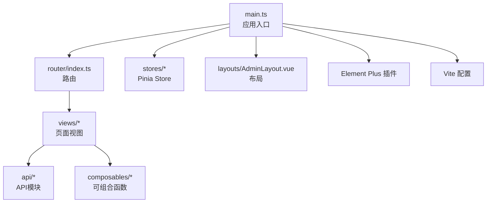
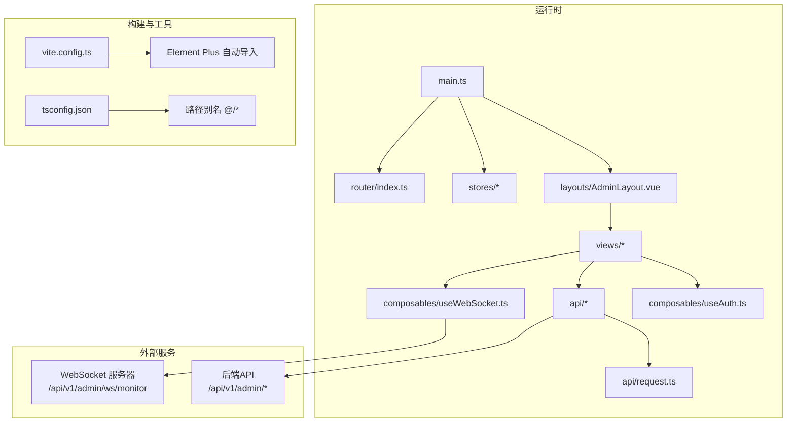
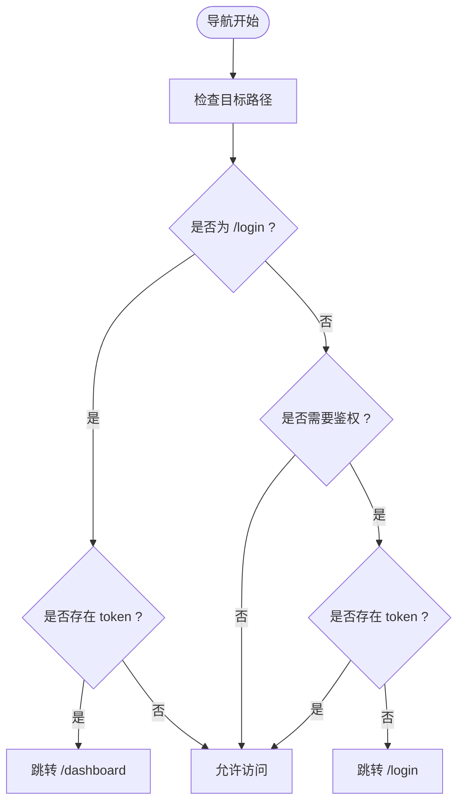
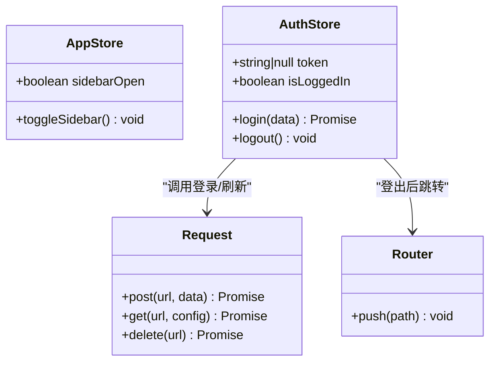
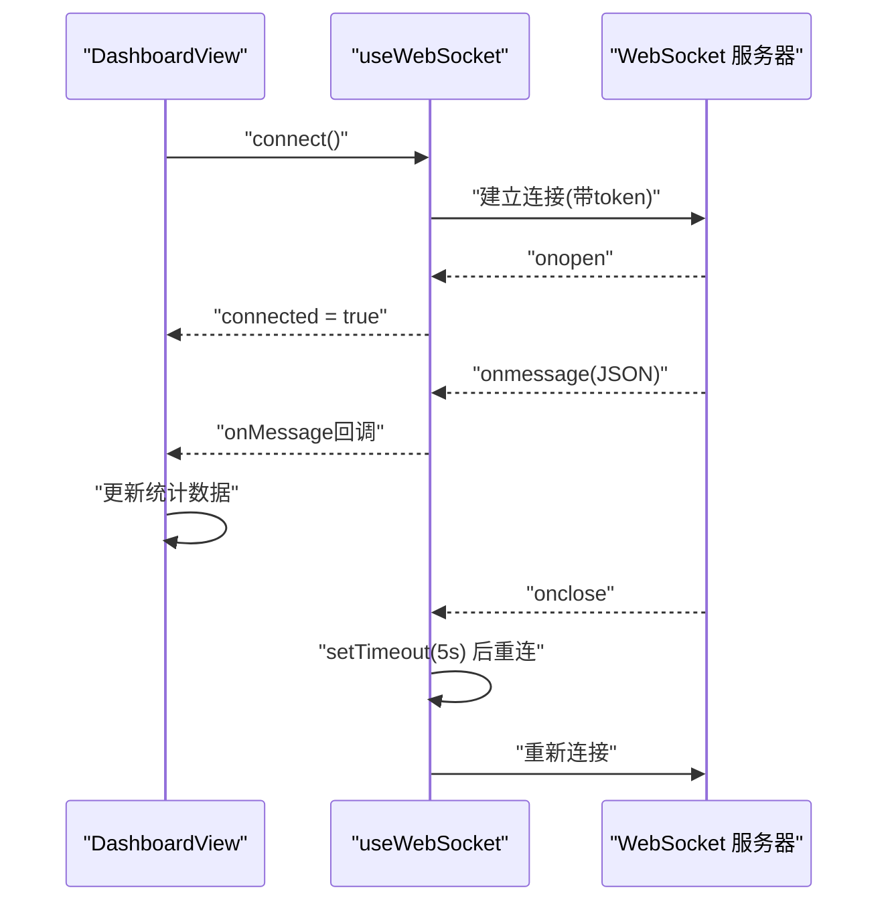
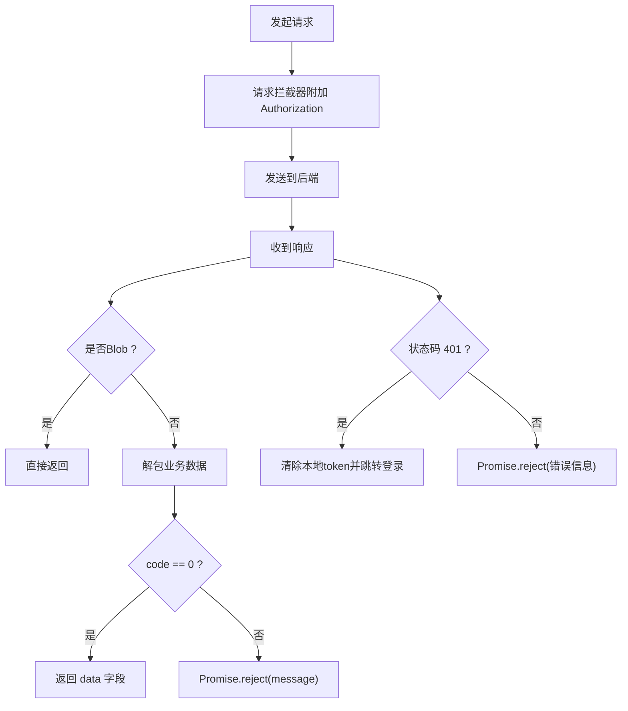
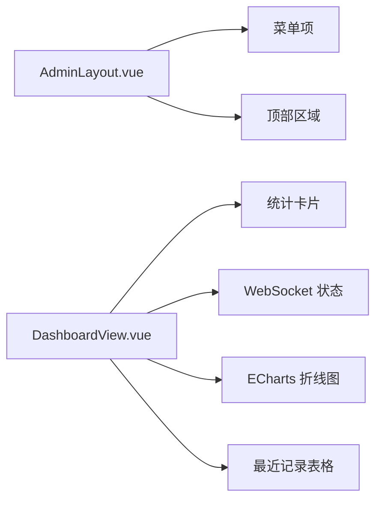
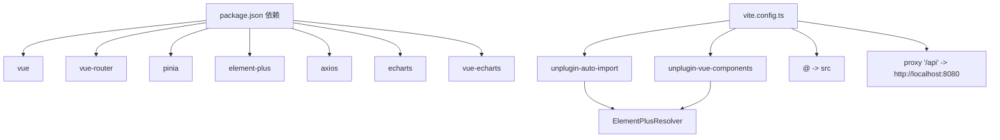

# 前端架构

<cite>
**本文引用的文件**
- [web/package.json](file://web/package.json)
- [web/vite.config.ts](file://web/vite.config.ts)
- [web/tsconfig.json](file://web/tsconfig.json)
- [web/src/main.ts](file://web/src/main.ts)
- [web/src/App.vue](file://web/src/App.vue)
- [web/src/router/index.ts](file://web/src/router/index.ts)
- [web/src/stores/app.ts](file://web/src/stores/app.ts)
- [web/src/stores/auth.ts](file://web/src/stores/auth.ts)
- [web/src/composables/useAuth.ts](file://web/src/composables/useAuth.ts)
- [web/src/composables/useWebSocket.ts](file://web/src/composables/useWebSocket.ts)
- [web/src/api/request.ts](file://web/src/api/request.ts)
- [web/src/api/auth.ts](file://web/src/api/auth.ts)
- [web/src/api/data.ts](file://web/src/api/data.ts)
- [web/src/layouts/AdminLayout.vue](file://web/src/layouts/AdminLayout.vue)
- [web/src/views/DashboardView.vue](file://web/src/views/DashboardView.vue)
</cite>

## 目录
1. [简介](#简介)
2. [项目结构](#项目结构)
3. [核心组件](#核心组件)
4. [架构总览](#架构总览)
5. [详细组件分析](#详细组件分析)
6. [依赖关系分析](#依赖关系分析)
7. [性能考虑](#性能考虑)
8. [故障排查指南](#故障排查指南)
9. [结论](#结论)
10. [附录](#附录)

## 简介
本文件面向DataCollector前端子系统，围绕Vue.js 3 + TypeScript应用进行系统化架构说明。重点覆盖以下方面：
- 应用结构与模块划分（路由、布局、视图、API、状态管理）
- Pinia状态管理的Store设计与使用模式
- Element Plus UI组件库的集成与自动导入策略
- WebSocket客户端实现与实时数据同步机制
- 组件开发指南与最佳实践
- 构建配置与部署流程
- 前端与后端API交互模式与错误处理
- 响应式设计与用户体验优化建议

## 项目结构
前端位于web目录，采用Vite + Vue 3 + TypeScript + Pinia + Element Plus技术栈。核心目录组织如下：
- src/main.ts：应用入口，注册插件（Pinia、Router、Element Plus）并挂载
- src/router/index.ts：路由定义与鉴权守卫
- src/stores：Pinia Store集合（应用状态、认证）
- src/composables：可复用逻辑（鉴权令牌刷新、WebSocket封装）
- src/api：统一HTTP请求层与各业务API模块
- src/layouts：页面布局（AdminLayout）
- src/views：页面视图（Dashboard、Data、Sources等）
- vite.config.ts：构建与开发服务器配置（代理、别名、自动导入Element Plus）
- tsconfig.json：TypeScript编译选项与路径映射

**图表来源**
- [web/src/main.ts:1-17](file://web/src/main.ts#L1-L17)
- [web/src/router/index.ts:1-78](file://web/src/router/index.ts#L1-L78)
- [web/src/layouts/AdminLayout.vue:1-174](file://web/src/layouts/AdminLayout.vue#L1-L174)
- [web/vite.config.ts:1-36](file://web/vite.config.ts#L1-L36)

**章节来源**
- [web/package.json:1-30](file://web/package.json#L1-L30)
- [web/vite.config.ts:1-36](file://web/vite.config.ts#L1-L36)
- [web/tsconfig.json:1-26](file://web/tsconfig.json#L1-L26)
- [web/src/main.ts:1-17](file://web/src/main.ts#L1-L17)
- [web/src/App.vue:1-4](file://web/src/App.vue#L1-L4)

## 核心组件
- 应用入口与全局插件
  - 在入口中注册Pinia、Router、Element Plus，并挂载应用
  - Element Plus本地化为简体中文
- 路由系统
  - 基于History模式，定义登录、设置、仪表盘、数据、数据源、API文档等页面
  - 全局前置守卫校验JWT令牌，保护需要鉴权的路由
- 状态管理（Pinia）
  - app：应用级状态（如侧边栏展开状态）
  - auth：用户认证状态（token、登录、登出）
- 可组合函数
  - useAuth：定时刷新JWT令牌
  - useWebSocket：通用WebSocket连接、断线重连、消息分发
- API层
  - request：Axios实例，统一请求/响应拦截器、错误处理、业务码解包
  - 各业务模块：auth、data等API方法

**章节来源**
- [web/src/main.ts:1-17](file://web/src/main.ts#L1-L17)
- [web/src/router/index.ts:1-78](file://web/src/router/index.ts#L1-L78)
- [web/src/stores/app.ts:1-13](file://web/src/stores/app.ts#L1-L13)
- [web/src/stores/auth.ts:1-26](file://web/src/stores/auth.ts#L1-L26)
- [web/src/composables/useAuth.ts:1-37](file://web/src/composables/useAuth.ts#L1-L37)
- [web/src/composables/useWebSocket.ts:1-66](file://web/src/composables/useWebSocket.ts#L1-L66)
- [web/src/api/request.ts:1-47](file://web/src/api/request.ts#L1-L47)
- [web/src/api/auth.ts:1-20](file://web/src/api/auth.ts#L1-L20)
- [web/src/api/data.ts:1-35](file://web/src/api/data.ts#L1-L35)

## 架构总览
前端采用“入口 -> 路由 -> 布局/视图 -> API -> Store”的清晰分层。Element Plus通过自动导入减少样板代码；Vite提供开发体验与构建能力；Pinia提供轻量、类型安全的状态管理；WebSocket用于实时监控数据推送。

**图表来源**
- [web/src/main.ts:1-17](file://web/src/main.ts#L1-L17)
- [web/src/router/index.ts:1-78](file://web/src/router/index.ts#L1-L78)
- [web/src/layouts/AdminLayout.vue:1-174](file://web/src/layouts/AdminLayout.vue#L1-L174)
- [web/src/views/DashboardView.vue:1-457](file://web/src/views/DashboardView.vue#L1-L457)
- [web/src/composables/useWebSocket.ts:1-66](file://web/src/composables/useWebSocket.ts#L1-L66)
- [web/src/api/request.ts:1-47](file://web/src/api/request.ts#L1-L47)
- [web/vite.config.ts:1-36](file://web/vite.config.ts#L1-L36)
- [web/tsconfig.json:1-26](file://web/tsconfig.json#L1-L26)

## 详细组件分析

### 路由与鉴权
- 路由定义
  - 登录页、设置页、仪表盘、数据页、数据源列表/详情、API文档
  - 根路径重定向至仪表盘；兜底路由重定向到仪表盘
- 鉴权守卫
  - 若访问受保护路由且无token，则跳转登录
  - 已登录访问登录页则跳转仪表盘

**图表来源**
- [web/src/router/index.ts:65-75](file://web/src/router/index.ts#L65-L75)

**章节来源**
- [web/src/router/index.ts:1-78](file://web/src/router/index.ts#L1-L78)

### 状态管理（Pinia Store）
- app Store
  - 管理侧边栏展开状态，提供切换方法
- auth Store
  - 维护token与登录态计算属性
  - 提供登录（调用API并持久化）、登出（清理token并跳转登录）

**图表来源**
- [web/src/stores/app.ts:1-13](file://web/src/stores/app.ts#L1-L13)
- [web/src/stores/auth.ts:1-26](file://web/src/stores/auth.ts#L1-L26)
- [web/src/api/request.ts:1-47](file://web/src/api/request.ts#L1-L47)
- [web/src/router/index.ts:1-78](file://web/src/router/index.ts#L1-L78)

**章节来源**
- [web/src/stores/app.ts:1-13](file://web/src/stores/app.ts#L1-L13)
- [web/src/stores/auth.ts:1-26](file://web/src/stores/auth.ts#L1-L26)

### WebSocket 客户端与实时同步
- 封装
  - 支持连接、断开、消息回调注册、断线自动重连
  - 连接状态通过ref暴露，异常时自动标记断开
- 使用场景
  - 仪表盘订阅监控统计事件，实时更新今日/周/月数据量
- 连接参数
  - 协议根据当前页面协议选择ws/wss
  - 查询参数携带JWT token

**图表来源**
- [web/src/composables/useWebSocket.ts:1-66](file://web/src/composables/useWebSocket.ts#L1-L66)
- [web/src/views/DashboardView.vue:156-174](file://web/src/views/DashboardView.vue#L156-L174)

**章节来源**
- [web/src/composables/useWebSocket.ts:1-66](file://web/src/composables/useWebSocket.ts#L1-L66)
- [web/src/views/DashboardView.vue:156-174](file://web/src/views/DashboardView.vue#L156-L174)

### API 层与错误处理
- Axios实例
  - 基础URL来自环境变量，超时15秒
  - 请求拦截器：自动附加Authorization头
  - 响应拦截器：对非Blob响应进行业务解包；401时清除token并跳转登录
- 业务API
  - 认证：登录、刷新令牌
  - 数据：查询、删除、批量删除、导出

**图表来源**
- [web/src/api/request.ts:1-47](file://web/src/api/request.ts#L1-L47)
- [web/src/api/auth.ts:1-20](file://web/src/api/auth.ts#L1-L20)
- [web/src/api/data.ts:1-35](file://web/src/api/data.ts#L1-L35)

**章节来源**
- [web/src/api/request.ts:1-47](file://web/src/api/request.ts#L1-L47)
- [web/src/api/auth.ts:1-20](file://web/src/api/auth.ts#L1-L20)
- [web/src/api/data.ts:1-35](file://web/src/api/data.ts#L1-L35)

### 布局与视图
- AdminLayout
  - 侧边栏菜单项与活动态高亮
  - 顶部欢迎信息与登出按钮
  - 与app Store交互控制侧边栏折叠
- DashboardView
  - 统计卡片、WebSocket连接状态指示、趋势图表、最近记录表格
  - 通过ECharts渲染折线图，支持按时间范围、数据源、Token筛选
  - 使用useWebSocket接收实时统计更新

**图表来源**
- [web/src/layouts/AdminLayout.vue:1-174](file://web/src/layouts/AdminLayout.vue#L1-L174)
- [web/src/views/DashboardView.vue:1-457](file://web/src/views/DashboardView.vue#L1-L457)

**章节来源**
- [web/src/layouts/AdminLayout.vue:1-174](file://web/src/layouts/AdminLayout.vue#L1-L174)
- [web/src/views/DashboardView.vue:1-457](file://web/src/views/DashboardView.vue#L1-L457)

## 依赖关系分析
- 构建与开发
  - Vite插件链：Vue、AutoImport（Element Plus）、Components（Element Plus）
  - 别名@指向src，便于统一导入
  - 开发服务器代理/api到后端
- 运行时依赖
  - Vue 3、Vue Router、Pinia、Element Plus、axios、ECharts、vue-echarts
- 类型安全
  - TypeScript严格模式，路径别名与模块解析策略

**图表来源**
- [web/package.json:1-30](file://web/package.json#L1-L30)
- [web/vite.config.ts:1-36](file://web/vite.config.ts#L1-L36)
- [web/tsconfig.json:1-26](file://web/tsconfig.json#L1-L26)

**章节来源**
- [web/package.json:1-30](file://web/package.json#L1-L30)
- [web/vite.config.ts:1-36](file://web/vite.config.ts#L1-L36)
- [web/tsconfig.json:1-26](file://web/tsconfig.json#L1-L26)

## 性能考虑
- 懒加载与代码分割
  - 路由级异步加载视图组件，降低首屏体积
- 图表性能
  - Dashboard仅在需要时渲染ECharts，避免不必要的重绘
  - 折线图启用平滑曲线与最小化样式开销
- 网络与缓存
  - 请求拦截器统一附加token，减少重复逻辑
  - 导出接口以Blob形式返回，避免额外序列化成本
- 重连策略
  - WebSocket断线重连采用固定延迟退避，避免频繁重建连接

[本节为通用指导，不直接分析具体文件]

## 故障排查指南
- 登录后无法进入受保护页面
  - 检查路由守卫逻辑与本地token存储
  - 确认登录成功后token已写入localStorage
- 401错误频繁出现
  - 检查请求拦截器是否正确附加Authorization头
  - 确认useAuth定时刷新逻辑正常执行
- WebSocket无法连接或频繁断开
  - 检查协议(ws/wss)与后端地址
  - 查看断线重连日志与onclose触发
- 导出功能下载失败
  - 确认后端返回Content-Disposition与Blob处理逻辑

**章节来源**
- [web/src/router/index.ts:65-75](file://web/src/router/index.ts#L65-L75)
- [web/src/api/request.ts:13-44](file://web/src/api/request.ts#L13-L44)
- [web/src/composables/useAuth.ts:1-37](file://web/src/composables/useAuth.ts#L1-L37)
- [web/src/composables/useWebSocket.ts:1-66](file://web/src/composables/useWebSocket.ts#L1-L66)
- [web/src/api/data.ts:17-34](file://web/src/api/data.ts#L17-L34)

## 结论
该前端架构以Vue 3 + TypeScript为基础，结合Pinia实现轻量状态管理，Element Plus提升UI效率，Vite提供高效开发与构建体验。通过统一的API层与拦截器，实现一致的鉴权与错误处理；通过WebSocket实现实时监控数据同步。整体结构清晰、扩展性强，适合持续演进与团队协作。

[本节为总结性内容，不直接分析具体文件]

## 附录

### 组件开发指南与最佳实践
- 组件拆分
  - 页面组件聚焦布局与数据流，通用UI封装为可复用组件
- 状态管理
  - 将跨页面共享的状态放入Pinia Store，避免props逐层传递
- API调用
  - 所有HTTP请求通过request实例，集中处理鉴权与错误
- 响应式与性能
  - 合理使用computed与watch，避免在模板中进行复杂计算
  - 对高频更新的数据使用浅层响应式，减少重渲染
- 可组合逻辑
  - 将可复用逻辑抽象为composables，如鉴权刷新、WebSocket封装

[本节为通用指导，不直接分析具体文件]

### 前端构建与部署流程
- 开发
  - 使用Vite开发服务器，默认端口5173，开启/api代理
- 构建
  - TypeScript类型检查与打包后生成dist目录
- 部署
  - 将dist目录部署至静态服务器或反向代理
  - 设置VITE_API_BASE_URL指向后端API地址

**章节来源**
- [web/vite.config.ts:23-35](file://web/vite.config.ts#L23-L35)
- [web/package.json:6-10](file://web/package.json#L6-L10)

### 前端与后端API交互模式
- 基础URL
  - 通过环境变量注入，支持不同环境切换
- 鉴权
  - 登录成功后保存token，后续请求自动附加Authorization头
- 错误处理
  - 业务错误：根据code字段判断，统一抛出message
  - 网络错误：401时清空token并跳转登录

**章节来源**
- [web/src/api/request.ts:5-44](file://web/src/api/request.ts#L5-L44)

### 响应式设计与用户体验优化
- 布局
  - AdminLayout支持侧边栏折叠，适配移动端与小屏设备
- 表单与筛选
  - Dashboard提供时间范围、数据源、Token多维筛选，支持空值回退
- 实时反馈
  - WebSocket连接状态可视化，提供手动重连按钮
- 加载与空状态
  - 大量数据加载时显示loading，无数据时展示空状态提示

**章节来源**
- [web/src/layouts/AdminLayout.vue:1-174](file://web/src/layouts/AdminLayout.vue#L1-L174)
- [web/src/views/DashboardView.vue:1-457](file://web/src/views/DashboardView.vue#L1-L457)