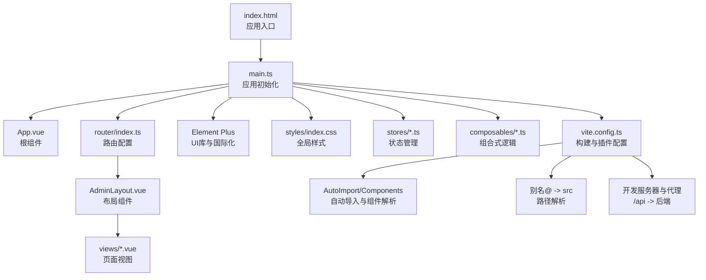
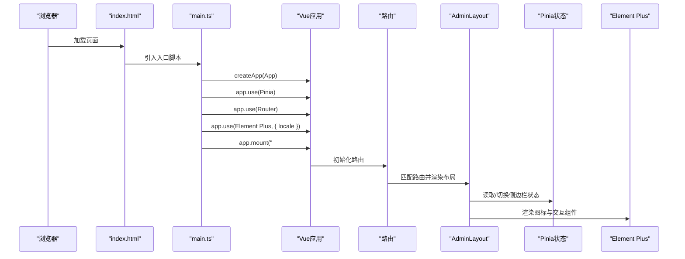
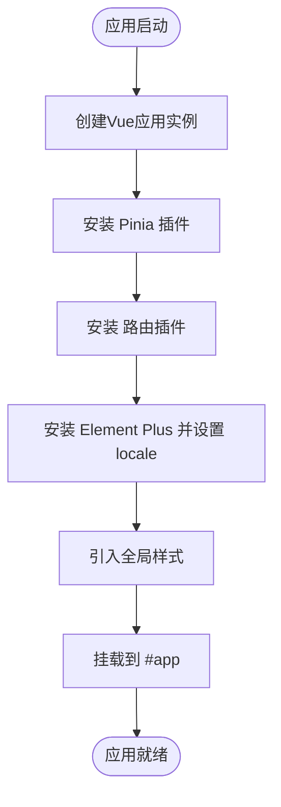
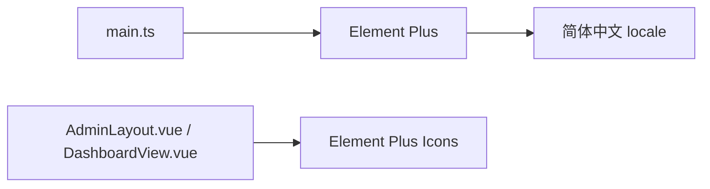
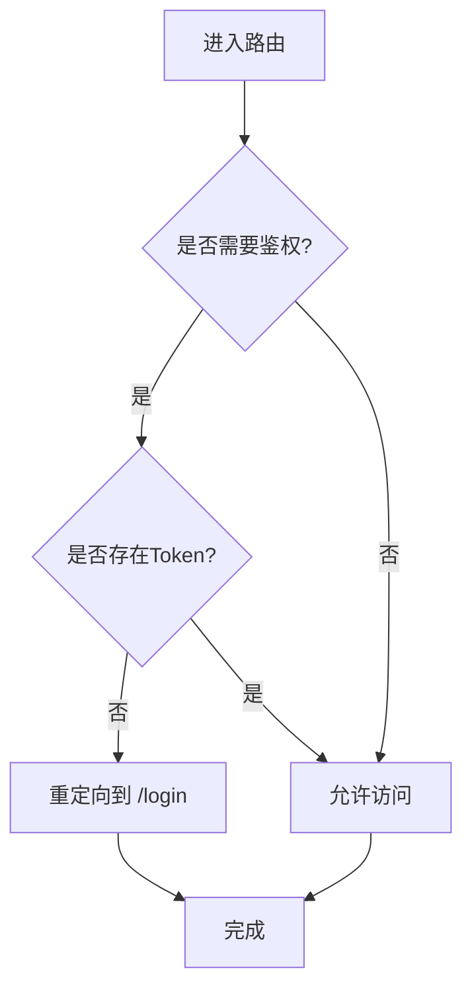
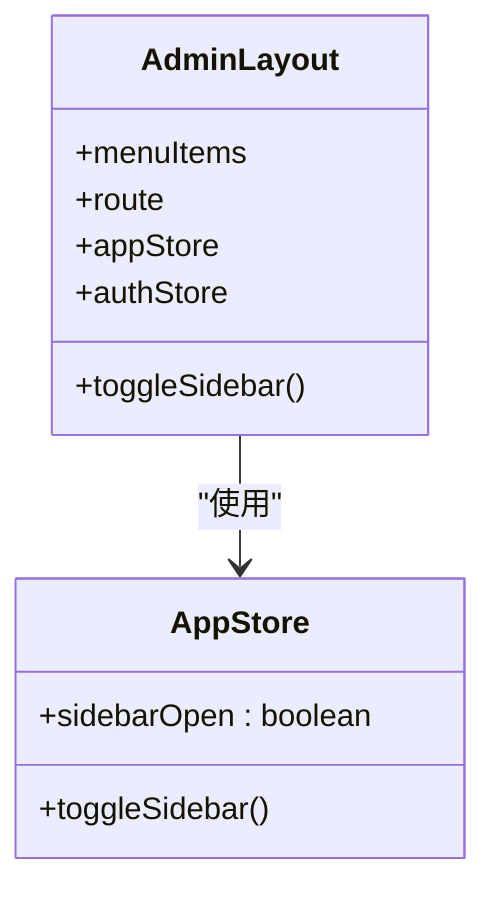
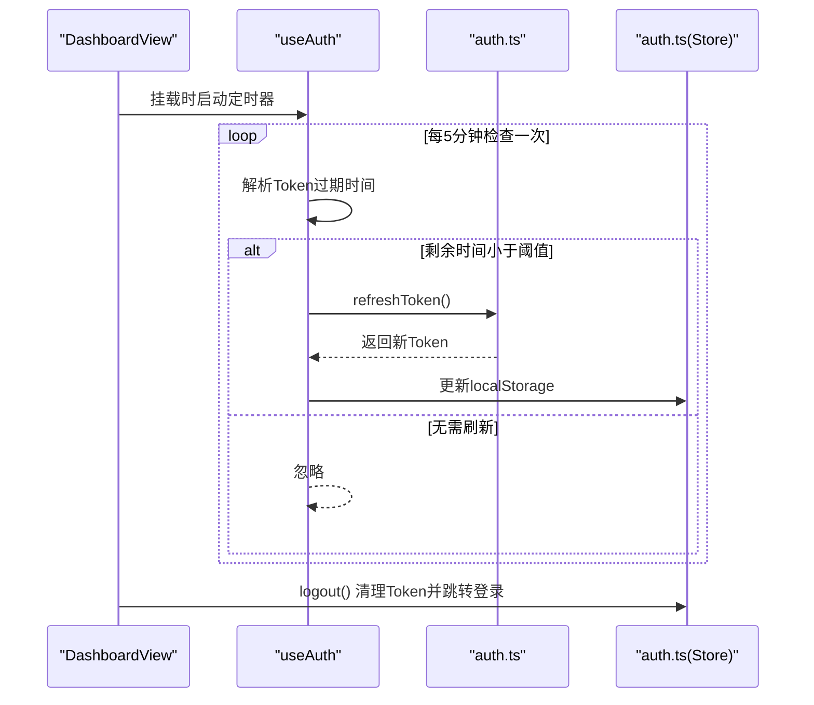
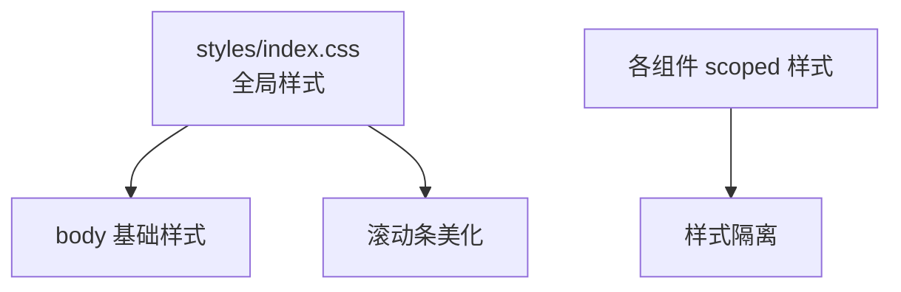
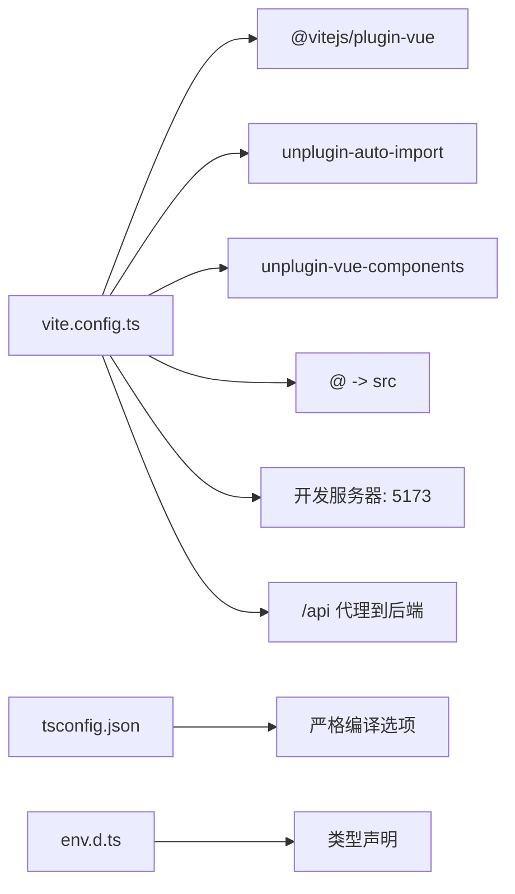
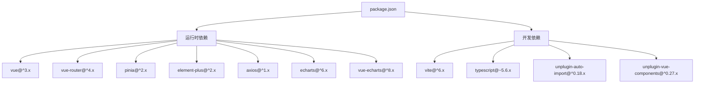

# 应用结构

<cite>
**本文引用的文件**
- [web/src/main.ts](file://web/src/main.ts)
- [web/vite.config.ts](file://web/vite.config.ts)
- [web/package.json](file://web/package.json)
- [web/src/App.vue](file://web/src/App.vue)
- [web/src/router/index.ts](file://web/src/router/index.ts)
- [web/src/styles/index.css](file://web/src/styles/index.css)
- [web/src/layouts/AdminLayout.vue](file://web/src/layouts/AdminLayout.vue)
- [web/src/stores/app.ts](file://web/src/stores/app.ts)
- [web/src/composables/useAuth.ts](file://web/src/composables/useAuth.ts)
- [web/tsconfig.json](file://web/tsconfig.json)
- [web/src/views/DashboardView.vue](file://web/src/views/DashboardView.vue)
- [web/src/api/auth.ts](file://web/src/api/auth.ts)
- [web/src/stores/auth.ts](file://web/src/stores/auth.ts)
- [web/env.d.ts](file://web/env.d.ts)
- [web/index.html](file://web/index.html)
</cite>

## 目录
1. [简介](#简介)
2. [项目结构](#项目结构)
3. [核心组件](#核心组件)
4. [架构总览](#架构总览)
5. [详细组件分析](#详细组件分析)
6. [依赖分析](#依赖分析)
7. [性能考虑](#性能考虑)
8. [故障排查指南](#故障排查指南)
9. [结论](#结论)
10. [附录](#附录)

## 简介
本文件面向DataCollector前端应用，系统性梳理Vue 3 + TypeScript + Vite构建的单页应用（SPA）结构与启动流程，重点覆盖以下方面：
- 应用初始化：应用创建、插件安装、全局配置
- Element Plus UI库集成与国际化配置
- 样式体系组织与CSS变量使用
- 应用入口点配置与启动流程
- 第三方库集成与版本管理策略
- 性能优化与最佳实践

## 项目结构
前端代码位于web目录，采用Vite作为构建工具，使用Vue 3 Composition API与TypeScript开发，配合Pinia进行状态管理、Vue Router进行路由控制，并通过Element Plus提供UI组件库。

**图表来源**
- [web/index.html:1-14](file://web/index.html#L1-L14)
- [web/src/main.ts:1-17](file://web/src/main.ts#L1-L17)
- [web/src/App.vue:1-4](file://web/src/App.vue#L1-L4)
- [web/src/router/index.ts:1-78](file://web/src/router/index.ts#L1-L78)
- [web/src/styles/index.css:1-21](file://web/src/styles/index.css#L1-L21)
- [web/src/layouts/AdminLayout.vue:1-174](file://web/src/layouts/AdminLayout.vue#L1-L174)
- [web/vite.config.ts:1-36](file://web/vite.config.ts#L1-L36)

**章节来源**
- [web/index.html:1-14](file://web/index.html#L1-L14)
- [web/src/main.ts:1-17](file://web/src/main.ts#L1-L17)
- [web/vite.config.ts:1-36](file://web/vite.config.ts#L1-L36)

## 核心组件
- 应用入口与初始化
  - 创建Vue应用实例，挂载Pinia、路由、Element Plus插件，引入全局样式后挂载到DOM。
  - 参考路径：[web/src/main.ts:1-17](file://web/src/main.ts#L1-L17)
- 根组件
  - 使用router-view承载路由视图。
  - 参考路径：[web/src/App.vue:1-4](file://web/src/App.vue#L1-L4)
- 路由系统
  - 基于history模式，定义登录、设置、仪表盘、数据源、数据记录、API文档等路由；使用导航前置守卫实现鉴权跳转。
  - 参考路径：[web/src/router/index.ts:1-78](file://web/src/router/index.ts#L1-L78)
- 布局组件
  - AdminLayout提供侧边栏、顶部导航、主内容区，集成Element Plus图标与按钮；通过Pinia控制侧边栏展开状态。
  - 参考路径：[web/src/layouts/AdminLayout.vue:1-174](file://web/src/layouts/AdminLayout.vue#L1-L174)
- 状态管理
  - app.ts：管理侧边栏开关状态
  - auth.ts：封装登录、登出、Token持久化与路由跳转
  - 参考路径：
    - [web/src/stores/app.ts:1-13](file://web/src/stores/app.ts#L1-L13)
    - [web/src/stores/auth.ts:1-26](file://web/src/stores/auth.ts#L1-L26)
- 组合式逻辑
  - useAuth：定时刷新Token并在组件生命周期内启停定时器
  - 参考路径：[web/src/composables/useAuth.ts:1-37](file://web/src/composables/useAuth.ts#L1-L37)
- 样式系统
  - 全局样式统一在index.css中定义，包含基础排版、滚动条美化等；各组件使用scoped样式隔离作用域。
  - 参考路径：[web/src/styles/index.css:1-21](file://web/src/styles/index.css#L1-L21)
- 构建与类型配置
  - vite.config.ts：启用Vue插件、自动导入、组件解析、路径别名、开发服务器与代理
  - tsconfig.json：严格TS编译选项与路径映射
  - env.d.ts：声明环境变量与Vue模块类型
  - 参考路径：
    - [web/vite.config.ts:1-36](file://web/vite.config.ts#L1-L36)
    - [web/tsconfig.json:1-26](file://web/tsconfig.json#L1-L26)
    - [web/env.d.ts:1-16](file://web/env.d.ts#L1-L16)

**章节来源**
- [web/src/main.ts:1-17](file://web/src/main.ts#L1-L17)
- [web/src/App.vue:1-4](file://web/src/App.vue#L1-L4)
- [web/src/router/index.ts:1-78](file://web/src/router/index.ts#L1-L78)
- [web/src/layouts/AdminLayout.vue:1-174](file://web/src/layouts/AdminLayout.vue#L1-L174)
- [web/src/stores/app.ts:1-13](file://web/src/stores/app.ts#L1-L13)
- [web/src/stores/auth.ts:1-26](file://web/src/stores/auth.ts#L1-L26)
- [web/src/composables/useAuth.ts:1-37](file://web/src/composables/useAuth.ts#L1-L37)
- [web/src/styles/index.css:1-21](file://web/src/styles/index.css#L1-L21)
- [web/vite.config.ts:1-36](file://web/vite.config.ts#L1-L36)
- [web/tsconfig.json:1-26](file://web/tsconfig.json#L1-L26)
- [web/env.d.ts:1-16](file://web/env.d.ts#L1-L16)

## 架构总览
下图展示从浏览器加载到应用运行的关键步骤与模块交互：

**图表来源**
- [web/index.html:1-14](file://web/index.html#L1-L14)
- [web/src/main.ts:1-17](file://web/src/main.ts#L1-L17)
- [web/src/router/index.ts:1-78](file://web/src/router/index.ts#L1-L78)
- [web/src/layouts/AdminLayout.vue:1-174](file://web/src/layouts/AdminLayout.vue#L1-L174)
- [web/src/stores/app.ts:1-13](file://web/src/stores/app.ts#L1-L13)

## 详细组件分析

### 应用初始化与启动流程
- 初始化步骤
  - 创建Vue应用实例，注册Pinia、路由、Element Plus（设置locale为简体中文）
  - 引入全局样式，最后挂载到DOM节点
- 启动顺序
  - main.ts是唯一入口，负责装配所有插件与配置
- 关键点
  - Element Plus的locale配置确保组件文案本地化
  - 全局样式的引入保证首屏一致的视觉基线

**图表来源**
- [web/src/main.ts:1-17](file://web/src/main.ts#L1-L17)
- [web/src/styles/index.css:1-21](file://web/src/styles/index.css#L1-L21)

**章节来源**
- [web/src/main.ts:1-17](file://web/src/main.ts#L1-L17)
- [web/src/styles/index.css:1-21](file://web/src/styles/index.css#L1-L21)

### Element Plus 集成与国际化
- 集成方式
  - 在main.ts中引入Element Plus并传入locale配置
  - 通过Vite插件自动导入与组件解析减少样板代码
- 国际化
  - 使用简体中文locale，确保组件文案与交互语言一致
- 图标
  - 通过Element Plus Icons在布局与视图中直接使用

**图表来源**
- [web/src/main.ts:3-6](file://web/src/main.ts#L3-L6)
- [web/vite.config.ts:11-16](file://web/vite.config.ts#L11-L16)
- [web/src/layouts/AdminLayout.vue:45-48](file://web/src/layouts/AdminLayout.vue#L45-L48)
- [web/src/views/DashboardView.vue:124-129](file://web/src/views/DashboardView.vue#L124-L129)

**章节来源**
- [web/src/main.ts:3-6](file://web/src/main.ts#L3-L6)
- [web/vite.config.ts:11-16](file://web/vite.config.ts#L11-L16)
- [web/src/layouts/AdminLayout.vue:45-48](file://web/src/layouts/AdminLayout.vue#L45-L48)
- [web/src/views/DashboardView.vue:124-129](file://web/src/views/DashboardView.vue#L124-L129)

### 路由与鉴权
- 路由设计
  - 登录、设置、仪表盘、数据源、数据记录、API文档等页面
  - 使用history模式与动态import按需加载视图
- 导航守卫
  - 通过beforeEach判断是否需要鉴权，若已登录访问/login则重定向至/dashboard
- 视图示例
  - 仪表盘视图集成ECharts、Element Plus表格与卡片组件，展示统计数据与趋势图

**图表来源**
- [web/src/router/index.ts:65-75](file://web/src/router/index.ts#L65-L75)
- [web/src/views/DashboardView.vue:1-470](file://web/src/views/DashboardView.vue#L1-L470)

**章节来源**
- [web/src/router/index.ts:1-78](file://web/src/router/index.ts#L1-L78)
- [web/src/views/DashboardView.vue:1-470](file://web/src/views/DashboardView.vue#L1-L470)

### 布局与侧边栏状态管理
- AdminLayout
  - 提供侧边栏折叠/展开、顶部导航、用户登出入口
  - 通过Element Plus图标与按钮增强交互
- 侧边栏状态
  - app.ts基于窗口宽度初始化状态，并提供toggle方法
  - 布局组件在模板中绑定active状态与点击事件

**图表来源**
- [web/src/layouts/AdminLayout.vue:43-63](file://web/src/layouts/AdminLayout.vue#L43-L63)
- [web/src/stores/app.ts:1-13](file://web/src/stores/app.ts#L1-L13)

**章节来源**
- [web/src/layouts/AdminLayout.vue:1-174](file://web/src/layouts/AdminLayout.vue#L1-L174)
- [web/src/stores/app.ts:1-13](file://web/src/stores/app.ts#L1-L13)

### 认证与Token刷新机制
- 登录与登出
  - auth.ts封装登录请求、Token写入localStorage、登出清理与路由跳转
- Token刷新
  - useAuth在组件挂载时启动定时器，计算Token剩余有效期并在临界值时调用刷新接口
- 安全与健壮性
  - 刷新失败静默处理，避免阻塞主流程；登出时清除Token并跳转登录页

**图表来源**
- [web/src/composables/useAuth.ts:4-36](file://web/src/composables/useAuth.ts#L4-L36)
- [web/src/api/auth.ts:17-19](file://web/src/api/auth.ts#L17-L19)
- [web/src/stores/auth.ts:12-22](file://web/src/stores/auth.ts#L12-L22)
- [web/src/views/DashboardView.vue:156-168](file://web/src/views/DashboardView.vue#L156-L168)

**章节来源**
- [web/src/composables/useAuth.ts:1-37](file://web/src/composables/useAuth.ts#L1-L37)
- [web/src/api/auth.ts:1-20](file://web/src/api/auth.ts#L1-L20)
- [web/src/stores/auth.ts:1-26](file://web/src/stores/auth.ts#L1-L26)
- [web/src/views/DashboardView.vue:156-168](file://web/src/views/DashboardView.vue#L156-L168)

### 样式系统与CSS变量
- 全局样式
  - 在index.css中统一字体、背景色与滚动条样式，保证整体视觉一致性
- 组件样式
  - 各组件使用scoped样式隔离，避免污染全局命名空间
- 建议
  - 对常用颜色、尺寸抽象为CSS变量，集中维护以提升主题一致性与可维护性

**图表来源**
- [web/src/styles/index.css:1-21](file://web/src/styles/index.css#L1-L21)

**章节来源**
- [web/src/styles/index.css:1-21](file://web/src/styles/index.css#L1-L21)

### 构建与开发配置
- Vite配置
  - 启用Vue插件、自动导入与组件解析（ElementPlusResolver），简化引入
  - 路径别名@指向src，便于统一引用
  - 开发服务器端口与/api代理到后端服务
- TypeScript配置
  - 严格编译选项、路径映射、DOM库支持
- 环境变量
  - 通过env.d.ts声明VITE_API_BASE_URL等环境变量类型

**图表来源**
- [web/vite.config.ts:1-36](file://web/vite.config.ts#L1-L36)
- [web/tsconfig.json:1-26](file://web/tsconfig.json#L1-L26)
- [web/env.d.ts:9-15](file://web/env.d.ts#L9-L15)

**章节来源**
- [web/vite.config.ts:1-36](file://web/vite.config.ts#L1-L36)
- [web/tsconfig.json:1-26](file://web/tsconfig.json#L1-L26)
- [web/env.d.ts:1-16](file://web/env.d.ts#L1-L16)

## 依赖分析
- 运行时依赖
  - Vue 3、Vue Router、Pinia、Element Plus、axios、echarts、vue-echarts、marked
- 开发依赖
  - Vite、@vitejs/plugin-vue、typescript、unplugin-auto-import、unplugin-vue-components、vue-tsc
- 版本管理策略
  - 使用package.json统一声明版本，遵循语义化版本；对UI库与图表库采用兼容范围，定期评估升级风险

**图表来源**
- [web/package.json:11-28](file://web/package.json#L11-L28)

**章节来源**
- [web/package.json:1-30](file://web/package.json#L1-L30)

## 性能考虑
- 代码分割与懒加载
  - 路由级动态import按需加载视图，减少首屏体积
- 组件按需引入
  - 通过ElementPlusResolver实现自动按需导入，降低打包体积
- 图表性能
  - ECharts按需注册所需模块，避免引入完整包
- 缓存与刷新
  - Token定时刷新避免频繁鉴权失败导致的重试风暴
- 构建优化
  - 生产构建输出至dist，结合CDN与缓存策略提升加载速度

[本节为通用性能建议，不直接分析具体文件]

## 故障排查指南
- 登录后无法进入受保护页面
  - 检查路由前置守卫逻辑与localStorage中的jwt_token
  - 参考路径：[web/src/router/index.ts:65-75](file://web/src/router/index.ts#L65-L75)
- Token过期或刷新失败
  - 确认刷新接口可用与useAuth定时器正常运行
  - 参考路径：
    - [web/src/composables/useAuth.ts:4-36](file://web/src/composables/useAuth.ts#L4-L36)
    - [web/src/api/auth.ts:17-19](file://web/src/api/auth.ts#L17-L19)
- UI文案非中文或图标不显示
  - 确认Element Plus locale设置与图标组件正确引入
  - 参考路径：
    - [web/src/main.ts:5-6](file://web/src/main.ts#L5-L6)
    - [web/src/layouts/AdminLayout.vue:45-48](file://web/src/layouts/AdminLayout.vue#L45-L48)
- 开发代理无效
  - 检查vite.config.ts中proxy配置与后端服务端口
  - 参考路径：[web/vite.config.ts:23-31](file://web/vite.config.ts#L23-L31)

**章节来源**
- [web/src/router/index.ts:65-75](file://web/src/router/index.ts#L65-L75)
- [web/src/composables/useAuth.ts:4-36](file://web/src/composables/useAuth.ts#L4-L36)
- [web/src/api/auth.ts:17-19](file://web/src/api/auth.ts#L17-L19)
- [web/src/main.ts:5-6](file://web/src/main.ts#L5-L6)
- [web/src/layouts/AdminLayout.vue:45-48](file://web/src/layouts/AdminLayout.vue#L45-L48)
- [web/vite.config.ts:23-31](file://web/vite.config.ts#L23-L31)

## 结论
该前端应用以Vue 3为核心，结合Pinia、Vue Router与Element Plus构建了清晰的单页应用架构。通过Vite的自动导入与组件解析能力，显著降低了样板代码；借助路由守卫与组合式逻辑实现了鉴权与Token刷新；全局样式与组件scoped样式共同保障了视觉一致性与可维护性。建议持续关注依赖版本演进与性能指标，保持应用的稳定性与可扩展性。

[本节为总结性内容，不直接分析具体文件]

## 附录
- 入口HTML
  - 确保挂载点与脚本引入正确
  - 参考路径：[web/index.html:1-14](file://web/index.html#L1-L14)
- 环境变量声明
  - 明确VITE_API_BASE_URL等变量类型
  - 参考路径：[web/env.d.ts:9-15](file://web/env.d.ts#L9-L15)

**章节来源**
- [web/index.html:1-14](file://web/index.html#L1-L14)
- [web/env.d.ts:9-15](file://web/env.d.ts#L9-L15)