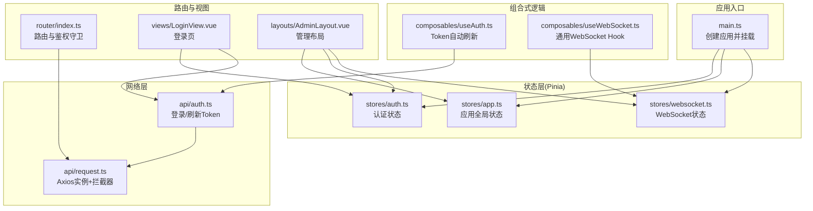
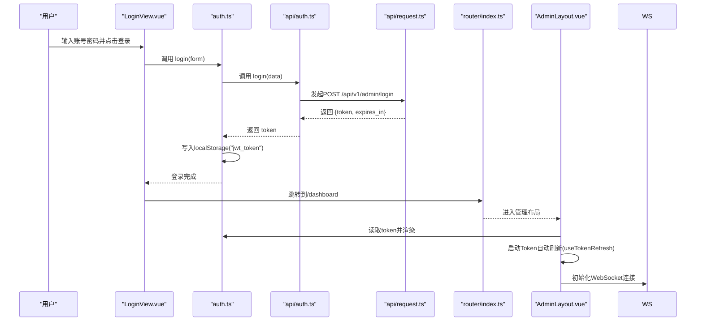
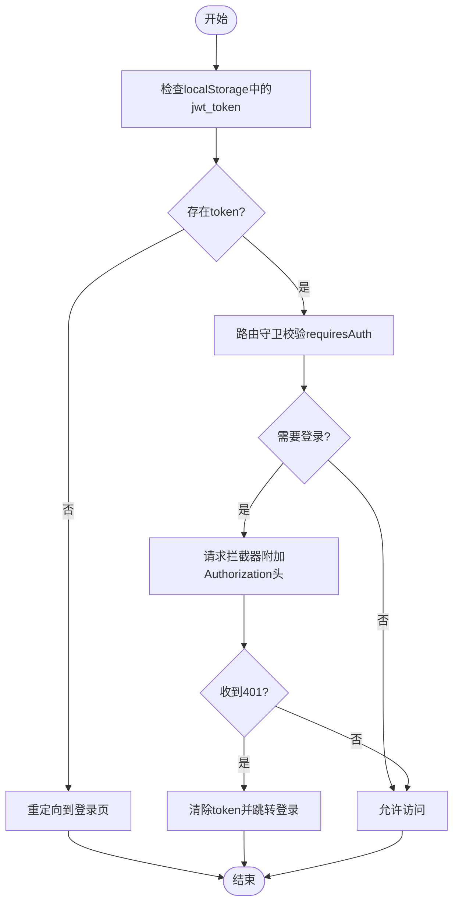
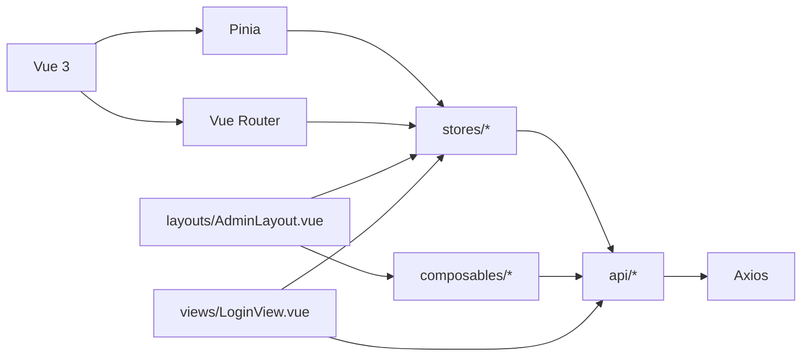

# 状态管理

<cite>
**本文引用的文件**
- [web/src/stores/auth.ts](file://web/src/stores/auth.ts)
- [web/src/stores/app.ts](file://web/src/stores/app.ts)
- [web/src/stores/websocket.ts](file://web/src/stores/websocket.ts)
- [web/src/composables/useAuth.ts](file://web/src/composables/useAuth.ts)
- [web/src/composables/useWebSocket.ts](file://web/src/composables/useWebSocket.ts)
- [web/src/api/auth.ts](file://web/src/api/auth.ts)
- [web/src/api/request.ts](file://web/src/api/request.ts)
- [web/src/router/index.ts](file://web/src/router/index.ts)
- [web/src/main.ts](file://web/src/main.ts)
- [web/src/views/LoginView.vue](file://web/src/views/LoginView.vue)
- [web/src/layouts/AdminLayout.vue](file://web/src/layouts/AdminLayout.vue)
- [web/package.json](file://web/package.json)
</cite>

## 目录
1. [简介](#简介)
2. [项目结构](#项目结构)
3. [核心组件](#核心组件)
4. [架构总览](#架构总览)
5. [详细组件分析](#详细组件分析)
6. [依赖分析](#依赖分析)
7. [性能考虑](#性能考虑)
8. [故障排查指南](#故障排查指南)
9. [结论](#结论)
10. [附录](#附录)

## 简介
本文件面向DataCollector前端（Vue 3 + Pinia）的状态管理系统，围绕以下目标展开：
- 深入解释Pinia状态管理的使用与Store设计模式
- 详解认证状态管理：登录、Token管理、权限控制
- 应用状态的组织与模块化设计
- 组合式函数（composables）与自定义Hook开发
- 状态持久化与同步策略
- 状态调试与性能优化技巧
- 状态与组件的绑定与响应式更新机制

## 项目结构
前端位于web目录，采用“按功能域分层”的组织方式：
- stores：集中存放Pinia Store，分别管理认证、应用全局状态、WebSocket状态
- composables：封装可复用的逻辑（如Token自动刷新、WebSocket连接）
- api：封装HTTP请求与拦截器，统一处理鉴权头与401跳转
- router：路由配置与鉴权守卫
- views与layouts：页面视图与布局，直接消费Store与composables
- main.ts：应用入口，注册Pinia、路由、UI库等

图表来源
- [web/src/main.ts:1-17](file://web/src/main.ts#L1-L17)
- [web/src/stores/auth.ts:1-26](file://web/src/stores/auth.ts#L1-L26)
- [web/src/stores/app.ts:1-13](file://web/src/stores/app.ts#L1-L13)
- [web/src/stores/websocket.ts:1-84](file://web/src/stores/websocket.ts#L1-L84)
- [web/src/composables/useAuth.ts:1-37](file://web/src/composables/useAuth.ts#L1-L37)
- [web/src/composables/useWebSocket.ts:1-66](file://web/src/composables/useWebSocket.ts#L1-L66)
- [web/src/api/auth.ts:1-20](file://web/src/api/auth.ts#L1-L20)
- [web/src/api/request.ts:1-47](file://web/src/api/request.ts#L1-L47)
- [web/src/router/index.ts:1-78](file://web/src/router/index.ts#L1-L78)
- [web/src/views/LoginView.vue:1-107](file://web/src/views/LoginView.vue#L1-L107)
- [web/src/layouts/AdminLayout.vue:1-255](file://web/src/layouts/AdminLayout.vue#L1-L255)

章节来源
- [web/src/main.ts:1-17](file://web/src/main.ts#L1-L17)
- [web/src/router/index.ts:1-78](file://web/src/router/index.ts#L1-L78)

## 核心组件
本节聚焦三个核心Store与两个关键composables，阐述其职责、数据结构与交互关系。

- 认证Store（auth）
  - 职责：维护JWT Token与登录态；提供登录、登出方法；与本地存储同步
  - 关键字段：token（字符串或空）、isLoggedIn（基于token推导）
  - 关键方法：login(data)、logout()
  - 与API：login调用api/auth.ts中的login；鉴权头由api/request.ts统一注入
  - 与路由：router/index.ts在进入受保护路由前检查localStorage中的token

- 应用Store（app）
  - 职责：管理侧边栏开关等UI状态
  - 关键字段：sidebarOpen（布尔）
  - 关键方法：toggleSidebar()

- WebSocket Store（websocket）
  - 职责：封装WebSocket连接生命周期、消息广播、重连策略
  - 关键字段：connected（布尔）、内部ws实例、重连定时器
  - 关键方法：connect()、disconnect()、reconnect()、onMessage(handler)
  - 与鉴权：URL拼接时携带localStorage中的token参数

- 认证Hook（useAuth）
  - 职责：周期性检测Token剩余有效期并在即将过期时自动刷新
  - 机制：每5分钟检查一次；当剩余时间小于2小时触发刷新；刷新成功后写回localStorage

- 通用WebSocket Hook（useWebSocket）
  - 职责：提供更通用的WebSocket连接能力（非Pinia Store），支持消息回调与自动重连
  - 适用场景：无需全局共享状态时的轻量封装

章节来源
- [web/src/stores/auth.ts:1-26](file://web/src/stores/auth.ts#L1-L26)
- [web/src/stores/app.ts:1-13](file://web/src/stores/app.ts#L1-L13)
- [web/src/stores/websocket.ts:1-84](file://web/src/stores/websocket.ts#L1-L84)
- [web/src/composables/useAuth.ts:1-37](file://web/src/composables/useAuth.ts#L1-L37)
- [web/src/composables/useWebSocket.ts:1-66](file://web/src/composables/useWebSocket.ts#L1-L66)
- [web/src/api/auth.ts:1-20](file://web/src/api/auth.ts#L1-L20)
- [web/src/api/request.ts:1-47](file://web/src/api/request.ts#L1-L47)
- [web/src/router/index.ts:1-78](file://web/src/router/index.ts#L1-L78)

## 架构总览
下图展示从用户操作到状态更新与组件响应的整体流程，覆盖登录、鉴权拦截、Token刷新与WebSocket连接。

图表来源
- [web/src/views/LoginView.vue:28-56](file://web/src/views/LoginView.vue#L28-L56)
- [web/src/stores/auth.ts:7-25](file://web/src/stores/auth.ts#L7-L25)
- [web/src/api/auth.ts:13-19](file://web/src/api/auth.ts#L13-L19)
- [web/src/api/request.ts:13-44](file://web/src/api/request.ts#L13-L44)
- [web/src/router/index.ts:65-75](file://web/src/router/index.ts#L65-L75)
- [web/src/layouts/AdminLayout.vue:63-86](file://web/src/layouts/AdminLayout.vue#L63-L86)

## 详细组件分析

### 认证状态管理（登录、Token管理、权限控制）
- 登录流程
  - 视图层收集表单数据，调用auth store的login方法
  - store通过api/auth.ts发起登录请求，接收token
  - 将token写入localStorage并同步到store的token字段
  - 成功后路由跳转至/dashboard

- Token管理
  - 请求拦截：api/request.ts在请求前从localStorage读取token并附加Authorization头
  - 响应拦截：对401进行统一处理，清除token并跳转登录页
  - 自动刷新：useAuth.ts周期性解析token的exp，当剩余时间小于阈值时调用刷新接口并更新localStorage

- 权限控制
  - 路由守卫：router/index.ts在导航前检查目标路由是否requiresAuth，并根据localStorage中的token决定放行或重定向到登录页
  - 登出：auth store的logout会清空token、移除localStorage并跳转登录页

图表来源
- [web/src/router/index.ts:65-75](file://web/src/router/index.ts#L65-L75)
- [web/src/api/request.ts:13-44](file://web/src/api/request.ts#L13-L44)
- [web/src/stores/auth.ts:18-22](file://web/src/stores/auth.ts#L18-L22)

章节来源
- [web/src/views/LoginView.vue:28-56](file://web/src/views/LoginView.vue#L28-L56)
- [web/src/stores/auth.ts:7-25](file://web/src/stores/auth.ts#L7-L25)
- [web/src/api/auth.ts:13-19](file://web/src/api/auth.ts#L13-L19)
- [web/src/api/request.ts:13-44](file://web/src/api/request.ts#L13-L44)
- [web/src/router/index.ts:65-75](file://web/src/router/index.ts#L65-L75)

### 应用状态组织与模块化设计
- Store划分
  - auth：专注认证领域，避免污染其他模块
  - app：专注UI层面的全局状态（如侧边栏）
  - websocket：专注实时通信，提供连接、断开、消息订阅能力
- 模块内聚与解耦
  - Store仅暴露必要字段与方法，不直接处理路由跳转或DOM操作
  - 路由与视图负责编排，Store只负责数据与计算
- 可扩展性
  - 新增领域状态（如主题、语言）可在stores目录下新增独立Store，遵循相同模式

章节来源
- [web/src/stores/app.ts:1-13](file://web/src/stores/app.ts#L1-L13)
- [web/src/stores/websocket.ts:1-84](file://web/src/stores/websocket.ts#L1-L84)

### 组合式函数（composables）与自定义Hook
- useTokenRefresh
  - 在组件挂载时启动定时器，解析localStorage中的token并判断剩余时间
  - 当接近过期时调用刷新接口，成功后更新localStorage
  - 在卸载时清理定时器，避免内存泄漏
- useWebSocket
  - 提供通用的WebSocket连接能力，支持消息回调与自动重连
  - 在组件卸载时自动断开连接，确保资源释放

章节来源
- [web/src/composables/useAuth.ts:1-37](file://web/src/composables/useAuth.ts#L1-L37)
- [web/src/composables/useWebSocket.ts:1-66](file://web/src/composables/useWebSocket.ts#L1-L66)

### 状态持久化与同步策略
- Token持久化
  - 登录成功后同时写入localStorage与Pinia store，保证刷新后仍可恢复
  - 请求拦截器始终从localStorage读取最新token，避免store与localStorage不同步
- UI状态持久化
  - 侧边栏开关基于窗口宽度初始化，store中保存当前状态，适合在会话期间保持
- 同步策略
  - 对于跨标签页共享状态的需求，可考虑使用storage事件监听localStorage变化并同步store
  - 当前实现以localStorage为事实来源，Pinia store作为响应式视图

章节来源
- [web/src/stores/auth.ts:8-16](file://web/src/stores/auth.ts#L8-L16)
- [web/src/api/request.ts:13-20](file://web/src/api/request.ts#L13-L20)
- [web/src/stores/app.ts:5-5](file://web/src/stores/app.ts#L5-L5)

### 状态与组件的绑定与响应式更新机制
- 组件如何使用Store
  - LoginView：调用useAuthStore().login并处理错误
  - AdminLayout：同时使用useAppStore、useAuthStore、useWebSocketStore
- 响应式更新
  - Store中的ref/computed在组件模板中以响应式方式使用
  - 路由守卫与拦截器改变store状态时，组件自动重新渲染
- 生命周期集成
  - useTokenRefresh在onMounted/onUnmounted中启动/停止定时器
  - AdminLayout在onMounted/onUnmounted中建立/断开WebSocket连接

章节来源
- [web/src/views/LoginView.vue:28-56](file://web/src/views/LoginView.vue#L28-L56)
- [web/src/layouts/AdminLayout.vue:63-86](file://web/src/layouts/AdminLayout.vue#L63-L86)
- [web/src/composables/useAuth.ts:34-36](file://web/src/composables/useAuth.ts#L34-L36)

## 依赖分析
- 外部依赖
  - Pinia：提供状态容器与响应式API
  - Axios：封装HTTP请求与拦截器
  - Vue Router：提供路由与导航守卫
- 内部依赖关系
  - views依赖stores与composables
  - stores依赖api与localStorage
  - composables依赖api与浏览器环境
  - router依赖localStorage与stores提供的状态

图表来源
- [web/src/main.ts:1-17](file://web/src/main.ts#L1-L17)
- [web/src/stores/auth.ts:1-26](file://web/src/stores/auth.ts#L1-L26)
- [web/src/stores/app.ts:1-13](file://web/src/stores/app.ts#L1-L13)
- [web/src/stores/websocket.ts:1-84](file://web/src/stores/websocket.ts#L1-L84)
- [web/src/composables/useAuth.ts:1-37](file://web/src/composables/useAuth.ts#L1-L37)
- [web/src/composables/useWebSocket.ts:1-66](file://web/src/composables/useWebSocket.ts#L1-L66)
- [web/src/api/auth.ts:1-20](file://web/src/api/auth.ts#L1-L20)
- [web/src/api/request.ts:1-47](file://web/src/api/request.ts#L1-L47)
- [web/src/router/index.ts:1-78](file://web/src/router/index.ts#L1-L78)
- [web/src/layouts/AdminLayout.vue:1-255](file://web/src/layouts/AdminLayout.vue#L1-L255)
- [web/src/views/LoginView.vue:1-107](file://web/src/views/LoginView.vue#L1-L107)

章节来源
- [web/package.json:11-20](file://web/package.json#L11-L20)

## 性能考虑
- 避免不必要的重渲染
  - 将派生状态（如isLoggedIn）放在Store中，减少重复计算
  - 使用computed而非频繁读取原始状态
- 网络与定时器管理
  - useTokenRefresh与useWebSocket均在卸载时清理定时器/连接，防止内存泄漏
- 请求拦截器
  - 仅在有token时附加Authorization头，避免无效请求
- 本地存储读写
  - 优先从localStorage读取最新值，减少store与localStorage的不一致带来的额外计算

## 故障排查指南
- 登录后无法进入受保护页面
  - 检查localStorage中是否存在jwt_token
  - 确认router/index.ts的导航守卫逻辑是否正确执行
- 401后未跳转登录页
  - 检查api/request.ts的响应拦截器是否被触发并清除token
- Token未自动刷新
  - 检查useAuth.ts的定时器是否启动，以及刷新接口返回的新token是否写回localStorage
- WebSocket频繁断开
  - 检查ws地址拼接是否包含有效token参数
  - 确认服务端WebSocket端点可用且未限制同源策略

章节来源
- [web/src/router/index.ts:65-75](file://web/src/router/index.ts#L65-L75)
- [web/src/api/request.ts:36-44](file://web/src/api/request.ts#L36-L44)
- [web/src/composables/useAuth.ts:7-24](file://web/src/composables/useAuth.ts#L7-L24)
- [web/src/stores/websocket.ts:10-14](file://web/src/stores/websocket.ts#L10-L14)

## 结论
本状态管理体系以Pinia为核心，结合composables与API拦截器，实现了清晰的认证状态管理、UI全局状态与实时通信状态分离。通过localStorage与store的协同，既保证了持久化，又维持了响应式更新体验。配合路由守卫与拦截器，形成完整的鉴权闭环。未来可在以下方面进一步完善：
- 引入更细粒度的权限模型与角色控制
- 对关键状态增加快照与回滚能力
- 增加状态变更日志与调试工具

## 附录
- 关键实现路径参考
  - 认证Store：[web/src/stores/auth.ts:1-26](file://web/src/stores/auth.ts#L1-L26)
  - 应用Store：[web/src/stores/app.ts:1-13](file://web/src/stores/app.ts#L1-L13)
  - WebSocket Store：[web/src/stores/websocket.ts:1-84](file://web/src/stores/websocket.ts#L1-L84)
  - 认证Hook：[web/src/composables/useAuth.ts:1-37](file://web/src/composables/useAuth.ts#L1-L37)
  - 通用WebSocket Hook：[web/src/composables/useWebSocket.ts:1-66](file://web/src/composables/useWebSocket.ts#L1-L66)
  - 登录API：[web/src/api/auth.ts:13-19](file://web/src/api/auth.ts#L13-L19)
  - 请求拦截器：[web/src/api/request.ts:13-44](file://web/src/api/request.ts#L13-L44)
  - 路由与鉴权守卫：[web/src/router/index.ts:65-75](file://web/src/router/index.ts#L65-L75)
  - 应用入口：[web/src/main.ts:1-17](file://web/src/main.ts#L1-L17)
  - 登录视图：[web/src/views/LoginView.vue:28-56](file://web/src/views/LoginView.vue#L28-L56)
  - 管理布局：[web/src/layouts/AdminLayout.vue:63-86](file://web/src/layouts/AdminLayout.vue#L63-L86)