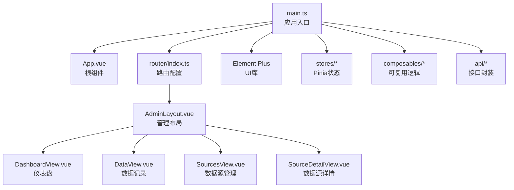
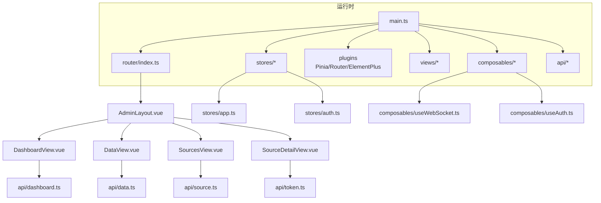
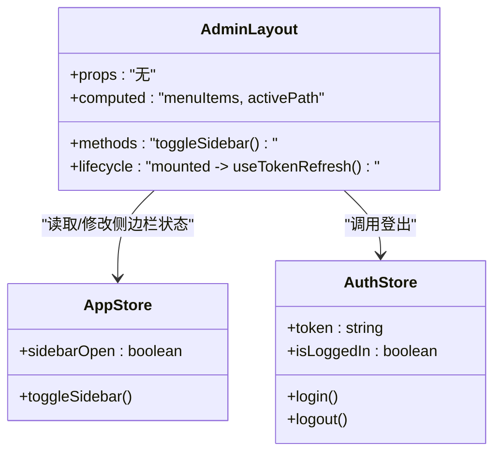
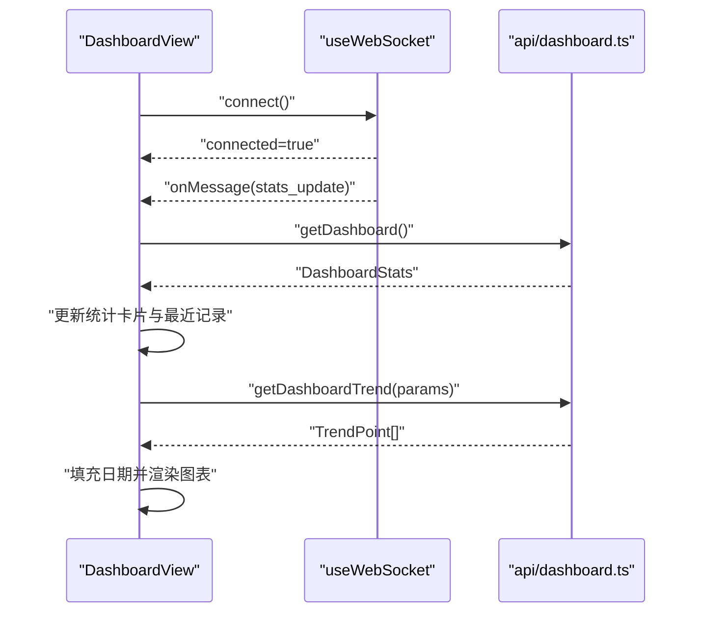
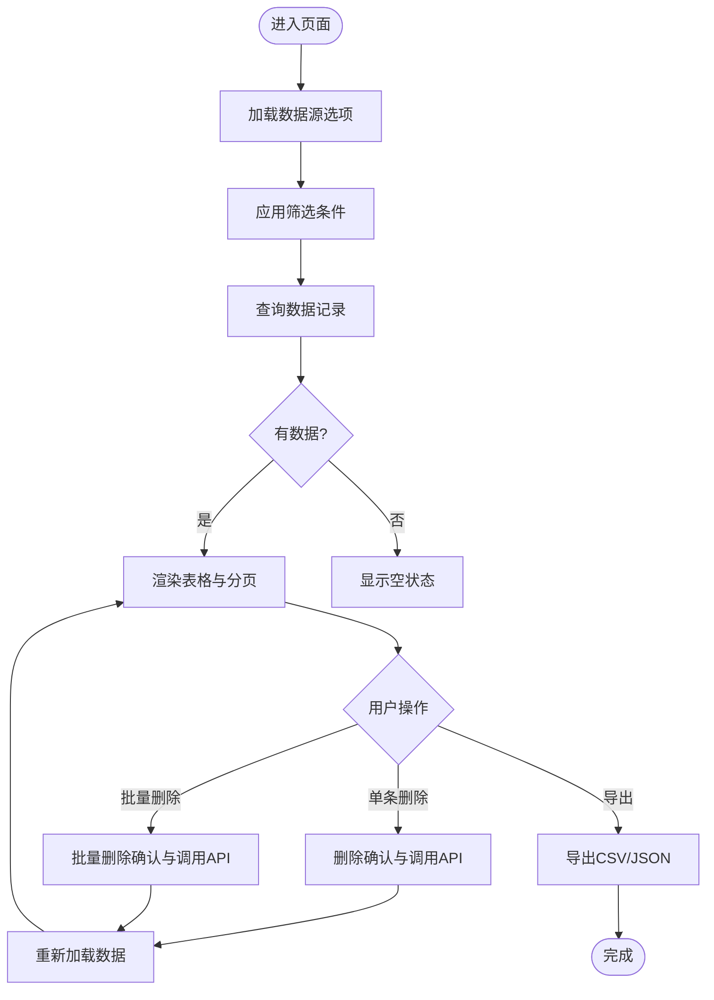
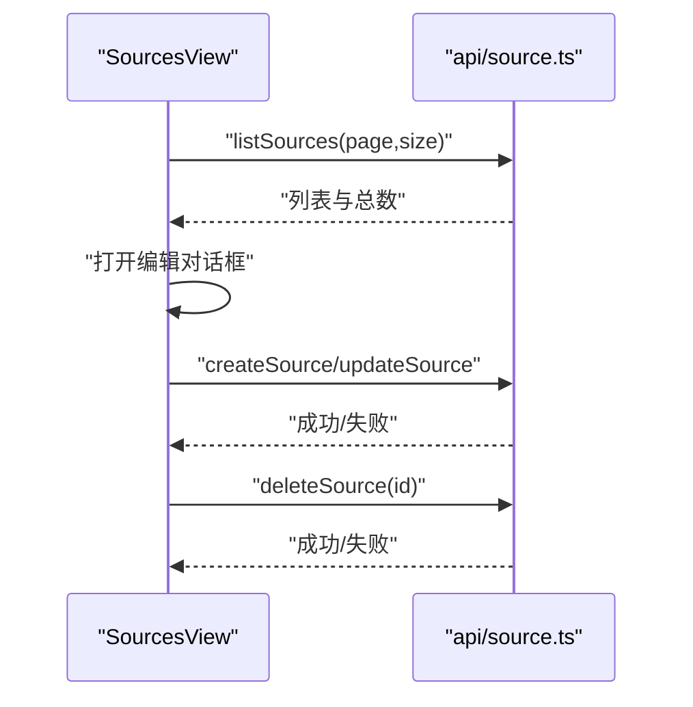
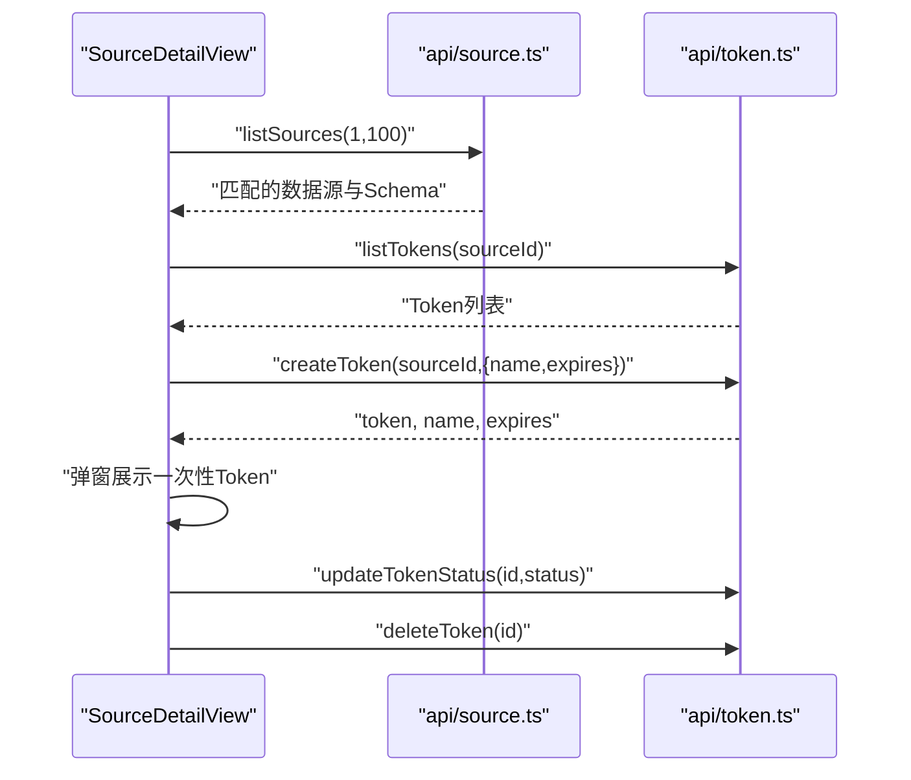
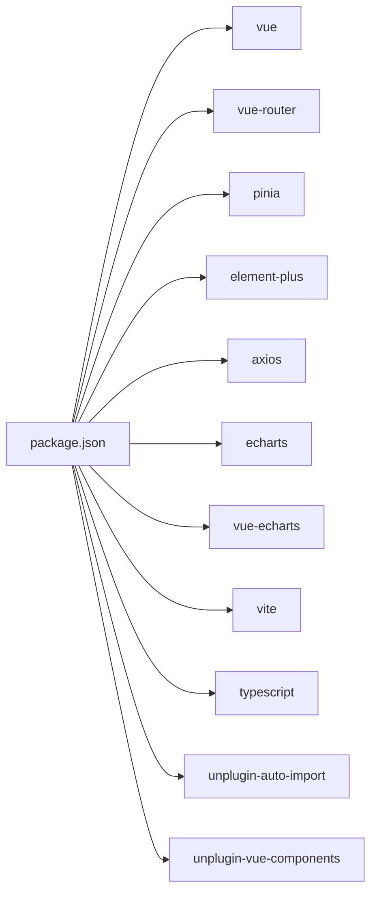

# 组件系统

<cite>
**本文引用的文件**
- [web/src/main.ts](file://web/src/main.ts)
- [web/src/App.vue](file://web/src/App.vue)
- [web/src/router/index.ts](file://web/src/router/index.ts)
- [web/src/layouts/AdminLayout.vue](file://web/src/layouts/AdminLayout.vue)
- [web/src/views/DashboardView.vue](file://web/src/views/DashboardView.vue)
- [web/src/views/DataView.vue](file://web/src/views/DataView.vue)
- [web/src/views/SourcesView.vue](file://web/src/views/SourcesView.vue)
- [web/src/views/SourceDetailView.vue](file://web/src/views/SourceDetailView.vue)
- [web/src/stores/app.ts](file://web/src/stores/app.ts)
- [web/src/stores/auth.ts](file://web/src/stores/auth.ts)
- [web/src/composables/useAuth.ts](file://web/src/composables/useAuth.ts)
- [web/src/composables/useWebSocket.ts](file://web/src/composables/useWebSocket.ts)
- [web/src/api/dashboard.ts](file://web/src/api/dashboard.ts)
- [web/package.json](file://web/package.json)
- [web/vite.config.ts](file://web/vite.config.ts)
</cite>

## 目录
1. [简介](#简介)
2. [项目结构](#项目结构)
3. [核心组件](#核心组件)
4. [架构总览](#架构总览)
5. [详细组件分析](#详细组件分析)
6. [依赖关系分析](#依赖关系分析)
7. [性能考量](#性能考量)
8. [故障排查指南](#故障排查指南)
9. [结论](#结论)
10. [附录](#附录)

## 简介
本文件面向DataCollector前端组件系统，围绕Vue.js 3与TypeScript构建的管理界面，系统性梳理组件设计模式、页面视图分类、可复用UI组件原则、组件间通信与数据流、自动导入与TypeScript集成、开发规范与命名约定、测试策略与调试技巧。目标是帮助开发者快速理解并高效扩展组件体系。

## 项目结构
前端位于web目录，采用Vite+Vue3+TypeScript技术栈，结合Pinia进行状态管理、Element Plus作为UI基础库、vue-router负责路由导航。核心入口在main.ts中初始化应用、挂载插件与路由；AdminLayout提供统一布局与菜单导航；各页面视图组件按功能划分在views目录下；状态通过stores集中管理；可复用逻辑封装在composables中；API层通过独立模块与请求工具解耦。

**图表来源**
- [web/src/main.ts:1-17](file://web/src/main.ts#L1-L17)
- [web/src/App.vue:1-4](file://web/src/App.vue#L1-L4)
- [web/src/router/index.ts:1-78](file://web/src/router/index.ts#L1-L78)
- [web/src/layouts/AdminLayout.vue:1-174](file://web/src/layouts/AdminLayout.vue#L1-L174)
- [web/src/views/DashboardView.vue:1-470](file://web/src/views/DashboardView.vue#L1-L470)
- [web/src/views/DataView.vue:1-327](file://web/src/views/DataView.vue#L1-L327)
- [web/src/views/SourcesView.vue:1-228](file://web/src/views/SourcesView.vue#L1-L228)
- [web/src/views/SourceDetailView.vue:1-388](file://web/src/views/SourceDetailView.vue#L1-L388)

**章节来源**
- [web/src/main.ts:1-17](file://web/src/main.ts#L1-L17)
- [web/src/router/index.ts:1-78](file://web/src/router/index.ts#L1-L78)

## 核心组件
- 应用入口与插件注册：在入口文件中完成Vue实例创建、Pinia、路由、Element Plus等插件注册，保证全局可用。
- 路由与导航：基于vue-router的history模式，支持登录拦截与权限控制；AdminLayout包裹子路由，形成统一侧边栏导航。
- 状态管理：Pinia Store集中管理应用状态（如侧边栏开关），认证状态（jwt_token）持久化于localStorage。
- 可复用逻辑：useAuth用于令牌刷新；useWebSocket封装WebSocket连接、断开、消息订阅与自动重连。
- 视图组件：DashboardView负责统计卡片、趋势图表、最近记录与WebSocket监控；DataView负责筛选、分页、批量操作与导出；SourcesView与SourceDetailView分别负责数据源列表、编辑与Token管理。

**章节来源**
- [web/src/main.ts:1-17](file://web/src/main.ts#L1-L17)
- [web/src/stores/app.ts:1-13](file://web/src/stores/app.ts#L1-L13)
- [web/src/stores/auth.ts:1-26](file://web/src/stores/auth.ts#L1-L26)
- [web/src/composables/useAuth.ts:1-37](file://web/src/composables/useAuth.ts#L1-L37)
- [web/src/composables/useWebSocket.ts:1-66](file://web/src/composables/useWebSocket.ts#L1-L66)

## 架构总览
整体采用“入口初始化 → 路由导航 → 布局容器 → 页面视图 → 状态与逻辑组合”的分层架构。页面视图通过API模块与后端交互，状态通过Store与可复用逻辑组合，UI组件来自Element Plus，图表使用vue-echarts与ECharts。

**图表来源**
- [web/src/main.ts:1-17](file://web/src/main.ts#L1-L17)
- [web/src/router/index.ts:1-78](file://web/src/router/index.ts#L1-L78)
- [web/src/layouts/AdminLayout.vue:1-174](file://web/src/layouts/AdminLayout.vue#L1-L174)
- [web/src/views/DashboardView.vue:1-470](file://web/src/views/DashboardView.vue#L1-L470)
- [web/src/views/DataView.vue:1-327](file://web/src/views/DataView.vue#L1-L327)
- [web/src/views/SourcesView.vue:1-228](file://web/src/views/SourcesView.vue#L1-L228)
- [web/src/views/SourceDetailView.vue:1-388](file://web/src/views/SourceDetailView.vue#L1-L388)
- [web/src/stores/app.ts:1-13](file://web/src/stores/app.ts#L1-L13)
- [web/src/stores/auth.ts:1-26](file://web/src/stores/auth.ts#L1-L26)
- [web/src/composables/useWebSocket.ts:1-66](file://web/src/composables/useWebSocket.ts#L1-L66)
- [web/src/composables/useAuth.ts:1-37](file://web/src/composables/useAuth.ts#L1-L37)
- [web/src/api/dashboard.ts:1-11](file://web/src/api/dashboard.ts#L1-L11)

## 详细组件分析

### 布局组件 AdminLayout
- 功能职责：提供侧边栏导航、顶部头部、主内容区域；根据路由高亮当前菜单；集成用户登出与侧边栏折叠切换。
- 关键特性：
  - 菜单项与图标映射，动态计算激活态。
  - 使用Pinia Store控制侧边栏展开状态。
  - 集成认证刷新钩子useTokenRefresh，保持会话活跃。
- 与路由配合：children路由嵌套在AdminLayout之下，实现统一布局下的多页面切换。

**图表来源**
- [web/src/layouts/AdminLayout.vue:43-63](file://web/src/layouts/AdminLayout.vue#L43-L63)
- [web/src/stores/app.ts:1-13](file://web/src/stores/app.ts#L1-L13)
- [web/src/stores/auth.ts:1-26](file://web/src/stores/auth.ts#L1-L26)

**章节来源**
- [web/src/layouts/AdminLayout.vue:1-174](file://web/src/layouts/AdminLayout.vue#L1-L174)
- [web/src/stores/app.ts:1-13](file://web/src/stores/app.ts#L1-L13)
- [web/src/stores/auth.ts:1-26](file://web/src/stores/auth.ts#L1-L26)

### 视图组件分类与用途

#### DashboardView 仪表盘
- 统计卡片：今日/本周/本月数据量与数据源总数。
- 实时监控：WebSocket连接状态与自动重连；收到stats_update事件后刷新统计。
- 趋势图表：基于ECharts绘制，支持时间范围选择、数据源与Token过滤，日期填充保证横轴连续。
- 最近记录：表格展示，支持跳转至数据页面。

**图表来源**
- [web/src/views/DashboardView.vue:122-366](file://web/src/views/DashboardView.vue#L122-L366)
- [web/src/composables/useWebSocket.ts:1-66](file://web/src/composables/useWebSocket.ts#L1-L66)
- [web/src/api/dashboard.ts:1-11](file://web/src/api/dashboard.ts#L1-L11)

**章节来源**
- [web/src/views/DashboardView.vue:1-470](file://web/src/views/DashboardView.vue#L1-L470)
- [web/src/api/dashboard.ts:1-11](file://web/src/api/dashboard.ts#L1-L11)

#### DataView 数据记录
- 筛选与分页：支持数据源、起止日期筛选，分页加载。
- 批量操作：全选、批量删除。
- 导出：支持CSV与JSON导出，下载处理。
- 表格列：ID、数据源、摘要、IP、User-Agent、创建时间；支持展开查看完整JSON。

**图表来源**
- [web/src/views/DataView.vue:91-243](file://web/src/views/DataView.vue#L91-L243)

**章节来源**
- [web/src/views/DataView.vue:1-327](file://web/src/views/DataView.vue#L1-L327)

#### SourcesView 数据源管理
- 列表：ID、名称、状态、Token数量、创建时间。
- 操作：查看详情、编辑、删除。
- 编辑对话框：名称、描述、Schema字段配置（增删字段、类型、是否必填）。
- 分页：支持页码切换。

**图表来源**
- [web/src/views/SourcesView.vue:83-188](file://web/src/views/SourcesView.vue#L83-L188)

**章节来源**
- [web/src/views/SourcesView.vue:1-228](file://web/src/views/SourcesView.vue#L1-L228)

#### SourceDetailView 数据源详情
- 数据源信息：名称、描述、状态、创建/更新时间、Schema字段展示。
- 调用示例：基于Schema生成curl示例，支持复制。
- Token管理：列表展示、启停、删除；生成新Token并弹窗提示一次性可见。
- 与父级联动：从路由参数解析数据源ID，加载对应数据。

**图表来源**
- [web/src/views/SourceDetailView.vue:130-299](file://web/src/views/SourceDetailView.vue#L130-L299)

**章节来源**
- [web/src/views/SourceDetailView.vue:1-388](file://web/src/views/SourceDetailView.vue#L1-L388)

### 可复用UI组件与设计原则
- 设计原则
  - 单一职责：每个组件聚焦一个功能域（如卡片、表格、对话框）。
  - 可组合性：通过Props接收数据，通过Events向外抛出动作。
  - 可复用性：尽量无状态或轻状态，通过外部Store/Props驱动。
  - 可访问性：提供必要的语义标签与键盘交互支持。
- 实现方式
  - 使用Element Plus提供的基础组件（ElCard、ElTable、ElDialog、ElPagination等）进行组合。
  - 在视图内以模板语法直接使用，避免过度封装导致复杂度上升。
  - 对复杂交互（如WebSocket、导出、筛选）抽象为composables，降低视图复杂度。

### 组件间通信与数据传递
- 路由级通信：通过路由参数（如数据源ID）在详情页与列表页之间传递数据。
- 父子组件通信：通过Props向下传递数据，通过Events向上传递用户操作。
- 兄弟组件通信：通过共享Store（如app.ts）或全局事件总线（本项目未显式使用）。
- 跨页面状态：通过Pinia Store集中管理（如侧边栏状态、认证状态）。
- 数据流方向：自上而下的Props与自下而上的Events为主，异步数据通过API模块统一拉取。

### 自动导入机制与TypeScript集成
- 自动导入
  - unplugin-auto-import：自动导入Vue API（ref、reactive、computed等）、Element Plus组件与图标。
  - unplugin-vue-components：自动注册Element Plus组件，无需手动import。
  - Vite别名@指向src，简化路径书写。
- TypeScript集成
  - 类型声明文件由vue-tsc生成，确保API返回值、Store状态、组件Props具备类型约束。
  - 组件统一使用<script setup lang="ts">，提升类型推导能力。

**章节来源**
- [web/vite.config.ts:1-36](file://web/vite.config.ts#L1-L36)
- [web/package.json:1-30](file://web/package.json#L1-L30)

## 依赖关系分析
- 运行时依赖：vue、vue-router、pinia、element-plus、axios、echarts、vue-echarts。
- 开发依赖：vite、@vitejs/plugin-vue、typescript、unplugin-auto-import、unplugin-vue-components、vue-tsc。
- 项目内依赖：各视图组件依赖API模块与utils；AdminLayout依赖stores与composables；路由依赖懒加载组件。

**图表来源**
- [web/package.json:11-28](file://web/package.json#L11-L28)

**章节来源**
- [web/package.json:1-30](file://web/package.json#L1-L30)

## 性能考量
- 路由懒加载：路由组件通过动态导入减少首屏体积。
- 图表优化：ECharts仅在需要时初始化必要模块，避免全量引入。
- 列表分页：后端分页与前端分页相结合，避免一次性加载大量数据。
- WebSocket：自动重连与连接状态管理，降低异常对用户体验的影响。
- 本地存储：认证令牌持久化于localStorage，减少重复登录成本。

## 故障排查指南
- 登录与鉴权
  - 检查路由守卫是否正确拦截未登录访问；确认localStorage中jwt_token存在且未过期。
  - 使用useTokenRefresh定时刷新逻辑，关注令牌剩余有效期阈值。
- WebSocket连接
  - 检查协议（http/https）与host拼接是否正确；确认服务端WebSocket端点可用。
  - 观察connected状态变化与自动重连行为。
- API请求
  - 统一通过API模块封装，检查请求参数与响应格式；关注错误拦截器处理。
- 导出与复制
  - 导出时确认数据为空时禁用导出按钮；复制到剪贴板需注意浏览器兼容性与权限。
- 调试技巧
  - 在视图组件中使用浏览器开发者工具观察组件树与状态变化。
  - 通过console输出关键流程（如筛选条件、请求参数、响应数据）。
  - 使用Vue DevTools查看Pinia状态与组件Props/Events。

**章节来源**
- [web/src/router/index.ts:65-75](file://web/src/router/index.ts#L65-L75)
- [web/src/composables/useAuth.ts:1-37](file://web/src/composables/useAuth.ts#L1-L37)
- [web/src/composables/useWebSocket.ts:1-66](file://web/src/composables/useWebSocket.ts#L1-L66)

## 结论
该组件系统以清晰的分层与职责划分实现了高内聚低耦合：入口与插件负责基础设施，路由与布局提供导航骨架，视图组件承载业务逻辑，Store与composables提供状态与可复用逻辑，API模块隔离后端交互。借助自动导入与TypeScript，开发效率与代码质量得到保障。建议后续持续完善单元测试与端到端测试，强化错误边界与可访问性。

## 附录

### 组件开发规范与命名约定
- 文件命名
  - 视图组件：View.vue（如DashboardView.vue）
  - 布局组件：Layout.vue（如AdminLayout.vue）
  - Store：小驼峰命名（如app.ts、auth.ts）
  - Composable：use前缀（如useAuth.ts、useWebSocket.ts）
  - API模块：按领域拆分（如auth.ts、source.ts、token.ts）
- 目录组织
  - views、layouts、stores、composables、api、utils、types、router、styles
- 命名约定
  - Props使用camelCase；事件使用kebab-case；常量使用UPPER_SNAKE_CASE
  - 组件内部状态使用ref/const/let明确可变性
- 样式
  - 优先使用scoped样式，避免全局污染
  - 使用Element Plus提供的主题变量与尺寸规范

### 组件测试策略与调试技巧
- 单元测试
  - 对composables进行纯函数测试（如useWebSocket的连接逻辑、useAuth的刷新逻辑）
  - 对API模块进行Mock测试，覆盖成功/失败分支
- 集成测试
  - 使用路由快照与组件挂载验证视图渲染与交互
  - 测试筛选、分页、导出等关键流程
- 调试技巧
  - 在关键函数中加入日志输出与断点
  - 使用浏览器Vue DevTools与Pinia DevTools辅助定位问题
  - 对异步流程使用Promise链路追踪