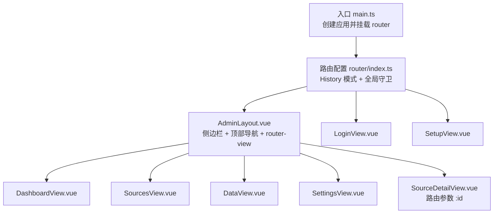
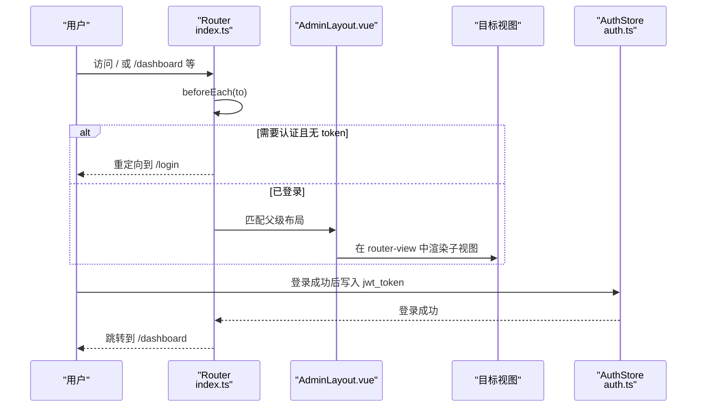
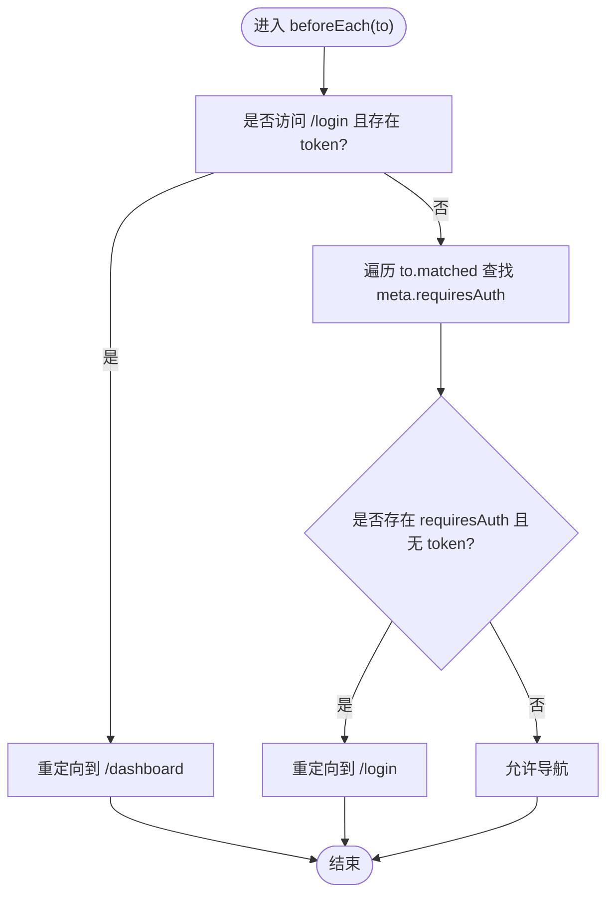
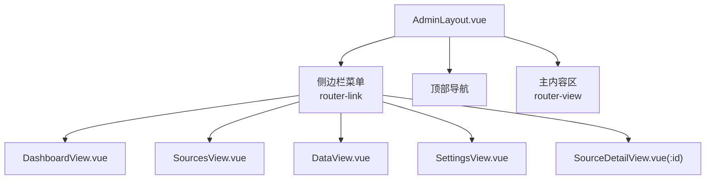
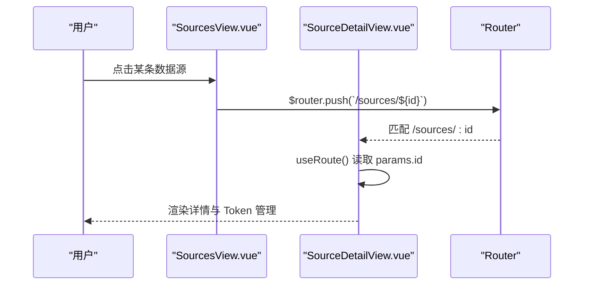
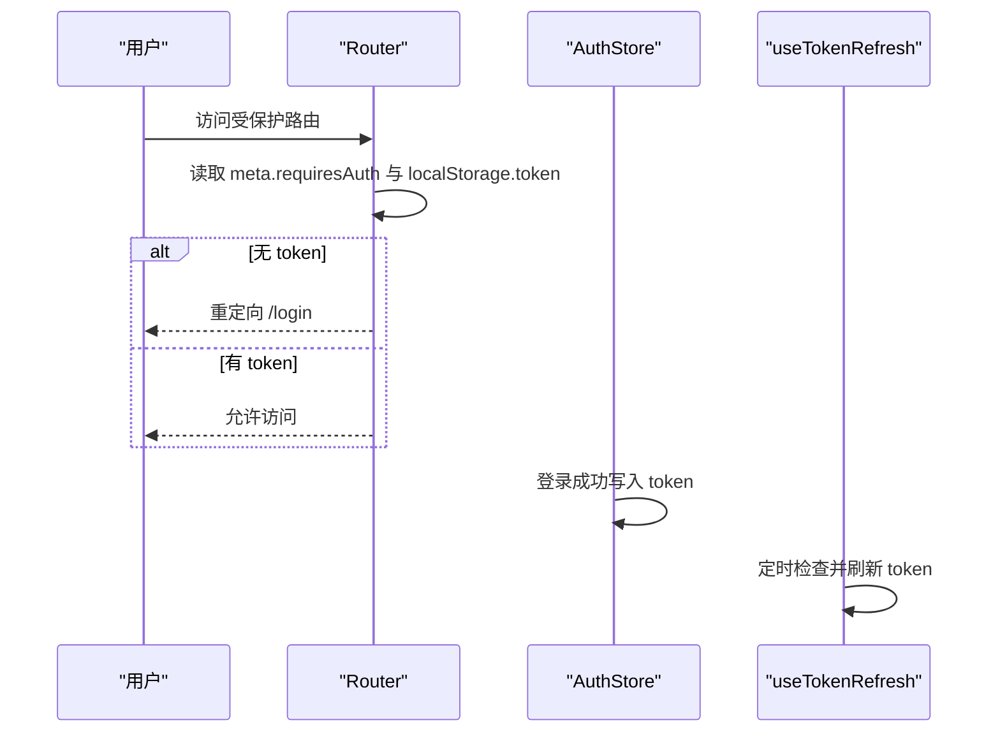
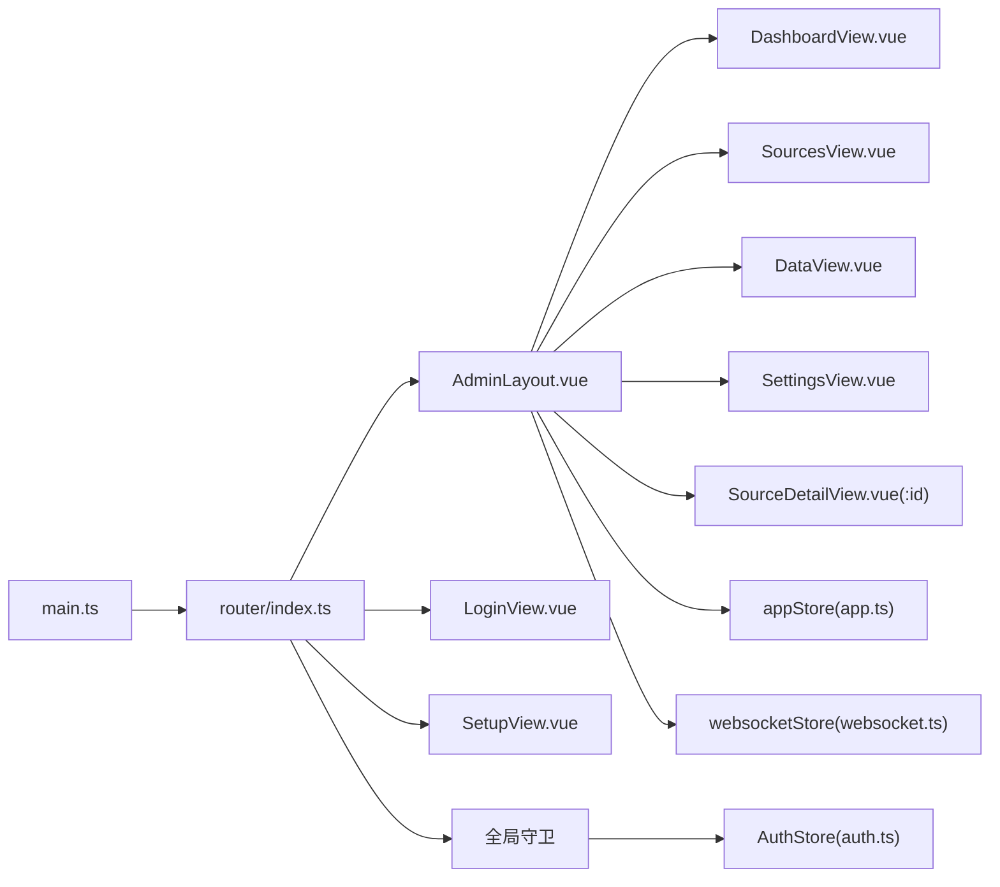

# 路由系统

<cite>
**本文引用的文件**
- [web/src/router/index.ts](file://web/src/router/index.ts)
- [web/src/main.ts](file://web/src/main.ts)
- [web/src/layouts/AdminLayout.vue](file://web/src/layouts/AdminLayout.vue)
- [web/src/views/DashboardView.vue](file://web/src/views/DashboardView.vue)
- [web/src/views/LoginView.vue](file://web/src/views/LoginView.vue)
- [web/src/views/SourcesView.vue](file://web/src/views/SourcesView.vue)
- [web/src/views/DataView.vue](file://web/src/views/DataView.vue)
- [web/src/views/SettingsView.vue](file://web/src/views/SettingsView.vue)
- [web/src/views/SourceDetailView.vue](file://web/src/views/SourceDetailView.vue)
- [web/src/views/SetupView.vue](file://web/src/views/SetupView.vue)
- [web/src/App.vue](file://web/src/App.vue)
- [web/src/stores/auth.ts](file://web/src/stores/auth.ts)
- [web/src/composables/useAuth.ts](file://web/src/composables/useAuth.ts)
- [web/src/stores/app.ts](file://web/src/stores/app.ts)
- [web/src/stores/websocket.ts](file://web/src/stores/websocket.ts)
</cite>

## 目录
1. [简介](#简介)
2. [项目结构](#项目结构)
3. [核心组件](#核心组件)
4. [架构总览](#架构总览)
5. [详细组件分析](#详细组件分析)
6. [依赖关系分析](#依赖关系分析)
7. [性能考量](#性能考量)
8. [故障排除指南](#故障排除指南)
9. [结论](#结论)

## 简介
本文件面向 DataCollector 前端路由系统，围绕 Vue Router 的配置与守卫、权限控制与导航拦截、布局与嵌套路由、参数传递与查询处理、懒加载与代码分割、元信息与页面标题管理、路由过渡与体验优化、以及调试与排障进行系统化说明。文档同时给出关键流程图与时序图，帮助读者快速理解路由在应用中的作用与实现方式。

## 项目结构
前端路由位于 web/src/router/index.ts，采用 History 模式，结合 AdminLayout 实现主框架与嵌套路由视图渲染；全局守卫负责鉴权拦截；各业务视图通过动态导入实现懒加载；Pinia 状态管理配合路由实现登录态与侧边栏状态等跨组件共享。

**图表来源**
- [web/src/main.ts:1-17](file://web/src/main.ts#L1-L17)
- [web/src/router/index.ts:1-78](file://web/src/router/index.ts#L1-L78)
- [web/src/layouts/AdminLayout.vue:1-255](file://web/src/layouts/AdminLayout.vue#L1-L255)

**章节来源**
- [web/src/main.ts:1-17](file://web/src/main.ts#L1-L17)
- [web/src/router/index.ts:1-78](file://web/src/router/index.ts#L1-L78)

## 核心组件
- 路由器实例与历史模式：使用 History 模式，支持浏览器前进后退与刷新。
- 全局前置守卫：基于 meta.requiresAuth 与本地 token 控制访问。
- 嵌套路由与布局：AdminLayout 作为父级容器，children 定义子路由视图。
- 动态导入与懒加载：视图组件通过箭头函数按需加载，实现代码分割。
- 参数与查询：通过路由参数 (:id) 与查询字符串传递数据。
- 元信息与权限：meta.requiresAuth 标记受保护路由。
- 页面标题：当前实现未显式设置页面标题，建议在路由或视图层统一管理。
- 过渡与体验：侧边栏折叠、WebSocket 状态提示、加载占位等提升交互体验。

**章节来源**
- [web/src/router/index.ts:1-78](file://web/src/router/index.ts#L1-L78)
- [web/src/layouts/AdminLayout.vue:1-255](file://web/src/layouts/AdminLayout.vue#L1-L255)

## 架构总览
下图展示从用户访问到视图渲染的关键路径，以及权限拦截与布局承载的关系。

**图表来源**
- [web/src/router/index.ts:65-75](file://web/src/router/index.ts#L65-L75)
- [web/src/stores/auth.ts:12-22](file://web/src/stores/auth.ts#L12-L22)
- [web/src/layouts/AdminLayout.vue:57](file://web/src/layouts/AdminLayout.vue#L57)

## 详细组件分析

### 路由配置与全局守卫
- 路由表结构：根路径 '/' 使用 AdminLayout 作为外壳，children 定义多个子路由；另有 '/login'、'/setup' 独立路由；通配符路由重定向至 /dashboard。
- 全局守卫逻辑：若访问 /login 且存在 token，则重定向到 /dashboard；若目标匹配到 meta.requiresAuth 且无 token，则重定向到 /login。
- 建议增强：对已登录用户访问 /login 的行为可改为直接跳转 /dashboard；对未匹配路由可考虑更明确的错误页或面包屑。

**图表来源**
- [web/src/router/index.ts:65-75](file://web/src/router/index.ts#L65-L75)

**章节来源**
- [web/src/router/index.ts:6-62](file://web/src/router/index.ts#L6-L62)
- [web/src/router/index.ts:65-75](file://web/src/router/index.ts#L65-L75)

### 布局组件与嵌套路由
- AdminLayout 作为父级容器，内部包含侧边栏菜单、顶部导航与主内容区；通过 <router-view /> 渲染 children 子路由视图。
- 侧边栏菜单项与路由 path 对应，激活态根据当前路由路径判断；支持折叠与展开。
- 顶部区域包含欢迎语与登出按钮，登出时清空 token 并跳转 /login。

**图表来源**
- [web/src/layouts/AdminLayout.vue:10-58](file://web/src/layouts/AdminLayout.vue#L10-L58)
- [web/src/router/index.ts:18-56](file://web/src/router/index.ts#L18-L56)

**章节来源**
- [web/src/layouts/AdminLayout.vue:1-255](file://web/src/layouts/AdminLayout.vue#L1-L255)
- [web/src/router/index.ts:18-56](file://web/src/router/index.ts#L18-L56)

### 视图组件与参数传递
- DashboardView：统计卡片、趋势图表、最近记录，使用 WebSocket 推送实时更新。
- SourcesView：数据源列表，支持分页、筛选、创建/编辑/删除；点击行跳转到 SourceDetailView。
- SourceDetailView：通过路由参数 :id 获取数据源详情，展示 Schema 配置与 Token 管理，并提供 curl 示例复制。
- DataView：数据记录查询、筛选、导出、批量删除；支持展开查看完整 JSON。
- SettingsView：系统健康信息与危险操作（重新初始化），触发后登出并返回登录页。
- SetupView：系统初始化向导，三步配置数据库与管理员账户，完成后跳转 /login。

**图表来源**
- [web/src/views/SourcesView.vue:25](file://web/src/views/SourcesView.vue#L25)
- [web/src/views/SourceDetailView.vue:142-143](file://web/src/views/SourceDetailView.vue#L142-L143)
- [web/src/router/index.ts:37-40](file://web/src/router/index.ts#L37-L40)

**章节来源**
- [web/src/views/DashboardView.vue:1-416](file://web/src/views/DashboardView.vue#L1-L416)
- [web/src/views/SourcesView.vue:1-239](file://web/src/views/SourcesView.vue#L1-L239)
- [web/src/views/SourceDetailView.vue:1-388](file://web/src/views/SourceDetailView.vue#L1-L388)
- [web/src/views/DataView.vue:1-327](file://web/src/views/DataView.vue#L1-L327)
- [web/src/views/SettingsView.vue:1-195](file://web/src/views/SettingsView.vue#L1-L195)
- [web/src/views/SetupView.vue:1-272](file://web/src/views/SetupView.vue#L1-L272)

### 权限控制与导航拦截
- 登录态：通过 localStorage 中的 jwt_token 判断是否已登录。
- 受保护路由：AdminLayout 设置 meta.requiresAuth，全局守卫拦截未授权访问。
- 登出：AuthStore 清除 token 并跳转 /login。
- Token 自动续期：useTokenRefresh 每隔一段时间检查 token 剩余有效期并尝试刷新。

**图表来源**
- [web/src/router/index.ts:65-75](file://web/src/router/index.ts#L65-L75)
- [web/src/stores/auth.ts:12-22](file://web/src/stores/auth.ts#L12-L22)
- [web/src/composables/useAuth.ts:7-24](file://web/src/composables/useAuth.ts#L7-L24)

**章节来源**
- [web/src/stores/auth.ts:1-26](file://web/src/stores/auth.ts#L1-L26)
- [web/src/composables/useAuth.ts:1-37](file://web/src/composables/useAuth.ts#L1-L37)

### 路由懒加载与代码分割
- 所有子视图均通过动态导入实现懒加载，减少首屏体积与初次渲染时间。
- AdminLayout 与 LoginView、SetupView 同样采用动态导入，保持一致的加载策略。

**章节来源**
- [web/src/router/index.ts:10](file://web/src/router/index.ts#L10)
- [web/src/router/index.ts:15](file://web/src/router/index.ts#L15)
- [web/src/router/index.ts:29](file://web/src/router/index.ts#L29)
- [web/src/router/index.ts:34](file://web/src/router/index.ts#L34)
- [web/src/router/index.ts:44](file://web/src/router/index.ts#L44)
- [web/src/router/index.ts:49](file://web/src/router/index.ts#L49)
- [web/src/router/index.ts:54](file://web/src/router/index.ts#L54)

### 元信息与页面标题管理
- 元信息：AdminLayout.meta.requiresAuth 标记受保护路由。
- 页面标题：当前实现未见显式设置页面标题的逻辑，建议在路由层或视图层统一注入标题，便于 SEO 与标签页识别。

**章节来源**
- [web/src/router/index.ts:20](file://web/src/router/index.ts#L20)

### 路由过渡动画与用户体验优化
- 侧边栏折叠：通过 Pinia 状态 appStore.sidebarOpen 控制宽度与图标变化，提供流畅切换。
- WebSocket 状态：侧边栏底部显示连接状态与重连按钮，连接断开自动重连。
- 加载占位：多处视图使用 v-loading 展示加载状态，避免空白闪烁。
- 导航高亮：侧边栏菜单根据当前路由路径高亮，提升导航感知。

**章节来源**
- [web/src/stores/app.ts:1-13](file://web/src/stores/app.ts#L1-L13)
- [web/src/stores/websocket.ts:1-84](file://web/src/stores/websocket.ts#L1-L84)
- [web/src/layouts/AdminLayout.vue:46-58](file://web/src/layouts/AdminLayout.vue#L46-L58)

## 依赖关系分析
- 路由依赖：main.ts 注册 router；router/index.ts 定义路由与守卫；AdminLayout.vue 承载子视图。
- 权限依赖：AuthStore 提供登录/登出能力；useTokenRefresh 提供 token 续期；全局守卫读取 localStorage。
- 状态依赖：appStore 控制侧边栏；websocketStore 管理 WebSocket 连接与消息订阅。

**图表来源**
- [web/src/main.ts:6](file://web/src/main.ts#L6)
- [web/src/router/index.ts:1-78](file://web/src/router/index.ts#L1-L78)
- [web/src/layouts/AdminLayout.vue:63-75](file://web/src/layouts/AdminLayout.vue#L63-L75)
- [web/src/stores/auth.ts:1-26](file://web/src/stores/auth.ts#L1-L26)
- [web/src/stores/app.ts:1-13](file://web/src/stores/app.ts#L1-L13)
- [web/src/stores/websocket.ts:1-84](file://web/src/stores/websocket.ts#L1-L84)

**章节来源**
- [web/src/main.ts:1-17](file://web/src/main.ts#L1-L17)
- [web/src/router/index.ts:1-78](file://web/src/router/index.ts#L1-L78)

## 性能考量
- 代码分割：所有视图采用动态导入，降低首屏 JS 体积，提升 TTI。
- 路由守卫：仅在必要时执行重定向，避免不必要的导航。
- 视图内优化：大量使用 v-loading 与条件渲染，减少无效 DOM 更新。
- WebSocket：断线重连与消息订阅集中管理，避免内存泄漏。

[本节为通用指导，无需特定文件引用]

## 故障排除指南
- 无法访问受保护页面
  - 检查 localStorage 是否存在 jwt_token；若无则先登录。
  - 确认目标路由是否设置 meta.requiresAuth。
- 登录后仍被重定向到 /login
  - 确认登录成功后是否正确写入 token 并跳转 /dashboard。
- 侧边栏不响应折叠
  - 检查 appStore.sidebarOpen 状态与事件绑定。
- WebSocket 不显示连接状态
  - 检查 token 是否有效；确认 ws 地址拼接与协议（http/https）。
- 页面标题未更新
  - 当前未实现标题管理，建议在路由层或视图层增加标题设置逻辑。

**章节来源**
- [web/src/router/index.ts:65-75](file://web/src/router/index.ts#L65-L75)
- [web/src/stores/auth.ts:12-22](file://web/src/stores/auth.ts#L12-L22)
- [web/src/stores/app.ts:4-12](file://web/src/stores/app.ts#L4-L12)
- [web/src/stores/websocket.ts:10-14](file://web/src/stores/websocket.ts#L10-L14)

## 结论
DataCollector 的路由系统以 Vue Router 为核心，结合 Pinia 状态管理与动态导入，实现了清晰的权限控制、良好的用户体验与可维护的代码结构。建议后续补充页面标题管理与更完善的未匹配路由处理，以进一步完善路由体系。