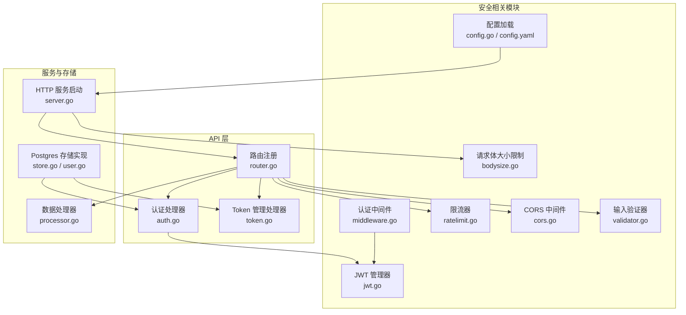
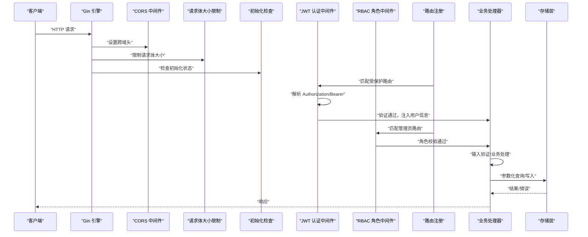
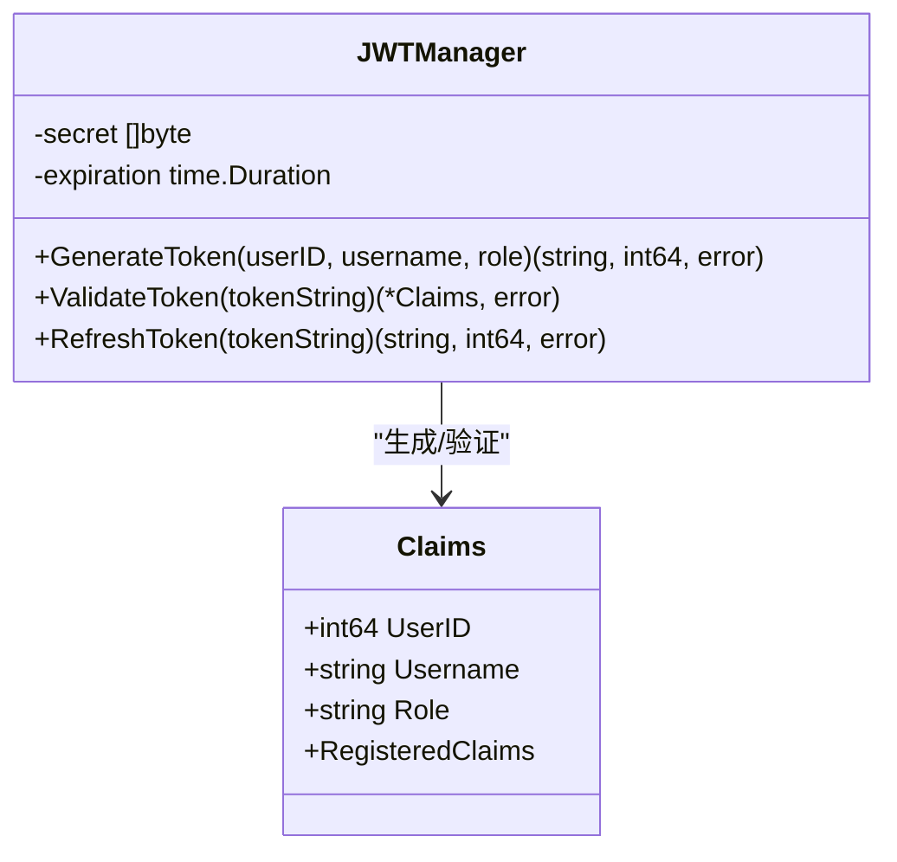
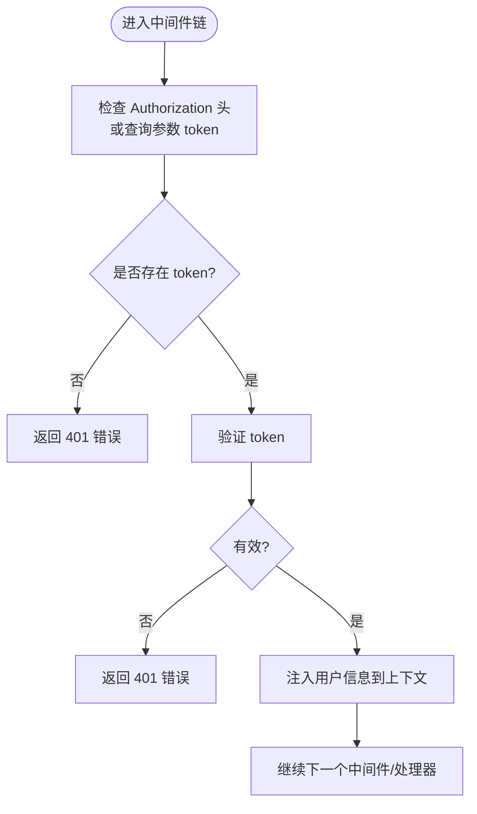
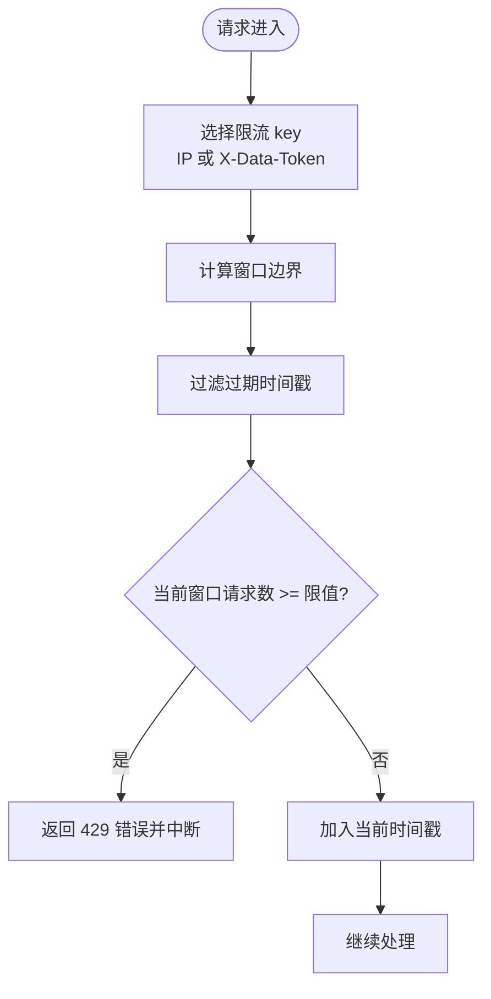
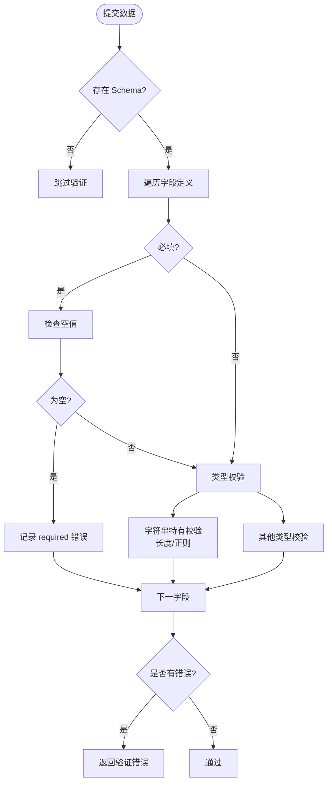
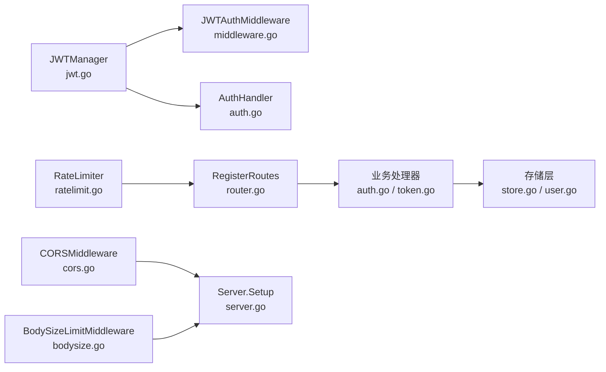

# 安全考虑

<cite>
**本文引用的文件**
- [jwt.go](file://internal/auth/jwt.go)
- [middleware.go](file://internal/auth/middleware.go)
- [ratelimit.go](file://internal/middleware/ratelimit.go)
- [cors.go](file://internal/middleware/cors.go)
- [validator.go](file://internal/collector/validator.go)
- [auth.go](file://internal/api/auth.go)
- [token.go](file://internal/api/token.go)
- [router.go](file://internal/api/router.go)
- [config.yaml](file://configs/config.yaml)
- [config.go](file://internal/config/config.go)
- [server.go](file://internal/server/server.go)
- [errors.go](file://internal/model/errors.go)
- [bodysize.go](file://internal/middleware/bodysize.go)
- [user.go](file://internal/storage/postgres/user.go)
- [store.go](file://internal/storage/postgres/store.go)
- [processor.go](file://internal/collector/processor.go)
</cite>

## 目录
1. [简介](#简介)
2. [项目结构与安全相关模块](#项目结构与安全相关模块)
3. [核心安全组件](#核心安全组件)
4. [架构总览](#架构总览)
5. [组件深度分析](#组件深度分析)
6. [依赖关系分析](#依赖关系分析)
7. [性能与安全权衡](#性能与安全权衡)
8. [故障排查指南](#故障排查指南)
9. [结论](#结论)
10. [附录](#附录)

## 简介
本文件聚焦于 DataCollector 的安全机制，围绕以下主题展开：JWT 认证与授权、数据验证与输入过滤、SQL 注入防护、限流策略、CORS 跨域控制、密码加密与存储、XSS/CSRF 防护建议、API 安全最佳实践、安全审计与监控、以及安全配置检查清单与漏洞扫描指南。内容基于仓库中的实际实现进行梳理，并提供可操作的改进建议。

## 项目结构与安全相关模块
- 认证与授权：JWT 管理器、认证中间件、RBAC 角色中间件、初始化状态检查中间件
- 限流：滑动窗口限流器，支持按 IP 与按 Data Token 两种维度
- CORS：可配置的跨域中间件，支持通配符与白名单模式
- 输入验证：数据采集阶段的字段类型、长度、格式校验
- 请求体大小限制：防止超大请求导致资源耗尽
- 配置：统一从 YAML 与环境变量加载，包含 JWT 密钥、过期时间、限流阈值、CORS 允许来源等
- 存储层：PostgreSQL/SQLite 实现，使用参数化查询与连接池

图表来源
- [jwt.go:1-114](file://internal/auth/jwt.go#L1-L114)
- [middleware.go:1-148](file://internal/auth/middleware.go#L1-L148)
- [ratelimit.go:1-137](file://internal/middleware/ratelimit.go#L1-L137)
- [cors.go:1-51](file://internal/middleware/cors.go#L1-L51)
- [validator.go:1-222](file://internal/collector/validator.go#L1-L222)
- [auth.go:1-147](file://internal/api/auth.go#L1-L147)
- [token.go:1-180](file://internal/api/token.go#L1-L180)
- [router.go:1-116](file://internal/api/router.go#L1-L116)
- [config.go:1-215](file://internal/config/config.go#L1-L215)
- [config.yaml:1-41](file://configs/config.yaml#L1-L41)
- [server.go:47-138](file://internal/server/server.go#L47-L138)
- [store.go:1-61](file://internal/storage/postgres/store.go#L1-L61)
- [user.go:1-110](file://internal/storage/postgres/user.go#L1-L110)
- [processor.go:1-84](file://internal/collector/processor.go#L1-L84)

章节来源
- [router.go:1-116](file://internal/api/router.go#L1-L116)
- [server.go:47-138](file://internal/server/server.go#L47-L138)
- [config.go:1-215](file://internal/config/config.go#L1-L215)
- [config.yaml:1-41](file://configs/config.yaml#L1-L41)

## 核心安全组件
- JWT 认证与刷新：签发、验证、过期控制、刷新窗口限制
- RBAC 授权：基于角色的访问控制，管理员专用路由
- 初始化状态保护：未初始化时对管理页面与 API 的保护逻辑
- 限流：滑动窗口算法，按 IP 与按 Data Token 双通道限流
- CORS：可配置允许来源，严格设置允许的方法与头部
- 输入验证：字段必填、类型、长度、正则、格式（邮箱、URL、日期、时间）等
- 请求体大小限制：防止滥用与资源耗尽
- 存储层安全：参数化查询、连接池、最小权限

章节来源
- [jwt.go:1-114](file://internal/auth/jwt.go#L1-L114)
- [middleware.go:1-148](file://internal/auth/middleware.go#L1-L148)
- [ratelimit.go:1-137](file://internal/middleware/ratelimit.go#L1-L137)
- [cors.go:1-51](file://internal/middleware/cors.go#L1-L51)
- [validator.go:1-222](file://internal/collector/validator.go#L1-L222)
- [bodysize.go:1-40](file://internal/middleware/bodysize.go#L1-L40)
- [store.go:1-61](file://internal/storage/postgres/store.go#L1-L61)

## 架构总览
下图展示从客户端到服务端的关键安全交互路径，包括认证、授权、限流、CORS、输入验证与存储访问。

图表来源
- [server.go:54-87](file://internal/server/server.go#L54-L87)
- [router.go:14-116](file://internal/api/router.go#L14-L116)
- [middleware.go:11-63](file://internal/auth/middleware.go#L11-L63)
- [cors.go:9-51](file://internal/middleware/cors.go#L9-L51)
- [bodysize.go:10-40](file://internal/middleware/bodysize.go#L10-L40)
- [validator.go:19-84](file://internal/collector/validator.go#L19-L84)
- [store.go:19-34](file://internal/storage/postgres/store.go#L19-L34)

## 组件深度分析

### JWT 认证系统
- 签名与算法：使用 HMAC-SHA256，密钥来自配置；验证阶段强制校验签名算法
- 声明结构：包含用户标识、用户名、角色及标准声明（过期、签发、生效时间）
- 令牌生成：根据配置的过期时间生成 token，并返回剩余秒数
- 令牌验证：解析并校验签名、过期时间；过期与无效分别返回不同错误码
- 刷新策略：仅在剩余有效期小于阈值时允许刷新，防止长期续期造成风险扩大
- 密码处理：bcrypt 加密，成本因子合理；密码校验采用常量时间比较

图表来源
- [jwt.go:19-114](file://internal/auth/jwt.go#L19-L114)

章节来源
- [jwt.go:1-114](file://internal/auth/jwt.go#L1-L114)
- [auth.go:38-126](file://internal/api/auth.go#L38-L126)

### 认证中间件与 RBAC
- 认证中间件：优先从 Authorization 头解析 Bearer token，否则尝试 URL 查询参数 token（兼容 WebSocket）
- 未携带或无效 token：返回相应错误码并中断请求
- 成功后将用户信息注入上下文，供后续中间件与处理器使用
- RBAC 角色中间件：从上下文读取角色，判断是否在允许列表内
- 初始化检查中间件：未初始化时放行 /setup 与静态资源，API 返回 JSON 错误，页面重定向至 /setup

图表来源
- [middleware.go:11-63](file://internal/auth/middleware.go#L11-L63)

章节来源
- [middleware.go:1-148](file://internal/auth/middleware.go#L1-L148)

### 限流策略
- 算法：滑动窗口（每分钟），内存维护每个 key 的时间戳列表
- 清理：定期 goroutine 清理过期记录，避免内存无限增长
- 限流维度：
  - 按 IP：基于 ClientIP 的滑动窗口
  - 按 Data Token：从 X-Data-Token 头提取 token 作为 key
- 触发：超过阈值返回限流错误码并中断请求

图表来源
- [ratelimit.go:12-137](file://internal/middleware/ratelimit.go#L12-L137)

章节来源
- [ratelimit.go:1-137](file://internal/middleware/ratelimit.go#L1-L137)
- [router.go:47-55](file://internal/api/router.go#L47-L55)

### CORS 安全配置
- 支持通配符 "*" 或白名单模式
- 设置允许的方法与头部，包含 Authorization 与 X-Data-Token
- 对预检请求 OPTIONS 直接返回，减少不必要的处理
- 建议生产环境关闭通配符，明确列出可信域名

章节来源
- [cors.go:1-51](file://internal/middleware/cors.go#L1-L51)
- [server.go:65-67](file://internal/server/server.go#L65-L67)
- [config.yaml:31-32](file://configs/config.yaml#L31-L32)

### 输入验证与 SQL 注入防护
- 数据采集阶段的字段验证：必填、类型、长度、正则、格式（邮箱、URL、日期、时间、整数、浮点）
- 存储层使用参数化查询与连接池，避免直接拼接 SQL
- PostgreSQL 使用标准库的参数占位符，SQLite 使用对应占位符，确保注入防护

图表来源
- [validator.go:19-84](file://internal/collector/validator.go#L19-L84)

章节来源
- [validator.go:1-222](file://internal/collector/validator.go#L1-L222)
- [user.go:11-33](file://internal/storage/postgres/user.go#L11-L33)
- [sqlite token.go:11-34](file://internal/storage/sqlite/token.go#L11-L34)

### 请求体大小限制与错误处理
- 使用 MaxBytesReader 限制请求体大小，防止超大请求导致内存压力
- 在错误处理中识别“请求体过大”错误并返回标准化错误码

章节来源
- [bodysize.go:10-40](file://internal/middleware/bodysize.go#L10-L40)

### 密码加密与存储安全
- 登录时使用 bcrypt 对密码进行哈希存储，成本因子合理
- 用户查询与更新均通过参数化查询，避免注入风险
- 建议：生产环境使用强随机密钥替换默认 JWT Secret，启用 TLS 并配置证书

章节来源
- [jwt.go:103-113](file://internal/auth/jwt.go#L103-L113)
- [user.go:11-33](file://internal/storage/postgres/user.go#L11-L33)
- [config.yaml:23-25](file://configs/config.yaml#L23-L25)

### XSS 与 CSRF 防护建议
- XSS：后端不渲染不受信任输入；前端框架需启用内容安全策略（CSP），避免内联脚本与动态 eval
- CSRF：当前未见专用 CSRF 中间件；建议在管理端启用 SameSite Cookie、CSRF Token 校验，并对敏感操作使用双重提交或同步头校验
- 当前实现中，管理端 API 使用 JWT Bearer 认证，具备一定抗 CSRF 能力，但建议结合前端 CSP 与 Cookie 属性进一步加固

[本节为通用安全建议，不直接分析具体文件]

### API 安全最佳实践
- 路由分组与中间件组合：健康检查、初始化测试、数据采集、管理后台、重新初始化等分组清晰
- 管理后台路由统一使用 JWT 认证与 RBAC 角色中间件
- 数据采集路由同时应用 IP 限流与 Token 限流
- 未初始化状态下的路由保护与错误提示

章节来源
- [router.go:14-116](file://internal/api/router.go#L14-L116)

### 安全审计与监控建议
- 审计日志：记录登录、Token 创建/更新/删除、数据导入/导出、敏感操作等
- 监控指标：请求量、错误率、慢请求、限流触发次数、认证失败次数
- 告警：针对异常峰值、频繁限流、认证失败激增等设置阈值告警
- 日志脱敏：避免输出明文 token、密码哈希、完整请求体

[本节为通用安全建议，不直接分析具体文件]

## 依赖关系分析
- JWT 管理器被认证中间件与认证处理器依赖
- 路由注册集中挂载认证、限流、CORS、大小限制等中间件
- 存储层通过参数化查询与连接池降低注入风险
- 配置模块负责从 YAML 与环境变量加载安全相关参数

图表来源
- [jwt.go:1-114](file://internal/auth/jwt.go#L1-L114)
- [middleware.go:1-148](file://internal/auth/middleware.go#L1-L148)
- [ratelimit.go:1-137](file://internal/middleware/ratelimit.go#L1-L137)
- [cors.go:1-51](file://internal/middleware/cors.go#L1-L51)
- [router.go:1-116](file://internal/api/router.go#L1-L116)
- [server.go:54-87](file://internal/server/server.go#L54-L87)
- [store.go:1-61](file://internal/storage/postgres/store.go#L1-L61)

章节来源
- [router.go:1-116](file://internal/api/router.go#L1-L116)
- [server.go:54-87](file://internal/server/server.go#L54-L87)
- [config.go:148-195](file://internal/config/config.go#L148-L195)

## 性能与安全权衡
- 限流：滑动窗口算法简单高效，但内存占用与清理频率需平衡；建议结合外部缓存（如 Redis）实现分布式限流
- 请求体限制：过小影响功能，过大增加资源消耗；建议根据业务场景调整阈值
- CORS：通配符会放宽安全边界，建议生产环境改为精确域名白名单
- JWT：短周期可降低泄露影响面，但增加刷新频率；建议结合刷新阈值与双因子等手段提升整体安全

[本节为通用指导，不直接分析具体文件]

## 故障排查指南
- 认证失败
  - 检查 Authorization 头格式是否为 Bearer
  - 确认 token 未过期，必要时使用刷新接口
  - 核对 JWT Secret 是否正确
- 权限不足
  - 确认用户角色是否满足 RBAC 要求
- 请求被限流
  - 检查 IP 与 X-Data-Token 是否达到阈值
  - 调整配置中的限流阈值或使用更宽松的限流策略
- CORS 失败
  - 确认请求 Origin 是否在允许列表
  - 生产环境避免使用通配符
- 请求体过大
  - 检查客户端请求体大小是否超过配置阈值
- 登录失败
  - 核对用户名与密码，确认用户状态正常

章节来源
- [errors.go:1-84](file://internal/model/errors.go#L1-L84)
- [middleware.go:11-63](file://internal/auth/middleware.go#L11-L63)
- [ratelimit.go:100-137](file://internal/middleware/ratelimit.go#L100-L137)
- [cors.go:9-51](file://internal/middleware/cors.go#L9-L51)
- [bodysize.go:20-40](file://internal/middleware/bodysize.go#L20-L40)
- [auth.go:38-77](file://internal/api/auth.go#L38-L77)

## 结论
DataCollector 的安全体系以 JWT 认证为核心，辅以 RBAC、限流、CORS、输入验证与请求体限制，形成多层防护。建议在生产环境中强化 CORS 白名单、启用 TLS、加强密钥管理、引入分布式限流与审计监控，并完善前端 CSP 与 CSRF 防护，以进一步提升整体安全性与合规性。

## 附录

### 安全配置检查清单
- [ ] JWT Secret 替换为强随机值，避免使用默认值
- [ ] 启用 TLS 并配置有效证书
- [ ] CORS 允许来源从通配符改为精确域名白名单
- [ ] 调整限流阈值以适配生产流量
- [ ] 启用请求体大小限制并设置合理阈值
- [ ] 确保所有数据库操作使用参数化查询
- [ ] 部署日志脱敏与访问审计
- [ ] 对敏感操作启用 CSRF 保护与前端 CSP

### 漏洞扫描指南
- 依赖扫描：定期扫描 Go 依赖版本，修复已知高危漏洞
- 配置扫描：检查配置文件与环境变量，确保敏感项未硬编码
- 渗透测试：对认证、授权、CORS、限流等关键路径进行渗透测试
- 代码审计：重点检查输入验证、错误处理、日志输出与敏感信息暴露