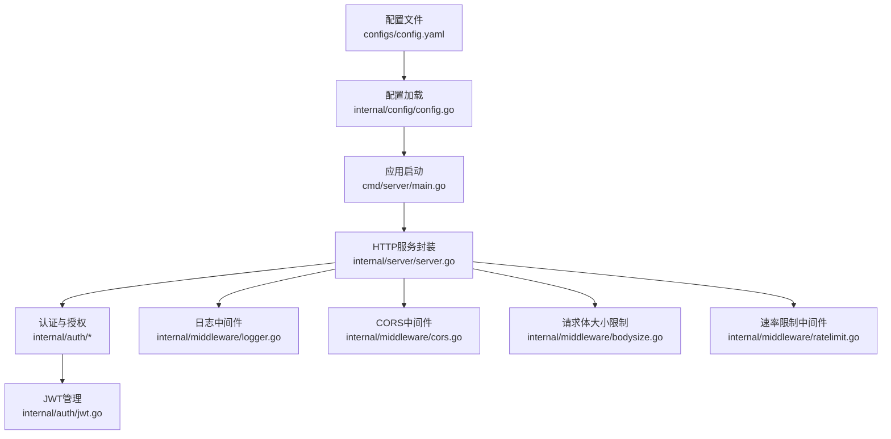
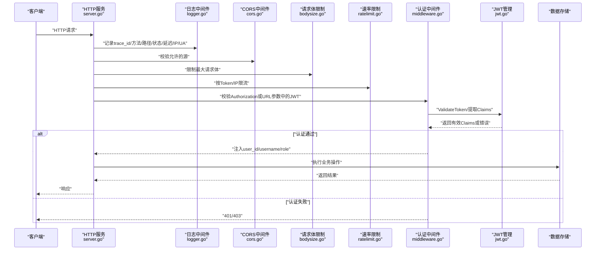
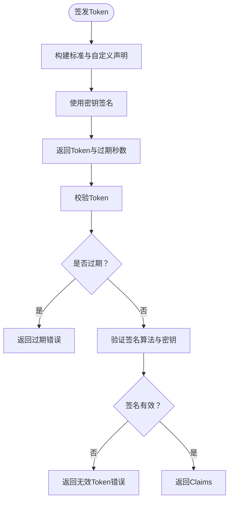
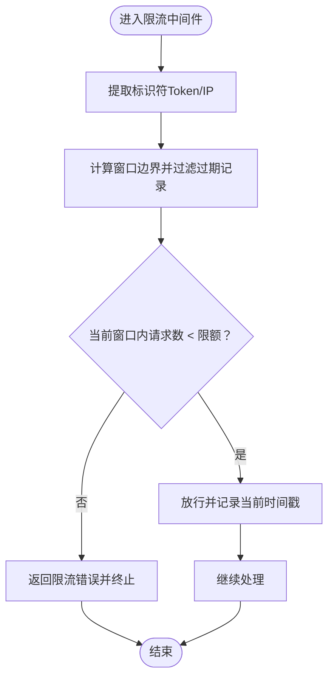
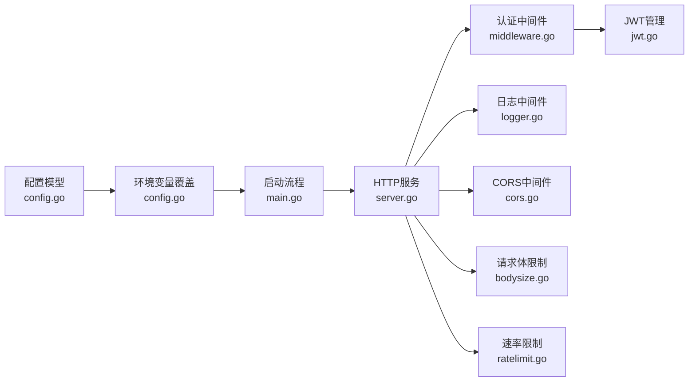

# 安全配置

<cite>
**本文引用的文件**
- [config.yaml](file://configs/config.yaml)
- [config.go](file://internal/config/config.go)
- [jwt.go](file://internal/auth/jwt.go)
- [middleware.go](file://internal/auth/middleware.go)
- [logger.go](file://internal/middleware/logger.go)
- [cors.go](file://internal/middleware/cors.go)
- [ratelimit.go](file://internal/middleware/ratelimit.go)
- [bodysize.go](file://internal/middleware/bodysize.go)
- [server.go](file://internal/server/server.go)
- [main.go](file://cmd/server/main.go)
- [docker-compose.yml](file://docker-compose.yml)
- [Dockerfile](file://Dockerfile)
- [.gitignore](file://.gitignore)
</cite>

## 目录
1. [简介](#简介)
2. [项目结构](#项目结构)
3. [核心组件](#核心组件)
4. [架构总览](#架构总览)
5. [详细组件分析](#详细组件分析)
6. [依赖分析](#依赖分析)
7. [性能考虑](#性能考虑)
8. [故障排查指南](#故障排查指南)
9. [结论](#结论)
10. [附录](#附录)

## 简介
本文件面向DataCollector系统的安全配置，围绕以下主题展开：
- 配置文件中的安全相关参数：JWT密钥与过期时间、数据库连接安全、HTTPS与证书、日志安全、CORS与请求体限制、速率限制策略
- 环境变量覆盖与密钥管理建议
- 生产环境安全加固与最佳实践
- 安全配置检查清单、配置模板与审计合规指南

## 项目结构
DataCollector采用分层架构，安全相关配置主要分布在配置文件、配置加载模块、认证与授权中间件、日志中间件、CORS与请求体限制中间件、速率限制中间件以及启动流程中。

图表来源
- [config.yaml:1-41](file://configs/config.yaml#L1-L41)
- [config.go:12-80](file://internal/config/config.go#L12-L80)
- [main.go:25-129](file://cmd/server/main.go#L25-L129)
- [server.go:22-92](file://internal/server/server.go#L22-L92)
- [jwt.go:19-31](file://internal/auth/jwt.go#L19-L31)
- [logger.go:11-66](file://internal/middleware/logger.go#L11-L66)
- [cors.go:9-50](file://internal/middleware/cors.go#L9-L50)
- [bodysize.go:10-39](file://internal/middleware/bodysize.go#L10-L39)
- [ratelimit.go:12-136](file://internal/middleware/ratelimit.go#L12-L136)

章节来源
- [config.yaml:1-41](file://configs/config.yaml#L1-L41)
- [config.go:82-195](file://internal/config/config.go#L82-L195)
- [main.go:25-129](file://cmd/server/main.go#L25-L129)
- [server.go:54-87](file://internal/server/server.go#L54-L87)

## 核心组件
- 配置模型与加载：定义了服务器、TLS、数据库、JWT、采集器、日志等配置结构，并支持从YAML文件加载与环境变量覆盖。
- JWT管理：负责令牌签发、校验、刷新与密码哈希。
- 认证与授权中间件：从请求头或URL参数解析并校验JWT，支持角色级权限控制。
- 日志中间件：统一记录请求链路信息，便于审计与问题定位。
- CORS与请求体限制：控制跨域来源与请求体大小，降低跨站与滥用风险。
- 速率限制：基于滑动窗口实现按Token与IP的限流，防止暴力请求与资源耗尽。
- 启动流程：确保目录、日志轮转、数据库连接、JWT初始化、HTTP服务启动与优雅关闭。

章节来源
- [config.go:12-80](file://internal/config/config.go#L12-L80)
- [jwt.go:19-114](file://internal/auth/jwt.go#L19-L114)
- [middleware.go:11-95](file://internal/auth/middleware.go#L11-L95)
- [logger.go:11-66](file://internal/middleware/logger.go#L11-L66)
- [cors.go:9-50](file://internal/middleware/cors.go#L9-L50)
- [bodysize.go:10-39](file://internal/middleware/bodysize.go#L10-L39)
- [ratelimit.go:12-136](file://internal/middleware/ratelimit.go#L12-L136)
- [main.go:25-129](file://cmd/server/main.go#L25-L129)

## 架构总览
下图展示安全相关配置在系统中的交互关系与控制流。

图表来源
- [server.go:54-87](file://internal/server/server.go#L54-L87)
- [logger.go:13-65](file://internal/middleware/logger.go#L13-L65)
- [cors.go:11-49](file://internal/middleware/cors.go#L11-L49)
- [bodysize.go:12-38](file://internal/middleware/bodysize.go#L12-L38)
- [ratelimit.go:102-136](file://internal/middleware/ratelimit.go#L102-L136)
- [middleware.go:19-62](file://internal/auth/middleware.go#L19-L62)
- [jwt.go:61-82](file://internal/auth/jwt.go#L61-L82)

## 详细组件分析

### 配置文件与环境变量覆盖
- 配置项分布
  - 服务器：主机、端口、模式（debug/release）
  - TLS：启用开关、证书文件、私钥文件
  - 数据库：驱动（sqlite/postgres）、SQLite路径、PostgreSQL主机/端口/用户/密码/库名/SSL模式
  - JWT：密钥、过期时间
  - 采集器：最大请求体、每Token每分钟限流、每IP每分钟限流、允许的CORS来源
  - 日志：级别、格式、输出位置、文件路径、单文件最大大小、保留天数
- 环境变量覆盖
  - 数据库：DB_DRIVER、DB_SQLITE_PATH、DB_HOST、DB_PORT、DB_USER、DB_PASSWORD、DB_NAME
  - 服务器：SERVER_PORT
  - JWT：JWT_SECRET
  - 日志：LOG_LEVEL
- Docker默认环境变量
  - DB_DRIVER、DB_SQLITE_PATH、LOG_OUTPUT=file、LOG_FILE_PATH

章节来源
- [config.yaml:1-41](file://configs/config.yaml#L1-L41)
- [config.go:82-195](file://internal/config/config.go#L82-L195)
- [Dockerfile:45-50](file://Dockerfile#L45-L50)
- [docker-compose.yml:13-16](file://docker-compose.yml#L13-L16)

### HTTPS与SSL/TLS
- 当前配置默认禁用TLS，未指定证书与私钥文件路径
- 建议在生产环境启用TLS，并通过环境变量或配置文件提供证书与私钥路径
- SSL模式在PostgreSQL中默认为禁用，生产环境应改为更安全的模式

章节来源
- [config.yaml:6-9](file://configs/config.yaml#L6-L9)
- [config.go:29-34](file://internal/config/config.go#L29-L34)
- [config.yaml:15-21](file://configs/config.yaml#L15-L21)

### JWT密钥与过期时间
- 密钥：默认示例密钥需替换为强随机字符串
- 过期时间：默认24小时，建议结合业务场景调整
- 刷新机制：仅在剩余有效期小于阈值时允许刷新
- 密码存储：使用bcrypt进行哈希存储

图表来源
- [jwt.go:33-82](file://internal/auth/jwt.go#L33-L82)

章节来源
- [config.yaml:23-25](file://configs/config.yaml#L23-L25)
- [config.go:58-62](file://internal/config/config.go#L58-L62)
- [jwt.go:84-101](file://internal/auth/jwt.go#L84-L101)

### 数据库连接安全
- 驱动选择：SQLite适合开发/小规模；PostgreSQL适合生产
- PostgreSQL默认SSL模式为禁用，生产环境必须启用加密传输
- 凭据管理：建议通过环境变量注入用户名与密码，避免硬编码
- 连接字符串：由配置模块拼接，注意敏感信息不落盘

章节来源
- [config.yaml:11-21](file://configs/config.yaml#L11-L21)
- [config.go:36-56](file://internal/config/config.go#L36-L56)
- [config.go:197-214](file://internal/config/config.go#L197-L214)

### CORS与请求体限制
- CORS：支持“允许所有”或白名单模式；默认允许常见方法与头部
- 请求体限制：通过包装请求体Reader限制最大字节数，防止滥用与内存耗尽

章节来源
- [config.yaml:27-32](file://configs/config.yaml#L27-L32)
- [cors.go:9-50](file://internal/middleware/cors.go#L9-L50)
- [bodysize.go:10-39](file://internal/middleware/bodysize.go#L10-L39)

### 速率限制
- 策略：按Token与按IP分别限流，滑动窗口算法，每分钟计数
- 触发：超过阈值返回限流错误并中断后续处理
- 清理：后台定时清理过期记录，避免内存膨胀

图表来源
- [ratelimit.go:68-98](file://internal/middleware/ratelimit.go#L68-L98)
- [ratelimit.go:100-136](file://internal/middleware/ratelimit.go#L100-L136)

章节来源
- [config.yaml:27-32](file://configs/config.yaml#L27-L32)
- [ratelimit.go:12-136](file://internal/middleware/ratelimit.go#L12-L136)

### 日志安全
- 结构化日志：使用slog输出JSON，包含trace_id、方法、路径、状态、延迟、客户端IP、User-Agent等
- 日志级别：支持debug/info/warn/error，默认info
- 输出方式：stdout或文件；文件模式支持轮转（最大尺寸、保留天数）
- 敏感信息：当前中间件未对日志内容做敏感字段过滤，建议在业务层避免记录敏感字段

章节来源
- [logger.go:11-66](file://internal/middleware/logger.go#L11-L66)
- [config.yaml:34-40](file://configs/config.yaml#L34-L40)
- [main.go:138-153](file://cmd/server/main.go#L138-L153)

### 认证与授权中间件
- 认证：优先从Authorization头解析Bearer Token，否则尝试URL查询参数（兼容WebSocket）
- 校验：验证签名算法与密钥，处理过期与无效Token
- 授权：支持角色检查中间件，拒绝无权限访问
- 初始化检查：未初始化时对管理页面与API进行引导或重定向

章节来源
- [middleware.go:11-95](file://internal/auth/middleware.go#L11-L95)
- [server.go:79-83](file://internal/server/server.go#L79-L83)

### 启动流程与安全要点
- 目录准备：确保数据与日志目录存在
- 日志初始化：根据配置决定输出目标与级别
- 数据库连接：执行迁移与健康检查
- JWT初始化：使用配置中的密钥与过期时间
- HTTP服务：创建并启动HTTP服务器，支持优雅关闭

章节来源
- [main.go:25-129](file://cmd/server/main.go#L25-L129)

## 依赖分析
- 配置加载依赖YAML解析与环境变量读取
- JWT依赖签名算法与密码哈希库
- 中间件依赖Gin框架与slog
- 速率限制依赖并发安全的数据结构与定时清理
- 启动流程串联配置、存储、认证、监控与HTTP服务

图表来源
- [config.go:82-195](file://internal/config/config.go#L82-L195)
- [main.go:25-129](file://cmd/server/main.go#L25-L129)
- [server.go:54-87](file://internal/server/server.go#L54-L87)
- [jwt.go:19-31](file://internal/auth/jwt.go#L19-L31)
- [logger.go:11-66](file://internal/middleware/logger.go#L11-L66)
- [cors.go:9-50](file://internal/middleware/cors.go#L9-L50)
- [bodysize.go:10-39](file://internal/middleware/bodysize.go#L10-L39)
- [ratelimit.go:12-136](file://internal/middleware/ratelimit.go#L12-L136)

## 性能考虑
- 速率限制：滑动窗口算法在高并发下需关注锁竞争，可结合限流策略优化
- 日志：文件输出与轮转会带来I/O开销，建议合理设置轮转参数
- 数据库：PostgreSQL建议启用SSL与连接池，避免频繁重建连接
- 中间件顺序：日志与错误处理中间件应尽量靠前，保证异常路径也能记录

## 故障排查指南
- 配置加载失败：检查配置文件语法与路径，确认环境变量覆盖是否正确
- 数据库连接失败：核对凭据、主机/端口、SSL模式与网络连通性
- JWT校验失败：确认密钥一致、签名算法匹配、时间同步与Token未过期
- CORS跨域失败：核对允许的来源列表与预检请求处理
- 请求体过大：检查MaxBytesReader与错误处理中间件是否生效
- 速率限制触发：调整每Token/每IP的限流阈值或增加配额

章节来源
- [config.go:82-97](file://internal/config/config.go#L82-L97)
- [main.go:48-64](file://cmd/server/main.go#L48-L64)
- [jwt.go:61-82](file://internal/auth/jwt.go#L61-L82)
- [cors.go:24-46](file://internal/middleware/cors.go#L24-L46)
- [bodysize.go:20-39](file://internal/middleware/bodysize.go#L20-L39)
- [ratelimit.go:100-136](file://internal/middleware/ratelimit.go#L100-L136)

## 结论
DataCollector的安全配置以配置文件与环境变量为核心，结合认证授权、CORS、请求体限制、速率限制与日志中间件形成多层防护。生产环境应重点强化TLS、数据库SSL、JWT密钥管理与日志敏感信息处理，并通过严格的配置检查与审计流程保障合规。

## 附录

### 安全配置检查清单
- 服务器
  - 端口与模式：确认端口暴露范围与运行模式
  - HTTPS：启用TLS并提供有效证书与私钥
- 数据库
  - 驱动与凭据：使用环境变量注入，避免硬编码
  - SSL：PostgreSQL启用加密传输
- JWT
  - 密钥：替换为强随机字符串
  - 过期时间：结合业务设定合理周期
  - 刷新策略：明确刷新阈值与安全要求
- CORS与请求体
  - 来源白名单：避免使用“允许全部”
  - 请求体上限：根据业务量合理设置
- 速率限制
  - 按Token与按IP双策略：避免单一维度被绕过
  - 阈值：结合QPS与资源容量评估
- 日志
  - 结构化输出：启用JSON格式
  - 文件轮转：设置合理的大小与保留策略
  - 敏感信息：避免记录密码、Token等
- 环境变量与密钥管理
  - 使用专用密钥管理服务或容器机密
  - 禁止将密钥提交至版本库
- 启动与运维
  - 目录权限：确保数据与日志目录权限最小化
  - 优雅关闭：验证关闭流程与资源释放

### 配置模板
- 示例模板（仅展示键与说明，不含敏感值）
  - server.host/server.port/server.mode
  - tls.enabled/tls.cert_file/tls.key_file
  - database.driver/database.sqlite.path
  - database.postgres.host/database.postgres.port/database.postgres.user/database.postgres.password/database.postgres.dbname/database.postgres.sslmode
  - jwt.secret/jwt.expiration
  - collector.max_body_size/collector.rate_limit_per_token/collector.rate_limit_per_ip/collector.allowed_origins
  - log.level/log.format/log.output/log.file_path/log.max_size/log.max_age

章节来源
- [config.yaml:1-41](file://configs/config.yaml#L1-L41)

### 环境变量安全配置与密钥管理
- 建议通过外部密管系统或编排平台注入密钥
- 禁止在仓库中保存真实密钥与证书
- 使用只读权限挂载密钥文件
- 定期轮换JWT密钥与数据库凭据

章节来源
- [.gitignore:47-51](file://.gitignore#L47-L51)
- [config.go:148-195](file://internal/config/config.go#L148-L195)

### 生产环境安全加固建议
- 强制HTTPS：禁用明文HTTP，启用HSTS
- 最小权限：数据库账户仅授予必要权限
- 网络隔离：将数据库置于内网或专用子网
- 审计与告警：开启结构化日志与异常告警
- 定期扫描：对依赖与镜像进行漏洞扫描

### 配置审计与合规性检查指南
- 审计清单
  - TLS启用与证书有效性
  - JWT密钥强度与轮换策略
  - 数据库SSL模式与凭据来源
  - CORS白名单与预检处理
  - 请求体限制与速率限制阈值
  - 日志级别与敏感信息过滤
- 合规性
  - 依据组织安全基线与行业规范（如等保、SOC等）进行对照
  - 对外暴露面最小化，仅开放必要端口与路由
  - 定期复核与再评估