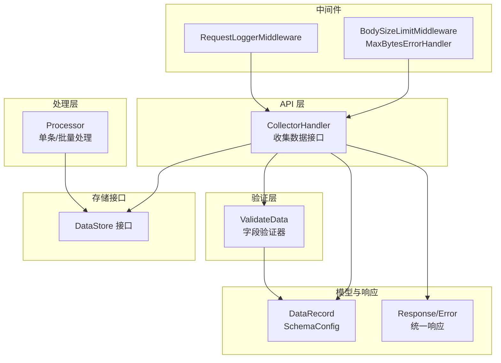
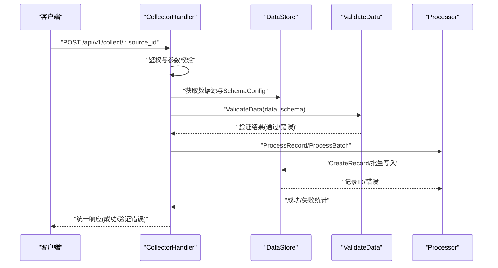
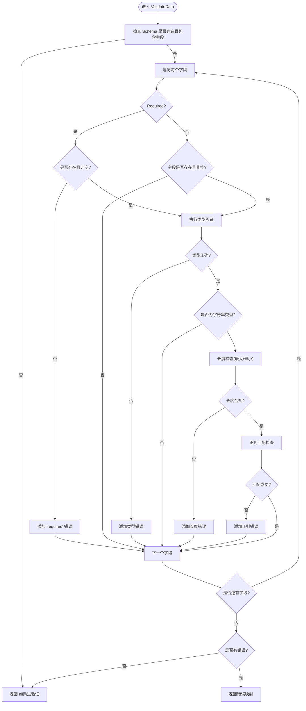
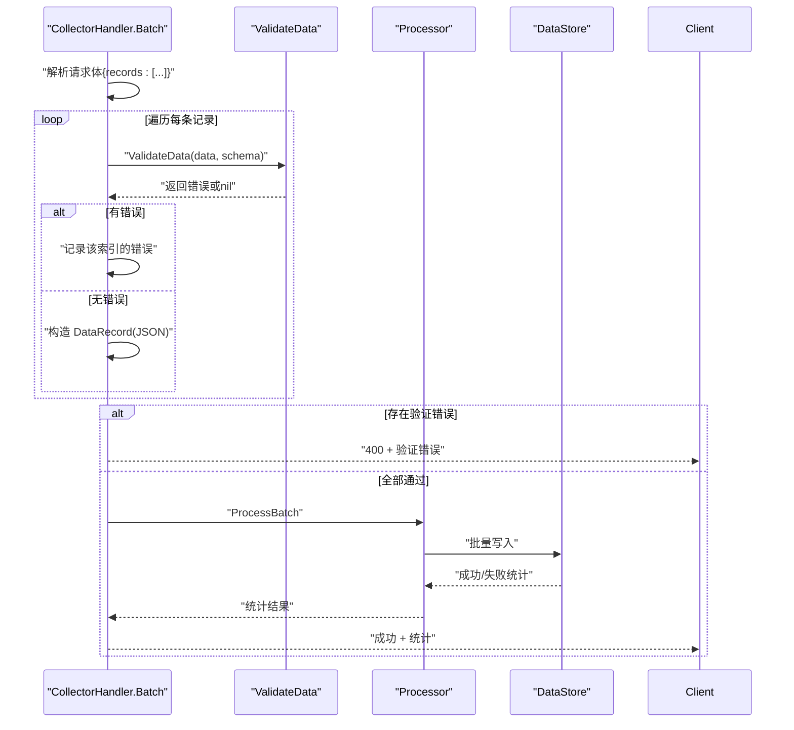
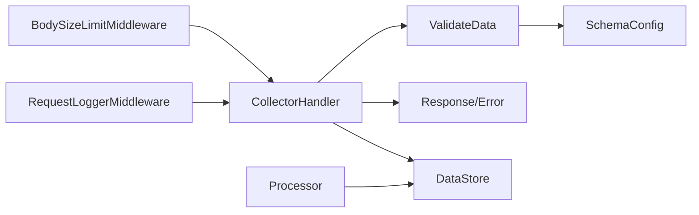

# 数据验证

<cite>
**本文引用的文件**
- [validator.go](file://internal/collector/validator.go)
- [collector.go](file://internal/api/collector.go)
- [processor.go](file://internal/collector/processor.go)
- [record.go](file://internal/model/record.go)
- [errors.go](file://internal/model/errors.go)
- [response.go](file://internal/model/response.go)
- [bodysize.go](file://internal/middleware/bodysize.go)
- [logger.go](file://internal/middleware/logger.go)
- [interface.go](file://internal/storage/interface.go)
- [source.go](file://internal/model/source.go)
</cite>

## 目录
1. [简介](#简介)
2. [项目结构](#项目结构)
3. [核心组件](#核心组件)
4. [架构总览](#架构总览)
5. [详细组件分析](#详细组件分析)
6. [依赖分析](#依赖分析)
7. [性能考虑](#性能考虑)
8. [故障排查指南](#故障排查指南)
9. [结论](#结论)
10. [附录](#附录)

## 简介
本文件聚焦于 DataCollector 的数据验证机制，系统性阐述验证器的实现原理、验证规则与策略，并覆盖以下主题：
- 输入数据的类型检查、格式验证、长度限制、范围约束
- 数据清理与转义处理机制
- 批量数据处理中的验证策略
- 验证错误处理与用户反馈机制
- SQL 注入防护与 XSS 防护的实现要点
- 自定义验证器的开发指南与最佳实践

## 项目结构
围绕数据验证的关键代码分布在以下模块：
- API 层：负责接收请求、鉴权、解析请求体、调用验证器与处理器
- 验证器：执行字段级校验（类型、格式、长度等）
- 处理器：负责单条与批量数据持久化
- 响应模型：统一错误与成功响应格式
- 存储接口：抽象数据持久化能力
- 中间件：请求体大小限制、日志记录等

图表来源
- [collector.go:15-278](file://internal/api/collector.go#L15-L278)
- [validator.go:19-84](file://internal/collector/validator.go#L19-L84)
- [processor.go:16-84](file://internal/collector/processor.go#L16-L84)
- [record.go:8-33](file://internal/model/record.go#L8-L33)
- [response.go:9-72](file://internal/model/response.go#L9-L72)
- [bodysize.go:10-40](file://internal/middleware/bodysize.go#L10-L40)
- [logger.go:11-67](file://internal/middleware/logger.go#L11-L67)
- [interface.go:9-57](file://internal/storage/interface.go#L9-L57)

章节来源
- [collector.go:15-278](file://internal/api/collector.go#L15-L278)
- [validator.go:19-84](file://internal/collector/validator.go#L19-L84)
- [processor.go:16-84](file://internal/collector/processor.go#L16-L84)
- [record.go:8-33](file://internal/model/record.go#L8-L33)
- [response.go:9-72](file://internal/model/response.go#L9-L72)
- [bodysize.go:10-40](file://internal/middleware/bodysize.go#L10-L40)
- [logger.go:11-67](file://internal/middleware/logger.go#L11-L67)
- [interface.go:9-57](file://internal/storage/interface.go#L9-L57)

## 核心组件
- 验证器（ValidateData）：根据数据源的 SchemaConfig 对提交数据进行字段级验证，支持必填、类型、长度、正则等规则
- 收集器 API（CollectorHandler）：对接收的数据进行鉴权、解析、调用验证器、构建记录并交由处理器持久化
- 处理器（Processor）：单条与批量写入，统计成功/失败数量
- 响应模型（Response/Error）：统一返回结构，支持错误码与错误详情
- 存储接口（DataStore）：抽象持久化能力，供处理器调用
- 中间件（BodySizeLimitMiddleware/MaxBytesErrorHandler）：限制请求体大小并处理超限错误
- 日志中间件（RequestLoggerMiddleware）：结构化记录请求日志，便于问题定位

章节来源
- [validator.go:19-84](file://internal/collector/validator.go#L19-L84)
- [collector.go:29-138](file://internal/api/collector.go#L29-L138)
- [processor.go:30-84](file://internal/collector/processor.go#L30-L84)
- [response.go:9-72](file://internal/model/response.go#L9-L72)
- [bodysize.go:10-40](file://internal/middleware/bodysize.go#L10-L40)
- [logger.go:11-67](file://internal/middleware/logger.go#L11-L67)
- [interface.go:9-57](file://internal/storage/interface.go#L9-L57)

## 架构总览
下图展示了从请求到持久化的端到端流程，以及验证环节的位置。

图表来源
- [collector.go:29-138](file://internal/api/collector.go#L29-L138)
- [validator.go:19-84](file://internal/collector/validator.go#L19-L84)
- [processor.go:30-84](file://internal/collector/processor.go#L30-L84)
- [interface.go:37-43](file://internal/storage/interface.go#L37-L43)

## 详细组件分析

### 验证器实现与规则
- 必填字段检查：若字段标记为 Required 且缺失或为空值，则返回“required”
- 类型验证：支持 string、number、boolean、date、datetime、integer、float、email、url、array、object 等类型；非目标类型返回对应类型错误
- 字符串特有规则：
  - 最大/最小长度限制：超过上限或未达到下限时返回相应错误
  - 正则匹配：按字段 Pattern 进行匹配，失败返回“pattern mismatch”
- 空值判断：对 nil、空字符串、空数组、空对象进行统一判定

图表来源
- [validator.go:19-84](file://internal/collector/validator.go#L19-L84)
- [validator.go:86-100](file://internal/collector/validator.go#L86-L100)
- [validator.go:102-221](file://internal/collector/validator.go#L102-L221)

章节来源
- [validator.go:19-84](file://internal/collector/validator.go#L19-L84)
- [validator.go:86-100](file://internal/collector/validator.go#L86-L100)
- [validator.go:102-221](file://internal/collector/validator.go#L102-L221)

### 数据清理与转义
- JSON 序列化：在通过验证后，将原始数据序列化为 JSON 字节，再存入数据库字段，避免直接拼接 SQL 字符串
- URL/Email 格式校验：使用预编译正则与标准库解析函数，确保格式合法性
- 请求体大小限制：通过中间件限制请求体大小，防止恶意或异常体积数据导致资源耗尽

注意：当前实现未对输入内容进行 HTML/XSS 转义或过滤，建议在展示层或输出层补充转义逻辑以抵御 XSS 攻击。

章节来源
- [collector.go:114-127](file://internal/api/collector.go#L114-L127)
- [bodysize.go:10-40](file://internal/middleware/bodysize.go#L10-L40)

### 批量数据处理中的验证策略
- 逐条验证：对每条记录调用 ValidateData，收集验证错误并返回给客户端
- 错误聚合：将每个索引位置的错误映射集中返回，便于定位具体记录
- 失败处理：若全部记录验证失败，返回 400 与验证错误；部分失败时仍可继续写入成功记录

图表来源
- [collector.go:140-268](file://internal/api/collector.go#L140-L268)
- [validator.go:19-84](file://internal/collector/validator.go#L19-L84)
- [processor.go:54-84](file://internal/collector/processor.go#L54-L84)

章节来源
- [collector.go:140-268](file://internal/api/collector.go#L140-L268)
- [validator.go:19-84](file://internal/collector/validator.go#L19-L84)
- [processor.go:54-84](file://internal/collector/processor.go#L54-L84)

### 验证错误处理与用户反馈
- 统一响应模型：成功与错误均通过统一结构返回，错误包含 code、message、errors 等字段
- 验证错误：当 ValidateData 返回错误映射时，API 层以 400 与错误详情返回
- 通用错误码：包含验证失败、参数缺失、内部错误等，便于前端统一处理

章节来源
- [response.go:9-72](file://internal/model/response.go#L9-L72)
- [errors.go:3-84](file://internal/model/errors.go#L3-L84)
- [collector.go:109-112](file://internal/api/collector.go#L109-L112)

### SQL 注入防护与 XSS 防护
- SQL 注入防护：通过将数据序列化为 JSON 并交由存储层写入，避免手动拼接 SQL 字符串；同时存储接口抽象了底层实现，便于在适配器层进一步加固
- XSS 防护：当前未在输入阶段进行 HTML 转义；建议在展示层或输出层对用户输入进行安全转义，以降低反射型 XSS 风险

章节来源
- [collector.go:114-127](file://internal/api/collector.go#L114-L127)
- [interface.go:37-43](file://internal/storage/interface.go#L37-L43)

### 自定义验证器开发指南与最佳实践
- 新增字段类型：在验证器中扩展类型分支，增加类型判断与错误提示
- 新增规则：在字符串特有规则处新增检查项（如最大/最小长度、正则），保持错误消息清晰
- 性能优化：复用预编译正则与解析函数，避免重复编译
- 可维护性：将错误消息集中管理，便于国际化与统一风格
- 批量场景：保持逐条验证与错误聚合，保证失败可定位
- 安全性：在输出层补充 HTML 转义；对敏感字段（如密码）避免记录明文

章节来源
- [validator.go:102-221](file://internal/collector/validator.go#L102-L221)
- [response.go:46-72](file://internal/model/response.go#L46-L72)

## 依赖分析
- API 层依赖验证器与处理器；验证器依赖模型中的 SchemaConfig；处理器依赖存储接口；响应模型被 API 层广泛使用
- 中间件为 API 层提供请求体大小限制与日志记录能力

图表来源
- [collector.go:15-278](file://internal/api/collector.go#L15-L278)
- [validator.go:19-84](file://internal/collector/validator.go#L19-L84)
- [processor.go:16-84](file://internal/collector/processor.go#L16-L84)
- [response.go:9-72](file://internal/model/response.go#L9-L72)
- [bodysize.go:10-40](file://internal/middleware/bodysize.go#L10-L40)
- [logger.go:11-67](file://internal/middleware/logger.go#L11-L67)
- [interface.go:9-57](file://internal/storage/interface.go#L9-L57)
- [source.go:31-50](file://internal/model/source.go#L31-L50)

章节来源
- [collector.go:15-278](file://internal/api/collector.go#L15-L278)
- [validator.go:19-84](file://internal/collector/validator.go#L19-L84)
- [processor.go:16-84](file://internal/collector/processor.go#L16-L84)
- [response.go:9-72](file://internal/model/response.go#L9-L72)
- [bodysize.go:10-40](file://internal/middleware/bodysize.go#L10-L40)
- [logger.go:11-67](file://internal/middleware/logger.go#L11-L67)
- [interface.go:9-57](file://internal/storage/interface.go#L9-L57)
- [source.go:31-50](file://internal/model/source.go#L31-L50)

## 性能考虑
- 预编译正则与解析：减少重复编译与解析开销
- 逐条验证与短路：遇到错误立即记录并跳过后续处理，降低无效计算
- 批量处理统计：在处理器中统计成功/失败数量，避免额外查询
- 请求体大小限制：防止大体积请求占用过多内存与 CPU

章节来源
- [validator.go:14-17](file://internal/collector/validator.go#L14-L17)
- [collector.go:220-247](file://internal/api/collector.go#L220-L247)
- [processor.go:54-84](file://internal/collector/processor.go#L54-L84)
- [bodysize.go:10-40](file://internal/middleware/bodysize.go#L10-L40)

## 故障排查指南
- 验证失败：检查字段类型、长度与正则是否与 SchemaConfig 匹配；确认必填字段是否缺失
- 请求体过大：确认 BodySizeLimitMiddleware 是否生效；查看 MaxBytesErrorHandler 的错误处理
- 日志追踪：通过 RequestLoggerMiddleware 的 trace_id 定位请求链路与错误上下文
- 存储异常：检查 DataStore 实现与连接配置；关注处理器返回的错误信息

章节来源
- [collector.go:109-112](file://internal/api/collector.go#L109-L112)
- [bodysize.go:20-40](file://internal/middleware/bodysize.go#L20-L40)
- [logger.go:11-67](file://internal/middleware/logger.go#L11-L67)
- [processor.go:34-52](file://internal/collector/processor.go#L34-L52)

## 结论
本验证体系以 SchemaConfig 为核心，结合类型、格式、长度与正则等规则，实现了对采集数据的严格控制。配合统一响应模型与中间件，能够快速定位问题并保障系统稳定性。建议在输出层补充 XSS 转义，并持续完善错误消息与日志体系，以提升可观测性与安全性。

## 附录
- 关键数据模型
  - DataRecord：包含数据主体、来源、令牌、IP、UA 与时间戳
  - SchemaConfig：数据源字段定义与约束
- 常用错误码
  - 验证失败：CodeValidationFailed
  - 参数缺失：CodeParamMissing
  - 内部错误：CodeInternalError

章节来源
- [record.go:8-33](file://internal/model/record.go#L8-L33)
- [source.go:31-50](file://internal/model/source.go#L31-L50)
- [errors.go:3-84](file://internal/model/errors.go#L3-L84)