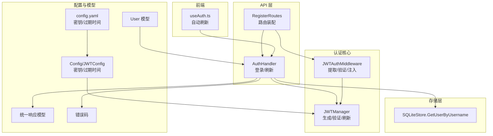
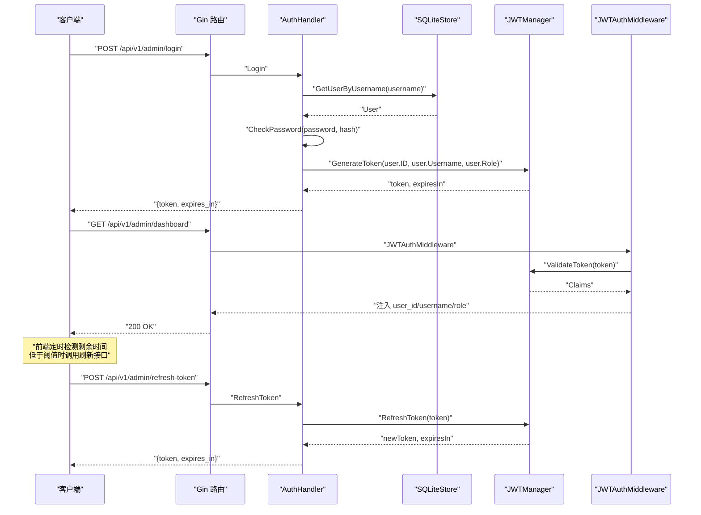
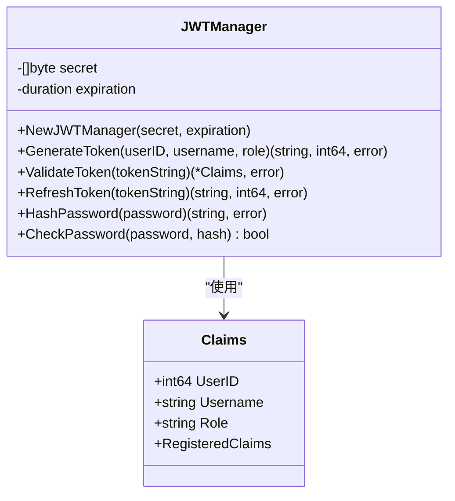
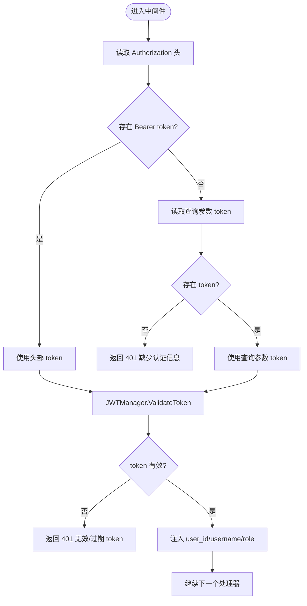
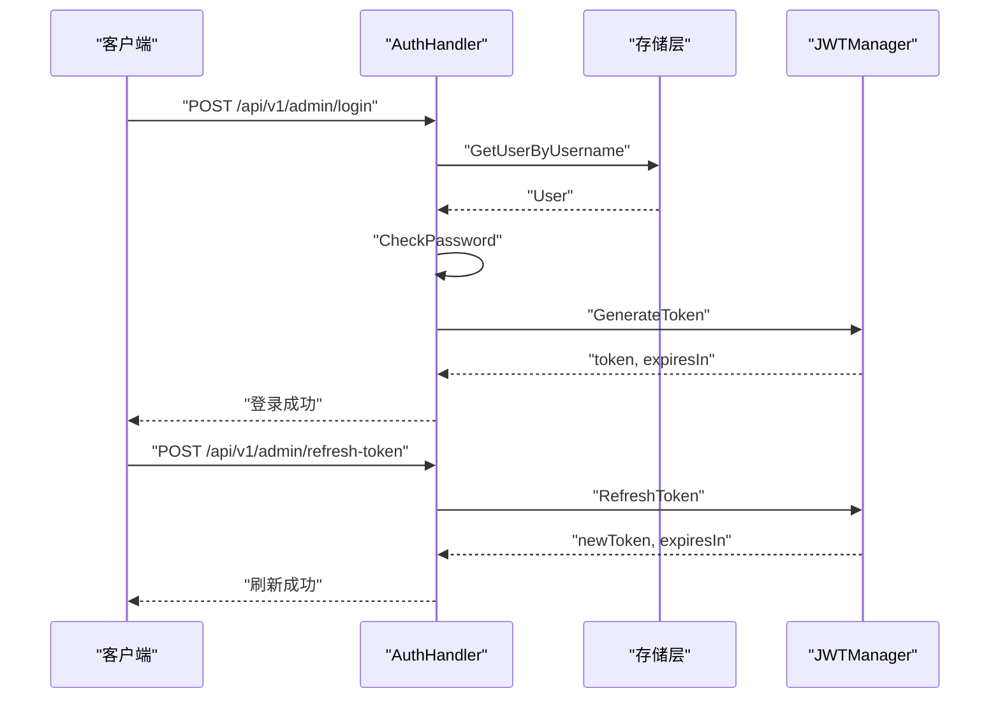
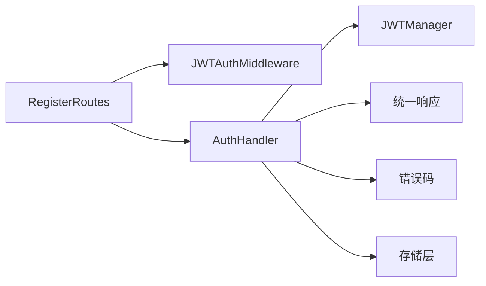

# 认证安全

<cite>
**本文引用的文件**
- [internal/auth/jwt.go](file://internal/auth/jwt.go)
- [internal/auth/middleware.go](file://internal/auth/middleware.go)
- [internal/api/auth.go](file://internal/api/auth.go)
- [internal/api/router.go](file://internal/api/router.go)
- [internal/config/config.go](file://internal/config/config.go)
- [configs/config.yaml](file://configs/config.yaml)
- [internal/model/user.go](file://internal/model/user.go)
- [internal/model/response.go](file://internal/model/response.go)
- [internal/model/errors.go](file://internal/model/errors.go)
- [internal/storage/sqlite/user.go](file://internal/storage/sqlite/user.go)
- [web/src/composables/useAuth.ts](file://web/src/composables/useAuth.ts)
</cite>

## 目录
1. [简介](#简介)
2. [项目结构与认证相关模块](#项目结构与认证相关模块)
3. [核心组件](#核心组件)
4. [架构总览](#架构总览)
5. [详细组件分析](#详细组件分析)
6. [依赖关系分析](#依赖关系分析)
7. [性能与安全考量](#性能与安全考量)
8. [故障排查指南](#故障排查指南)
9. [结论](#结论)

## 简介
本文件聚焦于 DataCollector 的认证安全机制，围绕以下目标展开：
- 深入解释 JWT 认证系统的实现原理，包括 Claims 结构设计、签名算法（HS256）、过期时间管理。
- 详解 JWTManager 的实现细节：token 生成、验证、刷新机制。
- 说明 bcrypt 密码加密的使用与安全性配置。
- 解释认证中间件的实现：token 提取、验证、用户信息注入。
- 提供认证流程图与安全最佳实践。
- 覆盖常见认证攻击的防护与解决方案。

## 项目结构与认证相关模块
认证相关代码主要分布在如下模块：
- 认证核心：internal/auth/jwt.go、internal/auth/middleware.go
- 认证 API：internal/api/auth.go
- 路由与中间件装配：internal/api/router.go
- 配置：internal/config/config.go、configs/config.yaml
- 用户与响应模型：internal/model/user.go、internal/model/response.go、internal/model/errors.go
- 存储层（用户）：internal/storage/sqlite/user.go
- 前端自动刷新：web/src/composables/useAuth.ts

图表来源
- [internal/auth/jwt.go:1-114](file://internal/auth/jwt.go#L1-L114)
- [internal/auth/middleware.go:1-148](file://internal/auth/middleware.go#L1-L148)
- [internal/api/auth.go:1-147](file://internal/api/auth.go#L1-L147)
- [internal/api/router.go:1-116](file://internal/api/router.go#L1-L116)
- [internal/config/config.go:1-215](file://internal/config/config.go#L1-L215)
- [configs/config.yaml:1-41](file://configs/config.yaml#L1-L41)
- [internal/model/user.go:1-15](file://internal/model/user.go#L1-L15)
- [internal/model/response.go:1-72](file://internal/model/response.go#L1-L72)
- [internal/model/errors.go:1-84](file://internal/model/errors.go#L1-L84)
- [internal/storage/sqlite/user.go:1-114](file://internal/storage/sqlite/user.go#L1-L114)
- [web/src/composables/useAuth.ts:1-37](file://web/src/composables/useAuth.ts#L1-L37)

章节来源
- [internal/auth/jwt.go:1-114](file://internal/auth/jwt.go#L1-L114)
- [internal/auth/middleware.go:1-148](file://internal/auth/middleware.go#L1-L148)
- [internal/api/auth.go:1-147](file://internal/api/auth.go#L1-L147)
- [internal/api/router.go:1-116](file://internal/api/router.go#L1-L116)
- [internal/config/config.go:1-215](file://internal/config/config.go#L1-L215)
- [configs/config.yaml:1-41](file://configs/config.yaml#L1-L41)
- [internal/model/user.go:1-15](file://internal/model/user.go#L1-L15)
- [internal/model/response.go:1-72](file://internal/model/response.go#L1-L72)
- [internal/model/errors.go:1-84](file://internal/model/errors.go#L1-L84)
- [internal/storage/sqlite/user.go:1-114](file://internal/storage/sqlite/user.go#L1-L114)
- [web/src/composables/useAuth.ts:1-37](file://web/src/composables/useAuth.ts#L1-L37)

## 核心组件
- JWTManager：负责 JWT 的生成、验证、刷新；使用 HS256 签名；基于配置的密钥与过期时间。
- JWTAuthMiddleware：从 Authorization 或查询参数提取 token，验证后将用户信息注入上下文。
- AuthHandler：登录与刷新 token 的 API 处理器，结合存储层获取用户并校验密码。
- 配置系统：从 YAML 读取密钥与过期时间，支持环境变量覆盖。
- 前端自动刷新：基于 JWT 的 exp 时间在剩余小于阈值时触发刷新。

章节来源
- [internal/auth/jwt.go:19-114](file://internal/auth/jwt.go#L19-L114)
- [internal/auth/middleware.go:11-63](file://internal/auth/middleware.go#L11-L63)
- [internal/api/auth.go:12-147](file://internal/api/auth.go#L12-L147)
- [internal/config/config.go:58-146](file://internal/config/config.go#L58-L146)
- [configs/config.yaml:23-25](file://configs/config.yaml#L23-L25)
- [web/src/composables/useAuth.ts:4-36](file://web/src/composables/useAuth.ts#L4-L36)

## 架构总览
下面的序列图展示了管理员登录、生成 token、后续请求携带 token 的典型流程，以及前端在 token 即将过期时自动刷新的机制。

图表来源
- [internal/api/router.go:34-114](file://internal/api/router.go#L34-L114)
- [internal/api/auth.go:38-126](file://internal/api/auth.go#L38-L126)
- [internal/auth/jwt.go:33-101](file://internal/auth/jwt.go#L33-L101)
- [internal/auth/middleware.go:19-62](file://internal/auth/middleware.go#L19-L62)
- [internal/storage/sqlite/user.go:36-63](file://internal/storage/sqlite/user.go#L36-L63)
- [web/src/composables/useAuth.ts:7-24](file://web/src/composables/useAuth.ts#L7-L24)

## 详细组件分析

### JWTManager 实现细节
- Claims 结构设计
  - 包含用户标识、用户名、角色，以及标准注册声明（过期时间、签发时间、生效时间）。
  - 通过继承标准声明确保与 JWT 规范兼容。
- 签名算法与密钥
  - 使用 HS256（HMAC-SHA256），密钥来自配置。
  - 密钥与过期时间均来源于配置系统，支持环境变量覆盖。
- 过期时间管理
  - 生成 token 时设置 ExpiresAt、IssuedAt、NotBefore。
  - 过期时间由配置中的 expiration 决定，默认 24 小时。
- 生成 token
  - 输入用户 ID、用户名、角色，输出 token 字符串与过期秒数。
- 验证 token
  - 校验签名算法是否为 HMAC；解析失败或过期返回相应错误。
- 刷新 token
  - 仅当剩余有效期不足 2 小时才允许刷新，避免频繁刷新导致会话持久化问题。
  - 刷新后返回新 token 与过期秒数。

图表来源
- [internal/auth/jwt.go:11-114](file://internal/auth/jwt.go#L11-L114)

章节来源
- [internal/auth/jwt.go:11-114](file://internal/auth/jwt.go#L11-L114)
- [internal/config/config.go:58-146](file://internal/config/config.go#L58-L146)
- [configs/config.yaml:23-25](file://configs/config.yaml#L23-L25)

### 认证中间件 JWTAuthMiddleware
- token 提取策略
  - 优先从 Authorization 头提取 Bearer token。
  - 若无 Authorization 头，尝试从 URL 查询参数 token 获取（用于 WebSocket 场景）。
- 验证与错误处理
  - 调用 JWTManager 验证 token。
  - 对过期与无效 token 返回不同错误码。
- 用户信息注入
  - 成功后将 user_id、username、role 注入 gin.Context，供后续处理器使用。

图表来源
- [internal/auth/middleware.go:19-62](file://internal/auth/middleware.go#L19-L62)
- [internal/auth/jwt.go:60-82](file://internal/auth/jwt.go#L60-L82)

章节来源
- [internal/auth/middleware.go:11-63](file://internal/auth/middleware.go#L11-L63)
- [internal/auth/jwt.go:60-82](file://internal/auth/jwt.go#L60-L82)

### AuthHandler 登录与刷新
- 登录流程
  - 接收用户名与密码，从存储层按用户名查询用户。
  - 使用 bcrypt 校验密码。
  - 检查用户状态（启用/禁用）。
  - 生成 JWT 并返回 token 与过期秒数。
- 刷新流程
  - 从 Authorization 头解析 Bearer token。
  - 调用 JWTManager.RefreshToken，满足“剩余有效期不足 2 小时”条件方可刷新。
  - 返回新 token 与过期秒数。

图表来源
- [internal/api/auth.go:38-126](file://internal/api/auth.go#L38-L126)
- [internal/auth/jwt.go:33-101](file://internal/auth/jwt.go#L33-L101)
- [internal/storage/sqlite/user.go:36-63](file://internal/storage/sqlite/user.go#L36-L63)

章节来源
- [internal/api/auth.go:38-126](file://internal/api/auth.go#L38-L126)
- [internal/storage/sqlite/user.go:36-63](file://internal/storage/sqlite/user.go#L36-L63)

### 配置系统与密钥管理
- 配置来源
  - 默认配置与 YAML 文件配置合并。
  - 支持环境变量覆盖关键项（如 JWT_SECRET）。
- 密钥与过期时间
  - JWT 密钥与过期时间分别来自配置结构体与 YAML。
  - 默认密钥为示例值，生产环境必须替换为强随机字符串。

章节来源
- [internal/config/config.go:82-195](file://internal/config/config.go#L82-L195)
- [configs/config.yaml:23-25](file://configs/config.yaml#L23-L25)

### 前端自动刷新机制
- 原理
  - 前端定时解析本地存储的 JWT，计算剩余时间。
  - 当剩余时间小于 2 小时但大于 0 时，调用刷新接口获取新 token 并更新本地存储。
- 定时策略
  - 每 5 分钟检查一次，避免过于频繁的刷新请求。

章节来源
- [web/src/composables/useAuth.ts:4-36](file://web/src/composables/useAuth.ts#L4-L36)

## 依赖关系分析
- 路由装配
  - RegisterRoutes 将 JWTAuthMiddleware 应用于 /api/v1/admin 下的受保护路由。
  - 登录与刷新接口不需 JWT 认证。
- 错误码与统一响应
  - 认证相关错误码集中在 2000-2099 区间，便于前端识别与处理。
  - 统一响应结构体保证前后端交互一致性。

图表来源
- [internal/api/router.go:34-114](file://internal/api/router.go#L34-L114)
- [internal/api/auth.go:12-147](file://internal/api/auth.go#L12-L147)
- [internal/model/response.go:58-71](file://internal/model/response.go#L58-L71)
- [internal/model/errors.go:13-38](file://internal/model/errors.go#L13-L38)

章节来源
- [internal/api/router.go:34-114](file://internal/api/router.go#L34-L114)
- [internal/model/response.go:58-71](file://internal/model/response.go#L58-L71)
- [internal/model/errors.go:13-38](file://internal/model/errors.go#L13-L38)

## 性能与安全考量
- 性能
  - HS256 签名开销低，适合高并发场景。
  - 刷新策略限制为“剩余不足 2 小时”，减少不必要的刷新请求。
- 安全
  - 密钥必须足够随机且保密，建议使用强随机字符串并妥善保管。
  - 生产环境务必启用 HTTPS，防止中间人攻击与明文传输。
  - 建议缩短过期时间并配合前端自动刷新，降低单次 token 泄露风险。
  - 对敏感操作可增加二次验证或更严格的 RBAC 控制。
- 可观测性
  - 统一错误码与响应结构，便于日志与监控系统识别认证异常。

[本节为通用指导，无需特定文件来源]

## 故障排查指南
- 常见错误与定位
  - 缺少认证信息：Authorization 头缺失或为空。
  - 无效的 JWT：签名算法不符、签名错误、格式不正确。
  - Token 已过期：验证阶段直接返回过期错误。
  - 权限不足：RBAC 角色不在允许列表。
  - 登录失败：用户名不存在或密码校验失败。
- 建议排查步骤
  - 检查 Authorization 头格式是否为 Bearer <token>。
  - 确认 JWT_SECRET 与配置一致，且未被环境变量覆盖。
  - 核对过期时间是否合理，前端是否及时刷新。
  - 查看服务端日志与统一响应中的错误码，快速定位问题。

章节来源
- [internal/auth/middleware.go:38-54](file://internal/auth/middleware.go#L38-L54)
- [internal/auth/jwt.go:60-82](file://internal/auth/jwt.go#L60-L82)
- [internal/model/errors.go:13-38](file://internal/model/errors.go#L13-L38)
- [internal/api/auth.go:50-58](file://internal/api/auth.go#L50-L58)

## 结论
本认证体系以 HS256 JWT 为核心，结合 bcrypt 密码校验与中间件注入，提供了简洁高效的管理员认证能力。通过合理的过期时间与刷新策略、统一的错误码与响应结构，既保证了可用性也兼顾了安全性。建议在生产环境中强化密钥管理、启用 HTTPS、缩短过期时间并配合前端自动刷新，以进一步提升整体安全水平。