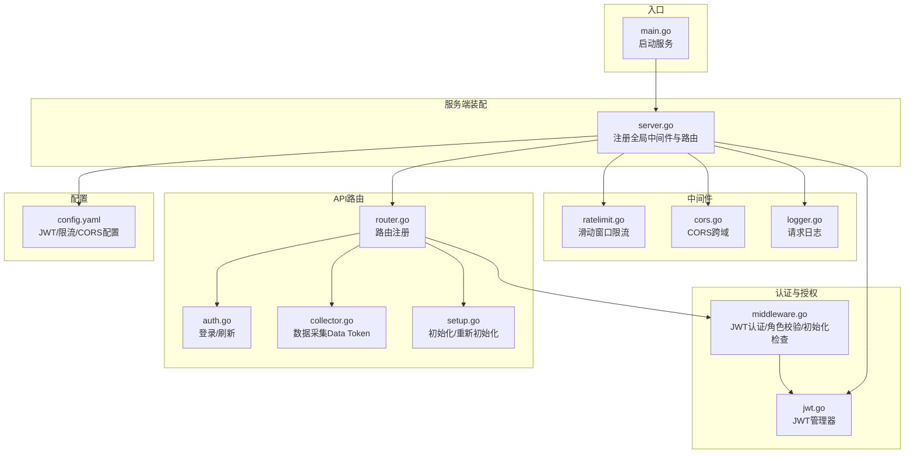
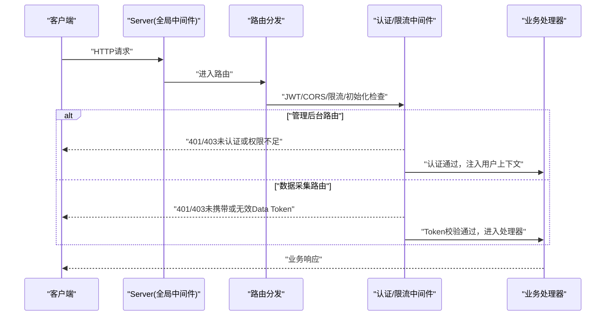
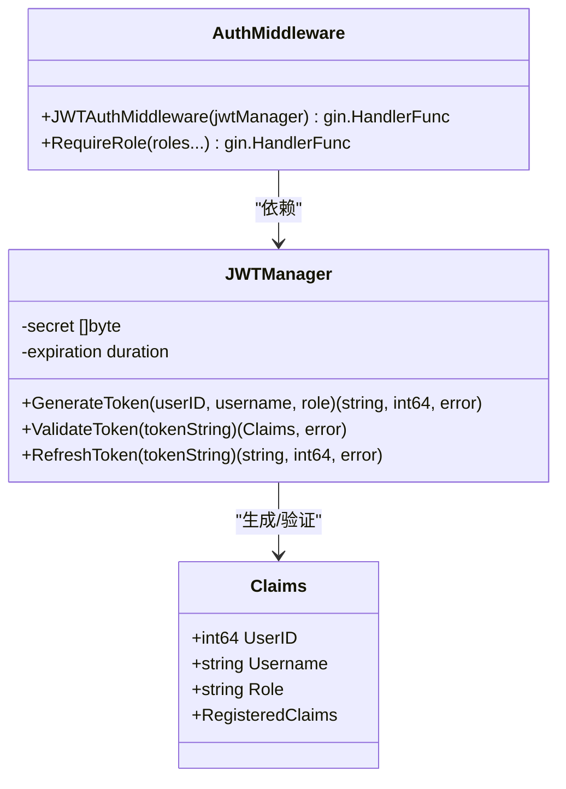
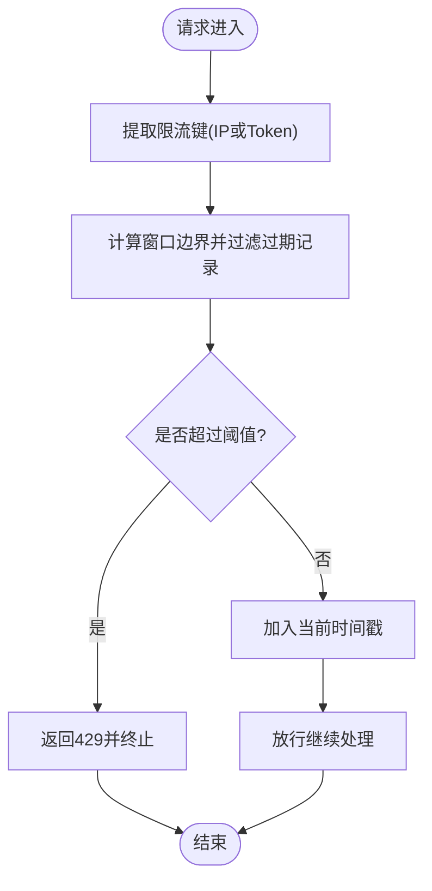
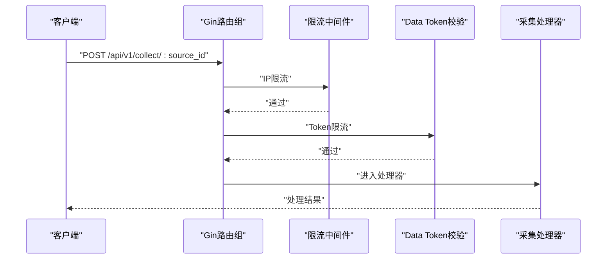
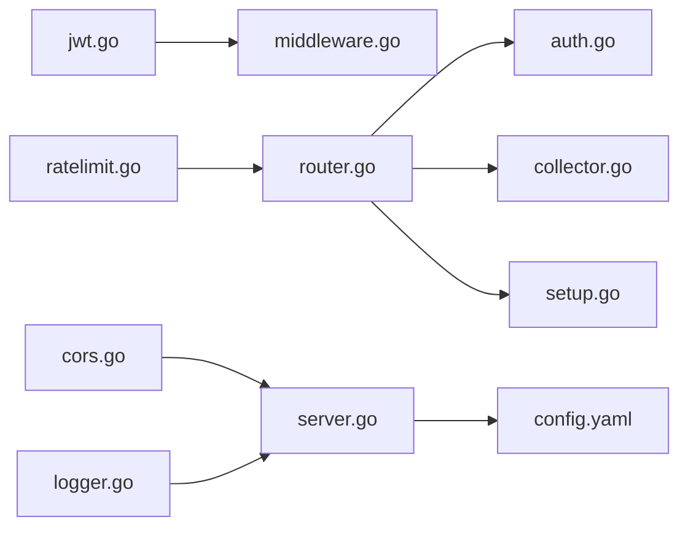

# 访问控制

<cite>
**本文引用的文件**
- [jwt.go](file://internal/auth/jwt.go)
- [middleware.go](file://internal/auth/middleware.go)
- [ratelimit.go](file://internal/middleware/ratelimit.go)
- [cors.go](file://internal/middleware/cors.go)
- [router.go](file://internal/api/router.go)
- [auth.go](file://internal/api/auth.go)
- [collector.go](file://internal/api/collector.go)
- [setup.go](file://internal/api/setup.go)
- [server.go](file://internal/server/server.go)
- [user.go](file://internal/model/user.go)
- [token.go](file://internal/model/token.go)
- [errors.go](file://internal/model/errors.go)
- [response.go](file://internal/model/response.go)
- [config.yaml](file://configs/config.yaml)
- [main.go](file://cmd/server/main.go)
- [token.go](file://internal/storage/postgres/token.go)
</cite>

## 目录
1. [简介](#简介)
2. [项目结构](#项目结构)
3. [核心组件](#核心组件)
4. [架构总览](#架构总览)
5. [详细组件分析](#详细组件分析)
6. [依赖分析](#依赖分析)
7. [性能考虑](#性能考虑)
8. [故障排查指南](#故障排查指南)
9. [结论](#结论)
10. [附录](#附录)

## 简介
本文件面向DataCollector的访问控制系统，围绕以下目标展开：
- 基于角色的访问控制（RBAC）实现与使用
- JWT中间件的权限验证机制与刷新策略
- 限流中间件的实现（IP限流、Token限流），以及限流窗口与清理策略
- CORS配置与跨域访问控制
- API路由的安全配置与访问权限管理
- 访问控制列表（ACL）设计与实现思路
- 会话管理、权限继承、动态权限控制的高级能力建议
- 访问控制审计与监控方案

## 项目结构
DataCollector采用分层清晰的Go项目结构，访问控制相关的核心代码分布在如下模块：
- 认证与授权：internal/auth（JWT、认证中间件、初始化检查）
- 中间件：internal/middleware（CORS、限流、请求日志）
- API路由与控制器：internal/api（路由注册、各业务控制器）
- 服务端装配：internal/server（全局中间件注册、路由挂载）
- 配置：configs/config.yaml
- 入口：cmd/server/main.go

图表来源
- [main.go:25-129](file://cmd/server/main.go#L25-L129)
- [server.go:54-87](file://internal/server/server.go#L54-L87)
- [jwt.go:19-114](file://internal/auth/jwt.go#L19-L114)
- [middleware.go:11-148](file://internal/auth/middleware.go#L11-L148)
- [ratelimit.go:12-137](file://internal/middleware/ratelimit.go#L12-L137)
- [cors.go:9-51](file://internal/middleware/cors.go#L9-L51)
- [router.go:12-116](file://internal/api/router.go#L12-L116)
- [auth.go:12-147](file://internal/api/auth.go#L12-L147)
- [collector.go:15-278](file://internal/api/collector.go#L15-L278)
- [setup.go:19-253](file://internal/api/setup.go#L19-L253)
- [config.yaml:23-32](file://configs/config.yaml#L23-L32)

章节来源
- [main.go:25-129](file://cmd/server/main.go#L25-L129)
- [server.go:54-87](file://internal/server/server.go#L54-L87)
- [config.yaml:23-32](file://configs/config.yaml#L23-L32)

## 核心组件
- JWT管理器：负责签发、验证、刷新令牌，以及密码哈希与校验
- JWT认证中间件：从请求头或URL参数解析并验证JWT，注入用户上下文
- 角色中间件：基于上下文中的角色进行权限判定
- 初始化检查中间件：在未初始化状态下对管理页面与API进行差异化处理
- 限流中间件：基于滑动窗口的IP限流与Token限流
- CORS中间件：按配置允许的来源设置跨域头，处理预检请求
- API路由：按安全需求分组挂载认证与限流中间件
- 日志中间件：统一记录请求链路与错误

章节来源
- [jwt.go:19-114](file://internal/auth/jwt.go#L19-L114)
- [middleware.go:11-148](file://internal/auth/middleware.go#L11-L148)
- [ratelimit.go:12-137](file://internal/middleware/ratelimit.go#L12-L137)
- [cors.go:9-51](file://internal/middleware/cors.go#L9-L51)
- [router.go:12-116](file://internal/api/router.go#L12-L116)
- [logger.go:11-67](file://internal/middleware/logger.go#L11-L67)

## 架构总览
访问控制的整体流程如下：
- 全局中间件：恢复、日志、CORS、请求体大小限制、初始化检查
- 管理后台路由：JWT认证 + 角色校验（如需）
- 数据采集路由：IP限流 + Token限流（由Data Token认证）
- 登录/刷新：JWT签发与刷新
- 初始化/重新初始化：系统状态检查与角色约束

图表来源
- [server.go:54-87](file://internal/server/server.go#L54-L87)
- [router.go:12-116](file://internal/api/router.go#L12-L116)
- [middleware.go:11-148](file://internal/auth/middleware.go#L11-L148)
- [ratelimit.go:100-137](file://internal/middleware/ratelimit.go#L100-L137)
- [auth.go:38-126](file://internal/api/auth.go#L38-L126)
- [collector.go:29-138](file://internal/api/collector.go#L29-L138)

## 详细组件分析

### JWT中间件与权限验证
- 令牌签发：包含用户ID、用户名、角色与标准声明（过期、签发、生效时间）
- 令牌验证：校验签名算法与签名，区分过期与无效
- 令牌刷新：仅在剩余有效期小于阈值时允许刷新
- 密码处理：bcrypt哈希与校验
- 认证中间件：从Authorization头或URL参数读取token，失败返回401
- 角色中间件：从上下文读取角色，不在允许列表则返回403

图表来源
- [jwt.go:19-114](file://internal/auth/jwt.go#L19-L114)
- [middleware.go:11-95](file://internal/auth/middleware.go#L11-L95)

章节来源
- [jwt.go:19-114](file://internal/auth/jwt.go#L19-L114)
- [middleware.go:11-95](file://internal/auth/middleware.go#L11-L95)
- [auth.go:38-126](file://internal/api/auth.go#L38-L126)

### 限流中间件（滑动窗口）
- 数据结构：以标识符（IP或Data Token）为key，维护最近窗口内的请求时间戳列表
- 策略：每分钟滑动窗口，超过阈值拒绝请求
- 清理：定时器周期性清理过期记录，避免内存膨胀
- 中间件：
  - IP限流：按客户端IP限流
  - Token限流：按X-Data-Token限流

图表来源
- [ratelimit.go:12-98](file://internal/middleware/ratelimit.go#L12-L98)
- [ratelimit.go:100-137](file://internal/middleware/ratelimit.go#L100-L137)

章节来源
- [ratelimit.go:12-137](file://internal/middleware/ratelimit.go#L12-L137)
- [router.go:48-55](file://internal/api/router.go#L48-L55)

### CORS配置与跨域访问控制
- 支持“允许所有”与白名单两种模式
- 设置允许的方法与头部，缓存预检结果
- 对OPTIONS预检请求直接返回

章节来源
- [cors.go:9-51](file://internal/middleware/cors.go#L9-L51)
- [server.go:65](file://internal/server/server.go#L65)
- [config.yaml:31-32](file://configs/config.yaml#L31-L32)

### API路由的安全配置与访问权限管理
- 健康检查：无需认证
- 初始化相关：无需认证（用于首次部署）
- 数据采集：应用IP限流与Token限流；采集逻辑内再次校验Data Token有效性与过期状态
- 管理后台：
  - 登录：无需认证
  - 刷新Token：需认证
  - 仪表盘、数据源、Token、数据管理、导出：需认证
  - 重新初始化：需认证+admin角色

图表来源
- [router.go:34-55](file://internal/api/router.go#L34-L55)
- [collector.go:29-138](file://internal/api/collector.go#L29-L138)
- [ratelimit.go:100-137](file://internal/middleware/ratelimit.go#L100-L137)

章节来源
- [router.go:12-116](file://internal/api/router.go#L12-L116)
- [collector.go:29-138](file://internal/api/collector.go#L29-L138)

### 访问控制列表（ACL）设计与实现
- 当前实现要点：
  - 用户模型含角色字段与状态字段
  - 管理后台路由通过RequireRole中间件强制admin角色
  - 初始化检查中间件对未初始化状态下的页面与API进行差异化处理
- ACL设计建议（扩展方向）：
  - 引入细粒度权限点（如“创建数据源”、“删除Token”等），在用户模型中引入权限集合或关联权限表
  - 在路由层增加权限中间件，结合角色与权限点进行动态判定
  - 引入权限继承：角色继承、组织层级继承等
  - 动态权限控制：支持运行时调整权限与缓存失效

章节来源
- [user.go:5-14](file://internal/model/user.go#L5-L14)
- [middleware.go:65-95](file://internal/auth/middleware.go#L65-L95)
- [setup.go:203-236](file://internal/api/setup.go#L203-L236)

### 会话管理、权限继承、动态权限控制
- 会话管理：采用无状态JWT，不维护服务端会话；可通过黑名单机制实现“即时注销”
- 权限继承：建议在用户模型中引入角色与权限映射，支持多角色叠加与继承
- 动态权限控制：在路由层引入权限中间件，结合配置中心或数据库动态下发权限规则

（本节为概念性说明，不直接分析具体文件）

### 访问控制审计与监控
- 请求日志：统一记录trace_id、方法、路径、状态、耗时、客户端IP、User-Agent，错误时附加错误列表
- 错误码体系：统一的错误码与消息映射，便于前端与监控系统识别
- 建议增强：
  - 结合trace_id建立跨服务链路追踪
  - 对401/403事件进行统计与告警
  - 对限流触发事件进行指标上报

章节来源
- [logger.go:11-67](file://internal/middleware/logger.go#L11-L67)
- [errors.go:3-84](file://internal/model/errors.go#L3-L84)
- [response.go:58-72](file://internal/model/response.go#L58-L72)

## 依赖分析
- 认证与授权依赖：
  - JWT管理器依赖标准库与第三方JWT库
  - 认证中间件依赖Gin上下文与统一响应模型
- 限流依赖：
  - 基于并发安全的map与定时清理
- CORS依赖：
  - 依赖Gin中间件机制与配置
- 路由与服务端：
  - 服务端组装全局中间件与路由，路由按安全需求分组挂载

图表来源
- [jwt.go:19-114](file://internal/auth/jwt.go#L19-L114)
- [middleware.go:11-148](file://internal/auth/middleware.go#L11-L148)
- [ratelimit.go:12-137](file://internal/middleware/ratelimit.go#L12-L137)
- [cors.go:9-51](file://internal/middleware/cors.go#L9-L51)
- [router.go:12-116](file://internal/api/router.go#L12-L116)
- [server.go:54-87](file://internal/server/server.go#L54-L87)
- [auth.go:12-147](file://internal/api/auth.go#L12-L147)
- [collector.go:15-278](file://internal/api/collector.go#L15-L278)
- [setup.go:19-253](file://internal/api/setup.go#L19-L253)
- [config.yaml:23-32](file://configs/config.yaml#L23-L32)

## 性能考虑
- 限流实现：
  - 滑动窗口基于数组过滤，时间复杂度O(n)，n为窗口内有效请求数
  - 建议在高并发场景下引入布隆过滤器或Redis实现分布式限流
- 日志：
  - JSON结构化日志，建议配合异步写入与日志轮转
- CORS：
  - 预检缓存可显著降低重复跨域请求开销

（本节为通用指导，不直接分析具体文件）

## 故障排查指南
- 401 无效JWT/Token过期：
  - 检查Authorization头格式与签名密钥
  - 确认JWT过期时间与刷新阈值
- 403 权限不足：
  - 确认用户角色与路由所需角色匹配
  - 检查初始化状态与初始化检查中间件行为
- 401 无效Data Token：
  - 确认X-Data-Token头存在且与数据库中哈希一致
  - 检查Token状态与过期时间
- 429 请求频率超限：
  - 检查IP限流与Token限流阈值配置
  - 关注限流清理定时器是否正常工作

章节来源
- [errors.go:3-84](file://internal/model/errors.go#L3-L84)
- [middleware.go:38-62](file://internal/auth/middleware.go#L38-L62)
- [collector.go:34-75](file://internal/api/collector.go#L34-L75)
- [ratelimit.go:100-137](file://internal/middleware/ratelimit.go#L100-L137)

## 结论
DataCollector的访问控制以JWT为核心，结合初始化检查、CORS、限流与路由分组，构建了较为完整的安全体系。当前实现满足基础RBAC与数据采集安全需求；建议后续引入更细粒度的ACL、权限继承与动态权限控制，并加强审计与监控能力。

## 附录
- 配置项参考：
  - JWT密钥与过期时间
  - 采集限流阈值（IP与Token）
  - 允许的CORS来源
- 数据模型参考：
  - 用户模型（角色、状态）
  - 数据Token模型（哈希、状态、过期时间）

章节来源
- [config.yaml:23-32](file://configs/config.yaml#L23-L32)
- [user.go:5-14](file://internal/model/user.go#L5-L14)
- [token.go:5-16](file://internal/model/token.go#L5-L16)
- [token.go:35-64](file://internal/storage/postgres/token.go#L35-L64)