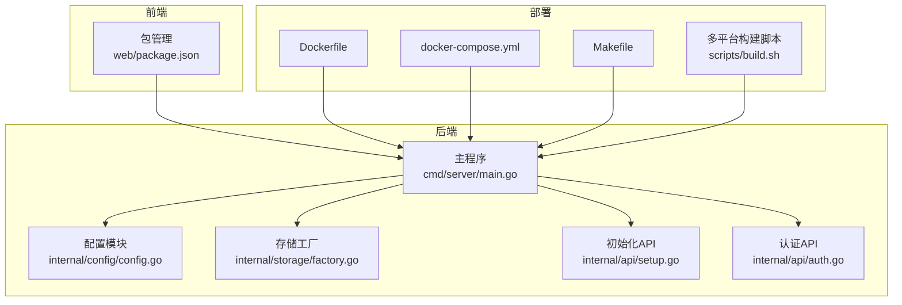
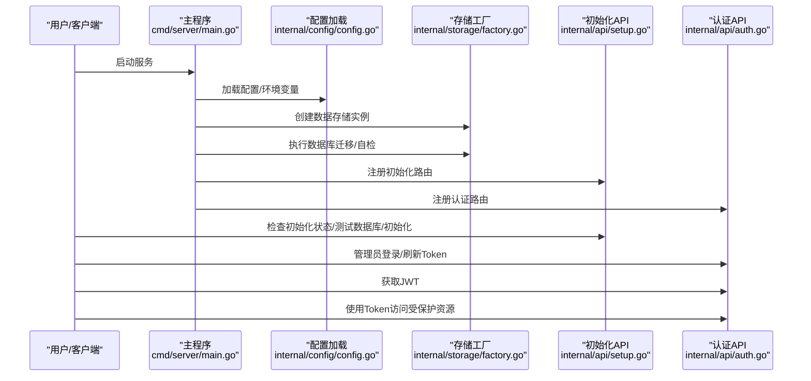
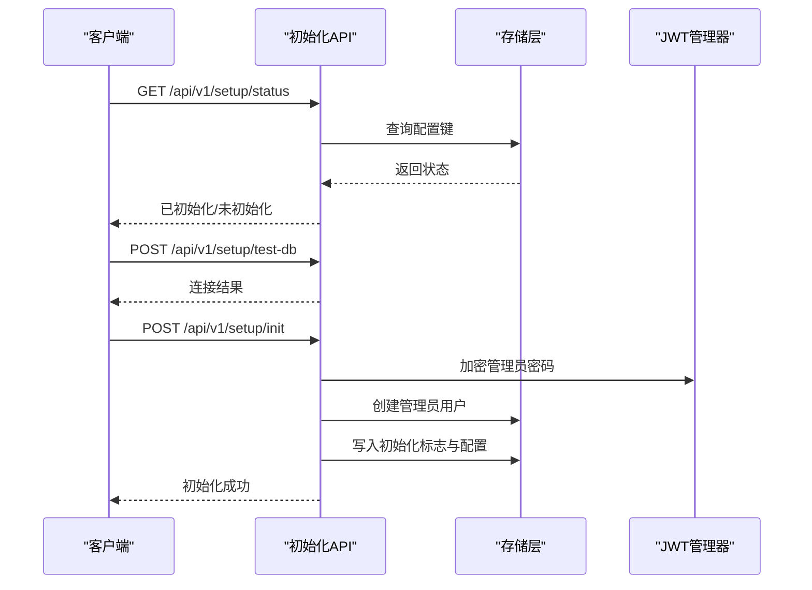
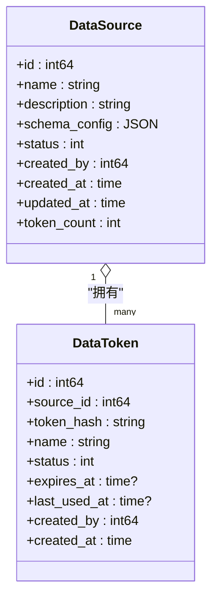
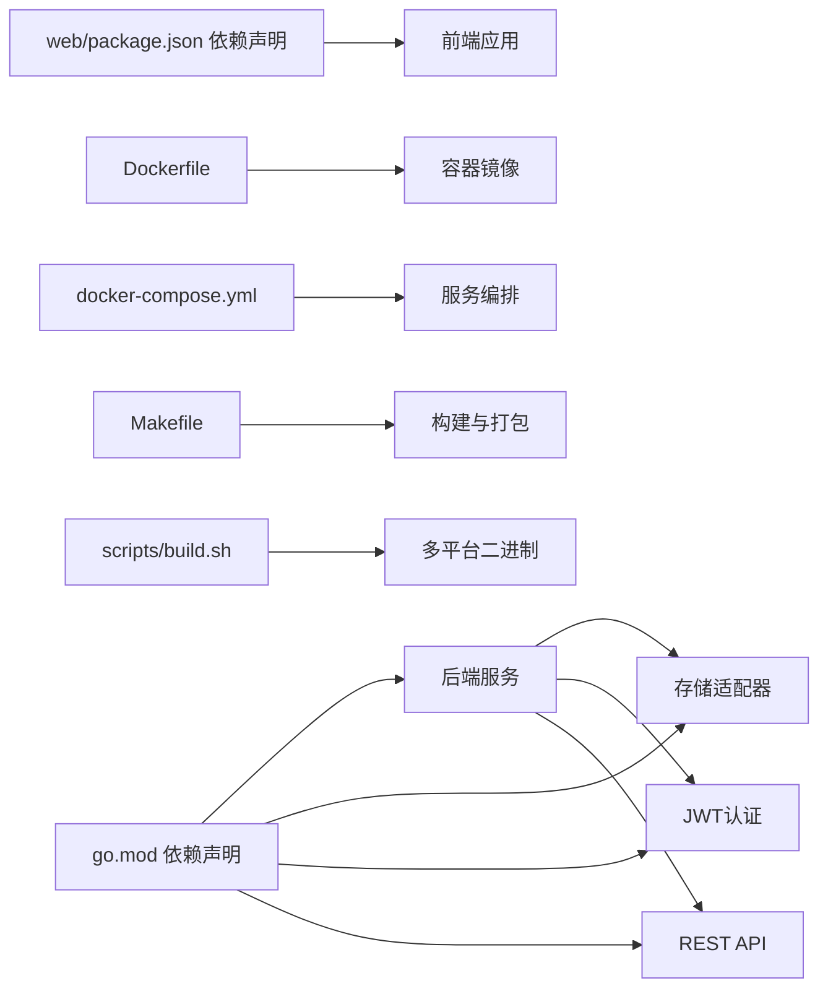

# 快速开始

<cite>
**本文引用的文件**
- [go.mod](file://go.mod)
- [configs/config.yaml](file://configs/config.yaml)
- [cmd/server/main.go](file://cmd/server/main.go)
- [internal/config/config.go](file://internal/config/config.go)
- [internal/storage/factory.go](file://internal/storage/factory.go)
- [Dockerfile](file://Dockerfile)
- [docker-compose.yml](file://docker-compose.yml)
- [Makefile](file://Makefile)
- [scripts/build.sh](file://scripts/build.sh)
- [web/package.json](file://web/package.json)
- [internal/api/setup.go](file://internal/api/setup.go)
- [internal/api/auth.go](file://internal/api/auth.go)
- [internal/model/source.go](file://internal/model/source.go)
- [internal/model/token.go](file://internal/model/token.go)
- [web/src/api/setup.ts](file://web/src/api/setup.ts)
- [web/src/api/auth.ts](file://web/src/api/auth.ts)
- [web/src/api/source.ts](file://web/src/api/source.ts)
- [web/src/api/token.ts](file://web/src/api/token.ts)
- [web/src/types/source.ts](file://web/src/types/source.ts)
- [web/src/types/token.ts](file://web/src/types/token.ts)
</cite>

## 目录
1. [简介](#简介)
2. [项目结构](#项目结构)
3. [核心组件](#核心组件)
4. [架构总览](#架构总览)
5. [详细组件分析](#详细组件分析)
6. [依赖关系分析](#依赖关系分析)
7. [性能与容量建议](#性能与容量建议)
8. [故障排除指南](#故障排除指南)
9. [结论](#结论)
10. [附录](#附录)

## 简介
DataCollector 是一个数据采集与管理平台，提供 Web 管理界面与 REST API，支持 SQLite 和 PostgreSQL 两种数据库后端。本指南面向首次使用者，帮助你在约 30 分钟内完成环境准备、本地开发与部署，并掌握基本使用流程（创建数据源、获取 Token、提交采集请求）。

## 项目结构
- 后端采用 Go 语言，基于 Gin 框架提供 HTTP API；内置 SQLite/PostgreSQL 存储适配器，支持配置化与环境变量覆盖。
- 前端采用 Vue 3 + TypeScript + Vite，打包产物通过 Go embed 内嵌至二进制中，便于单文件部署。
- 提供 Docker 镜像与 docker-compose 编排，支持 SQLite 与 PostgreSQL 两种模式。
- 提供多平台二进制构建脚本，便于发布与分发。

图表来源
- [cmd/server/main.go:1-201](file://cmd/server/main.go#L1-L201)
- [internal/config/config.go:1-215](file://internal/config/config.go#L1-L215)
- [internal/storage/factory.go:1-22](file://internal/storage/factory.go#L1-L22)
- [internal/api/setup.go:1-253](file://internal/api/setup.go#L1-L253)
- [internal/api/auth.go:1-147](file://internal/api/auth.go#L1-L147)
- [Dockerfile:1-52](file://Dockerfile#L1-L52)
- [docker-compose.yml:1-56](file://docker-compose.yml#L1-L56)
- [Makefile:1-57](file://Makefile#L1-L57)
- [scripts/build.sh:1-65](file://scripts/build.sh#L1-L65)
- [web/package.json:1-30](file://web/package.json#L1-L30)

章节来源
- [go.mod:1-48](file://go.mod#L1-L48)
- [configs/config.yaml:1-41](file://configs/config.yaml#L1-L41)
- [cmd/server/main.go:1-201](file://cmd/server/main.go#L1-L201)
- [Makefile:1-57](file://Makefile#L1-L57)

## 核心组件
- 配置系统：支持 YAML 文件与环境变量覆盖，涵盖服务器、TLS、数据库、JWT、采集器限流、日志等。
- 存储适配：根据配置动态选择 SQLite 或 PostgreSQL 实现，统一接口抽象。
- 初始化流程：提供系统初始化、数据库连通性测试、管理员账户创建与状态标记。
- 认证体系：基于 JWT 的管理员登录与刷新机制。
- 数据源与 Token：支持为数据源创建 Token，用于采集请求的身份校验。

章节来源
- [internal/config/config.go:1-215](file://internal/config/config.go#L1-L215)
- [internal/storage/factory.go:1-22](file://internal/storage/factory.go#L1-L22)
- [internal/api/setup.go:1-253](file://internal/api/setup.go#L1-L253)
- [internal/api/auth.go:1-147](file://internal/api/auth.go#L1-L147)
- [internal/model/source.go:1-35](file://internal/model/source.go#L1-L35)
- [internal/model/token.go:1-17](file://internal/model/token.go#L1-L17)

## 架构总览
下图展示启动流程与关键组件交互：

图表来源
- [cmd/server/main.go:25-129](file://cmd/server/main.go#L25-L129)
- [internal/config/config.go:82-195](file://internal/config/config.go#L82-L195)
- [internal/storage/factory.go:11-21](file://internal/storage/factory.go#L11-L21)
- [internal/api/setup.go:40-196](file://internal/api/setup.go#L40-L196)
- [internal/api/auth.go:38-77](file://internal/api/auth.go#L38-L77)

## 详细组件分析

### 环境准备与安装
- Go 版本：项目使用 Go 1.23；Dockerfile 使用 golang:1.21-alpine 构建镜像。建议本地也使用 1.21+。
- Node.js：前端使用 Node.js 20，用于开发与构建。
- 数据库：默认 SQLite，无需额外安装；如需 PostgreSQL，需准备数据库实例。

章节来源
- [go.mod:3](file://go.mod#L3)
- [Dockerfile:13](file://Dockerfile#L13)
- [web/package.json:1-30](file://web/package.json#L1-L30)
- [configs/config.yaml:11-22](file://configs/config.yaml#L11-L22)

### 本地开发环境搭建
- 克隆仓库后，进入根目录执行以下步骤：
  1) 安装后端依赖：直接运行后端即可，Go 模块会自动下载依赖。
  2) 安装前端依赖：在 web 目录执行安装命令。
  3) 构建前端并复制到后端嵌入目录：使用 Makefile 的 web-build 目标。
  4) 运行后端：使用 Makefile 的 run 目标或直接 go run。
  5) 访问地址：默认 http://localhost:8080（可在配置中调整）。

章节来源
- [Makefile:12-38](file://Makefile#L12-L38)
- [configs/config.yaml:1-41](file://configs/config.yaml#L1-L41)
- [cmd/server/main.go:155-169](file://cmd/server/main.go#L155-L169)

### 配置文件与环境变量
- 配置文件位置：configs/config.yaml
- 支持的关键配置项：
  - server.host/port/mode
  - tls.enabled/cert_file/key_file
  - database.driver/sqlite.path/postgres.*
  - jwt.secret/expired
  - collector.max_body_size/rate_limit_per_token/rate_limit_per_ip/allowed_origins
  - log.level/format/output/file_path/max_size/max_age
- 环境变量覆盖规则：可通过环境变量覆盖数据库、服务器端口、JWT 密钥、日志级别等。

章节来源
- [configs/config.yaml:1-41](file://configs/config.yaml#L1-L41)
- [internal/config/config.go:148-195](file://internal/config/config.go#L148-L195)

### 数据库初始化与切换
- 默认使用 SQLite，路径可配置；首次启动会自动创建数据目录与日志目录，并执行数据库迁移与自检。
- 如需 PostgreSQL，可在配置中设置 driver=postgres，并提供主机、端口、用户名、密码、库名与 SSL 模式；也可通过环境变量覆盖。

章节来源
- [cmd/server/main.go:45-64](file://cmd/server/main.go#L45-L64)
- [internal/storage/factory.go:11-21](file://internal/storage/factory.go#L11-L21)
- [internal/config/config.go:197-214](file://internal/config/config.go#L197-L214)

### 初始化与认证流程
- 初始化流程：
  1) 检查初始化状态
  2) 可选：测试数据库连通性（PostgreSQL）
  3) 提交初始化请求，创建管理员账户并写入系统配置
- 认证流程：
  1) 管理员登录获取 JWT
  2) 刷新 Token（满足刷新窗口条件）

图表来源
- [internal/api/setup.go:40-196](file://internal/api/setup.go#L40-L196)
- [internal/api/auth.go:38-77](file://internal/api/auth.go#L38-L77)

章节来源
- [internal/api/setup.go:1-253](file://internal/api/setup.go#L1-L253)
- [internal/api/auth.go:1-147](file://internal/api/auth.go#L1-L147)

### 数据源与 Token 管理
- 数据源模型包含名称、描述、Schema 配置、状态与时间戳等字段；Schema 配置以 JSON 形式定义字段类型、长度与正则约束。
- Token 模型包含所属数据源、名称、状态、过期时间、最后使用时间与创建信息。
- 前端提供数据源与 Token 的增删改查 API，配合后端路由实现。

图表来源
- [internal/model/source.go:8-19](file://internal/model/source.go#L8-L19)
- [internal/model/token.go:5-16](file://internal/model/token.go#L5-L16)

章节来源
- [internal/model/source.go:1-35](file://internal/model/source.go#L1-L35)
- [internal/model/token.go:1-17](file://internal/model/token.go#L1-L17)
- [web/src/types/source.ts:14-37](file://web/src/types/source.ts#L14-L37)
- [web/src/types/token.ts:1-25](file://web/src/types/token.ts#L1-L25)

### 基本使用示例
- 创建数据源
  1) 登录获取 JWT
  2) 调用创建数据源接口，传入名称、描述与可选的 Schema 配置
- 获取 Token
  1) 在指定数据源下创建 Token，得到返回的 Token 字符串
- 提交数据采集请求
  1) 使用 Token 作为身份标识向采集接口提交数据（具体接口请参考 API 文档）

章节来源
- [web/src/api/auth.ts:13-15](file://web/src/api/auth.ts#L13-L15)
- [web/src/api/source.ts:9-11](file://web/src/api/source.ts#L9-L11)
- [web/src/api/token.ts:8-10](file://web/src/api/token.ts#L8-L10)

## 依赖关系分析
- 后端依赖：Gin、JWT、WebSocket、PGX/PostgreSQL 驱动、SQLite3、YAML、日志轮转等。
- 前端依赖：Vue 3、Element Plus、ECharts、Axios、Pinia、Vue Router 等。
- 构建与部署：Makefile 提供一键构建、运行、测试、Docker 构建与多平台二进制生成；Dockerfile 与 docker-compose 支持容器化部署。

图表来源
- [go.mod:5-16](file://go.mod#L5-L16)
- [web/package.json:11-28](file://web/package.json#L11-L28)
- [Dockerfile:1-52](file://Dockerfile#L1-52)
- [docker-compose.yml:1-56](file://docker-compose.yml#L1-L56)
- [Makefile:1-57](file://Makefile#L1-L57)
- [scripts/build.sh:1-65](file://scripts/build.sh#L1-L65)

章节来源
- [go.mod:1-48](file://go.mod#L1-L48)
- [web/package.json:1-30](file://web/package.json#L1-L30)

## 性能与容量建议
- 日志轮转：生产环境建议开启文件输出并配置最大大小与保留天数，避免日志无限增长。
- 数据库：SQLite 适合小规模场景；高并发与持久化需求建议使用 PostgreSQL。
- 限流策略：采集器对每个 Token 与每 IP 设有速率限制，可根据业务调整。
- 前端构建：生产构建会将静态资源内嵌至二进制，减少部署复杂度。

章节来源
- [configs/config.yaml:34-41](file://configs/config.yaml#L34-L41)
- [configs/config.yaml:27-33](file://configs/config.yaml#L27-L33)

## 故障排除指南
- 启动失败（配置加载）
  - 现象：启动时报配置加载错误或退出
  - 排查：检查配置文件路径与权限；确认环境变量覆盖是否正确
- 数据库连接失败
  - 现象：数据库自检失败或迁移报错
  - 排查：确认数据库驱动、主机、端口、凭据与库名；PostgreSQL 需确保网络可达与 SSL 模式正确
- 权限不足（初始化/重新初始化）
  - 现象：重新初始化返回权限错误
  - 排查：确认调用方具备管理员角色且携带有效 JWT
- 前端无法访问
  - 现象：浏览器打开 404 或空白页
  - 排查：确认已执行前端构建并将产物复制到后端嵌入目录；检查服务器端口与访问地址

章节来源
- [cmd/server/main.go:155-169](file://cmd/server/main.go#L155-L169)
- [internal/api/setup.go:205-236](file://internal/api/setup.go#L205-L236)

## 结论
按照本指南，你可以在 30 分钟内完成环境准备、本地开发与部署，并掌握系统初始化、认证与数据采集的基本流程。建议在生产环境中启用 TLS、使用 PostgreSQL、配置合理的日志与限流参数，并通过 docker-compose 或 Docker 镜像进行标准化部署。

## 附录

### 多种部署方式
- Docker 部署
  - 单机 SQLite：使用 docker-compose，默认映射数据与日志目录，暴露 8080 端口
  - PostgreSQL 模式：取消注释相应服务段落，提供数据库凭据与健康检查
- 二进制部署
  - 使用 Makefile 的 build 目标生成 dist 下的可执行文件
  - 或使用 scripts/build.sh 生成多平台二进制
- 源码编译部署
  - 安装依赖后，使用 go build 或 go run 启动服务
  - 建议先执行前端构建并将产物复制到后端嵌入目录

章节来源
- [docker-compose.yml:1-56](file://docker-compose.yml#L1-L56)
- [Dockerfile:1-52](file://Dockerfile#L1-L52)
- [Makefile:28-56](file://Makefile#L28-L56)
- [scripts/build.sh:1-65](file://scripts/build.sh#L1-L65)