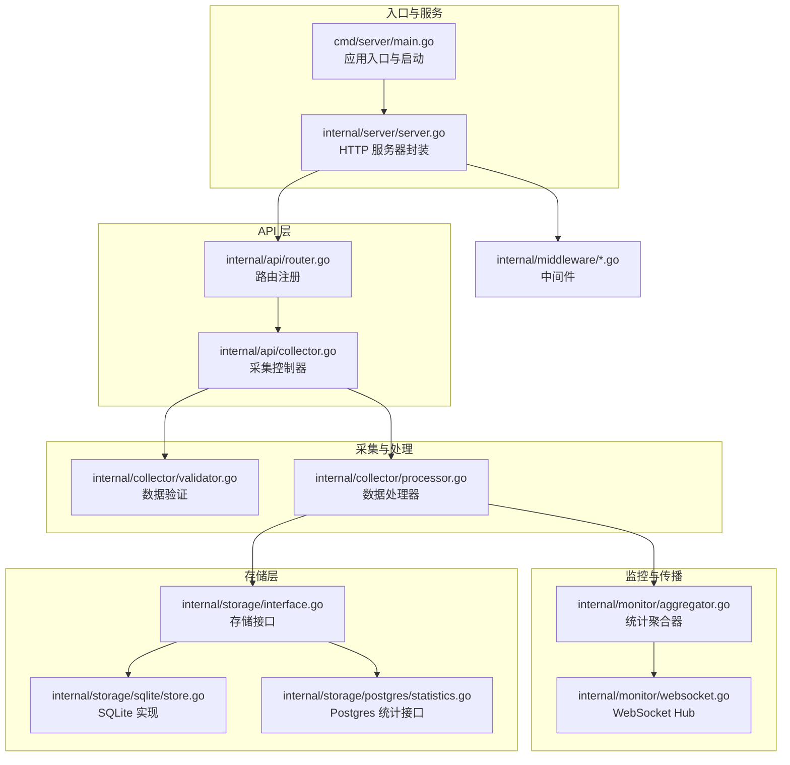
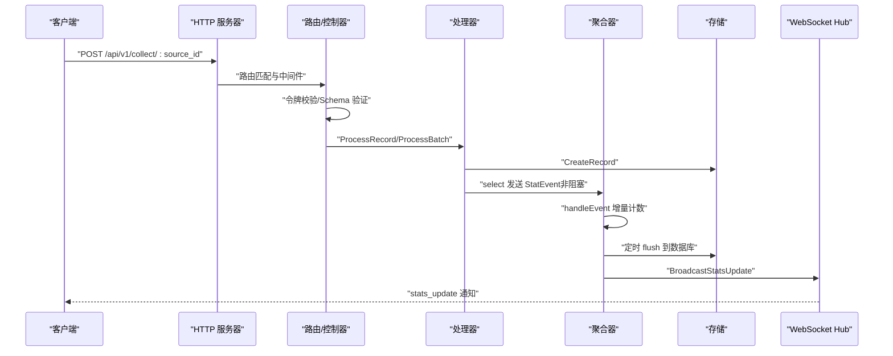
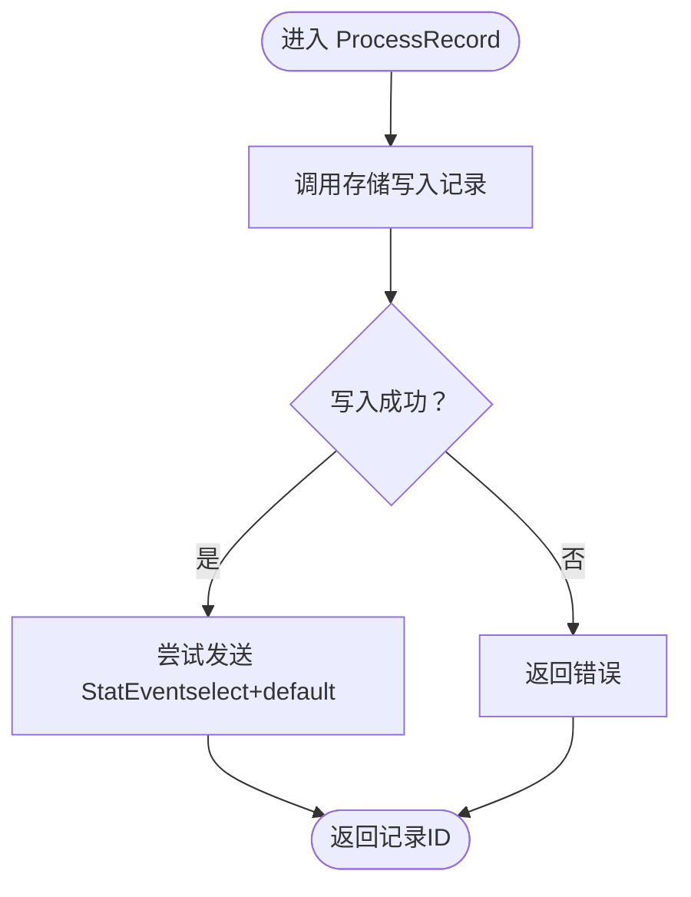
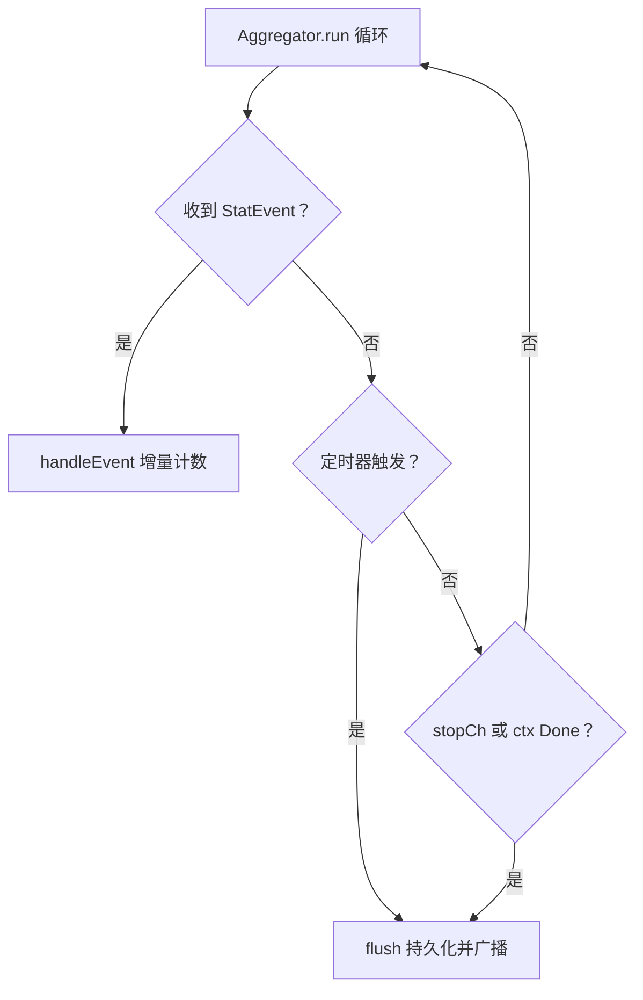
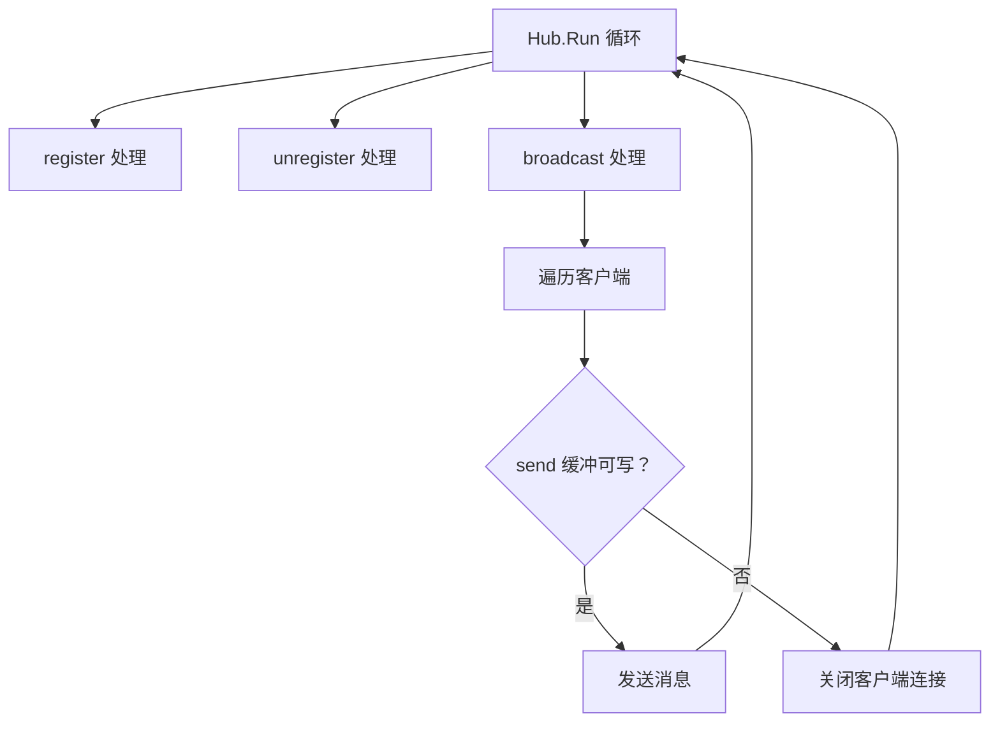
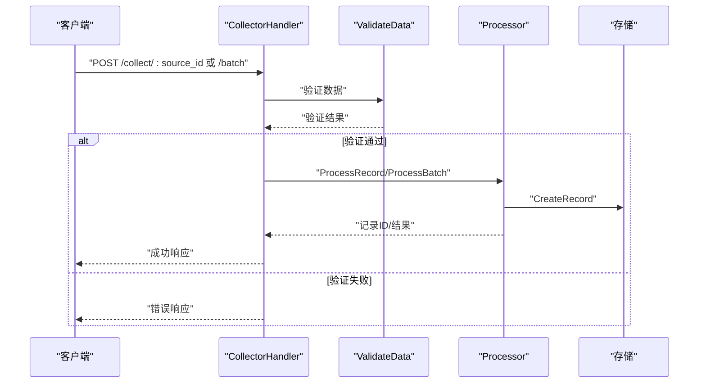
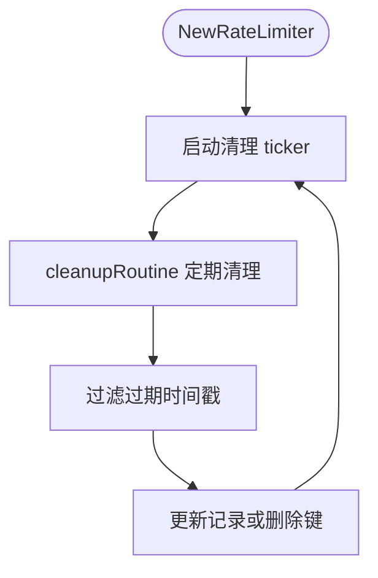
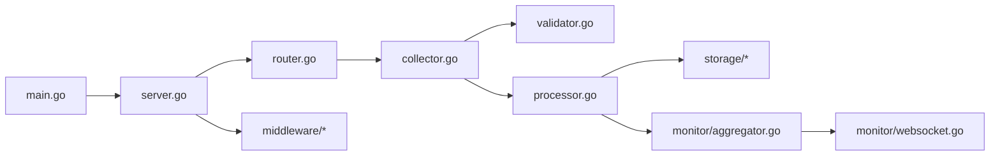

# 并发处理优化

<cite>
**本文引用的文件**
- [main.go](file://cmd/server/main.go)
- [processor.go](file://internal/collector/processor.go)
- [aggregator.go](file://internal/monitor/aggregator.go)
- [websocket.go](file://internal/monitor/websocket.go)
- [router.go](file://internal/api/router.go)
- [collector.go](file://internal/api/collector.go)
- [config.yaml](file://configs/config.yaml)
- [statistics.go](file://internal/model/statistics.go)
- [statistics.go](file://internal/storage/postgres/statistics.go)
- [store.go](file://internal/storage/sqlite/store.go)
- [logger.go](file://internal/middleware/logger.go)
- [ratelimit.go](file://internal/middleware/ratelimit.go)
- [bodysize.go](file://internal/middleware/bodysize.go)
</cite>

## 目录
1. [简介](#简介)
2. [项目结构](#项目结构)
3. [核心组件](#核心组件)
4. [架构总览](#架构总览)
5. [详细组件分析](#详细组件分析)
6. [依赖分析](#依赖分析)
7. [性能考量](#性能考量)
8. [故障排查指南](#故障排查指南)
9. [结论](#结论)
10. [附录](#附录)

## 简介
本指南聚焦于 DataCollector 的并发处理优化，围绕 Go 语言 goroutine 最佳实践与性能优化策略展开，系统阐述数据处理器的并发设计、channel 使用模式与死锁规避、统计聚合的并发处理与事件传播机制、并发安全的共享状态管理、goroutine 数量控制、上下文取消与超时处理、生产者-消费者模式在数据处理中的应用，以及并发性能测试与瓶颈分析方法，并给出不同负载场景下的并发调优建议。

## 项目结构
DataCollector 采用分层与功能域结合的组织方式：
- cmd/server：应用入口，负责初始化、启动各子系统与优雅关闭
- internal/api：HTTP 路由与控制器，承载采集与管理接口
- internal/collector：数据采集与处理逻辑（含验证、处理器）
- internal/monitor：监控与事件传播（聚合器、WebSocket Hub）
- internal/storage：存储抽象与具体实现（SQLite/Postgres）
- internal/middleware：HTTP 中间件（日志、限流、请求体大小限制）
- configs：运行配置（数据库、JWT、限流、日志等）

图表来源
- [main.go:25-129](file://cmd/server/main.go#L25-L129)
- [server.go:54-87](file://internal/server/server.go#L54-L87)
- [router.go:14-115](file://internal/api/router.go#L14-L115)
- [collector.go:29-138](file://internal/api/collector.go#L29-L138)
- [processor.go:16-52](file://internal/collector/processor.go#L16-L52)
- [aggregator.go:17-87](file://internal/monitor/aggregator.go#L17-L87)
- [websocket.go:14-106](file://internal/monitor/websocket.go#L14-L106)
- [store.go:17-56](file://internal/storage/sqlite/store.go#L17-L56)
- [statistics.go:10-22](file://internal/storage/postgres/statistics.go#L10-L22)

章节来源
- [main.go:25-129](file://cmd/server/main.go#L25-L129)
- [server.go:54-87](file://internal/server/server.go#L54-L87)
- [router.go:14-115](file://internal/api/router.go#L14-L115)
- [collector.go:29-138](file://internal/api/collector.go#L29-L138)
- [processor.go:16-52](file://internal/collector/processor.go#L16-L52)
- [aggregator.go:17-87](file://internal/monitor/aggregator.go#L17-L87)
- [websocket.go:14-106](file://internal/monitor/websocket.go#L14-L106)
- [store.go:17-56](file://internal/storage/sqlite/store.go#L17-L56)
- [statistics.go:10-22](file://internal/storage/postgres/statistics.go#L10-L22)

## 核心组件
- 数据处理器（Processor）：负责将单条/批量数据持久化至存储，并向统计聚合器发送事件；采用非阻塞 select 发送统计事件以避免阻塞主处理流程。
- 统计聚合器（Aggregator）：维护内存中的计数器，周期性刷新到数据库，并通过 WebSocket Hub 推送更新。
- WebSocket Hub：管理客户端连接，广播统计数据更新通知，具备背压与异常连接清理能力。
- 采集控制器（CollectorHandler）：对接 HTTP 请求，完成令牌校验、Schema 验证、构建记录并调用处理器。
- 限流中间件（RateLimiter）：基于滑动窗口实现 IP 与 Token 级别的速率限制，定期清理过期记录。
- 日志中间件（RequestLoggerMiddleware）：为每个请求生成 trace_id 并记录结构化日志，便于并发场景下的问题定位。

章节来源
- [processor.go:16-52](file://internal/collector/processor.go#L16-L52)
- [aggregator.go:17-87](file://internal/monitor/aggregator.go#L17-L87)
- [websocket.go:14-106](file://internal/monitor/websocket.go#L14-L106)
- [collector.go:29-138](file://internal/api/collector.go#L29-L138)
- [ratelimit.go:12-65](file://internal/middleware/ratelimit.go#L12-L65)
- [logger.go:11-53](file://internal/middleware/logger.go#L11-L53)

## 架构总览
DataCollector 的并发架构遵循“生产者-消费者”模式：
- 生产者：HTTP 请求进入后由采集控制器完成令牌与 Schema 校验，随后将记录交由处理器持久化。
- 消费者：处理器异步向统计聚合器发送事件；聚合器后台 goroutine 汇总内存计数并定时刷新到数据库；完成后通过 WebSocket Hub 广播更新。
- 通道：处理器与聚合器之间通过带缓冲 channel 传递统计事件；WebSocket Hub 通过广播 channel 推送消息给所有客户端。

图表来源
- [collector.go:29-138](file://internal/api/collector.go#L29-L138)
- [processor.go:34-52](file://internal/collector/processor.go#L34-L52)
- [aggregator.go:52-87](file://internal/monitor/aggregator.go#L52-L87)
- [websocket.go:108-127](file://internal/monitor/websocket.go#L108-L127)

## 详细组件分析

### 数据处理器（Processor）并发设计
- 非阻塞事件发送：处理器在发送统计事件时使用带 default 分支的 select，若事件通道已满或阻塞则跳过发送，避免阻塞主处理流程。
- 批量处理：逐条处理记录，统计成功/失败数与记录 ID 列表，全部失败时返回错误，部分或全部成功时返回相应结果。
- 上下文传播：所有持久化操作均使用请求上下文，确保可取消与超时控制。

图表来源
- [processor.go:34-52](file://internal/collector/processor.go#L34-L52)

章节来源
- [processor.go:34-52](file://internal/collector/processor.go#L34-L52)

### 统计聚合器（Aggregator）并发处理与事件传播
- 事件通道：内部维护带缓冲的事件通道，避免上游写入阻塞。
- 主循环：使用 select 处理三类事件：事件到达、定时刷新、停止信号、上下文取消。
- 内存计数器：使用互斥锁保护 map，按数据源维度累加。
- 刷新策略：定时器触发 flush，复制计数器快照并清空，逐条调用存储接口进行增量；完成后通过 Hub 广播更新。
- 停止与优雅退出：通过关闭停止通道与上下文取消触发最终 flush。

图表来源
- [aggregator.go:52-87](file://internal/monitor/aggregator.go#L52-L87)
- [aggregator.go:89-133](file://internal/monitor/aggregator.go#L89-L133)

章节来源
- [aggregator.go:52-87](file://internal/monitor/aggregator.go#L52-L87)
- [aggregator.go:89-133](file://internal/monitor/aggregator.go#L89-L133)

### WebSocket Hub 并发与背压
- Hub 主循环：分别处理注册、注销与广播三种事件，广播时对每个客户端尝试发送，若客户端发送缓冲区已满则主动断开连接，避免无限阻塞。
- 客户端泵：writePump 定期批量发送等待的消息并发送 Ping；readPump 设置读取限制与超时，处理 Pong 以延长读超时。
- 广播背压：广播通道同样采用非阻塞发送并在缓冲满时记录告警，防止阻塞 Hub 主循环。

图表来源
- [websocket.go:63-106](file://internal/monitor/websocket.go#L63-L106)
- [websocket.go:108-127](file://internal/monitor/websocket.go#L108-L127)
- [websocket.go:149-190](file://internal/monitor/websocket.go#L149-L190)
- [websocket.go:192-215](file://internal/monitor/websocket.go#L192-L215)

章节来源
- [websocket.go:63-106](file://internal/monitor/websocket.go#L63-L106)
- [websocket.go:108-127](file://internal/monitor/websocket.go#L108-L127)
- [websocket.go:149-190](file://internal/monitor/websocket.go#L149-L190)
- [websocket.go:192-215](file://internal/monitor/websocket.go#L192-L215)

### 采集控制器（CollectorHandler）并发与生产者-消费者
- 控制器作为生产者：接收 HTTP 请求，完成令牌校验与 Schema 验证后，构造记录并调用处理器。
- 处理器作为消费者：异步写入存储并发送统计事件，避免阻塞请求处理。
- 批量处理：逐条验证与构建记录，然后调用处理器批量处理，返回汇总结果。

图表来源
- [collector.go:29-138](file://internal/api/collector.go#L29-L138)
- [collector.go:140-268](file://internal/api/collector.go#L140-L268)
- [validator.go:19-84](file://internal/collector/validator.go#L19-L84)
- [processor.go:34-52](file://internal/collector/processor.go#L34-L52)

章节来源
- [collector.go:29-138](file://internal/api/collector.go#L29-L138)
- [collector.go:140-268](file://internal/api/collector.go#L140-L268)
- [validator.go:19-84](file://internal/collector/validator.go#L19-L84)
- [processor.go:34-52](file://internal/collector/processor.go#L34-L52)

### 限流中间件（RateLimiter）并发与清理
- 滑动窗口：使用 map + RWMutex 维护标识符到时间戳切片的映射。
- 定期清理：每分钟启动清理 goroutine，过滤过期记录，降低内存占用。
- 并发安全：读写分离（RLock/RWMutex），避免频繁加锁带来的竞争。

图表来源
- [ratelimit.go:22-65](file://internal/middleware/ratelimit.go#L22-L65)

章节来源
- [ratelimit.go:22-65](file://internal/middleware/ratelimit.go#L22-L65)

### 日志中间件（RequestLoggerMiddleware）并发追踪
- 为每个请求生成唯一 trace_id 并注入上下文，便于跨 goroutine 串联日志。
- 结构化日志包含 trace_id、方法、路径、状态码、耗时、客户端 IP、User-Agent 等，便于并发场景下的问题定位。

章节来源
- [logger.go:11-53](file://internal/middleware/logger.go#L11-L53)

## 依赖分析
- 组件耦合
  - Processor 仅依赖存储接口与统计事件通道，低耦合，便于替换存储实现。
  - Aggregator 依赖存储接口与 WebSocket Hub，职责清晰。
  - CollectorHandler 依赖存储接口与处理器，路由层解耦业务逻辑。
- 外部依赖
  - Gin：HTTP 路由与中间件
  - Gorilla WebSocket：实时推送
  - SQLite/Postgres：数据持久化
  - lumberjack：日志轮转

图表来源
- [main.go:25-129](file://cmd/server/main.go#L25-L129)
- [server.go:54-87](file://internal/server/server.go#L54-L87)
- [router.go:14-115](file://internal/api/router.go#L14-L115)
- [collector.go:29-138](file://internal/api/collector.go#L29-L138)
- [processor.go:16-52](file://internal/collector/processor.go#L16-L52)
- [aggregator.go:17-87](file://internal/monitor/aggregator.go#L17-L87)
- [websocket.go:14-106](file://internal/monitor/websocket.go#L14-L106)

章节来源
- [main.go:25-129](file://cmd/server/main.go#L25-L129)
- [server.go:54-87](file://internal/server/server.go#L54-L87)
- [router.go:14-115](file://internal/api/router.go#L14-L115)
- [collector.go:29-138](file://internal/api/collector.go#L29-L138)
- [processor.go:16-52](file://internal/collector/processor.go#L16-L52)
- [aggregator.go:17-87](file://internal/monitor/aggregator.go#L17-L87)
- [websocket.go:14-106](file://internal/monitor/websocket.go#L14-L106)

## 性能考量
- goroutine 数量控制
  - Aggregator：单个后台 goroutine 负责事件处理与定时刷新，无需过多 goroutine。
  - WebSocket Hub：主循环与每个客户端的 read/write pump 各自 goroutine，需关注客户端数量上限与 send 缓冲大小。
  - 限流器：清理 goroutine 与滑动窗口内存占用需平衡。
- channel 设计
  - 事件通道容量设置为 1000，兼顾吞吐与内存占用；可根据峰值 QPS 调整。
  - 广播通道采用非阻塞发送与客户端缓冲满时断连，避免阻塞 Hub。
- 上下文与超时
  - 入口处使用带超时的 context 控制优雅关闭；处理器与存储操作均使用请求上下文，确保可取消。
- 存储并发
  - SQLite：最大连接数限制为 1，避免并发写入冲突；可通过 WAL 模式提升并发读取。
  - Postgres：使用 UPSERT 增量更新，减少锁竞争；批量刷新时逐条递增，避免长事务。
- 资源隔离
  - 采集、聚合、推送三类任务通过 channel 解耦，避免直接耦合导致的级联阻塞。

章节来源
- [aggregator.go:30-45](file://internal/monitor/aggregator.go#L30-L45)
- [aggregator.go:52-87](file://internal/monitor/aggregator.go#L52-L87)
- [websocket.go:149-190](file://internal/monitor/websocket.go#L149-L190)
- [store.go:39-56](file://internal/storage/sqlite/store.go#L39-L56)
- [statistics.go:10-22](file://internal/storage/postgres/statistics.go#L10-L22)
- [main.go:111-129](file://cmd/server/main.go#L111-L129)

## 故障排查指南
- 事件丢失
  - 现象：统计未增长或延迟明显。
  - 排查：检查处理器事件发送是否被 default 分支跳过；适当增大事件通道容量或降低发送频率。
- 聚合刷新失败
  - 现象：数据库未更新或错误日志频繁。
  - 排查：查看 flush 过程中的错误日志；确认存储接口可用性与网络状况。
- WebSocket 推送失败
  - 现象：前端未收到更新通知。
  - 排查：检查 Hub 广播通道是否溢出；确认客户端 send 缓冲是否过小；观察客户端连接是否被自动断开。
- 并发写入冲突（SQLite）
  - 现象：写入阻塞或超时。
  - 排查：确认最大连接数为 1；避免在高并发下进行大量写操作；必要时切换到 Postgres。
- 限流误伤
  - 现象：正常请求被限流。
  - 排查：调整 per-token 与 per-ip 的阈值；检查清理周期是否过短导致记录被提前清理。

章节来源
- [processor.go:42-49](file://internal/collector/processor.go#L42-L49)
- [aggregator.go:89-133](file://internal/monitor/aggregator.go#L89-L133)
- [websocket.go:108-127](file://internal/monitor/websocket.go#L108-L127)
- [store.go:39-56](file://internal/storage/sqlite/store.go#L39-L56)
- [ratelimit.go:22-65](file://internal/middleware/ratelimit.go#L22-L65)

## 结论
DataCollector 的并发设计以 channel 为核心，采用生产者-消费者模式实现采集、统计与推送的解耦。通过非阻塞事件发送、定时刷新与背压控制，系统在高并发场景下保持稳定与可观的吞吐。建议在不同负载场景下结合通道容量、清理周期与存储驱动进行针对性调优，并持续通过日志与指标观测瓶颈。

## 附录

### 并发性能测试与瓶颈分析方法
- 压测工具：使用压测工具模拟多源并发采集，覆盖单条与批量两种场景。
- 指标观测：记录请求延迟、事件通道积压、聚合器刷新耗时、WebSocket 广播耗时、存储写入耗时。
- 瓶颈定位：逐步缩小范围，先看通道是否溢出，再看存储写入是否阻塞，最后评估 Hub 广播与客户端处理能力。
- 调优步骤：调整事件通道容量、刷新周期、客户端 send 缓冲、限流阈值与清理周期，直至达到目标延迟与吞吐。

### 不同负载场景下的并发调优建议
- 低负载（QPS < 100）
  - 事件通道容量：500~1000
  - 聚合刷新周期：60s
  - 客户端 send 缓冲：64~128
  - 限流阈值：按业务保守设置
- 中负载（100 ≤ QPS < 1000）
  - 事件通道容量：1000~2000
  - 聚合刷新周期：30~60s
  - 客户端 send 缓冲：128~256
  - 限流阈值：适度放宽
- 高负载（QPS ≥ 1000）
  - 事件通道容量：2000+
  - 聚合刷新周期：10~30s
  - 客户端 send 缓冲：256+
  - 限流阈值：严格控制
  - 存储：优先考虑 Postgres，避免 SQLite 单写限制

章节来源
- [config.yaml:27-41](file://configs/config.yaml#L27-L41)
- [aggregator.go:30-45](file://internal/monitor/aggregator.go#L30-L45)
- [websocket.go:149-190](file://internal/monitor/websocket.go#L149-L190)
- [store.go:39-56](file://internal/storage/sqlite/store.go#L39-L56)
- [statistics.go:10-22](file://internal/storage/postgres/statistics.go#L10-L22)