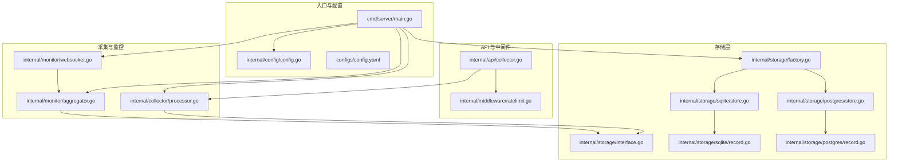
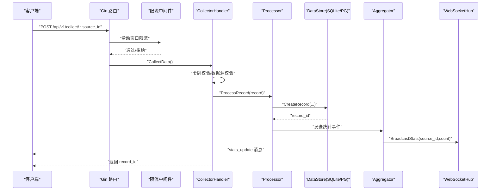
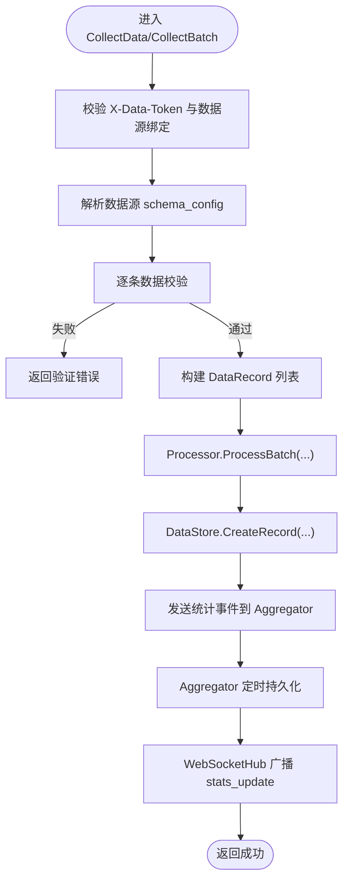
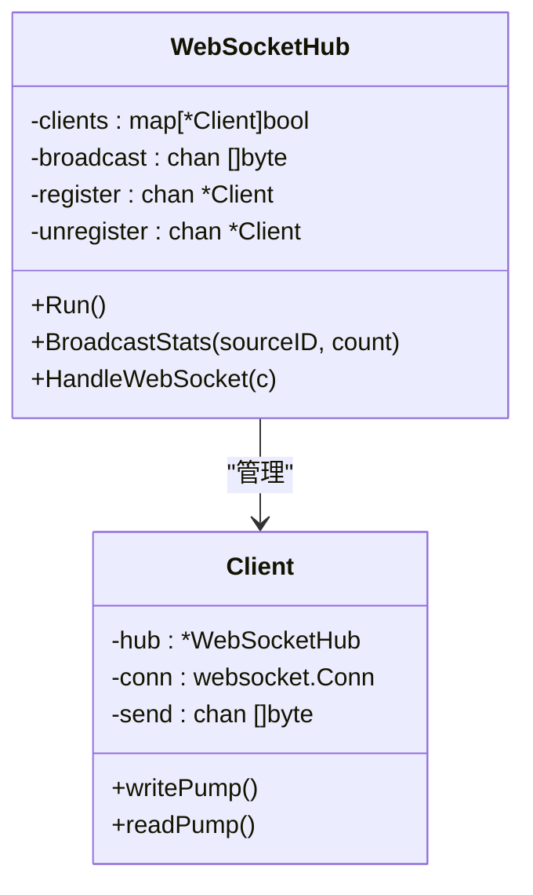
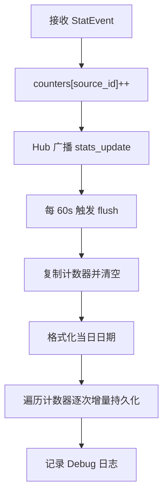
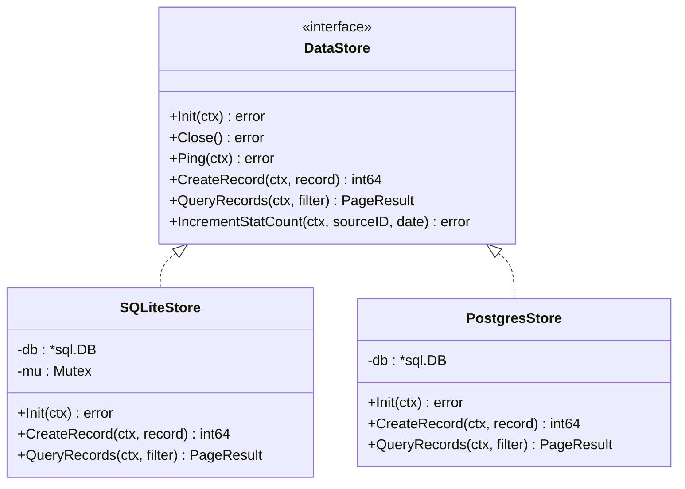
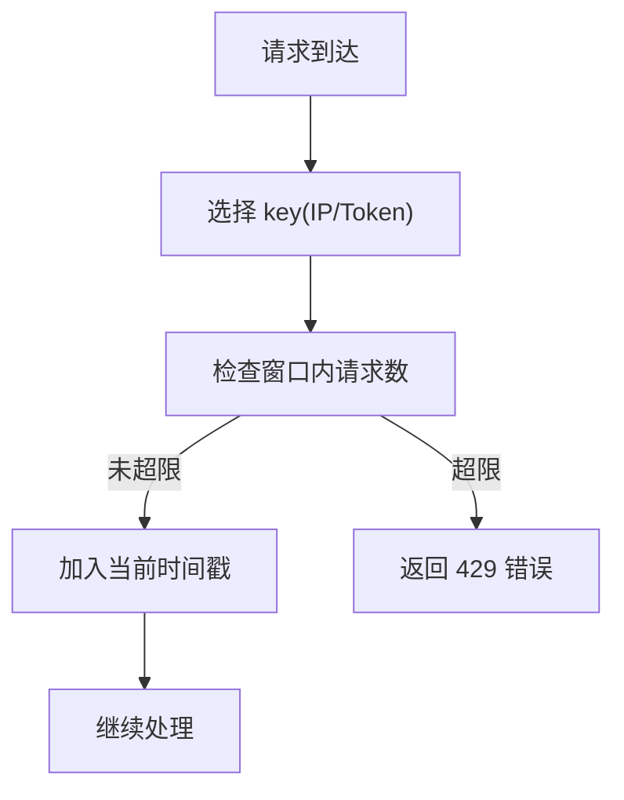
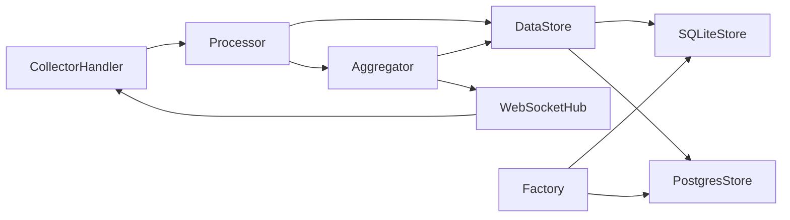

# 性能优化

<cite>
**本文引用的文件**
- [cmd/server/main.go](file://cmd/server/main.go)
- [internal/config/config.go](file://internal/config/config.go)
- [configs/config.yaml](file://configs/config.yaml)
- [internal/collector/processor.go](file://internal/collector/processor.go)
- [internal/monitor/aggregator.go](file://internal/monitor/aggregator.go)
- [internal/monitor/websocket.go](file://internal/monitor/websocket.go)
- [internal/storage/factory.go](file://internal/storage/factory.go)
- [internal/storage/interface.go](file://internal/storage/interface.go)
- [internal/storage/sqlite/store.go](file://internal/storage/sqlite/store.go)
- [internal/storage/sqlite/record.go](file://internal/storage/sqlite/record.go)
- [internal/storage/postgres/store.go](file://internal/storage/postgres/store.go)
- [internal/storage/postgres/record.go](file://internal/storage/postgres/record.go)
- [internal/api/collector.go](file://internal/api/collector.go)
- [internal/middleware/ratelimit.go](file://internal/middleware/ratelimit.go)
- [internal/model/record.go](file://internal/model/record.go)
</cite>

## 目录
1. [简介](#简介)
2. [项目结构](#项目结构)
3. [核心组件](#核心组件)
4. [架构总览](#架构总览)
5. [详细组件分析](#详细组件分析)
6. [依赖分析](#依赖分析)
7. [性能考虑](#性能考虑)
8. [故障排查指南](#故障排查指南)
9. [结论](#结论)
10. [附录](#附录)

## 简介
本指南聚焦于 DataCollector 的性能优化，系统性梳理数据采集与处理管道的性能瓶颈与优化策略，覆盖数据库查询与连接池、索引设计建议、WebSocket 连接与消息推送、缓存与内存使用、并发与 goroutine 管理、负载均衡与水平扩展、性能监控与基准测试、调优工具与调试技巧，并给出不同规模场景下的配置建议。

## 项目结构
DataCollector 采用分层清晰的 Go 项目结构：入口程序负责初始化与启动；API 层处理外部请求；采集器负责数据校验与落库；监控模块负责统计聚合与 WebSocket 推送；存储层抽象了 SQLite 与 PostgreSQL 的实现；中间件提供限流等横切能力。

**图表来源**
- [cmd/server/main.go:25-129](file://cmd/server/main.go#L25-L129)
- [internal/config/config.go:12-215](file://internal/config/config.go#L12-L215)
- [configs/config.yaml:1-41](file://configs/config.yaml#L1-L41)
- [internal/api/collector.go:15-289](file://internal/api/collector.go#L15-L289)
- [internal/middleware/ratelimit.go:12-137](file://internal/middleware/ratelimit.go#L12-L137)
- [internal/collector/processor.go:16-84](file://internal/collector/processor.go#L16-L84)
- [internal/monitor/aggregator.go:17-197](file://internal/monitor/aggregator.go#L17-L197)
- [internal/monitor/websocket.go:14-221](file://internal/monitor/websocket.go#L14-L221)
- [internal/storage/factory.go:11-22](file://internal/storage/factory.go#L11-L22)
- [internal/storage/interface.go:9-57](file://internal/storage/interface.go#L9-L57)
- [internal/storage/sqlite/store.go:17-86](file://internal/storage/sqlite/store.go#L17-L86)
- [internal/storage/sqlite/record.go:13-246](file://internal/storage/sqlite/record.go#L13-L246)
- [internal/storage/postgres/store.go:14-61](file://internal/storage/postgres/store.go#L14-L61)
- [internal/storage/postgres/record.go:13-249](file://internal/storage/postgres/record.go#L13-L249)

**章节来源**
- [cmd/server/main.go:25-129](file://cmd/server/main.go#L25-L129)
- [internal/config/config.go:12-215](file://internal/config/config.go#L12-L215)
- [configs/config.yaml:1-41](file://configs/config.yaml#L1-L41)

## 核心组件
- 入口与生命周期：初始化日志、加载配置、创建目录、数据库初始化与 Ping、JWT 管理器、WebSocket Hub、统计聚合器、数据处理器、HTTP 服务启动与优雅关闭。
- API 与限流：采集接口负责令牌校验、数据源校验、Schema 校验、批量处理与回包；限流中间件基于滑动窗口维护内存中的时间戳列表。
- 采集与统计：Processor 负责写入记录并发送统计事件；Aggregator 聚合内存计数并在定时器触发时持久化；WebSocket Hub 负责广播统计更新。
- 存储层：工厂按配置选择 SQLite 或 PostgreSQL；SQLite 使用 WAL 与 busy_timeout；PostgreSQL 默认连接池参数；接口统一抽象 CRUD 与统计方法。

**章节来源**
- [cmd/server/main.go:25-129](file://cmd/server/main.go#L25-L129)
- [internal/api/collector.go:15-289](file://internal/api/collector.go#L15-L289)
- [internal/middleware/ratelimit.go:12-137](file://internal/middleware/ratelimit.go#L12-L137)
- [internal/collector/processor.go:16-84](file://internal/collector/processor.go#L16-L84)
- [internal/monitor/aggregator.go:17-197](file://internal/monitor/aggregator.go#L17-L197)
- [internal/monitor/websocket.go:14-221](file://internal/monitor/websocket.go#L14-L221)
- [internal/storage/factory.go:11-22](file://internal/storage/factory.go#L11-L22)
- [internal/storage/sqlite/store.go:17-86](file://internal/storage/sqlite/store.go#L17-L86)
- [internal/storage/postgres/store.go:14-61](file://internal/storage/postgres/store.go#L14-L61)
- [internal/storage/interface.go:9-57](file://internal/storage/interface.go#L9-L57)

## 架构总览
下图展示从 HTTP 请求到数据入库、统计聚合与 WebSocket 推送的完整链路。

**图表来源**
- [internal/api/collector.go:29-140](file://internal/api/collector.go#L29-L140)
- [internal/middleware/ratelimit.go:100-137](file://internal/middleware/ratelimit.go#L100-L137)
- [internal/collector/processor.go:30-52](file://internal/collector/processor.go#L30-L52)
- [internal/storage/interface.go:37-43](file://internal/storage/interface.go#L37-L43)
- [internal/monitor/aggregator.go:76-87](file://internal/monitor/aggregator.go#L76-L87)
- [internal/monitor/websocket.go:108-132](file://internal/monitor/websocket.go#L108-L132)

## 详细组件分析

### 数据采集与处理管道
- 令牌校验与数据源校验：Handler 从请求头提取令牌，计算哈希后查询 Token 记录，校验状态与过期时间，同时校验 source_id 与令牌绑定一致。
- Schema 校验：解析数据源的 schema_config，使用采集器的校验函数对每条数据进行校验，失败则返回结构化错误。
- 批量处理：逐条构建 DataRecord 并调用 Processor.ProcessBatch，内部逐条写入并统计成功/失败数，最终返回汇总结果。
- 写入与统计：Processor 调用 DataStore.CreateRecord 写入记录，随后向 Aggregator 的事件通道发送统计事件；Aggregator 在定时器触发时将内存计数持久化到数据库，并通过 WebSocket Hub 广播实时统计。

**图表来源**
- [internal/api/collector.go:29-140](file://internal/api/collector.go#L29-L140)
- [internal/api/collector.go:142-289](file://internal/api/collector.go#L142-L289)
- [internal/collector/processor.go:30-84](file://internal/collector/processor.go#L30-L84)
- [internal/monitor/aggregator.go:47-133](file://internal/monitor/aggregator.go#L47-L133)
- [internal/monitor/websocket.go:108-132](file://internal/monitor/websocket.go#L108-L132)

**章节来源**
- [internal/api/collector.go:29-289](file://internal/api/collector.go#L29-L289)
- [internal/collector/processor.go:30-84](file://internal/collector/processor.go#L30-L84)
- [internal/monitor/aggregator.go:47-133](file://internal/monitor/aggregator.go#L47-L133)
- [internal/monitor/websocket.go:108-132](file://internal/monitor/websocket.go#L108-L132)

### WebSocket 连接管理与消息推送
- Hub 设计：使用注册/注销/广播三类通道与互斥锁保护客户端集合；广播时复制客户端列表以避免读写锁竞争；当客户端发送缓冲区满时主动断开，防止阻塞 Hub。
- 客户端泵：writePump 定期发送 Ping 并批量写出待发消息；readPump 设置读超时与 pong 处理器，异常关闭时自动注销。
- 推送策略：统计聚合器在内存计数变化时调用 Hub 广播 stats_update，消息体包含 source_id、今日计数与时间戳。

**图表来源**
- [internal/monitor/websocket.go:14-221](file://internal/monitor/websocket.go#L14-L221)

**章节来源**
- [internal/monitor/websocket.go:63-132](file://internal/monitor/websocket.go#L63-L132)
- [internal/monitor/websocket.go:134-221](file://internal/monitor/websocket.go#L134-L221)

### 统计聚合器与内存计数
- 事件通道：Aggregator 暴露只写通道给 Processor，内部使用带缓冲的 channel 缓冲统计事件。
- 内存计数：使用 map[int64]int64 存储每个数据源的当日计数，加互斥锁保护；定时器每 60 秒触发一次 flush。
- 持久化策略：flush 时复制计数器并清空，按日期字符串构造“当日”键，逐次调用 IncrementStatCount 增量更新；遇到错误仅记录日志，保证运行连续性。

**图表来源**
- [internal/monitor/aggregator.go:76-133](file://internal/monitor/aggregator.go#L76-L133)

**章节来源**
- [internal/monitor/aggregator.go:17-197](file://internal/monitor/aggregator.go#L17-L197)

### 存储层与数据库优化
- 工厂模式：根据配置的 driver 选择 SQLite 或 PostgreSQL 实现。
- SQLite：
  - 连接池：最大打开/空闲连接均为 1，适合单写场景。
  - WAL 模式与 busy_timeout：提升并发读写稳定性。
  - 写入路径：使用互斥锁保护写操作，避免并发写冲突。
- PostgreSQL：
  - 连接池：最大打开连接 25，空闲 5，适合高并发写入。
  - 查询路径：分页查询、导出查询均使用参数化查询与 LIMIT/OFFSET，避免全表扫描。
- 接口抽象：统一的 DataStore 接口屏蔽底层差异，便于替换与扩展。

**图表来源**
- [internal/storage/interface.go:9-57](file://internal/storage/interface.go#L9-L57)
- [internal/storage/sqlite/store.go:17-86](file://internal/storage/sqlite/store.go#L17-L86)
- [internal/storage/postgres/store.go:14-61](file://internal/storage/postgres/store.go#L14-L61)

**章节来源**
- [internal/storage/factory.go:11-22](file://internal/storage/factory.go#L11-L22)
- [internal/storage/sqlite/store.go:17-86](file://internal/storage/sqlite/store.go#L17-L86)
- [internal/storage/postgres/store.go:14-61](file://internal/storage/postgres/store.go#L14-L61)
- [internal/storage/sqlite/record.go:13-246](file://internal/storage/sqlite/record.go#L13-L246)
- [internal/storage/postgres/record.go:13-249](file://internal/storage/postgres/record.go#L13-L249)

### 限流中间件
- 滑动窗口：以分钟为窗口，内存中维护每个 key 的时间戳列表；定期清理过期记录。
- 中间件：支持按 IP 与按 Data Token 两种维度限流，超过阈值直接返回限流错误码并终止后续处理。

**图表来源**
- [internal/middleware/ratelimit.go:68-98](file://internal/middleware/ratelimit.go#L68-L98)

**章节来源**
- [internal/middleware/ratelimit.go:12-137](file://internal/middleware/ratelimit.go#L12-L137)

## 依赖分析
- 组件耦合：
  - API 层依赖 Processor 与 DataStore；Processor 依赖 DataStore 与 Aggregator 的事件通道。
  - Aggregator 依赖 DataStore 与 WebSocketHub；WebSocketHub 依赖 Gin 与 Gorilla WebSocket。
  - 存储层通过接口解耦，工厂按配置选择具体实现。
- 外部依赖：
  - Gin 路由框架、Gorilla WebSocket、SQLite3 驱动、pgx/stdlib PostgreSQL 驱动。
- 潜在环依赖：当前结构未见直接环依赖，但 Hub 与 Aggregator 之间存在单向依赖，注意避免在 Hub 中反向依赖 Aggregator 的业务逻辑。

**图表来源**
- [internal/api/collector.go:15-289](file://internal/api/collector.go#L15-L289)
- [internal/collector/processor.go:16-84](file://internal/collector/processor.go#L16-L84)
- [internal/monitor/aggregator.go:17-197](file://internal/monitor/aggregator.go#L17-L197)
- [internal/monitor/websocket.go:14-221](file://internal/monitor/websocket.go#L14-L221)
- [internal/storage/factory.go:11-22](file://internal/storage/factory.go#L11-L22)

**章节来源**
- [internal/api/collector.go:15-289](file://internal/api/collector.go#L15-L289)
- [internal/collector/processor.go:16-84](file://internal/collector/processor.go#L16-L84)
- [internal/monitor/aggregator.go:17-197](file://internal/monitor/aggregator.go#L17-L197)
- [internal/monitor/websocket.go:14-221](file://internal/monitor/websocket.go#L14-L221)
- [internal/storage/factory.go:11-22](file://internal/storage/factory.go#L11-L22)

## 性能考虑

### 数据库查询优化与索引设计
- 写入路径（SQLite/PG）：
  - 单条插入使用参数化查询，避免拼接与注入风险；SQLite 写入加互斥锁，确保单写安全。
  - PostgreSQL 连接池默认 25 个活跃连接，适合高并发写入；SQLite 使用 WAL 与 busy_timeout 提升并发读写稳定性。
- 查询路径（PG/SQLite）：
  - 分页查询使用 LIMIT/OFFSET，建议在 created_at 上建立索引以加速排序与范围过滤。
  - 导出查询不使用分页，建议控制导出范围与并发，避免大结果集导致内存压力。
- 建议索引（示例）：
  - data_records(source_id, created_at)
  - data_records(created_at)
  - data_tokens(hash)
  - data_sources(id)

**章节来源**
- [internal/storage/sqlite/record.go:13-35](file://internal/storage/sqlite/record.go#L13-L35)
- [internal/storage/postgres/record.go:13-34](file://internal/storage/postgres/record.go#L13-L34)
- [internal/storage/sqlite/store.go:39-53](file://internal/storage/sqlite/store.go#L39-L53)
- [internal/storage/postgres/store.go:29-32](file://internal/storage/postgres/store.go#L29-L32)

### 连接池配置
- SQLite：
  - MaxOpenConns/MaxIdleConns 均为 1，适合单写场景；如需更高并发读取，可考虑 WAL 模式下的只读连接池配合读写分离。
- PostgreSQL：
  - MaxOpenConns=25，MaxIdleConns=5；可根据 CPU 核数与数据库资源调整，避免过度占用。
- 建议：
  - 通过环境变量覆盖连接池参数（已在配置中支持环境变量覆盖），结合压测结果动态调整。
  - 对长事务与批量导入场景，考虑临时提高 MaxOpenConns 并缩短连接生命周期。

**章节来源**
- [internal/config/config.go:148-195](file://internal/config/config.go#L148-L195)
- [internal/storage/sqlite/store.go:39-53](file://internal/storage/sqlite/store.go#L39-L53)
- [internal/storage/postgres/store.go:29-32](file://internal/storage/postgres/store.go#L29-L32)

### WebSocket 连接管理与消息推送优化
- 连接管理：
  - Hub 使用 RWMutex 保护客户端集合，广播前复制客户端列表，减少锁持有时间。
  - 当客户端 send 缓冲区满时主动断开，避免阻塞 Hub 主循环。
- 心跳与保活：
  - writePump 每 30 秒发送一次 Ping，readPump 设置读超时与 pong 处理器，异常关闭时自动注销。
- 消息推送：
  - 统一 JSON 结构，广播通道使用非阻塞发送，若队列满则丢弃并记录告警，避免影响主流程。
- 建议：
  - 控制单节点客户端数量上限，必要时引入多节点与消息分片。
  - 对高频统计源可考虑合并推送或降低推送频率。

**章节来源**
- [internal/monitor/websocket.go:63-132](file://internal/monitor/websocket.go#L63-L132)
- [internal/monitor/websocket.go:134-221](file://internal/monitor/websocket.go#L134-L221)

### 缓存策略与内存使用优化
- 内存计数：
  - Aggregator 使用 map[int64]int64 存放当日计数，加互斥锁保护；flush 后清空，避免长期增长。
  - 建议：对热点数据源可考虑 LRU 缓存或外部 Redis 缓存，降低内存压力。
- 事件通道：
  - Aggregator 的事件通道容量为 1000，避免瞬时高峰阻塞；Processor 发送统计事件时使用非阻塞 select，防止阻塞写入。
- 建议：
  - 对查询热点（如最近统计趋势）引入短期缓存，设置合理 TTL。
  - 控制日志级别与输出，避免在生产环境开启过多 debug 日志。

**章节来源**
- [internal/monitor/aggregator.go:30-45](file://internal/monitor/aggregator.go#L30-L45)
- [internal/collector/processor.go:42-49](file://internal/collector/processor.go#L42-L49)

### 并发处理与 goroutine 管理最佳实践
- 入口 goroutine：
  - HTTP 服务、WebSocket Hub、统计聚合器均在独立 goroutine 中运行，入口 main.go 负责优雅关闭。
- Hub 主循环：
  - 使用 select 处理 register/unregister/broadcast 三种事件，避免阻塞。
- writePump/readPump：
  - 分离读写泵，各自独立 goroutine，减少相互影响。
- 建议：
  - 对长时间任务（如 flush）使用 context 控制超时，避免阻塞退出。
  - 使用 worker pool 或带缓冲的队列替代无限 goroutine，防止资源耗尽。

**章节来源**
- [cmd/server/main.go:70-129](file://cmd/server/main.go#L70-L129)
- [internal/monitor/websocket.go:154-195](file://internal/monitor/websocket.go#L154-L195)
- [internal/monitor/websocket.go:197-221](file://internal/monitor/websocket.go#L197-L221)

### 负载均衡与水平扩展方案
- 单机扩展：
  - PostgreSQL 连接池参数可按 CPU 与内存线性扩展；SQLite 适合单实例写入，不适合水平扩展。
- 多实例部署：
  - 多实例共享 PostgreSQL；WebSocket 广播可通过外部消息队列（如 Redis Pub/Sub）实现跨节点广播。
  - 限流可在网关层集中实现，避免多实例重复计数。
- 建议：
  - 使用反向代理（Nginx/Haproxy）做健康检查与会话保持；
  - 对写密集型场景优先选择 PostgreSQL 并启用 WAL 归档与备份策略。

**章节来源**
- [internal/storage/postgres/store.go:14-61](file://internal/storage/postgres/store.go#L14-L61)
- [internal/monitor/websocket.go:14-221](file://internal/monitor/websocket.go#L14-L221)

### 性能监控指标与基准测试
- 指标建议：
  - QPS、P95/P99 延迟、错误率（4xx/5xx）、数据库连接池使用率、WebSocket 客户端数量、Hub 广播队列长度、内存使用与 GC 次数。
- 基准测试：
  - 使用 go test 的 -bench 与 -benchtime 指定迭代次数，模拟高并发写入与查询；
  - 使用 wrk/ab 对 /api/v1/collect 接口进行压测，逐步提升并发与批量大小，观察延迟与错误率拐点。
- 建议：
  - 在 CI 中集成基准测试，对比不同配置的性能差异；
  - 生产环境开启采样日志与慢查询追踪，定位热点路径。

**章节来源**
- [internal/api/collector.go:29-140](file://internal/api/collector.go#L29-L140)
- [internal/collector/processor.go:54-84](file://internal/collector/processor.go#L54-L84)

### 调优工具与调试技巧
- 工具：
  - pprof：CPU/内存剖析，定位热点函数；
  - go test -bench：基准测试；
  - 慢查询日志：PostgreSQL 开启慢查询日志，定位低效 SQL；
  - Prometheus/Grafana：采集自定义指标与系统指标。
- 调试技巧：
  - 逐步禁用限流与 WebSocket 广播，确认瓶颈位置；
  - 使用较小批量与较低并发复现问题，再逐步放大；
  - 对关键路径添加结构化日志，记录上下文与耗时。

**章节来源**
- [internal/monitor/websocket.go:108-132](file://internal/monitor/websocket.go#L108-L132)
- [internal/storage/postgres/record.go:65-152](file://internal/storage/postgres/record.go#L65-L152)

### 不同规模场景下的性能配置建议
- 小规模（开发/小团队）：
  - 使用 SQLite，PostgreSQL 连接池设为 5~10；Hub 客户端上限 100；日志级别 info。
- 中规模（单实例多租户）：
  - 使用 PostgreSQL，连接池 20~30；Hub 客户端上限 500；开启慢查询日志；启用 Redis 缓存热点数据。
- 大规模（多实例高并发）：
  - 多实例共享 PostgreSQL；引入消息队列实现跨节点广播；限流与缓存前置到网关；启用连接池池化与连接复用；监控与告警完善。

**章节来源**
- [internal/config/config.go:100-146](file://internal/config/config.go#L100-L146)
- [internal/storage/postgres/store.go:29-32](file://internal/storage/postgres/store.go#L29-L32)
- [internal/monitor/websocket.go:14-221](file://internal/monitor/websocket.go#L14-L221)

## 故障排查指南
- 数据库连接失败：
  - 检查 DSN 与凭据；确认 Ping 成功；查看连接池参数是否合理。
- 写入性能下降：
  - 检查 SQLite 是否被多 goroutine 并发写入（应通过互斥锁）；评估 WAL 模式与 busy_timeout 设置。
- WebSocket 掉线频繁：
  - 检查客户端 send 缓冲区是否溢出；确认 read 超时与 pong 处理器配置；观察 Hub 日志中的断开原因。
- 统计不准确：
  - 检查 flush 触发周期与错误日志；确认 IncrementStatCount 的幂等性与重试策略。
- 限流误伤：
  - 检查滑动窗口清理 goroutine 是否正常；核对 IP/Token 限流阈值与请求头是否正确传递。

**章节来源**
- [cmd/server/main.go:53-64](file://cmd/server/main.go#L53-L64)
- [internal/storage/sqlite/store.go:39-53](file://internal/storage/sqlite/store.go#L39-L53)
- [internal/monitor/websocket.go:197-221](file://internal/monitor/websocket.go#L197-L221)
- [internal/monitor/aggregator.go:94-133](file://internal/monitor/aggregator.go#L94-L133)
- [internal/middleware/ratelimit.go:33-66](file://internal/middleware/ratelimit.go#L33-L66)

## 结论
DataCollector 的性能优化围绕“数据库连接池与查询优化、WebSocket 连接与消息推送、内存与缓存策略、并发与 goroutine 管理、负载均衡与水平扩展、监控与基准测试”六大方面展开。通过合理的索引设计、连接池参数、Hub 广播策略与限流机制，可在不同规模场景下获得稳定且可扩展的性能表现。建议在生产环境中持续监控关键指标，结合基准测试与剖析工具进行迭代优化。

## 附录
- 配置参考：
  - server.host/port/mode
  - database.driver/sqlite.path/postgres.*
  - jwt.secret/expiry
  - collector.max_body_size/rate_limit_per_token/rate_limit_per_ip/allowed_origins
  - log.level/format/output/file_path/max_size/max_age
- 环境变量覆盖：
  - DB_DRIVER、DB_SQLITE_PATH、DB_HOST、DB_PORT、DB_USER、DB_PASSWORD、DB_NAME、SERVER_PORT、JWT_SECRET、LOG_LEVEL

**章节来源**
- [configs/config.yaml:1-41](file://configs/config.yaml#L1-L41)
- [internal/config/config.go:82-195](file://internal/config/config.go#L82-L195)