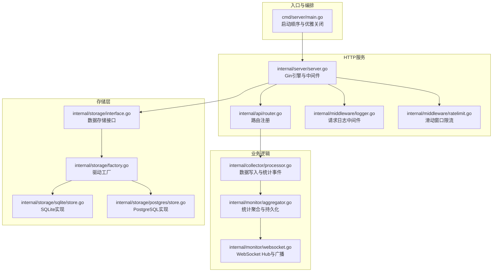
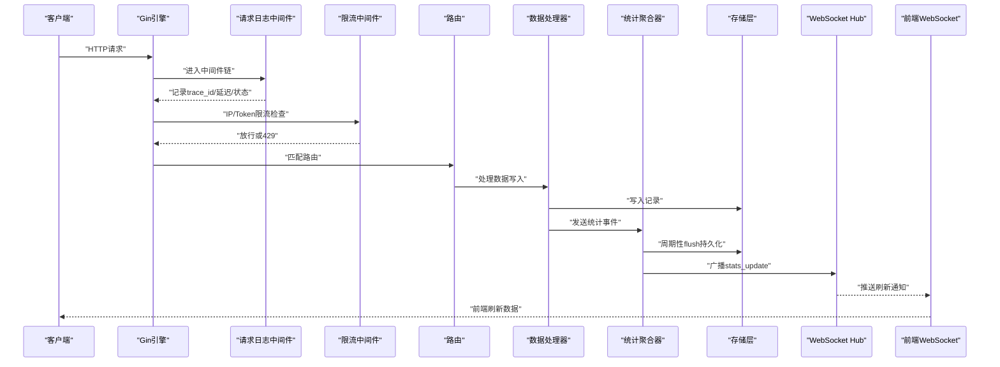
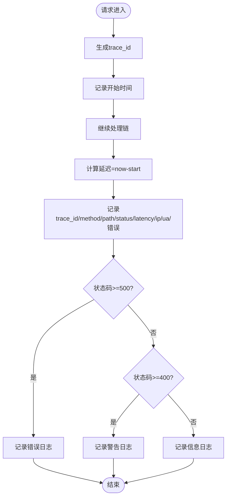
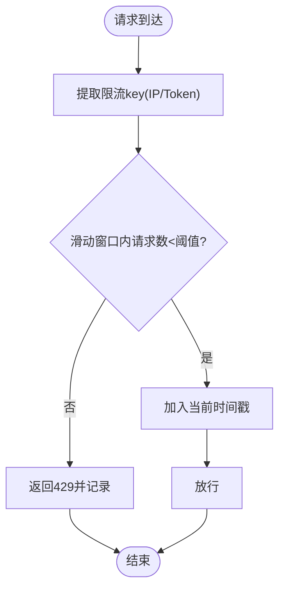
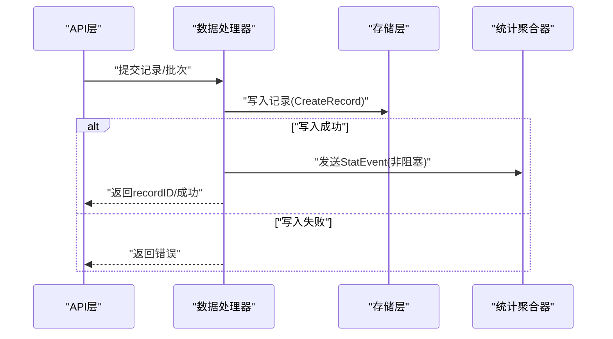
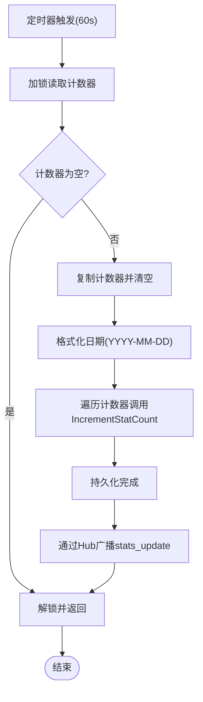
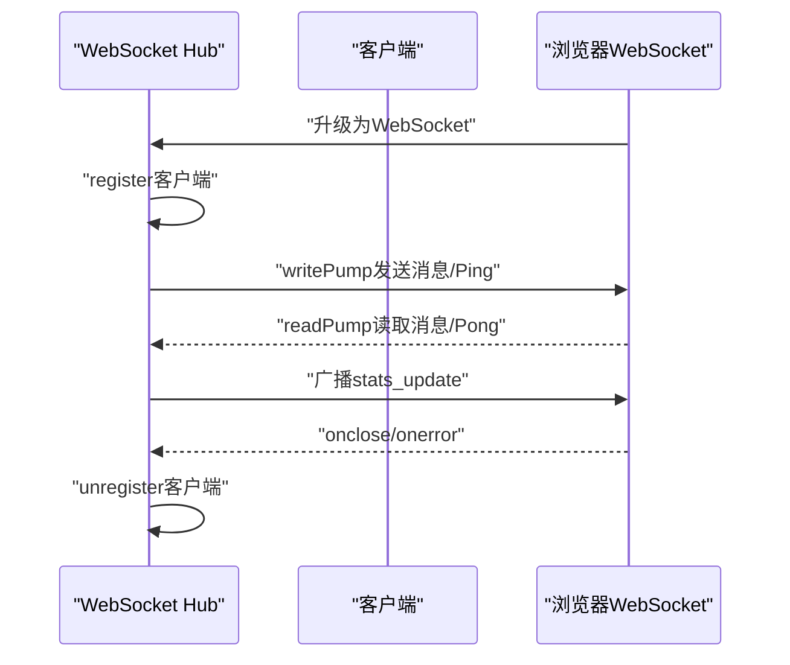
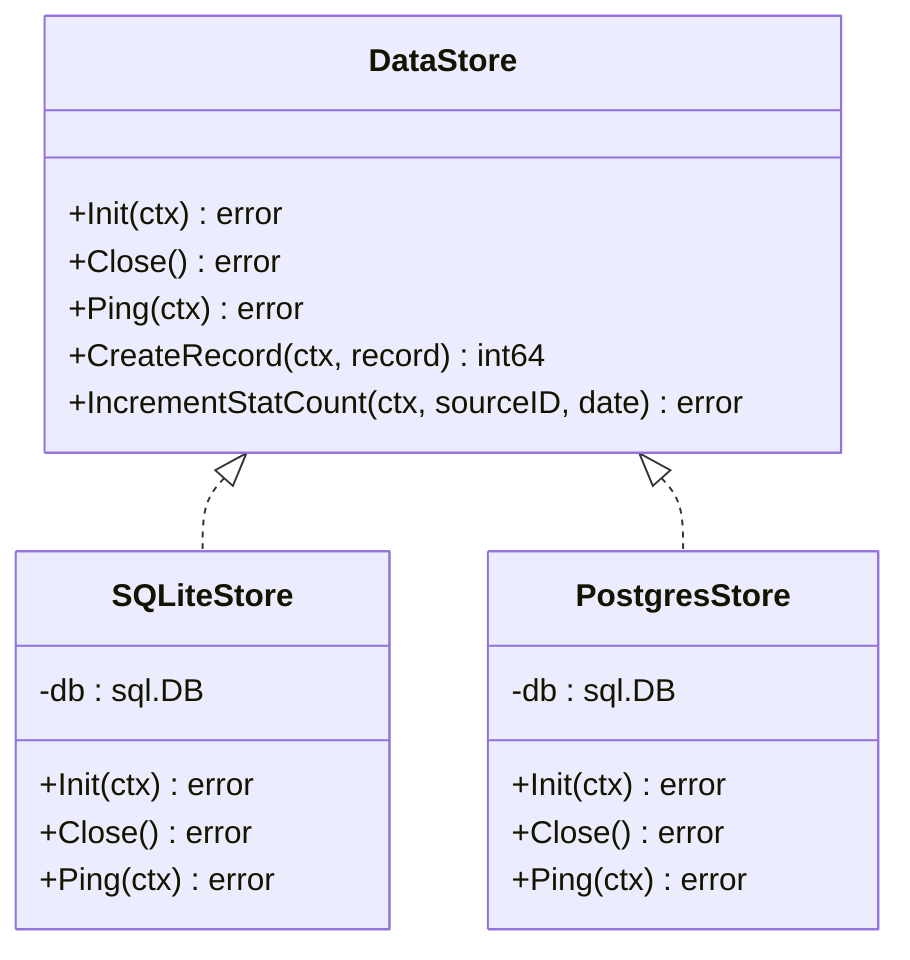
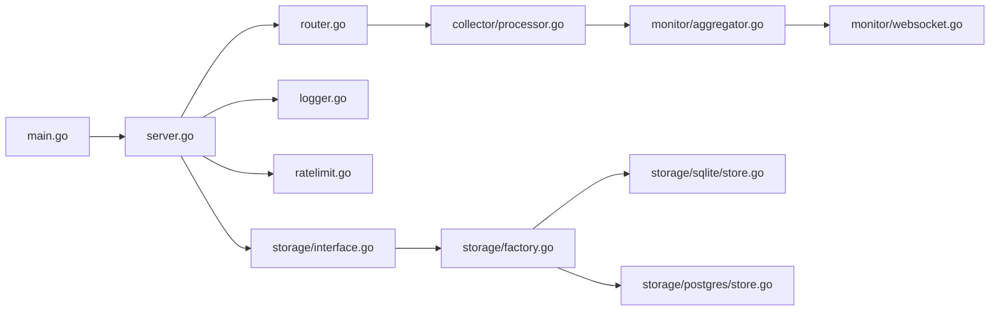

# 性能监控

<cite>
**本文引用的文件**
- [cmd/server/main.go](file://cmd/server/main.go)
- [internal/server/server.go](file://internal/server/server.go)
- [internal/api/router.go](file://internal/api/router.go)
- [internal/middleware/logger.go](file://internal/middleware/logger.go)
- [internal/middleware/ratelimit.go](file://internal/middleware/ratelimit.go)
- [internal/monitor/aggregator.go](file://internal/monitor/aggregator.go)
- [internal/monitor/websocket.go](file://internal/monitor/websocket.go)
- [internal/collector/processor.go](file://internal/collector/processor.go)
- [internal/storage/interface.go](file://internal/storage/interface.go)
- [internal/storage/factory.go](file://internal/storage/factory.go)
- [internal/storage/sqlite/store.go](file://internal/storage/sqlite/store.go)
- [internal/storage/postgres/store.go](file://internal/storage/postgres/store.go)
- [internal/model/statistics.go](file://internal/model/statistics.go)
- [configs/config.yaml](file://configs/config.yaml)
- [web/src/stores/websocket.ts](file://web/src/stores/websocket.ts)
- [web/src/composables/useWebSocket.ts](file://web/src/composables/useWebSocket.ts)
- [internal/api/health.go](file://internal/api/health.go)
</cite>

## 目录
1. [简介](#简介)
2. [项目结构](#项目结构)
3. [核心组件](#核心组件)
4. [架构总览](#架构总览)
5. [详细组件分析](#详细组件分析)
6. [依赖分析](#依赖分析)
7. [性能考虑](#性能考虑)
8. [故障排查指南](#故障排查指南)
9. [结论](#结论)
10. [附录](#附录)

## 简介
本指南面向DataCollector的性能监控与优化，聚焦以下KPI与实践：
- 关键性能指标（KPI）定义与监控方法：吞吐量（QPS）、延迟（P95/P99）、错误率、数据库写入延迟、WebSocket推送延迟、内存使用与连接池健康度。
- 数据库查询与写入性能：SQLite与PostgreSQL的连接池、WAL模式、busy_timeout等对写入吞吐与并发的影响。
- API响应时间跟踪：基于结构化请求日志的延迟计算与错误率统计。
- 内存使用监控：统计聚合器的内存计数器、通道容量与锁竞争。
- WebSocket连接状态与消息推送延迟：Hub运行、Ping/Pong心跳、广播队列与客户端缓冲区。
- 基准与压力测试：建议的场景与指标采集方式。
- 告警与异常检测：基于日志级别、健康检查、限流触发与数据库连通性。
- APM集成与自定义指标：结合现有日志结构化字段与统计事件通道扩展。
- 数据分析与趋势预测：按来源维度的每日趋势与可视化。
- 不同部署环境的监控配置差异：SQLite与PostgreSQL、日志轮转与输出。

## 项目结构
DataCollector采用分层架构：入口程序负责启动与编排；HTTP服务封装Gin引擎，注册中间件与路由；收集器负责数据写入与统计事件；监控模块负责统计聚合与WebSocket推送；存储层抽象了SQLite与PostgreSQL实现。

**图表来源**
- [cmd/server/main.go:25-129](file://cmd/server/main.go#L25-L129)
- [internal/server/server.go:54-87](file://internal/server/server.go#L54-L87)
- [internal/api/router.go:12-116](file://internal/api/router.go#L12-L116)
- [internal/middleware/logger.go:11-67](file://internal/middleware/logger.go#L11-L67)
- [internal/middleware/ratelimit.go:12-137](file://internal/middleware/ratelimit.go#L12-L137)
- [internal/collector/processor.go:16-52](file://internal/collector/processor.go#L16-L52)
- [internal/monitor/aggregator.go:17-87](file://internal/monitor/aggregator.go#L17-L87)
- [internal/monitor/websocket.go:14-61](file://internal/monitor/websocket.go#L14-L61)
- [internal/storage/interface.go:9-57](file://internal/storage/interface.go#L9-L57)
- [internal/storage/factory.go:11-21](file://internal/storage/factory.go#L11-L21)
- [internal/storage/sqlite/store.go:17-56](file://internal/storage/sqlite/store.go#L17-L56)
- [internal/storage/postgres/store.go:14-34](file://internal/storage/postgres/store.go#L14-L34)

**章节来源**
- [cmd/server/main.go:25-129](file://cmd/server/main.go#L25-L129)
- [internal/server/server.go:54-87](file://internal/server/server.go#L54-L87)
- [internal/api/router.go:12-116](file://internal/api/router.go#L12-L116)

## 核心组件
- HTTP请求日志中间件：记录trace_id、方法、路径、状态码、延迟、客户端IP、User-Agent及错误集合，便于端到端追踪与延迟分析。
- 滑动窗口限流中间件：基于内存map+定时清理，按IP与Data Token维度进行每分钟限流，超限返回429。
- 数据处理器：写入数据记录后向统计事件通道发送事件，非阻塞发送，避免阻塞主流程。
- 统计聚合器：每60秒flush一次，将内存计数器批量持久化至数据库，并通过WebSocket Hub广播“stats_update”刷新通知。
- WebSocket Hub：维护客户端连接、广播消息、心跳Ping/Pong、发送缓冲区溢出处理。
- 存储层：SQLite单写连接+WAL+busy_timeout；PostgreSQL连接池配置；工厂按配置选择驱动。

**章节来源**
- [internal/middleware/logger.go:11-67](file://internal/middleware/logger.go#L11-L67)
- [internal/middleware/ratelimit.go:12-137](file://internal/middleware/ratelimit.go#L12-L137)
- [internal/collector/processor.go:16-52](file://internal/collector/processor.go#L16-L52)
- [internal/monitor/aggregator.go:17-87](file://internal/monitor/aggregator.go#L17-L87)
- [internal/monitor/websocket.go:14-61](file://internal/monitor/websocket.go#L14-L61)
- [internal/storage/sqlite/store.go:17-56](file://internal/storage/sqlite/store.go#L17-L56)
- [internal/storage/postgres/store.go:14-34](file://internal/storage/postgres/store.go#L14-L34)

## 架构总览
DataCollector的性能监控围绕“请求日志+统计事件+聚合持久化+WebSocket推送”的闭环展开。入口程序负责启动HTTP服务、WebSocket Hub与统计聚合器；HTTP服务通过中间件记录请求延迟与错误；数据写入完成后产生统计事件，聚合器周期性持久化并广播；前端通过WebSocket接收“stats_update”刷新通知。

**图表来源**
- [internal/middleware/logger.go:11-67](file://internal/middleware/logger.go#L11-L67)
- [internal/middleware/ratelimit.go:12-137](file://internal/middleware/ratelimit.go#L12-L137)
- [internal/api/router.go:12-116](file://internal/api/router.go#L12-L116)
- [internal/collector/processor.go:16-52](file://internal/collector/processor.go#L16-L52)
- [internal/monitor/aggregator.go:47-133](file://internal/monitor/aggregator.go#L47-L133)
- [internal/monitor/websocket.go:63-127](file://internal/monitor/websocket.go#L63-L127)

## 详细组件分析

### 组件A：HTTP请求日志与延迟跟踪
- KPI定义
  - QPS：按路径/方法聚合请求计数。
  - 延迟分布：P50/P95/P99（基于latency字段）。
  - 错误率：状态码>=400的请求占比。
- 监控方法
  - 使用结构化日志字段trace_id、method、path、status、latency、client_ip、user_agent。
  - 在APM中建立索引与仪表盘，按路径与状态码分桶统计。
- 性能影响
  - 日志级别与字段数量会影响I/O与CPU；建议生产环境使用JSON与info级别。

**图表来源**
- [internal/middleware/logger.go:11-67](file://internal/middleware/logger.go#L11-L67)

**章节来源**
- [internal/middleware/logger.go:11-67](file://internal/middleware/logger.go#L11-L67)

### 组件B：滑动窗口限流与异常检测
- KPI定义
  - 限流命中率：被拒绝的请求/总请求数。
  - 限流触发的429比例。
- 监控方法
  - 统计429响应次数与总量，按IP与Token维度拆分。
  - 结合日志中的trace_id进行回溯。
- 异常检测
  - 当某IP或Token的429比例异常升高，触发告警。
  - 定期清理过期记录，避免内存膨胀。

**图表来源**
- [internal/middleware/ratelimit.go:68-98](file://internal/middleware/ratelimit.go#L68-L98)

**章节来源**
- [internal/middleware/ratelimit.go:12-137](file://internal/middleware/ratelimit.go#L12-L137)

### 组件C：数据处理器与统计事件
- KPI定义
  - 写入成功率：ProcessBatch成功数/总批处理数。
  - 统计事件发送成功率：非阻塞发送，丢弃则视为失败。
- 监控方法
  - 在ProcessRecord/ProcessBatch中记录成功/失败计数与最后错误。
  - 通过统计事件通道观察事件积压情况（通道长度）。

**图表来源**
- [internal/collector/processor.go:30-83](file://internal/collector/processor.go#L30-L83)
- [internal/monitor/aggregator.go:42-82](file://internal/monitor/aggregator.go#L42-L82)

**章节来源**
- [internal/collector/processor.go:16-83](file://internal/collector/processor.go#L16-L83)

### 组件D：统计聚合器与数据库持久化
- KPI定义
  - flush周期：默认60秒。
  - 每次flush的事件数与耗时。
  - 数据库写入延迟（从flush开始到完成）。
- 监控方法
  - 记录flush开始/结束时间与事件计数。
  - 观察日志中的flush计数与日期标签。
- 性能影响
  - 内存计数器map的加锁与复制成本。
  - 批量调用IncrementStatCount的数据库写入成本。

**图表来源**
- [internal/monitor/aggregator.go:47-133](file://internal/monitor/aggregator.go#L47-L133)

**章节来源**
- [internal/monitor/aggregator.go:17-197](file://internal/monitor/aggregator.go#L17-L197)
- [internal/model/statistics.go:5-20](file://internal/model/statistics.go#L5-L20)

### 组件E：WebSocket连接状态与消息推送延迟
- KPI定义
  - 连接数：Hub维护的客户端数量。
  - 广播队列长度：hub.broadcast通道长度。
  - 客户端发送缓冲区：client.send容量与溢出次数。
  - 心跳：Ping/Pong周期与超时。
- 监控方法
  - 记录register/unregister事件与客户端数量。
  - 监控broadcast通道满导致的消息丢弃。
  - 前端store/websocket.ts与composables/useWebSocket.ts提供连接状态与重连逻辑。

**图表来源**
- [internal/monitor/websocket.go:63-127](file://internal/monitor/websocket.go#L63-L127)
- [web/src/stores/websocket.ts:23-83](file://web/src/stores/websocket.ts#L23-L83)
- [web/src/composables/useWebSocket.ts:9-65](file://web/src/composables/useWebSocket.ts#L9-L65)

**章节来源**
- [internal/monitor/websocket.go:14-216](file://internal/monitor/websocket.go#L14-L216)
- [web/src/stores/websocket.ts:1-83](file://web/src/stores/websocket.ts#L1-L83)
- [web/src/composables/useWebSocket.ts:1-65](file://web/src/composables/useWebSocket.ts#L1-L65)

### 组件F：数据库连接池与写入性能
- SQLite
  - 单写连接+WAL模式+busy_timeout，适合轻量写入场景。
  - 连接池：MaxOpenConns=1，MaxIdleConns=1。
- PostgreSQL
  - 连接池：MaxOpenConns=25，MaxIdleConns=5。
- 监控方法
  - 通过PingContext检查连通性。
  - 观察flush耗时与数据库错误日志。
  - 在高并发场景下评估PostgreSQL连接池上限。

**图表来源**
- [internal/storage/interface.go:9-57](file://internal/storage/interface.go#L9-L57)
- [internal/storage/sqlite/store.go:17-56](file://internal/storage/sqlite/store.go#L17-L56)
- [internal/storage/postgres/store.go:14-34](file://internal/storage/postgres/store.go#L14-L34)

**章节来源**
- [internal/storage/sqlite/store.go:17-56](file://internal/storage/sqlite/store.go#L17-L56)
- [internal/storage/postgres/store.go:14-34](file://internal/storage/postgres/store.go#L14-L34)
- [internal/storage/factory.go:11-21](file://internal/storage/factory.go#L11-L21)

## 依赖分析
- 组件耦合
  - main.go耦合server、storage、auth、monitor、collector包，负责启动与优雅关闭。
  - server.go依赖router、middleware、auth、monitor、collector，组装HTTP服务。
  - router.go依赖各handler与rateLimiter，组织路由与中间件。
  - monitor.aggregator依赖collector.StatEvent与storage.DataStore。
  - monitor.websocket依赖gin与gorilla/websocket。
  - storage.factory根据配置选择具体实现。
- 外部依赖
  - Gin、gorilla/websocket、sqlite3、pgx/stdlib、lumberjack（日志轮转）。

**图表来源**
- [cmd/server/main.go:25-129](file://cmd/server/main.go#L25-L129)
- [internal/server/server.go:54-87](file://internal/server/server.go#L54-L87)
- [internal/api/router.go:12-116](file://internal/api/router.go#L12-L116)
- [internal/collector/processor.go:16-52](file://internal/collector/processor.go#L16-L52)
- [internal/monitor/aggregator.go:17-87](file://internal/monitor/aggregator.go#L17-L87)
- [internal/monitor/websocket.go:14-61](file://internal/monitor/websocket.go#L14-L61)
- [internal/storage/interface.go:9-57](file://internal/storage/interface.go#L9-L57)
- [internal/storage/factory.go:11-21](file://internal/storage/factory.go#L11-L21)

**章节来源**
- [cmd/server/main.go:25-129](file://cmd/server/main.go#L25-L129)
- [internal/server/server.go:54-87](file://internal/server/server.go#L54-L87)
- [internal/api/router.go:12-116](file://internal/api/router.go#L12-L116)

## 性能考虑
- API响应时间
  - 借助请求日志中间件的latency字段，按路径与状态码统计P50/P95/P99。
  - 对慢查询与错误较多的端点进行专项优化。
- 数据库写入
  - SQLite：WAL+busy_timeout提升并发写入稳定性；注意单写限制。
  - PostgreSQL：合理设置MaxOpenConns，避免连接池耗尽。
- 统计聚合
  - flush周期60秒，事件通道容量1000；在高并发场景下可评估增大通道容量与缩短flush周期。
  - 非阻塞发送统计事件，避免阻塞写入主流程。
- WebSocket
  - 客户端send缓冲区容量256；广播队列满会丢弃消息，需关注丢弃日志。
  - 心跳周期30秒，超时自动断开，前端具备自动重连机制。
- 日志与性能
  - 生产环境建议使用文件轮转与info级别，避免过多debug日志影响性能。
  - JSON格式日志便于APM解析与检索。

[本节为通用指导，无需列出章节来源]

## 故障排查指南
- 健康检查
  - 健康检查接口会Ping数据库，失败返回503；结合日志定位数据库问题。
- 限流频繁
  - 检查429响应与trace_id，确认IP或Token维度的限流阈值是否合理。
- 写入失败
  - 查看数据处理器返回的错误与存储层日志，定位具体失败原因。
- WebSocket断线
  - 关注Hub的unregister与writePump/Ping日志；前端store具备自动重连。
- 日志级别与输出
  - 检查配置文件中的log.level与log.output，必要时切换到文件轮转。

**章节来源**
- [internal/api/health.go:36-64](file://internal/api/health.go#L36-L64)
- [internal/middleware/ratelimit.go:100-137](file://internal/middleware/ratelimit.go#L100-L137)
- [internal/monitor/websocket.go:149-215](file://internal/monitor/websocket.go#L149-L215)
- [configs/config.yaml:34-41](file://configs/config.yaml#L34-L41)

## 结论
DataCollector的性能监控以结构化日志、统计事件与WebSocket推送为核心闭环。通过合理的数据库连接池配置、限流策略与聚合周期，可在保证吞吐的同时维持可观测性。建议在生产环境中启用文件日志轮转、细化KPI指标与告警阈值，并结合前端WebSocket刷新机制实现近实时的性能反馈。

[本节为总结，无需列出章节来源]

## 附录

### A. 关键KPI与监控清单
- API层
  - QPS、P50/P95/P99延迟、错误率（4xx/5xx）
  - 429限流命中率与热点IP/Token
- 存储层
  - flush周期耗时、事件数、数据库写入错误
  - SQLite/PG连接池利用率与busy_timeout触发
- 监控层
  - Hub客户端数量、广播队列长度、消息丢弃数
  - 心跳Ping/Pong成功率、客户端缓冲区溢出
- 前端
  - WebSocket连接状态、自动重连次数、刷新延迟

[本节为概览，无需列出章节来源]

### B. 基准与压力测试实施建议
- 场景设计
  - 单接口QPS逐步提升，观察延迟与错误率拐点。
  - 并发WebSocket连接数与消息广播频率测试。
  - 高频flush与数据库写入压力测试。
- 指标采集
  - 使用现有日志字段与APM指标结合。
  - 记录trace_id以便回溯。
- 工具建议
  - wrk/ab压测HTTP接口；自定义WebSocket客户端模拟前端刷新。

[本节为通用指导，无需列出章节来源]

### C. 告警与异常检测策略
- 基于日志
  - 错误/警告日志量突增；数据库连通性失败。
- 基于指标
  - 延迟P95/P99超阈值；429比例异常；flush耗时增长；WebSocket丢弃数上升。
- 自动恢复
  - WebSocket断线自动重连；数据库连接池超时重试。

[本节为通用指导，无需列出章节来源]

### D. APM工具集成与自定义指标
- 集成要点
  - 将trace_id注入APM；利用method/path/status/latency构建仪表盘。
  - 将统计事件通道长度、flush耗时、Hub客户端数作为自定义指标。
- 自定义指标开发
  - 在aggregator与websocket中埋点，上报至APM或Prometheus。

[本节为通用指导，无需列出章节来源]

### E. 性能数据分析与趋势预测
- 指标来源
  - 每日趋势来源于统计表的按日期聚合。
- 分析方法
  - 按来源ID与日期绘制趋势图，识别异常波动。
  - 结合业务高峰时段进行对比分析。

**章节来源**
- [internal/model/statistics.go:5-20](file://internal/model/statistics.go#L5-L20)

### F. 不同部署环境的监控配置差异
- SQLite
  - 单写+WAL+busy_timeout，适合低并发与单机部署。
- PostgreSQL
  - 连接池较大，适合高并发与多实例部署。
- 日志
  - stdout与file两种输出，生产建议file+轮转。
- 配置参考
  - server.host/port/mode、jwt.secret/expiry、collector限流阈值、log级别与输出。

**章节来源**
- [configs/config.yaml:1-41](file://configs/config.yaml#L1-L41)
- [internal/storage/sqlite/store.go:39-53](file://internal/storage/sqlite/store.go#L39-L53)
- [internal/storage/postgres/store.go:29-32](file://internal/storage/postgres/store.go#L29-L32)