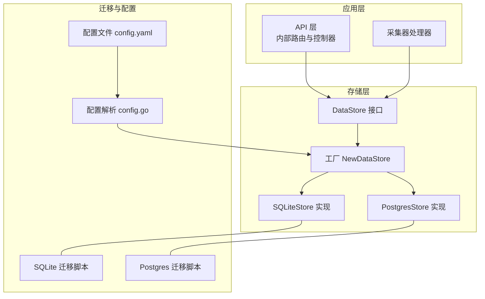
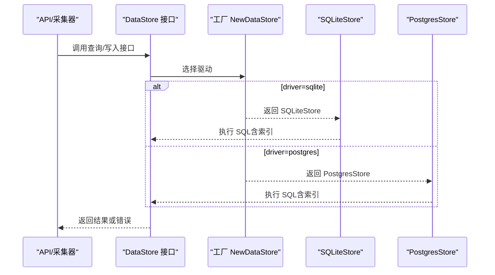
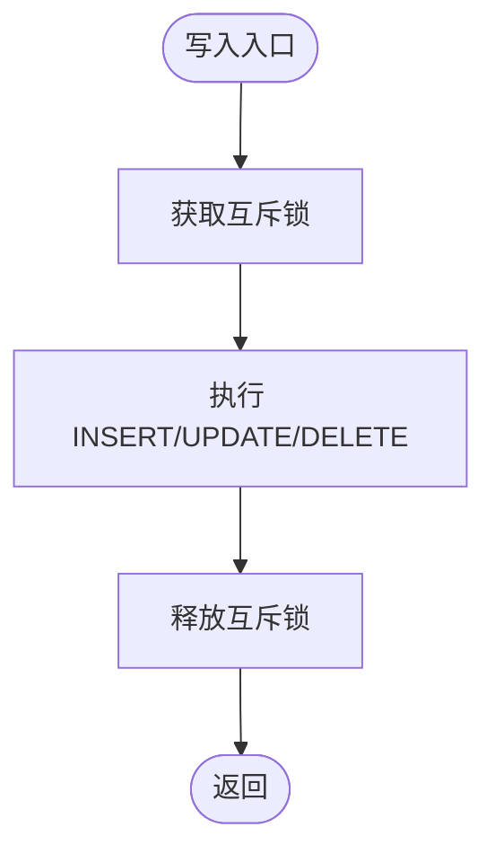
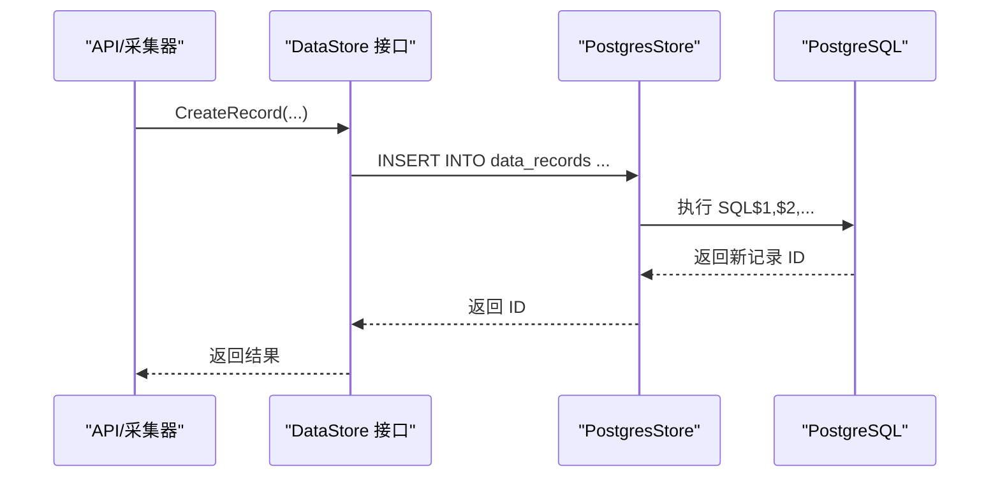
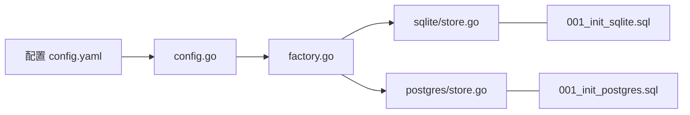

# 数据库优化

<cite>
**本文引用的文件**
- [internal/storage/factory.go](file://internal/storage/factory.go)
- [internal/storage/interface.go](file://internal/storage/interface.go)
- [internal/storage/sqlite/store.go](file://internal/storage/sqlite/store.go)
- [internal/storage/sqlite/record.go](file://internal/storage/sqlite/record.go)
- [internal/storage/sqlite/statistics.go](file://internal/storage/sqlite/statistics.go)
- [internal/storage/postgres/store.go](file://internal/storage/postgres/store.go)
- [internal/storage/postgres/record.go](file://internal/storage/postgres/record.go)
- [internal/storage/postgres/statistics.go](file://internal/storage/postgres/statistics.go)
- [internal/storage/migrations/001_init_sqlite.sql](file://internal/storage/migrations/001_init_sqlite.sql)
- [internal/storage/migrations/001_init_postgres.sql](file://internal/storage/migrations/001_init_postgres.sql)
- [configs/config.yaml](file://configs/config.yaml)
- [internal/config/config.go](file://internal/config/config.go)
- [internal/model/record.go](file://internal/model/record.go)
- [internal/model/statistics.go](file://internal/model/statistics.go)
</cite>

## 目录
1. [简介](#简介)
2. [项目结构](#项目结构)
3. [核心组件](#核心组件)
4. [架构总览](#架构总览)
5. [详细组件分析](#详细组件分析)
6. [依赖分析](#依赖分析)
7. [性能考量与优化策略](#性能考量与优化策略)
8. [故障排查指南](#故障排查指南)
9. [结论](#结论)
10. [附录](#附录)

## 简介
本指南聚焦于 DataCollector 的数据库层优化，系统对比 SQLite 与 PostgreSQL 两种存储后端的性能特征，并给出面向生产的连接池配置、查询优化、索引设计、表结构优化、批量插入与事务管理、锁竞争缓解、监控与慢查询分析、不同数据量级下的调优建议以及数据库迁移对性能的影响与优化方案。

## 项目结构
DataCollector 将存储层抽象为统一接口，通过工厂按配置选择具体实现（SQLite 或 PostgreSQL）。迁移脚本分别定义了两套初始化表结构与索引；各后端均实现了记录、统计、配置等核心能力。

图示来源
- [internal/storage/factory.go:11-21](file://internal/storage/factory.go#L11-L21)
- [internal/storage/interface.go:9-56](file://internal/storage/interface.go#L9-L56)
- [internal/storage/sqlite/store.go:24-56](file://internal/storage/sqlite/store.go#L24-L56)
- [internal/storage/postgres/store.go:20-34](file://internal/storage/postgres/store.go#L20-L34)
- [internal/storage/migrations/001_init_sqlite.sql:1-97](file://internal/storage/migrations/001_init_sqlite.sql#L1-L97)
- [internal/storage/migrations/001_init_postgres.sql:1-91](file://internal/storage/migrations/001_init_postgres.sql#L1-L91)
- [configs/config.yaml:11-22](file://configs/config.yaml#L11-L22)
- [internal/config/config.go:197-214](file://internal/config/config.go#L197-L214)

章节来源
- [internal/storage/factory.go:11-21](file://internal/storage/factory.go#L11-L21)
- [internal/storage/interface.go:9-56](file://internal/storage/interface.go#L9-L56)
- [configs/config.yaml:11-22](file://configs/config.yaml#L11-L22)
- [internal/config/config.go:197-214](file://internal/config/config.go#L197-L214)

## 核心组件
- 统一接口 DataStore：定义初始化、关闭、Ping、用户/数据源/Token/记录/统计/系统配置等操作契约，确保 SQLite 与 PostgreSQL 实现可互换。
- 工厂 NewDataStore：依据配置中的 driver 字段选择具体实现。
- SQLiteStore：单写连接（最大并发 1），启用 WAL，设置 busy_timeout，使用互斥锁保护写路径。
- PostgresStore：连接池默认最大打开连接 25，空闲 5。
- 迁移脚本：分别创建 users、data_sources、data_tokens、data_records、statistics、system_configs 表及索引。
- 模型：RecordFilter、PageResult、Statistics、TrendPoint 等支撑分页、过滤与统计。

章节来源
- [internal/storage/interface.go:9-56](file://internal/storage/interface.go#L9-L56)
- [internal/storage/factory.go:11-21](file://internal/storage/factory.go#L11-L21)
- [internal/storage/sqlite/store.go:18-56](file://internal/storage/sqlite/store.go#L18-L56)
- [internal/storage/postgres/store.go:15-34](file://internal/storage/postgres/store.go#L15-L34)
- [internal/storage/migrations/001_init_sqlite.sql:4-97](file://internal/storage/migrations/001_init_sqlite.sql#L4-L97)
- [internal/storage/migrations/001_init_postgres.sql:5-91](file://internal/storage/migrations/001_init_postgres.sql#L5-L91)
- [internal/model/record.go:19-32](file://internal/model/record.go#L19-L32)
- [internal/model/statistics.go:5-19](file://internal/model/statistics.go#L5-L19)

## 架构总览
下图展示请求在存储层的典型流程：API/采集器调用 DataStore 接口，工厂根据配置选择 SQLite 或 PostgreSQL 实现，最终落到各自 SQL 执行与索引扫描。

图示来源
- [internal/storage/factory.go:11-21](file://internal/storage/factory.go#L11-L21)
- [internal/storage/interface.go:9-56](file://internal/storage/interface.go#L9-L56)
- [internal/storage/sqlite/store.go:18-56](file://internal/storage/sqlite/store.go#L18-L56)
- [internal/storage/postgres/store.go:15-34](file://internal/storage/postgres/store.go#L15-L34)

## 详细组件分析

### SQLite 存储实现
- 连接与并发
  - 最大打开连接与空闲连接均为 1，保证单写一致性。
  - 启用 WAL 模式，显著提升并发读写能力。
  - 设置 busy_timeout，避免因锁等待直接失败。
- 写路径串行化
  - 写操作（创建记录、批量删除、统计自增）使用互斥锁串行化，降低锁竞争但限制吞吐。
- 查询与导出
  - 分页查询先 COUNT 再 LIMIT/OFFSET，注意大数据量下 COUNT 性能。
  - 导出不走分页，全表扫描，需配合筛选条件与索引。
- 统计与趋势
  - 按日统计采用 upsert（冲突更新），适合高频写场景。
  - 趋势查询在 token 级别从 data_records 聚合，在数据源/全局级别从 statistics 查询，兼顾实时性与性能。

图示来源
- [internal/storage/sqlite/record.go:14-35](file://internal/storage/sqlite/record.go#L14-L35)
- [internal/storage/sqlite/record.go:160-183](file://internal/storage/sqlite/record.go#L160-L183)
- [internal/storage/sqlite/statistics.go:11-25](file://internal/storage/sqlite/statistics.go#L11-L25)

章节来源
- [internal/storage/sqlite/store.go:18-56](file://internal/storage/sqlite/store.go#L18-L56)
- [internal/storage/sqlite/record.go:14-35](file://internal/storage/sqlite/record.go#L14-L35)
- [internal/storage/sqlite/record.go:67-147](file://internal/storage/sqlite/record.go#L67-L147)
- [internal/storage/sqlite/record.go:159-183](file://internal/storage/sqlite/record.go#L159-L183)
- [internal/storage/sqlite/statistics.go:11-25](file://internal/storage/sqlite/statistics.go#L11-L25)
- [internal/storage/sqlite/statistics.go:89-145](file://internal/storage/sqlite/statistics.go#L89-L145)

### PostgreSQL 存储实现
- 连接池
  - 默认最大打开连接 25，空闲 5，适合多并发写入与查询。
- 查询与导出
  - 分页查询使用 $n 占位符与 LIMIT/OFFSET，具备良好扩展性。
  - 导出同样基于筛选条件，建议结合索引与分批处理。
- 统计与趋势
  - upsert 使用 ON CONFLICT，与 SQLite 的冲突处理语义一致。
  - 趋势查询逻辑与 SQLite 保持一致，便于跨后端切换。

图示来源
- [internal/storage/postgres/record.go:14-34](file://internal/storage/postgres/record.go#L14-L34)
- [internal/storage/postgres/store.go:20-34](file://internal/storage/postgres/store.go#L20-L34)

章节来源
- [internal/storage/postgres/store.go:15-34](file://internal/storage/postgres/store.go#L15-L34)
- [internal/storage/postgres/record.go:66-152](file://internal/storage/postgres/record.go#L66-L152)
- [internal/storage/postgres/record.go:162-182](file://internal/storage/postgres/record.go#L162-L182)
- [internal/storage/postgres/statistics.go:11-22](file://internal/storage/postgres/statistics.go#L11-L22)
- [internal/storage/postgres/statistics.go:87-142](file://internal/storage/postgres/statistics.go#L87-L142)

### 表结构与索引设计
- 表结构差异
  - SQLite：TEXT/NUMERIC 类型用于 JSON 与时间戳；外键约束在迁移中声明。
  - PostgreSQL：JSONB 列存储数据，TIMESTAMP WITH TIME ZONE 提升时区处理能力。
- 索引覆盖
  - users：username、status
  - data_sources：status、created_by
  - data_tokens：source_id、token_hash、status
  - data_records：source_id、token_id、created_at
  - statistics：source_id、stat_date、(source_id, stat_date)
  - system_configs：config_key
- 设计要点
  - 为高频过滤字段建立单列或复合索引。
  - created_at 上的索引有利于分页与趋势聚合。
  - 复合索引 (source_id, stat_date) 与单独 stat_date 索引互补，满足不同查询模式。

章节来源
- [internal/storage/migrations/001_init_sqlite.sql:4-97](file://internal/storage/migrations/001_init_sqlite.sql#L4-L97)
- [internal/storage/migrations/001_init_postgres.sql:5-91](file://internal/storage/migrations/001_init_postgres.sql#L5-L91)

### 数据模型与分页
- RecordFilter 支持按数据源、日期范围、分页参数过滤。
- PageResult 统一返回总数与列表，便于前端渲染。
- 统计模型 Statistics 与 TrendPoint 支撑趋势图与汇总统计。

章节来源
- [internal/model/record.go:19-32](file://internal/model/record.go#L19-L32)
- [internal/model/statistics.go:5-19](file://internal/model/statistics.go#L5-L19)

## 依赖分析
- 工厂依赖配置模块，按 driver 选择实现。
- 各 Store 实现依赖迁移资源，首次启动执行初始化。
- 接口与实现解耦，便于替换与扩展。

图示来源
- [configs/config.yaml:11-22](file://configs/config.yaml#L11-L22)
- [internal/config/config.go:197-214](file://internal/config/config.go#L197-L214)
- [internal/storage/factory.go:11-21](file://internal/storage/factory.go#L11-L21)
- [internal/storage/sqlite/store.go:24-56](file://internal/storage/sqlite/store.go#L24-L56)
- [internal/storage/postgres/store.go:20-34](file://internal/storage/postgres/store.go#L20-L34)
- [internal/storage/migrations/001_init_sqlite.sql:1-97](file://internal/storage/migrations/001_init_sqlite.sql#L1-L97)
- [internal/storage/migrations/001_init_postgres.sql:1-91](file://internal/storage/migrations/001_init_postgres.sql#L1-L91)

章节来源
- [internal/storage/factory.go:11-21](file://internal/storage/factory.go#L11-L21)
- [internal/config/config.go:197-214](file://internal/config/config.go#L197-L214)

## 性能考量与优化策略

### 连接池配置
- SQLite
  - 当前最大并发 1，适合单机、低并发写入场景；若需要更高吞吐，可评估 WAL 并发与外部缓存层。
  - 若业务允许，可在应用侧合并写入批次，减少锁争用。
- PostgreSQL
  - 默认最大打开连接 25，空闲 5；可根据并发写入峰值与查询负载调整。
  - 建议开启连接池健康检查与超时控制，避免僵尸连接。

章节来源
- [internal/storage/sqlite/store.go:39-47](file://internal/storage/sqlite/store.go#L39-L47)
- [internal/storage/postgres/store.go:29-32](file://internal/storage/postgres/store.go#L29-L32)

### 查询优化
- 分页 COUNT 代价
  - SQLite 与 PostgreSQL 的分页查询均先 COUNT 再 LIMIT/OFFSET，大数据量下 COUNT 成本高。
  - 建议：仅在必要时 COUNT，或采用“近似总数 + 下一页按钮”的交互；或引入游标分页（offset 递增改为基于上次最大 id）。
- 索引命中
  - 确保过滤条件命中现有索引（如 source_id、token_id、created_at、stat_date）。
  - 复合索引 (source_id, stat_date) 有效支撑统计查询。
- JSON/JSONB 查询
  - PostgreSQL 的 JSONB 查询可通过 GIN/按需索引优化，但当前迁移未显式创建；如需复杂查询可考虑添加索引。

章节来源
- [internal/storage/sqlite/record.go:98-147](file://internal/storage/sqlite/record.go#L98-L147)
- [internal/storage/postgres/record.go:101-152](file://internal/storage/postgres/record.go#L101-L152)
- [internal/storage/migrations/001_init_postgres.sql:40-49](file://internal/storage/migrations/001_init_postgres.sql#L40-L49)

### 索引设计与表结构优化
- 建议新增
  - data_records：按 created_at 的索引已存在；如需按 IP/UA 过滤，可考虑相应索引。
  - statistics：(source_id, stat_date) 已存在；如需按日期范围快速扫描，可评估是否需要额外索引。
- 表结构
  - PostgreSQL 使用 JSONB 更利于结构化检索与压缩；SQLite 使用 TEXT 存储 JSON，查询受限。
  - 时间类型：PostgreSQL 使用带时区的时间戳，更利于跨时区部署与排序。

章节来源
- [internal/storage/migrations/001_init_sqlite.sql:77-97](file://internal/storage/migrations/001_init_sqlite.sql#L77-L97)
- [internal/storage/migrations/001_init_postgres.sql:71-91](file://internal/storage/migrations/001_init_postgres.sql#L71-L91)

### 批量插入性能优化
- SQLite
  - 写路径串行化（互斥锁）限制吞吐；建议应用侧批量收集后一次性提交。
  - 可考虑事务包裹多条插入，减少往返开销。
- PostgreSQL
  - 连接池默认 25，适合并发批量写入；建议使用事务包裹批量插入，减少网络往返。
  - 可评估 COPY/批量插入语句（如 RETURNING）以提升吞吐。

章节来源
- [internal/storage/sqlite/record.go:14-35](file://internal/storage/sqlite/record.go#L14-L35)
- [internal/storage/postgres/record.go:14-34](file://internal/storage/postgres/record.go#L14-L34)

### 事务管理与锁竞争缓解
- SQLite
  - 写操作串行化，避免锁竞争；但会成为瓶颈。
  - 建议：将多个写操作放入单个事务，减少锁持有时间。
- PostgreSQL
  - 连接池并发高，需合理设置隔离级别与超时，避免长事务锁住行/表。
  - 对热点表（如 statistics）进行分区或分片（按时间维度）可显著缓解锁竞争。

章节来源
- [internal/storage/sqlite/store.go:18-21](file://internal/storage/sqlite/store.go#L18-L21)
- [internal/storage/sqlite/record.go:14-35](file://internal/storage/sqlite/record.go#L14-L35)
- [internal/storage/postgres/store.go:29-32](file://internal/storage/postgres/store.go#L29-L32)

### 锁竞争缓解与并发策略
- 读写分离：将只读查询（如趋势、导出）路由到只读副本（PostgreSQL 可配置）。
- 限流与退避：在高并发写入时，客户端可采用指数退避重试。
- 分区与归档：对历史数据进行归档或分区，缩小热表规模。

[本节为通用指导，无需列出章节来源]

### 数据库监控与慢查询分析
- 监控指标建议
  - 连接池：活跃连接数、空闲连接数、等待队列长度、连接超时次数。
  - 查询：慢查询数量、平均/95 分位延迟、错误率。
  - 表与索引：索引使用率、回表次数、全表扫描比例。
- 慢查询定位
  - 开启查询日志与计划分析（EXPLAIN/EXPLAIN ANALYZE）。
  - 对 COUNT(*)、复杂 JOIN、未命中索引的查询优先优化。
- 工具与实践
  - PostgreSQL 可使用 pg_stat_statements、auto_explain。
  - SQLite 可通过 PRAGMA statements 与外部工具分析。

[本节为通用指导，无需列出章节来源]

### 不同数据量级下的调优建议
- 小规模（GB 级以下）
  - SQLite：单机写入 + WAL；关注互斥锁带来的吞吐瓶颈。
  - PostgreSQL：默认连接池即可；重点优化索引与查询计划。
- 中等规模（GB~TB）
  - 引入只读副本与读写分离；对热点表分区或分片。
  - 优化统计表聚合策略，减少全表扫描。
- 大规模（TB+）
  - 分区（按时间）、冷热分离、归档策略。
  - 扩展连接池与硬件资源，必要时引入分布式数据库或 OLAP 引擎做趋势分析。

[本节为通用指导，无需列出章节来源]

### 数据库迁移对性能的影响与优化
- 迁移内容
  - 初始化表结构与索引；SQLite 与 PostgreSQL 的类型与索引略有差异。
- 影响
  - 新索引提升查询性能，但写入时需维护索引，带来额外开销。
  - 类型差异（JSON vs JSONB）影响查询与存储效率。
- 优化方案
  - 在迁移后运行 ANALYZE/VACUUM（SQLite WAL 模式下由引擎自动管理）。
  - 根据实际查询模式调整索引，定期评估冗余索引。
  - 对历史数据进行统计与采样，验证迁移后的查询性能。

章节来源
- [internal/storage/migrations/001_init_sqlite.sql:1-97](file://internal/storage/migrations/001_init_sqlite.sql#L1-L97)
- [internal/storage/migrations/001_init_postgres.sql:1-91](file://internal/storage/migrations/001_init_postgres.sql#L1-L91)

## 故障排查指南
- 连接问题
  - 检查 DSN 与凭据；确认数据库可达与 SSL 配置。
  - 查看连接池状态与超时设置。
- 写入阻塞
  - SQLite：互斥锁导致写入排队；合并写入或减少事务粒度。
  - PostgreSQL：长事务、锁冲突；缩短事务、合理设置隔离级别。
- 查询缓慢
  - 使用 EXPLAIN 分析执行计划；确认索引是否被使用。
  - 避免 SELECT * 与全表扫描；为过滤字段增加索引。
- 统计异常
  - 检查 upsert 逻辑与唯一约束；确认日期格式与时区处理。

章节来源
- [internal/config/config.go:197-214](file://internal/config/config.go#L197-L214)
- [internal/storage/sqlite/store.go:39-53](file://internal/storage/sqlite/store.go#L39-L53)
- [internal/storage/postgres/store.go:29-32](file://internal/storage/postgres/store.go#L29-L32)
- [internal/storage/sqlite/statistics.go:11-25](file://internal/storage/sqlite/statistics.go#L11-L25)
- [internal/storage/postgres/statistics.go:11-22](file://internal/storage/postgres/statistics.go#L11-L22)

## 结论
- SQLite 适合小规模、单机部署，WAL 与 busy_timeout 提升并发读写体验，但写路径串行化限制吞吐。
- PostgreSQL 适合中大规模与高并发场景，默认连接池与更强的查询能力使其更具扩展性。
- 优化重点在于：合理的连接池配置、索引设计与查询计划、批量写入与事务管理、锁竞争缓解、监控与慢查询分析，以及针对不同数据量级的分阶段演进策略。

[本节为总结性内容，无需列出章节来源]

## 附录
- 配置项参考
  - 数据库驱动：sqlite 或 postgres
  - SQLite 路径：./data/datacollector.db
  - PostgreSQL 主机、端口、用户、密码、数据库名、SSL 模式
- 建议的环境变量覆盖项
  - DB_DRIVER、DB_SQLITE_PATH、DB_HOST、DB_PORT、DB_USER、DB_PASSWORD、DB_NAME、SERVER_PORT、JWT_SECRET、LOG_LEVEL

章节来源
- [configs/config.yaml:11-22](file://configs/config.yaml#L11-L22)
- [internal/config/config.go:149-195](file://internal/config/config.go#L149-L195)