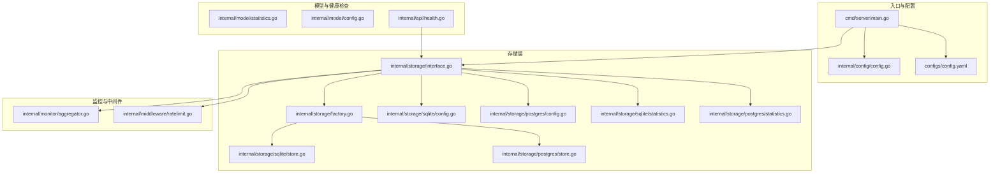
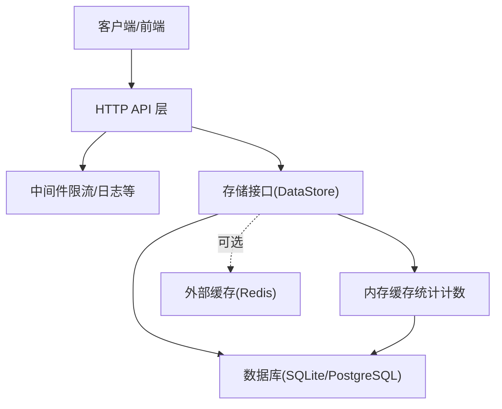
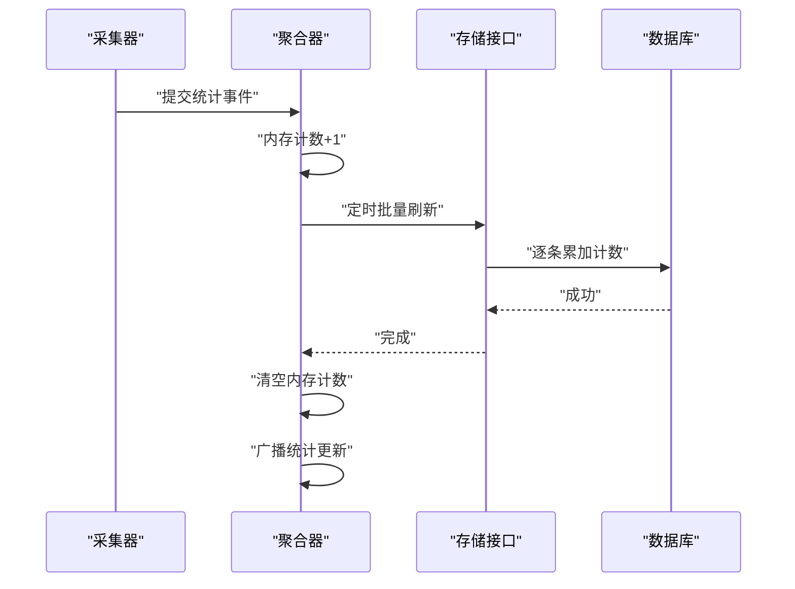
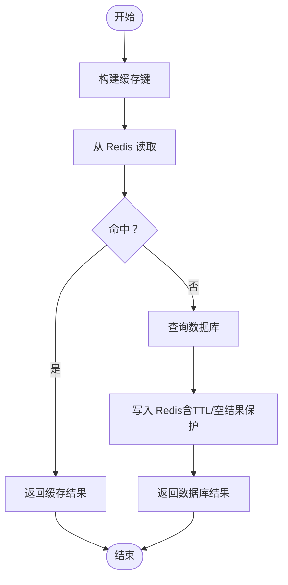
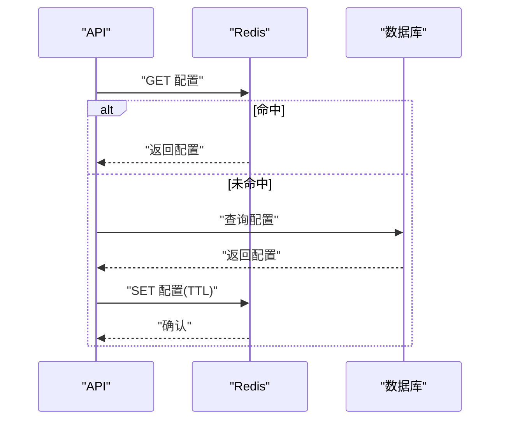
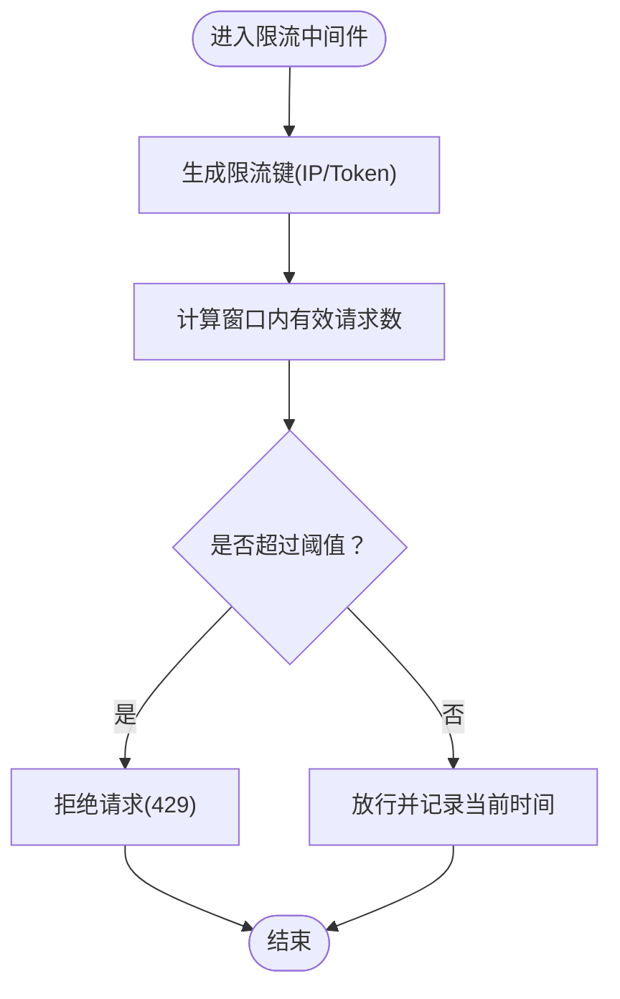
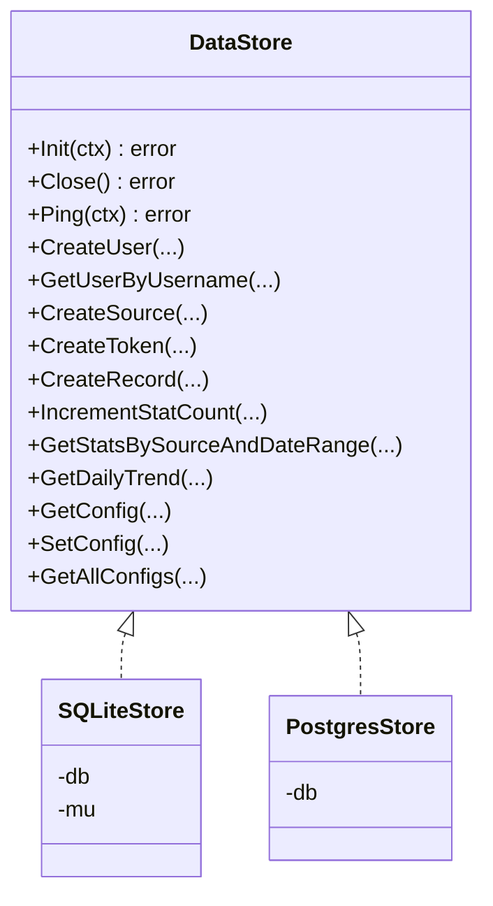
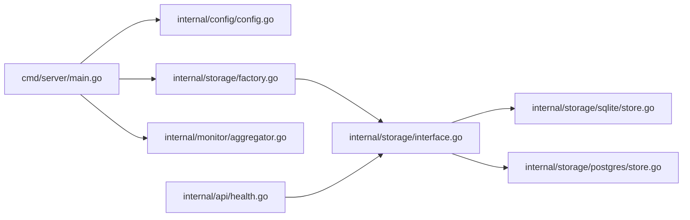

# 缓存策略

<cite>
**本文引用的文件**
- [cmd/server/main.go](file://cmd/server/main.go)
- [internal/config/config.go](file://internal/config/config.go)
- [configs/config.yaml](file://configs/config.yaml)
- [internal/storage/interface.go](file://internal/storage/interface.go)
- [internal/storage/factory.go](file://internal/storage/factory.go)
- [internal/storage/sqlite/store.go](file://internal/storage/sqlite/store.go)
- [internal/storage/postgres/store.go](file://internal/storage/postgres/store.go)
- [internal/storage/sqlite/config.go](file://internal/storage/sqlite/config.go)
- [internal/storage/postgres/config.go](file://internal/storage/postgres/config.go)
- [internal/storage/sqlite/statistics.go](file://internal/storage/sqlite/statistics.go)
- [internal/storage/postgres/statistics.go](file://internal/storage/postgres/statistics.go)
- [internal/monitor/aggregator.go](file://internal/monitor/aggregator.go)
- [internal/middleware/ratelimit.go](file://internal/middleware/ratelimit.go)
- [internal/model/statistics.go](file://internal/model/statistics.go)
- [internal/model/config.go](file://internal/model/config.go)
- [internal/api/health.go](file://internal/api/health.go)
</cite>

## 目录
1. [引言](#引言)
2. [项目结构](#项目结构)
3. [核心组件](#核心组件)
4. [架构总览](#架构总览)
5. [详细组件分析](#详细组件分析)
6. [依赖分析](#依赖分析)
7. [性能考虑](#性能考虑)
8. [故障排查指南](#故障排查指南)
9. [结论](#结论)
10. [附录](#附录)

## 引言
本指南围绕 DataCollector 的缓存策略展开，目标是帮助读者在理解现有实现的基础上，设计并落地适用于生产环境的缓存方案。当前代码库未直接实现“内存缓存”和“分布式缓存”的通用框架，但具备以下与缓存密切相关的基础能力：
- 内存中的统计计数缓存（聚合器内存计数器）
- 数据库层的统计查询与系统配置读写
- 基于内存的滑动窗口限流中间件
- 可扩展的存储接口与多后端实现（SQLite/PostgreSQL）

本指南将据此给出：
- 统计数据缓存、查询结果缓存、配置缓存的适用场景与实现建议
- 缓存失效策略、一致性保证与缓存穿透防护思路
- Redis 等外部缓存系统的集成方案
- 性能监控与命中率优化建议
- 不同数据类型的缓存策略选择与配置建议
- 缓存容量规划与内存使用优化方法

## 项目结构
DataCollector 的后端采用分层架构：入口程序负责初始化与启动；配置模块提供应用配置；存储层通过接口抽象，支持 SQLite 与 PostgreSQL；监控模块提供内存级统计缓存；中间件提供限流等横切能力。

**图表来源**
- [cmd/server/main.go:25-87](file://cmd/server/main.go#L25-L87)
- [internal/config/config.go:12-215](file://internal/config/config.go#L12-L215)
- [configs/config.yaml:1-41](file://configs/config.yaml#L1-L41)
- [internal/storage/interface.go:9-56](file://internal/storage/interface.go#L9-L56)
- [internal/storage/factory.go:11-21](file://internal/storage/factory.go#L11-L21)
- [internal/storage/sqlite/store.go:17-56](file://internal/storage/sqlite/store.go#L17-L56)
- [internal/storage/postgres/store.go:14-34](file://internal/storage/postgres/store.go#L14-L34)
- [internal/storage/sqlite/config.go:11-79](file://internal/storage/sqlite/config.go#L11-L79)
- [internal/storage/postgres/config.go:48-76](file://internal/storage/postgres/config.go#L48-L76)
- [internal/storage/sqlite/statistics.go:65-94](file://internal/storage/sqlite/statistics.go#L65-L94)
- [internal/storage/postgres/statistics.go:62-92](file://internal/storage/postgres/statistics.go#L62-L92)
- [internal/monitor/aggregator.go:17-197](file://internal/monitor/aggregator.go#L17-L197)
- [internal/middleware/ratelimit.go:12-137](file://internal/middleware/ratelimit.go#L12-L137)
- [internal/model/statistics.go:5-20](file://internal/model/statistics.go#L5-L20)
- [internal/model/config.go:5-12](file://internal/model/config.go#L5-L12)
- [internal/api/health.go:12-64](file://internal/api/health.go#L12-L64)

**章节来源**
- [cmd/server/main.go:25-87](file://cmd/server/main.go#L25-L87)
- [internal/config/config.go:12-215](file://internal/config/config.go#L12-L215)
- [configs/config.yaml:1-41](file://configs/config.yaml#L1-L41)

## 核心组件
- 存储接口与工厂：通过统一接口抽象底层存储，支持 SQLite 与 PostgreSQL，便于后续接入外部缓存（如 Redis）作为“二级缓存”或“只读缓存”。
- 聚合器（内存统计缓存）：在内存中维护按数据源的当日计数，定时刷新至数据库，并通过 WebSocket 推送更新。这是当前最接近“内存缓存”的实现。
- 限流中间件（内存滑动窗口）：基于内存 map 的滑动窗口算法，提供每分钟级的请求频率控制，避免过载。
- 配置读写：系统配置以键值形式存储在数据库中，提供 Get/Set/GetAll，可作为“配置缓存”的数据源。
- 统计查询：提供按日期范围、按数据源的统计查询接口，可作为“查询结果缓存”的目标。

**章节来源**
- [internal/storage/interface.go:9-56](file://internal/storage/interface.go#L9-L56)
- [internal/storage/factory.go:11-21](file://internal/storage/factory.go#L11-L21)
- [internal/monitor/aggregator.go:17-197](file://internal/monitor/aggregator.go#L17-L197)
- [internal/middleware/ratelimit.go:12-137](file://internal/middleware/ratelimit.go#L12-L137)
- [internal/storage/sqlite/config.go:11-79](file://internal/storage/sqlite/config.go#L11-L79)
- [internal/storage/postgres/config.go:48-76](file://internal/storage/postgres/config.go#L48-L76)
- [internal/storage/sqlite/statistics.go:65-94](file://internal/storage/sqlite/statistics.go#L65-L94)
- [internal/storage/postgres/statistics.go:62-92](file://internal/storage/postgres/statistics.go#L62-L92)

## 架构总览
下图展示了缓存策略在系统中的位置与交互关系。当前实现以“数据库为主”，内存缓存仅用于统计计数；未来可引入 Redis 作为“只读缓存”和“配置缓存”的补充。

**图表来源**
- [internal/storage/interface.go:9-56](file://internal/storage/interface.go#L9-L56)
- [internal/monitor/aggregator.go:89-133](file://internal/monitor/aggregator.go#L89-L133)
- [internal/storage/sqlite/store.go:17-56](file://internal/storage/sqlite/store.go#L17-L56)
- [internal/storage/postgres/store.go:14-34](file://internal/storage/postgres/store.go#L14-L34)

## 详细组件分析

### 统计数据缓存（内存 + 数据库）
- 现状：聚合器在内存中维护每个数据源的当日计数，定时（每 60 秒）批量刷新到数据库，并广播更新。
- 适用场景：高并发写入、低延迟读取、短期趋势展示。
- 优化建议：
  - 刷新周期与阈值：根据写入峰值调整刷新间隔，避免频繁落库。
  - 并发安全：当前使用互斥锁保护计数器，确保线程安全。
  - 一致性：刷新前复制计数器快照，刷新后清空，减少丢失风险。
  - 读路径：对外暴露今日计数查询接口，优先从内存读取，必要时回源数据库。

**图表来源**
- [internal/monitor/aggregator.go:52-133](file://internal/monitor/aggregator.go#L52-L133)
- [internal/storage/interface.go:45-50](file://internal/storage/interface.go#L45-L50)

**章节来源**
- [internal/monitor/aggregator.go:17-197](file://internal/monitor/aggregator.go#L17-L197)
- [internal/model/statistics.go:5-20](file://internal/model/statistics.go#L5-L20)

### 查询结果缓存（可选 Redis）
- 适用场景：高频统计查询（如按日期范围的总量、每日趋势），降低数据库压力。
- 设计要点：
  - 缓存键命名：以查询参数为键的一部分，例如“stats:range:{source_id}:{start}:{end}”。
  - 失效策略：写路径失效（写入成功后主动删除相关键），或设置 TTL。
  - 一致性：强一致场景下，先写数据库再写缓存；弱一致场景下可采用“先读缓存，后写数据库”的策略。
  - 缓存穿透：对空结果也进行短 TTL 缓存，防止恶意/异常请求打穿后端。
  - 并发：使用分布式锁或原子操作避免“击穿”。

[此图为概念性流程图，无需图表来源]

### 配置缓存（可选 Redis）
- 适用场景：系统配置读取频繁且变更不频繁，可显著降低数据库压力。
- 设计要点：
  - 缓存键：以配置 key 为键名。
  - 失效策略：集中式配置变更时主动失效或设置短 TTL。
  - 一致性：写入配置时同时更新缓存；读取时若缓存缺失则回源数据库并回填缓存。
  - 缓存穿透：空值也缓存，缩短异常请求的响应时间。

[此图为概念性流程图，无需图表来源]

### 限流中间件（内存滑动窗口）
- 现状：基于内存 map 的滑动窗口，每分钟清理一次过期记录。
- 适用场景：按 IP 或按 Token 的请求频率控制。
- 优化建议：
  - 内存占用：限制最大 key 数量，定期清理冷数据。
  - 一致性：多实例部署时需替换为分布式限流（如基于 Redis 的 Lua 原子计数）。

**图表来源**
- [internal/middleware/ratelimit.go:33-98](file://internal/middleware/ratelimit.go#L33-L98)

**章节来源**
- [internal/middleware/ratelimit.go:12-137](file://internal/middleware/ratelimit.go#L12-L137)

### 存储接口与数据库实现
- 存储接口统一了用户、数据源、Token、记录、统计、配置等 CRUD 与查询能力。
- SQLite/PostgreSQL 提供了具体的实现，包括连接池、WAL 模式、索引等优化。
- 适合作为缓存的“最终一致性数据源”，或作为缓存穿透防护的兜底。

**图表来源**
- [internal/storage/interface.go:9-56](file://internal/storage/interface.go#L9-L56)
- [internal/storage/sqlite/store.go:17-56](file://internal/storage/sqlite/store.go#L17-L56)
- [internal/storage/postgres/store.go:14-34](file://internal/storage/postgres/store.go#L14-L34)

**章节来源**
- [internal/storage/interface.go:9-56](file://internal/storage/interface.go#L9-L56)
- [internal/storage/sqlite/store.go:17-86](file://internal/storage/sqlite/store.go#L17-L86)
- [internal/storage/postgres/store.go:14-61](file://internal/storage/postgres/store.go#L14-L61)

## 依赖分析
- 入口程序依赖配置模块、存储工厂与监控模块，形成启动链路。
- 存储接口被多个模块依赖，是缓存策略的“数据锚点”。
- 限流中间件独立于存储接口，但可与缓存结合实现更精细的访问控制。

**图表来源**
- [cmd/server/main.go:25-87](file://cmd/server/main.go#L25-L87)
- [internal/storage/factory.go:11-21](file://internal/storage/factory.go#L11-L21)
- [internal/storage/interface.go:9-56](file://internal/storage/interface.go#L9-L56)
- [internal/storage/sqlite/store.go:17-56](file://internal/storage/sqlite/store.go#L17-L56)
- [internal/storage/postgres/store.go:14-34](file://internal/storage/postgres/store.go#L14-L34)
- [internal/api/health.go:12-64](file://internal/api/health.go#L12-L64)

**章节来源**
- [cmd/server/main.go:25-87](file://cmd/server/main.go#L25-L87)
- [internal/storage/factory.go:11-21](file://internal/storage/factory.go#L11-L21)
- [internal/storage/interface.go:9-56](file://internal/storage/interface.go#L9-L56)

## 性能考虑
- 写入路径优化
  - 统计写入：聚合器批量刷新，减少数据库写放大；可考虑批量插入或事务包裹。
  - 配置写入：数据库 Upsert 已有实现，可配合缓存提升读性能。
- 读取路径优化
  - 查询结果缓存：针对热点查询建立缓存，设置合理 TTL；对空结果也做短 TTL 缓存。
  - 配置缓存：读路径优先缓存，写路径失效或回填。
- 内存与连接池
  - SQLite：单写模型，连接池设为 1；WAL 模式提升并发读性能。
  - PostgreSQL：合理设置 MaxOpenConns/MaxIdleConns，避免连接争用。
- 监控与指标
  - 建议埋点：缓存命中率、未命中率、穿透次数、Redis 命中率、数据库 QPS/P95 等。
  - 告警：缓存命中率骤降、Redis 连接异常、数据库慢查询等。

[本节为通用性能建议，无需章节来源]

## 故障排查指南
- 健康检查
  - 健康检查会调用存储层 Ping，若数据库断连将返回不可用状态，有助于快速定位存储问题。
- 统计异常
  - 若发现统计不一致，检查聚合器刷新逻辑与数据库累加过程，确认刷新周期与错误处理分支。
- 配置读取异常
  - 若配置读取为空，确认数据库中是否存在该键，或是否需要回填默认值。
- 限流误伤
  - 若出现限流误伤，检查滑动窗口大小与清理周期，必要时迁移到分布式限流。

**章节来源**
- [internal/api/health.go:36-64](file://internal/api/health.go#L36-L64)
- [internal/monitor/aggregator.go:89-133](file://internal/monitor/aggregator.go#L89-L133)
- [internal/storage/sqlite/config.go:11-79](file://internal/storage/sqlite/config.go#L11-L79)
- [internal/storage/postgres/config.go:48-76](file://internal/storage/postgres/config.go#L48-L76)
- [internal/middleware/ratelimit.go:33-98](file://internal/middleware/ratelimit.go#L33-L98)

## 结论
当前代码库以“数据库为核心、内存为辅”的模式实现了统计写入与读取的基础能力。要实现完善的缓存体系，建议：
- 在存储接口之上叠加 Redis 缓存，分别用于“查询结果缓存”和“配置缓存”
- 对写路径采用“先写数据库，后写缓存/失效”的策略，确保最终一致性
- 对读路径采用“先读缓存，后写数据库”的策略，结合 TTL 与空结果保护
- 通过监控与告警持续优化缓存命中率与系统稳定性

[本节为总结性内容，无需章节来源]

## 附录

### 缓存策略选择与配置建议
- 统计数据缓存
  - 场景：当日计数、趋势数据
  - 方案：沿用内存计数 + 定时刷新；对热点数据可引入 Redis 作为只读缓存
  - 建议：刷新周期 60s；内存计数阈值按峰值写入量设定
- 查询结果缓存
  - 场景：按日期范围统计、每日趋势
  - 方案：Redis 缓存查询结果，键名包含参数；写路径失效
  - 建议：TTL 5-15 分钟；空结果短 TTL（1 分钟）
- 配置缓存
  - 场景：系统配置读取
  - 方案：Redis 缓存配置键值；写路径回填或失效
  - 建议：TTL 1-5 分钟；集中式变更时主动失效

### 缓存容量规划与内存优化
- 内存缓存容量
  - 统计计数：按数据源数量估算；每个 sourceID 占用 8 字节整型 + 结构体开销
  - 限流窗口：按最大并发与窗口大小估算；建议限制最大 key 数量
- Redis 容量
  - 查询结果缓存：按热点查询量与 TTL 估算；使用压缩键名与序列化
  - 配置缓存：按配置项数量与大小估算；定期清理过期键
- 内存使用优化
  - 采用对象池与复用结构体，减少 GC 压力
  - 对大对象采用分片存储或懒加载
  - 监控内存与 GC 指标，及时扩容或优化

[本节为通用建议，无需章节来源]