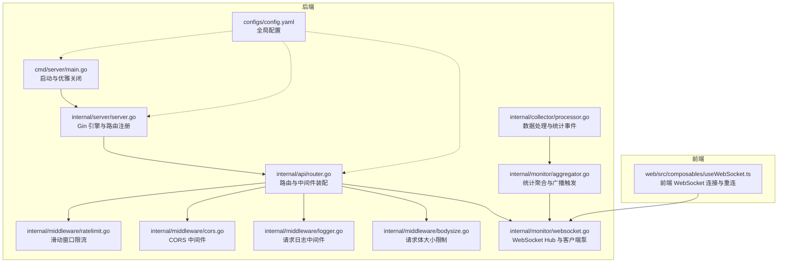
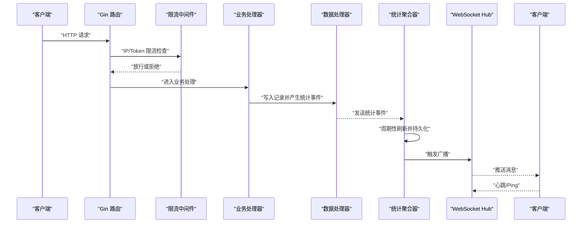
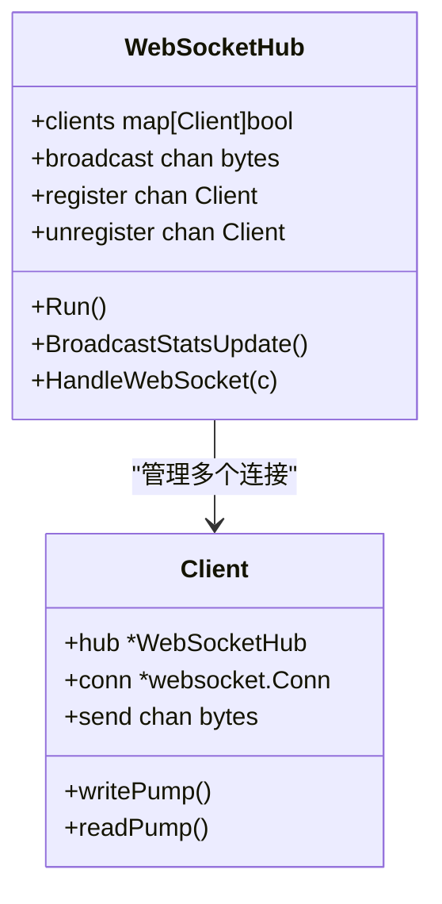
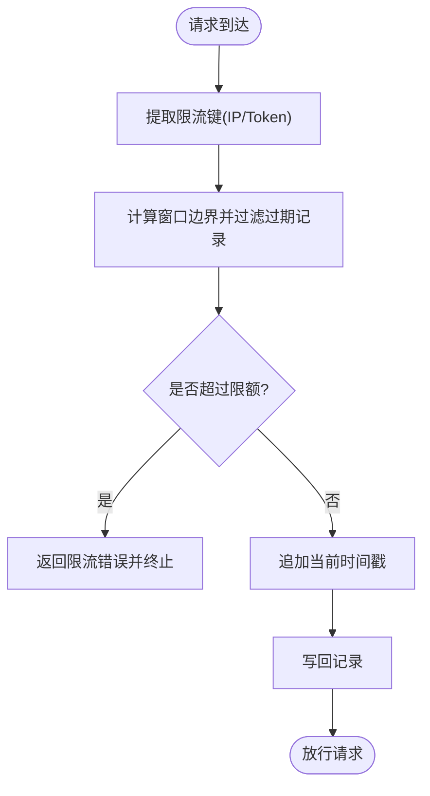
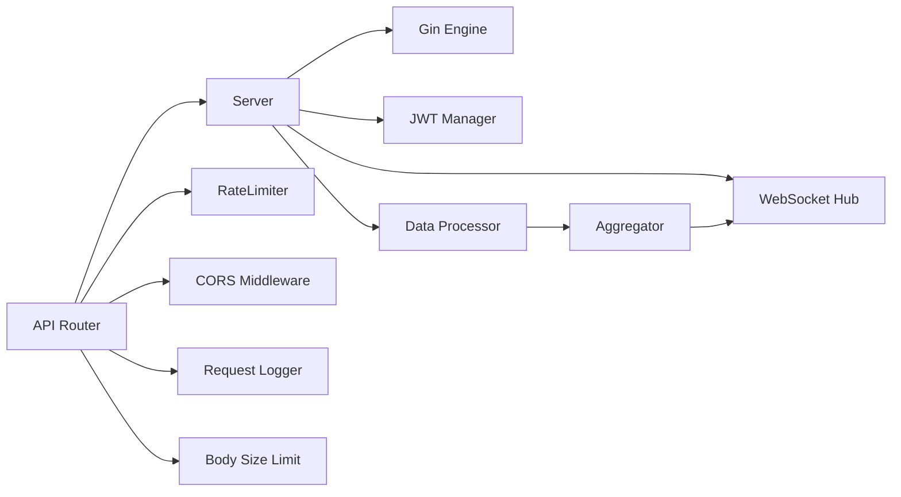

# 网络优化

<cite>
**本文引用的文件**
- [cmd/server/main.go](file://cmd/server/main.go)
- [internal/server/server.go](file://internal/server/server.go)
- [internal/api/router.go](file://internal/api/router.go)
- [internal/middleware/ratelimit.go](file://internal/middleware/ratelimit.go)
- [internal/middleware/cors.go](file://internal/middleware/cors.go)
- [internal/middleware/logger.go](file://internal/middleware/logger.go)
- [internal/middleware/bodysize.go](file://internal/middleware/bodysize.go)
- [internal/monitor/websocket.go](file://internal/monitor/websocket.go)
- [internal/monitor/aggregator.go](file://internal/monitor/aggregator.go)
- [internal/collector/processor.go](file://internal/collector/processor.go)
- [configs/config.yaml](file://configs/config.yaml)
- [web/src/composables/useWebSocket.ts](file://web/src/composables/useWebSocket.ts)
</cite>

## 目录
1. [简介](#简介)
2. [项目结构](#项目结构)
3. [核心组件](#核心组件)
4. [架构总览](#架构总览)
5. [详细组件分析](#详细组件分析)
6. [依赖分析](#依赖分析)
7. [性能考量](#性能考量)
8. [故障排查指南](#故障排查指南)
9. [结论](#结论)
10. [附录](#附录)

## 简介
本指南聚焦于 DataCollector 的网络优化，围绕以下目标展开：
- WebSocket 连接管理与消息推送优化
- HTTP 请求处理优化、连接复用与 Keep-Alive 配置建议
- 限流机制实现与性能影响评估
- WebSocket 连接池与消息队列优化思路
- 网络带宽利用、压缩策略与传输协议选择
- 高并发场景下的网络瓶颈识别与解决方案
- 网络监控指标与性能测试方法

本指南基于仓库现有实现进行分析，并提供可落地的优化建议。

## 项目结构
DataCollector 采用 Go 语言后端与 Vue 前端分离的结构。后端通过 Gin 框架提供 REST API 与 WebSocket 推送；WebSocket 推送由 Hub 管理，结合统计聚合器进行广播；前端通过 Vue Composable 管理 WebSocket 连接与重连逻辑。

**图表来源**
- [cmd/server/main.go:1-139](file://cmd/server/main.go#L1-L139)
- [internal/server/server.go:1-139](file://internal/server/server.go#L1-L139)
- [internal/api/router.go:1-116](file://internal/api/router.go#L1-L116)
- [internal/middleware/ratelimit.go:1-137](file://internal/middleware/ratelimit.go#L1-L137)
- [internal/middleware/cors.go:1-51](file://internal/middleware/cors.go#L1-L51)
- [internal/middleware/logger.go:1-67](file://internal/middleware/logger.go#L1-L67)
- [internal/middleware/bodysize.go:1-40](file://internal/middleware/bodysize.go#L1-L40)
- [internal/monitor/websocket.go:1-216](file://internal/monitor/websocket.go#L1-L216)
- [internal/monitor/aggregator.go:1-197](file://internal/monitor/aggregator.go#L1-L197)
- [internal/collector/processor.go:1-84](file://internal/collector/processor.go#L1-L84)
- [configs/config.yaml:1-41](file://configs/config.yaml#L1-L41)
- [web/src/composables/useWebSocket.ts:1-66](file://web/src/composables/useWebSocket.ts#L1-L66)

**章节来源**
- [cmd/server/main.go:1-139](file://cmd/server/main.go#L1-L139)
- [internal/server/server.go:1-139](file://internal/server/server.go#L1-L139)
- [internal/api/router.go:1-116](file://internal/api/router.go#L1-L116)
- [configs/config.yaml:1-41](file://configs/config.yaml#L1-L41)

## 核心组件
- HTTP 服务器与路由：Gin 引擎封装、全局中间件链、路由注册与 SPA 回退。
- WebSocket Hub：统一管理客户端连接、广播通道与读写泵。
- 统计聚合器：周期性刷新与数据库持久化，完成后触发广播。
- 限流中间件：基于滑动窗口的 IP 与 Token 限流。
- CORS/日志/请求体大小限制：安全与稳定性前置保障。
- 前端 WebSocket 连接：自动重连与消息解析。

**章节来源**
- [internal/server/server.go:22-92](file://internal/server/server.go#L22-L92)
- [internal/api/router.go:12-116](file://internal/api/router.go#L12-L116)
- [internal/middleware/ratelimit.go:12-137](file://internal/middleware/ratelimit.go#L12-L137)
- [internal/middleware/cors.go:9-51](file://internal/middleware/cors.go#L9-L51)
- [internal/middleware/logger.go:11-67](file://internal/middleware/logger.go#L11-L67)
- [internal/middleware/bodysize.go:10-40](file://internal/middleware/bodysize.go#L10-L40)
- [internal/monitor/websocket.go:14-216](file://internal/monitor/websocket.go#L14-L216)
- [internal/monitor/aggregator.go:17-197](file://internal/monitor/aggregator.go#L17-L197)
- [internal/collector/processor.go:16-84](file://internal/collector/processor.go#L16-L84)
- [web/src/composables/useWebSocket.ts:3-66](file://web/src/composables/useWebSocket.ts#L3-L66)

## 架构总览
后端通过 Gin 提供 REST API 与 WebSocket 管理端点；数据采集通过限流中间件保护；统计事件经由聚合器周期性落库并触发 WebSocket 广播；前端通过 Composable 管理连接生命周期与重连。

**图表来源**
- [internal/api/router.go:47-55](file://internal/api/router.go#L47-L55)
- [internal/middleware/ratelimit.go:100-136](file://internal/middleware/ratelimit.go#L100-L136)
- [internal/collector/processor.go:30-52](file://internal/collector/processor.go#L30-L52)
- [internal/monitor/aggregator.go:47-133](file://internal/monitor/aggregator.go#L47-L133)
- [internal/monitor/websocket.go:129-190](file://internal/monitor/websocket.go#L129-L190)

## 详细组件分析

### WebSocket 连接管理与消息推送优化
- 连接升级与读写泵
  - 使用 Gorilla WebSocket 升级 HTTP 连接，设置读写缓冲区大小与跨域策略。
  - 客户端侧维持独立的读泵与写泵 goroutine，分别处理消息接收与发送。
  - 写泵内置心跳（Ping）周期性发送，读泵设置读截止时间与 Pong 处理器以维持连接活性。
- Hub 管道与广播
  - Hub 维护客户端集合与广播通道，按通道消息并发投递至各客户端 send 缓冲区。
  - 当客户端 send 缓冲区满时，主动断开连接，避免阻塞 Hub 主循环。
- 广播触发时机
  - 聚合器周期性刷新后触发广播，通知前端重新拉取最新统计。

**图表来源**
- [internal/monitor/websocket.go:14-106](file://internal/monitor/websocket.go#L14-L106)
- [internal/monitor/websocket.go:129-216](file://internal/monitor/websocket.go#L129-L216)

**章节来源**
- [internal/monitor/websocket.go:44-50](file://internal/monitor/websocket.go#L44-L50)
- [internal/monitor/websocket.go:63-106](file://internal/monitor/websocket.go#L63-L106)
- [internal/monitor/websocket.go:129-190](file://internal/monitor/websocket.go#L129-L190)
- [internal/monitor/websocket.go:192-216](file://internal/monitor/websocket.go#L192-L216)
- [internal/monitor/aggregator.go:89-133](file://internal/monitor/aggregator.go#L89-L133)

### HTTP 请求处理优化与连接复用
- Gin 引擎与中间件链
  - 全局恢复、请求日志、CORS、请求体大小限制与初始化状态检查。
  - SPA 静态资源服务与回退，确保前端路由兼容。
- 连接复用与 Keep-Alive
  - 使用标准库 http.Server，默认启用 keep-alive；可通过系统参数与反向代理进一步优化。
- 建议
  - 在反向代理层开启 HTTP/2，提升多路复用与头部压缩。
  - 对静态资源启用缓存与压缩（gzip/br），降低带宽占用。

**章节来源**
- [internal/server/server.go:54-92](file://internal/server/server.go#L54-L92)
- [internal/server/server.go:94-139](file://internal/server/server.go#L94-L139)
- [internal/middleware/cors.go:9-51](file://internal/middleware/cors.go#L9-L51)
- [internal/middleware/logger.go:11-67](file://internal/middleware/logger.go#L11-L67)
- [internal/middleware/bodysize.go:10-40](file://internal/middleware/bodysize.go#L10-L40)

### 限流机制实现与性能影响
- 滑动窗口限流
  - 基于内存 map 保存每个 key 的请求时间戳，窗口长度固定。
  - 定时清理过期记录，避免内存无限增长。
  - 支持按 IP 与 Data Token 两种维度限流，分别应用于采集端点。
- 性能影响
  - 内存占用与锁竞争随并发与 key 数量线性增长；建议结合令牌桶或分布式限流器（如 Redis）扩展。
  - 清理 goroutine 与加锁操作对 CPU 有一定开销，需结合业务 QPS 评估阈值。

**图表来源**
- [internal/middleware/ratelimit.go:68-98](file://internal/middleware/ratelimit.go#L68-L98)
- [internal/middleware/ratelimit.go:100-136](file://internal/middleware/ratelimit.go#L100-L136)

**章节来源**
- [internal/middleware/ratelimit.go:12-137](file://internal/middleware/ratelimit.go#L12-L137)
- [internal/api/router.go:47-55](file://internal/api/router.go#L47-L55)

### WebSocket 连接池与消息队列优化方案
- 连接池
  - 当前 Hub 未实现连接池；建议在上游网关或反向代理层做连接复用与负载均衡。
- 消息队列
  - Hub 的 broadcast 通道为有界队列，建议：
    - 为每个 Client 的 send 通道设置合理容量（当前为 256），避免频繁丢弃。
    - 对高频广播场景引入背压策略（丢弃旧消息或降级为增量更新）。
    - 对不同类型的推送（全量/增量）区分通道，降低无关消息干扰。
- 心跳与保活
  - 写泵每 30 秒发送一次 Ping；读泵设置读截止时间并在收到 Pong 后刷新截止时间。
  - 建议在反向代理层开启 TCP 层 Keep-Alive，减少握手开销。

**章节来源**
- [internal/monitor/websocket.go:14-216](file://internal/monitor/websocket.go#L14-L216)
- [internal/monitor/aggregator.go:30-40](file://internal/monitor/aggregator.go#L30-L40)

### 网络带宽利用优化、压缩策略与传输协议选择
- 压缩策略
  - 后端：Gin 默认未启用压缩；可在反向代理层启用 gzip/br。
  - 前端：Vue 构建产物已压缩；建议在 CDN 或反向代理层开启透明压缩。
- 传输协议
  - 建议启用 HTTP/2 以获得更好的多路复用与头部压缩。
  - WebSocket 在 HTTP/2 下可共享连接，降低握手成本。
- 消息体积控制
  - 聚合器广播仅发送轻量指令（如“刷新”），具体数据由前端按需拉取，降低推送体积。

**章节来源**
- [internal/monitor/websocket.go:108-127](file://internal/monitor/websocket.go#L108-L127)
- [internal/server/server.go:94-139](file://internal/server/server.go#L94-L139)

### 高并发场景下的网络瓶颈识别与解决方案
- 瓶颈识别
  - 限流中间件：滑动窗口锁竞争与内存占用。
  - WebSocket Hub：广播通道与客户端 send 缓冲区满导致断连。
  - 聚合器：数据库写入压力与广播频率。
- 解决方案
  - 限流：引入分布式限流（Redis）与更高效的滑动窗口实现（如布隆过滤器+计数器）。
  - Hub：为高频客户端降级推送、引入优先级队列与背压策略。
  - 聚合器：批量写入、异步刷盘、数据库连接池优化。

**章节来源**
- [internal/middleware/ratelimit.go:12-137](file://internal/middleware/ratelimit.go#L12-L137)
- [internal/monitor/websocket.go:82-105](file://internal/monitor/websocket.go#L82-L105)
- [internal/monitor/aggregator.go:89-133](file://internal/monitor/aggregator.go#L89-L133)

## 依赖分析
- 组件耦合
  - Server 聚合了 Gin 引擎、JWT 管理、处理器与 Hub，职责较重，建议拆分。
  - 路由注册集中在 API 包，便于维护；但限流与认证中间件散布于多处，建议集中化配置。
- 外部依赖
  - Gin、Gorilla WebSocket、slog、lumberjack 等，版本升级需关注兼容性。

**图表来源**
- [internal/server/server.go:22-52](file://internal/server/server.go#L22-L52)
- [internal/api/router.go:12-31](file://internal/api/router.go#L12-L31)
- [internal/middleware/ratelimit.go:12-31](file://internal/middleware/ratelimit.go#L12-L31)
- [internal/monitor/aggregator.go:17-40](file://internal/monitor/aggregator.go#L17-L40)

**章节来源**
- [internal/server/server.go:22-52](file://internal/server/server.go#L22-L52)
- [internal/api/router.go:12-31](file://internal/api/router.go#L12-L31)

## 性能考量
- 限流
  - 当前实现为内存滑动窗口，适合中小规模并发；大规模场景建议分布式限流与更高效的数据结构。
- WebSocket
  - 客户端 send 缓冲区容量适中；建议根据峰值消息速率动态调整。
  - 广播频率与消息体积需平衡实时性与带宽占用。
- HTTP
  - 反向代理层启用 HTTP/2、压缩与缓存可显著降低延迟与带宽。
- 数据库
  - 聚合器批量写入与周期性刷新策略有效，建议结合连接池与索引优化。

[本节为通用指导，无需列出具体文件来源]

## 故障排查指南
- WebSocket 断连
  - 检查客户端 send 缓冲区是否溢出，观察 Hub 日志中“broadcast channel full, message dropped”提示。
  - 确认读泵 Pong 处理与读截止时间设置是否生效。
- 限流误判
  - 核对限流键（IP/Token）是否正确提取；检查窗口大小与清理周期。
- CORS 问题
  - 确认允许的源列表与预检请求处理。
- 请求体过大
  - 检查 BodySizeLimitMiddleware 生效情况与错误处理中间件。

**章节来源**
- [internal/monitor/websocket.go:92-103](file://internal/monitor/websocket.go#L92-L103)
- [internal/middleware/ratelimit.go:100-136](file://internal/middleware/ratelimit.go#L100-L136)
- [internal/middleware/cors.go:11-50](file://internal/middleware/cors.go#L11-L50)
- [internal/middleware/bodysize.go:20-39](file://internal/middleware/bodysize.go#L20-L39)

## 结论
DataCollector 的网络层以 Gin 与 Gorilla WebSocket 为核心，辅以滑动窗口限流与聚合广播，满足中低并发场景。针对高并发，建议引入分布式限流、优化 Hub 背压策略、启用 HTTP/2 与压缩、以及在反向代理层实施连接复用与缓存。通过合理的监控与测试，可进一步提升吞吐与稳定性。

[本节为总结性内容，无需列出具体文件来源]

## 附录

### 配置要点（来自配置文件）
- 服务器与 TLS：主机、端口、模式。
- 数据库：驱动类型与连接参数。
- JWT：密钥与过期时间。
- 采集：最大请求体大小、每分钟 IP 与 Token 限流阈值、允许的源。
- 日志：级别、格式、输出方式与轮转参数。

**章节来源**
- [configs/config.yaml:1-41](file://configs/config.yaml#L1-L41)

### 前端连接与重连
- 前端通过 Composable 管理 WebSocket 生命周期，断线后定时重连，解析消息并回调处理函数。
- 建议在前端增加指数退避与最大重试次数，避免雪崩效应。

**章节来源**
- [web/src/composables/useWebSocket.ts:3-66](file://web/src/composables/useWebSocket.ts#L3-L66)