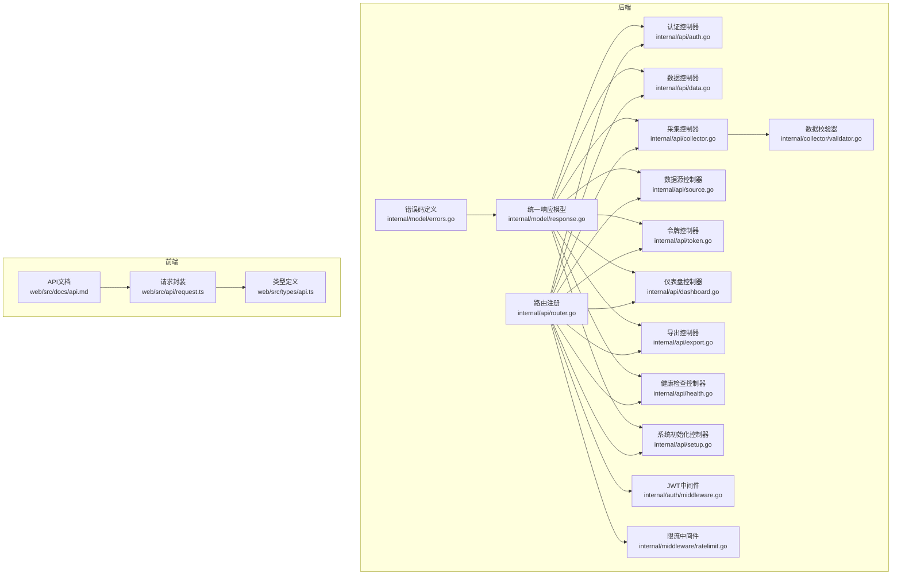
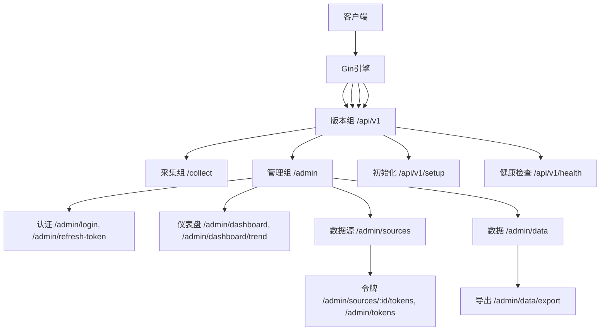
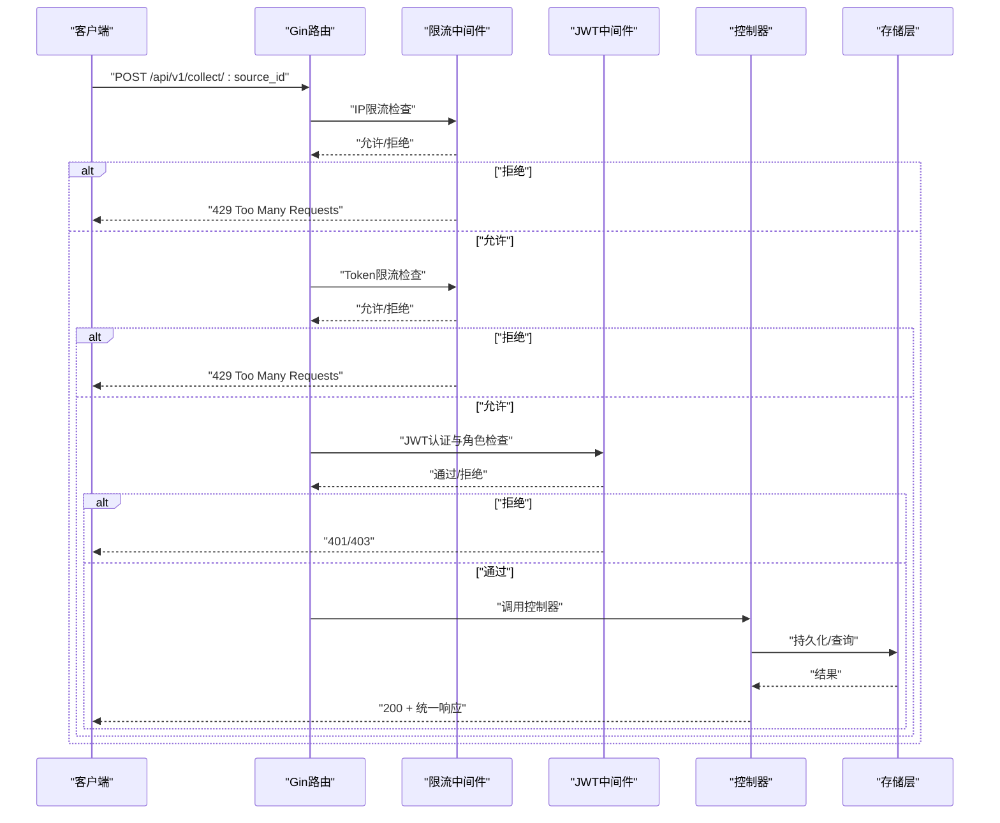

# API扩展

<cite>
**本文引用的文件**
- [internal/api/router.go](file://internal/api/router.go)
- [internal/api/setup.go](file://internal/api/setup.go)
- [internal/api/data.go](file://internal/api/data.go)
- [internal/api/collector.go](file://internal/api/collector.go)
- [internal/api/source.go](file://internal/api/source.go)
- [internal/api/token.go](file://internal/api/token.go)
- [internal/api/dashboard.go](file://internal/api/dashboard.go)
- [internal/api/export.go](file://internal/api/export.go)
- [internal/api/health.go](file://internal/api/health.go)
- [internal/api/auth.go](file://internal/api/auth.go)
- [internal/model/response.go](file://internal/model/response.go)
- [internal/model/errors.go](file://internal/model/errors.go)
- [internal/middleware/ratelimit.go](file://internal/middleware/ratelimit.go)
- [internal/auth/middleware.go](file://internal/auth/middleware.go)
- [internal/collector/validator.go](file://internal/collector/validator.go)
- [cmd/server/main.go](file://cmd/server/main.go)
- [configs/config.yaml](file://configs/config.yaml)
- [web/src/docs/api.md](file://web/src/docs/api.md)
- [web/src/api/request.ts](file://web/src/api/request.ts)
- [web/src/types/api.ts](file://web/src/types/api.ts)
</cite>

## 目录
1. [简介](#简介)
2. [项目结构](#项目结构)
3. [核心组件](#核心组件)
4. [架构总览](#架构总览)
5. [详细组件分析](#详细组件分析)
6. [依赖关系分析](#依赖关系分析)
7. [性能考量](#性能考量)
8. [故障排查指南](#故障排查指南)
9. [结论](#结论)
10. [附录](#附录)

## 简介
本指南面向DataCollector的API扩展开发者，系统讲解路由体系设计、API版本管理策略、新增RESTful端点与路由配置流程、控制器开发模式与最佳实践、参数验证与错误处理、统一响应格式化、API文档自动生成与维护、限流与认证授权扩展、性能监控与日志记录扩展，以及第三方API集成模板与兼容性保障及版本迁移策略。目标是帮助你在保持现有架构一致性的同时，快速、安全地扩展API能力。

## 项目结构
DataCollector采用分层清晰的Go后端与Vue前端协作架构：
- 后端核心位于internal目录，按职责划分为api（路由与控制器）、auth（认证）、collector（采集与校验）、middleware（中间件）、model（数据模型与响应）、monitor（监控）、server（服务启动）、storage（存储抽象与实现）等模块。
- 前端位于web目录，使用Vite+Vue3+TypeScript，通过src/api封装HTTP请求并与后端交互。
- 配置位于configs目录，包含运行时配置文件。

图表来源
- [internal/api/router.go:12-116](file://internal/api/router.go#L12-L116)
- [internal/api/auth.go:12-147](file://internal/api/auth.go#L12-L147)
- [internal/api/data.go:12-97](file://internal/api/data.go#L12-L97)
- [internal/api/collector.go:15-278](file://internal/api/collector.go#L15-L278)
- [internal/api/source.go:13-169](file://internal/api/source.go#L13-L169)
- [internal/api/token.go:16-180](file://internal/api/token.go#L16-L180)
- [internal/api/dashboard.go:13-139](file://internal/api/dashboard.go#L13-L139)
- [internal/api/export.go:16-111](file://internal/api/export.go#L16-L111)
- [internal/api/health.go:12-65](file://internal/api/health.go#L12-L65)
- [internal/api/setup.go:19-253](file://internal/api/setup.go#L19-L253)
- [internal/auth/middleware.go:11-148](file://internal/auth/middleware.go#L11-L148)
- [internal/middleware/ratelimit.go:12-137](file://internal/middleware/ratelimit.go#L12-L137)
- [internal/collector/validator.go:19-222](file://internal/collector/validator.go#L19-L222)
- [internal/model/response.go:9-72](file://internal/model/response.go#L9-L72)
- [internal/model/errors.go:3-84](file://internal/model/errors.go#L3-L84)
- [web/src/docs/api.md:1-200](file://web/src/docs/api.md#L1-L200)
- [web/src/api/request.ts:1-200](file://web/src/api/request.ts#L1-L200)
- [web/src/types/api.ts:1-200](file://web/src/types/api.ts#L1-L200)

章节来源
- [internal/api/router.go:12-116](file://internal/api/router.go#L12-L116)
- [internal/api/setup.go:19-253](file://internal/api/setup.go#L19-L253)
- [internal/api/data.go:12-97](file://internal/api/data.go#L12-L97)
- [internal/api/collector.go:15-278](file://internal/api/collector.go#L15-L278)
- [internal/api/source.go:13-169](file://internal/api/source.go#L13-L169)
- [internal/api/token.go:16-180](file://internal/api/token.go#L16-L180)
- [internal/api/dashboard.go:13-139](file://internal/api/dashboard.go#L13-L139)
- [internal/api/export.go:16-111](file://internal/api/export.go#L16-L111)
- [internal/api/health.go:12-65](file://internal/api/health.go#L12-L65)
- [internal/api/auth.go:12-147](file://internal/api/auth.go#L12-L147)
- [internal/model/response.go:9-72](file://internal/model/response.go#L9-L72)
- [internal/model/errors.go:3-84](file://internal/model/errors.go#L3-L84)
- [internal/middleware/ratelimit.go:12-137](file://internal/middleware/ratelimit.go#L12-L137)
- [internal/auth/middleware.go:11-148](file://internal/auth/middleware.go#L11-L148)
- [internal/collector/validator.go:19-222](file://internal/collector/validator.go#L19-L222)
- [web/src/docs/api.md:1-200](file://web/src/docs/api.md#L1-L200)
- [web/src/api/request.ts:1-200](file://web/src/api/request.ts#L1-L200)
- [web/src/types/api.ts:1-200](file://web/src/types/api.ts#L1-L200)

## 核心组件
- 路由注册中心：集中注册所有API路由，按版本分组与权限分层组织。
- 控制器层：每个功能域对应独立控制器，负责参数绑定、业务调用与统一响应。
- 中间件层：认证、限流、CORS、日志等横切关注点。
- 数据模型与响应：统一响应结构、错误码与消息映射。
- 采集与校验：基于SchemaConfig的动态数据校验器。
- 存储抽象：通过接口解耦不同数据库实现。

章节来源
- [internal/api/router.go:12-116](file://internal/api/router.go#L12-L116)
- [internal/model/response.go:9-72](file://internal/model/response.go#L9-L72)
- [internal/model/errors.go:3-84](file://internal/model/errors.go#L3-L84)
- [internal/collector/validator.go:19-222](file://internal/collector/validator.go#L19-L222)

## 架构总览
API扩展遵循“路由-控制器-中间件-存储-模型”的分层架构，通过版本组（/api/v1）隔离演进，确保向后兼容与平滑迁移。

图表来源
- [internal/api/router.go:33-114](file://internal/api/router.go#L33-L114)

## 详细组件分析

### 路由系统与版本管理
- 版本分组：所有路由以/api/v1作为版本前缀，便于未来引入/api/v2。
- 权限分层：公开路由（如健康检查、初始化）与受保护路由（JWT认证、角色校验）分离。
- 采集专用：/api/v1/collect组内应用IP限流与Token限流中间件，保障采集稳定性。
- 管理后台：/api/v1/admin组内按功能域细分，支持嵌套路由与子组权限控制。

章节来源
- [internal/api/router.go:33-114](file://internal/api/router.go#L33-L114)

### 新增RESTful API端点与路由配置步骤
- 定义控制器：在相应文件中新增控制器结构体与方法，参考现有控制器模式。
- 参数绑定与校验：使用Gin的ShouldBindJSON/ShouldBindQuery进行绑定，并结合结构体tag进行校验。
- 统一响应：通过SendSuccess/SendError/SendValidationError发送标准化响应。
- 注册路由：在RegisterRoutes中将新路由挂载至/api/v1组内的合适位置。
- 中间件集成：根据需求挂载JWT认证、角色校验、限流等中间件。
- 前端对接：更新web/src/api与web/src/types，补充请求封装与类型定义。

章节来源
- [internal/api/router.go:12-116](file://internal/api/router.go#L12-L116)
- [internal/model/response.go:58-72](file://internal/model/response.go#L58-L72)

### API控制器开发模式与最佳实践
- 结构体职责单一：每个控制器专注一个领域（如数据、采集、令牌等）。
- 参数校验前置：在进入业务逻辑前完成参数绑定与校验，避免脏数据进入存储层。
- 错误码规范：使用统一错误码常量与消息映射，便于前端与日志系统消费。
- 上下文传递：所有持久化操作均使用c.Request.Context()传递取消信号与超时控制。
- 响应一致性：统一使用SendSuccess/SendError/SendValidationError，保持前后端契约稳定。

章节来源
- [internal/api/data.go:29-97](file://internal/api/data.go#L29-L97)
- [internal/api/source.go:61-169](file://internal/api/source.go#L61-L169)
- [internal/api/token.go:64-180](file://internal/api/token.go#L64-L180)
- [internal/model/response.go:58-72](file://internal/model/response.go#L58-L72)
- [internal/model/errors.go:3-84](file://internal/model/errors.go#L3-L84)

### 参数验证、错误处理与响应格式化
- 参数绑定：使用c.ShouldBindJSON/c.ShouldBindQuery自动解析请求体与查询参数。
- 结构体tag校验：required、min、max、oneof等标签实现基础约束。
- 自定义校验：复杂场景可手动校验并返回对应错误码。
- 统一响应：Success/Error/ErrorWithErrors/SendSuccess/SendError/SendValidationError提供一致的响应结构与HTTP状态码。
- 错误码体系：覆盖采集、认证、数据源、查询、系统运维与通用错误，便于定位问题。

章节来源
- [internal/api/setup.go:52-105](file://internal/api/setup.go#L52-L105)
- [internal/api/data.go:24-97](file://internal/api/data.go#L24-L97)
- [internal/api/source.go:25-169](file://internal/api/source.go#L25-L169)
- [internal/api/token.go:28-180](file://internal/api/token.go#L28-L180)
- [internal/model/response.go:9-72](file://internal/model/response.go#L9-L72)
- [internal/model/errors.go:3-84](file://internal/model/errors.go#L3-L84)

### API文档自动生成与维护
- 文档源：web/src/docs/api.md作为API文档源，建议在此维护端点清单、请求/响应示例与变更记录。
- 前端类型：web/src/types/api.ts定义请求/响应类型，配合web/src/api/request.ts的封装，形成“文档-类型-实现”闭环。
- 版本标注：在文档中明确标注版本号与兼容性，避免前端误用旧版接口。

章节来源
- [web/src/docs/api.md:1-200](file://web/src/docs/api.md#L1-L200)
- [web/src/types/api.ts:1-200](file://web/src/types/api.ts#L1-L200)
- [web/src/api/request.ts:1-200](file://web/src/api/request.ts#L1-L200)

### 限流、认证与授权扩展
- 限流中间件：基于滑动窗口算法实现IP与Token级限流，支持每分钟请求数配置。
- 认证中间件：从Authorization头或URL查询参数提取JWT，验证通过后注入用户信息到上下文。
- 授权中间件：基于RBAC角色检查，支持多角色白名单。
- 采集Token：/api/v1/collect路径使用X-Data-Token头进行数据采集鉴权，与IP/Token限流协同。

图表来源
- [internal/middleware/ratelimit.go:100-137](file://internal/middleware/ratelimit.go#L100-L137)
- [internal/auth/middleware.go:19-95](file://internal/auth/middleware.go#L19-L95)
- [internal/api/collector.go:29-138](file://internal/api/collector.go#L29-L138)

章节来源
- [internal/middleware/ratelimit.go:12-137](file://internal/middleware/ratelimit.go#L12-L137)
- [internal/auth/middleware.go:11-148](file://internal/auth/middleware.go#L11-L148)
- [internal/api/collector.go:15-278](file://internal/api/collector.go#L15-L278)

### 性能监控与日志记录扩展
- 建议在中间件层增加请求耗时统计与指标上报（如Prometheus），在路由入口与关键业务节点埋点。
- 日志记录：统一使用框架日志或结构化日志库，记录请求ID、路径、参数摘要、响应状态与耗时。
- 采集链路：对/collect路径增加更细粒度的指标（成功率、失败原因分布、延迟分位）。

[本节为通用指导，无需具体文件引用]

### 第三方API集成模板与示例
- 请求封装：参考web/src/api/request.ts，统一处理BaseURL、Headers、超时与重试。
- 类型定义：在web/src/types/api.ts中定义请求/响应类型，确保前后端契约一致。
- 控制器对接：在后端新增控制器方法，调用第三方HTTP客户端，处理错误码映射与统一响应。
- 配置管理：在configs/config.yaml中新增第三方服务配置项，通过internal/config加载。

章节来源
- [web/src/api/request.ts:1-200](file://web/src/api/request.ts#L1-L200)
- [web/src/types/api.ts:1-200](file://web/src/types/api.ts#L1-L200)
- [configs/config.yaml:1-200](file://configs/config.yaml#L1-L200)

### API兼容性保证与版本迁移策略
- 版本前缀：始终以/api/v1作为当前版本，保留/api/v2用于破坏性变更。
- 向后兼容：新增端点不改变既有行为；修改参数需提供默认值或兼容逻辑。
- 迁移路径：在/api/v1中提供过渡期的兼容端点，同时在/api/v2中提供新语义；通过文档与变更日志告知用户迁移时间线。
- 测试策略：为每个版本编写集成测试，确保升级不影响现有功能。

章节来源
- [internal/api/router.go:33-114](file://internal/api/router.go#L33-L114)

## 依赖关系分析
- 控制器依赖：各控制器依赖存储接口与业务处理器（如Processor），通过构造函数注入，降低耦合。
- 中间件依赖：JWT与限流中间件通过接口注入，便于替换与测试。
- 错误码与响应：统一由model包提供，确保前后端一致性。

```mermaid
graph LR
Router["路由注册<br/>router.go"] --> AuthH["认证控制器<br/>auth.go"]
Router --> DataH["数据控制器<br/>data.go"]
Router --> CollH["采集控制器<br/>collector.go"]
Router --> SrcH["数据源控制器<br/>source.go"]
Router --> TokH["令牌控制器<br/>token.go"]
Router --> DashH["仪表盘控制器<br/>dashboard.go"]
Router --> ExpH["导出控制器<br/>export.go"]
Router --> HealthH["健康检查控制器<br/>health.go"]
Router --> SetupH["系统初始化控制器<br/>setup.go"]
CollH --> Validator["数据校验器<br/>validator.go"]
Resp["统一响应<br/>response.go"] --> AuthH
Resp --> DataH
Resp --> CollH
Resp --> SrcH
Resp --> TokH
Resp --> DashH
Resp --> ExpH
Resp --> HealthH
Resp --> SetupH
Err["错误码<br/>errors.go"] --> Resp
```

图表来源
- [internal/api/router.go:12-116](file://internal/api/router.go#L12-L116)
- [internal/api/collector.go:15-278](file://internal/api/collector.go#L15-L278)
- [internal/model/response.go:9-72](file://internal/model/response.go#L9-L72)
- [internal/model/errors.go:3-84](file://internal/model/errors.go#L3-L84)

章节来源
- [internal/api/router.go:12-116](file://internal/api/router.go#L12-L116)
- [internal/api/collector.go:15-278](file://internal/api/collector.go#L15-L278)
- [internal/model/response.go:9-72](file://internal/model/response.go#L9-L72)
- [internal/model/errors.go:3-84](file://internal/model/errors.go#L3-L84)

## 性能考量
- 限流策略：根据业务峰值合理设置IP与Token限流阈值，避免突发流量冲击存储层。
- 数据校验：SchemaConfig驱动的动态校验在采集端尽早拦截无效数据，减少后续处理成本。
- 响应体积：导出与查询接口注意分页与字段裁剪，避免一次性返回大量数据。
- 缓存与索引：在存储层为高频查询字段建立索引，结合缓存提升读取性能。

[本节为通用指导，无需具体文件引用]

## 故障排查指南
- 健康检查：通过GET /api/v1/health确认数据库连通性与服务状态。
- 认证失败：检查Authorization头格式与签名有效性，确认用户状态与角色。
- 采集失败：核对X-Data-Token是否正确、是否过期、是否与source_id匹配。
- 参数错误：查看400响应中的错误详情，修正请求体或查询参数。
- 限流触发：检查IP与Token限流配置，适当提高阈值或优化客户端重试策略。

章节来源
- [internal/api/health.go:36-65](file://internal/api/health.go#L36-L65)
- [internal/auth/middleware.go:19-95](file://internal/auth/middleware.go#L19-L95)
- [internal/api/collector.go:29-138](file://internal/api/collector.go#L29-L138)
- [internal/middleware/ratelimit.go:100-137](file://internal/middleware/ratelimit.go#L100-L137)

## 结论
通过本指南，你可以基于现有的路由、中间件与模型体系，安全、高效地扩展DataCollector的API能力。遵循版本前缀、统一响应、参数校验与错误码规范，结合限流、认证与授权中间件，能够构建高可用、易维护的API平台。同时，完善的文档与类型定义有助于前后端协作与长期演进。

## 附录
- 启动入口：cmd/server/main.go负责初始化配置、存储与服务启动。
- 配置文件：configs/config.yaml提供数据库、服务器与采集限流等配置项。

章节来源
- [cmd/server/main.go:1-200](file://cmd/server/main.go#L1-L200)
- [configs/config.yaml:1-200](file://configs/config.yaml#L1-L200)