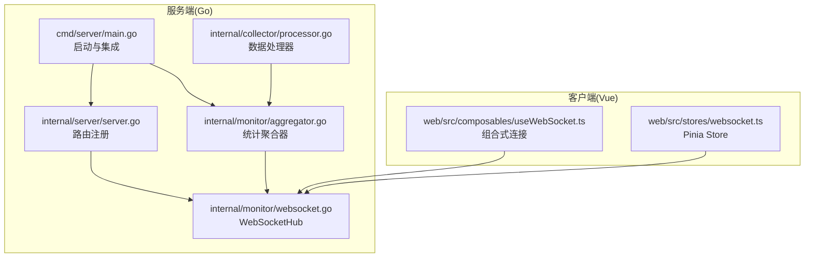
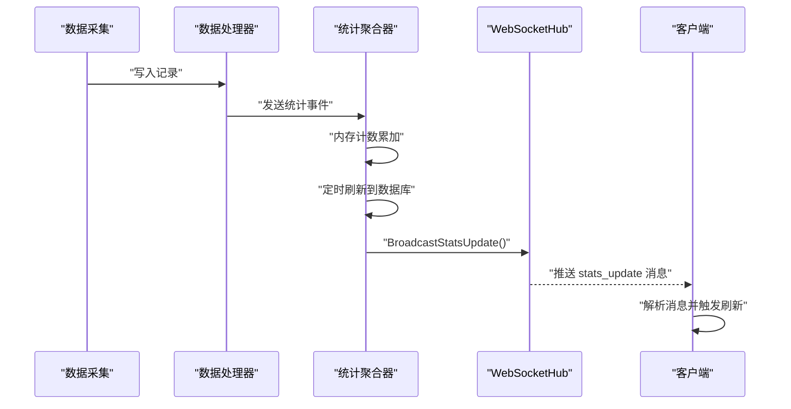
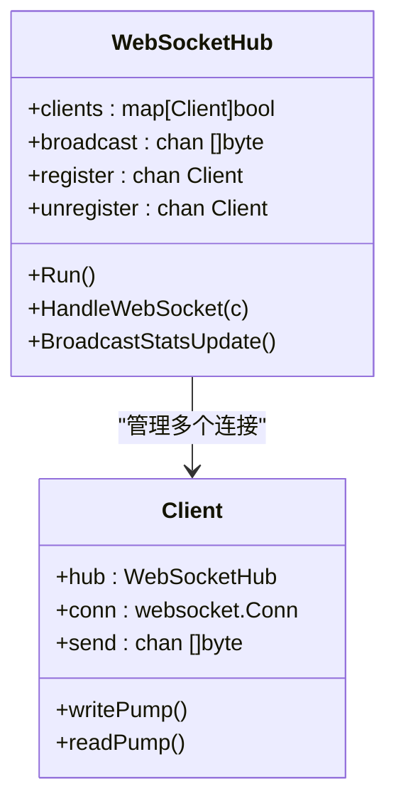
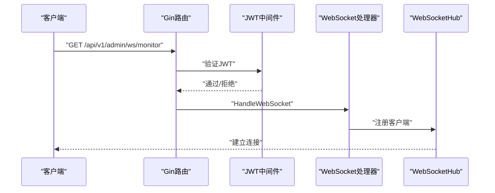
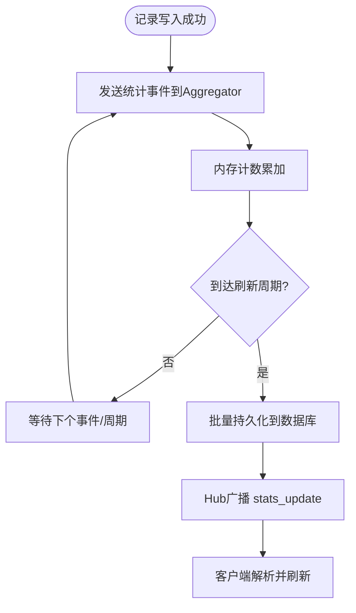
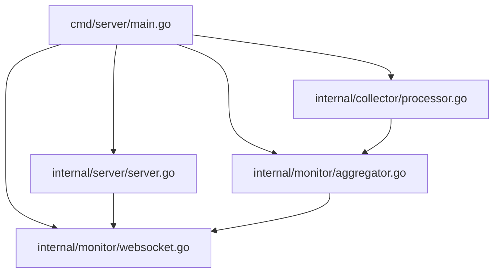

# WebSocket扩展

<cite>
**本文引用的文件**
- [websocket.go](file://internal/monitor/websocket.go)
- [aggregator.go](file://internal/monitor/aggregator.go)
- [processor.go](file://internal/collector/processor.go)
- [server.go](file://internal/server/server.go)
- [main.go](file://cmd/server/main.go)
- [router.go](file://internal/api/router.go)
- [useWebSocket.ts](file://web/src/composables/useWebSocket.ts)
- [websocket.ts](file://web/src/stores/websocket.ts)
- [config.yaml](file://configs/config.yaml)
- [statistics.go](file://internal/model/statistics.go)
- [statistics.go](file://internal/storage/postgres/statistics.go)
</cite>

## 目录
1. [简介](#简介)
2. [项目结构](#项目结构)
3. [核心组件](#核心组件)
4. [架构总览](#架构总览)
5. [详细组件分析](#详细组件分析)
6. [依赖分析](#依赖分析)
7. [性能考虑](#性能考虑)
8. [故障排查指南](#故障排查指南)
9. [结论](#结论)
10. [附录](#附录)

## 简介
本指南面向DataCollector的WebSocket扩展，围绕WebSocketHub的设计与连接管理、消息类型与事件处理扩展、自定义WebSocket处理器开发与注册、实时统计数据推送机制与扩展点、连接池与负载均衡策略、消息序列化与反序列化扩展、安全与认证扩展、性能监控与调试工具使用，以及客户端SDK扩展开发进行系统性阐述。目标是帮助开发者在现有架构基础上安全、高效地扩展WebSocket能力。

## 项目结构
WebSocket相关代码主要分布在以下位置：
- 服务端Go代码：monitor包负责WebSocketHub与统计聚合；collector包负责数据处理与统计事件产生；server包负责路由注册；cmd/server/main.go负责启动与集成。
- 客户端Vue代码：web/src/composables与web/src/stores中提供WebSocket连接与消息处理的组合式API与Pinia Store。

**图表来源**
- [main.go:70-87](file://cmd/server/main.go#L70-L87)
- [server.go:79-83](file://internal/server/server.go#L79-L83)
- [websocket.go:14-61](file://internal/monitor/websocket.go#L14-L61)
- [aggregator.go:17-40](file://internal/monitor/aggregator.go#L17-L40)
- [processor.go:16-28](file://internal/collector/processor.go#L16-L28)
- [useWebSocket.ts:3-65](file://web/src/composables/useWebSocket.ts#L3-L65)
- [websocket.ts:4-84](file://web/src/stores/websocket.ts#L4-L84)

**章节来源**
- [main.go:70-87](file://cmd/server/main.go#L70-L87)
- [server.go:79-83](file://internal/server/server.go#L79-L83)
- [websocket.go:14-61](file://internal/monitor/websocket.go#L14-L61)
- [aggregator.go:17-40](file://internal/monitor/aggregator.go#L17-L40)
- [processor.go:16-28](file://internal/collector/processor.go#L16-L28)
- [useWebSocket.ts:3-65](file://web/src/composables/useWebSocket.ts#L3-L65)
- [websocket.ts:4-84](file://web/src/stores/websocket.ts#L4-L84)

## 核心组件
- WebSocketHub：负责连接生命周期管理、广播通道、客户端注册/注销、心跳与读写泵。
- Client：封装单个WebSocket连接，包含写泵与读泵协程。
- Aggregator：统计聚合器，接收来自Processor的统计事件，周期性刷新至数据库，并通过Hub广播“stats_update”通知。
- Processor：数据处理器，处理记录写入并在成功后向Aggregator发送统计事件。
- Server路由：注册WebSocket监控端点，应用JWT认证中间件。
- 客户端连接：useWebSocket与Pinia Store提供连接、断线重连、消息订阅等能力。

**章节来源**
- [websocket.go:14-215](file://internal/monitor/websocket.go#L14-L215)
- [aggregator.go:17-133](file://internal/monitor/aggregator.go#L17-L133)
- [processor.go:16-52](file://internal/collector/processor.go#L16-L52)
- [server.go:79-83](file://internal/server/server.go#L79-L83)
- [useWebSocket.ts:3-65](file://web/src/composables/useWebSocket.ts#L3-L65)
- [websocket.ts:4-84](file://web/src/stores/websocket.ts#L4-L84)

## 架构总览
WebSocket扩展采用“事件驱动+聚合刷新”的推送模式：数据采集成功后产生统计事件，聚合器周期性将增量计数持久化到数据库，并触发Hub广播“stats_update”消息，客户端收到后主动拉取最新统计数据。

**图表来源**
- [processor.go:34-52](file://internal/collector/processor.go#L34-L52)
- [aggregator.go:52-133](file://internal/monitor/aggregator.go#L52-L133)
- [websocket.go:110-127](file://internal/monitor/websocket.go#L110-L127)

**章节来源**
- [processor.go:34-52](file://internal/collector/processor.go#L34-L52)
- [aggregator.go:52-133](file://internal/monitor/aggregator.go#L52-L133)
- [websocket.go:110-127](file://internal/monitor/websocket.go#L110-L127)

## 详细组件分析

### WebSocketHub设计与连接管理
- 结构组成：clients映射、广播通道broadcast、注册/注销通道、互斥锁、日志器。
- 连接生命周期：
  - HandleWebSocket完成HTTP到WebSocket升级，创建Client并注册到Hub。
  - readPump设置读超时与pong处理，异常关闭时自动注销。
  - writePump定期发送Ping并批量写出send队列，超时或关闭时清理。
  - Hub主循环select处理注册、注销与广播，对阻塞发送的客户端进行清理。
- 心跳与保活：writePump以固定周期发送Ping，readPump通过pong handler延长读超时。
- 广播策略：按当前活跃客户端列表批量投递消息，避免重复遍历。

**图表来源**
- [websocket.go:14-61](file://internal/monitor/websocket.go#L14-L61)
- [websocket.go:129-147](file://internal/monitor/websocket.go#L129-L147)
- [websocket.go:149-215](file://internal/monitor/websocket.go#L149-L215)

**章节来源**
- [websocket.go:64-106](file://internal/monitor/websocket.go#L64-L106)
- [websocket.go:129-147](file://internal/monitor/websocket.go#L129-L147)
- [websocket.go:149-215](file://internal/monitor/websocket.go#L149-L215)

### 消息类型与事件处理扩展
- 当前消息类型：WSMessage(Type, Data)，示例“stats_update”通知客户端刷新。
- 扩展建议：
  - 新增消息类型：在WSMessage结构体外定义新类型枚举或常量，如“dashboard_trend”、“source_status”等。
  - 事件处理：在客户端Store或Composable中新增onMessage回调分支，解析Type并分发到对应处理器。
  - 服务端广播：在Hub中新增BroadcastXxx方法，构造WSMessage并投递到broadcast通道。
- 注意：保持消息字段的向后兼容与Schema校验，避免破坏现有客户端。

**章节来源**
- [websocket.go:31-42](file://internal/monitor/websocket.go#L31-L42)
- [websocket.go:110-127](file://internal/monitor/websocket.go#L110-L127)
- [websocket.ts:32-38](file://web/src/stores/websocket.ts#L32-L38)
- [useWebSocket.ts:18-25](file://web/src/composables/useWebSocket.ts#L18-L25)

### 自定义WebSocket处理器开发与注册
- 开发步骤：
  - 在monitor包内新增处理器结构体，持有Hub引用与业务依赖。
  - 实现HandleXxx方法，完成协议握手、鉴权、订阅/退订逻辑。
  - 在server包的路由注册处，挂载JWT认证中间件后绑定到具体路径。
- 注册流程：
  - 在server.go中添加GET路由，链式使用auth.JWTAuthMiddleware与处理器方法。
  - 在cmd/server/main.go中确保Hub与处理器实例被正确注入与启动。
- 示例参考：监控端点“/api/v1/admin/ws/monitor”已演示完整流程。

**图表来源**
- [server.go:79-83](file://internal/server/server.go#L79-L83)
- [websocket.go:129-147](file://internal/monitor/websocket.go#L129-L147)

**章节来源**
- [server.go:79-83](file://internal/server/server.go#L79-L83)
- [main.go:70-82](file://cmd/server/main.go#L70-L82)

### 实时统计数据推送实现与扩展点
- 推送机制：
  - Processor在记录写入成功后向Aggregator发送StatEvent。
  - Aggregator以60秒为周期flush内存计数到数据库，并调用Hub.BroadcastStatsUpdate()。
  - Hub广播“stats_update”消息，客户端收到后触发UI刷新。
- 扩展点：
  - 新增推送主题：在Aggregator中维护多主题计数器，分别flush与广播。
  - 增量推送：在Aggregator中直接计算差量并广播更细粒度的消息，减少客户端全量刷新成本。
  - 多租户/权限控制：在Hub侧按用户/令牌维度过滤广播目标。

**图表来源**
- [processor.go:34-52](file://internal/collector/processor.go#L34-L52)
- [aggregator.go:52-133](file://internal/monitor/aggregator.go#L52-L133)
- [websocket.go:110-127](file://internal/monitor/websocket.go#L110-L127)

**章节来源**
- [processor.go:34-52](file://internal/collector/processor.go#L34-L52)
- [aggregator.go:52-133](file://internal/monitor/aggregator.go#L52-L133)
- [statistics.go:10-22](file://internal/storage/postgres/statistics.go#L10-L22)

### 连接池管理与负载均衡策略
- 连接池现状：当前Hub为单一进程内管理，未内置跨节点连接池。
- 建议策略：
  - 进程内优化：合理设置Client.send队列容量（当前256），根据峰值QPS调整；启用writePump批量写出降低写放大。
  - 负载均衡：多实例部署时，使用Nginx/HAProxy做WS/TLS终止与会话亲和；或引入消息总线（如Redis Pub/Sub）在实例间转发广播。
  - 连接健康：结合readPump的pong与writePump的Ping，实现心跳检测；对长时间无活动连接进行回收。
- 本节为通用实践建议，不涉及具体代码修改。

### 消息序列化与反序列化扩展
- 当前实现：
  - 服务端使用标准库JSON编码消息，客户端使用浏览器原生JSON.parse解析。
- 扩展方法：
  - 新增消息类型：在Go侧定义新结构体并使用json标签；在TS侧定义对应接口，严格区分可选/必填字段。
  - 兼容性：为历史消息保留兼容字段，避免破坏旧客户端；在客户端增加版本号字段以便灰度升级。
  - 性能：对高频消息可考虑压缩或二进制序列化（如CBOR/MessagePack），但需平衡复杂度与兼容性。

**章节来源**
- [websocket.go:116-120](file://internal/monitor/websocket.go#L116-L120)
- [websocket.ts:32-38](file://web/src/stores/websocket.ts#L32-L38)
- [useWebSocket.ts:18-25](file://web/src/composables/useWebSocket.ts#L18-L25)

### WebSocket安全机制与连接认证扩展
- 现状：
  - WebSocket端点已挂载JWT认证中间件，要求携带有效token。
  - upgrader允许任意来源（CheckOrigin返回true），生产环境建议限制来源。
- 扩展建议：
  - 引入基于角色/权限的细粒度鉴权，如仅允许admin访问监控端点。
  - TLS强制：在config.yaml中启用TLS配置，客户端自动切换为wss。
  - CORS与来源校验：在upgrader.CheckOrigin中校验Referer/Origin白名单。
  - 速率限制：为WebSocket连接增加独立的速率限制与并发连接上限。

**章节来源**
- [server.go:79-83](file://internal/server/server.go#L79-L83)
- [websocket.go:44-50](file://internal/monitor/websocket.go#L44-L50)
- [config.yaml:6-9](file://configs/config.yaml#L6-L9)

### 性能监控与调试工具使用
- 日志与指标：
  - Hub与Aggregator均使用slog记录关键事件（注册/注销/广播/刷新）。
  - 建议增加指标埋点：连接数、消息吞吐、广播延迟、写队列长度、丢弃率。
- 调试要点：
  - 客户端：useWebSocket与websocket Store提供connected状态与onMessage回调，便于观察连接与消息流。
  - 服务端：关注writePump阻塞与readPump异常关闭的告警；对广播通道满载进行降级处理。
- 工具建议：使用pprof、expvar或Prometheus抓取运行时指标；结合slog输出到文件并配合lumberjack轮转。

**章节来源**
- [websocket.go:71-71](file://internal/monitor/websocket.go#L71-L71)
- [websocket.go:80-80](file://internal/monitor/websocket.go#L80-L80)
- [websocket.go:125-125](file://internal/monitor/websocket.go#L125-L125)
- [main.go:139-153](file://cmd/server/main.go#L139-L153)

### 客户端SDK扩展开发指南
- 组合式API(useWebSocket)：
  - 提供connect/disconnect/onMessage等方法，自动处理重连与卸载清理。
  - 建议扩展：支持多主题订阅、批量消息处理、消息ACK/NACK机制。
- Pinia Store(websocket.ts)：
  - 封装统一连接与消息分发，适合全局状态管理。
  - 建议扩展：支持多连接、连接优先级、消息去重与顺序保证。
- 通信协议：
  - 基于JSON的WSMessage结构，建议定义消息Schema与版本号，便于演进。
  - 对大体量数据推送建议分页/分片传输，避免单帧过大。

**章节来源**
- [useWebSocket.ts:3-65](file://web/src/composables/useWebSocket.ts#L3-L65)
- [websocket.ts:4-84](file://web/src/stores/websocket.ts#L4-L84)

## 依赖分析
WebSocket扩展的关键依赖关系如下：

**图表来源**
- [main.go:70-82](file://cmd/server/main.go#L70-L82)
- [server.go:79-83](file://internal/server/server.go#L79-L83)
- [websocket.go:14-61](file://internal/monitor/websocket.go#L14-L61)
- [aggregator.go:17-40](file://internal/monitor/aggregator.go#L17-L40)
- [processor.go:16-28](file://internal/collector/processor.go#L16-L28)

**章节来源**
- [main.go:70-82](file://cmd/server/main.go#L70-L82)
- [server.go:79-83](file://internal/server/server.go#L79-L83)
- [websocket.go:14-61](file://internal/monitor/websocket.go#L14-L61)
- [aggregator.go:17-40](file://internal/monitor/aggregator.go#L17-L40)
- [processor.go:16-28](file://internal/collector/processor.go#L16-L28)

## 性能考虑
- 连接与通道：
  - Client.send队列容量与广播通道缓冲应匹配峰值QPS，避免阻塞与丢弃。
  - writePump批量写出可显著降低系统调用次数。
- 聚合与广播：
  - Aggregator的刷新周期与内存计数器大小需权衡实时性与数据库压力。
  - 广播通道满载时的降级策略（丢弃/回压）需记录日志以便观测。
- 客户端体验：
  - 重连策略指数退避，避免雪崩效应。
  - 客户端侧对重复/乱序消息进行去重与排序。

## 故障排查指南
- 常见问题与定位：
  - 连接无法建立：检查JWT是否有效、路由是否挂载JWT中间件、upgrader来源校验。
  - 消息不达：检查broadcast通道是否阻塞、客户端onMessage是否正确注册。
  - 心跳失败：检查writePump/Ping/Pong逻辑，确认readPump的pong handler是否生效。
- 日志与观测：
  - 关注Hub的注册/注销日志、广播通道满载警告、写队列丢弃记录。
  - 客户端Store/Composable的connected状态变化与重连间隔。
- 快速修复：
  - 临时收紧来源校验与速率限制。
  - 降低Aggregator刷新频率或增大通道缓冲，缓解瞬时高峰。

**章节来源**
- [websocket.go:125-125](file://internal/monitor/websocket.go#L125-L125)
- [websocket.go:209-211](file://internal/monitor/websocket.go#L209-L211)
- [websocket.ts:28-38](file://web/src/stores/websocket.ts#L28-L38)
- [useWebSocket.ts:14-37](file://web/src/composables/useWebSocket.ts#L14-L37)

## 结论
DataCollector的WebSocket扩展以Hub为中心，结合事件驱动与周期性聚合，实现了稳定高效的实时推送。通过明确的消息协议、完善的连接管理与可观测的日志体系，开发者可在不破坏现有架构的前提下，安全扩展消息类型、处理器与安全策略，并通过合理的性能与运维手段保障生产可用性。

## 附录
- 数据模型与统计接口：
  - 统计数据模型与趋势点定义位于model包。
  - Postgres存储提供统计计数的UPSERT与范围查询能力，支撑前端展示。

**章节来源**
- [statistics.go:5-19](file://internal/model/statistics.go#L5-L19)
- [statistics.go:10-47](file://internal/storage/postgres/statistics.go#L10-L47)