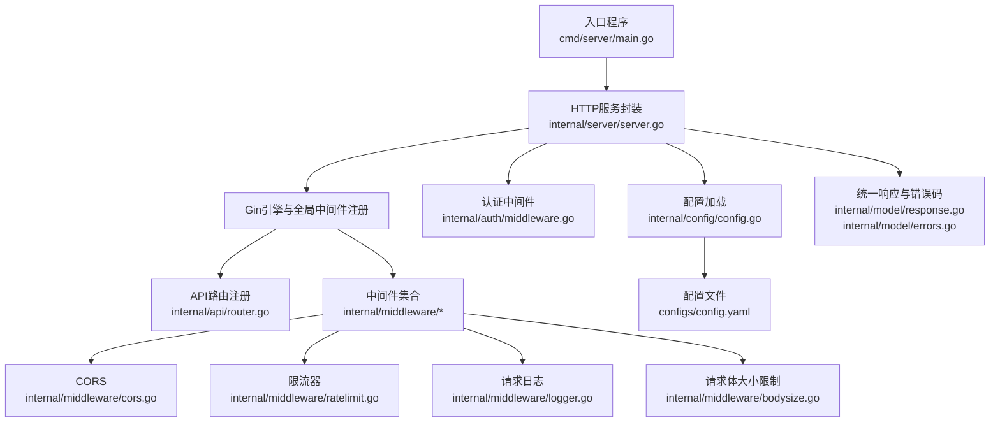
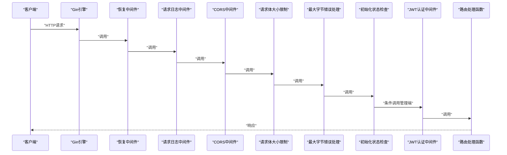
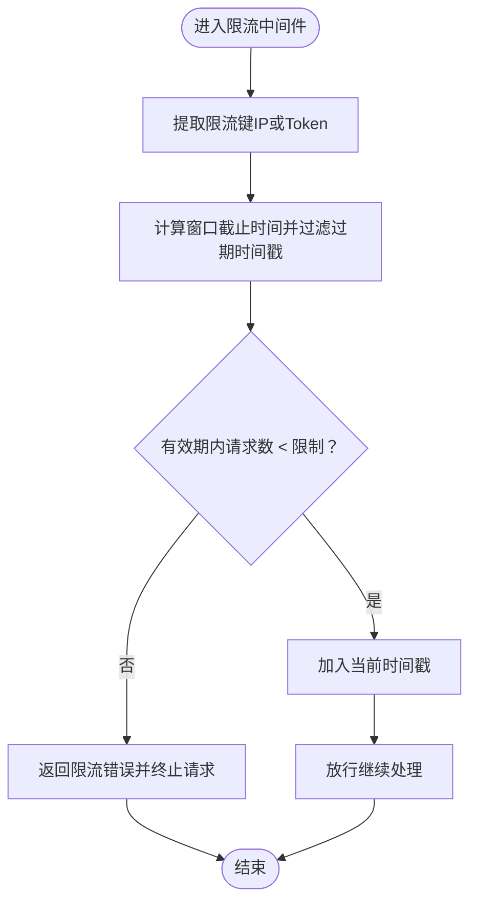
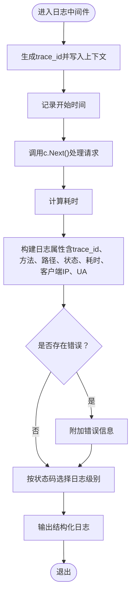
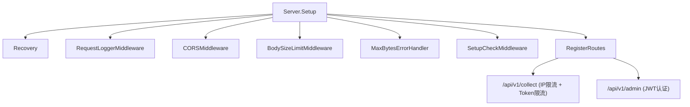

# 中间件扩展

<cite>
**本文引用的文件**
- [main.go](file://cmd/server/main.go)
- [server.go](file://internal/server/server.go)
- [router.go](file://internal/api/router.go)
- [cors.go](file://internal/middleware/cors.go)
- [ratelimit.go](file://internal/middleware/ratelimit.go)
- [logger.go](file://internal/middleware/logger.go)
- [bodysize.go](file://internal/middleware/bodysize.go)
- [middleware.go](file://internal/auth/middleware.go)
- [config.go](file://internal/config/config.go)
- [config.yaml](file://configs/config.yaml)
- [errors.go](file://internal/model/errors.go)
- [response.go](file://internal/model/response.go)
</cite>

## 目录
1. [简介](#简介)
2. [项目结构](#项目结构)
3. [核心组件](#核心组件)
4. [架构总览](#架构总览)
5. [详细组件分析](#详细组件分析)
6. [依赖分析](#依赖分析)
7. [性能考虑](#性能考虑)
8. [故障排查指南](#故障排查指南)
9. [结论](#结论)
10. [附录](#附录)

## 简介
本指南面向DataCollector的中间件扩展与维护，围绕Gin框架的中间件执行顺序与链式调用机制，系统讲解如何开发与注册自定义HTTP中间件；并基于现有实现，提供CORS、限流、日志、请求大小限制等中间件的扩展思路与最佳实践。文档同时覆盖中间件上下文传递、错误处理、配置管理与动态启停、性能监控与指标采集、安全中间件（如IP白名单、请求签名）扩展建议，以及单元与集成测试策略。

## 项目结构
DataCollector采用分层与按功能域组织的结构：入口程序负责启动与生命周期管理；Server封装Gin引擎与中间件注册；API路由集中注册；中间件模块化存放于internal/middleware；认证中间件位于internal/auth；配置位于internal/config与configs/config.yaml；统一响应模型与错误码位于internal/model。

图表来源
- [main.go:25-87](file://cmd/server/main.go#L25-L87)
- [server.go:54-87](file://internal/server/server.go#L54-L87)
- [router.go:14-115](file://internal/api/router.go#L14-L115)
- [cors.go:11-50](file://internal/middleware/cors.go#L11-L50)
- [ratelimit.go:22-136](file://internal/middleware/ratelimit.go#L22-L136)
- [logger.go:13-66](file://internal/middleware/logger.go#L13-L66)
- [bodysize.go:12-39](file://internal/middleware/bodysize.go#L12-L39)
- [middleware.go:19-63](file://internal/auth/middleware.go#L19-L63)
- [config.go:82-146](file://internal/config/config.go#L82-L146)
- [config.yaml:1-41](file://configs/config.yaml#L1-L41)
- [response.go:9-71](file://internal/model/response.go#L9-L71)
- [errors.go:3-84](file://internal/model/errors.go#L3-L84)

章节来源
- [main.go:25-87](file://cmd/server/main.go#L25-L87)
- [server.go:54-87](file://internal/server/server.go#L54-L87)
- [router.go:14-115](file://internal/api/router.go#L14-L115)
- [config.go:82-146](file://internal/config/config.go#L82-L146)
- [config.yaml:1-41](file://configs/config.yaml#L1-L41)

## 核心组件
- Gin引擎与中间件注册：在Server.Setup中创建Gin引擎并注册全局中间件，随后集中注册API路由与静态资源。
- 中间件模块：CORS、限流器（滑动窗口）、请求日志、请求体大小限制。
- 认证中间件：JWT认证与角色校验，配合初始化状态检查中间件。
- 配置系统：YAML配置文件与环境变量覆盖，支持运行时调整限流、CORS与日志等参数。
- 统一响应与错误码：标准化错误返回，便于中间件与业务层一致处理。

章节来源
- [server.go:54-87](file://internal/server/server.go#L54-L87)
- [cors.go:11-50](file://internal/middleware/cors.go#L11-L50)
- [ratelimit.go:22-136](file://internal/middleware/ratelimit.go#L22-L136)
- [logger.go:13-66](file://internal/middleware/logger.go#L13-L66)
- [bodysize.go:12-39](file://internal/middleware/bodysize.go#L12-L39)
- [middleware.go:19-63](file://internal/auth/middleware.go#L19-L63)
- [config.go:82-146](file://internal/config/config.go#L82-L146)
- [response.go:9-71](file://internal/model/response.go#L9-L71)
- [errors.go:3-84](file://internal/model/errors.go#L3-L84)

## 架构总览
下图展示从HTTP请求进入Gin引擎，到各中间件依次执行、最终到达路由处理函数的完整链路，以及关键中间件的职责与交互。

图表来源
- [server.go:63-74](file://internal/server/server.go#L63-L74)
- [logger.go:13-66](file://internal/middleware/logger.go#L13-L66)
- [cors.go:11-50](file://internal/middleware/cors.go#L11-L50)
- [bodysize.go:12-39](file://internal/middleware/bodysize.go#L12-L39)
- [middleware.go:103-147](file://internal/auth/middleware.go#L103-L147)
- [router.go:74-114](file://internal/api/router.go#L74-L114)

## 详细组件分析

### Gin中间件执行顺序与链式调用机制
- 执行顺序：全局中间件按注册顺序依次执行；每个中间件通过调用c.Next()将控制权交给下一个中间件；当到达路由处理函数后，再按相反顺序回溯，执行已注册中间件的后续逻辑。
- 上下文传递：中间件可通过c.Set(key, value)向Gin上下文注入数据，后续中间件与路由可使用c.Get(key)读取。
- 错误处理：中间件可向c.Errors追加错误；在日志中间件中会读取c.Errors并记录；也可在错误处理中间件中拦截特定错误（如请求体过大）并转换为标准响应。

章节来源
- [server.go:63-74](file://internal/server/server.go#L63-L74)
- [logger.go:13-66](file://internal/middleware/logger.go#L13-L66)
- [bodysize.go:20-39](file://internal/middleware/bodysize.go#L20-L39)

### CORS中间件
- 功能要点：根据配置允许的源设置Access-Control-Allow-Origin；设置允许的方法与头部；对OPTIONS预检请求直接返回；支持通配符“*”。
- 扩展建议：增加允许方法与头部的动态配置、支持凭据携带（withCredentials）的精细控制、跨源暴露响应头设置。

章节来源
- [cors.go:11-50](file://internal/middleware/cors.go#L11-L50)
- [config.go:64-70](file://internal/config/config.go#L64-L70)
- [config.yaml:27-33](file://configs/config.yaml#L27-L33)

### 限流中间件（滑动窗口）
- 实现原理：以标识符（如IP或Data Token）为键，维护时间戳列表，窗口外的时间戳被清理；每次请求判断有效期内请求数是否超过阈值。
- 中间件形式：提供按IP与按Token两种限流中间件；超过阈值时返回统一错误码与响应。
- 性能特性：使用RWMutex保护共享状态；定期清理goroutine降低内存占用；滑动窗口避免固定桶的边界问题。
- 扩展建议：支持多级限流（全局/按源/按用户）、持久化计数器、速率阶梯配置、限流豁免白名单。

图表来源
- [ratelimit.go:68-98](file://internal/middleware/ratelimit.go#L68-L98)
- [ratelimit.go:100-136](file://internal/middleware/ratelimit.go#L100-L136)

章节来源
- [ratelimit.go:12-136](file://internal/middleware/ratelimit.go#L12-L136)
- [router.go:48-55](file://internal/api/router.go#L48-L55)
- [config.go:64-70](file://internal/config/config.go#L64-L70)
- [config.yaml:27-31](file://configs/config.yaml#L27-L31)

### 请求日志中间件
- 功能要点：生成trace_id并写入上下文；记录请求开始时间；在c.Next()之后计算耗时；根据状态码选择日志级别；记录客户端IP、User-Agent等；若存在c.Errors则一并记录。
- 扩展建议：支持采样日志、结构化字段扩展（如用户ID）、异步日志写入、日志轮转与归档。

图表来源
- [logger.go:13-66](file://internal/middleware/logger.go#L13-L66)

章节来源
- [logger.go:11-66](file://internal/middleware/logger.go#L11-L66)

### 请求体大小限制中间件
- 功能要点：使用http.MaxBytesReader限制请求体大小；配合错误处理中间件识别“请求体过大”错误并转换为标准响应。
- 注意事项：需与Recovery中间件配合，确保错误被捕获并传递至错误处理中间件。

章节来源
- [bodysize.go:10-39](file://internal/middleware/bodysize.go#L10-L39)
- [server.go:63-67](file://internal/server/server.go#L63-L67)

### 认证与初始化状态检查中间件
- JWT认证中间件：从Authorization头或URL参数解析Bearer Token，验证后将用户信息写入上下文；错误时返回统一错误码。
- 初始化状态检查中间件：根据初始化状态决定放行或重定向/返回错误；允许访问初始化相关API与静态资源。
- 角色检查中间件：基于上下文中的角色进行RBAC校验。

章节来源
- [middleware.go:19-63](file://internal/auth/middleware.go#L19-L63)
- [middleware.go:65-95](file://internal/auth/middleware.go#L65-L95)
- [middleware.go:100-147](file://internal/auth/middleware.go#L100-L147)
- [server.go:70-74](file://internal/server/server.go#L70-L74)

### 开发自定义HTTP中间件与注册方法
- 开发步骤
  - 定义gin.HandlerFunc，接收c *gin.Context，按需读取请求信息、写入上下文、调用c.Next()。
  - 在Server.Setup中通过engine.Use注册全局中间件；在router中通过r.Group().Use为特定路由组注册中间件。
- 示例参考
  - 全局中间件注册：[server.go:63-74](file://internal/server/server.go#L63-L74)
  - 路由组中间件注册：[router.go:48-55](file://internal/api/router.go#L48-L55)

章节来源
- [server.go:54-87](file://internal/server/server.go#L54-L87)
- [router.go:14-115](file://internal/api/router.go#L14-L115)

### 中间件的上下文传递与错误处理机制
- 上下文传递：通过c.Set与c.Get在中间件与路由之间传递数据（如trace_id、用户信息、角色等）。
- 错误处理：中间件可向c.Errors追加错误；日志中间件读取并记录；错误处理中间件拦截特定错误并转换为标准响应。

章节来源
- [logger.go:18-55](file://internal/middleware/logger.go#L18-L55)
- [bodysize.go:26-37](file://internal/middleware/bodysize.go#L26-L37)
- [response.go:63-71](file://internal/model/response.go#L63-L71)

### 配置管理与动态启用/禁用
- 配置来源：YAML文件与环境变量覆盖；Server在启动时加载配置并设置Gin模式。
- 动态启用/禁用：可在Server.Setup中根据配置条件性地注册中间件（例如仅在启用CORS时注册），或通过配置开关控制中间件行为（如限流阈值、日志级别）。
- 参考位置
  - 配置加载与默认值：[config.go:82-146](file://internal/config/config.go#L82-L146)，[config.yaml:1-41](file://configs/config.yaml#L1-41)
  - 全局中间件注册：[server.go:63-74](file://internal/server/server.go#L63-L74)

章节来源
- [config.go:82-146](file://internal/config/config.go#L82-L146)
- [config.yaml:1-41](file://configs/config.yaml#L1-41)
- [server.go:54-87](file://internal/server/server.go#L54-L87)

### 性能监控中间件与指标采集
- 建议方案
  - 在请求日志中间件基础上扩展：记录请求维度指标（QPS、P95/P99耗时、状态码分布、错误率）。
  - 使用轻量级指标库（如Prometheus Go客户端）在中间件中埋点，避免阻塞请求链路。
  - 对高开销操作（如外部调用、数据库查询）采用异步上报或批量上报。
- 与现有日志结合：统一结构化字段，便于日志与指标关联分析。

[本节为通用指导，不直接分析具体文件]

### 安全中间件扩展建议
- IP白名单：在路由组或全局中间件中校验客户端IP是否在允许列表内，拒绝不在白名单的请求。
- 请求签名验证：对关键API要求客户端携带签名（如基于密钥+时间戳+参数的哈希），在中间件中校验签名有效性与时效性。
- CSRF防护：为非GET/HEAD/OPTIONS请求增加CSRF令牌校验（结合前端同源策略与SameSite Cookie）。
- 传输安全：强制HTTPS、HSTS、安全Cookie属性（Secure、HttpOnly、SameSite）。

[本节为通用指导，不直接分析具体文件]

### 单元测试与集成测试策略
- 单元测试
  - 针对限流器：构造不同时间序列与并发场景，断言isAllowed结果；验证清理goroutine的正确性。
  - 针对日志中间件：模拟c.Next()前后状态，断言日志输出字段与级别。
  - 针对CORS中间件：构造不同Origin请求，断言响应头与预检处理。
- 集成测试
  - 使用httptest或真实HTTP客户端对路由组进行端到端测试，验证中间件链路与错误处理。
  - 配置热更新：修改配置后重启或触发重载，验证中间件行为变化。
- 测试工具与建议
  - 使用Testify断言与Mock；对依赖外部系统（如数据库、Redis）使用容器化测试环境。

[本节为通用指导，不直接分析具体文件]

## 依赖分析
中间件之间的耦合度低，主要通过Gin上下文与HTTP协议交互；Server负责编排全局中间件与路由注册；API路由根据业务域分组并按需挂载中间件。

图表来源
- [server.go:54-87](file://internal/server/server.go#L54-L87)
- [router.go:34-114](file://internal/api/router.go#L34-L114)

章节来源
- [server.go:54-87](file://internal/server/server.go#L54-L87)
- [router.go:34-114](file://internal/api/router.go#L34-L114)

## 性能考虑
- 中间件顺序优化：将短路错误的中间件（如限流、CORS预检）置于靠前位置，减少后续处理成本。
- 并发安全：限流器使用RWMutex，避免频繁加锁；定期清理goroutine降低内存占用。
- 日志与错误：结构化日志与采样策略降低I/O压力；错误处理中间件避免重复编码。
- 资源释放：在入口程序中优雅关闭HTTP服务与后台任务，确保中间件相关资源得到回收。

[本节为通用指导，不直接分析具体文件]

## 故障排查指南
- 请求体过大
  - 现象：返回“请求体过大”错误。
  - 排查：确认BodySizeLimitMiddleware与MaxBytesErrorHandler的注册顺序；检查配置中的max_body_size。
  - 参考：[bodysize.go:12-39](file://internal/middleware/bodysize.go#L12-L39)
- 限流触发
  - 现象：返回“请求频率超限”错误。
  - 排查：核对IP限流与Token限流阈值；确认限流键提取逻辑（IP或X-Data-Token）。
  - 参考：[ratelimit.go:100-136](file://internal/middleware/ratelimit.go#L100-L136)，[router.go:48-55](file://internal/api/router.go#L48-L55)
- CORS问题
  - 现象：浏览器跨域失败。
  - 排查：确认allowed_origins配置；检查预检请求处理。
  - 参考：[cors.go:11-50](file://internal/middleware/cors.go#L11-L50)，[config.go:64-70](file://internal/config/config.go#L64-L70)
- 认证失败
  - 现象：返回“缺少认证信息/无效的Token/Token已过期/权限不足”。
  - 排查：确认Authorization头或URL参数token；检查JWT密钥与过期时间；确认角色信息。
  - 参考：[middleware.go:19-63](file://internal/auth/middleware.go#L19-L63)，[middleware.go:65-95](file://internal/auth/middleware.go#L65-L95)
- 日志缺失
  - 现象：无请求日志。
  - 排查：确认RequestLoggerMiddleware注册；检查日志级别与输出目标。
  - 参考：[logger.go:13-66](file://internal/middleware/logger.go#L13-L66)，[config.yaml:34-41](file://configs/config.yaml#L34-L41)

章节来源
- [bodysize.go:12-39](file://internal/middleware/bodysize.go#L12-L39)
- [ratelimit.go:100-136](file://internal/middleware/ratelimit.go#L100-L136)
- [router.go:48-55](file://internal/api/router.go#L48-L55)
- [cors.go:11-50](file://internal/middleware/cors.go#L11-L50)
- [middleware.go:19-63](file://internal/auth/middleware.go#L19-L63)
- [middleware.go:65-95](file://internal/auth/middleware.go#L65-L95)
- [logger.go:13-66](file://internal/middleware/logger.go#L13-L66)
- [config.yaml:34-41](file://configs/config.yaml#L34-L41)

## 结论
DataCollector的中间件体系以Gin为核心，通过明确的执行顺序与上下文传递机制，实现了CORS、限流、日志、请求体大小限制等基础能力。结合配置系统与统一响应模型，可快速扩展安全与性能监控中间件。建议在新增中间件时遵循现有模式：保持无副作用、尽早失败、结构化日志与错误处理，并通过单元与集成测试保障质量。

[本节为总结性内容，不直接分析具体文件]

## 附录
- 统一响应与错误码
  - 参考：[response.go:9-71](file://internal/model/response.go#L9-L71)，[errors.go:3-84](file://internal/model/errors.go#L3-L84)
- 配置项参考
  - 参考：[config.go:64-80](file://internal/config/config.go#L64-L80)，[config.yaml:27-41](file://configs/config.yaml#L27-L41)