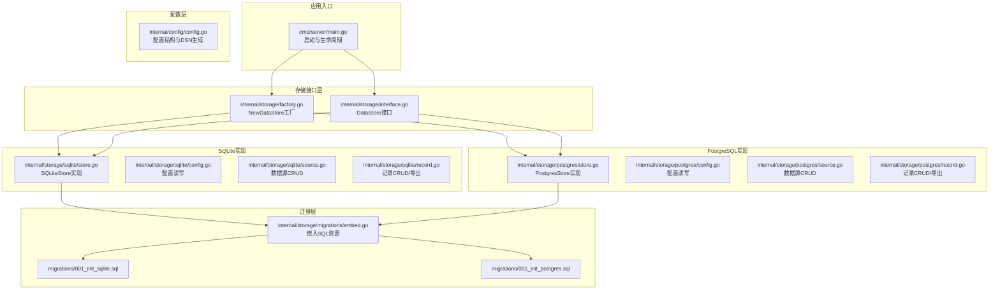
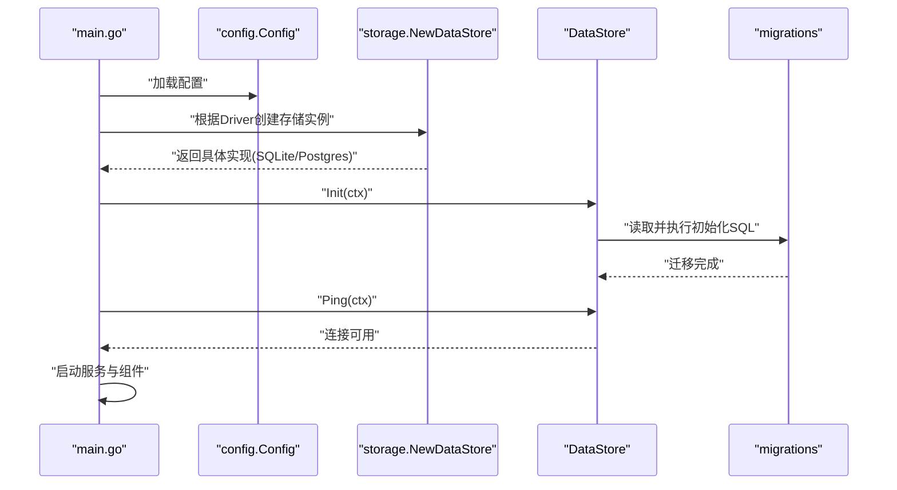
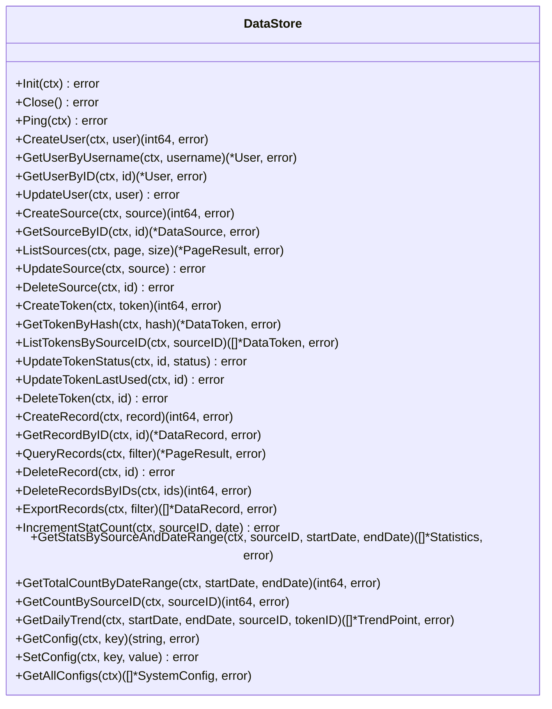
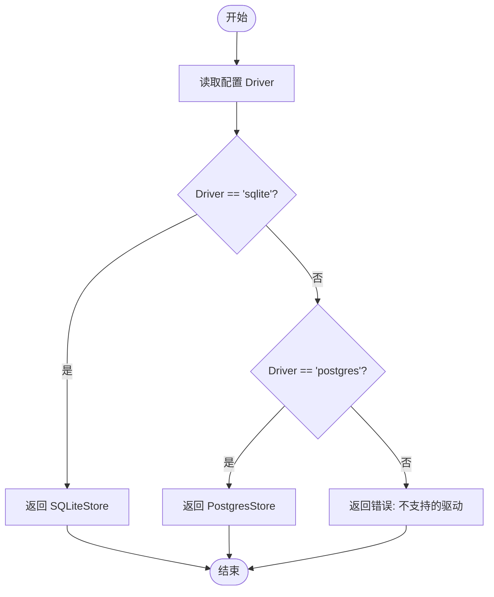
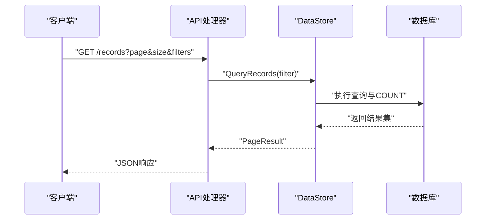
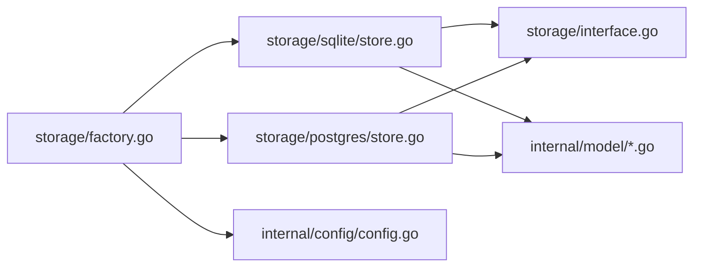

# 存储后端扩展

<cite>
**本文引用的文件**
- [internal/storage/interface.go](file://internal/storage/interface.go)
- [internal/storage/factory.go](file://internal/storage/factory.go)
- [internal/storage/sqlite/store.go](file://internal/storage/sqlite/store.go)
- [internal/storage/sqlite/config.go](file://internal/storage/sqlite/config.go)
- [internal/storage/sqlite/source.go](file://internal/storage/sqlite/source.go)
- [internal/storage/sqlite/record.go](file://internal/storage/sqlite/record.go)
- [internal/storage/postgres/store.go](file://internal/storage/postgres/store.go)
- [internal/storage/postgres/config.go](file://internal/storage/postgres/config.go)
- [internal/storage/postgres/source.go](file://internal/storage/postgres/source.go)
- [internal/storage/postgres/record.go](file://internal/storage/postgres/record.go)
- [internal/storage/migrations/embed.go](file://internal/storage/migrations/embed.go)
- [internal/storage/migrations/001_init_sqlite.sql](file://internal/storage/migrations/001_init_sqlite.sql)
- [internal/storage/migrations/001_init_postgres.sql](file://internal/storage/migrations/001_init_postgres.sql)
- [internal/config/config.go](file://internal/config/config.go)
- [cmd/server/main.go](file://cmd/server/main.go)
- [internal/model/config.go](file://internal/model/config.go)
- [internal/model/record.go](file://internal/model/record.go)
</cite>

## 目录
1. [简介](#简介)
2. [项目结构](#项目结构)
3. [核心组件](#核心组件)
4. [架构总览](#架构总览)
5. [详细组件分析](#详细组件分析)
6. [依赖分析](#依赖分析)
7. [性能考虑](#性能考虑)
8. [故障排查指南](#故障排查指南)
9. [结论](#结论)
10. [附录](#附录)

## 简介
本指南面向需要为 DataCollector 扩展自定义存储后端的开发者，系统讲解 DataStore 接口的设计原则与实现要求，提供 SQLite 与 PostgreSQL 的实现对比、工厂模式与注册机制、数据库迁移脚本编写与版本管理、性能优化与连接池配置、错误处理与事务管理最佳实践，并给出可直接参考的实现路径与测试建议。

## 项目结构
DataCollector 的存储层采用“接口 + 多实现 + 工厂”的分层设计：
- 接口层：统一抽象 DataStore，定义用户、数据源、Token、数据记录、统计、系统配置等操作契约。
- 实现层：分别提供 SQLite 与 PostgreSQL 的具体实现，每个实现均包含 store、config、source、record 等子模块。
- 工厂层：根据配置动态创建对应存储实例。
- 迁移层：通过嵌入式资源管理初始化脚本，支持 SQLite 与 PostgreSQL 的初始化。

**图表来源**
- [cmd/server/main.go:45-64](file://cmd/server/main.go#L45-L64)
- [internal/storage/factory.go:11-21](file://internal/storage/factory.go#L11-L21)
- [internal/storage/sqlite/store.go:17-56](file://internal/storage/sqlite/store.go#L17-L56)
- [internal/storage/postgres/store.go:14-34](file://internal/storage/postgres/store.go#L14-L34)
- [internal/storage/migrations/embed.go:1-7](file://internal/storage/migrations/embed.go#L1-L7)

**章节来源**
- [cmd/server/main.go:45-64](file://cmd/server/main.go#L45-L64)
- [internal/storage/factory.go:11-21](file://internal/storage/factory.go#L11-L21)
- [internal/storage/interface.go:9-56](file://internal/storage/interface.go#L9-L56)

## 核心组件
- DataStore 接口：定义了初始化、连接健康检查、关闭、用户/数据源/Token/记录/统计/系统配置等完整能力集合，确保不同存储实现具备一致的行为契约。
- 工厂函数 NewDataStore：依据配置中的 Driver 字段选择具体实现，支持 sqlite 与 postgres，默认 sqlite。
- SQLite 实现：基于 github.com/mattn/go-sqlite3，启用 WAL 模式与 busy_timeout，连接池限制为 1（SQLite 单写）。
- PostgreSQL 实现：基于 github.com/jackc/pgx/v5/stdlib，连接池默认最大打开 25，空闲 5。
- 迁移脚本：通过 embedFS 内嵌，按数据库类型读取对应的初始化 SQL 并执行。

**章节来源**
- [internal/storage/interface.go:9-56](file://internal/storage/interface.go#L9-L56)
- [internal/storage/factory.go:11-21](file://internal/storage/factory.go#L11-L21)
- [internal/storage/sqlite/store.go:17-56](file://internal/storage/sqlite/store.go#L17-L56)
- [internal/storage/postgres/store.go:14-34](file://internal/storage/postgres/store.go#L14-L34)
- [internal/storage/migrations/embed.go:1-7](file://internal/storage/migrations/embed.go#L1-L7)

## 架构总览
DataCollector 在启动时完成以下流程：
- 加载配置（含数据库驱动与连接参数）
- 通过工厂创建 DataStore 实例
- 执行数据库迁移
- 进行 Ping 健康检查
- 初始化 JWT、WebSocket Hub、统计聚合器与数据处理器
- 启动 HTTP 服务并在优雅关闭时释放数据库连接

**图表来源**
- [cmd/server/main.go:45-64](file://cmd/server/main.go#L45-L64)
- [internal/storage/factory.go:11-21](file://internal/storage/factory.go#L11-L21)
- [internal/storage/sqlite/store.go:58-75](file://internal/storage/sqlite/store.go#L58-L75)
- [internal/storage/postgres/store.go:36-50](file://internal/storage/postgres/store.go#L36-L50)
- [internal/storage/migrations/embed.go:1-7](file://internal/storage/migrations/embed.go#L1-L7)

## 详细组件分析

### DataStore 接口设计与实现要求
- 设计原则
  - 明确职责边界：接口聚焦数据持久化与元数据管理，不包含业务逻辑。
  - 一致性：同一操作在不同实现中语义一致（如软删除、分页、导出等）。
  - 可测试性：以 context 作为取消与超时控制，便于单元测试注入。
- 实现要求
  - 初始化与迁移：Init(ctx) 必须幂等，避免重复执行；迁移脚本通过嵌入资源读取。
  - 连接管理：Close() 与 Ping(ctx) 必须正确实现；连接池参数需符合数据库特性。
  - 并发安全：涉及写操作或共享状态的实现需保证线程安全（如 SQLite 使用互斥锁）。
  - 错误处理：明确区分“未找到”与“错误”，返回值语义清晰。

**图表来源**
- [internal/storage/interface.go:9-56](file://internal/storage/interface.go#L9-L56)

**章节来源**
- [internal/storage/interface.go:9-56](file://internal/storage/interface.go#L9-L56)

### 工厂模式与新存储类型的注册机制
- 工厂函数 NewDataStore 根据配置中的 Driver 选择实现：
  - 当 Driver 为 "sqlite" 时返回 SQLiteStore
  - 当 Driver 为 "postgres" 时返回 PostgresStore
  - 其他值则返回错误
- 新存储类型扩展步骤
  - 实现 DataStore 接口的所有方法（建议先实现基础 CRUD，再逐步完善统计与配置）
  - 在内部新增实现包（如 internal/storage/mysql/），提供 New(cfg) 构造函数
  - 在工厂函数中增加 case 分支，映射新的 Driver 值
  - 编写初始化迁移脚本并加入嵌入资源
  - 更新配置结构与 DSN 生成逻辑（如需要）

**图表来源**
- [internal/storage/factory.go:11-21](file://internal/storage/factory.go#L11-L21)

**章节来源**
- [internal/storage/factory.go:11-21](file://internal/storage/factory.go#L11-L21)

### SQLite 实现要点
- 连接与并发
  - 使用互斥锁保护写操作，避免并发写冲突
  - 启用 WAL 模式提升并发读写能力
  - 设置 busy_timeout，减少锁等待失败
  - 连接池限制为 1，符合 SQLite 单写特性
- 迁移与初始化
  - 通过嵌入资源读取 001_init_sqlite.sql 并执行
- 配置表
  - GetConfig/ SetConfig/ GetAllConfigs 提供系统配置的读写与枚举
- 数据源与记录
  - 支持分页、条件过滤、批量删除、导出等完整功能

**章节来源**
- [internal/storage/sqlite/store.go:17-56](file://internal/storage/sqlite/store.go#L17-L56)
- [internal/storage/sqlite/config.go:11-79](file://internal/storage/sqlite/config.go#L11-L79)
- [internal/storage/sqlite/source.go:11-166](file://internal/storage/sqlite/source.go#L11-L166)
- [internal/storage/sqlite/record.go:13-246](file://internal/storage/sqlite/record.go#L13-L246)
- [internal/storage/migrations/001_init_sqlite.sql:1-97](file://internal/storage/migrations/001_init_sqlite.sql#L1-L97)

### PostgreSQL 实现要点
- 连接与并发
  - 使用 pgx stdlib 驱动，连接池默认最大打开 25，空闲 5
- 迁移与初始化
  - 通过嵌入资源读取 001_init_postgres.sql 并执行
- 配置表
  - GetConfig/ SetConfig/ GetAllConfigs 与 SQLite 版本保持一致行为
- 数据源与记录
  - 支持分页、条件过滤、批量删除、导出等完整功能

**章节来源**
- [internal/storage/postgres/store.go:14-61](file://internal/storage/postgres/store.go#L14-L61)
- [internal/storage/postgres/config.go:11-77](file://internal/storage/postgres/config.go#L11-L77)
- [internal/storage/postgres/source.go:11-159](file://internal/storage/postgres/source.go#L11-L159)
- [internal/storage/postgres/record.go:13-249](file://internal/storage/postgres/record.go#L13-L249)
- [internal/storage/migrations/001_init_postgres.sql:1-91](file://internal/storage/migrations/001_init_postgres.sql#L1-L91)

### 数据模型与配置
- SystemConfig 模型：用于系统配置的键值存储
- DataRecord 与 RecordFilter：记录模型与分页查询参数
- 配置结构：包含数据库驱动、SQLite 路径、PostgreSQL 连接参数、JWT、收集器与日志等

**章节来源**
- [internal/model/config.go:5-12](file://internal/model/config.go#L5-L12)
- [internal/model/record.go:8-32](file://internal/model/record.go#L8-L32)
- [internal/config/config.go:12-215](file://internal/config/config.go#L12-L215)

### 迁移脚本编写与版本管理
- 资源嵌入
  - 使用 //go:embed *.sql 将迁移脚本打包进二进制
- 初始化脚本差异
  - SQLite：使用 TEXT/INTEGER 类型，索引风格与 SQLite 语法
  - PostgreSQL：使用 JSONB/UUID、TIMESTAMP WITH TIME ZONE、SERIAL 主键与索引
- 版本管理建议
  - 迁移文件命名采用递增序号（如 001、002），先在 SQLite 再在 PostgreSQL 对应版本
  - 新增字段或索引时，先在 SQLite 上验证，再在 PostgreSQL 上复现
  - 保持 SQL 语法兼容性，避免使用方言特性

**章节来源**
- [internal/storage/migrations/embed.go:1-7](file://internal/storage/migrations/embed.go#L1-L7)
- [internal/storage/migrations/001_init_sqlite.sql:1-97](file://internal/storage/migrations/001_init_sqlite.sql#L1-L97)
- [internal/storage/migrations/001_init_postgres.sql:1-91](file://internal/storage/migrations/001_init_postgres.sql#L1-L91)

### API/服务调用流程（以记录查询为例）

**图表来源**
- [internal/storage/sqlite/record.go:66-147](file://internal/storage/sqlite/record.go#L66-L147)
- [internal/storage/postgres/record.go:65-152](file://internal/storage/postgres/record.go#L65-L152)

## 依赖分析
- 组件耦合
  - 工厂仅依赖配置与具体实现包，解耦上层调用
  - 实现层依赖接口与模型，不反向依赖上层
- 外部依赖
  - SQLite：github.com/mattn/go-sqlite3
  - PostgreSQL：github.com/jackc/pgx/v5/stdlib
- 循环依赖
  - 未发现循环导入；接口与实现分离良好

**图表来源**
- [internal/storage/factory.go:11-21](file://internal/storage/factory.go#L11-L21)
- [internal/storage/sqlite/store.go:17-56](file://internal/storage/sqlite/store.go#L17-L56)
- [internal/storage/postgres/store.go:14-34](file://internal/storage/postgres/store.go#L14-L34)
- [internal/storage/interface.go:9-56](file://internal/storage/interface.go#L9-L56)
- [internal/config/config.go:12-215](file://internal/config/config.go#L12-L215)

**章节来源**
- [internal/storage/factory.go:11-21](file://internal/storage/factory.go#L11-L21)
- [internal/storage/sqlite/store.go:17-56](file://internal/storage/sqlite/store.go#L17-L56)
- [internal/storage/postgres/store.go:14-34](file://internal/storage/postgres/store.go#L14-L34)

## 性能考虑
- 连接池配置
  - SQLite：单写限制为 1，避免并发写冲突；启用 WAL 与 busy_timeout
  - PostgreSQL：默认最大打开 25，空闲 5；可根据负载调整
- 索引策略
  - 为常用查询字段建立索引（如 created_at、source_id、token_id、stat_date）
  - 避免过度索引导致写入性能下降
- 查询优化
  - 分页查询使用 LIMIT/OFFSET，注意大数据量场景下的排序成本
  - 条件查询尽量使用索引列，避免全表扫描
- 导出与批量删除
  - 导出不分页，注意内存占用；建议分批处理或流式输出
  - 批量删除使用 IN 子句，注意参数数量上限

[本节为通用性能建议，无需特定文件引用]

## 故障排查指南
- 连接问题
  - 使用 Ping(ctx) 检查连接；若失败，检查 DSN 与网络权限
  - SQLite：确认数据库文件路径与目录权限
  - PostgreSQL：确认主机、端口、用户名、密码、SSL 模式
- 迁移失败
  - 检查嵌入资源是否正确打包；确认初始化脚本语法与目标数据库兼容
- 并发写冲突
  - SQLite 写操作已加锁；避免在业务层并发写入
- 错误处理
  - 区分“未找到”与“错误”；对外返回清晰的错误信息
  - 记录关键操作的日志，便于定位问题

**章节来源**
- [internal/storage/sqlite/store.go:82-85](file://internal/storage/sqlite/store.go#L82-L85)
- [internal/storage/postgres/store.go:57-60](file://internal/storage/postgres/store.go#L57-L60)
- [internal/storage/sqlite/store.go:58-75](file://internal/storage/sqlite/store.go#L58-L75)
- [internal/storage/postgres/store.go:36-50](file://internal/storage/postgres/store.go#L36-L50)

## 结论
通过 DataStore 接口与工厂模式，DataCollector 实现了存储层的高内聚低耦合设计。SQLite 与 PostgreSQL 的实现展示了不同数据库的适配方式与最佳实践。扩展新存储后端的关键在于：严格遵循接口契约、正确管理连接与并发、规范迁移脚本与版本管理、完善错误处理与性能优化。按照本文提供的步骤与建议，可以快速、稳健地完成自定义存储后端的开发与集成。

[本节为总结性内容，无需特定文件引用]

## 附录

### 自定义存储后端实现清单
- 实现 DataStore 接口的所有方法
- 提供 New(cfg) 构造函数
- 编写初始化迁移脚本并加入嵌入资源
- 在工厂函数中注册新驱动
- 编写单元测试与集成测试
- 文档化配置项与性能参数

**章节来源**
- [internal/storage/interface.go:9-56](file://internal/storage/interface.go#L9-L56)
- [internal/storage/factory.go:11-21](file://internal/storage/factory.go#L11-L21)
- [internal/storage/migrations/embed.go:1-7](file://internal/storage/migrations/embed.go#L1-L7)

### SQLite 与 PostgreSQL 对比摘要
- 数据类型
  - SQLite：TEXT/INTEGER/REAL，日期时间使用内置函数
  - PostgreSQL：JSONB、TIMESTAMP WITH TIME ZONE、SERIAL
- 并发模型
  - SQLite：WAL + 互斥锁，单写
  - PostgreSQL：多连接池，高并发
- 索引与约束
  - 两者均提供外键与唯一索引，但语法与性能表现不同
- 迁移脚本
  - 需分别为 SQLite 与 PostgreSQL 编写初始化脚本

**章节来源**
- [internal/storage/migrations/001_init_sqlite.sql:1-97](file://internal/storage/migrations/001_init_sqlite.sql#L1-L97)
- [internal/storage/migrations/001_init_postgres.sql:1-91](file://internal/storage/migrations/001_init_postgres.sql#L1-L91)
- [internal/storage/sqlite/store.go:43-53](file://internal/storage/sqlite/store.go#L43-L53)
- [internal/storage/postgres/store.go:29-31](file://internal/storage/postgres/store.go#L29-L31)