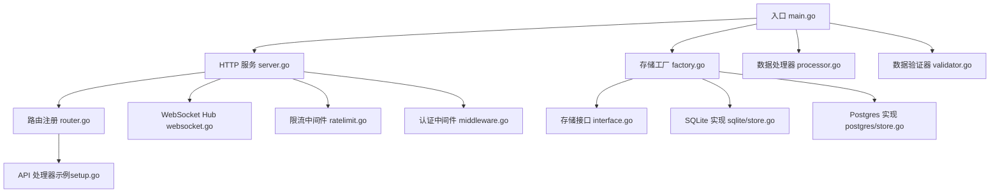
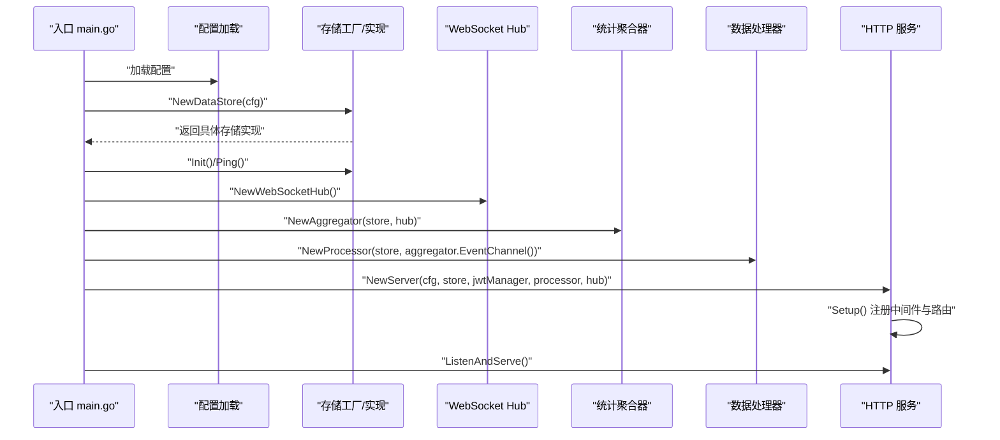
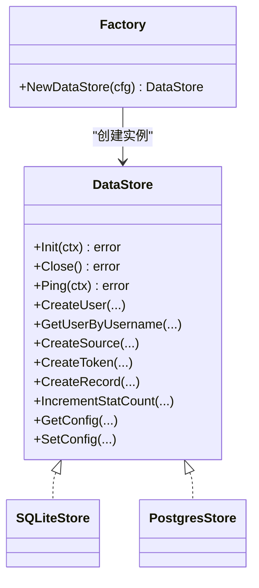
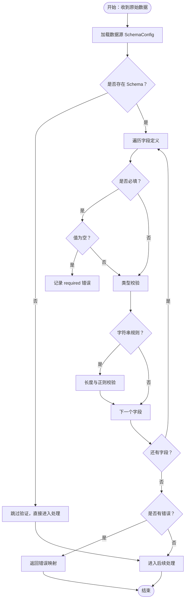
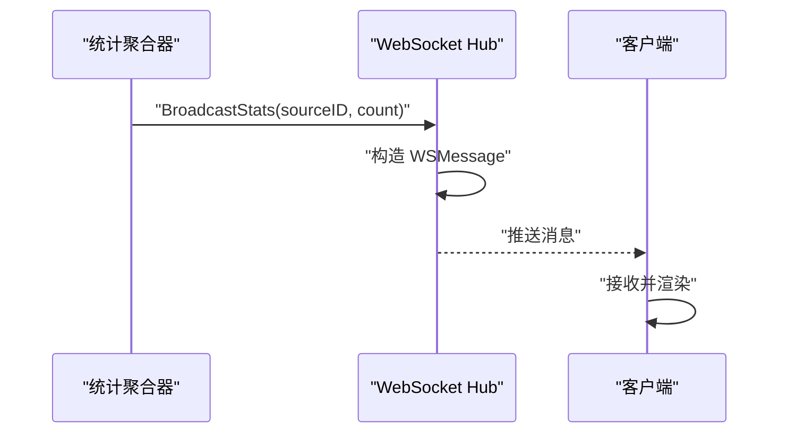
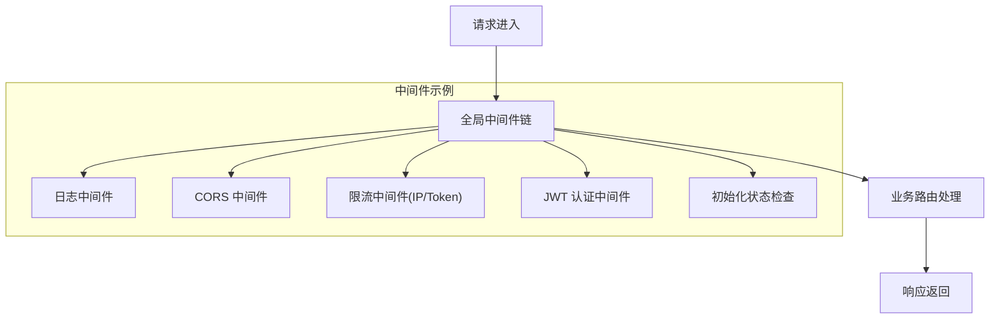
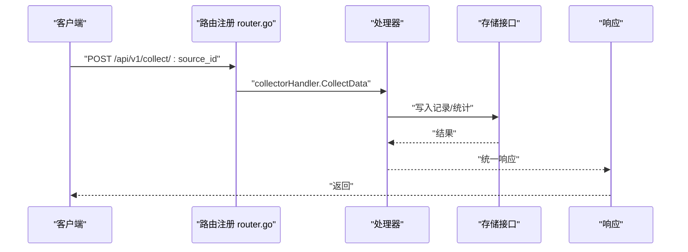
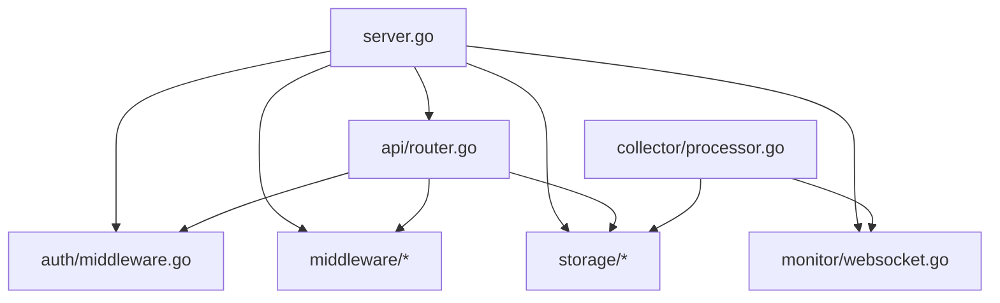

# 扩展开发

<cite>
**本文引用的文件**
- [cmd/server/main.go](file://cmd/server/main.go)
- [internal/server/server.go](file://internal/server/server.go)
- [internal/api/router.go](file://internal/api/router.go)
- [internal/api/setup.go](file://internal/api/setup.go)
- [internal/collector/validator.go](file://internal/collector/validator.go)
- [internal/collector/processor.go](file://internal/collector/processor.go)
- [internal/storage/interface.go](file://internal/storage/interface.go)
- [internal/storage/factory.go](file://internal/storage/factory.go)
- [internal/storage/sqlite/store.go](file://internal/storage/sqlite/store.go)
- [internal/storage/postgres/store.go](file://internal/storage/postgres/store.go)
- [internal/monitor/websocket.go](file://internal/monitor/websocket.go)
- [internal/middleware/ratelimit.go](file://internal/middleware/ratelimit.go)
- [internal/auth/middleware.go](file://internal/auth/middleware.go)
- [configs/config.yaml](file://configs/config.yaml)
</cite>

## 目录
1. [简介](#简介)
2. [项目结构](#项目结构)
3. [核心组件](#核心组件)
4. [架构总览](#架构总览)
5. [详细组件分析](#详细组件分析)
6. [依赖分析](#依赖分析)
7. [性能考虑](#性能考虑)
8. [故障排查指南](#故障排查指南)
9. [结论](#结论)
10. [附录](#附录)

## 简介
本指南面向希望为 DataCollector 开发扩展的工程师，围绕以下目标展开：
- 插件系统设计与实现原理
- 自定义存储后端的开发方法与接口规范
- 自定义数据验证器的实现与注册机制
- WebSocket 扩展与自定义事件开发
- 中间件系统的扩展方法与最佳实践
- API 扩展与路由添加的实现步骤
- 第三方集成的开发模板与示例
- 扩展模块的测试与发布流程
- 扩展开发的代码规范与质量标准

## 项目结构
DataCollector 采用分层清晰的 Go 项目结构：
- cmd/server：应用入口，负责初始化日志、配置、存储、WebSocket、统计聚合器、数据处理器与 HTTP 服务
- internal/server：封装 HTTP 服务，注册全局中间件与路由
- internal/api：API 路由注册与各业务处理器
- internal/collector：数据采集与处理（含验证器）
- internal/storage：存储抽象与工厂、SQLite/Postgres 实现
- internal/monitor：WebSocket Hub 与统计广播
- internal/middleware：通用中间件（日志、CORS、限流、大小限制等）
- internal/auth：JWT 认证与授权中间件
- configs：运行时配置文件
- web：前端资源（通过内嵌文件系统提供）

图表来源
- [cmd/server/main.go:25-87](file://cmd/server/main.go#L25-L87)
- [internal/server/server.go:54-87](file://internal/server/server.go#L54-L87)
- [internal/api/router.go:14-115](file://internal/api/router.go#L14-L115)
- [internal/storage/factory.go:11-21](file://internal/storage/factory.go#L11-L21)
- [internal/storage/interface.go:9-56](file://internal/storage/interface.go#L9-L56)
- [internal/storage/sqlite/store.go:17-85](file://internal/storage/sqlite/store.go#L17-L85)
- [internal/storage/postgres/store.go:14-60](file://internal/storage/postgres/store.go#L14-L60)
- [internal/monitor/websocket.go:14-152](file://internal/monitor/websocket.go#L14-L152)
- [internal/middleware/ratelimit.go:12-136](file://internal/middleware/ratelimit.go#L12-L136)
- [internal/auth/middleware.go:11-147](file://internal/auth/middleware.go#L11-L147)
- [internal/collector/processor.go:16-83](file://internal/collector/processor.go#L16-L83)
- [internal/collector/validator.go:19-84](file://internal/collector/validator.go#L19-L84)

章节来源
- [cmd/server/main.go:25-129](file://cmd/server/main.go#L25-L129)
- [internal/server/server.go:54-138](file://internal/server/server.go#L54-L138)

## 核心组件
- 存储抽象与工厂：通过统一接口屏蔽 SQLite/Postgres 差异，工厂按配置动态选择实现
- HTTP 服务与路由：基于 Gin，集中注册全局中间件与业务路由
- 数据处理器：负责落库与统计事件通知
- 数据验证器：基于 SchemaConfig 的字段级校验
- WebSocket Hub：集中管理客户端连接与广播
- 中间件体系：日志、CORS、请求体大小限制、限流、JWT 认证与角色控制
- 初始化流程：提供系统初始化、数据库连接测试与重新初始化能力

章节来源
- [internal/storage/interface.go:9-56](file://internal/storage/interface.go#L9-L56)
- [internal/storage/factory.go:11-21](file://internal/storage/factory.go#L11-L21)
- [internal/server/server.go:54-87](file://internal/server/server.go#L54-L87)
- [internal/api/router.go:14-115](file://internal/api/router.go#L14-L115)
- [internal/collector/processor.go:16-83](file://internal/collector/processor.go#L16-L83)
- [internal/collector/validator.go:19-84](file://internal/collector/validator.go#L19-L84)
- [internal/monitor/websocket.go:14-152](file://internal/monitor/websocket.go#L14-L152)
- [internal/middleware/ratelimit.go:12-136](file://internal/middleware/ratelimit.go#L12-L136)
- [internal/auth/middleware.go:11-147](file://internal/auth/middleware.go#L11-L147)
- [internal/api/setup.go:40-196](file://internal/api/setup.go#L40-L196)

## 架构总览
DataCollector 的启动流程与组件交互如下：

图表来源
- [cmd/server/main.go:46-87](file://cmd/server/main.go#L46-L87)
- [internal/server/server.go:54-87](file://internal/server/server.go#L54-L87)
- [internal/storage/factory.go:11-21](file://internal/storage/factory.go#L11-L21)

## 详细组件分析

### 存储抽象与自定义存储后端开发
- 设计要点
  - 通过统一接口定义数据访问能力，确保不同存储实现可互换
  - 工厂函数根据配置驱动选择具体实现
  - 迁移脚本通过内嵌文件系统提供，保证部署一致性
- 接口规范
  - 必须实现初始化、关闭、连通性检测
  - 用户、数据源、Token、记录、统计、系统配置等 CRUD 与查询能力
- 开发步骤
  1) 新建包并实现接口：参考现有 SQLite/Postgres 实现
  2) 在工厂中增加分支以支持新驱动
  3) 准备迁移脚本并通过内嵌文件系统提供
  4) 在配置文件中启用新驱动
  5) 编写单元测试与集成测试
  6) 文档化配置项与注意事项

图表来源
- [internal/storage/interface.go:9-56](file://internal/storage/interface.go#L9-L56)
- [internal/storage/factory.go:11-21](file://internal/storage/factory.go#L11-L21)
- [internal/storage/sqlite/store.go:17-85](file://internal/storage/sqlite/store.go#L17-L85)
- [internal/storage/postgres/store.go:14-60](file://internal/storage/postgres/store.go#L14-L60)

章节来源
- [internal/storage/interface.go:9-56](file://internal/storage/interface.go#L9-L56)
- [internal/storage/factory.go:11-21](file://internal/storage/factory.go#L11-L21)
- [internal/storage/sqlite/store.go:58-85](file://internal/storage/sqlite/store.go#L58-L85)
- [internal/storage/postgres/store.go:36-60](file://internal/storage/postgres/store.go#L36-L60)

### 数据验证器：自定义验证器实现与注册
- 设计要点
  - 基于数据源 SchemaConfig 的字段级校验
  - 支持必填、类型、长度、正则、格式等规则
  - 返回字段到错误信息的映射
- 实现步骤
  1) 在验证器中新增字段类型或规则
  2) 在采集处理器中调用验证器并处理错误
  3) 将错误映射为统一的响应格式
- 注册机制
  - 当前通过直接调用验证函数实现；如需插件化，可在采集处理器中注入可替换的验证器实例

图表来源
- [internal/collector/validator.go:19-84](file://internal/collector/validator.go#L19-L84)

章节来源
- [internal/collector/validator.go:19-84](file://internal/collector/validator.go#L19-L84)

### WebSocket 扩展与自定义事件
- 设计要点
  - Hub 统一管理客户端连接、注册/注销、广播通道
  - 客户端读写泵分离，心跳与超时处理完善
  - 事件类型与数据结构可扩展
- 扩展步骤
  1) 在 Hub 中定义新的事件类型与数据结构
  2) 在广播处构造消息并推送至广播通道
  3) 在前端订阅相应事件并渲染
- 最佳实践
  - 对广播通道进行背压保护（当前已有默认分支丢弃策略）
  - 控制消息体积，避免阻塞写泵
  - 为新事件类型定义明确的序列化/反序列化约定

图表来源
- [internal/monitor/websocket.go:108-132](file://internal/monitor/websocket.go#L108-L132)

章节来源
- [internal/monitor/websocket.go:14-221](file://internal/monitor/websocket.go#L14-L221)

### 中间件系统扩展与最佳实践
- 已有中间件
  - 日志、CORS、请求体大小限制、限流（IP/Token）、JWT 认证、角色控制、初始化状态检查
- 扩展方法
  - 新增 Gin 中间件函数，遵循 Gin.Context 传递与 Next 调用
  - 在服务初始化阶段注册到 Gin 引擎
  - 对于限流等状态共享场景，建议复用 RateLimiter 结构
- 最佳实践
  - 保持中间件职责单一，避免副作用
  - 对错误使用统一的响应格式
  - 为敏感操作添加必要的鉴权与审计

图表来源
- [internal/server/server.go:62-77](file://internal/server/server.go#L62-L77)
- [internal/middleware/ratelimit.go:100-136](file://internal/middleware/ratelimit.go#L100-L136)
- [internal/auth/middleware.go:19-63](file://internal/auth/middleware.go#L19-L63)

章节来源
- [internal/server/server.go:62-87](file://internal/server/server.go#L62-L87)
- [internal/middleware/ratelimit.go:12-136](file://internal/middleware/ratelimit.go#L12-L136)
- [internal/auth/middleware.go:11-147](file://internal/auth/middleware.go#L11-L147)

### API 扩展与路由添加
- 扩展步骤
  1) 在 api 包中新增处理器结构体与方法
  2) 在路由注册函数中创建处理器实例并挂载到路由组
  3) 如需认证或限流，按需添加中间件
  4) 在前端或调用方对接新接口
- 示例参考
  - 初始化相关路由：状态检查、数据库测试、系统初始化、重新初始化
  - 采集路由：按 IP 与 Token 限流，支持单条与批量采集
  - 管理后台路由：登录、仪表盘、数据源、Token、数据管理、导出

图表来源
- [internal/api/router.go:14-115](file://internal/api/router.go#L14-L115)
- [internal/api/setup.go:132-196](file://internal/api/setup.go#L132-L196)

章节来源
- [internal/api/router.go:14-115](file://internal/api/router.go#L14-L115)
- [internal/api/setup.go:19-253](file://internal/api/setup.go#L19-L253)

### 第三方集成开发模板与示例
- 模板思路
  - 定义适配器实现 DataStore 接口
  - 在工厂中注册新驱动
  - 提供迁移脚本与配置项
  - 编写测试覆盖核心 CRUD 与统计接口
- 示例参考
  - SQLite/Postgres 实现展示了连接池、迁移执行、WAL/PGX 配置差异
  - 配置文件提供了驱动切换与参数示例

章节来源
- [internal/storage/sqlite/store.go:24-56](file://internal/storage/sqlite/store.go#L24-L56)
- [internal/storage/postgres/store.go:19-34](file://internal/storage/postgres/store.go#L19-L34)
- [configs/config.yaml:11-21](file://configs/config.yaml#L11-L21)

### 扩展模块的测试与发布流程
- 测试建议
  - 单元测试：针对处理器、验证器、中间件与存储接口
  - 集成测试：端到端验证路由、认证、限流、WebSocket 事件
  - 性能测试：限流、批量导入、高并发场景
- 发布建议
  - 使用构建脚本与容器化打包
  - 提供配置样例与迁移说明
  - 文档化扩展点与破坏性变更

## 依赖分析
- 组件耦合
  - server 依赖 api、auth、collector、monitor、storage、middleware
  - api 依赖 auth、collector、middleware、storage
  - collector 依赖 storage 与 monitor 的事件通道
  - storage 通过工厂与接口解耦具体实现
- 外部依赖
  - Gin（Web 框架）、Gorilla WebSocket（实时通信）、lumberjack（日志轮转）、SQLite3/PGX（数据库驱动）

图表来源
- [internal/server/server.go:12-20](file://internal/server/server.go#L12-L20)
- [internal/api/router.go:3-10](file://internal/api/router.go#L3-L10)
- [internal/collector/processor.go:7-9](file://internal/collector/processor.go#L7-L9)

章节来源
- [internal/server/server.go:12-20](file://internal/server/server.go#L12-L20)
- [internal/api/router.go:3-10](file://internal/api/router.go#L3-L10)
- [internal/collector/processor.go:7-9](file://internal/collector/processor.go#L7-L9)

## 性能考虑
- 存储层
  - SQLite 使用 WAL 模式与忙等待超时，适合单机写入
  - PostgreSQL 设置连接池上限，适合多并发场景
- 限流
  - 滑动窗口算法，定期清理过期记录，避免内存膨胀
- WebSocket
  - 客户端发送缓冲区与心跳机制，防止连接泄漏
- 处理器
  - 批量处理时逐条落库并统计，避免阻塞主流程

章节来源
- [internal/storage/sqlite/store.go:43-53](file://internal/storage/sqlite/store.go#L43-L53)
- [internal/storage/postgres/store.go:29-32](file://internal/storage/postgres/store.go#L29-L32)
- [internal/middleware/ratelimit.go:34-66](file://internal/middleware/ratelimit.go#L34-L66)
- [internal/monitor/websocket.go:154-195](file://internal/monitor/websocket.go#L154-L195)
- [internal/collector/processor.go:54-83](file://internal/collector/processor.go#L54-L83)

## 故障排查指南
- 启动阶段
  - 配置加载失败：检查配置文件路径与权限
  - 数据库初始化失败：查看迁移脚本与连接参数
  - 日志轮转：确认输出模式与文件路径
- 运行阶段
  - 401/403：核对 JWT 令牌与角色
  - 429：检查 IP/Token 限流阈值
  - 413：调整 Body Size 限制
  - WebSocket 连接异常：关注升级失败与心跳处理
- 常见问题定位
  - 使用统一错误响应格式便于前端与运维定位
  - 启用调试模式与日志轮转提升可观测性

章节来源
- [cmd/server/main.go:155-200](file://cmd/server/main.go#L155-L200)
- [internal/server/server.go:94-138](file://internal/server/server.go#L94-L138)
- [internal/middleware/ratelimit.go:100-136](file://internal/middleware/ratelimit.go#L100-L136)
- [internal/auth/middleware.go:19-63](file://internal/auth/middleware.go#L19-L63)
- [internal/monitor/websocket.go:134-152](file://internal/monitor/websocket.go#L134-L152)

## 结论
DataCollector 的扩展开发围绕“接口抽象 + 工厂选择 + 中间件链 + 路由注册”展开。通过遵循统一接口、中间件规范与路由组织方式，开发者可以安全地扩展存储后端、验证规则、WebSocket 事件与 API 能力。建议在扩展过程中重视测试与文档，确保兼容性与可维护性。

## 附录
- 配置项参考
  - 服务器：主机、端口、运行模式
  - TLS：证书与私钥路径
  - 数据库：驱动、SQLite 路径、Postgres DSN 参数
  - JWT：密钥与过期时间
  - 采集：最大请求体、每分钟限流阈值、允许的 CORS 来源
  - 日志：级别、格式、输出位置与轮转参数

章节来源
- [configs/config.yaml:1-41](file://configs/config.yaml#L1-L41)