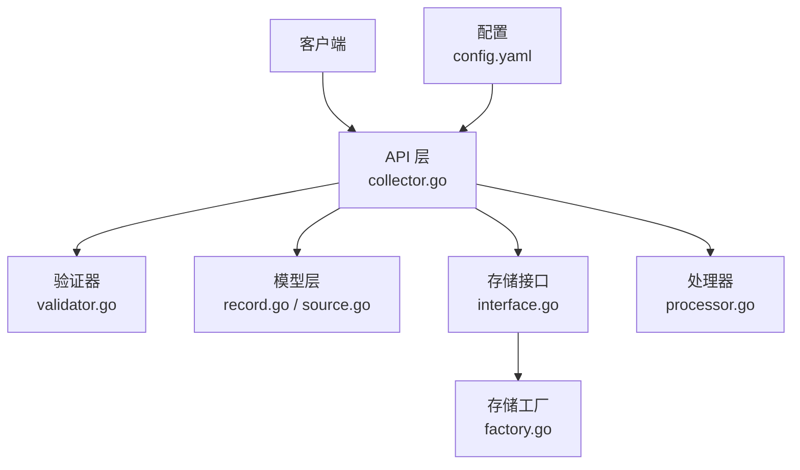
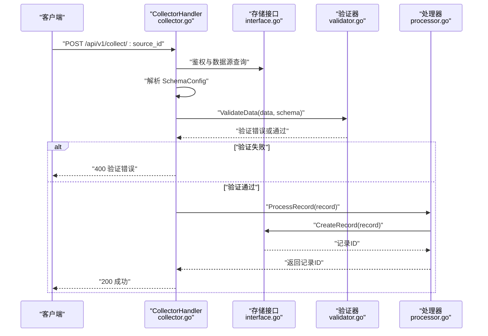
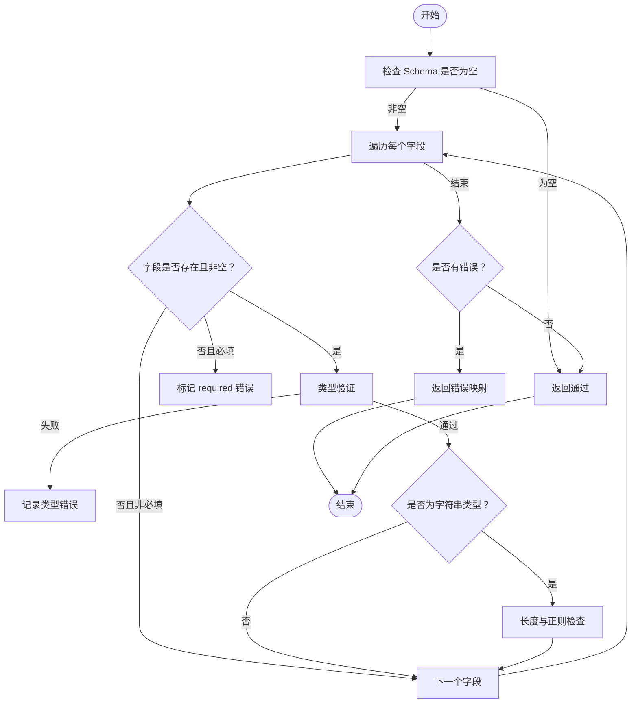
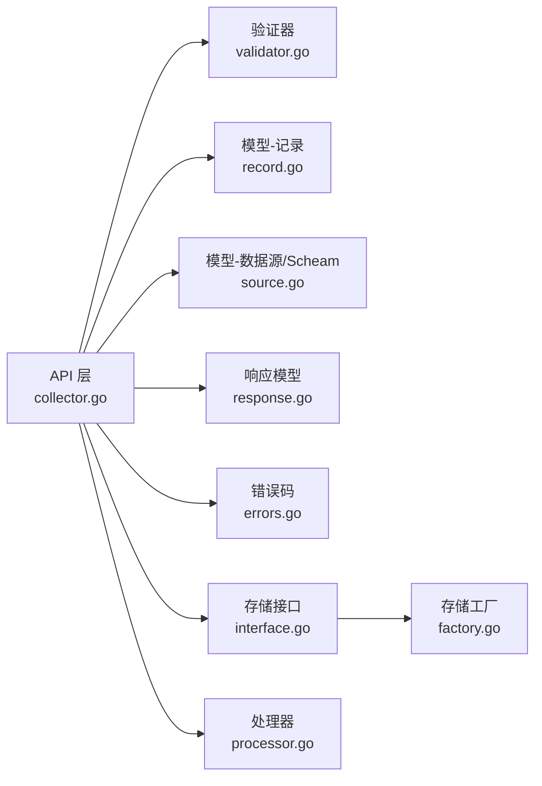
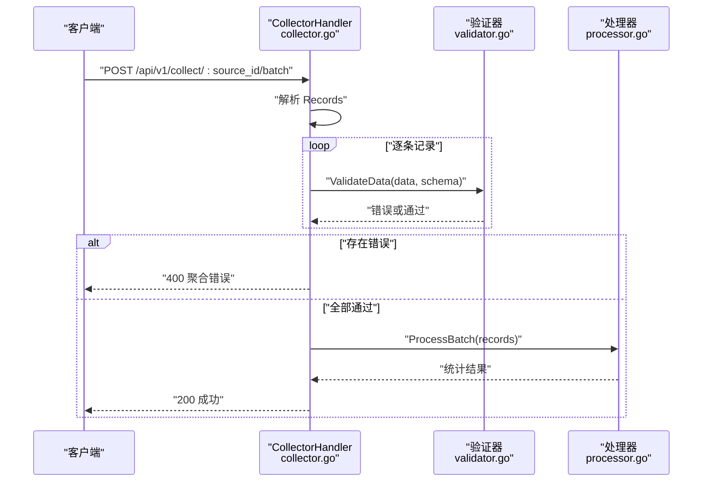

# 数据验证器扩展

<cite>
**本文引用的文件**
- [validator.go](file://internal/collector/validator.go)
- [collector.go](file://internal/api/collector.go)
- [record.go](file://internal/model/record.go)
- [source.go](file://internal/model/source.go)
- [response.go](file://internal/model/response.go)
- [errors.go](file://internal/model/errors.go)
- [interface.go](file://internal/storage/interface.go)
- [factory.go](file://internal/storage/factory.go)
- [config.yaml](file://configs/config.yaml)
- [processor.go](file://internal/collector/processor.go)
</cite>

## 目录
1. [简介](#简介)
2. [项目结构](#项目结构)
3. [核心组件](#核心组件)
4. [架构总览](#架构总览)
5. [详细组件分析](#详细组件分析)
6. [依赖分析](#依赖分析)
7. [性能考虑](#性能考虑)
8. [故障排查指南](#故障排查指南)
9. [结论](#结论)
10. [附录](#附录)

## 简介
本指南面向需要扩展 DataCollector 数据验证能力的开发者，围绕验证器接口设计、内置验证器实现、自定义规则与验证器链、Schema 验证、数据类型与范围验证、注册与配置机制、复杂场景（嵌套对象、条件验证）、性能优化与缓存策略，以及单元与集成测试方法进行系统性阐述。目标是帮助你在不破坏现有架构的前提下，安全地扩展验证能力。

## 项目结构
DataCollector 的验证流程主要由以下层次组成：
- API 层：接收请求、鉴权、解析 Schema、调用验证器、构建记录并交由处理器持久化
- 验证层：根据 SchemaConfig 对提交数据进行字段级校验
- 模型层：定义数据记录、数据源与 Schema 结构
- 存储层：抽象数据访问接口，支持 SQLite/PostgreSQL
- 配置层：系统运行参数与收集器配置

**图表来源**
- [collector.go:1-278](file://internal/api/collector.go#L1-L278)
- [validator.go:1-222](file://internal/collector/validator.go#L1-L222)
- [record.go:1-33](file://internal/model/record.go#L1-L33)
- [source.go:1-35](file://internal/model/source.go#L1-L35)
- [interface.go:1-57](file://internal/storage/interface.go#L1-L57)
- [factory.go:1-22](file://internal/storage/factory.go#L1-L22)
- [config.yaml:1-41](file://configs/config.yaml#L1-L41)
- [processor.go:1-84](file://internal/collector/processor.go#L1-L84)

**章节来源**
- [collector.go:1-278](file://internal/api/collector.go#L1-L278)
- [validator.go:1-222](file://internal/collector/validator.go#L1-L222)
- [record.go:1-33](file://internal/model/record.go#L1-L33)
- [source.go:1-35](file://internal/model/source.go#L1-L35)
- [interface.go:1-57](file://internal/storage/interface.go#L1-L57)
- [factory.go:1-22](file://internal/storage/factory.go#L1-L22)
- [config.yaml:1-41](file://configs/config.yaml#L1-L41)
- [processor.go:1-84](file://internal/collector/processor.go#L1-L84)

## 核心组件
- 验证器入口函数：ValidateData(data map[string]interface{}, schema *SchemaConfig) map[string]string
- 类型验证器：validateType(value interface{}, fieldType string) string
- 辅助工具：isEmptyValue(value interface{}) bool
- API 集成：在采集接口中解析 Schema 并调用验证器
- 错误响应：统一返回验证错误结构

关键职责与边界：
- 验证器仅负责字段级校验，不涉及业务规则与外部服务调用
- API 层负责鉴权、Schema 解析、错误聚合与响应
- 处理器负责记录落库与统计事件发送

**章节来源**
- [validator.go:19-84](file://internal/collector/validator.go#L19-L84)
- [validator.go:102-221](file://internal/collector/validator.go#L102-L221)
- [validator.go:86-100](file://internal/collector/validator.go#L86-L100)
- [collector.go:97-112](file://internal/api/collector.go#L97-L112)
- [response.go:68-71](file://internal/model/response.go#L68-L71)

## 架构总览
下图展示从请求到持久化的完整链路，重点标注验证器参与的关键节点。

**图表来源**
- [collector.go:29-138](file://internal/api/collector.go#L29-L138)
- [validator.go:19-84](file://internal/collector/validator.go#L19-L84)
- [processor.go:30-52](file://internal/collector/processor.go#L30-L52)
- [interface.go:37-43](file://internal/storage/interface.go#L37-L43)

**章节来源**
- [collector.go:29-138](file://internal/api/collector.go#L29-L138)
- [validator.go:19-84](file://internal/collector/validator.go#L19-L84)
- [processor.go:30-52](file://internal/collector/processor.go#L30-L52)
- [interface.go:37-43](file://internal/storage/interface.go#L37-L43)

## 详细组件分析

### 验证器接口设计与实现规范
- 入口函数
  - 输入：提交的原始数据 map、数据源 SchemaConfig
  - 输出：字段级错误映射；若通过则返回空
- 设计原则
  - 字段存在性优先于类型检查：未提供的非必填字段直接跳过
  - 必填字段缺失即报错
  - 类型验证后执行该类型的专属约束（如字符串长度、正则）
  - 支持空值判断（nil、空字符串、空数组、空对象）

**图表来源**
- [validator.go:19-84](file://internal/collector/validator.go#L19-L84)
- [validator.go:86-100](file://internal/collector/validator.go#L86-L100)
- [validator.go:102-221](file://internal/collector/validator.go#L102-L221)

**章节来源**
- [validator.go:19-84](file://internal/collector/validator.go#L19-L84)
- [validator.go:86-100](file://internal/collector/validator.go#L86-L100)
- [validator.go:102-221](file://internal/collector/validator.go#L102-L221)

### 内置验证器实现分析
- 类型验证
  - string、boolean、array、object：严格类型匹配
  - number/integer/float：支持多种数值类型与字符串解析
  - email/url/date/datetime：专用格式校验
- 字符串特有验证
  - 最大/最小长度
  - 正则模式匹配
- 空值判定
  - 统一处理 nil、空字符串、空数组、空对象

扩展建议：
- 新增类型：在 validateType 中新增分支，并确保错误消息明确
- 新增字符串规则：在字符串分支内追加规则检查
- 新增复合规则：可引入“条件验证”或“范围验证”的组合器

**章节来源**
- [validator.go:102-221](file://internal/collector/validator.go#L102-L221)

### 开发自定义数据验证规则与验证器链
- 自定义规则
  - 在字符串分支内增加新规则（例如长度区间、枚举值、唯一性等）
  - 对于跨字段规则（如互斥、依赖），可在 API 层或独立规则模块中实现
- 验证器链
  - 当前实现为线性顺序：必填 → 类型 → 字符串专属 → …
  - 可通过拆分函数与组合器形成“链式验证”，便于复用与扩展

注意：
- 链式验证应保持短路语义：一旦失败立即返回
- 规则间冲突需显式处理（如先做类型再做长度）

**章节来源**
- [validator.go:19-84](file://internal/collector/validator.go#L19-L84)
- [validator.go:55-77](file://internal/collector/validator.go#L55-L77)

### Schema 验证、数据类型验证、范围验证
- Schema 验证
  - 通过 DataSource.SchemaConfig 提供字段定义
  - API 层在调用验证器前解析 SchemaConfig
- 数据类型验证
  - 使用 validateType 实现多类型支持与解析容错
- 范围验证
  - 整数/浮点数范围：可在类型解析后追加范围检查
  - 时间范围：在 date/datetime 解析后进行区间校验

**章节来源**
- [source.go:21-34](file://internal/model/source.go#L21-L34)
- [collector.go:97-104](file://internal/api/collector.go#L97-L104)
- [validator.go:102-221](file://internal/collector/validator.go#L102-L221)

### 注册与配置机制
- 配置项
  - 收集器相关：最大请求体大小、速率限制、允许的来源等
- 配置加载
  - 通过 YAML 文件读取系统配置
- 验证器配置
  - SchemaConfig 作为运行时配置，由数据源管理端维护
  - API 层在每次请求时动态解析并应用

**章节来源**
- [config.yaml:27-32](file://configs/config.yaml#L27-L32)
- [collector.go:97-104](file://internal/api/collector.go#L97-L104)
- [source.go:13-13](file://internal/model/source.go#L13-L13)

### 复杂验证场景示例
- 嵌套对象验证
  - 当前实现支持 object 类型，可扩展为递归验证子对象字段
  - 建议在 validateType 分支中对对象类型进行深度遍历
- 条件验证
  - 例如当某字段为真时，要求另一字段必填
  - 可在 API 层或独立规则模块中实现，避免侵入基础类型验证

**章节来源**
- [validator.go:214-217](file://internal/collector/validator.go#L214-L217)
- [validator.go:19-84](file://internal/collector/validator.go#L19-L84)

### 性能优化与缓存策略
- 正则表达式预编译
  - email 正则在包级预编译，减少重复开销
- 类型解析优化
  - 对常见数值类型采用类型分支快速判断
- 缓存建议
  - SchemaConfig 可按 source_id 缓存，结合 TTL 与失效策略
  - 验证器规则可缓存热点规则的匹配结果（需注意规则动态性）
- 批量处理
  - API 层对批量请求逐条验证并聚合错误，避免整体失败回滚

**章节来源**
- [validator.go:14-17](file://internal/collector/validator.go#L14-L17)
- [validator.go:102-221](file://internal/collector/validator.go#L102-L221)
- [collector.go:220-247](file://internal/api/collector.go#L220-L247)

### 单元测试与集成测试方法
- 单元测试
  - 验证器：构造不同字段类型与非法值，断言错误映射
  - 类型验证：覆盖 string/number/integer/float/email/url/date/datetime/array/object
  - 边界值：最大/最小长度、空值、nil、空数组/对象
- 集成测试
  - API 测试：使用真实 SchemaConfig，验证 400/200 场景
  - 批量测试：验证错误聚合与部分失败处理
  - 性能测试：对高频 Schema 进行基准测试，评估缓存命中率

**章节来源**
- [validator.go:19-84](file://internal/collector/validator.go#L19-L84)
- [collector.go:97-112](file://internal/api/collector.go#L97-L112)
- [collector.go:220-267](file://internal/api/collector.go#L220-L267)

## 依赖分析
验证器与周边组件的耦合关系如下：

**图表来源**
- [collector.go:1-278](file://internal/api/collector.go#L1-L278)
- [validator.go:1-222](file://internal/collector/validator.go#L1-L222)
- [record.go:1-33](file://internal/model/record.go#L1-L33)
- [source.go:1-35](file://internal/model/source.go#L1-L35)
- [response.go:1-71](file://internal/model/response.go#L1-L71)
- [errors.go:1-84](file://internal/model/errors.go#L1-L84)
- [interface.go:1-57](file://internal/storage/interface.go#L1-L57)
- [factory.go:1-22](file://internal/storage/factory.go#L1-L22)
- [processor.go:1-84](file://internal/collector/processor.go#L1-L84)

**章节来源**
- [collector.go:1-278](file://internal/api/collector.go#L1-L278)
- [validator.go:1-222](file://internal/collector/validator.go#L1-L222)
- [record.go:1-33](file://internal/model/record.go#L1-L33)
- [source.go:1-35](file://internal/model/source.go#L1-L35)
- [response.go:1-71](file://internal/model/response.go#L1-L71)
- [errors.go:1-84](file://internal/model/errors.go#L1-L84)
- [interface.go:1-57](file://internal/storage/interface.go#L1-L57)
- [factory.go:1-22](file://internal/storage/factory.go#L1-L22)
- [processor.go:1-84](file://internal/collector/processor.go#L1-L84)

## 性能考虑
- 验证器复杂度
  - 时间复杂度：O(F)，F 为 Schema 字段数
  - 空间复杂度：O(E)，E 为错误数量
- 优化方向
  - 预编译正则与类型分支
  - 缓存 SchemaConfig 与热点规则
  - 批量请求中的错误聚合与短路
- 监控与告警
  - 记录验证耗时与错误率，设置阈值告警

[本节为通用指导，无需列出具体文件来源]

## 故障排查指南
- 常见问题
  - 验证失败：检查字段类型与 SchemaConfig 是否一致
  - 空值误判：确认 isEmptyValue 的判定逻辑
  - 正则错误：检查 Pattern 是否有效
- 排查步骤
  - 打印原始数据与 SchemaConfig
  - 分步验证：先类型，再字符串规则
  - 查看统一响应中的错误字段

**章节来源**
- [validator.go:86-100](file://internal/collector/validator.go#L86-L100)
- [response.go:68-71](file://internal/model/response.go#L68-L71)
- [errors.go:40-83](file://internal/model/errors.go#L40-L83)

## 结论
DataCollector 的验证器以简洁清晰的字段级校验为核心，配合灵活的 SchemaConfig 实现了可扩展的数据验证体系。通过在类型验证与字符串规则上增加自定义规则，或在 API 层引入条件验证，可以满足大多数复杂场景。结合缓存与批量处理优化，可在保证正确性的同时提升性能与稳定性。

[本节为总结性内容，无需列出具体文件来源]

## 附录

### API 验证流程时序（批量）

**图表来源**
- [collector.go:140-267](file://internal/api/collector.go#L140-L267)
- [validator.go:19-84](file://internal/collector/validator.go#L19-L84)
- [processor.go:54-82](file://internal/collector/processor.go#L54-L82)