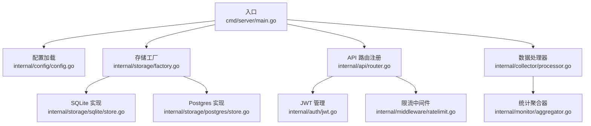
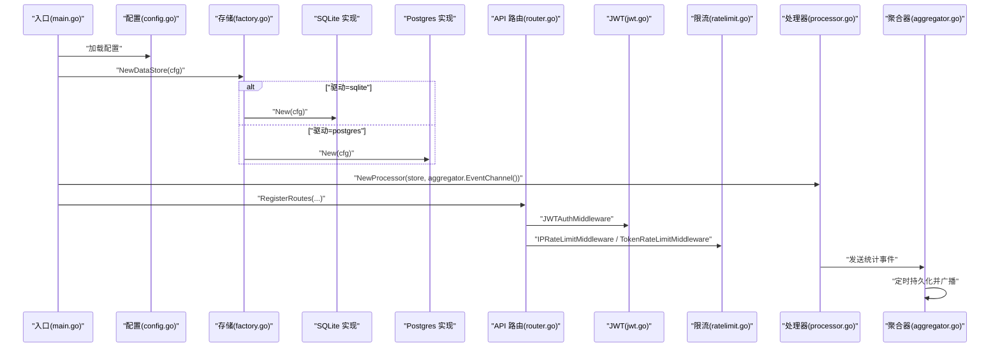
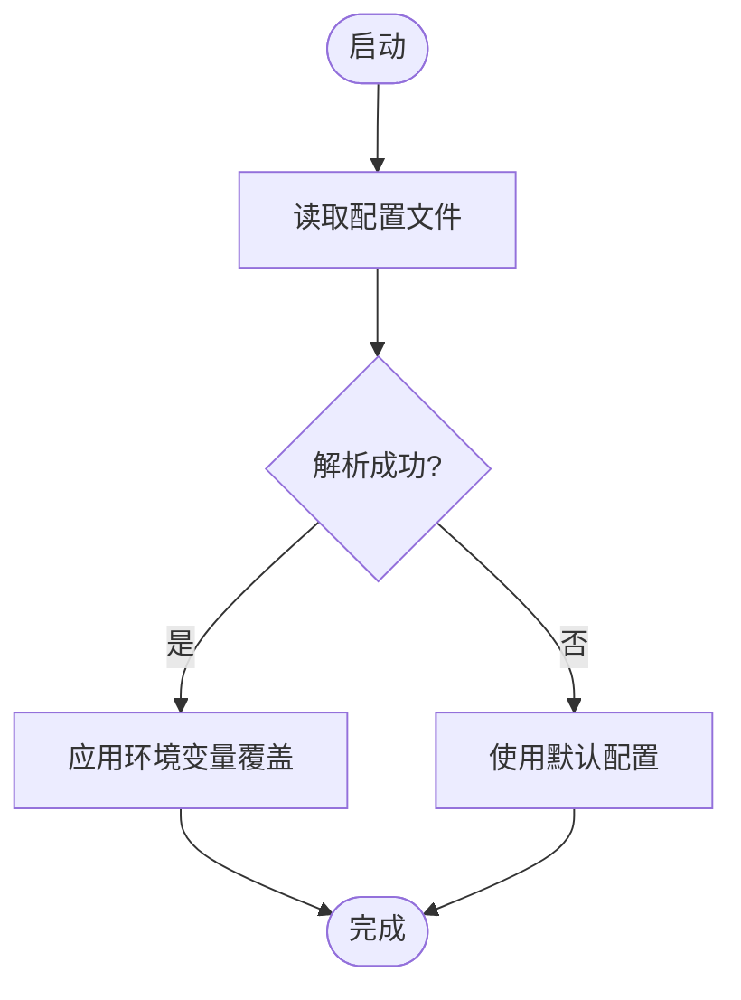
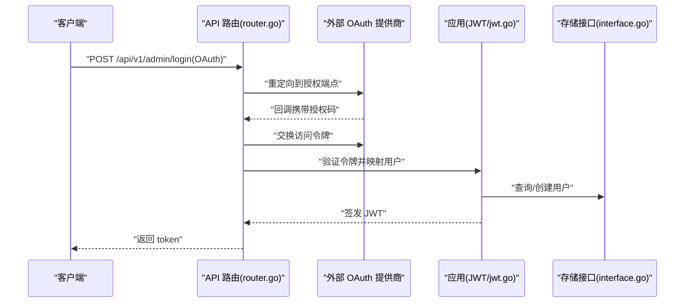
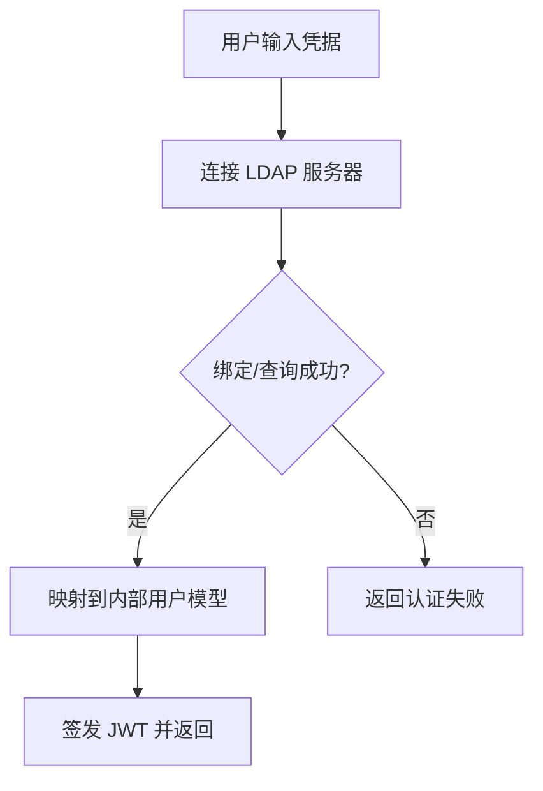
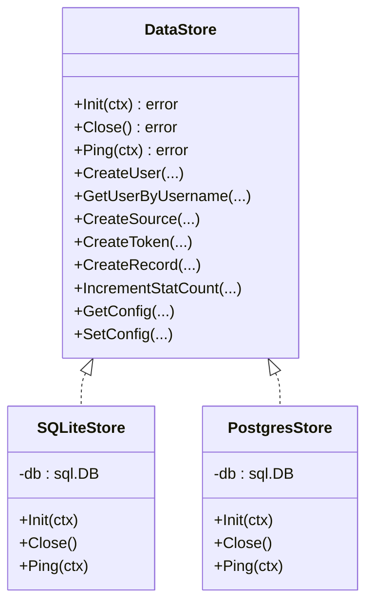
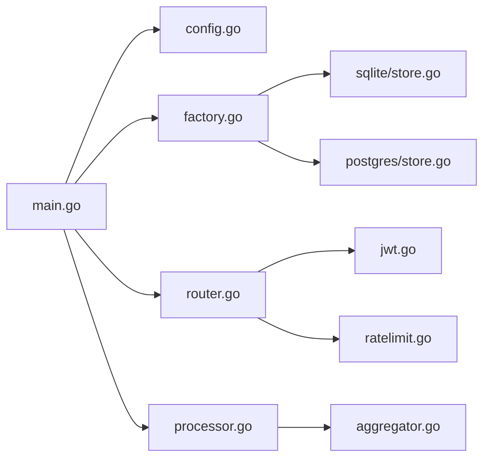

# 第三方集成

<cite>
**本文引用的文件**
- [main.go](file://cmd/server/main.go)
- [config.yaml](file://configs/config.yaml)
- [config.go](file://internal/config/config.go)
- [router.go](file://internal/api/router.go)
- [jwt.go](file://internal/auth/jwt.go)
- [factory.go](file://internal/storage/factory.go)
- [interface.go](file://internal/storage/interface.go)
- [store.go (SQLite)](file://internal/storage/sqlite/store.go)
- [store.go (Postgres)](file://internal/storage/postgres/store.go)
- [aggregator.go](file://internal/monitor/aggregator.go)
- [processor.go](file://internal/collector/processor.go)
- [ratelimit.go](file://internal/middleware/ratelimit.go)
- [docker-compose.yml](file://docker-compose.yml)
- [Dockerfile](file://Dockerfile)
</cite>

## 目录
1. [简介](#简介)
2. [项目结构](#项目结构)
3. [核心组件](#核心组件)
4. [架构总览](#架构总览)
5. [详细组件分析](#详细组件分析)
6. [依赖分析](#依赖分析)
7. [性能考虑](#性能考虑)
8. [故障排查指南](#故障排查指南)
9. [结论](#结论)
10. [附录](#附录)

## 简介
本指南面向在 DataCollector 中进行第三方系统集成的工程师与运维人员，围绕系统配置管理、外部服务集成、认证与授权、数据库连接池、消息与缓存、监控与日志、邮件与短信、API 网关与微服务、以及容器编排与云服务最佳实践，提供可落地的实施建议与参考路径。文中所有技术细节均基于仓库现有代码与配置文件进行分析与总结。

## 项目结构
DataCollector 采用分层与按功能域划分的组织方式：
- 入口与生命周期：cmd/server/main.go 负责启动、配置加载、存储初始化、服务启动与优雅关闭。
- 配置管理：configs/config.yaml 提供 YAML 配置；internal/config/config.go 定义结构体与环境变量覆盖逻辑。
- API 层：internal/api/router.go 注册路由与中间件，协调鉴权、限流与业务处理器。
- 认证与授权：internal/auth/jwt.go 提供 JWT 签发、校验与刷新能力。
- 存储抽象与实现：internal/storage/interface.go 定义统一接口；factory.go 根据配置选择具体实现；SQLite 与 Postgres 分别在 sqlite 与 postgres 子包中实现。
- 数据处理与监控：internal/collector/processor.go 处理数据写入并触发统计事件；internal/monitor/aggregator.go 聚合统计并广播更新。
- 中间件：internal/middleware/ratelimit.go 提供基于滑动窗口的 IP 与 Token 限流。
- 运维与打包：Dockerfile 与 docker-compose.yml 支持容器化部署与多数据库模式切换。

**图示来源**
- [main.go:25-129](file://cmd/server/main.go#L25-L129)
- [config.go:82-195](file://internal/config/config.go#L82-L195)
- [factory.go:11-21](file://internal/storage/factory.go#L11-L21)
- [store.go (SQLite):24-56](file://internal/storage/sqlite/store.go#L24-L56)
- [store.go (Postgres):20-34](file://internal/storage/postgres/store.go#L20-L34)
- [router.go:14-115](file://internal/api/router.go#L14-L115)
- [jwt.go:25-101](file://internal/auth/jwt.go#L25-L101)
- [ratelimit.go:22-136](file://internal/middleware/ratelimit.go#L22-L136)
- [processor.go:22-52](file://internal/collector/processor.go#L22-L52)
- [aggregator.go:30-87](file://internal/monitor/aggregator.go#L30-L87)

**章节来源**
- [main.go:25-129](file://cmd/server/main.go#L25-L129)
- [config.go:82-195](file://internal/config/config.go#L82-L195)
- [router.go:14-115](file://internal/api/router.go#L14-L115)

## 核心组件
- 配置系统：支持 YAML 文件与环境变量覆盖，涵盖服务器、TLS、数据库、JWT、采集器与日志等关键参数。
- 存储层：通过工厂模式按驱动选择 SQLite 或 Postgres 实现，分别设置连接池参数与 WAL 模式。
- 认证与授权：基于 HMAC 的 JWT 签发与校验，支持刷新策略；API 路由通过中间件保护。
- 限流：基于滑动窗口的 IP 与 Token 限流，防止滥用。
- 数据处理与监控：处理器负责写入与事件发送；聚合器周期性持久化统计并广播更新。
- 运维：Dockerfile 与 docker-compose.yml 提供前后端一体化构建与部署模板。

**章节来源**
- [config.yaml:1-41](file://configs/config.yaml#L1-L41)
- [config.go:12-215](file://internal/config/config.go#L12-L215)
- [factory.go:11-21](file://internal/storage/factory.go#L11-L21)
- [store.go (SQLite):39-53](file://internal/storage/sqlite/store.go#L39-L53)
- [store.go (Postgres):29-32](file://internal/storage/postgres/store.go#L29-L32)
- [jwt.go:25-101](file://internal/auth/jwt.go#L25-L101)
- [router.go:14-115](file://internal/api/router.go#L14-L115)
- [ratelimit.go:68-136](file://internal/middleware/ratelimit.go#L68-L136)
- [processor.go:30-52](file://internal/collector/processor.go#L30-L52)
- [aggregator.go:47-133](file://internal/monitor/aggregator.go#L47-L133)
- [docker-compose.yml:1-56](file://docker-compose.yml#L1-L56)
- [Dockerfile:1-52](file://Dockerfile#L1-L52)

## 架构总览
DataCollector 的核心控制流如下：
- 启动阶段：加载配置 → 确保目录 → 初始化存储（迁移）→ 初始化 JWT 管理器 → 启动 WebSocket Hub 与统计聚合器 → 初始化数据处理器 → 创建并启动 HTTP 服务器 → 监听系统信号 → 优雅关闭。
- 运行阶段：API 路由注册与中间件装配 → 收集数据时进行限流与校验 → 写入存储并触发统计事件 → 聚合器定时持久化并广播更新。

**图示来源**
- [main.go:45-87](file://cmd/server/main.go#L45-L87)
- [config.go:82-195](file://internal/config/config.go#L82-L195)
- [factory.go:11-21](file://internal/storage/factory.go#L11-L21)
- [store.go (SQLite):24-56](file://internal/storage/sqlite/store.go#L24-L56)
- [store.go (Postgres):20-34](file://internal/storage/postgres/store.go#L20-L34)
- [router.go:14-115](file://internal/api/router.go#L14-L115)
- [jwt.go:61-82](file://internal/auth/jwt.go#L61-L82)
- [ratelimit.go:100-136](file://internal/middleware/ratelimit.go#L100-L136)
- [processor.go:34-52](file://internal/collector/processor.go#L34-L52)
- [aggregator.go:47-133](file://internal/monitor/aggregator.go#L47-L133)

## 详细组件分析

### 配置管理与环境变量覆盖
- 配置来源：优先从 configs/config.yaml 加载；若失败则回退默认配置。
- 环境变量覆盖：支持数据库驱动、SQLite 路径、PostgreSQL 主机/端口/用户/密码/库名、服务器端口、JWT 密钥、日志级别等。
- DSN 生成：根据驱动生成数据库连接串，便于外部服务连接。

**图示来源**
- [main.go:155-169](file://cmd/server/main.go#L155-L169)
- [config.go:82-195](file://internal/config/config.go#L82-L195)

**章节来源**
- [config.yaml:1-41](file://configs/config.yaml#L1-L41)
- [config.go:82-195](file://internal/config/config.go#L82-L195)
- [main.go:155-169](file://cmd/server/main.go#L155-L169)

### OAuth 认证服务集成（通用接入指引）
- 适用场景：将外部 OAuth 提供商（如 Google、GitHub、企业 AD）接入为统一登录入口。
- 接入步骤（概念性）：
  1) 在外部 OAuth 提供商注册应用，获取客户端 ID/密钥与回调地址。
  2) 在应用侧新增 OAuth 登录路由，重定向至提供商授权端点，接收授权码后换取访问令牌。
  3) 校验令牌并映射到内部用户模型，签发 JWT 返回给客户端。
  4) 对需要管理员权限的后台接口，使用现有 JWT 中间件进行鉴权。
- 与现有组件的衔接：
  - 登录路由：参考管理后台登录接口路径与鉴权中间件装配。
  - JWT 管理：复用现有 JWT 管理器进行签发与校验。
  - 用户模型：复用内部用户表结构与存储接口。

**图示来源**
- [router.go:58-105](file://internal/api/router.go#L58-L105)
- [jwt.go:33-58](file://internal/auth/jwt.go#L33-L58)
- [interface.go:16-21](file://internal/storage/interface.go#L16-L21)

### LDAP 目录服务集成（通用接入指引）
- 适用场景：将企业 LDAP（如 Active Directory、OpenLDAP）作为用户目录与身份源。
- 接入步骤（概念性）：
  1) 在应用侧新增 LDAP 登录流程，收集用户名与密码。
  2) 使用 LDAP SDK 连接目录服务器，绑定并查询用户 DN 与属性。
  3) 校验成功后映射到内部用户模型，签发 JWT。
  4) 对后台管理接口，使用现有 JWT 中间件进行鉴权。
- 与现有组件的衔接：
  - 登录路由：参考管理后台登录接口路径。
  - JWT 管理：复用现有 JWT 管理器。
  - 用户模型：复用内部用户表结构与存储接口。

**图示来源**
- [router.go:58-105](file://internal/api/router.go#L58-L105)
- [jwt.go:33-58](file://internal/auth/jwt.go#L33-L58)
- [interface.go:16-21](file://internal/storage/interface.go#L16-L21)

### 数据库连接池与外部存储系统集成
- 驱动选择：通过配置项选择 sqlite 或 postgres。
- SQLite：
  - 连接池：最大并发与空闲连接数限制为 1，启用 WAL 模式与 busy timeout。
  - 适合开发与轻量生产场景。
- Postgres：
  - 连接池：最大并发 25，空闲 5。
  - 适合高并发与生产环境。
- 外部存储系统（概念性扩展）：
  - 若需对接对象存储（如 S3），可在存储接口层新增实现，或通过外部服务代理写入。
  - 注意：当前代码未内置对象存储实现，需按接口契约扩展。

**图示来源**
- [interface.go:9-56](file://internal/storage/interface.go#L9-L56)
- [store.go (SQLite):17-56](file://internal/storage/sqlite/store.go#L17-L56)
- [store.go (Postgres):14-34](file://internal/storage/postgres/store.go#L14-L34)

**章节来源**
- [config.go:197-215](file://internal/config/config.go#L197-L215)
- [factory.go:11-21](file://internal/storage/factory.go#L11-L21)
- [store.go (SQLite):39-53](file://internal/storage/sqlite/store.go#L39-L53)
- [store.go (Postgres):29-32](file://internal/storage/postgres/store.go#L29-L32)

### 消息队列与缓存系统集成（概念性）
- 消息队列：
  - 在数据采集链路中，可将收集到的原始数据先写入消息队列（如 Kafka/RabbitMQ/Redis Streams），再由消费者异步落库与统计。
  - 当前处理器直接写库并发送统计事件，若需解耦与削峰，建议引入消息队列。
- 缓存：
  - 可在 API 层对热点查询结果进行缓存（如 Redis），降低数据库压力。
  - 对于会话与令牌校验，可结合 JWT 与短期缓存策略。

[本节为概念性说明，不直接分析具体文件]

### 监控系统集成（Prometheus、Grafana）
- 指标上报（概念性）：
  - 在聚合器与处理器中埋点关键指标（如处理速率、错误计数、延迟）。
  - 使用 Prometheus Go 客户端暴露指标，Grafana 作为可视化面板。
- 现有基础：
  - 聚合器具备统计事件通道与定时持久化能力，适合作为指标来源之一。
- 集成步骤（概念性）：
  1) 在聚合器与处理器中注册自定义指标。
  2) 暴露 /metrics 端点。
  3) 在 Grafana 中添加 Prometheus 数据源并创建仪表板。

[本节为概念性说明，不直接分析具体文件]

### 日志系统集成（ELK Stack、Splunk）
- 现有日志：
  - 使用标准库 slog 输出 JSON 格式日志，默认输出到 stdout；支持文件输出与轮转。
- ELK/Splunk 集成（概念性）：
  1) 将 stdout 日志采集到 Filebeat/Fluent Bit，转发至 Logstash/索引器。
  2) 在 Splunk 中建立索引与搜索字段映射。
  3) 结合容器编排，确保日志路径挂载与轮转策略一致。

**章节来源**
- [main.go:131-153](file://cmd/server/main.go#L131-L153)
- [config.yaml:34-41](file://configs/config.yaml#L34-L41)

### 邮件服务与短信服务集成（模板）
- 邮件服务（概念性）：
  - 在用户注册/重置密码等场景，通过 SMTP 客户端发送邮件。
  - 建议使用连接池与重试机制，保障可靠性。
- 短信服务（概念性）：
  - 通过短信网关 API（如阿里云、腾讯云、Twilio）发送验证码或通知。
  - 建议实现幂等与去重策略，避免重复发送。

[本节为概念性说明，不直接分析具体文件]

### API 网关与微服务架构集成
- API 网关（概念性）：
  - 在多租户或多实例场景下，可通过 API 网关统一鉴权、限流、路由与可观测性。
  - DataCollector 可作为后端微服务之一，暴露 /api/v1 下的 REST 接口。
- 微服务拆分（概念性）：
  - 可将“数据采集”“统计聚合”“用户管理”等模块拆分为独立服务，通过消息队列或 RPC 交互。

**章节来源**
- [router.go:14-115](file://internal/api/router.go#L14-L115)

### 容器编排与云服务集成最佳实践
- 容器化：
  - Dockerfile 支持前后端一体化构建与嵌入静态资源；Dockerfile 显式设置时区与证书。
  - docker-compose.yml 提供 SQLite 与可选 Postgres 模式，支持卷挂载与健康检查。
- 云服务（概念性）：
  - 使用托管数据库（RDS/Azure DB）替代本地容器内 Postgres。
  - 使用对象存储与 CDN 承载静态资源。
  - 在 Kubernetes 中通过 ConfigMap/Secret 管理配置与密钥，使用 HPA/PDB 优化弹性与可用性。

**章节来源**
- [Dockerfile:1-52](file://Dockerfile#L1-L52)
- [docker-compose.yml:1-56](file://docker-compose.yml#L1-L56)

## 依赖分析
- 组件耦合：
  - 入口仅依赖配置、存储工厂与服务组件，保持清晰的控制反转。
  - API 路由依赖存储接口、JWT 管理器与限流中间件，体现关注点分离。
- 外部依赖：
  - Gin 用于路由与中间件；JWT 用于认证；SQLite3 与 pgx 用于数据库访问；lumberjack 用于日志轮转。
- 潜在风险：
  - SQLite 连接池上限为 1，不适合高并发写入场景。
  - 限流实现为内存滑动窗口，跨实例需共享状态（如 Redis）。

**图示来源**
- [main.go:25-129](file://cmd/server/main.go#L25-L129)
- [config.go:82-195](file://internal/config/config.go#L82-L195)
- [factory.go:11-21](file://internal/storage/factory.go#L11-L21)
- [store.go (SQLite):24-56](file://internal/storage/sqlite/store.go#L24-L56)
- [store.go (Postgres):20-34](file://internal/storage/postgres/store.go#L20-L34)
- [router.go:14-115](file://internal/api/router.go#L14-L115)
- [jwt.go:25-101](file://internal/auth/jwt.go#L25-L101)
- [ratelimit.go:22-136](file://internal/middleware/ratelimit.go#L22-L136)
- [processor.go:22-52](file://internal/collector/processor.go#L22-L52)
- [aggregator.go:30-87](file://internal/monitor/aggregator.go#L30-L87)

**章节来源**
- [main.go:25-129](file://cmd/server/main.go#L25-L129)
- [router.go:14-115](file://internal/api/router.go#L14-L115)

## 性能考虑
- 数据库：
  - SQLite：单写模型，适合低并发；如需提升写入吞吐，建议迁移到 Postgres 并调整连接池参数。
  - Postgres：默认最大并发 25，可根据 CPU/IO 调整；开启连接池与合理的空闲连接数。
- 限流：
  - 内存滑动窗口简单高效，但跨实例需共享状态；建议在集群环境中引入 Redis 共享限流。
- 日志：
  - 文件轮转避免单文件过大；生产环境建议集中采集与归档。

[本节为通用指导，不直接分析具体文件]

## 故障排查指南
- 启动失败：
  - 检查配置文件是否存在与可读；确认环境变量覆盖是否正确。
  - 查看存储初始化与迁移是否成功；确认数据库可达。
- 认证问题：
  - 校验 JWT 密钥与过期时间；确认刷新策略是否满足需求。
- 限流异常：
  - 检查 IP 与 Token 限流阈值；确认中间件是否正确装配。
- 日志问题：
  - 确认日志级别与输出目标；检查文件轮转参数与磁盘空间。

**章节来源**
- [main.go:155-169](file://cmd/server/main.go#L155-L169)
- [config.go:148-195](file://internal/config/config.go#L148-L195)
- [store.go (SQLite):58-75](file://internal/storage/sqlite/store.go#L58-L75)
- [store.go (Postgres):36-50](file://internal/storage/postgres/store.go#L36-L50)
- [jwt.go:60-82](file://internal/auth/jwt.go#L60-L82)
- [ratelimit.go:100-136](file://internal/middleware/ratelimit.go#L100-L136)

## 结论
DataCollector 的配置与存储抽象清晰，认证与限流机制完备，具备良好的扩展性。针对第三方集成，建议以现有接口与中间件为基础，按需引入 OAuth/LDAP、消息队列/缓存、监控与日志、邮件/短信、API 网关与微服务、以及容器编排与云服务最佳实践，逐步完善生产级能力。

## 附录
- 快速对照清单：
  - 配置：检查 config.yaml 与环境变量覆盖。
  - 存储：确认驱动与连接池参数，必要时切换到 Postgres。
  - 认证：复用 JWT 管理器，按需扩展 OAuth/LDAP。
  - 限流：评估内存限流是否满足集群场景，必要时引入共享存储。
  - 监控与日志：按需接入 Prometheus/Grafana 与 ELK/Splunk。
  - 运维：使用 Dockerfile 与 docker-compose.yml 进行容器化部署。