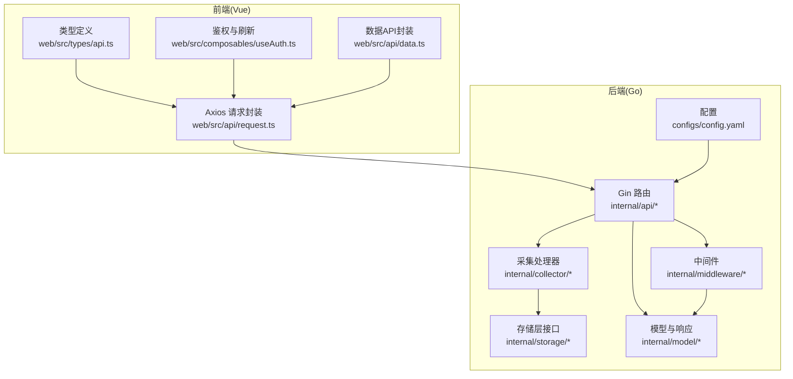
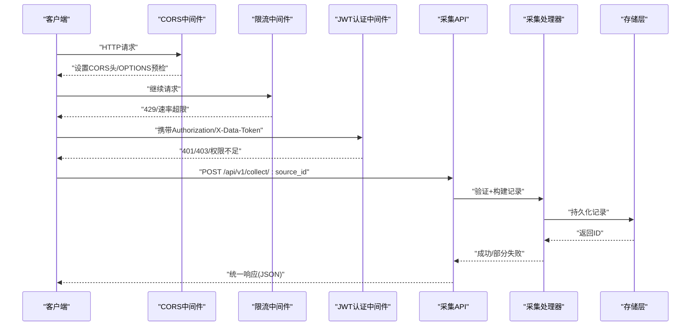
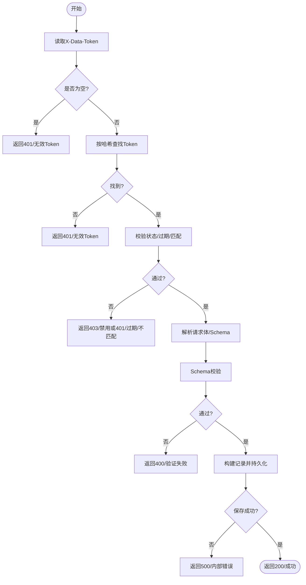
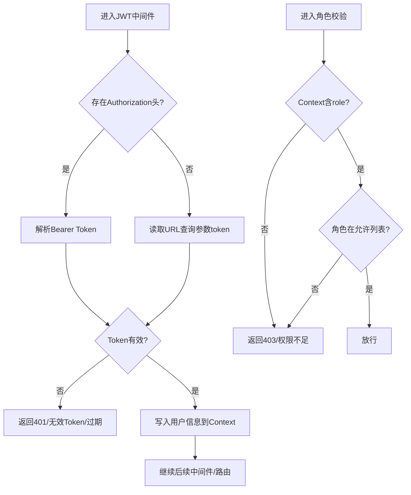
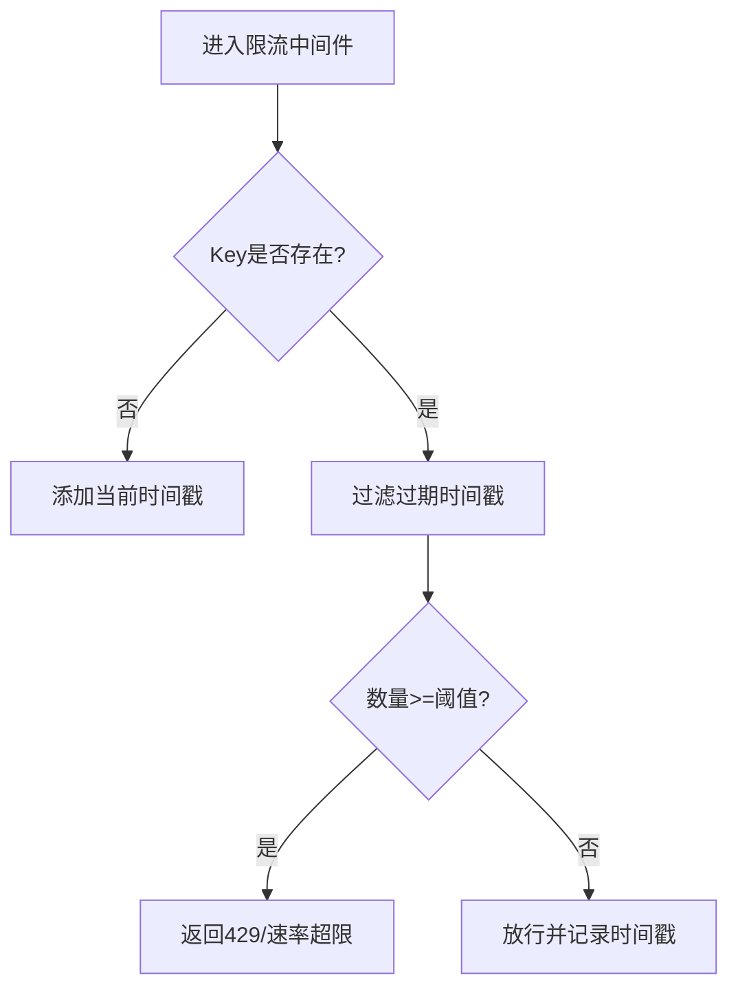
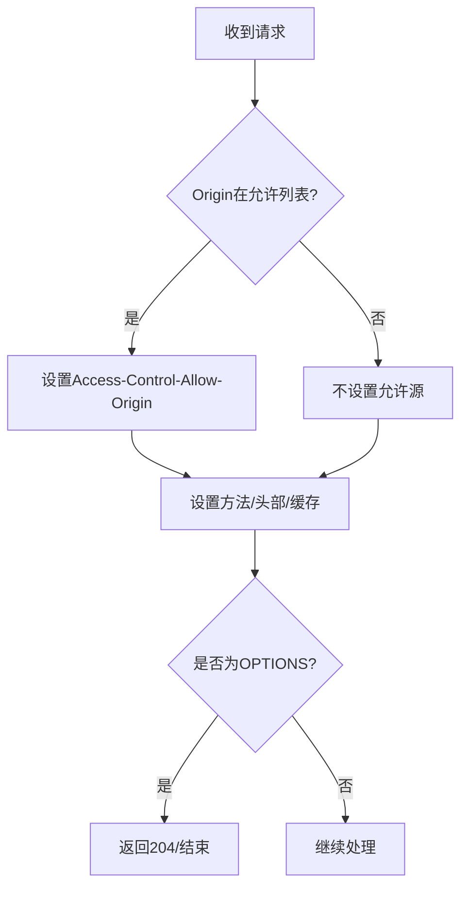
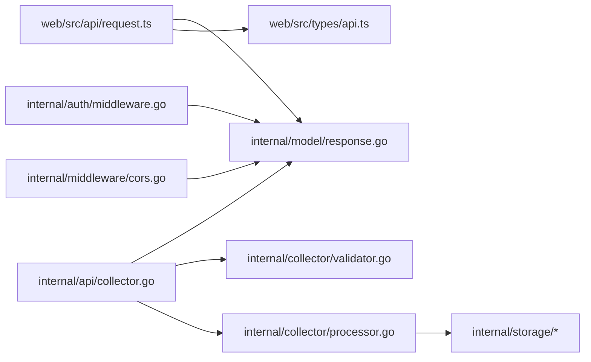

# API调用错误

<cite>
**本文引用的文件**
- [errors.go](file://internal/model/errors.go)
- [response.go](file://internal/model/response.go)
- [ratelimit.go](file://internal/middleware/ratelimit.go)
- [cors.go](file://internal/middleware/cors.go)
- [collector.go](file://internal/api/collector.go)
- [validator.go](file://internal/collector/validator.go)
- [processor.go](file://internal/collector/processor.go)
- [config.yaml](file://configs/config.yaml)
- [middleware.go](file://internal/auth/middleware.go)
- [auth.go](file://internal/api/auth.go)
- [request.ts](file://web/src/api/request.ts)
- [api.ts](file://web/src/types/api.ts)
- [useAuth.ts](file://web/src/composables/useAuth.ts)
- [data.ts](file://web/src/api/data.ts)
- [token.go](file://internal/model/token.go)
</cite>

## 目录
1. [简介](#简介)
2. [项目结构](#项目结构)
3. [核心组件](#核心组件)
4. [架构总览](#架构总览)
5. [详细组件分析](#详细组件分析)
6. [依赖分析](#依赖分析)
7. [性能考虑](#性能考虑)
8. [故障排除指南](#故障排除指南)
9. [结论](#结论)
10. [附录](#附录)

## 简介
本指南面向DataCollector的API使用者与维护者，聚焦于采集端与管理端API在生产环境中的常见错误场景与排障方法。内容覆盖HTTP状态码与业务错误码映射、认证令牌问题诊断、跨域问题、请求参数校验失败、批量数据处理与重试策略，并提供可操作的调试工具与测试步骤。

## 项目结构
DataCollector采用Go后端+Vue前端的前后端分离架构。后端通过Gin框架组织路由与中间件，统一响应结构；前端基于Axios封装请求与响应拦截器，内置JWT刷新逻辑与错误提示。

图表来源
- [collector.go:1-278](file://internal/api/collector.go#L1-L278)
- [ratelimit.go:1-137](file://internal/middleware/ratelimit.go#L1-L137)
- [cors.go:1-51](file://internal/middleware/cors.go#L1-L51)
- [validator.go:1-222](file://internal/collector/validator.go#L1-L222)
- [processor.go:1-84](file://internal/collector/processor.go#L1-L84)
- [response.go:1-72](file://internal/model/response.go#L1-L72)
- [config.yaml:1-41](file://configs/config.yaml#L1-L41)
- [request.ts:1-47](file://web/src/api/request.ts#L1-L47)
- [api.ts:1-12](file://web/src/types/api.ts#L1-L12)
- [useAuth.ts:1-37](file://web/src/composables/useAuth.ts#L1-L37)
- [data.ts:1-35](file://web/src/api/data.ts#L1-L35)

章节来源
- [collector.go:1-278](file://internal/api/collector.go#L1-L278)
- [config.yaml:1-41](file://configs/config.yaml#L1-L41)

## 核心组件
- 统一响应模型与错误码：后端通过统一响应结构体与错误码常量，确保前后端一致的错误语义与提示。
- 采集API：提供单条与批量数据提交，内置参数校验、Schema校验、限流与跨域支持。
- 采集处理器：负责数据持久化与统计事件上报。
- 认证与权限：JWT中间件、角色校验、初始化状态检查。
- 前端请求封装：Axios拦截器自动附加Authorization头、处理401跳转、统一封装业务错误。

章节来源
- [response.go:1-72](file://internal/model/response.go#L1-L72)
- [errors.go:1-84](file://internal/model/errors.go#L1-L84)
- [collector.go:1-278](file://internal/api/collector.go#L1-L278)
- [processor.go:1-84](file://internal/collector/processor.go#L1-L84)
- [middleware.go:1-148](file://internal/auth/middleware.go#L1-L148)
- [request.ts:1-47](file://web/src/api/request.ts#L1-L47)

## 架构总览
下图展示采集API的关键调用链：客户端发起请求→CORS与限流中间件→认证与权限→采集处理器→存储层→返回统一响应。

图表来源
- [cors.go:1-51](file://internal/middleware/cors.go#L1-L51)
- [ratelimit.go:1-137](file://internal/middleware/ratelimit.go#L1-L137)
- [middleware.go:1-148](file://internal/auth/middleware.go#L1-L148)
- [collector.go:1-278](file://internal/api/collector.go#L1-L278)
- [processor.go:1-84](file://internal/collector/processor.go#L1-L84)

## 详细组件分析

### 采集API与批量处理
- 单条采集：校验X-Data-Token、验证Token状态/过期/匹配、解析请求体、Schema校验、构造记录并持久化。
- 批量采集：与单条类似，但逐条验证并统计成功/失败数量，部分失败时仍返回聚合结果。

图表来源
- [collector.go:29-138](file://internal/api/collector.go#L29-L138)
- [validator.go:19-84](file://internal/collector/validator.go#L19-L84)
- [processor.go:30-52](file://internal/collector/processor.go#L30-L52)

章节来源
- [collector.go:140-268](file://internal/api/collector.go#L140-L268)
- [validator.go:1-222](file://internal/collector/validator.go#L1-L222)
- [processor.go:54-84](file://internal/collector/processor.go#L54-L84)

### 认证与权限中间件
- JWT认证中间件：优先从Authorization头解析Bearer Token，否则尝试URL查询参数；验证失败返回401。
- 角色校验中间件：检查用户角色是否在允许列表，不在则返回403。
- 初始化检查中间件：未初始化时对API请求返回服务不可用，对页面请求重定向至初始化页。

图表来源
- [middleware.go:11-95](file://internal/auth/middleware.go#L11-L95)

章节来源
- [middleware.go:1-148](file://internal/auth/middleware.go#L1-L148)

### 限流中间件
- 支持按IP与按Data Token两种限流维度，默认每分钟请求数可在配置中调整。
- 超限时返回429与业务错误码，前端可据此进行退避重试。

图表来源
- [ratelimit.go:68-98](file://internal/middleware/ratelimit.go#L68-L98)
- [ratelimit.go:100-136](file://internal/middleware/ratelimit.go#L100-L136)

章节来源
- [ratelimit.go:1-137](file://internal/middleware/ratelimit.go#L1-L137)
- [config.yaml:27-32](file://configs/config.yaml#L27-L32)

### 跨域中间件
- 支持允许所有源或白名单模式；设置允许的方法与头部；对OPTIONS预检请求快速返回。
- 前端需确保携带正确的Origin与必要的自定义头（如X-Data-Token）。

图表来源
- [cors.go:9-50](file://internal/middleware/cors.go#L9-L50)

章节来源
- [cors.go:1-51](file://internal/middleware/cors.go#L1-L51)
- [config.yaml:31-32](file://configs/config.yaml#L31-L32)

## 依赖分析
- 后端API依赖统一响应模型与错误码，采集API依赖采集处理器与存储层接口。
- 采集处理器依赖存储层实现，向上游提供单条与批量处理能力。
- 前端请求封装依赖后端统一响应结构，内置401自动跳转与业务错误提示。

图表来源
- [request.ts:1-47](file://web/src/api/request.ts#L1-L47)
- [response.go:1-72](file://internal/model/response.go#L1-L72)
- [collector.go:1-278](file://internal/api/collector.go#L1-L278)
- [validator.go:1-222](file://internal/collector/validator.go#L1-L222)
- [processor.go:1-84](file://internal/collector/processor.go#L1-L84)
- [middleware.go:1-148](file://internal/auth/middleware.go#L1-L148)
- [cors.go:1-51](file://internal/middleware/cors.go#L1-L51)

章节来源
- [collector.go:1-278](file://internal/api/collector.go#L1-L278)
- [processor.go:1-84](file://internal/collector/processor.go#L1-L84)
- [validator.go:1-222](file://internal/collector/validator.go#L1-L222)
- [response.go:1-72](file://internal/model/response.go#L1-L72)
- [request.ts:1-47](file://web/src/api/request.ts#L1-L47)

## 性能考虑
- 限流策略：按Token与按IP双维度限流，建议根据业务峰值合理上调阈值并结合指数退避重试。
- 批量处理：后端逐条持久化并统计结果，前端可分批提交以降低单次压力。
- CORS与预检：频繁的OPTIONS请求会增加开销，尽量复用CORS设置并减少自定义头变更。

## 故障排除指南

### 一、HTTP错误响应与解决方案
- 400 参数错误/验证失败
  - 现象：请求体格式错误、缺少必要字段、字段类型/长度/正则不匹配。
  - 排查要点：核对请求体结构、必填字段、字段类型与长度约束、正则表达式。
  - 参考实现位置
    - [collector.go:90-95](file://internal/api/collector.go#L90-L95)
    - [validator.go:23-84](file://internal/collector/validator.go#L23-L84)
    - [response.go:68-71](file://internal/model/response.go#L68-L71)
- 401 未授权/无效Token
  - 现象：缺少或无效的X-Data-Token、Token被禁用、过期、与source_id不匹配。
  - 排查要点：确认Token是否正确传递、是否启用、是否过期、是否属于目标数据源。
  - 参考实现位置
    - [collector.go:34-75](file://internal/api/collector.go#L34-L75)
    - [token.go:5-16](file://internal/model/token.go#L5-L16)
- 403 禁止访问/权限不足
  - 现象：Token被禁用或JWT角色无权限。
  - 排查要点：检查用户角色与所需角色、Token状态。
  - 参考实现位置
    - [collector.go:52-56](file://internal/api/collector.go#L52-L56)
    - [middleware.go:65-95](file://internal/auth/middleware.go#L65-L95)
- 404 未找到
  - 现象：数据源不存在。
  - 排查要点：确认source_id是否正确。
  - 参考实现位置
    - [collector.go:84-88](file://internal/api/collector.go#L84-L88)
- 429 请求过于频繁
  - 现象：触发限流。
  - 排查要点：检查限流阈值、是否使用同一Token/IP、是否需要退避重试。
  - 参考实现位置
    - [ratelimit.go:100-136](file://internal/middleware/ratelimit.go#L100-L136)
    - [config.yaml:29-30](file://configs/config.yaml#L29-L30)
- 500 服务器内部错误
  - 现象：数据库写入失败、序列化错误、处理器异常。
  - 排查要点：查看服务端日志、确认存储连接、检查Schema解析与数据序列化。
  - 参考实现位置
    - [collector.go:115-134](file://internal/api/collector.go#L115-L134)
    - [processor.go:34-52](file://internal/collector/processor.go#L34-L52)

章节来源
- [collector.go:29-138](file://internal/api/collector.go#L29-L138)
- [validator.go:19-84](file://internal/collector/validator.go#L19-L84)
- [response.go:35-71](file://internal/model/response.go#L35-L71)
- [ratelimit.go:100-136](file://internal/middleware/ratelimit.go#L100-L136)
- [config.yaml:27-32](file://configs/config.yaml#L27-L32)
- [token.go:5-16](file://internal/model/token.go#L5-L16)

### 二、API请求参数验证失败排查
- 必填字段缺失：确保每个声明为必填的字段均存在且非空。
- 类型不匹配：字符串/数字/布尔/日期/时间/URL/邮箱等类型需严格匹配。
- 长度与正则：字符串最大/最小长度、正则表达式必须同时满足。
- Schema解析失败：若数据源Schema配置异常，将回退为宽松校验。
- 排查步骤
  - 对照数据源Schema字段定义逐项检查。
  - 使用最小化样例逐步定位问题字段。
  - 参考实现位置
    - [validator.go:34-78](file://internal/collector/validator.go#L34-L78)
    - [validator.go:102-221](file://internal/collector/validator.go#L102-L221)
    - [collector.go:97-104](file://internal/api/collector.go#L97-L104)

章节来源
- [validator.go:19-84](file://internal/collector/validator.go#L19-L84)
- [collector.go:97-104](file://internal/api/collector.go#L97-L104)

### 三、认证令牌问题诊断与修复
- 缺少Authorization头或格式错误：确保使用“Bearer <token>”格式。
- Token过期：前端定时检测剩余有效期并在临界点刷新。
- 角色权限不足：确认用户角色是否满足路由要求。
- 初始化未完成：未初始化时管理API返回服务不可用。
- 排查步骤
  - 检查本地存储中的jwt_token是否有效。
  - 使用前端刷新接口主动刷新。
  - 参考实现位置
    - [middleware.go:19-63](file://internal/auth/middleware.go#L19-L63)
    - [auth.go:85-126](file://internal/api/auth.go#L85-L126)
    - [request.ts:22-44](file://web/src/api/request.ts#L22-L44)
    - [useAuth.ts:4-36](file://web/src/composables/useAuth.ts#L4-L36)

章节来源
- [middleware.go:1-148](file://internal/auth/middleware.go#L1-L148)
- [auth.go:1-147](file://internal/api/auth.go#L1-L147)
- [request.ts:1-47](file://web/src/api/request.ts#L1-L47)
- [useAuth.ts:1-37](file://web/src/composables/useAuth.ts#L1-L37)

### 四、跨域问题解决方案
- 症状：浏览器报跨域错误，预检请求失败。
- 排查要点：确认后端CORS允许的源列表、是否允许所有源、是否包含自定义头（如X-Data-Token）。
- 建议
  - 生产环境建议配置具体允许的Origin，避免使用通配符。
  - 确保前端请求头与后端允许的头一致。
- 参考实现位置
  - [cors.go:9-50](file://internal/middleware/cors.go#L9-L50)
  - [config.yaml:31-32](file://configs/config.yaml#L31-L32)

章节来源
- [cors.go:1-51](file://internal/middleware/cors.go#L1-L51)
- [config.yaml:31-32](file://configs/config.yaml#L31-L32)

### 五、API调试工具与测试方法
- 浏览器开发者工具
  - Network面板观察请求头、响应状态码与响应体。
  - Console查看Axios拦截器抛出的错误信息。
- Postman
  - 设置Authorization头为Bearer <token>。
  - 对采集接口设置X-Data-Token头。
  - 对批量接口设置body为包含records数组的JSON。
- 前端控制台
  - 检查jwt_token是否存在于localStorage。
  - 观察自动刷新逻辑是否触发。
- 参考实现位置
  - [request.ts:5-20](file://web/src/api/request.ts#L5-L20)
  - [data.ts:5-15](file://web/src/api/data.ts#L5-L15)
  - [api.ts:1-12](file://web/src/types/api.ts#L1-L12)

章节来源
- [request.ts:1-47](file://web/src/api/request.ts#L1-L47)
- [data.ts:1-35](file://web/src/api/data.ts#L1-L35)
- [api.ts:1-12](file://web/src/types/api.ts#L1-L12)

### 六、批量数据处理中的错误处理与重试机制
- 后端行为
  - 逐条验证与持久化，统计成功/失败数量。
  - 若全部失败，返回500与内部错误；若有部分成功，返回聚合结果。
- 前端建议
  - 分批提交（例如每次10-50条），降低单次失败影响。
  - 对429进行指数退避重试，对400/401/403直接停止并提示用户修正。
  - 对500进行有限次数重试并记录日志。
- 参考实现位置
  - [collector.go:255-267](file://internal/api/collector.go#L255-L267)
  - [processor.go:57-83](file://internal/collector/processor.go#L57-L83)

章节来源
- [collector.go:140-268](file://internal/api/collector.go#L140-L268)
- [processor.go:54-84](file://internal/collector/processor.go#L54-L84)

## 结论
通过统一的错误码体系、严格的参数与Schema校验、完善的限流与跨域支持，以及前后端协同的认证与重试策略，DataCollector能够稳定地支撑生产环境下的数据采集与管理。遇到错误时，建议按照“状态码→业务错误码→具体环节→定位实现”的思路逐层排查，并结合本文提供的调试与重试建议快速恢复服务。

## 附录
- 常用错误码参考
  - 采集类：无效Token、Token禁用、验证失败、速率超限
  - 认证类：登录失败、Token过期、权限不足、无效JWT
  - 查询类：查询参数错误、导出失败
  - 通用类：缺少参数、内部错误、未知错误
- 参考实现位置
  - [errors.go:3-83](file://internal/model/errors.go#L3-L83)

章节来源
- [errors.go:1-84](file://internal/model/errors.go#L1-L84)