# WebSocket连接问题

<cite>
**本文档引用的文件**
- [websocket.go](file://internal/monitor/websocket.go)
- [useWebSocket.ts](file://web/src/composables/useWebSocket.ts)
- [websocket.ts](file://web/src/stores/websocket.ts)
- [aggregator.go](file://internal/monitor/aggregator.go)
- [server.go](file://internal/server/server.go)
- [main.go](file://cmd/server/main.go)
- [middleware.go](file://internal/auth/middleware.go)
- [router.go](file://internal/api/router.go)
- [DashboardView.vue](file://web/src/views/DashboardView.vue)
- [config.yaml](file://configs/config.yaml)
</cite>

## 目录
1. [简介](#简介)
2. [项目结构](#项目结构)
3. [核心组件](#核心组件)
4. [架构概览](#架构概览)
5. [详细组件分析](#详细组件分析)
6. [依赖关系分析](#依赖关系分析)
7. [性能考虑](#性能考虑)
8. [故障排除指南](#故障排除指南)
9. [结论](#结论)

## 简介

DataCollector项目的WebSocket连接问题故障排除指南旨在帮助开发者和运维人员快速识别和解决WebSocket连接相关的技术问题。本指南涵盖了从握手失败到连接中断，从消息传输错误到心跳检测异常的完整故障排除流程。

## 项目结构

DataCollector采用前后端分离的架构设计，WebSocket功能主要集中在后端Go服务和前端Vue应用中：

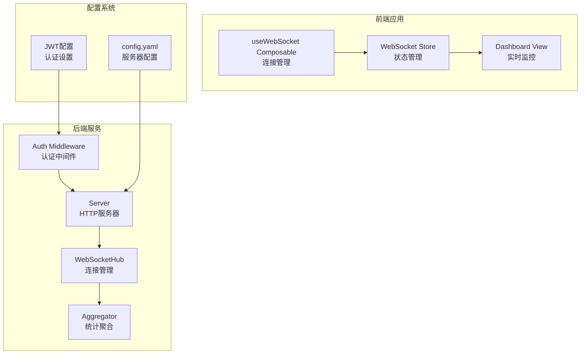

**图表来源**
- [websocket.go:14-22](file://internal/monitor/websocket.go#L14-L22)
- [server.go:22-32](file://internal/server/server.go#L22-L32)
- [useWebSocket.ts:3-65](file://web/src/composables/useWebSocket.ts#L3-L65)

**章节来源**
- [main.go:25-129](file://cmd/server/main.go#L25-L129)
- [config.yaml:1-41](file://configs/config.yaml#L1-L41)

## 核心组件

### WebSocketHub - 连接管理中心

WebSocketHub是整个WebSocket系统的中枢，负责管理所有客户端连接、广播消息和处理连接生命周期。

**关键特性：**
- 连接注册与注销
- 消息广播机制
- 心跳检测（Ping/Pong）
- 连接超时处理

### 前端WebSocket管理器

前端提供了两种WebSocket管理方式：
- **useWebSocket Composable**: Vue组合式API，适合单组件使用
- **WebSocket Store**: Pinia状态管理，适合全局状态共享

**章节来源**
- [websocket.go:52-106](file://internal/monitor/websocket.go#L52-L106)
- [useWebSocket.ts:3-65](file://web/src/composables/useWebSocket.ts#L3-L65)
- [websocket.ts:4-83](file://web/src/stores/websocket.ts#L4-L83)

## 架构概览

DataCollector的WebSocket架构采用了经典的发布-订阅模式：

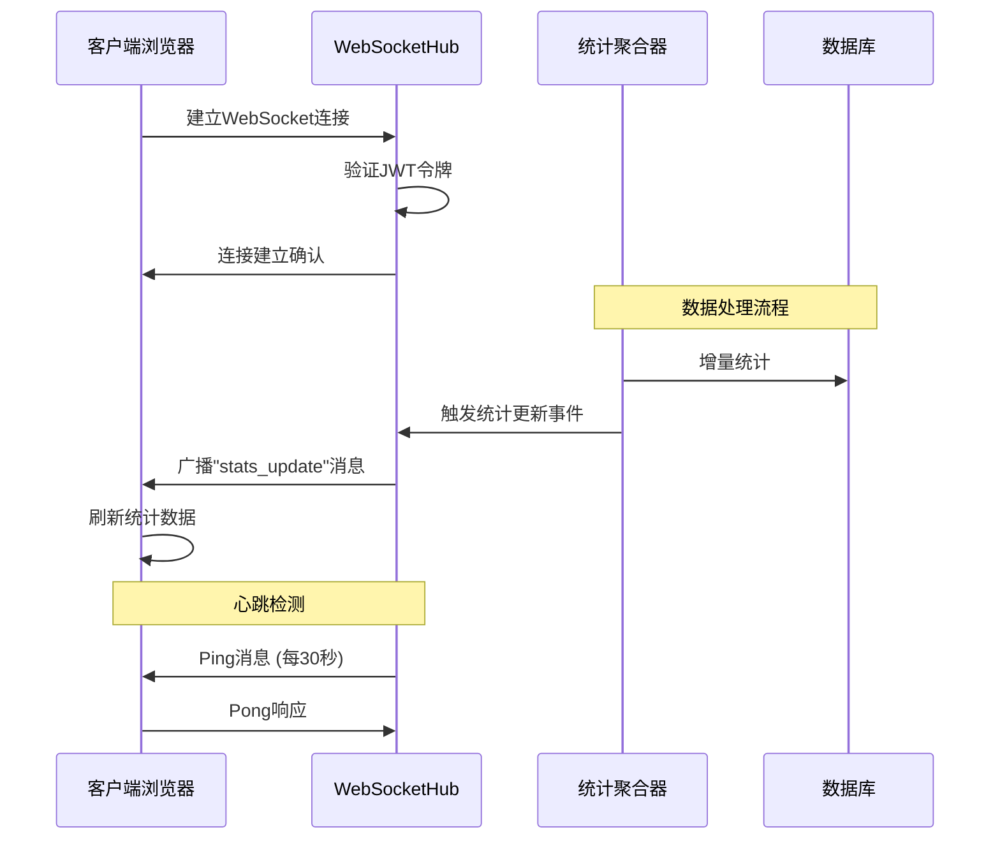

**图表来源**
- [server.go:79-83](file://internal/server/server.go#L79-L83)
- [aggregator.go:129-133](file://internal/monitor/aggregator.go#L129-L133)
- [websocket.go:150-190](file://internal/monitor/websocket.go#L150-L190)

## 详细组件分析

### WebSocket连接处理流程

WebSocket连接的完整生命周期包括握手、认证、消息传递和断开等阶段：

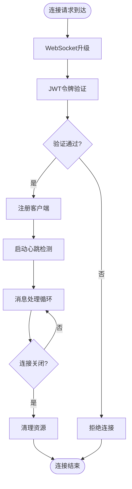

**图表来源**
- [websocket.go:129-147](file://internal/monitor/websocket.go#L129-L147)
- [middleware.go:19-63](file://internal/auth/middleware.go#L19-L63)

### 心跳检测机制

系统实现了双层心跳检测机制来确保连接的稳定性：

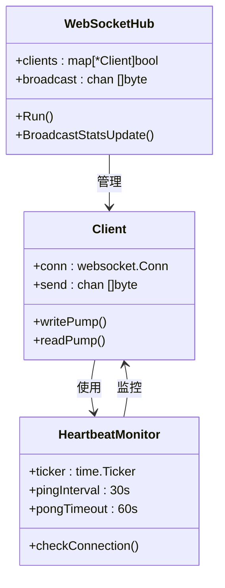

**图表来源**
- [websocket.go:150-215](file://internal/monitor/websocket.go#L150-L215)
- [aggregator.go:129-133](file://internal/monitor/aggregator.go#L129-L133)

**章节来源**
- [websocket.go:149-190](file://internal/monitor/websocket.go#L149-L190)
- [aggregator.go:52-74](file://internal/monitor/aggregator.go#L52-L74)

### 前端连接管理

前端提供了灵活的WebSocket连接管理方案：

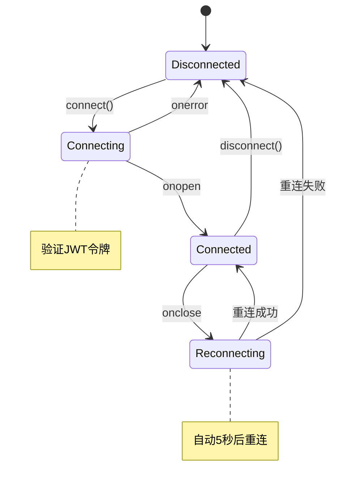

**图表来源**
- [useWebSocket.ts:9-38](file://web/src/composables/useWebSocket.ts#L9-L38)
- [websocket.ts:23-52](file://web/src/stores/websocket.ts#L23-L52)

**章节来源**
- [useWebSocket.ts:1-66](file://web/src/composables/useWebSocket.ts#L1-L66)
- [websocket.ts:1-83](file://web/src/stores/websocket.ts#L1-L83)

## 依赖关系分析

WebSocket系统的依赖关系相对清晰，主要涉及认证、存储和网络通信三个层面：

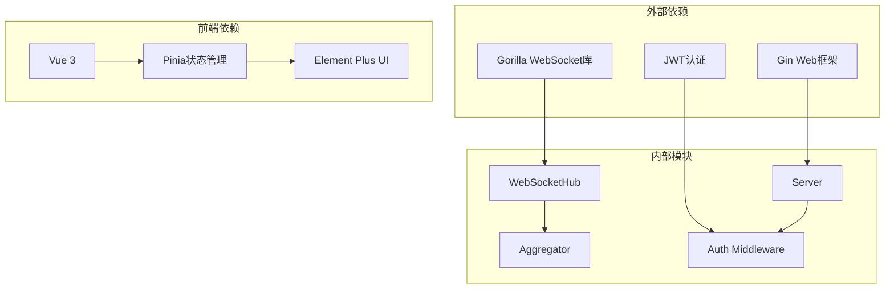

**图表来源**
- [websocket.go:10-11](file://internal/monitor/websocket.go#L10-L11)
- [server.go:10-20](file://internal/server/server.go#L10-L20)

**章节来源**
- [server.go:1-139](file://internal/server/server.go#L1-L139)
- [middleware.go:1-148](file://internal/auth/middleware.go#L1-L148)

## 性能考虑

### 连接池管理

WebSocketHub使用了高效的连接池管理策略：

- **客户端映射**: 使用map结构存储活跃连接，查找复杂度O(1)
- **广播通道**: 采用channel实现异步广播，避免阻塞
- **发送缓冲**: 客户端发送队列大小为256，防止内存溢出

### 心跳检测优化

系统的心跳检测配置经过精心调优：

- **Ping间隔**: 30秒，平衡网络负载和连接稳定性
- **读取超时**: 60秒，给客户端充足的响应时间
- **写入超时**: 10秒，确保及时发现死连接

## 故障排除指南

### 握手失败问题

#### 常见原因分析

1. **JWT令牌验证失败**
   - 令牌缺失或格式错误
   - 令牌过期
   - 令牌被禁用

2. **CORS跨域问题**
   - Origin头部不匹配
   - 预检请求失败

3. **服务器配置问题**
   - 端口被占用
   - TLS证书配置错误

#### 诊断步骤

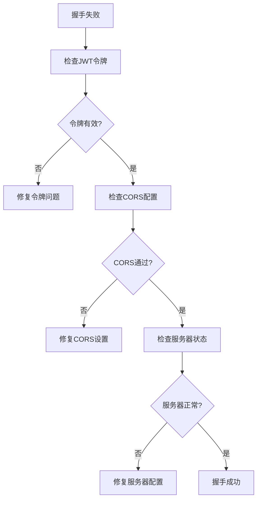

**章节来源**
- [middleware.go:19-63](file://internal/auth/middleware.go#L19-L63)
- [server.go:79-83](file://internal/server/server.go#L79-L83)

### 连接中断问题

#### 心跳检测异常

系统的心跳检测机制可能因为以下原因失效：

1. **网络延迟过高**
   - Ping-Pong往返时间超过60秒
   - 网络拥塞导致丢包

2. **客户端处理阻塞**
   - 前端JavaScript执行耗时过长
   - 浏览器标签页后台化

3. **服务器资源限制**
   - CPU使用率过高
   - 内存不足

#### 诊断方法

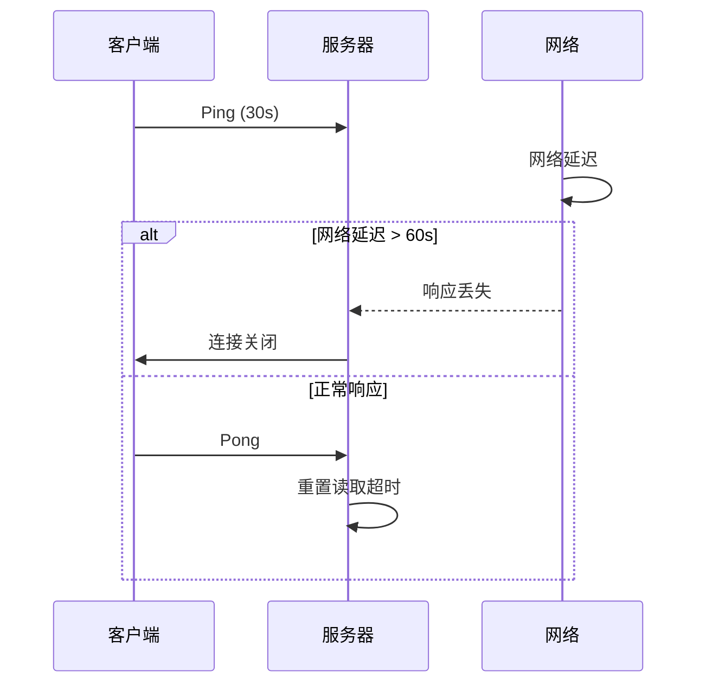

**图表来源**
- [websocket.go:183-187](file://internal/monitor/websocket.go#L183-L187)
- [websocket.go:200-204](file://internal/monitor/websocket.go#L200-L204)

**章节来源**
- [websocket.go:149-190](file://internal/monitor/websocket.go#L149-L190)

### 消息传输错误

#### 消息格式问题

1. **JSON解析错误**
   - 前端发送非JSON格式数据
   - 消息格式不符合预期

2. **消息大小限制**
   - 单条消息超过512字节限制
   - 批量消息处理超时

#### 处理机制

系统对消息传输错误采用了优雅降级策略：

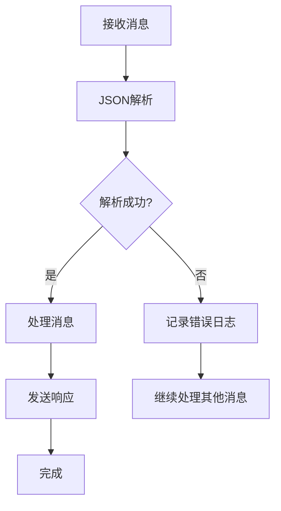

**图表来源**
- [useWebSocket.ts:18-25](file://web/src/composables/useWebSocket.ts#L18-L25)
- [websocket.go:206-215](file://internal/monitor/websocket.go#L206-L215)

**章节来源**
- [useWebSocket.ts:18-25](file://web/src/composables/useWebSocket.ts#L18-L25)
- [websocket.go:199-215](file://internal/monitor/websocket.go#L199-L215)

### 网络代理和防火墙影响

#### 代理服务器配置

1. **反向代理设置**
   - Nginx/Traefik等代理服务器需要正确配置WebSocket支持
   - 超时时间和缓冲区大小需要适当调整

2. **防火墙规则**
   - 端口访问控制
   - 协议支持检查

#### 配置建议

```mermaid
graph LR
subgraph "代理配置"
A[proxy_set_header Upgrade $http_upgrade]
B[proxy_set_header Connection "upgrade"]
C[proxy_set_header Host $host]
D[proxy_read_timeout 86400]
E[proxy_send_timeout 86400]
end
subgraph "防火墙规则"
F[允许TCP端口8080]
G[允许WebSocket协议]
H[允许Ping/Pong流量]
end
A --> F
B --> G
D --> H
```

**章节来源**
- [config.yaml:1-41](file://configs/config.yaml#L1-L41)
- [server.go:79-83](file://internal/server/server.go#L79-L83)

### 浏览器兼容性问题

#### 支持的浏览器版本

- **Chrome 6+**: 完全支持
- **Firefox 11+**: 完全支持  
- **Safari 6+**: 完全支持
- **Edge 12+**: 完全支持
- **IE**: 不支持WebSocket

#### 兼容性处理

前端代码包含了自动协议切换机制：

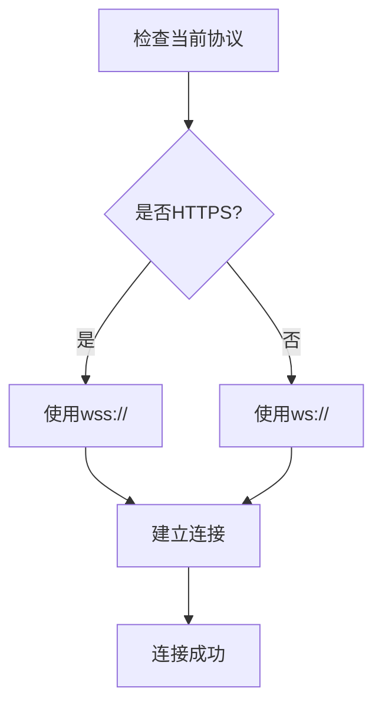

**图表来源**
- [websocket.ts:10-14](file://web/src/stores/websocket.ts#L10-L14)

**章节来源**
- [websocket.ts:10-14](file://web/src/stores/websocket.ts#L10-L14)

### 心跳检测和重连机制配置

#### 心跳检测配置

系统的心跳检测参数可以在以下位置进行调整：

1. **Ping间隔**: 30秒（writePump定时器）
2. **读取超时**: 60秒（readPump超时）
3. **写入超时**: 10秒（写入操作超时）

#### 重连机制

前端实现了指数退避重连策略：

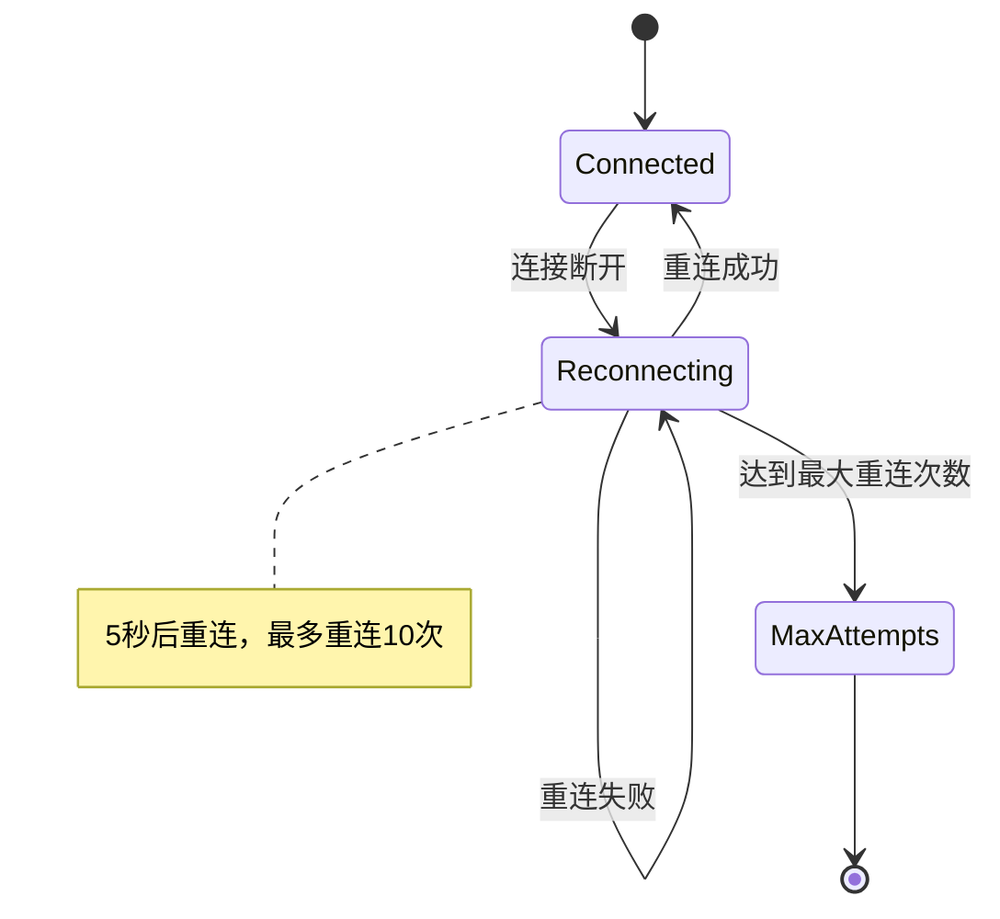

**章节来源**
- [websocket.go:150-190](file://internal/monitor/websocket.go#L150-L190)
- [useWebSocket.ts:27-30](file://web/src/composables/useWebSocket.ts#L27-L30)

### WebSocket调试工具和监控方法

#### 后端监控

1. **日志级别配置**
   - debug: 详细调试信息
   - info: 一般运行信息
   - warn: 警告信息
   - error: 错误信息

2. **监控指标**
   - 连接数量统计
   - 消息处理速率
   - 错误率统计

#### 前端调试

1. **浏览器开发者工具**
   - Network面板查看WebSocket连接
   - Console面板查看错误信息
   - Application面板查看localStorage中的JWT令牌

2. **自定义调试函数**

**章节来源**
- [config.yaml:34-41](file://configs/config.yaml#L34-L41)
- [main.go:132-153](file://cmd/server/main.go#L132-L153)

### 实时数据推送失败诊断

#### 推送流程分析

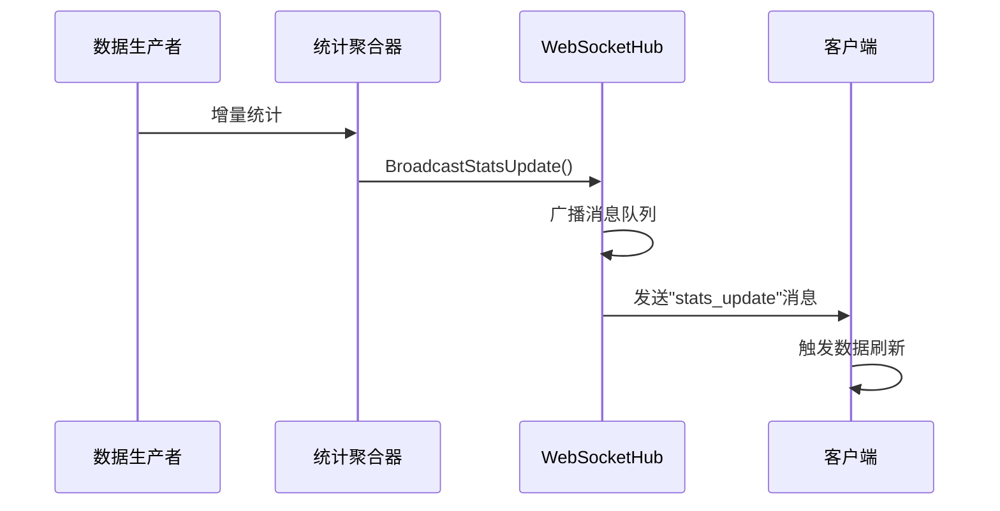

**图表来源**
- [aggregator.go:129-133](file://internal/monitor/aggregator.go#L129-L133)
- [websocket.go:108-127](file://internal/monitor/websocket.go#L108-L127)

#### 诊断步骤

1. **检查聚合器状态**
   - 确认统计数据正常增长
   - 验证flush操作执行情况

2. **检查Hub状态**
   - 确认客户端连接数量
   - 验证广播队列状态

3. **检查客户端状态**
   - 确认消息处理逻辑
   - 验证UI更新机制

**章节来源**
- [aggregator.go:89-133](file://internal/monitor/aggregator.go#L89-L133)
- [DashboardView.vue:147-152](file://web/src/views/DashboardView.vue#L147-L152)

## 结论

WebSocket连接问题的故障排除需要从多个维度进行综合分析。通过理解DataCollector项目的WebSocket架构设计，结合具体的诊断步骤和配置建议，可以有效地识别和解决各种连接问题。

关键要点包括：
- 建立完善的日志监控体系
- 配置合理的超时和重连参数
- 确保网络基础设施支持WebSocket协议
- 实施有效的前端错误处理机制
- 建立定期的健康检查和性能监控

通过遵循本指南提供的方法和最佳实践，可以显著提高WebSocket连接的稳定性和可靠性，确保实时数据推送功能的正常运行。