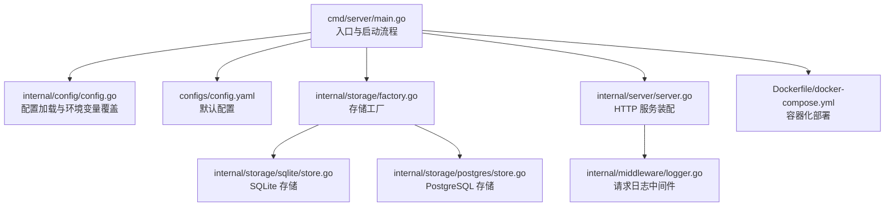
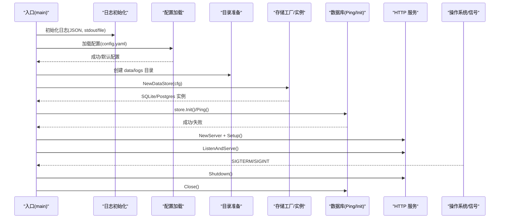
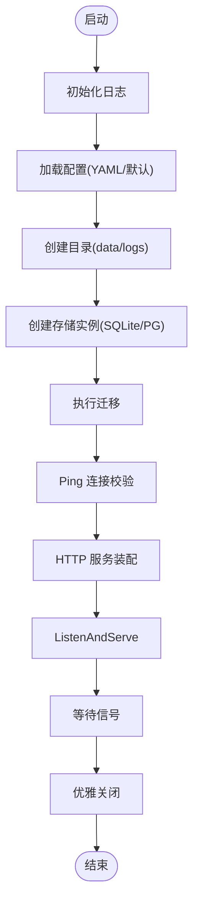
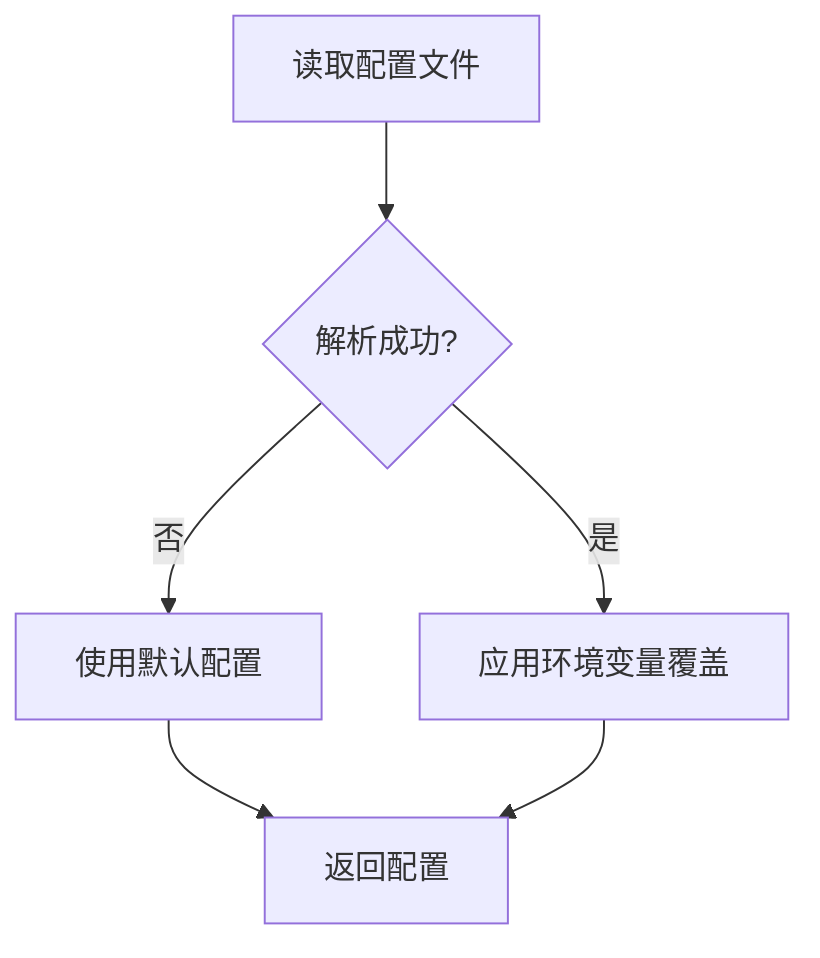
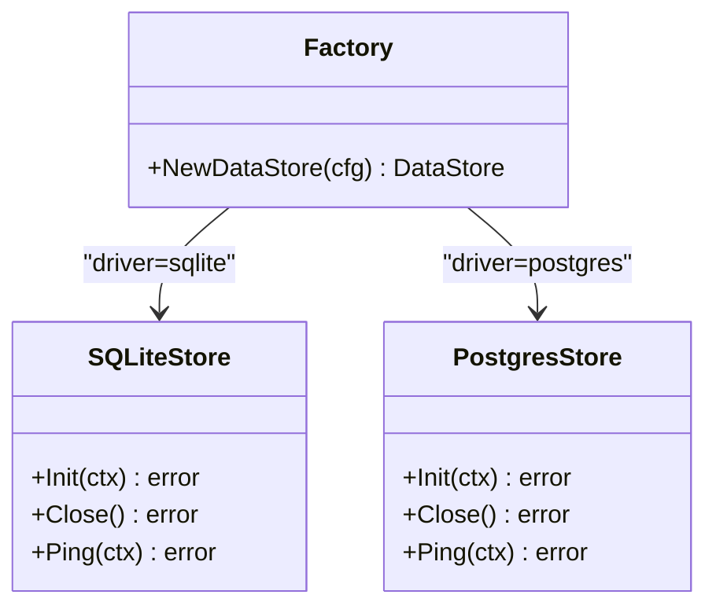
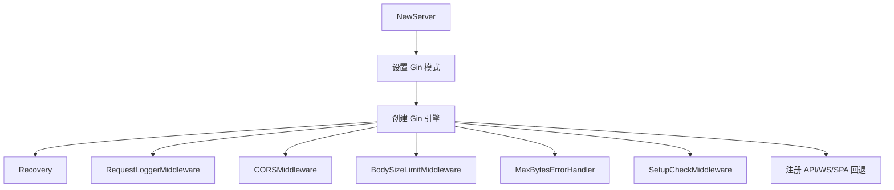
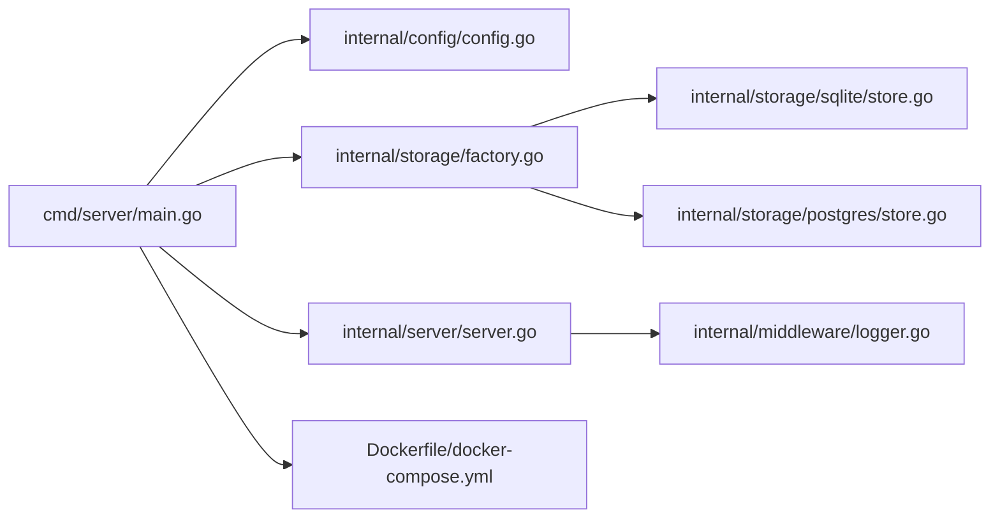

# 启动问题

<cite>
**本文引用的文件**
- [cmd/server/main.go](file://cmd/server/main.go)
- [internal/server/server.go](file://internal/server/server.go)
- [configs/config.yaml](file://configs/config.yaml)
- [internal/config/config.go](file://internal/config/config.go)
- [internal/storage/factory.go](file://internal/storage/factory.go)
- [internal/storage/sqlite/store.go](file://internal/storage/sqlite/store.go)
- [internal/storage/postgres/store.go](file://internal/storage/postgres/store.go)
- [Dockerfile](file://Dockerfile)
- [docker-compose.yml](file://docker-compose.yml)
- [internal/middleware/logger.go](file://internal/middleware/logger.go)
- [internal/api/setup.go](file://internal/api/setup.go)
- [internal/model/errors.go](file://internal/model/errors.go)
- [internal/storage/interface.go](file://internal/storage/interface.go)
- [Makefile](file://Makefile)
- [scripts/build.sh](file://scripts/build.sh)
- [build.bat](file://build.bat)
</cite>

## 目录
1. [简介](#简介)
2. [项目结构](#项目结构)
3. [核心组件](#核心组件)
4. [架构总览](#架构总览)
5. [详细组件分析](#详细组件分析)
6. [依赖分析](#依赖分析)
7. [性能考虑](#性能考虑)
8. [故障排除指南](#故障排除指南)
9. [结论](#结论)
10. [附录](#附录)

## 简介
本指南聚焦于 DataCollector 服务器启动阶段的常见问题与排障方法，涵盖配置文件加载失败、数据库连接初始化错误、端口占用、权限不足、环境变量覆盖、容器化部署问题以及不同操作系统（Windows、Linux、Docker）下的特定注意事项。文档同时提供启动过程关键日志的分析方法与错误信息解读，帮助快速定位并解决问题。

## 项目结构
DataCollector 的启动流程围绕入口程序、配置加载、存储初始化、HTTP 服务启动与中间件装配展开。前端资源通过嵌入方式随二进制分发，便于独立运行。

**图表来源**
- [cmd/server/main.go:1-201](file://cmd/server/main.go#L1-L201)
- [internal/config/config.go:1-215](file://internal/config/config.go#L1-L215)
- [configs/config.yaml:1-41](file://configs/config.yaml#L1-L41)
- [internal/storage/factory.go:1-22](file://internal/storage/factory.go#L1-L22)
- [internal/storage/sqlite/store.go:1-86](file://internal/storage/sqlite/store.go#L1-L86)
- [internal/storage/postgres/store.go:1-61](file://internal/storage/postgres/store.go#L1-L61)
- [internal/server/server.go:1-139](file://internal/server/server.go#L1-L139)
- [internal/middleware/logger.go:1-67](file://internal/middleware/logger.go#L1-L67)
- [Dockerfile:1-52](file://Dockerfile#L1-L52)
- [docker-compose.yml:1-56](file://docker-compose.yml#L1-L56)

**章节来源**
- [cmd/server/main.go:1-201](file://cmd/server/main.go#L1-L201)
- [internal/server/server.go:1-139](file://internal/server/server.go#L1-L139)
- [configs/config.yaml:1-41](file://configs/config.yaml#L1-L41)
- [internal/config/config.go:1-215](file://internal/config/config.go#L1-L215)
- [internal/storage/factory.go:1-22](file://internal/storage/factory.go#L1-L22)
- [internal/storage/sqlite/store.go:1-86](file://internal/storage/sqlite/store.go#L1-L86)
- [internal/storage/postgres/store.go:1-61](file://internal/storage/postgres/store.go#L1-L61)
- [Dockerfile:1-52](file://Dockerfile#L1-L52)
- [docker-compose.yml:1-56](file://docker-compose.yml#L1-L56)

## 核心组件
- 启动入口与控制流：负责日志初始化、配置加载、目录准备、存储初始化与迁移、数据库连通性校验、HTTP 服务启动、信号监听与优雅关闭。
- 配置模块：支持 YAML 文件加载与环境变量覆盖，提供默认配置回退。
- 存储模块：根据驱动类型创建 SQLite 或 PostgreSQL 实例，执行迁移与 Ping 校验。
- HTTP 服务：基于 Gin 框架装配中间件与路由，提供 SPA 静态资源与回退。
- 中间件：统一请求日志记录，便于启动与运行期问题定位。
- 容器化：Dockerfile 与 docker-compose 提供多阶段构建与运行时环境。

**章节来源**
- [cmd/server/main.go:25-129](file://cmd/server/main.go#L25-L129)
- [internal/config/config.go:82-195](file://internal/config/config.go#L82-L195)
- [internal/storage/factory.go:11-21](file://internal/storage/factory.go#L11-L21)
- [internal/server/server.go:54-87](file://internal/server/server.go#L54-L87)
- [internal/middleware/logger.go:11-66](file://internal/middleware/logger.go#L11-L66)

## 架构总览
下图展示启动阶段的关键交互与错误传播路径：

**图表来源**
- [cmd/server/main.go:25-129](file://cmd/server/main.go#L25-L129)
- [internal/config/config.go:82-98](file://internal/config/config.go#L82-L98)
- [internal/storage/factory.go:11-21](file://internal/storage/factory.go#L11-L21)
- [internal/storage/sqlite/store.go:24-56](file://internal/storage/sqlite/store.go#L24-L56)
- [internal/storage/postgres/store.go:20-34](file://internal/storage/postgres/store.go#L20-L34)
- [internal/server/server.go:34-92](file://internal/server/server.go#L34-L92)

## 详细组件分析

### 启动流程与关键阶段
- 日志初始化：默认输出到标准输出，支持文件输出与轮转；日志级别可由环境变量覆盖。
- 配置加载：优先从配置文件加载，失败则使用默认配置；随后应用环境变量覆盖。
- 目录准备：确保 data 与 logs 目录存在，否则直接退出。
- 存储初始化：根据驱动创建实例，执行迁移，进行 Ping 校验。
- HTTP 服务：创建 Gin 引擎，注册中间件与路由，启动监听。
- 优雅关闭：接收信号后关闭 HTTP 服务、停止聚合器、关闭数据库。

**图表来源**
- [cmd/server/main.go:25-129](file://cmd/server/main.go#L25-L129)
- [internal/config/config.go:82-195](file://internal/config/config.go#L82-L195)
- [internal/storage/factory.go:11-21](file://internal/storage/factory.go#L11-L21)
- [internal/storage/sqlite/store.go:58-85](file://internal/storage/sqlite/store.go#L58-L85)
- [internal/storage/postgres/store.go:36-60](file://internal/storage/postgres/store.go#L36-L60)
- [internal/server/server.go:54-92](file://internal/server/server.go#L54-L92)

**章节来源**
- [cmd/server/main.go:25-129](file://cmd/server/main.go#L25-L129)
- [internal/config/config.go:82-195](file://internal/config/config.go#L82-L195)
- [internal/storage/sqlite/store.go:24-85](file://internal/storage/sqlite/store.go#L24-L85)
- [internal/storage/postgres/store.go:20-60](file://internal/storage/postgres/store.go#L20-L60)
- [internal/server/server.go:54-92](file://internal/server/server.go#L54-L92)

### 配置加载与环境变量覆盖
- 配置来源顺序：文件 → 默认值 → 环境变量覆盖。
- 支持覆盖项：数据库驱动、SQLite 路径、PostgreSQL 主机/端口/用户/密码/库名、服务器端口、JWT 密钥、日志级别。
- 配置文件默认值：主机、端口、模式、TLS、数据库驱动、JWT、采集器、日志等。

**图表来源**
- [internal/config/config.go:82-98](file://internal/config/config.go#L82-L98)
- [internal/config/config.go:149-195](file://internal/config/config.go#L149-L195)
- [configs/config.yaml:1-41](file://configs/config.yaml#L1-L41)

**章节来源**
- [internal/config/config.go:82-195](file://internal/config/config.go#L82-L195)
- [configs/config.yaml:1-41](file://configs/config.yaml#L1-L41)

### 存储初始化与数据库驱动
- 工厂根据配置驱动创建 SQLite 或 PostgreSQL 实例。
- SQLite：确保目录存在、打开连接、启用 WAL、设置 busy timeout。
- PostgreSQL：打开连接、设置连接池大小。
- 迁移：读取内嵌 SQL 并执行；Ping 校验连接可用性。

**图表来源**
- [internal/storage/factory.go:11-21](file://internal/storage/factory.go#L11-L21)
- [internal/storage/sqlite/store.go:17-56](file://internal/storage/sqlite/store.go#L17-L56)
- [internal/storage/postgres/store.go:14-34](file://internal/storage/postgres/store.go#L14-L34)

**章节来源**
- [internal/storage/factory.go:11-21](file://internal/storage/factory.go#L11-L21)
- [internal/storage/sqlite/store.go:24-85](file://internal/storage/sqlite/store.go#L24-L85)
- [internal/storage/postgres/store.go:20-60](file://internal/storage/postgres/store.go#L20-L60)

### HTTP 服务装配与中间件
- Gin 模式：由配置决定 debug/release。
- 中间件：恢复、请求日志、CORS、请求体大小限制、速率限制、JWT 认证中间件。
- 路由：API 路由、WebSocket 路由、SPA 静态资源与回退。

**图表来源**
- [internal/server/server.go:34-92](file://internal/server/server.go#L34-L92)
- [internal/middleware/logger.go:11-66](file://internal/middleware/logger.go#L11-L66)

**章节来源**
- [internal/server/server.go:54-92](file://internal/server/server.go#L54-L92)
- [internal/middleware/logger.go:11-66](file://internal/middleware/logger.go#L11-L66)

## 依赖分析
- 启动入口依赖配置、存储工厂、HTTP 服务与日志模块。
- 存储工厂依赖 SQLite/Postgres 实现。
- HTTP 服务依赖中间件与路由注册。
- 容器化依赖 Dockerfile 与 docker-compose 的环境变量与卷挂载。

**图表来源**
- [cmd/server/main.go:1-201](file://cmd/server/main.go#L1-L201)
- [internal/config/config.go:1-215](file://internal/config/config.go#L1-L215)
- [internal/storage/factory.go:1-22](file://internal/storage/factory.go#L1-L22)
- [internal/storage/sqlite/store.go:1-86](file://internal/storage/sqlite/store.go#L1-L86)
- [internal/storage/postgres/store.go:1-61](file://internal/storage/postgres/store.go#L1-L61)
- [internal/server/server.go:1-139](file://internal/server/server.go#L1-L139)
- [internal/middleware/logger.go:1-67](file://internal/middleware/logger.go#L1-L67)
- [Dockerfile:1-52](file://Dockerfile#L1-L52)
- [docker-compose.yml:1-56](file://docker-compose.yml#L1-L56)

**章节来源**
- [cmd/server/main.go:1-201](file://cmd/server/main.go#L1-L201)
- [internal/storage/factory.go:1-22](file://internal/storage/factory.go#L1-L22)
- [internal/server/server.go:1-139](file://internal/server/server.go#L1-L139)
- [Dockerfile:1-52](file://Dockerfile#L1-L52)
- [docker-compose.yml:1-56](file://docker-compose.yml#L1-L56)

## 性能考虑
- 日志级别与输出：生产建议使用文件输出与合理轮转策略，避免 stdout 泄露过多日志。
- 数据库连接池：PostgreSQL 默认连接池较大，SQLite 单写 WAL 模式提升并发能力。
- Gin 模式：release 模式减少调试开销，提高吞吐。

[本节为通用指导，无需列出具体文件来源]

## 故障排除指南

### 一、配置文件加载失败
- 现象
  - 启动日志显示“配置文件加载失败，使用默认配置”。
  - 部分配置未按预期生效。
- 原因
  - 配置文件路径不正确或权限不足。
  - YAML 格式错误或键名拼写错误。
  - 环境变量覆盖导致与期望不符。
- 排查步骤
  - 确认配置文件路径与权限：入口会尝试从固定路径加载配置文件，若失败则回退默认配置。
  - 校验 YAML 语法与键名：参考默认配置结构核对键名与类型。
  - 检查环境变量覆盖：确认环境变量是否被正确注入且数值可转换。
- 解决方案
  - 修正配置文件路径与权限。
  - 修复 YAML 语法与键名。
  - 明确环境变量覆盖范围，必要时在启动脚本中显式设置。

**章节来源**
- [cmd/server/main.go:155-169](file://cmd/server/main.go#L155-L169)
- [internal/config/config.go:82-98](file://internal/config/config.go#L82-L98)
- [internal/config/config.go:149-195](file://internal/config/config.go#L149-L195)
- [configs/config.yaml:1-41](file://configs/config.yaml#L1-L41)

### 二、数据库连接初始化错误
- 现象
  - “failed to create datastore”、“failed to initialize database”、“database ping failed”。
- 原因
  - 驱动不支持或配置错误（SQLite 路径、PostgreSQL 主机/端口/用户/密码/库名）。
  - 迁移文件读取失败或执行失败。
  - 权限不足导致无法创建数据库文件或连接数据库。
- 排查步骤
  - 确认驱动与配置：检查数据库驱动与对应配置项。
  - 查看迁移执行：确认迁移文件存在且可读。
  - 校验权限：确保运行账户对数据目录与数据库文件具有读写权限。
  - 使用系统初始化接口进行连接测试（仅 PostgreSQL）。
- 解决方案
  - 修正驱动与配置项。
  - 修复迁移文件与权限。
  - 在容器中使用正确的卷挂载与权限设置。

**章节来源**
- [cmd/server/main.go:45-64](file://cmd/server/main.go#L45-L64)
- [internal/storage/factory.go:11-21](file://internal/storage/factory.go#L11-L21)
- [internal/storage/sqlite/store.go:24-56](file://internal/storage/sqlite/store.go#L24-L56)
- [internal/storage/postgres/store.go:20-34](file://internal/storage/postgres/store.go#L20-L34)
- [internal/storage/sqlite/store.go:58-75](file://internal/storage/sqlite/store.go#L58-L75)
- [internal/storage/postgres/store.go:36-50](file://internal/storage/postgres/store.go#L36-L50)
- [internal/api/setup.go:62-105](file://internal/api/setup.go#L62-L105)

### 三、端口占用问题
- 现象
  - HTTP 服务启动时报错，无法绑定地址。
- 原因
  - 端口已被占用或权限不足。
- 排查步骤
  - 确认配置中的主机与端口：入口会从配置读取主机与端口。
  - 检查端口占用：在宿主系统上使用 netstat/ss/lsof 等工具排查。
  - 检查权限：非特权端口需管理员权限。
- 解决方案
  - 修改配置中的端口号或释放占用端口。
  - 以管理员权限运行或使用更高权限端口。

**章节来源**
- [cmd/server/main.go:90-101](file://cmd/server/main.go#L90-L101)
- [internal/config/config.go:179-184](file://internal/config/config.go#L179-L184)

### 四、权限不足
- 现象
  - 目录创建失败、数据库文件无法打开、日志写入失败。
- 原因
  - 运行账户对 data/logs 目录或数据库文件无写权限。
- 排查步骤
  - 确认目录创建逻辑：入口会创建 data 与 logs 目录。
  - 检查文件系统权限：确保运行用户具备读写权限。
- 解决方案
  - 调整目录权限或以具备权限的用户运行。

**章节来源**
- [cmd/server/main.go:171-184](file://cmd/server/main.go#L171-L184)
- [internal/storage/sqlite/store.go:27-31](file://internal/storage/sqlite/store.go#L27-L31)

### 五、环境变量配置问题
- 现象
  - 配置未按预期生效，行为与默认值一致。
- 原因
  - 环境变量未正确注入或数值不可转换。
- 排查步骤
  - 检查环境变量覆盖函数：确认键名与类型转换逻辑。
  - 在容器中确认 docker-compose 或 Dockerfile 的环境变量设置。
- 解决方案
  - 修正环境变量名称与数值格式，确保可转换。

**章节来源**
- [internal/config/config.go:149-195](file://internal/config/config.go#L149-L195)
- [Dockerfile:45-49](file://Dockerfile#L45-L49)
- [docker-compose.yml:13-16](file://docker-compose.yml#L13-L16)

### 六、容器化部署中的启动问题
- 现象
  - 容器启动后立即退出或无法访问服务。
- 原因
  - 端口映射、卷挂载、环境变量未正确配置。
  - 数据库未就绪或连接串错误。
- 排查步骤
  - 检查 docker-compose 的端口映射与卷挂载。
  - 确认数据库服务健康状态与连接串。
  - 查看容器日志，关注“failed to create datastore”、“failed to initialize database”、“database ping failed”等关键日志。
- 解决方案
  - 修正端口映射与卷挂载。
  - 确保数据库服务先于应用启动并健康。
  - 在容器内使用默认配置与环境变量覆盖。

**章节来源**
- [docker-compose.yml:8-16](file://docker-compose.yml#L8-L16)
- [Dockerfile:45-51](file://Dockerfile#L45-L51)
- [cmd/server/main.go:45-64](file://cmd/server/main.go#L45-L64)

### 七、不同操作系统下的启动问题
- Windows
  - SQLite 需要 CGO 支持；若未安装 MinGW-w64，构建时会降级为无 CGO。
  - 建议安装 MinGW-w64 以启用 CGO，确保 SQLite 功能正常。
- Linux
  - 多平台构建脚本支持交叉编译；非 Linux/amd64 平台默认禁用 CGO。
  - 若需 SQLite，请在目标平台安装相应 C 工具链或使用预编译二进制。
- Docker
  - 多阶段构建已启用 CGO（Linux/amd64），其他平台默认禁用 CGO。
  - 确保数据与日志目录在容器内可写。

**章节来源**
- [build.bat:34-43](file://build.bat#L34-L43)
- [scripts/build.sh:49-57](file://scripts/build.sh#L49-L57)
- [Dockerfile:27-28](file://Dockerfile#L27-L28)

### 八、启动过程中的关键日志分析
- 启动阶段日志
  - “starting DataCollector server”：启动入口日志。
  - “configuration loaded from file”：配置文件加载成功。
  - “failed to load config file, using default config”：配置文件加载失败，使用默认配置。
  - “failed to create datastore”：存储工厂创建失败。
  - “failed to initialize database”：迁移执行失败。
  - “database ping failed”：数据库 Ping 失败。
  - “HTTP server starting/address”：HTTP 服务启动。
  - “HTTP server error/error”：HTTP 服务启动错误。
  - “shutdown signal received, starting graceful shutdown...”：收到信号，开始优雅关闭。
  - “HTTP server shutdown error”：优雅关闭阶段错误。
  - “statistics aggregator stopped”：聚合器停止。
  - “database close error”：数据库关闭错误。
- 分析要点
  - 逐级定位失败点：配置 → 目录 → 存储 → 迁移 → Ping → HTTP → 优雅关闭。
  - 结合错误码与错误消息：系统运维类错误码（如初始化失败、已初始化）有助于快速判断。

**章节来源**
- [cmd/server/main.go:25-129](file://cmd/server/main.go#L25-L129)
- [internal/model/errors.go:29-38](file://internal/model/errors.go#L29-L38)

## 结论
启动问题通常源于配置加载失败、存储初始化异常、端口占用或权限不足。通过逐阶段的日志分析与环境变量覆盖检查，结合容器化部署的最佳实践，可快速定位并解决大多数启动问题。建议在生产环境中使用文件日志与合理的轮转策略，并确保数据库与文件系统的权限正确。

## 附录
- 常用命令与脚本
  - 构建与运行：使用 Makefile 的 build/run 目标。
  - 多平台构建：使用 scripts/build.sh。
  - Windows 构建：使用 build.bat。
- 配置参考
  - 默认配置键名与类型可参考配置模块与配置文件。

**章节来源**
- [Makefile:28-38](file://Makefile#L28-L38)
- [scripts/build.sh:1-64](file://scripts/build.sh#L1-L64)
- [build.bat:16-61](file://build.bat#L16-L61)
- [configs/config.yaml:1-41](file://configs/config.yaml#L1-L41)
- [internal/config/config.go:12-80](file://internal/config/config.go#L12-L80)