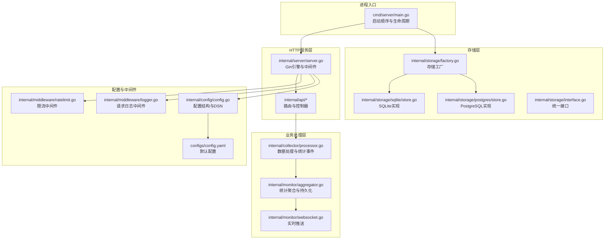
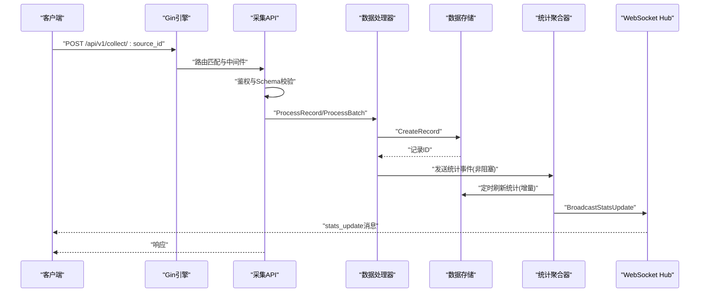
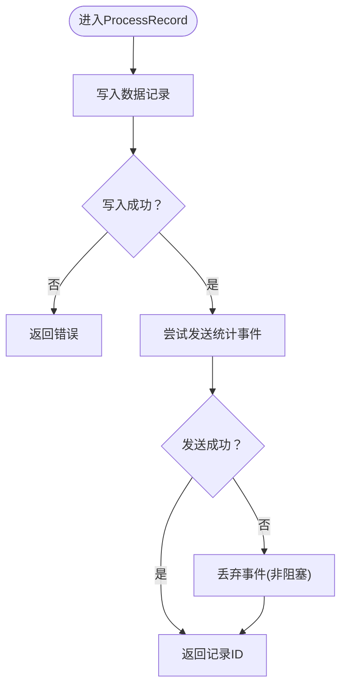
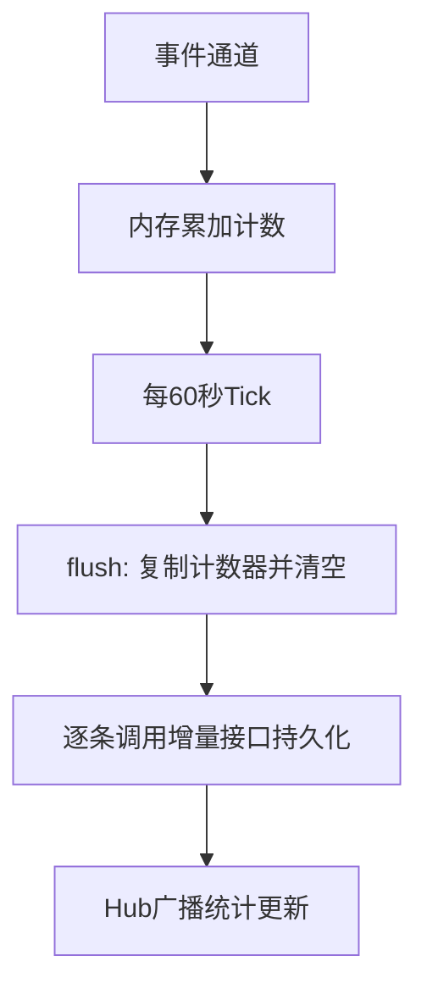
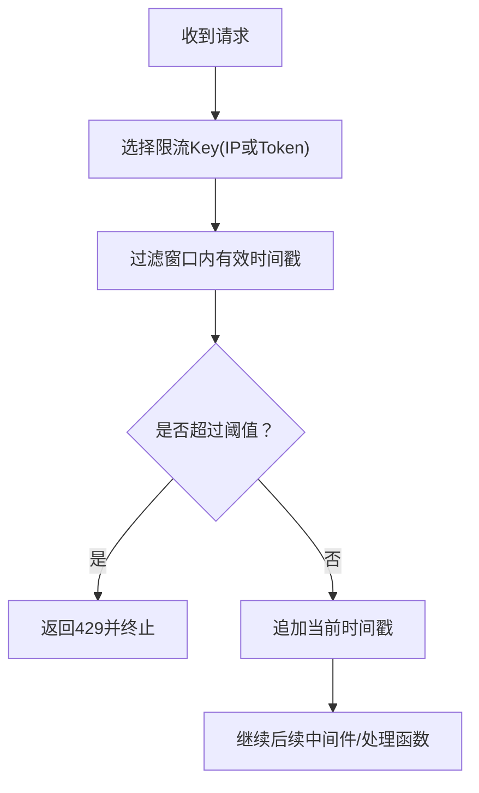
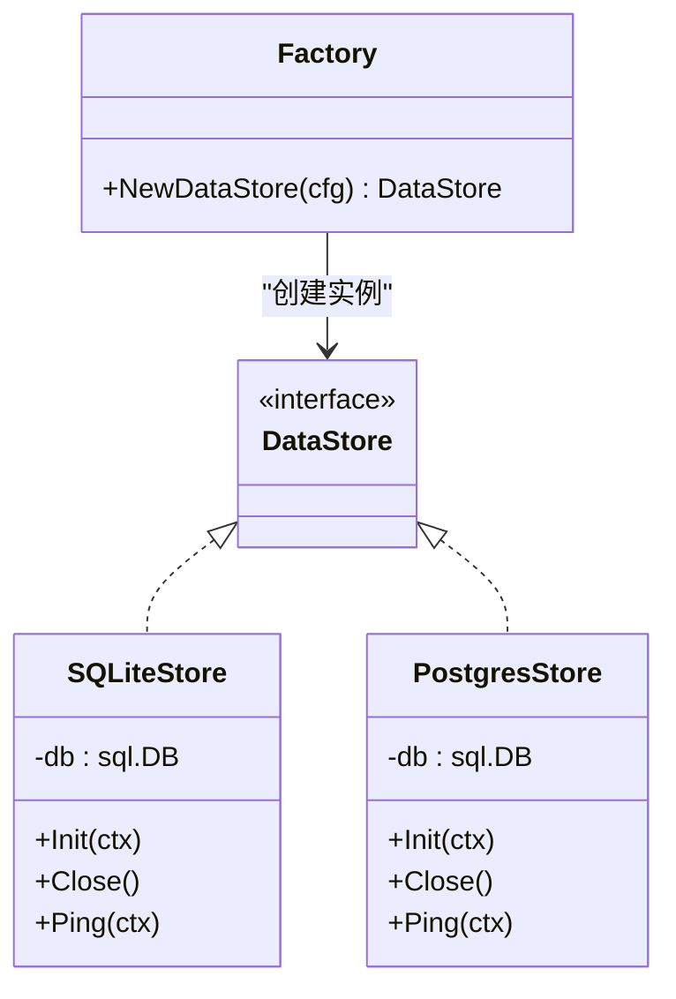
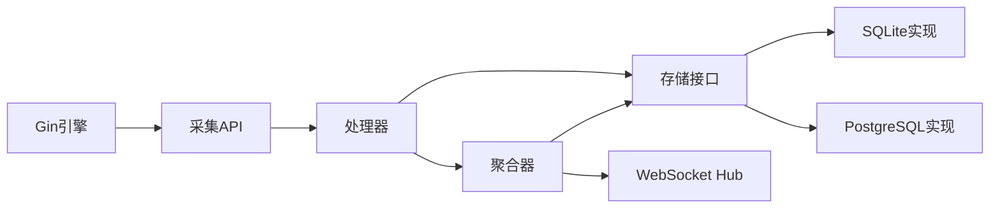

# 性能问题

<cite>
**本文引用的文件**
- [cmd/server/main.go](file://cmd/server/main.go)
- [internal/server/server.go](file://internal/server/server.go)
- [internal/collector/processor.go](file://internal/collector/processor.go)
- [internal/monitor/aggregator.go](file://internal/monitor/aggregator.go)
- [internal/monitor/websocket.go](file://internal/monitor/websocket.go)
- [internal/middleware/ratelimit.go](file://internal/middleware/ratelimit.go)
- [internal/middleware/logger.go](file://internal/middleware/logger.go)
- [internal/storage/factory.go](file://internal/storage/factory.go)
- [internal/storage/sqlite/store.go](file://internal/storage/sqlite/store.go)
- [internal/storage/postgres/store.go](file://internal/storage/postgres/store.go)
- [internal/storage/interface.go](file://internal/storage/interface.go)
- [internal/api/collector.go](file://internal/api/collector.go)
- [internal/api/health.go](file://internal/api/health.go)
- [internal/config/config.go](file://internal/config/config.go)
- [configs/config.yaml](file://configs/config.yaml)
</cite>

## 目录
1. [简介](#简介)
2. [项目结构](#项目结构)
3. [核心组件](#核心组件)
4. [架构总览](#架构总览)
5. [详细组件分析](#详细组件分析)
6. [依赖分析](#依赖分析)
7. [性能考量](#性能考量)
8. [故障排除指南](#故障排除指南)
9. [结论](#结论)
10. [附录](#附录)

## 简介
本指南聚焦于DataCollector在高并发与大数据量场景下的性能问题排查与优化。内容涵盖CPU使用率过高、内存泄漏、数据库查询慢、并发处理能力不足等常见瓶颈的识别与解决路径；提供性能监控工具使用方法、关键指标含义与阈值建议；给出数据吞吐优化、缓存策略与数据库索引优化方案；并总结高并发场景下的系统调优与资源配置建议。

## 项目结构
DataCollector采用Go语言与Gin框架构建后端，前端为Vue单页应用（SPA）。核心运行流程：启动时初始化日志、配置、存储、WebSocket Hub与统计聚合器；随后启动HTTP服务并注册路由；采集API负责接收数据、鉴权与校验，交由处理器落库并触发统计事件；聚合器周期性刷新统计并广播至WebSocket；健康检查接口用于系统健康度评估。

图表来源
- [cmd/server/main.go:25-129](file://cmd/server/main.go#L25-L129)
- [internal/server/server.go:54-87](file://internal/server/server.go#L54-L87)
- [internal/collector/processor.go:34-52](file://internal/collector/processor.go#L34-L52)
- [internal/monitor/aggregator.go:48-74](file://internal/monitor/aggregator.go#L48-L74)
- [internal/monitor/websocket.go:64-106](file://internal/monitor/websocket.go#L64-L106)
- [internal/storage/factory.go:11-21](file://internal/storage/factory.go#L11-L21)
- [internal/storage/sqlite/store.go:24-56](file://internal/storage/sqlite/store.go#L24-L56)
- [internal/storage/postgres/store.go:19-34](file://internal/storage/postgres/store.go#L19-L34)
- [internal/storage/interface.go:9-56](file://internal/storage/interface.go#L9-L56)
- [internal/config/config.go:197-214](file://internal/config/config.go#L197-L214)
- [configs/config.yaml:1-41](file://configs/config.yaml#L1-L41)

章节来源
- [cmd/server/main.go:25-129](file://cmd/server/main.go#L25-L129)
- [internal/server/server.go:54-87](file://internal/server/server.go#L54-L87)
- [configs/config.yaml:1-41](file://configs/config.yaml#L1-L41)

## 核心组件
- 启动与生命周期：负责日志初始化、配置加载、目录准备、数据库初始化与Ping、WebSocket Hub与聚合器启动、HTTP服务启动与优雅关闭。
- HTTP服务与中间件：Gin引擎、全局恢复、请求日志、CORS、Body大小限制、速率限制、JWT认证、SPA静态资源与回退。
- 数据采集API：单条与批量数据提交，鉴权（X-Data-Token）、Schema校验、构造记录并交由处理器。
- 数据处理器：写入数据记录表，发送统计事件到聚合器通道（非阻塞策略）。
- 统计聚合器：内存中累积计数，定时器周期性刷新到数据库，同时广播统计更新。
- 存储层：工厂模式按配置选择SQLite或PostgreSQL；SQLite启用WAL与busy_timeout；PostgreSQL设置连接池。
- 配置与健康检查：配置结构、环境变量覆盖、DSN生成；健康检查返回状态、版本、运行时长与数据库连通性。

章节来源
- [cmd/server/main.go:25-129](file://cmd/server/main.go#L25-L129)
- [internal/server/server.go:54-87](file://internal/server/server.go#L54-L87)
- [internal/api/collector.go:29-138](file://internal/api/collector.go#L29-L138)
- [internal/collector/processor.go:34-83](file://internal/collector/processor.go#L34-L83)
- [internal/monitor/aggregator.go:48-133](file://internal/monitor/aggregator.go#L48-L133)
- [internal/storage/factory.go:11-21](file://internal/storage/factory.go#L11-L21)
- [internal/storage/sqlite/store.go:39-53](file://internal/storage/sqlite/store.go#L39-L53)
- [internal/storage/postgres/store.go:29-32](file://internal/storage/postgres/store.go#L29-L32)
- [internal/config/config.go:197-214](file://internal/config/config.go#L197-L214)
- [internal/api/health.go:36-64](file://internal/api/health.go#L36-L64)

## 架构总览
下图展示从HTTP请求到数据入库与统计更新的完整链路，以及关键异步组件（聚合器、WebSocket Hub）的协作方式。

图表来源
- [internal/api/collector.go:29-138](file://internal/api/collector.go#L29-L138)
- [internal/collector/processor.go:34-83](file://internal/collector/processor.go#L34-L83)
- [internal/monitor/aggregator.go:48-133](file://internal/monitor/aggregator.go#L48-L133)
- [internal/monitor/websocket.go:108-127](file://internal/monitor/websocket.go#L108-L127)

## 详细组件分析

### 数据处理器与统计事件
- 处理单条记录：写入数据表后尝试向聚合器通道发送统计事件；若通道阻塞则丢弃，避免阻塞主处理流程。
- 批量处理：逐条处理并统计成功/失败数量，整体返回汇总结果。
- 统计事件类型：包含数据源ID，用于聚合器按源维度累加。

图表来源
- [internal/collector/processor.go:34-52](file://internal/collector/processor.go#L34-L52)

章节来源
- [internal/collector/processor.go:34-83](file://internal/collector/processor.go#L34-L83)

### 统计聚合器
- 内存计数器：以数据源ID为键，在内存中累加计数，避免频繁数据库写入。
- 定时刷新：每60秒扫描一次事件通道与定时器，将计数器复制并清空，逐条调用增量接口持久化。
- 广播通知：持久化完成后通过WebSocket Hub广播“stats_update”消息，前端可据此刷新。

图表来源
- [internal/monitor/aggregator.go:52-133](file://internal/monitor/aggregator.go#L52-L133)

章节来源
- [internal/monitor/aggregator.go:48-133](file://internal/monitor/aggregator.go#L48-L133)

### 速率限制中间件
- 滑动窗口算法：基于内存的时间戳列表，窗口长度为1分钟；清理过期记录的后台任务每分钟执行一次。
- 支持两种限流：按IP与按Data Token（X-Data-Token），超过阈值返回429。

图表来源
- [internal/middleware/ratelimit.go:68-98](file://internal/middleware/ratelimit.go#L68-L98)
- [internal/middleware/ratelimit.go:100-136](file://internal/middleware/ratelimit.go#L100-L136)

章节来源
- [internal/middleware/ratelimit.go:12-137](file://internal/middleware/ratelimit.go#L12-L137)

### 存储实现与连接池
- SQLite：启用WAL模式与busy_timeout，最大并发连接设为1（仅单写）。
- PostgreSQL：设置最大打开连接数与空闲连接数，适合多并发场景。
- 工厂：根据配置动态选择具体实现。

图表来源
- [internal/storage/interface.go:9-56](file://internal/storage/interface.go#L9-L56)
- [internal/storage/sqlite/store.go:17-56](file://internal/storage/sqlite/store.go#L17-L56)
- [internal/storage/postgres/store.go:14-34](file://internal/storage/postgres/store.go#L14-L34)
- [internal/storage/factory.go:11-21](file://internal/storage/factory.go#L11-L21)

章节来源
- [internal/storage/sqlite/store.go:39-53](file://internal/storage/sqlite/store.go#L39-L53)
- [internal/storage/postgres/store.go:29-32](file://internal/storage/postgres/store.go#L29-L32)
- [internal/storage/factory.go:11-21](file://internal/storage/factory.go#L11-L21)

### 请求日志与健康检查
- 请求日志中间件：记录trace_id、方法、路径、状态码、耗时、客户端IP与UA，并按状态分级日志。
- 健康检查：Ping数据库，返回系统状态、版本、运行时长与数据库连通性。

章节来源
- [internal/middleware/logger.go:11-67](file://internal/middleware/logger.go#L11-L67)
- [internal/api/health.go:36-64](file://internal/api/health.go#L36-L64)

## 依赖分析
- 组件耦合：HTTP服务依赖存储接口；采集API依赖处理器；处理器依赖存储接口与聚合器事件通道；聚合器依赖存储接口与WebSocket Hub；存储层通过工厂解耦具体实现。
- 并发点：处理器写入、聚合器定时刷新、WebSocket广播均使用goroutine；通道容量与非阻塞发送避免死锁。
- 外部依赖：Gin、gorilla/websocket、sqlite3驱动、pgx驱动。

图表来源
- [internal/server/server.go:54-87](file://internal/server/server.go#L54-L87)
- [internal/api/collector.go:29-138](file://internal/api/collector.go#L29-L138)
- [internal/collector/processor.go:34-83](file://internal/collector/processor.go#L34-L83)
- [internal/monitor/aggregator.go:48-133](file://internal/monitor/aggregator.go#L48-L133)
- [internal/storage/interface.go:9-56](file://internal/storage/interface.go#L9-L56)

## 性能考量
- CPU使用率过高
  - 可能原因：高频GC（大量小对象）、序列化/反序列化开销、限流与鉴权逻辑频繁执行。
  - 优化方向：减少不必要的JSON编解码、合并统计刷新频率、调整限流窗口与清理频率。
- 内存泄漏
  - 可能原因：WebSocket客户端未正确清理、通道阻塞导致goroutine堆积。
  - 优化方向：确保Hub在注销时关闭发送通道并清理连接；控制通道容量与背压。
- 数据库查询慢
  - 可能原因：SQLite单写限制、频繁逐条增量写入、缺少索引。
  - 优化方向：PostgreSQL连接池调优；批量写入策略；为常用查询列建立索引。
- 并发处理能力不足
  - 可能原因：通道容量过小、聚合器刷新过于频繁、存储实现并发限制。
  - 优化方向：增大聚合器事件通道容量、合理设置刷新周期、调整PostgreSQL连接池。

[本节为通用性能指导，无需列出章节来源]

## 故障排除指南

### 一、CPU使用率过高
- 现象特征
  - CPU使用率持续偏高，系统响应变慢，错误日志增多。
- 快速定位
  - 使用系统工具查看进程CPU占用，结合请求日志中间件的“latency”字段定位慢请求。
  - 观察聚合器刷新频率与通道积压情况，确认是否存在异常高频事件。
- 诊断步骤
  - 检查限流配置是否过低导致大量429，从而引发重试风暴。
  - 检查存储实现：SQLite在高并发下可能成为瓶颈，考虑切换PostgreSQL。
  - 检查聚合器刷新周期与通道容量，避免过多goroutine竞争。
- 修复建议
  - 调整限流阈值与清理周期，平衡安全与吞吐。
  - 切换到PostgreSQL并调优连接池参数。
  - 适当增大聚合器事件通道容量，降低丢弃概率。
  - 减少不必要的JSON序列化与深拷贝。

章节来源
- [internal/middleware/logger.go:11-67](file://internal/middleware/logger.go#L11-L67)
- [internal/middleware/ratelimit.go:12-137](file://internal/middleware/ratelimit.go#L12-L137)
- [internal/storage/postgres/store.go:29-32](file://internal/storage/postgres/store.go#L29-L32)
- [internal/monitor/aggregator.go:36-40](file://internal/monitor/aggregator.go#L36-L40)

### 二、内存泄漏
- 现象特征
  - RSS持续增长，GC频率升高，最终触发OOM。
- 快速定位
  - 对比WebSocket Hub的客户端数量与广播通道积压，确认是否存在未清理的连接。
  - 检查聚合器内存计数器是否异常增长且无法持久化。
- 诊断步骤
  - 在Hub广播通道满时会丢弃消息并记录告警，需关注此日志。
  - 检查客户端读写泵的读取超时与pong处理，避免僵尸连接。
- 修复建议
  - 确保客户端断开时及时从Hub注册表移除并关闭发送通道。
  - 控制广播通道容量，避免无限堆积。
  - 定期导出聚合器计数器进行离线审计。

章节来源
- [internal/monitor/websocket.go:64-106](file://internal/monitor/websocket.go#L64-L106)
- [internal/monitor/websocket.go:108-127](file://internal/monitor/websocket.go#L108-L127)
- [internal/monitor/aggregator.go:142-152](file://internal/monitor/aggregator.go#L142-L152)

### 三、数据库查询慢
- 现象特征
  - 响应延迟上升，数据库连接数接近上限，慢查询日志增多。
- 快速定位
  - 使用健康检查接口确认数据库连通性。
  - 检查存储实现：SQLite在高并发下写入受限；PostgreSQL连接池参数是否合理。
- 诊断步骤
  - SQLite：确认WAL模式与busy_timeout已启用；检查最大连接数是否为1。
  - PostgreSQL：确认最大打开/空闲连接数设置；观察连接池饱和情况。
  - 聚合器：逐条增量写入可能造成压力，考虑批量优化。
- 修复建议
  - 切换到PostgreSQL并根据并发调优连接池。
  - 优化统计刷新策略，减少逐条写入次数。
  - 为常用查询列建立索引（如数据源ID、日期、token哈希等）。

章节来源
- [internal/api/health.go:36-64](file://internal/api/health.go#L36-L64)
- [internal/storage/sqlite/store.go:39-53](file://internal/storage/sqlite/store.go#L39-L53)
- [internal/storage/postgres/store.go:29-32](file://internal/storage/postgres/store.go#L29-L32)
- [internal/monitor/aggregator.go:112-125](file://internal/monitor/aggregator.go#L112-L125)

### 四、并发处理能力不足
- 现象特征
  - 请求排队严重，队列长度增长，超时增多。
- 快速定位
  - 检查采集API的请求日志，观察429与错误分布。
  - 检查聚合器事件通道容量与刷新周期，确认是否存在阻塞。
- 诊断步骤
  - 限流中间件是否过于严格；按IP与按Token的阈值是否合理。
  - 处理器通道发送是否频繁被丢弃（非阻塞策略）。
- 修复建议
  - 调整限流阈值，区分IP与Token维度。
  - 增大聚合器事件通道容量，降低丢弃率。
  - 优化批量处理逻辑，提升单位时间处理量。

章节来源
- [internal/middleware/ratelimit.go:100-136](file://internal/middleware/ratelimit.go#L100-L136)
- [internal/collector/processor.go:42-49](file://internal/collector/processor.go#L42-L49)
- [internal/monitor/aggregator.go:36-40](file://internal/monitor/aggregator.go#L36-L40)

### 五、性能监控与关键指标
- 监控工具
  - 系统级：top/htop、iostat、netstat、strace（定位CPU/IO/网络热点）。
  - 应用级：Prometheus/Grafana（自定义指标）、pprof（CPU/内存剖析）。
- 关键指标与阈值建议
  - HTTP请求延迟（P50/P95/P99）：建议P95不超过数百毫秒，P99不超过1-2秒。
  - 错误率：4xx/5xx占比应低于阈值（如0.1%）。
  - 数据库连接数：保持在连接池上限的60%-80%以内。
  - 聚合器事件通道积压：维持在可控范围，避免持续增长。
  - WebSocket广播通道积压：避免满通道丢弃。
- 日志与追踪
  - 使用请求日志中间件的trace_id串联请求链路，便于定位慢点。
  - 健康检查接口可用于Kubernetes存活/就绪探针。

章节来源
- [internal/middleware/logger.go:11-67](file://internal/middleware/logger.go#L11-L67)
- [internal/api/health.go:36-64](file://internal/api/health.go#L36-L64)

### 六、数据处理吞吐优化
- 批量处理优先：优先使用批量接口，减少协议开销与事务次数。
- 减少序列化：尽量复用已解析的Schema配置，避免重复JSON解析。
- 并发模型：合理拆分处理器与聚合器的并发粒度，避免过度竞争。
- I/O优化：PostgreSQL连接池参数与SQLite WAL模式配合使用，满足不同并发需求。

章节来源
- [internal/api/collector.go:140-268](file://internal/api/collector.go#L140-L268)
- [internal/storage/postgres/store.go:29-32](file://internal/storage/postgres/store.go#L29-L32)
- [internal/storage/sqlite/store.go:39-53](file://internal/storage/sqlite/store.go#L39-L53)

### 七、缓存策略
- 应用层缓存
  - 缓存热点数据源配置与Token元数据，降低重复查询。
  - 缓存最近统计趋势，减少数据库压力。
- 存储层缓存
  - PostgreSQL可利用其内置缓存与连接池；SQLite在WAL模式下提升并发读取。
- 缓存一致性
  - 采用短 TTL 或失效策略，避免脏读；对关键写操作采用强一致路径。

[本节为通用优化建议，无需列出章节来源]

### 八、数据库索引优化方案
- 建议索引
  - data_records：source_id、created_at（按日期范围查询）。
  - data_tokens：hash（鉴权查找）、source_id（按源筛选）。
  - statistics：source_id+date（按源与日期统计）。
- 注意事项
  - 避免冗余索引；定期分析查询计划，剔除无效索引。
  - 批量导入前临时禁用非必要索引，导入后再重建。

[本节为通用优化建议，无需列出章节来源]

### 九、高并发场景调优与资源配置
- 资源配置
  - CPU：按峰值QPS与平均延迟目标估算核数，预留20%-30%余量。
  - 内存：保证JVM/Go堆空间与系统页缓存充足，避免频繁GC。
  - 磁盘：SSD优先；SQLite WAL模式下IOPS与延迟更佳。
  - 网络：带宽与连接数上限满足峰值并发。
- 调优要点
  - Gin模式：生产环境使用release模式。
  - 连接池：PostgreSQL连接池上限与工作负载匹配；SQLite保持单写。
  - 通道容量：根据峰值事件速率设定，避免丢弃。
  - 刷新周期：聚合器刷新周期与统计精度需求平衡。

章节来源
- [internal/server/server.go:56-57](file://internal/server/server.go#L56-L57)
- [internal/storage/postgres/store.go:29-32](file://internal/storage/postgres/store.go#L29-L32)
- [internal/storage/sqlite/store.go:39-53](file://internal/storage/sqlite/store.go#L39-L53)
- [internal/monitor/aggregator.go:54-62](file://internal/monitor/aggregator.go#L54-L62)

## 结论
DataCollector的性能瓶颈主要集中在存储实现并发限制、聚合器刷新策略与通道容量、限流与鉴权开销等方面。通过合理的数据库选型与索引、连接池调优、通道容量与刷新周期优化，以及完善的监控与日志追踪，可在高并发场景下显著提升系统吞吐与稳定性。建议在生产环境中优先采用PostgreSQL、启用WAL模式、合理设置连接池与通道容量，并持续观测关键指标以指导进一步优化。

[本节为总结性内容，无需列出章节来源]

## 附录

### A. 配置项与性能相关建议
- 服务器模式：生产环境使用release模式。
- 日志级别：生产环境建议info或更高，避免过多debug日志。
- 限流阈值：按业务场景与SLA调整IP与Token维度阈值。
- 数据库驱动：高并发场景优先PostgreSQL，SQLite适合轻量部署。

章节来源
- [configs/config.yaml:1-41](file://configs/config.yaml#L1-L41)
- [internal/config/config.go:197-214](file://internal/config/config.go#L197-L214)