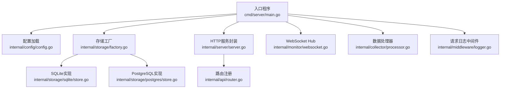
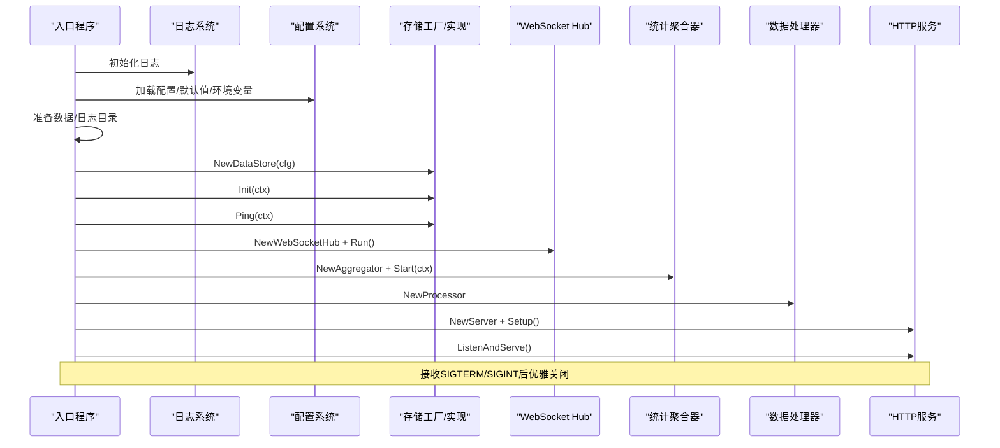
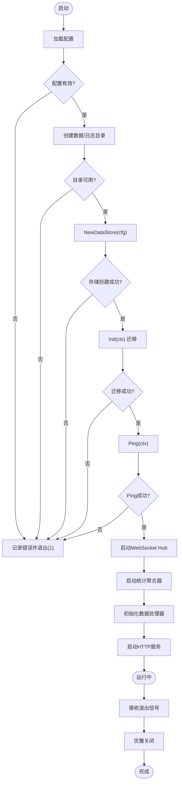
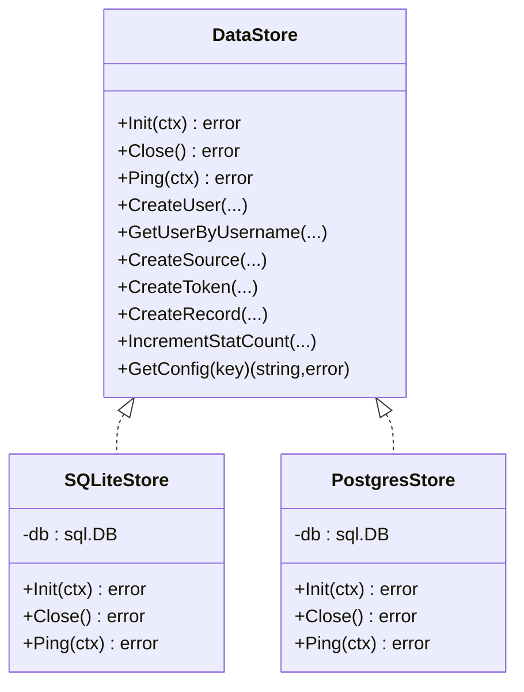
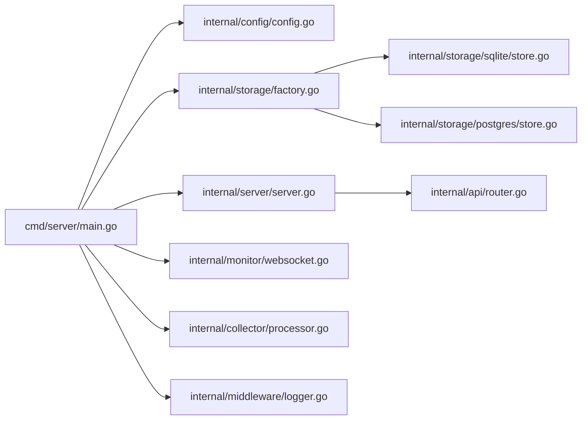

# 故障排除

<cite>
**本文引用的文件**
- [cmd/server/main.go](file://cmd/server/main.go)
- [configs/config.yaml](file://configs/config.yaml)
- [internal/config/config.go](file://internal/config/config.go)
- [internal/server/server.go](file://internal/server/server.go)
- [internal/storage/factory.go](file://internal/storage/factory.go)
- [internal/storage/interface.go](file://internal/storage/interface.go)
- [internal/storage/sqlite/store.go](file://internal/storage/sqlite/store.go)
- [internal/storage/postgres/store.go](file://internal/storage/postgres/store.go)
- [internal/monitor/websocket.go](file://internal/monitor/websocket.go)
- [internal/collector/processor.go](file://internal/collector/processor.go)
- [internal/middleware/logger.go](file://internal/middleware/logger.go)
- [internal/model/errors.go](file://internal/model/errors.go)
- [internal/api/health.go](file://internal/api/health.go)
- [internal/api/setup.go](file://internal/api/setup.go)
- [internal/api/router.go](file://internal/api/router.go)
</cite>

## 目录
1. [简介](#简介)
2. [项目结构](#项目结构)
3. [核心组件](#核心组件)
4. [架构总览](#架构总览)
5. [详细组件分析](#详细组件分析)
6. [依赖分析](#依赖分析)
7. [性能考虑](#性能考虑)
8. [故障排除指南](#故障排除指南)
9. [结论](#结论)
10. [附录](#附录)

## 简介
本指南面向DataCollector项目的运维与开发人员，提供系统化的故障排除方法与工具使用建议。内容涵盖启动失败、数据库连接问题、API调用错误、WebSocket连接问题、网络连通性、配置错误识别与修复、第三方服务集成问题以及紧急情况下的应急处理流程。文档同时给出日志分析技巧、错误定位方法、性能诊断与优化建议。

## 项目结构
DataCollector采用Go语言实现，后端通过Gin框架提供REST API与静态资源服务，内置SQLite/PostgreSQL存储，WebSocket用于实时统计推送，启动流程从入口程序完成配置加载、存储初始化、服务启动与优雅关闭。

**图示来源**
- [cmd/server/main.go:1-201](file://cmd/server/main.go#L1-L201)
- [internal/config/config.go:1-215](file://internal/config/config.go#L1-L215)
- [internal/storage/factory.go:1-22](file://internal/storage/factory.go#L1-L22)
- [internal/storage/sqlite/store.go:1-86](file://internal/storage/sqlite/store.go#L1-L86)
- [internal/storage/postgres/store.go:1-61](file://internal/storage/postgres/store.go#L1-L61)
- [internal/server/server.go:1-139](file://internal/server/server.go#L1-L139)
- [internal/api/router.go:1-116](file://internal/api/router.go#L1-L116)
- [internal/monitor/websocket.go:1-221](file://internal/monitor/websocket.go#L1-L221)
- [internal/collector/processor.go:1-84](file://internal/collector/processor.go#L1-L84)
- [internal/middleware/logger.go:1-67](file://internal/middleware/logger.go#L1-L67)

**章节来源**
- [cmd/server/main.go:1-201](file://cmd/server/main.go#L1-L201)
- [internal/server/server.go:1-139](file://internal/server/server.go#L1-L139)

## 核心组件
- 入口与生命周期：负责日志初始化、配置加载、目录准备、存储初始化与迁移、数据库Ping、WebSocket Hub与统计聚合器启动、HTTP服务启动与信号监听、优雅关闭。
- 配置系统：支持YAML配置文件与环境变量覆盖，提供默认值与DSN构造。
- 存储层：抽象接口与SQLite/PostgreSQL实现，统一Init/Ping/Close与业务操作。
- HTTP服务：Gin引擎配置、全局中间件、路由注册、SPA回退。
- WebSocket：Hub管理连接、广播统计、读写泵与心跳。
- 数据处理器：记录入库与统计事件发送，批处理与错误聚合。
- 日志中间件：结构化请求日志，含trace_id、状态码分级日志。

**章节来源**
- [cmd/server/main.go:25-129](file://cmd/server/main.go#L25-L129)
- [internal/config/config.go:82-195](file://internal/config/config.go#L82-L195)
- [internal/storage/interface.go:9-57](file://internal/storage/interface.go#L9-L57)
- [internal/storage/sqlite/store.go:24-85](file://internal/storage/sqlite/store.go#L24-L85)
- [internal/storage/postgres/store.go:20-60](file://internal/storage/postgres/store.go#L20-L60)
- [internal/server/server.go:54-87](file://internal/server/server.go#L54-L87)
- [internal/monitor/websocket.go:52-152](file://internal/monitor/websocket.go#L52-L152)
- [internal/collector/processor.go:22-52](file://internal/collector/processor.go#L22-L52)
- [internal/middleware/logger.go:11-66](file://internal/middleware/logger.go#L11-L66)

## 架构总览
DataCollector的启动与运行流程如下：

**图示来源**
- [cmd/server/main.go:25-129](file://cmd/server/main.go#L25-L129)
- [internal/storage/factory.go:11-21](file://internal/storage/factory.go#L11-L21)
- [internal/storage/sqlite/store.go:24-56](file://internal/storage/sqlite/store.go#L24-L56)
- [internal/storage/postgres/store.go:20-34](file://internal/storage/postgres/store.go#L20-L34)
- [internal/monitor/websocket.go:63-106](file://internal/monitor/websocket.go#L63-L106)
- [internal/server/server.go:54-87](file://internal/server/server.go#L54-L87)

## 详细组件分析

### 启动流程与错误定位
- 关键路径：配置加载失败、目录创建失败、存储初始化失败、数据库Ping失败、HTTP启动失败、优雅关闭失败。
- 建议：结合入口程序的日志输出与退出码，定位失败阶段；检查配置文件路径、权限与环境变量覆盖。

**图示来源**
- [cmd/server/main.go:25-129](file://cmd/server/main.go#L25-L129)

**章节来源**
- [cmd/server/main.go:25-129](file://cmd/server/main.go#L25-L129)

### 配置系统与环境变量覆盖
- 支持项：server.host/port/mode、tls.enabled/cert_file/key_file、database.driver/sqlite.path/postgres.*、jwt.secret、collector.max_body_size/rate_limit_per_token/rate_limit_per_ip/allowed_origins、log.level/format/output/file_path/max_size/max_age。
- 环境变量覆盖：DB_DRIVER、DB_SQLITE_PATH、DB_HOST/DB_PORT/DB_USER/DB_PASSWORD/DB_NAME、SERVER_PORT、JWT_SECRET、LOG_LEVEL。
- 默认值：DefaultConfig提供完整默认集。

**章节来源**
- [configs/config.yaml:1-41](file://configs/config.yaml#L1-L41)
- [internal/config/config.go:82-195](file://internal/config/config.go#L82-L195)
- [internal/config/config.go:100-146](file://internal/config/config.go#L100-L146)

### 存储层接口与实现
- 抽象接口：Init/Ping/Close与用户、数据源、Token、记录、统计、系统配置等操作。
- SQLite实现：单写连接、WAL模式、busy_timeout、迁移文件内嵌。
- PostgreSQL实现：连接池参数、迁移文件内嵌。

**图示来源**
- [internal/storage/interface.go:9-57](file://internal/storage/interface.go#L9-L57)
- [internal/storage/sqlite/store.go:17-85](file://internal/storage/sqlite/store.go#L17-L85)
- [internal/storage/postgres/store.go:14-60](file://internal/storage/postgres/store.go#L14-L60)

**章节来源**
- [internal/storage/interface.go:9-57](file://internal/storage/interface.go#L9-L57)
- [internal/storage/sqlite/store.go:24-85](file://internal/storage/sqlite/store.go#L24-L85)
- [internal/storage/postgres/store.go:20-60](file://internal/storage/postgres/store.go#L20-L60)

### HTTP服务与路由
- Gin模式：debug/release由配置控制。
- 全局中间件：恢复、请求日志、CORS、Body大小限制、字节错误处理、初始化检查中间件。
- 路由：健康检查、初始化状态/测试数据库/初始化、数据采集（IP与Token限流）、管理后台（登录/刷新/仪表盘/数据源/数据/导出）、重新初始化（JWT+admin）。
- SPA回退：未命中API则尝试静态资源，否则返回index.html。

**章节来源**
- [internal/server/server.go:54-139](file://internal/server/server.go#L54-L139)
- [internal/api/router.go:12-116](file://internal/api/router.go#L12-L116)

### WebSocket与统计推送
- Hub管理：注册/注销/广播通道、并发安全、日志记录。
- 客户端：writePump定期心跳、readPump读取与pong处理、超时与异常关闭。
- 广播：统计更新消息结构化，channel满时丢弃并告警。

**章节来源**
- [internal/monitor/websocket.go:52-221](file://internal/monitor/websocket.go#L52-L221)

### 数据处理与批处理
- 单条处理：写入记录表，非阻塞地发送统计事件。
- 批量处理：逐条处理，统计成功/失败数，全部失败时返回错误。

**章节来源**
- [internal/collector/processor.go:22-84](file://internal/collector/processor.go#L22-L84)

### 日志与错误码
- 请求日志中间件：trace_id、method/path/status/latency/client_ip/user_agent、错误集合、按状态码分级。
- 错误码：采集、认证、数据源、查询、运维、通用错误码与默认消息映射。

**章节来源**
- [internal/middleware/logger.go:11-66](file://internal/middleware/logger.go#L11-L66)
- [internal/model/errors.go:3-84](file://internal/model/errors.go#L3-L84)

## 依赖分析
- 入口程序依赖配置、存储工厂、HTTP服务、WebSocket Hub、统计聚合器、数据处理器。
- HTTP服务依赖API路由注册、认证中间件、限流中间件。
- 存储层通过工厂按驱动选择具体实现。
- WebSocket Hub与统计聚合器通过通道交互。

**图示来源**
- [cmd/server/main.go:15-21](file://cmd/server/main.go#L15-L21)
- [internal/server/server.go:12-20](file://internal/server/server.go#L12-L20)
- [internal/api/router.go:3-10](file://internal/api/router.go#L3-L10)
- [internal/storage/factory.go:3-9](file://internal/storage/factory.go#L3-L9)

**章节来源**
- [cmd/server/main.go:15-21](file://cmd/server/main.go#L15-L21)
- [internal/server/server.go:12-20](file://internal/server/server.go#L12-L20)
- [internal/api/router.go:3-10](file://internal/api/router.go#L3-L10)
- [internal/storage/factory.go:3-9](file://internal/storage/factory.go#L3-L9)

## 性能考虑
- 连接池与并发
  - PostgreSQL实现设置最大打开/空闲连接数，适合高并发场景。
  - SQLite实现采用单连接与WAL模式，减少锁竞争，适用于轻量场景。
- 限流与背压
  - API层对IP与Token分别限流，避免突发流量冲击。
  - WebSocket写通道默认容量，满载时丢弃消息，避免阻塞主流程。
- 处理器批处理
  - 批量写入时逐条处理，部分失败不影响整体流程，但需关注失败率。
- 日志级别与输出
  - 生产环境建议提升日志级别，降低I/O开销；文件输出配合轮转。

**章节来源**
- [internal/storage/postgres/store.go:29-33](file://internal/storage/postgres/store.go#L29-L33)
- [internal/storage/sqlite/store.go:39-53](file://internal/storage/sqlite/store.go#L39-L53)
- [internal/api/router.go:49-55](file://internal/api/router.go#L49-L55)
- [internal/monitor/websocket.go:142-152](file://internal/monitor/websocket.go#L142-L152)
- [internal/collector/processor.go:57-83](file://internal/collector/processor.go#L57-L83)
- [internal/middleware/logger.go:57-64](file://internal/middleware/logger.go#L57-L64)

## 故障排除指南

### 启动失败
- 症状
  - 进程立即退出或无法监听端口。
- 排查步骤
  - 检查配置文件路径与权限：确保配置文件存在且可读。
  - 检查环境变量覆盖是否导致端口冲突或驱动不匹配。
  - 查看启动日志中“failed to load configuration”“failed to create datastore”“HTTP server error”等关键错误。
  - 确认数据与日志目录存在且具备写权限。
- 常见原因
  - 配置文件损坏或字段缺失。
  - 端口被占用或防火墙拦截。
  - 存储驱动不支持或DSN错误。
- 修复建议
  - 使用默认配置进行最小化验证，逐步加入自定义项。
  - 临时将日志输出切换到文件，便于离线分析。

**章节来源**
- [cmd/server/main.go:30-40](file://cmd/server/main.go#L30-L40)
- [cmd/server/main.go:46-64](file://cmd/server/main.go#L46-L64)
- [cmd/server/main.go:95-101](file://cmd/server/main.go#L95-L101)
- [internal/config/config.go:82-98](file://internal/config/config.go#L82-L98)

### 数据库连接问题
- 症状
  - “failed to initialize database”“database ping failed”“failed to open sqlite database”“failed to open postgres database”。
- 排查步骤
  - 使用初始化测试接口POST /api/v1/setup/test-db验证PostgreSQL连接（SQLite无需测试）。
  - 检查DSN构造与凭据，确认主机、端口、用户名、密码、数据库名正确。
  - 对SQLite检查数据库文件路径与父目录权限。
  - 查看迁移脚本执行是否成功。
- 常见原因
  - PostgreSQL未启用相应驱动或网络不可达。
  - SQLite路径不存在或权限不足。
  - 连接池参数不当导致连接耗尽。
- 修复建议
  - 使用最小化配置先行验证，再逐步调整。
  - 调整PostgreSQL连接池参数或SQLite busy_timeout。
  - 在生产环境启用文件日志并开启轮转。

**章节来源**
- [cmd/server/main.go:54-64](file://cmd/server/main.go#L54-L64)
- [internal/api/setup.go:62-105](file://internal/api/setup.go#L62-L105)
- [internal/storage/sqlite/store.go:24-56](file://internal/storage/sqlite/store.go#L24-L56)
- [internal/storage/postgres/store.go:20-34](file://internal/storage/postgres/store.go#L20-L34)
- [internal/storage/sqlite/store.go:63-75](file://internal/storage/sqlite/store.go#L63-L75)
- [internal/storage/postgres/store.go:37-50](file://internal/storage/postgres/store.go#L37-L50)

### API调用错误
- 症状
  - 4xx/5xx响应，错误码来自错误码常量定义。
- 排查步骤
  - 使用健康检查GET /api/v1/health快速判断数据库连通性。
  - 查看请求日志中间件输出的trace_id，定位具体请求链路。
  - 分类错误码：无效Token、速率超限、参数缺失、内部错误等。
- 常见原因
  - 缺少或错误的Data Token。
  - 超过IP或Token限流阈值。
  - 参数校验失败或Body过大。
- 修复建议
  - 为采集端配置有效Token并定期轮换。
  - 调整collector.rate_limit_per_token与rate_limit_per_ip。
  - 控制请求体大小，避免超过max_body_size。

**章节来源**
- [internal/api/health.go:36-64](file://internal/api/health.go#L36-L64)
- [internal/middleware/logger.go:11-66](file://internal/middleware/logger.go#L11-L66)
- [internal/model/errors.go:3-84](file://internal/model/errors.go#L3-L84)
- [internal/api/router.go:49-55](file://internal/api/router.go#L49-L55)

### WebSocket连接问题
- 症状
  - 连接升级失败、连接异常关闭、消息丢失。
- 排查步骤
  - 关注“websocket upgrade failed”“websocket unexpected close”等日志。
  - 检查客户端是否遵循ping/pong协议，服务端心跳周期与读超时。
  - 观察广播通道是否溢出，导致消息丢弃。
- 常见原因
  - 客户端网络不稳定或代理中断。
  - 服务端写通道缓冲区不足。
  - 客户端未及时响应ping或长时间无活动。
- 修复建议
  - 增大客户端读超时与重试策略。
  - 调整写通道容量或优化消息发送节奏。
  - 在高负载场景下评估并发连接数与资源限制。

**章节来源**
- [internal/monitor/websocket.go:134-152](file://internal/monitor/websocket.go#L134-L152)
- [internal/monitor/websocket.go:197-220](file://internal/monitor/websocket.go#L197-L220)
- [internal/monitor/websocket.go:127-132](file://internal/monitor/websocket.go#L127-L132)

### 网络连接问题
- 症状
  - 无法访问API或WebSocket，健康检查返回不可用。
- 排查步骤
  - 从宿主机器测试端口连通性（telnet/nc）。
  - 检查防火墙、安全组与容器网络策略。
  - 使用curl或浏览器访问健康检查端点，观察响应。
- 修复建议
  - 明确暴露端口与绑定地址，避免仅监听本地回环。
  - 在容器编排环境中检查服务发现与DNS解析。

**章节来源**
- [internal/api/health.go:36-64](file://internal/api/health.go#L36-L64)
- [internal/server/server.go:80-87](file://internal/server/server.go#L80-L87)

### 配置错误识别与修复
- 识别方法
  - 使用初始化状态检查GET /api/v1/setup/status判断系统是否已初始化。
  - 使用测试数据库接口POST /api/v1/setup/test-db验证数据库连通性。
  - 通过环境变量覆盖快速验证配置项生效。
- 修复方法
  - 修正config.yaml中的字段类型与取值范围。
  - 通过环境变量临时覆盖问题项，定位根因后再固化到配置文件。
  - 初始化完成后，避免随意修改关键配置（如数据库驱动、端口）。

**章节来源**
- [internal/api/setup.go:40-50](file://internal/api/setup.go#L40-L50)
- [internal/api/setup.go:62-105](file://internal/api/setup.go#L62-L105)
- [internal/config/config.go:148-195](file://internal/config/config.go#L148-L195)

### 第三方服务集成问题
- PostgreSQL驱动
  - 确保已安装pgx驱动并正确加载。
  - 检查连接串参数与SSL模式配置。
- SQLite
  - 确保数据库文件所在目录存在且具备写权限。
  - 关注WAL模式与busy_timeout设置。
- 前端静态资源
  - 确保构建产物已注入embed.FS并在NoRoute回退中正确提供。

**章节来源**
- [internal/storage/postgres/store.go:24-27](file://internal/storage/postgres/store.go#L24-L27)
- [internal/storage/sqlite/store.go:28-31](file://internal/storage/sqlite/store.go#L28-L31)
- [internal/server/server.go:94-138](file://internal/server/server.go#L94-L138)

### 紧急情况应急处理流程
- 快速止损
  - 立即停止新流量进入，保留关键监控通道。
  - 降级日志级别，减少I/O压力。
- 诊断与恢复
  - 优先恢复数据库连通性（检查DSN、凭据、网络）。
  - 重启HTTP服务，观察启动日志与健康检查。
  - 回滚最近一次变更的配置或版本。
- 事后复盘
  - 通过trace_id串联请求链路，定位异常峰值与慢请求。
  - 检查WebSocket与统计聚合器的资源占用与队列长度。

**章节来源**
- [cmd/server/main.go:103-129](file://cmd/server/main.go#L103-L129)
- [internal/middleware/logger.go:11-66](file://internal/middleware/logger.go#L11-L66)

## 结论
通过结构化的启动流程、完善的配置系统、清晰的存储抽象与中间件体系，DataCollector提供了可靠的可观测性与可维护性。故障排除应遵循“最小化验证—定位根因—修复—回归”的闭环流程，结合日志与错误码进行快速定位，并在生产环境中持续优化连接池、限流与日志策略。

## 附录

### 常用命令与端点
- 健康检查：GET /api/v1/health
- 初始化状态：GET /api/v1/setup/status
- 测试数据库：POST /api/v1/setup/test-db
- 初始化系统：POST /api/v1/setup/init
- 重新初始化：POST /api/v1/setup/reinit（需JWT与admin）

**章节来源**
- [internal/api/health.go:36-64](file://internal/api/health.go#L36-L64)
- [internal/api/setup.go:40-105](file://internal/api/setup.go#L40-L105)
- [internal/api/router.go:36-114](file://internal/api/router.go#L36-L114)