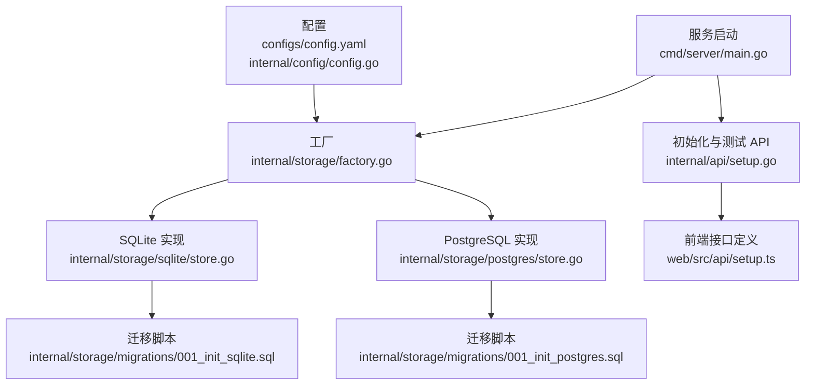
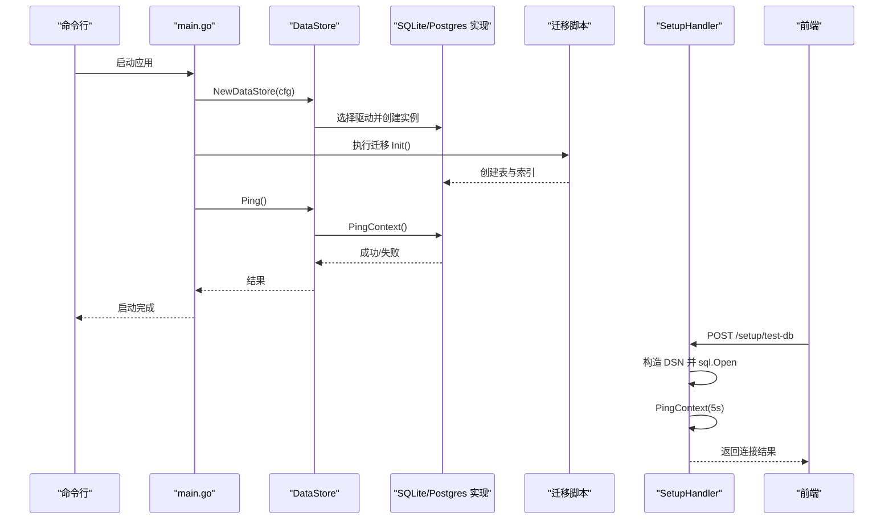
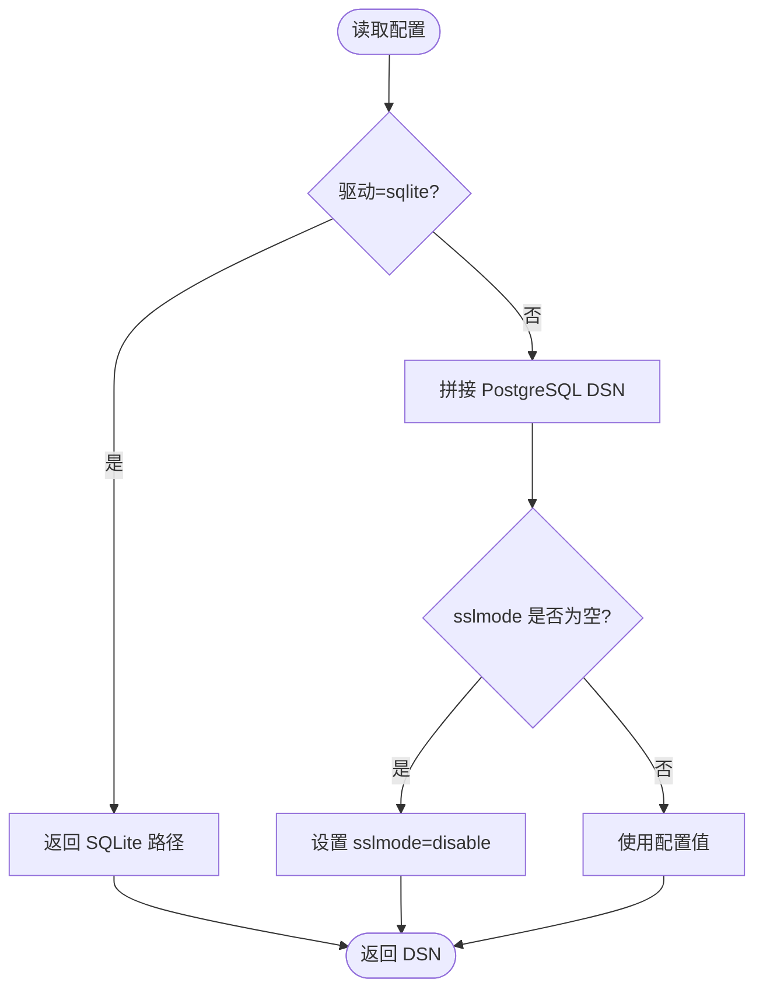
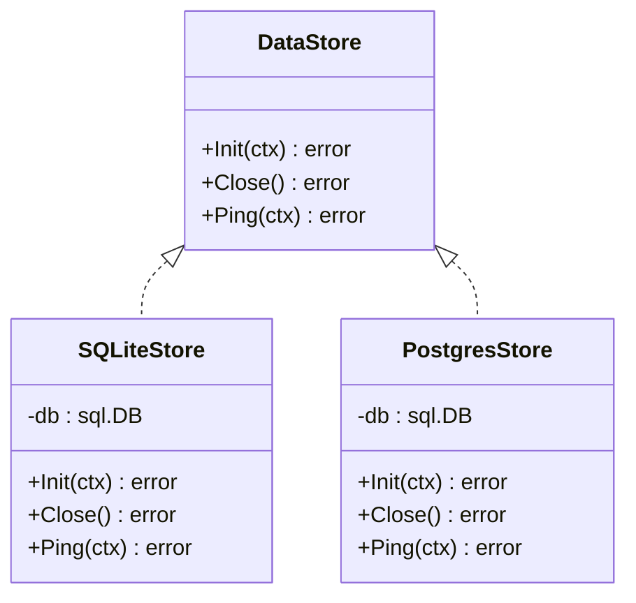
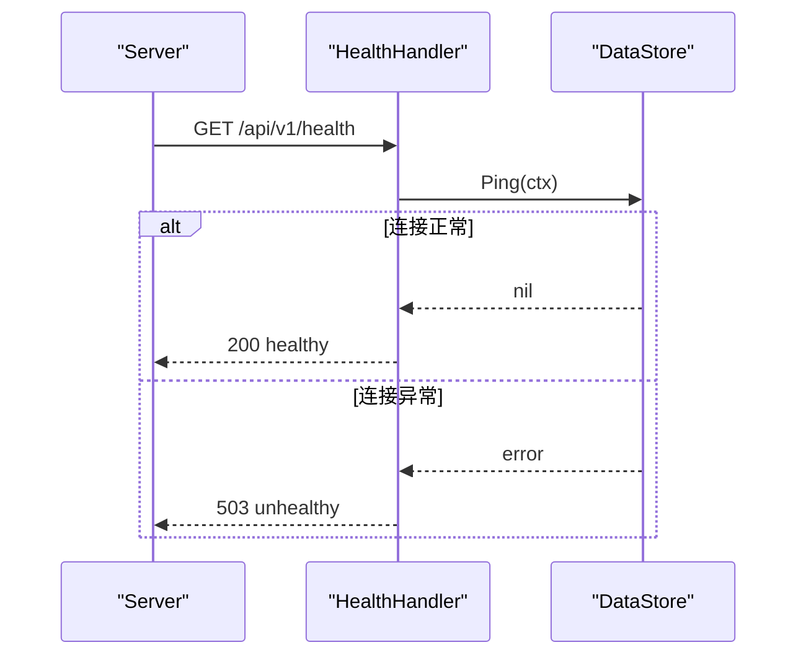
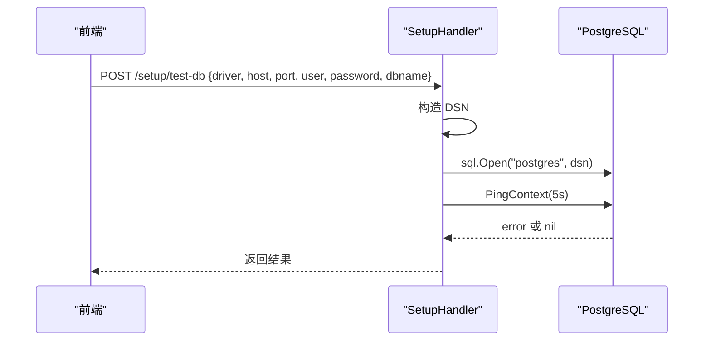
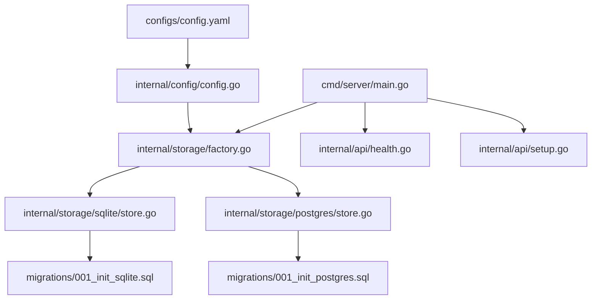

# 数据库连接问题

<cite>
**本文引用的文件**
- [config.yaml](file://configs/config.yaml)
- [config.go](file://internal/config/config.go)
- [factory.go](file://internal/storage/factory.go)
- [interface.go](file://internal/storage/interface.go)
- [store.go (SQLite)](file://internal/storage/sqlite/store.go)
- [store.go (PostgreSQL)](file://internal/storage/postgres/store.go)
- [001_init_sqlite.sql](file://internal/storage/migrations/001_init_sqlite.sql)
- [001_init_postgres.sql](file://internal/storage/migrations/001_init_postgres.sql)
- [main.go](file://cmd/server/main.go)
- [server.go](file://internal/server/server.go)
- [setup.go](file://internal/api/setup.go)
- [health.go](file://internal/api/health.go)
- [errors.go](file://internal/model/errors.go)
- [setup.ts](file://web/src/api/setup.ts)
- [api.md](file://web/src/docs/api.md)
</cite>

## 目录
1. [简介](#简介)
2. [项目结构](#项目结构)
3. [核心组件](#核心组件)
4. [架构总览](#架构总览)
5. [详细组件分析](#详细组件分析)
6. [依赖分析](#依赖分析)
7. [性能考虑](#性能考虑)
8. [故障排除指南](#故障排除指南)
9. [结论](#结论)
10. [附录](#附录)

## 简介
本指南聚焦于 DataCollector 的数据库连接问题与故障排除，覆盖 SQLite 与 PostgreSQL 两种存储后端在连接字符串配置、数据库文件权限、网络超时、认证失败等方面的常见问题；同时提供连接池配置诊断、迁移失败排查、连接测试工具与方法，以及数据库性能识别与优化建议。

## 项目结构
DataCollector 的数据库相关能力由以下层次构成：
- 配置层：从 YAML 文件与环境变量加载数据库配置，生成 DSN。
- 工厂层：依据配置选择具体存储实现（SQLite 或 PostgreSQL）。
- 存储层：实现统一接口，封装连接池、迁移与健康检查。
- 服务层：启动时执行迁移与 Ping 检测，确保数据库可用。
- API 层：提供“测试数据库连接”“系统初始化”等接口，便于前端与运维使用。
- 前端：提供连接测试与初始化流程的 UI 与 API 调用。

图表来源
- [config.yaml:11-22](file://configs/config.yaml#L11-L22)
- [config.go:197-215](file://internal/config/config.go#L197-L215)
- [factory.go:11-21](file://internal/storage/factory.go#L11-L21)
- [store.go (SQLite):24-56](file://internal/storage/sqlite/store.go#L24-L56)
- [store.go (PostgreSQL):20-34](file://internal/storage/postgres/store.go#L20-L34)
- [001_init_sqlite.sql:1-97](file://internal/storage/migrations/001_init_sqlite.sql#L1-L97)
- [001_init_postgres.sql:1-91](file://internal/storage/migrations/001_init_postgres.sql#L1-L91)
- [main.go:47-64](file://cmd/server/main.go#L47-L64)
- [setup.go:62-105](file://internal/api/setup.go#L62-L105)
- [setup.ts:40-42](file://web/src/api/setup.ts#L40-L42)

章节来源
- [config.yaml:11-22](file://configs/config.yaml#L11-L22)
- [config.go:197-215](file://internal/config/config.go#L197-L215)
- [factory.go:11-21](file://internal/storage/factory.go#L11-L21)
- [store.go (SQLite):24-56](file://internal/storage/sqlite/store.go#L24-L56)
- [store.go (PostgreSQL):20-34](file://internal/storage/postgres/store.go#L20-L34)
- [001_init_sqlite.sql:1-97](file://internal/storage/migrations/001_init_sqlite.sql#L1-L97)
- [001_init_postgres.sql:1-91](file://internal/storage/migrations/001_init_postgres.sql#L1-L91)
- [main.go:47-64](file://cmd/server/main.go#L47-L64)
- [setup.go:62-105](file://internal/api/setup.go#L62-L105)
- [setup.ts:40-42](file://web/src/api/setup.ts#L40-L42)

## 核心组件
- 配置与 DSN 生成
  - 支持通过 YAML 配置数据库驱动与参数，支持环境变量覆盖。
  - DSN 生成逻辑区分 SQLite（文件路径）与 PostgreSQL（host/port/user/password/dbname/sslmode）。
- 工厂与存储实现
  - 工厂根据驱动选择具体实现。
  - SQLite 实现：单写连接、WAL 模式、busy_timeout；PostgreSQL 实现：连接池大小与 pgx 驱动。
- 迁移与健康检查
  - 启动时执行迁移；Ping 检测数据库连通性。
- API 与前端
  - 提供“测试数据库连接”“系统初始化”接口；前端提供测试与初始化流程。

章节来源
- [config.go:100-146](file://internal/config/config.go#L100-L146)
- [config.go:148-195](file://internal/config/config.go#L148-L195)
- [config.go:197-215](file://internal/config/config.go#L197-L215)
- [factory.go:11-21](file://internal/storage/factory.go#L11-L21)
- [store.go (SQLite):24-56](file://internal/storage/sqlite/store.go#L24-L56)
- [store.go (PostgreSQL):20-34](file://internal/storage/postgres/store.go#L20-L34)
- [main.go:53-64](file://cmd/server/main.go#L53-L64)
- [setup.go:62-105](file://internal/api/setup.go#L62-L105)
- [setup.ts:40-42](file://web/src/api/setup.ts#L40-L42)

## 架构总览
下图展示启动阶段的数据库连接与迁移流程，以及健康检查与初始化 API 的交互。

图表来源
- [main.go:47-64](file://cmd/server/main.go#L47-L64)
- [factory.go:11-21](file://internal/storage/factory.go#L11-L21)
- [store.go (SQLite):58-85](file://internal/storage/sqlite/store.go#L58-L85)
- [store.go (PostgreSQL):36-61](file://internal/storage/postgres/store.go#L36-L61)
- [001_init_sqlite.sql:1-97](file://internal/storage/migrations/001_init_sqlite.sql#L1-L97)
- [001_init_postgres.sql:1-91](file://internal/storage/migrations/001_init_postgres.sql#L1-L91)
- [setup.go:62-105](file://internal/api/setup.go#L62-L105)

## 详细组件分析

### 配置与 DSN 生成
- 配置项
  - 驱动：sqlite 或 postgres。
  - SQLite：path。
  - PostgreSQL：host、port、user、password、dbname、sslmode。
- 环境变量覆盖：DB_DRIVER、DB_SQLITE_PATH、DB_HOST、DB_PORT、DB_USER、DB_PASSWORD、DB_NAME、SERVER_PORT。
- DSN 生成：根据驱动拼接连接串，PostgreSQL 默认 sslmode=disable。

图表来源
- [config.go:197-215](file://internal/config/config.go#L197-L215)
- [config.go:148-195](file://internal/config/config.go#L148-L195)
- [config.yaml:11-22](file://configs/config.yaml#L11-L22)

章节来源
- [config.go:197-215](file://internal/config/config.go#L197-L215)
- [config.go:148-195](file://internal/config/config.go#L148-L195)
- [config.yaml:11-22](file://configs/config.yaml#L11-L22)

### 工厂与存储实现
- 工厂
  - 根据配置驱动选择 SQLite 或 PostgreSQL 实现。
- SQLite 实现
  - 自动创建目录、打开连接、启用 WAL、设置 busy_timeout。
  - 连接池：最大并发与空闲均为 1（单写）。
- PostgreSQL 实现
  - 使用 pgx 驱动，连接池：最大并发 25，空闲 5。

图表来源
- [interface.go:9-56](file://internal/storage/interface.go#L9-L56)
- [store.go (SQLite):17-56](file://internal/storage/sqlite/store.go#L17-L56)
- [store.go (PostgreSQL):14-34](file://internal/storage/postgres/store.go#L14-L34)

章节来源
- [factory.go:11-21](file://internal/storage/factory.go#L11-L21)
- [store.go (SQLite):24-56](file://internal/storage/sqlite/store.go#L24-L56)
- [store.go (PostgreSQL):20-34](file://internal/storage/postgres/store.go#L20-L34)

### 迁移与健康检查
- 迁移
  - 启动时读取嵌入的 SQL 文件并执行，创建表与索引。
  - SQLite 与 PostgreSQL 的初始化脚本分别位于对应目录。
- 健康检查
  - /api/v1/health 调用存储层 Ping，失败返回 503。
  - /api/v1/setup/status 查询系统初始化状态。

图表来源
- [health.go:36-64](file://internal/api/health.go#L36-L64)
- [store.go (SQLite):82-85](file://internal/storage/sqlite/store.go#L82-L85)
- [store.go (PostgreSQL):57-61](file://internal/storage/postgres/store.go#L57-L61)

章节来源
- [001_init_sqlite.sql:1-97](file://internal/storage/migrations/001_init_sqlite.sql#L1-L97)
- [001_init_postgres.sql:1-91](file://internal/storage/migrations/001_init_postgres.sql#L1-L91)
- [health.go:36-64](file://internal/api/health.go#L36-L64)

### 初始化与连接测试 API
- /api/v1/setup/test-db
  - 仅支持 PostgreSQL（SQLite 不需要测试）。
  - 构造 DSN 并尝试 sql.Open 与 PingContext(5s)。
- /api/v1/setup/init
  - 校验未初始化后，按请求更新配置并创建管理员用户。
- 前端对接
  - web/src/api/setup.ts 提供 testDatabase 与 initialize 方法。

图表来源
- [setup.go:62-105](file://internal/api/setup.go#L62-L105)
- [setup.ts:40-42](file://web/src/api/setup.ts#L40-L42)

章节来源
- [setup.go:62-105](file://internal/api/setup.go#L62-L105)
- [setup.ts:40-42](file://web/src/api/setup.ts#L40-L42)

## 依赖分析
- 配置依赖
  - YAML 配置与环境变量覆盖共同决定 DSN。
- 存储实现依赖
  - SQLite：go-sqlite3；PostgreSQL：pgx stdlib。
- 运行时依赖
  - 启动阶段必须成功执行 Init 与 Ping；否则退出。

图表来源
- [config.yaml:11-22](file://configs/config.yaml#L11-L22)
- [config.go:197-215](file://internal/config/config.go#L197-L215)
- [factory.go:11-21](file://internal/storage/factory.go#L11-L21)
- [store.go (SQLite):11-15](file://internal/storage/sqlite/store.go#L11-L15)
- [store.go (PostgreSQL):8](file://internal/storage/postgres/store.go#L8)
- [001_init_sqlite.sql:1-97](file://internal/storage/migrations/001_init_sqlite.sql#L1-L97)
- [001_init_postgres.sql:1-91](file://internal/storage/migrations/001_init_postgres.sql#L1-L91)
- [main.go:47-64](file://cmd/server/main.go#L47-L64)
- [health.go:36-64](file://internal/api/health.go#L36-L64)
- [setup.go:62-105](file://internal/api/setup.go#L62-L105)

章节来源
- [config.go:197-215](file://internal/config/config.go#L197-L215)
- [factory.go:11-21](file://internal/storage/factory.go#L11-L21)
- [store.go (SQLite):11-15](file://internal/storage/sqlite/store.go#L11-L15)
- [store.go (PostgreSQL):8](file://internal/storage/postgres/store.go#L8)
- [main.go:47-64](file://cmd/server/main.go#L47-L64)
- [health.go:36-64](file://internal/api/health.go#L36-L64)
- [setup.go:62-105](file://internal/api/setup.go#L62-L105)

## 性能考虑
- 连接池
  - SQLite：最大并发与空闲均为 1，避免并发写冲突。
  - PostgreSQL：最大并发 25，空闲 5，适合高并发场景。
- WAL 与 busy_timeout
  - SQLite 启用 WAL 并设置 busy_timeout，减少锁等待。
- 索引
  - 初始化脚本包含多处索引，建议结合查询模式评估是否需要补充索引。
- 健康检查
  - /api/v1/health 会触发 Ping，频繁调用可能影响性能，建议合理间隔。

章节来源
- [store.go (SQLite):39-53](file://internal/storage/sqlite/store.go#L39-L53)
- [store.go (PostgreSQL):29-32](file://internal/storage/postgres/store.go#L29-L32)
- [001_init_sqlite.sql:77-97](file://internal/storage/migrations/001_init_sqlite.sql#L77-L97)
- [001_init_postgres.sql:71-91](file://internal/storage/migrations/001_init_postgres.sql#L71-L91)
- [health.go:36-64](file://internal/api/health.go#L36-L64)

## 故障排除指南

### 一、连接字符串配置错误
- 症状
  - 启动即报“failed to open sqlite database”或“failed to open postgres database”。
- 排查要点
  - 确认驱动与参数：sqlite.path、postgres.host/port/user/password/dbname/sslmode。
  - 环境变量覆盖是否生效（DB_DRIVER、DB_SQLITE_PATH、DB_HOST、DB_PORT、DB_USER、DB_PASSWORD、DB_NAME）。
  - DSN 生成逻辑是否正确（PostgreSQL 默认 sslmode=disable）。
- 解决方案
  - 修正配置文件或环境变量；确保参数齐全且类型正确。

章节来源
- [config.go:197-215](file://internal/config/config.go#L197-L215)
- [config.go:148-195](file://internal/config/config.go#L148-L195)
- [store.go (SQLite):34-37](file://internal/storage/sqlite/store.go#L34-L37)
- [store.go (PostgreSQL):24-27](file://internal/storage/postgres/store.go#L24-L27)

### 二、数据库文件权限问题（SQLite）
- 症状
  - “failed to create database directory”“failed to open sqlite database”。
- 排查要点
  - 确认 SQLite 路径所在目录存在且可写；程序启动时会自动创建 ./data。
  - 确认进程对数据库文件有读写权限。
- 解决方案
  - 以具备写权限的用户运行；调整目录权限或使用绝对路径。

章节来源
- [store.go (SQLite):27-31](file://internal/storage/sqlite/store.go#L27-L31)
- [main.go:171-184](file://cmd/server/main.go#L171-L184)

### 三、网络连接超时（PostgreSQL）
- 症状
  - “connection failed”“context deadline exceeded”。
- 排查要点
  - 使用 /api/v1/setup/test-db 进行连通性测试；确认 host/port 可达。
  - 检查防火墙、安全组、容器网络（Docker/docker-compose）。
  - 调整 sslmode（生产环境建议开启）。
- 解决方案
  - 修复网络策略；缩短连接超时；确保 DNS 解析正常。

章节来源
- [setup.go:62-105](file://internal/api/setup.go#L62-L105)
- [setup.ts:40-42](file://web/src/api/setup.ts#L40-L42)

### 四、认证失败（PostgreSQL）
- 症状
  - “authentication failed”“pq: password authentication failed”。
- 排查要点
  - 确认 user/password 正确；检查数据库用户是否存在。
  - 若使用 md5 或 SCRAM，请确保客户端与服务器版本兼容。
- 解决方案
  - 修改密码或创建用户；核对 pg_hba.conf 配置。

章节来源
- [setup.go:88-102](file://internal/api/setup.go#L88-L102)

### 五、数据库连接池配置问题
- 症状
  - “too many connections”“connection refused”“context deadline exceeded”。
- 排查要点
  - SQLite：最大并发与空闲均为 1，避免并发写。
  - PostgreSQL：最大并发 25，空闲 5；若业务高并发，需评估是否增加。
- 解决方案
  - 调整连接池参数；优化查询与事务；使用连接池监控工具。

章节来源
- [store.go (SQLite):40-41](file://internal/storage/sqlite/store.go#L40-L41)
- [store.go (PostgreSQL):30-31](file://internal/storage/postgres/store.go#L30-L31)

### 六、数据库迁移失败
- 症状
  - “failed to execute migration”。
- 排查要点
  - 检查迁移脚本是否可读（嵌入文件）。
  - 确认数据库用户具备 DDL 权限。
  - 查看日志中具体错误（如重复表/索引）。
- 解决方案
  - 修正权限；回滚并重试；必要时手动清理残留对象后重试。

章节来源
- [store.go (SQLite):64-72](file://internal/storage/sqlite/store.go#L64-L72)
- [store.go (PostgreSQL):39-47](file://internal/storage/postgres/store.go#L39-L47)

### 七、连接测试工具与方法
- 后端接口
  - /api/v1/setup/test-db：传入 driver/host/port/user/password/dbname，返回连接结果。
- 前端调用
  - web/src/api/setup.ts 提供 testDatabase 方法。
- 健康检查
  - /api/v1/health：返回数据库连接状态（connected/disconnected）。

章节来源
- [setup.go:62-105](file://internal/api/setup.go#L62-L105)
- [setup.ts:40-42](file://web/src/api/setup.ts#L40-L42)
- [health.go:36-64](file://internal/api/health.go#L36-L64)
- [api.md:78-102](file://web/src/docs/api.md#L78-L102)

### 八、数据库性能问题识别与优化
- 识别
  - 观察 /api/v1/health 频繁失败或延迟。
  - 慢查询日志与指标（PostgreSQL：pg_stat_statements；SQLite：PRAGMA wal_checkpoint）。
- 优化
  - 合理设置连接池；为热点查询添加索引；拆分大事务；定期分析统计信息。
  - SQLite：保持 WAL 模式与合理的 busy_timeout；避免长时间长事务。
  - PostgreSQL：监控连接数与等待事件；调整 shared_buffers、work_mem 等参数。

章节来源
- [health.go:36-64](file://internal/api/health.go#L36-L64)
- [001_init_sqlite.sql:77-97](file://internal/storage/migrations/001_init_sqlite.sql#L77-L97)
- [001_init_postgres.sql:71-91](file://internal/storage/migrations/001_init_postgres.sql#L71-L91)

## 结论
- SQLite 与 PostgreSQL 在连接与迁移方面各有特性：前者强调单写与 WAL，后者强调连接池与并发。
- 通过配置、环境变量与初始化 API 可快速定位与修复连接问题。
- 建议在生产环境启用健康检查与监控，持续观察连接池与迁移状态，及时发现并解决问题。

## 附录
- 常用错误码参考（系统运维）
  - CodeSystemUnhealthy、CodeInitFailed、CodeAlreadyInitialized 等。
- 健康检查响应字段
  - status、version、uptime、database（connected/disconnected）。

章节来源
- [errors.go:29-38](file://internal/model/errors.go#L29-L38)
- [health.go:28-34](file://internal/api/health.go#L28-L34)