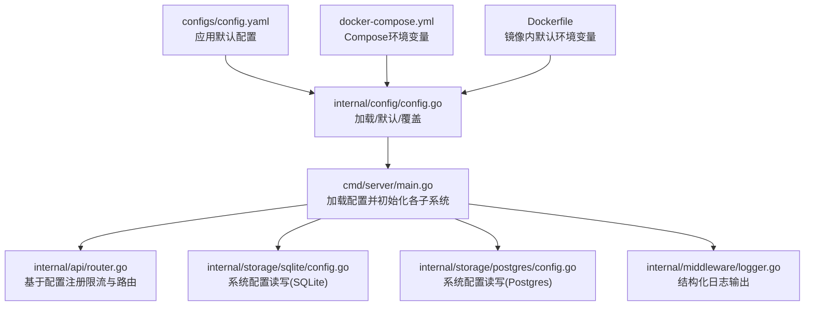
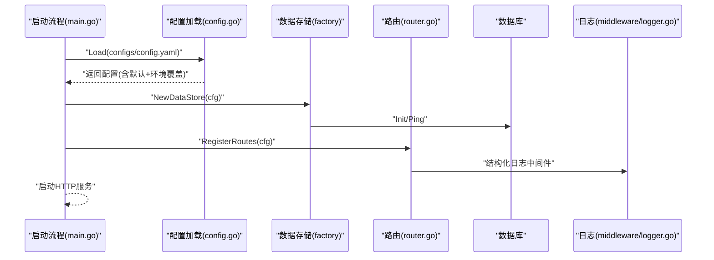
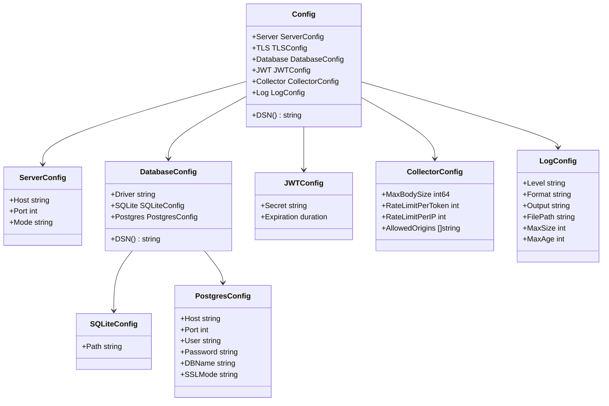
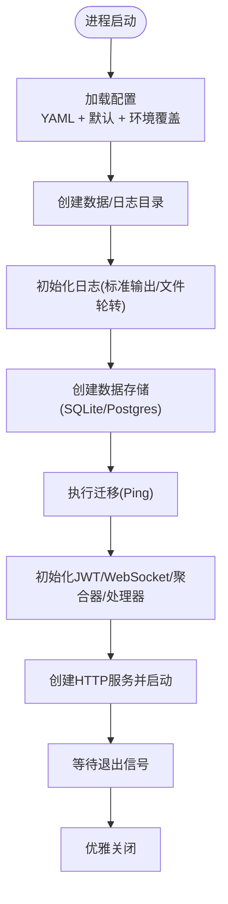
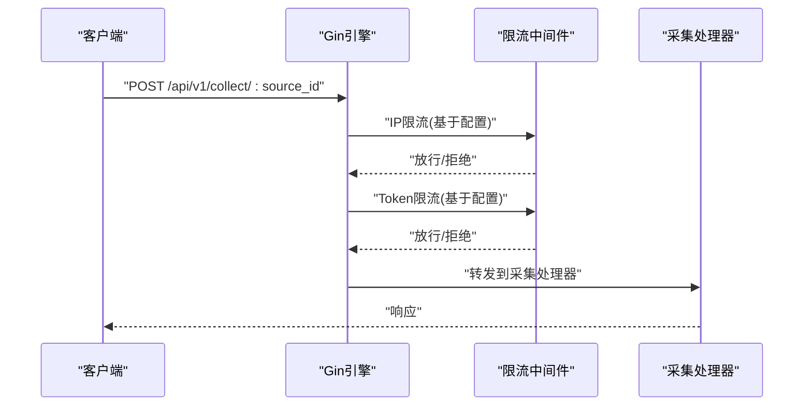
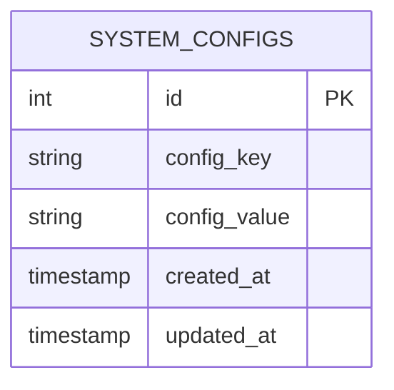
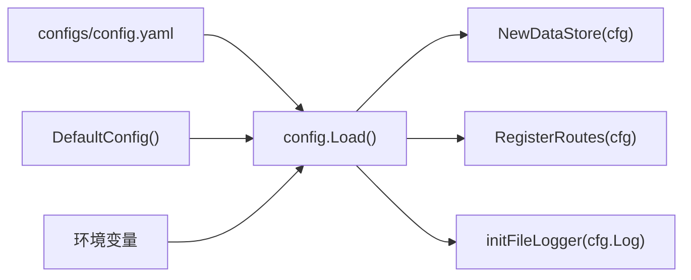

# 配置错误

<cite>
**本文引用的文件**
- [configs/config.yaml](file://configs/config.yaml)
- [internal/config/config.go](file://internal/config/config.go)
- [cmd/server/main.go](file://cmd/server/main.go)
- [docker-compose.yml](file://docker-compose.yml)
- [Dockerfile](file://Dockerfile)
- [internal/api/router.go](file://internal/api/router.go)
- [internal/api/setup.go](file://internal/api/setup.go)
- [internal/storage/sqlite/config.go](file://internal/storage/sqlite/config.go)
- [internal/storage/postgres/config.go](file://internal/storage/postgres/config.go)
- [internal/middleware/logger.go](file://internal/middleware/logger.go)
- [internal/model/errors.go](file://internal/model/errors.go)
</cite>

## 目录
1. [简介](#简介)
2. [项目结构](#项目结构)
3. [核心组件](#核心组件)
4. [架构总览](#架构总览)
5. [详细组件分析](#详细组件分析)
6. [依赖分析](#依赖分析)
7. [性能考虑](#性能考虑)
8. [故障排除指南](#故障排除指南)
9. [结论](#结论)
10. [附录](#附录)

## 简介
本指南聚焦于 DataCollector 的配置系统与常见配置错误的排查与修复。内容涵盖：
- 配置文件格式与参数校验
- 环境变量覆盖规则与优先级
- 不同部署环境（本地、容器）的配置差异
- 动态配置更新与热重载思路
- 配置验证工具与最佳实践

## 项目结构
DataCollector 的配置体系围绕 YAML 文件与环境变量展开，并在启动阶段完成加载与覆盖，随后贯穿到日志、数据库、限流等模块。

**图表来源**
- [configs/config.yaml:1-41](file://configs/config.yaml#L1-L41)
- [internal/config/config.go:82-195](file://internal/config/config.go#L82-L195)
- [cmd/server/main.go:155-169](file://cmd/server/main.go#L155-L169)
- [internal/api/router.go:14-115](file://internal/api/router.go#L14-L115)
- [internal/storage/sqlite/config.go:11-79](file://internal/storage/sqlite/config.go#L11-L79)
- [internal/storage/postgres/config.go:11-76](file://internal/storage/postgres/config.go#L11-L76)
- [docker-compose.yml:13-16](file://docker-compose.yml#L13-L16)
- [Dockerfile:45-49](file://Dockerfile#L45-L49)
- [internal/middleware/logger.go:11-66](file://internal/middleware/logger.go#L11-L66)

**章节来源**
- [configs/config.yaml:1-41](file://configs/config.yaml#L1-L41)
- [internal/config/config.go:82-195](file://internal/config/config.go#L82-L195)
- [cmd/server/main.go:155-169](file://cmd/server/main.go#L155-L169)
- [docker-compose.yml:13-16](file://docker-compose.yml#L13-L16)
- [Dockerfile:45-49](file://Dockerfile#L45-L49)

## 核心组件
- 配置模型与加载：定义了服务器、TLS、数据库、JWT、采集器、日志等配置结构，并提供从 YAML 加载与默认值填充能力；随后应用环境变量覆盖。
- 启动流程：主程序负责加载配置、确保目录存在、按日志配置初始化输出、创建数据存储、执行数据库迁移与健康检查、初始化 JWT、WebSocket、统计聚合器与 HTTP 服务。
- 路由与限流：根据采集器配置中的速率限制参数注册限流中间件。
- 动态配置：通过系统配置表持久化“初始化”状态与部分运行时可变项（如数据库驱动、服务器端口），并提供初始化与重新初始化接口。

**章节来源**
- [internal/config/config.go:12-80](file://internal/config/config.go#L12-L80)
- [internal/config/config.go:82-146](file://internal/config/config.go#L82-L146)
- [internal/config/config.go:148-195](file://internal/config/config.go#L148-L195)
- [cmd/server/main.go:25-129](file://cmd/server/main.go#L25-L129)
- [internal/api/router.go:48-55](file://internal/api/router.go#L48-L55)
- [internal/api/setup.go:132-196](file://internal/api/setup.go#L132-L196)

## 架构总览
配置从文件与环境变量加载，贯穿到运行时各子系统；系统配置表用于持久化关键运行态配置。

**图表来源**
- [cmd/server/main.go:155-169](file://cmd/server/main.go#L155-L169)
- [internal/config/config.go:82-98](file://internal/config/config.go#L82-L98)
- [internal/storage/factory.go:11-21](file://internal/storage/factory.go#L11-L21)
- [internal/api/router.go:14-115](file://internal/api/router.go#L14-L115)
- [internal/middleware/logger.go:11-66](file://internal/middleware/logger.go#L11-L66)

## 详细组件分析

### 配置模型与加载
- 结构体映射：YAML 键名与结构体标签一一对应，便于 Unmarshal。
- 默认配置：未显式提供时采用默认值，保证最小可用性。
- 环境变量覆盖：支持数据库驱动、SQLite 路径、PostgreSQL 主机/端口/用户/密码/库名、服务器端口、JWT 密钥、日志级别等覆盖。
- DSN 生成：根据驱动生成数据库连接字符串。

**图表来源**
- [internal/config/config.go:12-80](file://internal/config/config.go#L12-L80)
- [internal/config/config.go:197-214](file://internal/config/config.go#L197-L214)

**章节来源**
- [internal/config/config.go:82-146](file://internal/config/config.go#L82-L146)
- [internal/config/config.go:148-195](file://internal/config/config.go#L148-L195)
- [internal/config/config.go:197-214](file://internal/config/config.go#L197-L214)

### 启动流程与配置应用
- 配置加载：优先从配置文件加载，失败则回退默认配置。
- 目录准备：确保数据与日志目录存在。
- 日志初始化：根据配置决定输出到标准输出或文件轮转。
- 数据存储：根据驱动创建 SQLite 或 PostgreSQL 实现。
- 健康检查：Ping 成功后继续启动。
- 服务启动：绑定地址并启动 HTTP 服务。

**图表来源**
- [cmd/server/main.go:25-129](file://cmd/server/main.go#L25-L129)
- [cmd/server/main.go:155-169](file://cmd/server/main.go#L155-L169)
- [internal/storage/factory.go:11-21](file://internal/storage/factory.go#L11-L21)

**章节来源**
- [cmd/server/main.go:25-129](file://cmd/server/main.go#L25-L129)
- [cmd/server/main.go:155-169](file://cmd/server/main.go#L155-L169)

### 路由与限流配置
- 采集路由组应用 IP 限流与 Token 限流中间件，限流参数来自配置。
- 限流中间件在路由注册时被注入，确保请求进入业务逻辑前进行限速控制。

**图表来源**
- [internal/api/router.go:48-55](file://internal/api/router.go#L48-L55)

**章节来源**
- [internal/api/router.go:48-55](file://internal/api/router.go#L48-L55)

### 动态配置与持久化
- 系统配置表：提供键值对持久化能力，用于保存初始化状态与运行时可变项。
- 初始化接口：支持在首次启动时设置数据库驱动、SQLite/PG 参数、服务器端口，并创建管理员用户。
- 重新初始化：要求管理员角色并设置“未初始化”，提示重启生效。

**图表来源**
- [internal/storage/sqlite/config.go:11-79](file://internal/storage/sqlite/config.go#L11-L79)
- [internal/storage/postgres/config.go:11-76](file://internal/storage/postgres/config.go#L11-L76)
- [internal/api/setup.go:132-196](file://internal/api/setup.go#L132-L196)

**章节来源**
- [internal/storage/sqlite/config.go:11-79](file://internal/storage/sqlite/config.go#L11-L79)
- [internal/storage/postgres/config.go:11-76](file://internal/storage/postgres/config.go#L11-L76)
- [internal/api/setup.go:132-196](file://internal/api/setup.go#L132-L196)

## 依赖分析
- 配置来源与优先级：YAML 文件 < 默认值 < 环境变量。
- 容器环境：Compose 与 Dockerfile 提供默认环境变量，便于在容器中快速切换数据库驱动与日志输出。
- 组件耦合：配置被广泛使用于启动流程、路由注册、日志初始化与存储工厂。

**图表来源**
- [configs/config.yaml:1-41](file://configs/config.yaml#L1-L41)
- [internal/config/config.go:82-146](file://internal/config/config.go#L82-L146)
- [internal/config/config.go:148-195](file://internal/config/config.go#L148-L195)
- [internal/storage/factory.go:11-21](file://internal/storage/factory.go#L11-L21)
- [internal/api/router.go:14-115](file://internal/api/router.go#L14-L115)
- [cmd/server/main.go:138-153](file://cmd/server/main.go#L138-L153)

**章节来源**
- [internal/config/config.go:82-195](file://internal/config/config.go#L82-L195)
- [docker-compose.yml:13-16](file://docker-compose.yml#L13-L16)
- [Dockerfile:45-49](file://Dockerfile#L45-L49)

## 性能考虑
- 日志轮转：文件输出模式下使用轮转，避免单文件过大影响性能与磁盘占用。
- 限流策略：基于配置的令牌与 IP 限流，可在高并发场景下保护后端资源。
- 数据库连接：PostgreSQL 支持 SSL 模式配置，生产环境建议开启安全模式。

[本节为通用建议，无需具体文件分析]

## 故障排除指南

### 一、配置文件格式错误
- 症状
  - 启动时报“配置文件解析失败”或“无法读取配置文件”
  - 配置未按预期生效
- 识别
  - YAML 缩进、冒号、引号不匹配会导致解析失败
  - 键名拼写错误或大小写不一致
- 修复
  - 使用在线 YAML 校验工具或编辑器插件检查语法
  - 对照默认配置键名与类型，确保键值类型匹配
  - 优先使用默认配置作为参考模板
- 验证
  - 启动时观察日志是否显示“从文件加载配置成功”
  - 如加载失败，系统会回退到默认配置并记录警告

**章节来源**
- [internal/config/config.go:82-98](file://internal/config/config.go#L82-L98)
- [cmd/server/main.go:155-169](file://cmd/server/main.go#L155-L169)

### 二、参数值不正确
- 端口冲突
  - 症状：启动报错或端口占用
  - 修复：调整 server.port 或释放占用端口
- 数据库参数错误
  - 症状：数据库 Ping 失败、迁移失败
  - 修复：核对主机、端口、用户名、密码、库名与 SSL 模式
  - 验证：使用初始化测试接口进行连通性测试
- 日志路径不可写
  - 症状：文件日志初始化失败
  - 修复：确保日志目录存在且具备写权限
- 限流参数异常
  - 症状：频繁触发限流导致请求被拒
  - 修复：调整 collector.rate_limit_per_token 与 collector.rate_limit_per_ip

**章节来源**
- [internal/config/config.go:197-214](file://internal/config/config.go#L197-L214)
- [internal/api/setup.go:62-105](file://internal/api/setup.go#L62-L105)
- [cmd/server/main.go:155-169](file://cmd/server/main.go#L155-L169)

### 三、环境变量缺失或覆盖不当
- 症状
  - 配置未按期望覆盖
  - 启动行为与预期不符
- 识别
  - 确认环境变量名称与覆盖规则一致
  - 检查容器/系统环境变量是否生效
- 修复
  - 使用正确的环境变量名进行覆盖
  - 在容器环境中，优先使用 Compose/Dockerfile 的 ENV/环境变量
- 验证
  - 启动日志中应体现“从文件加载配置”或“使用默认配置”的提示
  - 通过初始化接口查看当前生效的配置项

**章节来源**
- [internal/config/config.go:148-195](file://internal/config/config.go#L148-L195)
- [docker-compose.yml:13-16](file://docker-compose.yml#L13-L16)
- [Dockerfile:45-49](file://Dockerfile#L45-L49)

### 四、不同部署环境下的配置差异
- 本地开发
  - 使用 SQLite，配置文件默认即可
  - 日志输出到标准输出，便于终端查看
- 容器部署（Docker）
  - 默认使用 SQLite，日志输出到文件
  - 通过环境变量覆盖数据库驱动与路径
- Compose 多环境
  - 可切换至 PostgreSQL 模式，设置主机、端口、凭据
  - 通过卷挂载持久化数据与日志

**章节来源**
- [docker-compose.yml:13-16](file://docker-compose.yml#L13-L16)
- [Dockerfile:45-49](file://Dockerfile#L45-L49)

### 五、配置验证工具与方法
- YAML 语法校验：使用在线工具或编辑器插件
- 运行时验证
  - 健康检查：访问 /api/v1/health
  - 数据库连通性测试：POST /api/v1/setup/test-db
  - 初始化状态检查：GET /api/v1/setup/status
- 日志辅助：结构化日志包含请求链路与错误信息，便于定位问题

**章节来源**
- [internal/api/router.go:36-45](file://internal/api/router.go#L36-L45)
- [internal/api/setup.go:40-105](file://internal/api/setup.go#L40-L105)
- [internal/middleware/logger.go:11-66](file://internal/middleware/logger.go#L11-L66)

### 六、配置优先级与覆盖规则
- 优先级（从低到高）
  1) 默认值
  2) 配置文件
  3) 环境变量
- 覆盖范围
  - 数据库：驱动、SQLite 路径、PostgreSQL 主机/端口/用户/密码/库名
  - 服务器：端口
  - JWT：密钥
  - 日志：级别
- 生效时机
  - 启动阶段一次性应用，后续动态修改需结合系统配置表与重启

**章节来源**
- [internal/config/config.go:100-146](file://internal/config/config.go#L100-L146)
- [internal/config/config.go:148-195](file://internal/config/config.go#L148-L195)

### 七、动态配置更新与热重载
- 当前机制
  - 配置主要在启动时加载并固化
  - 系统配置表用于持久化“初始化”状态与部分运行时可变项
- 热重载建议
  - 引入配置变更监听（如文件监控或 API 触发）
  - 对日志级别、限流阈值等支持平滑更新
  - 对数据库连接、服务器端口等敏感项，建议通过重启生效
- 重新初始化
  - 通过 /api/v1/setup/reinit 将初始化状态重置为未初始化，提示重启以应用新配置

**章节来源**
- [internal/api/setup.go:198-236](file://internal/api/setup.go#L198-L236)
- [internal/storage/sqlite/config.go:11-79](file://internal/storage/sqlite/config.go#L11-L79)
- [internal/storage/postgres/config.go:11-76](file://internal/storage/postgres/config.go#L11-L76)

### 八、配置模板与最佳实践
- 配置模板
  - 参考默认配置键名与类型，确保键值匹配
  - 本地开发可直接使用默认配置；生产环境建议显式声明关键项
- 最佳实践
  - 生产环境固定数据库驱动与凭据，避免频繁变更
  - 使用环境变量覆盖端口与日志级别，便于多环境部署
  - 为日志输出配置轮转，避免磁盘空间耗尽
  - 对敏感配置（JWT 密钥、数据库密码）使用环境变量或密钥管理

**章节来源**
- [configs/config.yaml:1-41](file://configs/config.yaml#L1-L41)
- [internal/config/config.go:100-146](file://internal/config/config.go#L100-L146)
- [Dockerfile:45-49](file://Dockerfile#L45-L49)

## 结论
- 配置系统以 YAML 为主、默认值兜底、环境变量覆盖，形成清晰的优先级链
- 启动流程严格依赖配置加载结果，任何配置错误都会在启动阶段暴露
- 动态配置可通过系统配置表与初始化接口实现有限度的运行时调整
- 建议在生产环境采用严格的环境变量管理与日志轮转策略，确保稳定性与可观测性

[本节为总结性内容，无需具体文件分析]

## 附录

### A. 常见错误码参考（与配置相关）
- 初始化失败：用于数据库连接测试与初始化过程中的错误反馈
- 参数缺失：用于请求体或初始化参数不合法的场景

**章节来源**
- [internal/model/errors.go:40-84](file://internal/model/errors.go#L40-L84)