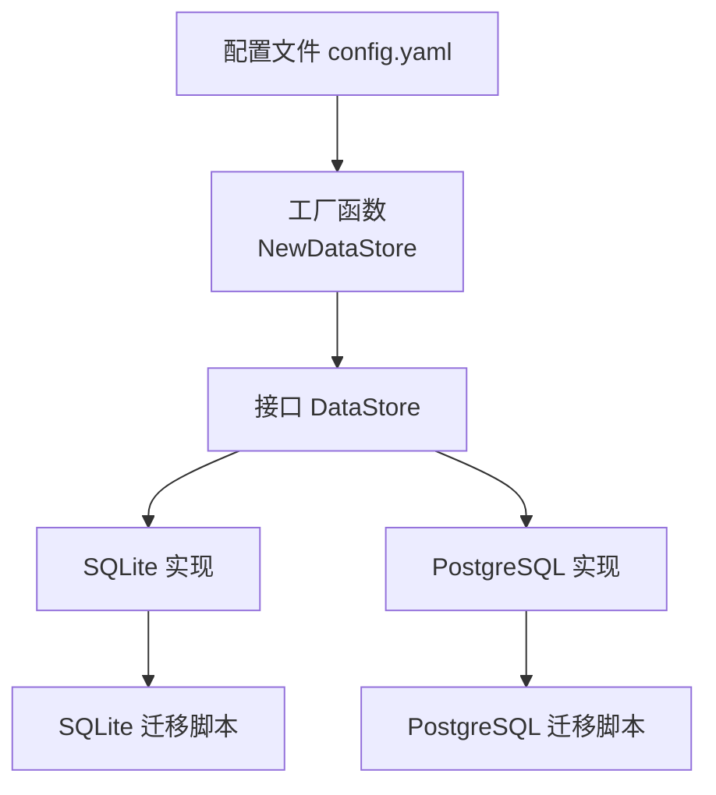
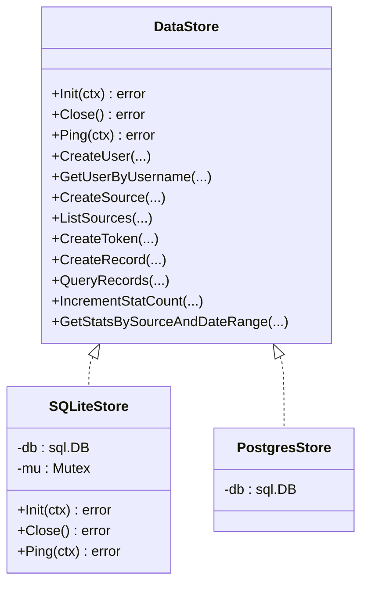
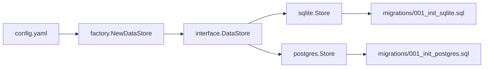
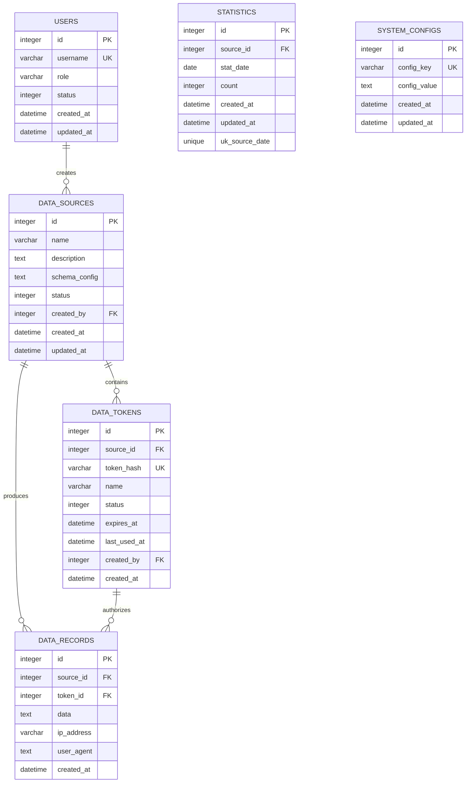
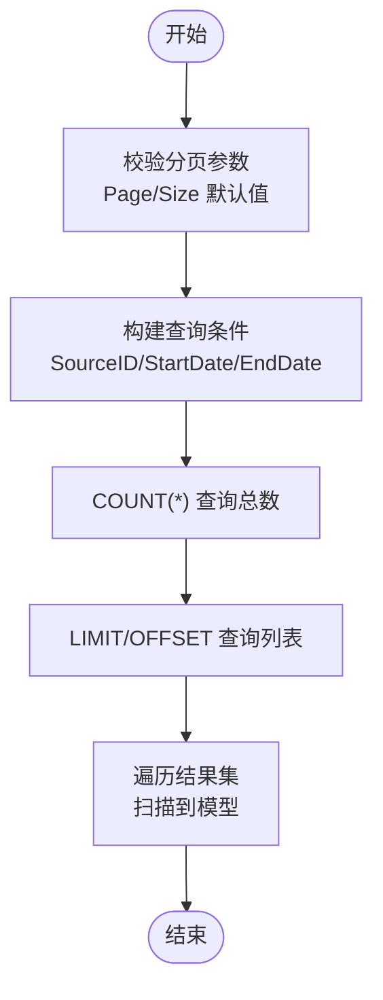

# 存储后端实现

<cite>
**本文引用的文件**
- [internal/storage/factory.go](file://internal/storage/factory.go)
- [internal/storage/interface.go](file://internal/storage/interface.go)
- [internal/storage/sqlite/store.go](file://internal/storage/sqlite/store.go)
- [internal/storage/postgres/store.go](file://internal/storage/postgres/store.go)
- [configs/config.yaml](file://configs/config.yaml)
- [internal/storage/sqlite/config.go](file://internal/storage/sqlite/config.go)
- [internal/storage/postgres/config.go](file://internal/storage/postgres/config.go)
- [internal/storage/sqlite/record.go](file://internal/storage/sqlite/record.go)
- [internal/storage/postgres/record.go](file://internal/storage/postgres/record.go)
- [internal/storage/sqlite/statistics.go](file://internal/storage/sqlite/statistics.go)
- [internal/storage/postgres/statistics.go](file://internal/storage/postgres/statistics.go)
- [internal/storage/sqlite/source.go](file://internal/storage/sqlite/source.go)
- [internal/storage/postgres/source.go](file://internal/storage/postgres/source.go)
- [internal/storage/migrations/001_init_sqlite.sql](file://internal/storage/migrations/001_init_sqlite.sql)
- [internal/storage/migrations/001_init_postgres.sql](file://internal/storage/migrations/001_init_postgres.sql)
- [internal/model/record.go](file://internal/model/record.go)
</cite>

## 目录
1. [简介](#简介)
2. [项目结构](#项目结构)
3. [核心组件](#核心组件)
4. [架构总览](#架构总览)
5. [详细组件分析](#详细组件分析)
6. [依赖分析](#依赖分析)
7. [性能考虑](#性能考虑)
8. [故障排查指南](#故障排查指南)
9. [结论](#结论)
10. [附录](#附录)

## 简介
本文档系统性梳理 DataCollector 的存储后端实现，重点对比 SQLite 与 PostgreSQL 两种后端在以下维度的差异与实现要点：
- SQL 语句差异与优化策略
- 连接管理与并发控制
- 事务处理与批量操作
- 配置项、性能特征与适用场景
- 数据类型与时间戳处理差异
- 索引设计与查询优化建议
- 故障转移与数据迁移策略

## 项目结构
存储相关代码采用“接口 + 工厂 + 后端实现”的分层设计：
- 接口定义：统一抽象数据访问能力
- 工厂函数：根据配置选择具体后端
- 后端实现：SQLite 与 PostgreSQL 的具体实现
- 迁移脚本：初始化表结构与索引
- 配置文件：数据库驱动与连接参数

图表来源
- [internal/storage/factory.go:11-21](file://internal/storage/factory.go#L11-L21)
- [internal/storage/interface.go:9-56](file://internal/storage/interface.go#L9-L56)
- [internal/storage/sqlite/store.go:24-56](file://internal/storage/sqlite/store.go#L24-L56)
- [internal/storage/postgres/store.go:20-34](file://internal/storage/postgres/store.go#L20-L34)
- [configs/config.yaml:11-22](file://configs/config.yaml#L11-L22)

章节来源
- [internal/storage/factory.go:11-21](file://internal/storage/factory.go#L11-L21)
- [internal/storage/interface.go:9-56](file://internal/storage/interface.go#L9-L56)
- [configs/config.yaml:11-22](file://configs/config.yaml#L11-L22)

## 核心组件
- 工厂函数：依据配置中的 driver 字段选择 SQLite 或 PostgreSQL 实例化
- 接口 DataStore：定义用户、数据源、Token、数据记录、统计、系统配置等 CRUD 与查询方法
- SQLiteStore/PostgresStore：分别实现 Init、Close、Ping 以及各实体的持久化逻辑
- 迁移脚本：初始化表结构与索引，确保两种后端一致的模式

章节来源
- [internal/storage/factory.go:11-21](file://internal/storage/factory.go#L11-L21)
- [internal/storage/interface.go:9-56](file://internal/storage/interface.go#L9-L56)
- [internal/storage/sqlite/store.go:24-56](file://internal/storage/sqlite/store.go#L24-L56)
- [internal/storage/postgres/store.go:20-34](file://internal/storage/postgres/store.go#L20-L34)

## 架构总览
两种后端共享同一接口契约，通过工厂按需切换；在 SQL 方言、数据类型、并发控制等方面存在差异。

图表来源
- [internal/storage/interface.go:9-56](file://internal/storage/interface.go#L9-L56)
- [internal/storage/sqlite/store.go:17-21](file://internal/storage/sqlite/store.go#L17-L21)
- [internal/storage/postgres/store.go:14-17](file://internal/storage/postgres/store.go#L14-L17)

## 详细组件分析

### 工厂与接口
- 工厂函数根据配置选择驱动并返回对应 DataStore 实例
- 接口统一了 CRUD、分页查询、导出、统计与系统配置等能力

章节来源
- [internal/storage/factory.go:11-21](file://internal/storage/factory.go#L11-L21)
- [internal/storage/interface.go:9-56](file://internal/storage/interface.go#L9-L56)

### 连接管理与并发控制
- SQLite
  - 单写连接：最大打开/空闲连接数均为 1
  - 启用 WAL 模式提升并发读性能
  - 设置 busy_timeout 降低锁等待失败概率
  - 对关键写入路径使用互斥锁保证线程安全
- PostgreSQL
  - 默认连接池：最大打开连接 25，空闲 5
  - 无显式互斥锁，依赖数据库层面并发控制

章节来源
- [internal/storage/sqlite/store.go:39-55](file://internal/storage/sqlite/store.go#L39-L55)
- [internal/storage/sqlite/store.go:18-21](file://internal/storage/sqlite/store.go#L18-L21)
- [internal/storage/postgres/store.go:29-33](file://internal/storage/postgres/store.go#L29-L33)

### SQL 语句差异与优化策略
- 参数占位符
  - SQLite 使用问号占位符
  - PostgreSQL 使用 $n 序号占位符
- UPSERT 语义
  - SQLite 使用 INSERT ... ON CONFLICT
  - PostgreSQL 使用 INSERT ... ON CONFLICT
- 返回自增主键
  - SQLite 使用 LastInsertId
  - PostgreSQL 使用 RETURNING id
- 时间戳与时区
  - SQLite 使用 DATETIME，默认 CURRENT_TIMESTAMP
  - PostgreSQL 使用 TIMESTAMP WITH TIME ZONE，默认 NOW()

章节来源
- [internal/storage/sqlite/config.go:33-42](file://internal/storage/sqlite/config.go#L33-L42)
- [internal/storage/postgres/config.go:30-39](file://internal/storage/postgres/config.go#L30-L39)
- [internal/storage/sqlite/record.go:18-34](file://internal/storage/sqlite/record.go#L18-L34)
- [internal/storage/postgres/record.go:15-34](file://internal/storage/postgres/record.go#L15-L34)
- [internal/storage/migrations/001_init_sqlite.sql:11-12](file://internal/storage/migrations/001_init_sqlite.sql#L11-L12)
- [internal/storage/migrations/001_init_postgres.sql:11-12](file://internal/storage/migrations/001_init_postgres.sql#L11-L12)

### 数据类型与时间戳处理
- SQLite
  - 文本字段：VARCHAR/TEXT
  - JSON：TEXT 存储，应用侧以 json.RawMessage 解析
  - 时间：DATETIME，CURRENT_TIMESTAMP
- PostgreSQL
  - JSON：JSONB 类型，具备索引与高效查询能力
  - 时间：TIMESTAMP WITH TIME ZONE
  - 主键：SERIAL

章节来源
- [internal/storage/migrations/001_init_sqlite.sql:20-48](file://internal/storage/migrations/001_init_sqlite.sql#L20-L48)
- [internal/storage/migrations/001_init_postgres.sql:20-48](file://internal/storage/migrations/001_init_postgres.sql#L20-L48)
- [internal/model/record.go:13](file://internal/model/record.go#L13)

### 索引使用建议
- SQLite 迁移脚本已创建常用索引，覆盖用户、数据源、Token、记录、统计与配置表的关键查询列
- PostgreSQL 迁移脚本保持一致的索引策略
- 建议对高频过滤条件（如 source_id、token_id、created_at）保持现有索引；避免过度索引导致写入成本上升

章节来源
- [internal/storage/migrations/001_init_sqlite.sql:77-96](file://internal/storage/migrations/001_init_sqlite.sql#L77-L96)
- [internal/storage/migrations/001_init_postgres.sql:71-90](file://internal/storage/migrations/001_init_postgres.sql#L71-L90)

### 批量操作实现
- SQLite
  - 批量删除：动态拼接占位符，使用 IN 子句
  - 写入路径加互斥锁，保证一致性
- PostgreSQL
  - 批量删除：动态拼接 $n 占位符，使用 IN 子句
- 导出与分页
  - 两者均支持按日期范围与数据源过滤的导出与分页查询

章节来源
- [internal/storage/sqlite/record.go:159-183](file://internal/storage/sqlite/record.go#L159-L183)
- [internal/storage/postgres/record.go:161-182](file://internal/storage/postgres/record.go#L161-L182)
- [internal/storage/sqlite/record.go:185-245](file://internal/storage/sqlite/record.go#L185-L245)
- [internal/storage/postgres/record.go:184-248](file://internal/storage/postgres/record.go#L184-L248)

### 统计与趋势查询
- SQLite
  - 计数增量：UPSERT 统一逻辑
  - 趋势查询：Token 级别从 data_records 聚合，数据源/全局从 statistics 表查询
- PostgreSQL
  - 计数增量：UPSERT 统一逻辑
  - 趋势查询：与 SQLite 一致的分支逻辑

章节来源
- [internal/storage/sqlite/statistics.go:10-25](file://internal/storage/sqlite/statistics.go#L10-L25)
- [internal/storage/postgres/statistics.go:10-22](file://internal/storage/postgres/statistics.go#L10-L22)
- [internal/storage/sqlite/statistics.go:89-145](file://internal/storage/sqlite/statistics.go#L89-L145)
- [internal/storage/postgres/statistics.go:86-142](file://internal/storage/postgres/statistics.go#L86-L142)

### 数据源与 Token 管理
- SQLite
  - 写入路径加互斥锁
  - 列表查询包含 token_count 聚合
- PostgreSQL
  - 列表查询包含 token_count 聚合
  - 写入使用 RETURNING id

章节来源
- [internal/storage/sqlite/source.go:12-35](file://internal/storage/sqlite/source.go#L12-L35)
- [internal/storage/postgres/source.go:12-34](file://internal/storage/postgres/source.go#L12-L34)
- [internal/storage/sqlite/source.go:67-130](file://internal/storage/sqlite/source.go#L67-L130)
- [internal/storage/postgres/source.go:66-129](file://internal/storage/postgres/source.go#L66-L129)

### 系统配置管理
- SQLite
  - UPSERT 使用 ON CONFLICT，更新 updated_at
- PostgreSQL
  - UPSERT 使用 ON CONFLICT，更新 updated_at

章节来源
- [internal/storage/sqlite/config.go:28-42](file://internal/storage/sqlite/config.go#L28-L42)
- [internal/storage/postgres/config.go:28-39](file://internal/storage/postgres/config.go#L28-L39)

### 事务处理
- 两种后端未在上述文件中显式开启事务块；SQLite 在写入路径使用互斥锁保障一致性
- 若需要强一致或跨表原子性，可在上层调用处封装事务

章节来源
- [internal/storage/sqlite/store.go:18-21](file://internal/storage/sqlite/store.go#L18-L21)
- [internal/storage/sqlite/record.go:14-35](file://internal/storage/sqlite/record.go#L14-L35)

## 依赖分析
- 工厂函数依赖配置模块与两个后端包
- 两个后端均依赖迁移资源与配置模块
- 接口与模型解耦，便于替换与扩展

图表来源
- [internal/storage/factory.go:12-20](file://internal/storage/factory.go#L12-L20)
- [configs/config.yaml:11-22](file://configs/config.yaml#L11-L22)
- [internal/storage/migrations/001_init_sqlite.sql:1](file://internal/storage/migrations/001_init_sqlite.sql#L1)
- [internal/storage/migrations/001_init_postgres.sql:1](file://internal/storage/migrations/001_init_postgres.sql#L1)

章节来源
- [internal/storage/factory.go:12-20](file://internal/storage/factory.go#L12-L20)
- [configs/config.yaml:11-22](file://configs/config.yaml#L11-L22)

## 性能考虑
- 连接池
  - SQLite：单连接 + WAL + busy_timeout，适合单机、低并发场景
  - PostgreSQL：较大连接池，适合多并发、高吞吐场景
- 写入路径
  - SQLite：互斥锁串行化写入，避免竞争；适合写少读多或顺序写入
  - PostgreSQL：无显式串行化，依赖数据库并发控制
- 查询优化
  - 利用现有索引；避免全表扫描
  - 分页查询限制 LIMIT/OFFSET，注意大偏移性能
- JSON 存储
  - SQLite：TEXT + 应用解析，简单但缺乏索引能力
  - PostgreSQL：JSONB 支持高效查询与索引，推荐复杂 JSON 场景
- 时间戳
  - PostgreSQL 使用带时区时间戳，便于跨时区统计与排序

章节来源
- [internal/storage/sqlite/store.go:39-55](file://internal/storage/sqlite/store.go#L39-L55)
- [internal/storage/postgres/store.go:29-33](file://internal/storage/postgres/store.go#L29-L33)
- [internal/storage/migrations/001_init_postgres.sql:20](file://internal/storage/migrations/001_init_postgres.sql#L20)
- [internal/storage/migrations/001_init_sqlite.sql:48](file://internal/storage/migrations/001_init_sqlite.sql#L48)

## 故障排查指南
- 连接失败
  - 检查配置文件中的 driver、SQLite 路径或 PostgreSQL DSN
  - 确认数据库服务可达与凭据正确
- SQLite 写入阻塞
  - 检查 busy_timeout 设置是否合理
  - 避免在同一时间进行大量并发写入
- PostgreSQL 连接过多
  - 调整连接池参数，避免超出数据库最大连接数
- UPSERT 异常
  - 确认唯一约束（如 config_key、(source_id, stat_date)）是否存在冲突
- 迁移失败
  - 检查迁移脚本是否成功执行，确认表结构与索引存在

章节来源
- [configs/config.yaml:11-22](file://configs/config.yaml#L11-L22)
- [internal/storage/sqlite/store.go:39-55](file://internal/storage/sqlite/store.go#L39-L55)
- [internal/storage/postgres/store.go:29-33](file://internal/storage/postgres/store.go#L29-L33)
- [internal/storage/sqlite/config.go:33-42](file://internal/storage/sqlite/config.go#L33-L42)
- [internal/storage/postgres/config.go:30-39](file://internal/storage/postgres/config.go#L30-L39)

## 结论
- SQLite 适合轻量级、单机部署与低并发场景，实现简洁、资源占用低
- PostgreSQL 适合高并发、复杂查询与强一致需求，具备更丰富的数据类型与索引能力
- 两种后端在接口层保持一致，便于按需切换；实际选型应结合业务规模、数据结构与运维能力

## 附录

### 配置选项与适用场景
- SQLite
  - 配置项：driver=sqlite，path 指向本地文件
  - 适用：开发测试、边缘设备、单机小规模生产
- PostgreSQL
  - 配置项：driver=postgres，DSN 由主机、端口、用户、密码、库名、SSL 等组成
  - 适用：生产环境、高并发、复杂统计与查询

章节来源
- [configs/config.yaml:11-22](file://configs/config.yaml#L11-L22)

### 数据模型与索引概览

图表来源
- [internal/storage/migrations/001_init_sqlite.sql:4-96](file://internal/storage/migrations/001_init_sqlite.sql#L4-L96)
- [internal/storage/migrations/001_init_postgres.sql:4-90](file://internal/storage/migrations/001_init_postgres.sql#L4-L90)

### 查询流程示例（分页与过滤）

图表来源
- [internal/storage/sqlite/record.go:67-147](file://internal/storage/sqlite/record.go#L67-L147)
- [internal/storage/postgres/record.go:66-152](file://internal/storage/postgres/record.go#L66-L152)