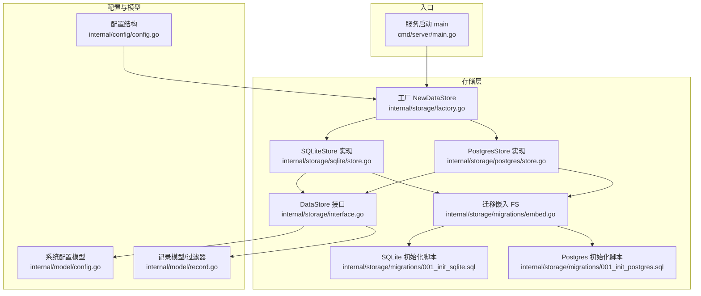
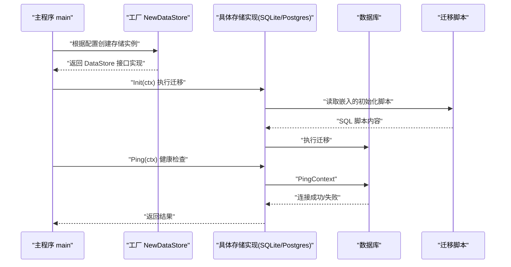
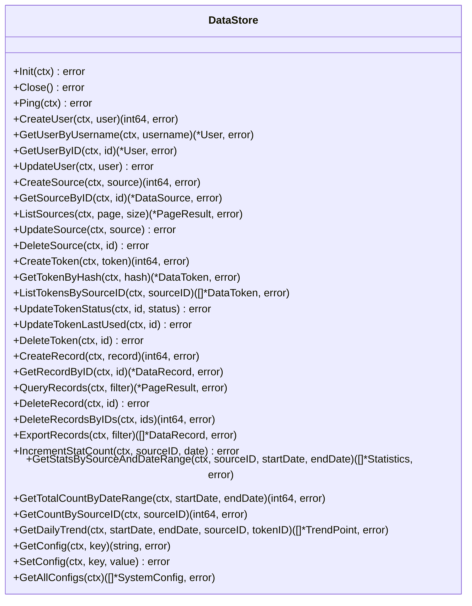
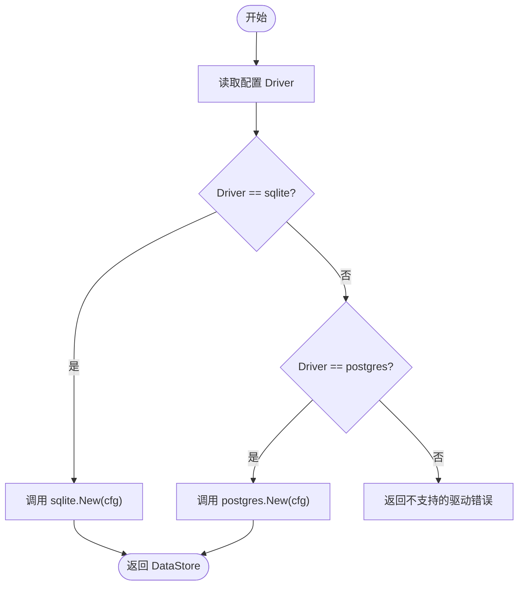
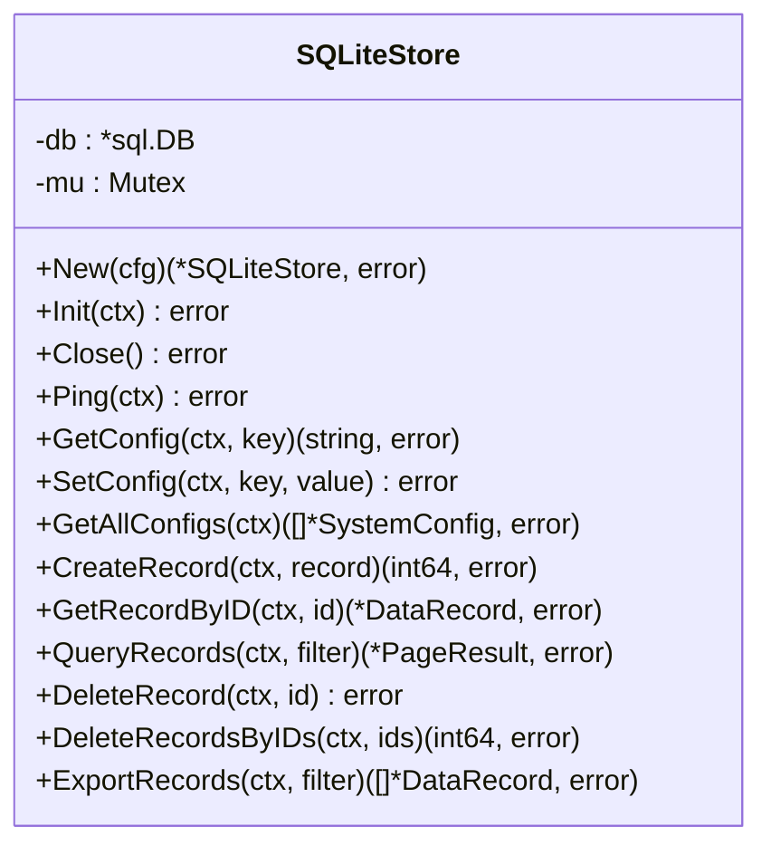
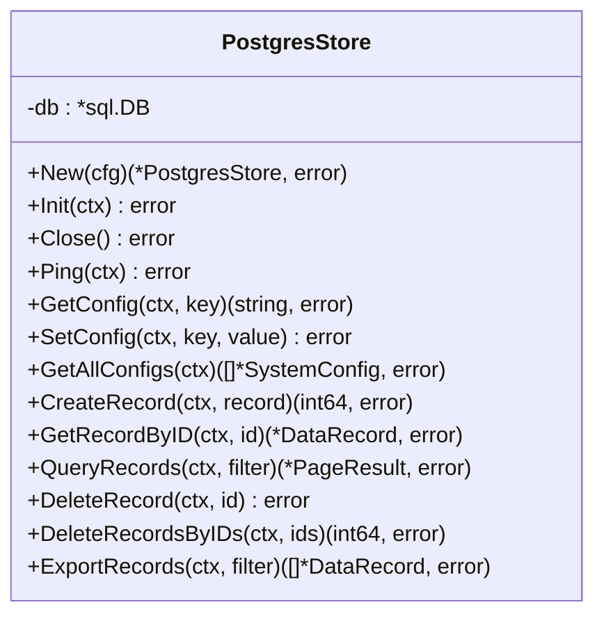
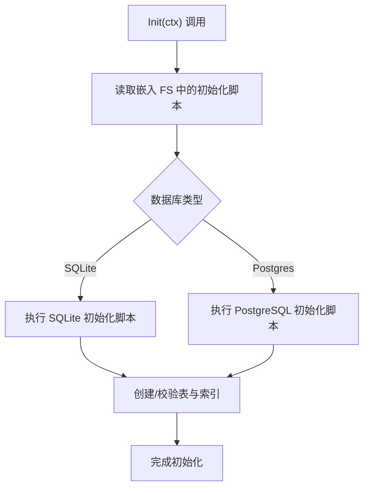
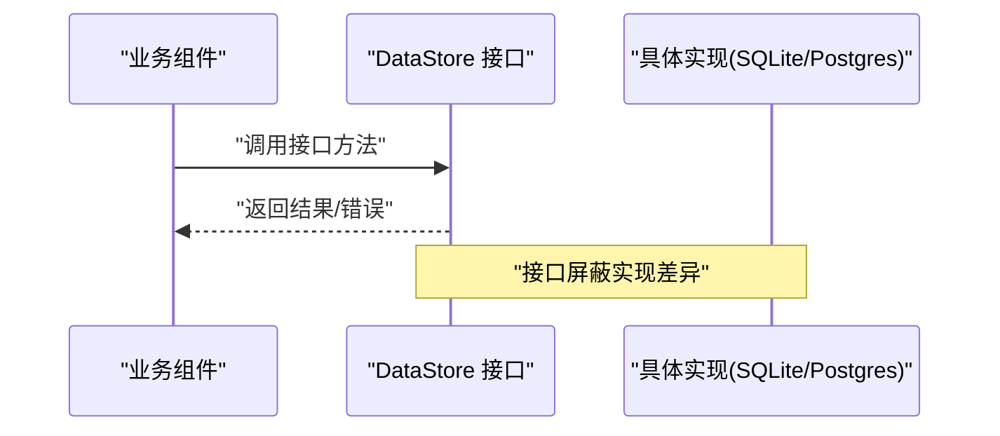
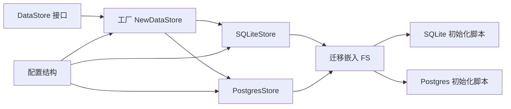

# 数据库架构设计

<cite>
**本文引用的文件**
- [internal/storage/interface.go](file://internal/storage/interface.go)
- [internal/storage/factory.go](file://internal/storage/factory.go)
- [internal/storage/sqlite/store.go](file://internal/storage/sqlite/store.go)
- [internal/storage/sqlite/config.go](file://internal/storage/sqlite/config.go)
- [internal/storage/sqlite/record.go](file://internal/storage/sqlite/record.go)
- [internal/storage/postgres/store.go](file://internal/storage/postgres/store.go)
- [internal/storage/postgres/config.go](file://internal/storage/postgres/config.go)
- [internal/storage/postgres/record.go](file://internal/storage/postgres/record.go)
- [internal/storage/migrations/embed.go](file://internal/storage/migrations/embed.go)
- [internal/storage/migrations/001_init_sqlite.sql](file://internal/storage/migrations/001_init_sqlite.sql)
- [internal/storage/migrations/001_init_postgres.sql](file://internal/storage/migrations/001_init_postgres.sql)
- [internal/config/config.go](file://internal/config/config.go)
- [internal/model/config.go](file://internal/model/config.go)
- [internal/model/record.go](file://internal/model/record.go)
- [cmd/server/main.go](file://cmd/server/main.go)
</cite>

## 目录
1. [简介](#简介)
2. [项目结构](#项目结构)
3. [核心组件](#核心组件)
4. [架构总览](#架构总览)
5. [详细组件分析](#详细组件分析)
6. [依赖分析](#依赖分析)
7. [性能考量](#性能考量)
8. [故障排查指南](#故障排查指南)
9. [结论](#结论)
10. [附录：扩展新存储后端指南](#附录扩展新存储后端指南)

## 简介
本文件系统性阐述 DataCollector 的数据库架构设计，重点围绕存储层抽象接口、工厂模式选择、SQLite 与 PostgreSQL 实现差异、接口隔离与业务解耦、连接池与事务处理、错误处理策略，以及扩展新存储后端的规范与步骤。目标是帮助开发者在不改变上层业务逻辑的前提下，灵活切换或扩展数据库后端，并获得清晰的性能与运维建议。

## 项目结构
存储层位于 internal/storage 下，采用“接口 + 工厂 + 多实现”的分层设计：
- 抽象接口：定义统一的数据访问契约
- 工厂函数：根据配置动态创建具体实现
- 具体实现：SQLite 与 PostgreSQL 分别提供各自功能实现
- 迁移与嵌入：通过嵌入资源管理初始化脚本
- 配置与模型：配置结构与数据模型支撑存储操作

图表来源
- [internal/storage/interface.go:1-57](file://internal/storage/interface.go#L1-L57)
- [internal/storage/factory.go:1-22](file://internal/storage/factory.go#L1-L22)
- [internal/storage/sqlite/store.go:1-86](file://internal/storage/sqlite/store.go#L1-L86)
- [internal/storage/postgres/store.go:1-61](file://internal/storage/postgres/store.go#L1-L61)
- [internal/storage/migrations/embed.go:1-7](file://internal/storage/migrations/embed.go#L1-L7)
- [internal/storage/migrations/001_init_sqlite.sql:1-97](file://internal/storage/migrations/001_init_sqlite.sql#L1-L97)
- [internal/storage/migrations/001_init_postgres.sql:1-91](file://internal/storage/migrations/001_init_postgres.sql#L1-L91)
- [internal/config/config.go:1-215](file://internal/config/config.go#L1-L215)
- [internal/model/config.go:1-13](file://internal/model/config.go#L1-L13)
- [internal/model/record.go:1-33](file://internal/model/record.go#L1-L33)
- [cmd/server/main.go:1-201](file://cmd/server/main.go#L1-L201)

章节来源
- [cmd/server/main.go:45-64](file://cmd/server/main.go#L45-L64)
- [internal/storage/factory.go:11-21](file://internal/storage/factory.go#L11-L21)
- [internal/config/config.go:36-56](file://internal/config/config.go#L36-L56)

## 核心组件
- DataStore 接口：定义初始化、连接健康检查、用户/数据源/Token/记录/统计/系统配置等完整 CRUD 与查询能力，确保上层业务与具体数据库实现解耦。
- 工厂 NewDataStore：依据配置选择 SQLite 或 PostgreSQL 实现；新增后端时只需在此处注册分支。
- SQLiteStore/PostgresStore：分别封装数据库连接、连接池参数、迁移执行、基础 CRUD 与统计方法。
- 迁移嵌入：通过 embed FS 内置初始化脚本，避免外部依赖，便于打包部署。
- 配置与模型：配置结构支持 DSN 生成与环境变量覆盖；模型定义系统配置与数据记录结构。

章节来源
- [internal/storage/interface.go:9-56](file://internal/storage/interface.go#L9-L56)
- [internal/storage/factory.go:11-21](file://internal/storage/factory.go#L11-L21)
- [internal/storage/sqlite/store.go:17-85](file://internal/storage/sqlite/store.go#L17-L85)
- [internal/storage/postgres/store.go:14-60](file://internal/storage/postgres/store.go#L14-L60)
- [internal/storage/migrations/embed.go:1-7](file://internal/storage/migrations/embed.go#L1-L7)
- [internal/config/config.go:197-214](file://internal/config/config.go#L197-L214)
- [internal/model/config.go:5-12](file://internal/model/config.go#L5-L12)
- [internal/model/record.go:8-32](file://internal/model/record.go#L8-L32)

## 架构总览
存储层通过接口隔离业务逻辑，工厂负责运行时选择具体实现，迁移脚本保证数据库结构一致性，配置模块提供 DSN 与环境变量覆盖。启动流程中，先创建存储实例、执行迁移、Ping 健康检查，再初始化其他组件。

图表来源
- [cmd/server/main.go:45-64](file://cmd/server/main.go#L45-L64)
- [internal/storage/factory.go:11-21](file://internal/storage/factory.go#L11-L21)
- [internal/storage/sqlite/store.go:58-75](file://internal/storage/sqlite/store.go#L58-L75)
- [internal/storage/postgres/store.go:36-50](file://internal/storage/postgres/store.go#L36-L50)
- [internal/storage/migrations/embed.go:5-6](file://internal/storage/migrations/embed.go#L5-L6)

## 详细组件分析

### DataStore 接口设计与职责分离
- 职责边界清晰：初始化/关闭/Ping、用户管理、数据源管理、Token 管理、数据记录、统计、系统配置，覆盖业务全链路。
- 接口隔离：上层仅依赖接口，不感知具体实现细节，便于替换与扩展。
- 错误处理：接口返回 error，调用方统一处理，避免实现内部异常泄漏。

图表来源
- [internal/storage/interface.go:10-56](file://internal/storage/interface.go#L10-L56)

章节来源
- [internal/storage/interface.go:9-56](file://internal/storage/interface.go#L9-L56)

### 工厂模式与存储后端选择
- NewDataStore 根据配置的 driver 字段选择 SQLite 或 PostgreSQL 实现；新增后端时只需添加 case 分支并返回对应 New 函数。
- 驱动选择与 DSN：PostgreSQL 使用 DSN() 生成连接串；SQLite 直接使用本地路径。
- 错误处理：未知驱动返回错误，阻止启动。

图表来源
- [internal/storage/factory.go:11-21](file://internal/storage/factory.go#L11-L21)
- [internal/config/config.go:197-214](file://internal/config/config.go#L197-L214)

章节来源
- [internal/storage/factory.go:11-21](file://internal/storage/factory.go#L11-L21)
- [internal/config/config.go:36-56](file://internal/config/config.go#L36-L56)

### SQLite 实现架构与特性
- 连接与池化：最大连接数与空闲连接数均为 1，满足 SQLite 单写限制；启用 WAL 模式提升并发读取能力；设置 busy_timeout 避免锁等待失败。
- 并发控制：关键写操作加互斥锁，保证线程安全。
- 迁移与初始化：读取嵌入的 SQLite 初始化脚本并执行。
- 配置管理：使用 UPSERT（SQLite 的 ON CONFLICT）更新系统配置，时间戳自动维护。
- 记录操作：支持分页查询、批量删除、导出等；查询条件动态拼接，LIMIT/OFFSET 实现分页。

图表来源
- [internal/storage/sqlite/store.go:17-85](file://internal/storage/sqlite/store.go#L17-L85)
- [internal/storage/sqlite/config.go:11-79](file://internal/storage/sqlite/config.go#L11-L79)
- [internal/storage/sqlite/record.go:13-245](file://internal/storage/sqlite/record.go#L13-L245)

章节来源
- [internal/storage/sqlite/store.go:17-85](file://internal/storage/sqlite/store.go#L17-L85)
- [internal/storage/sqlite/config.go:11-79](file://internal/storage/sqlite/config.go#L11-L79)
- [internal/storage/sqlite/record.go:13-245](file://internal/storage/sqlite/record.go#L13-L245)

### PostgreSQL 实现架构与特性
- 连接与池化：最大连接数 25，空闲连接 5，适合高并发场景。
- 迁移与初始化：读取嵌入的 PostgreSQL 初始化脚本并执行。
- 配置管理：使用 UPSERT（ON CONFLICT）更新系统配置。
- 记录操作：与 SQLite 类似，但参数占位符使用 $n 形式；分页查询通过 LIMIT/$n OFFSET 实现。

图表来源
- [internal/storage/postgres/store.go:14-60](file://internal/storage/postgres/store.go#L14-L60)
- [internal/storage/postgres/config.go:11-76](file://internal/storage/postgres/config.go#L11-L76)
- [internal/storage/postgres/record.go:13-248](file://internal/storage/postgres/record.go#L13-L248)

章节来源
- [internal/storage/postgres/store.go:14-60](file://internal/storage/postgres/store.go#L14-L60)
- [internal/storage/postgres/config.go:11-76](file://internal/storage/postgres/config.go#L11-L76)
- [internal/storage/postgres/record.go:13-248](file://internal/storage/postgres/record.go#L13-L248)

### 迁移与初始化
- 嵌入资源：通过 embed FS 将初始化脚本打包进二进制，简化部署。
- 初始化流程：NewDataStore 创建实例后调用 Init(ctx)，读取对应 SQL 文件并执行。
- 数据库差异：SQLite 与 PostgreSQL 的初始化脚本分别适配各自语法与类型（如 JSONB、时间戳带时区等）。

图表来源
- [internal/storage/sqlite/store.go:58-75](file://internal/storage/sqlite/store.go#L58-L75)
- [internal/storage/postgres/store.go:36-50](file://internal/storage/postgres/store.go#L36-L50)
- [internal/storage/migrations/embed.go:5-6](file://internal/storage/migrations/embed.go#L5-L6)
- [internal/storage/migrations/001_init_sqlite.sql:1-97](file://internal/storage/migrations/001_init_sqlite.sql#L1-L97)
- [internal/storage/migrations/001_init_postgres.sql:1-91](file://internal/storage/migrations/001_init_postgres.sql#L1-L91)

章节来源
- [internal/storage/migrations/embed.go:1-7](file://internal/storage/migrations/embed.go#L1-L7)
- [internal/storage/migrations/001_init_sqlite.sql:1-97](file://internal/storage/migrations/001_init_sqlite.sql#L1-L97)
- [internal/storage/migrations/001_init_postgres.sql:1-91](file://internal/storage/migrations/001_init_postgres.sql#L1-L91)

### 存储层与业务逻辑的解耦设计
- 接口隔离：业务模块仅依赖 DataStore 接口，不关心具体实现细节。
- 控制流：启动阶段由 main 调用 NewDataStore 获取接口实例，后续业务组件通过依赖注入使用该接口。
- 可替换性：通过工厂函数集中管理实现选择，无需修改业务代码即可切换后端。

图表来源
- [cmd/server/main.go:80-82](file://cmd/server/main.go#L80-L82)
- [internal/storage/interface.go:10-56](file://internal/storage/interface.go#L10-L56)

章节来源
- [cmd/server/main.go:80-82](file://cmd/server/main.go#L80-L82)
- [internal/storage/interface.go:9-56](file://internal/storage/interface.go#L9-L56)

### 数据库连接池管理与事务处理
- 连接池参数
  - SQLite：最大打开/空闲连接数均为 1，符合其单写限制；启用 WAL 提升并发读取；设置 busy_timeout。
  - PostgreSQL：最大打开连接 25，空闲 5，适合高并发。
- 事务处理：当前实现未显式使用事务块；若需强一致写入，可在具体实现中引入 Begin/Commit/Rollback。
- 健康检查：PingContext 用于启动阶段自检，确保连接可用。

章节来源
- [internal/storage/sqlite/store.go:39-55](file://internal/storage/sqlite/store.go#L39-L55)
- [internal/storage/postgres/store.go:29-33](file://internal/storage/postgres/store.go#L29-L33)
- [cmd/server/main.go:60-64](file://cmd/server/main.go#L60-L64)

### 错误处理策略
- 统一返回 error：接口层与实现层均以 error 表示失败，便于上层统一处理。
- 初始化失败：启动阶段对 Init/Ping 失败进行日志记录并退出，避免服务处于不一致状态。
- 查询空结果：如用户/记录不存在，返回空指针或空字符串，调用方需判空处理。

章节来源
- [internal/storage/sqlite/config.go:18-25](file://internal/storage/sqlite/config.go#L18-L25)
- [internal/storage/postgres/config.go:17-25](file://internal/storage/postgres/config.go#L17-L25)
- [cmd/server/main.go:48-64](file://cmd/server/main.go#L48-L64)

## 依赖分析
- 组件内聚：每个实现文件聚焦于单一数据库驱动，职责明确。
- 组件耦合：接口与工厂是唯一对外暴露的耦合点；具体实现之间无直接依赖。
- 外部依赖：SQLite 使用 github.com/mattn/go-sqlite3；PostgreSQL 使用 github.com/jackc/pgx/v5/stdlib。
- 运行时依赖：通过配置驱动选择与 DSN 生成，避免硬编码。

图表来源
- [internal/storage/interface.go:10-56](file://internal/storage/interface.go#L10-L56)
- [internal/storage/factory.go:11-21](file://internal/storage/factory.go#L11-L21)
- [internal/storage/sqlite/store.go:17-85](file://internal/storage/sqlite/store.go#L17-L85)
- [internal/storage/postgres/store.go:14-60](file://internal/storage/postgres/store.go#L14-L60)
- [internal/storage/migrations/embed.go:5-6](file://internal/storage/migrations/embed.go#L5-L6)
- [internal/config/config.go:197-214](file://internal/config/config.go#L197-L214)

章节来源
- [internal/storage/factory.go:11-21](file://internal/storage/factory.go#L11-L21)
- [internal/config/config.go:36-56](file://internal/config/config.go#L36-L56)

## 性能考量
- SQLite
  - 优点：零配置、单文件、WAL 提升并发读取；适合开发/测试/小规模生产。
  - 限制：单写限制、无连接池优势；高并发写入可能成为瓶颈。
  - 参数：busy_timeout 避免锁竞争导致的立即失败。
- PostgreSQL
  - 优点：成熟的连接池、事务支持、高并发写入能力；适合生产环境。
  - 参数：合理设置 MaxOpenConns/MaxIdleConns，结合业务 QPS 调优。
- 迁移与索引：初始化脚本包含必要索引，有助于查询性能；可根据实际查询模式增加复合索引。
- 导出与分页：导出接口不使用分页，可能产生大量内存占用；建议在业务侧限制导出范围或采用流式处理。

[本节为通用性能讨论，不直接分析具体文件]

## 故障排查指南
- 启动失败
  - 检查配置文件与环境变量是否正确设置 driver 与 DSN。
  - 查看 Init/Ping 是否报错，定位数据库连接问题。
- 连接池问题
  - SQLite：确认 busy_timeout 设置是否合理；避免同时多处写入。
  - PostgreSQL：调整 MaxOpenConns/MaxIdleConns，监控连接数与等待队列。
- 查询异常
  - 检查过滤条件与日期格式；确认索引是否存在。
- 迁移失败
  - 确认嵌入资源可读取；检查初始化脚本语法与数据库版本兼容性。

章节来源
- [cmd/server/main.go:48-64](file://cmd/server/main.go#L48-L64)
- [internal/storage/sqlite/store.go:39-55](file://internal/storage/sqlite/store.go#L39-L55)
- [internal/storage/postgres/store.go:29-33](file://internal/storage/postgres/store.go#L29-L33)

## 结论
该数据库架构通过 DataStore 接口实现了存储层与业务逻辑的彻底解耦，工厂模式使后端选择具备高度灵活性。SQLite 与 PostgreSQL 在连接池、并发模型与事务处理方面各有侧重，能够满足不同场景需求。配合嵌入式迁移脚本与完善的错误处理策略，系统具备良好的可维护性与可扩展性。

[本节为总结性内容，不直接分析具体文件]

## 附录：扩展新存储后端指南
- 接口规范
  - 必须实现 DataStore 接口的所有方法，保持签名与语义一致。
  - 提供 New(cfg) 构造函数，负责连接建立、池化参数设置、健康检查准备。
- 实现步骤
  - 新建目录 internal/storage/<newdriver>/，实现 store.go、config.go、record.go 等对应模块。
  - 在 internal/storage/migrations 中添加初始化脚本（命名规则参考现有文件）。
  - 在 internal/storage/factory.go 的 NewDataStore 中添加新的 case 分支，返回 newdriver.New(cfg)。
  - 在 internal/config/config.go 的 DatabaseConfig 中添加新驱动的配置字段与 DSN() 支持。
- 验证清单
  - 启动流程：Init/Ping 成功；数据库表与索引按预期创建。
  - 功能验证：用户/数据源/Token/记录/统计/配置等 CRUD 与查询正常。
  - 性能评估：连接池参数与并发场景下的稳定性。
  - 错误处理：异常场景下返回明确错误信息，不影响服务整体稳定性。

章节来源
- [internal/storage/interface.go:9-56](file://internal/storage/interface.go#L9-L56)
- [internal/storage/factory.go:11-21](file://internal/storage/factory.go#L11-L21)
- [internal/storage/migrations/embed.go:5-6](file://internal/storage/migrations/embed.go#L5-L6)
- [internal/config/config.go:36-56](file://internal/config/config.go#L36-L56)
- [internal/config/config.go:197-214](file://internal/config/config.go#L197-L214)