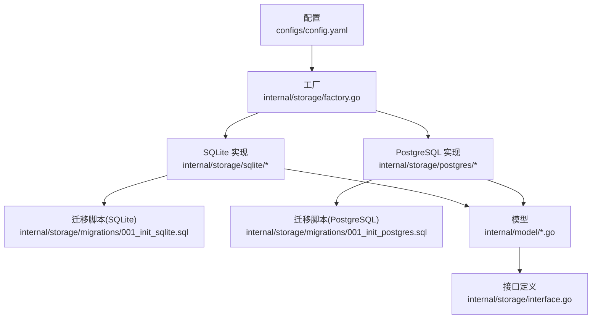
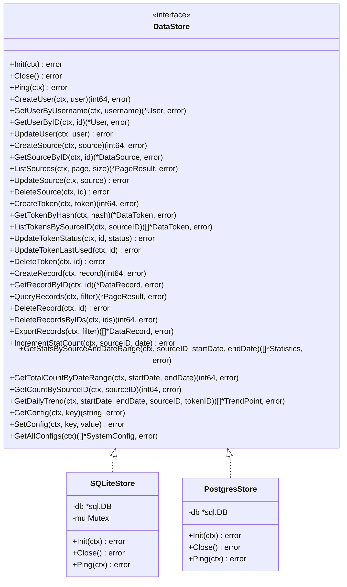
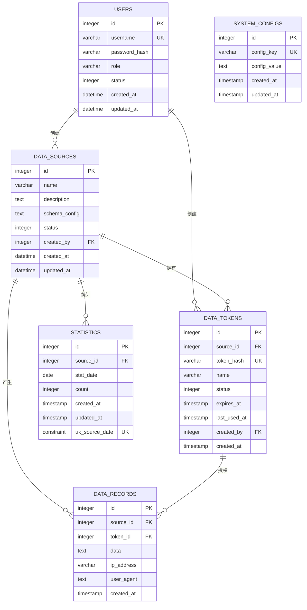
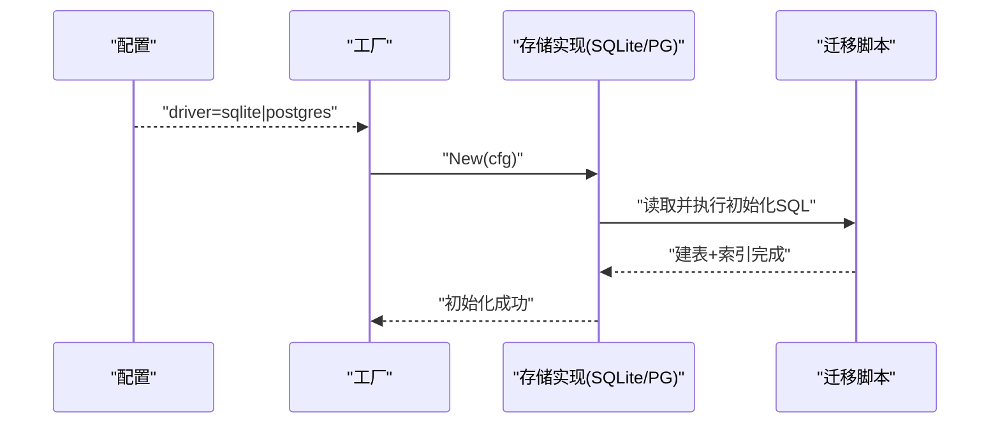
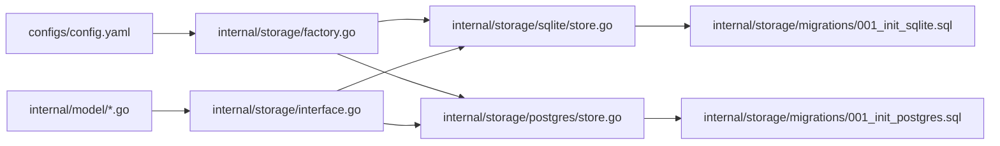

# 数据库设计

<cite>
**本文引用的文件**
- [configs/config.yaml](file://configs/config.yaml)
- [internal/storage/factory.go](file://internal/storage/factory.go)
- [internal/storage/interface.go](file://internal/storage/interface.go)
- [internal/storage/sqlite/store.go](file://internal/storage/sqlite/store.go)
- [internal/storage/postgres/store.go](file://internal/storage/postgres/store.go)
- [internal/storage/migrations/001_init_sqlite.sql](file://internal/storage/migrations/001_init_sqlite.sql)
- [internal/storage/migrations/001_init_postgres.sql](file://internal/storage/migrations/001_init_postgres.sql)
- [internal/storage/sqlite/user.go](file://internal/storage/sqlite/user.go)
- [internal/storage/postgres/user.go](file://internal/storage/postgres/user.go)
- [internal/model/user.go](file://internal/model/user.go)
- [internal/model/source.go](file://internal/model/source.go)
- [internal/model/token.go](file://internal/model/token.go)
- [internal/model/record.go](file://internal/model/record.go)
- [internal/model/statistics.go](file://internal/model/statistics.go)
- [internal/model/config.go](file://internal/model/config.go)
</cite>

## 目录
1. [简介](#简介)
2. [项目结构](#项目结构)
3. [核心组件](#核心组件)
4. [架构总览](#架构总览)
5. [详细组件分析](#详细组件分析)
6. [依赖分析](#依赖分析)
7. [性能考虑](#性能考虑)
8. [故障排查指南](#故障排查指南)
9. [结论](#结论)
10. [附录](#附录)

## 简介
本文件系统化阐述 DataCollector 的数据库设计与实现，覆盖：
- 数据库架构与表结构设计、实体关系与索引策略
- 数据模型字段定义、数据类型与约束
- SQLite 与 PostgreSQL 两种后端的差异与选型依据
- 数据库迁移机制与版本管理
- 查询优化与性能调优建议
- 备份与恢复策略
- 一致性与事务处理
- 监控与维护最佳实践

## 项目结构
围绕数据库相关的核心位置如下：
- 配置：通过配置文件指定数据库驱动与连接参数
- 接口层：统一的数据访问接口定义
- 工厂：根据配置动态创建具体存储实现
- 迁移：初始化脚本（SQLite 与 PostgreSQL）
- 存储实现：SQLite 与 PostgreSQL 的具体实现
- 模型：用户、数据源、Token、记录、统计、系统配置等模型

图表来源
- [configs/config.yaml:11-21](file://configs/config.yaml#L11-L21)
- [internal/storage/factory.go:11-21](file://internal/storage/factory.go#L11-L21)
- [internal/storage/sqlite/store.go:24-56](file://internal/storage/sqlite/store.go#L24-L56)
- [internal/storage/postgres/store.go:20-34](file://internal/storage/postgres/store.go#L20-L34)
- [internal/storage/migrations/001_init_sqlite.sql:1-97](file://internal/storage/migrations/001_init_sqlite.sql#L1-L97)
- [internal/storage/migrations/001_init_postgres.sql:1-91](file://internal/storage/migrations/001_init_postgres.sql#L1-L91)

章节来源
- [configs/config.yaml:11-21](file://configs/config.yaml#L11-L21)
- [internal/storage/factory.go:11-21](file://internal/storage/factory.go#L11-L21)
- [internal/storage/sqlite/store.go:24-56](file://internal/storage/sqlite/store.go#L24-L56)
- [internal/storage/postgres/store.go:20-34](file://internal/storage/postgres/store.go#L20-L34)

## 核心组件
- 数据库接口：统一抽象了初始化、连接测试、用户、数据源、Token、记录、统计、系统配置等操作
- 工厂：根据配置选择 SQLite 或 PostgreSQL 实现
- 迁移：分别提供 SQLite 与 PostgreSQL 的初始化脚本
- 存储实现：SQLite 使用 WAL 模式与串行化锁；PostgreSQL 使用连接池
- 模型：定义各实体的字段、类型与业务含义

章节来源
- [internal/storage/interface.go:9-56](file://internal/storage/interface.go#L9-L56)
- [internal/storage/factory.go:11-21](file://internal/storage/factory.go#L11-L21)
- [internal/storage/sqlite/store.go:17-56](file://internal/storage/sqlite/store.go#L17-L56)
- [internal/storage/postgres/store.go:14-34](file://internal/storage/postgres/store.go#L14-L34)

## 架构总览
数据库层采用“接口 + 工厂 + 具体实现 + 迁移”的分层设计，确保可插拔性与可维护性。

图表来源
- [internal/storage/interface.go:9-56](file://internal/storage/interface.go#L9-L56)
- [internal/storage/sqlite/store.go:17-21](file://internal/storage/sqlite/store.go#L17-L21)
- [internal/storage/postgres/store.go:14-17](file://internal/storage/postgres/store.go#L14-L17)

## 详细组件分析

### 数据模型与表结构设计
- 用户表 users
  - 字段与约束：自增主键、唯一用户名、密码哈希、角色、状态、时间戳
  - 索引：用户名、状态
- 数据源表 data_sources
  - 字段与约束：自增主键、名称、描述、JSON 配置、状态、创建者外键、时间戳
  - 索引：状态、创建者
- 数据 Token 表 data_tokens
  - 字段与约束：自增主键、数据源外键、唯一哈希、名称、状态、过期与最后使用时间、创建者外键、时间戳
  - 索引：数据源、哈希、状态
- 数据记录表 data_records
  - 字段与约束：自增主键、数据源与 Token 外键、JSON 数据、IP 与 UA、时间戳
  - 索引：数据源、Token、创建时间
- 统计表 statistics
  - 字段与约束：自增主键、数据源外键、日期、计数、时间戳；唯一约束(source_id, stat_date)
  - 索引：数据源、日期、(source_id, stat_date)
- 系统配置表 system_configs
  - 字段与约束：自增主键、唯一键、值、时间戳
  - 索引：键

SQLite 与 PostgreSQL 的差异要点：
- 主键：SQLite 使用自增整型，PostgreSQL 使用序列
- JSON 字段：SQLite 以文本存储，PostgreSQL 使用 JSONB
- 时间类型：SQLite 使用日期时间字符串或函数默认值，PostgreSQL 使用带时区的时间戳
- 索引策略一致，均覆盖高频查询字段

章节来源
- [internal/storage/migrations/001_init_sqlite.sql:4-13](file://internal/storage/migrations/001_init_sqlite.sql#L4-L13)
- [internal/storage/migrations/001_init_sqlite.sql:15-26](file://internal/storage/migrations/001_init_sqlite.sql#L15-L26)
- [internal/storage/migrations/001_init_sqlite.sql:28-41](file://internal/storage/migrations/001_init_sqlite.sql#L28-L41)
- [internal/storage/migrations/001_init_sqlite.sql:43-54](file://internal/storage/migrations/001_init_sqlite.sql#L43-L54)
- [internal/storage/migrations/001_init_sqlite.sql:56-66](file://internal/storage/migrations/001_init_sqlite.sql#L56-L66)
- [internal/storage/migrations/001_init_sqlite.sql:68-75](file://internal/storage/migrations/001_init_sqlite.sql#L68-L75)
- [internal/storage/migrations/001_init_sqlite.sql:77-97](file://internal/storage/migrations/001_init_sqlite.sql#L77-L97)
- [internal/storage/migrations/001_init_postgres.sql:4-13](file://internal/storage/migrations/001_init_postgres.sql#L4-L13)
- [internal/storage/migrations/001_init_postgres.sql:15-25](file://internal/storage/migrations/001_init_postgres.sql#L15-L25)
- [internal/storage/migrations/001_init_postgres.sql:27-38](file://internal/storage/migrations/001_init_postgres.sql#L27-L38)
- [internal/storage/migrations/001_init_postgres.sql:40-49](file://internal/storage/migrations/001_init_postgres.sql#L40-L49)
- [internal/storage/migrations/001_init_postgres.sql:51-60](file://internal/storage/migrations/001_init_postgres.sql#L51-L60)
- [internal/storage/migrations/001_init_postgres.sql:62-69](file://internal/storage/migrations/001_init_postgres.sql#L62-L69)
- [internal/storage/migrations/001_init_postgres.sql:71-91](file://internal/storage/migrations/001_init_postgres.sql#L71-L91)

### 实体关系图

图表来源
- [internal/storage/migrations/001_init_sqlite.sql:4-97](file://internal/storage/migrations/001_init_sqlite.sql#L4-L97)
- [internal/storage/migrations/001_init_postgres.sql:4-91](file://internal/storage/migrations/001_init_postgres.sql#L4-L91)

### 字段定义、数据类型与约束
- 用户 users
  - id：整型自增主键
  - username：长度限制、唯一、非空
  - password_hash：长度限制、非空
  - role：枚举字符串、非空
  - status：整型状态码、非空
  - created_at/updated_at：时间戳
- 数据源 data_sources
  - id：整型自增主键
  - name/description：字符串、非空/可空
  - schema_config：JSON 文本（SQLite）或 JSONB（PostgreSQL）、非空
  - status：整型状态码、非空
  - created_by：整型外键、非空
  - created_at/updated_at：时间戳
- 数据 Token data_tokens
  - id：整型自增主键
  - source_id：整型外键、非空
  - token_hash：长度限制、唯一、非空
  - name：字符串、非空
  - status/expires_at/last_used_at：整型状态码、可空时间戳
  - created_by：整型外键、非空
  - created_at：时间戳
- 数据记录 data_records
  - id：整型自增主键
  - source_id/token_id：整型外键、非空
  - data：JSON 文本（SQLite）或 JSONB（PostgreSQL）、非空
  - ip_address/user_agent：字符串/文本
  - created_at：时间戳
- 统计 statistics
  - id：整型自增主键
  - source_id/stat_date：外键+日期、联合唯一
  - count：整型计数、非空
  - created_at/updated_at：时间戳
- 系统配置 system_configs
  - id：整型自增主键
  - config_key：字符串、唯一、非空
  - config_value：文本
  - created_at/updated_at：时间戳

章节来源
- [internal/storage/migrations/001_init_sqlite.sql:4-97](file://internal/storage/migrations/001_init_sqlite.sql#L4-L97)
- [internal/storage/migrations/001_init_postgres.sql:4-91](file://internal/storage/migrations/001_init_postgres.sql#L4-L91)
- [internal/model/user.go:5-14](file://internal/model/user.go#L5-L14)
- [internal/model/source.go:8-19](file://internal/model/source.go#L8-L19)
- [internal/model/token.go:5-16](file://internal/model/token.go#L5-L16)
- [internal/model/record.go:8-17](file://internal/model/record.go#L8-L17)
- [internal/model/statistics.go:5-13](file://internal/model/statistics.go#L5-L13)
- [internal/model/config.go:5-12](file://internal/model/config.go#L5-L12)

### 索引策略
- users：username、status
- data_sources：status、created_by
- data_tokens：source_id、token_hash、status
- data_records：source_id、token_id、created_at
- statistics：source_id、stat_date、(source_id, stat_date)
- system_configs：config_key

这些索引覆盖高频查询路径（按用户名登录、按状态过滤、按数据源/Token/日期检索、按配置键查询），有助于提升查询性能并减少全表扫描。

章节来源
- [internal/storage/migrations/001_init_sqlite.sql:77-97](file://internal/storage/migrations/001_init_sqlite.sql#L77-L97)
- [internal/storage/migrations/001_init_postgres.sql:71-91](file://internal/storage/migrations/001_init_postgres.sql#L71-L91)

### SQLite 与 PostgreSQL 的差异与选择依据
- 主键与序列
  - SQLite：整型自增主键
  - PostgreSQL：SERIAL（底层序列）
- JSON 字段
  - SQLite：TEXT 存储 JSON
  - PostgreSQL：JSONB 支持高效查询与索引
- 时间类型
  - SQLite：DATETIME 默认值（函数或字符串）
  - PostgreSQL：TIMESTAMP WITH TIME ZONE
- 并发与连接
  - SQLite：默认最大并发连接为 1，适合单机、轻量场景；启用 WAL 提升读并发
  - PostgreSQL：连接池参数可配置，适合高并发与多写场景
- 事务与一致性
  - 两者均支持 ACID；PostgreSQL 在复杂查询与并发控制上更成熟

选择依据：
- SQLite：开发/测试、单机部署、小规模数据、无需高并发
- PostgreSQL：生产环境、高并发、复杂查询、需要 JSONB 能力与更强一致性保障

章节来源
- [internal/storage/sqlite/store.go:39-53](file://internal/storage/sqlite/store.go#L39-L53)
- [internal/storage/postgres/store.go:29-31](file://internal/storage/postgres/store.go#L29-L31)
- [internal/storage/migrations/001_init_sqlite.sql:20](file://internal/storage/migrations/001_init_sqlite.sql#L20)
- [internal/storage/migrations/001_init_postgres.sql:20](file://internal/storage/migrations/001_init_postgres.sql#L20)

### 数据库迁移机制与版本管理
- 迁移文件
  - SQLite：001_init_sqlite.sql
  - PostgreSQL：001_init_postgres.sql
- 执行流程
  - 工厂根据配置选择驱动
  - 初始化时读取对应迁移文件并执行
- 版本管理
  - 当前仅一个初始化版本；后续可通过新增迁移文件并在初始化中顺序执行实现版本演进

图表来源
- [internal/storage/factory.go:11-21](file://internal/storage/factory.go#L11-L21)
- [internal/storage/sqlite/store.go:58-75](file://internal/storage/sqlite/store.go#L58-L75)
- [internal/storage/postgres/store.go:36-50](file://internal/storage/postgres/store.go#L36-L50)
- [internal/storage/migrations/001_init_sqlite.sql:1-97](file://internal/storage/migrations/001_init_sqlite.sql#L1-L97)
- [internal/storage/migrations/001_init_postgres.sql:1-91](file://internal/storage/migrations/001_init_postgres.sql#L1-L91)

章节来源
- [internal/storage/factory.go:11-21](file://internal/storage/factory.go#L11-L21)
- [internal/storage/sqlite/store.go:58-75](file://internal/storage/sqlite/store.go#L58-L75)
- [internal/storage/postgres/store.go:36-50](file://internal/storage/postgres/store.go#L36-L50)

### 查询优化与性能调优
- 索引命中
  - 利用现有索引：users(username/status)、data_sources(status/created_by)、data_tokens(source_id/hash/status)、data_records(source_id/token_id/created_at)、statistics(source_id/date/(source_id,date))、system_configs(config_key)
- SQL 参数化
  - SQLite/PG 实现均使用参数化查询，避免注入并利于计划缓存
- 并发控制
  - SQLite：串行化锁与 WAL 模式，限制最大并发为 1，适合单写场景
  - PostgreSQL：合理设置连接池大小，避免过度连接导致资源争用
- JSON 查询
  - PostgreSQL 可利用 JSONB 查询能力；SQLite 以文本存储，需在应用层进行解析
- 分页与过滤
  - 记录查询支持按数据源、日期范围、分页参数过滤，建议结合索引与 LIMIT/OFFSET

章节来源
- [internal/storage/sqlite/store.go:39-53](file://internal/storage/sqlite/store.go#L39-L53)
- [internal/storage/postgres/store.go:29-31](file://internal/storage/postgres/store.go#L29-L31)
- [internal/storage/sqlite/user.go:11-34](file://internal/storage/sqlite/user.go#L11-L34)
- [internal/storage/postgres/user.go:11-33](file://internal/storage/postgres/user.go#L11-L33)
- [internal/model/record.go:19-26](file://internal/model/record.go#L19-L26)

### 备份与恢复策略
- SQLite
  - 文件级备份：直接复制数据库文件；WAL 模式下可在线备份（需考虑一致性）
  - 恢复：停止服务后替换数据库文件，或使用 SQLite 的备份 API
- PostgreSQL
  - 使用逻辑/物理备份工具（如 pg_dump、基础备份与归档日志）进行定期备份
  - 恢复：基于备份与 WAL 归档进行时间点恢复（PITR）

[本节为通用实践建议，不直接分析具体文件]

### 一致性保证与事务处理
- 事务边界
  - 单条写入（创建用户、数据源、Token、记录）在实现中以单语句执行
  - 批量删除（按 ID 列表）在实现中以单语句执行
- 串行化与并发
  - SQLite 通过串行化锁与 WAL 模式降低写冲突
  - PostgreSQL 通过连接池与锁机制保障并发一致性
- 外键约束
  - 所有外键关系在建表时声明，确保引用完整性

章节来源
- [internal/storage/sqlite/store.go:17-21](file://internal/storage/sqlite/store.go#L17-L21)
- [internal/storage/postgres/store.go:14-17](file://internal/storage/postgres/store.go#L14-L17)
- [internal/storage/sqlite/user.go:11-34](file://internal/storage/sqlite/user.go#L11-L34)
- [internal/storage/postgres/user.go:11-33](file://internal/storage/postgres/user.go#L11-L33)

### 监控与维护最佳实践
- 连接健康
  - 定期执行 Ping 检查数据库连通性
- 性能监控
  - 观察慢查询、索引使用率、锁等待与连接池利用率
- 日志与告警
  - 结合应用日志与数据库慢查询日志进行异常告警
- 维护任务
  - SQLite：定期 VACUUM（必要时）；关注 WAL 文件大小
  - PostgreSQL：定期统计更新、索引重建、归档清理

章节来源
- [internal/storage/sqlite/store.go:82-85](file://internal/storage/sqlite/store.go#L82-L85)
- [internal/storage/postgres/store.go:57-60](file://internal/storage/postgres/store.go#L57-L60)

## 依赖分析
- 配置驱动选择依赖工厂
- 工厂依赖具体存储实现
- 存储实现依赖迁移脚本
- 模型作为接口与实现之间的契约

图表来源
- [configs/config.yaml:11-21](file://configs/config.yaml#L11-L21)
- [internal/storage/factory.go:11-21](file://internal/storage/factory.go#L11-L21)
- [internal/storage/sqlite/store.go:24-56](file://internal/storage/sqlite/store.go#L24-L56)
- [internal/storage/postgres/store.go:20-34](file://internal/storage/postgres/store.go#L20-L34)
- [internal/storage/migrations/001_init_sqlite.sql:1-97](file://internal/storage/migrations/001_init_sqlite.sql#L1-L97)
- [internal/storage/migrations/001_init_postgres.sql:1-91](file://internal/storage/migrations/001_init_postgres.sql#L1-L91)
- [internal/storage/interface.go:9-56](file://internal/storage/interface.go#L9-L56)

## 性能考虑
- 选择合适的后端：小规模/单机优先 SQLite，高并发/生产优先 PostgreSQL
- 合理使用索引：遵循现有索引策略，避免过度索引导致写入成本上升
- 参数化查询：防止 SQL 注入并提升执行计划复用
- 并发与连接池：SQLite 限制并发，PostgreSQL 调整连接池大小
- JSON 查询：PostgreSQL 的 JSONB 更适合复杂查询与索引

[本节提供通用指导，不直接分析具体文件]

## 故障排查指南
- 连接失败
  - 检查配置中的驱动、主机、端口、凭据
  - 使用 Ping 接口验证连通性
- 迁移失败
  - 确认迁移文件可读且语法正确
  - 检查权限与路径（SQLite 文件路径）
- 写入冲突（SQLite）
  - 串行化锁导致阻塞，检查是否存在长时间事务或未提交的写入
- 查询缓慢
  - 检查是否命中索引，确认过滤条件与排序字段
  - 对于 PostgreSQL，检查执行计划与统计信息

章节来源
- [configs/config.yaml:11-21](file://configs/config.yaml#L11-L21)
- [internal/storage/sqlite/store.go:82-85](file://internal/storage/sqlite/store.go#L82-L85)
- [internal/storage/postgres/store.go:57-60](file://internal/storage/postgres/store.go#L57-L60)
- [internal/storage/sqlite/store.go:58-75](file://internal/storage/sqlite/store.go#L58-L75)
- [internal/storage/postgres/store.go:36-50](file://internal/storage/postgres/store.go#L36-L50)

## 结论
该数据库设计以清晰的接口与工厂模式实现可插拔的存储后端，通过合理的表结构、索引与迁移机制支撑核心业务。SQLite 适合轻量与单机场景，PostgreSQL 更适合生产与高并发需求。建议在生产中优先 PostgreSQL，并结合索引、连接池与监控体系持续优化性能与稳定性。

## 附录
- 配置项参考
  - 数据库驱动：sqlite 或 postgres
  - SQLite 路径：./data/datacollector.db
  - PostgreSQL 连接参数：host、port、user、password、dbname、sslmode
- 模型字段映射
  - 用户、数据源、Token、记录、统计、系统配置的字段与约束详见模型文件与迁移脚本

章节来源
- [configs/config.yaml:11-21](file://configs/config.yaml#L11-L21)
- [internal/model/user.go:5-14](file://internal/model/user.go#L5-L14)
- [internal/model/source.go:8-19](file://internal/model/source.go#L8-L19)
- [internal/model/token.go:5-16](file://internal/model/token.go#L5-L16)
- [internal/model/record.go:8-17](file://internal/model/record.go#L8-L17)
- [internal/model/statistics.go:5-13](file://internal/model/statistics.go#L5-L13)
- [internal/model/config.go:5-12](file://internal/model/config.go#L5-L12)